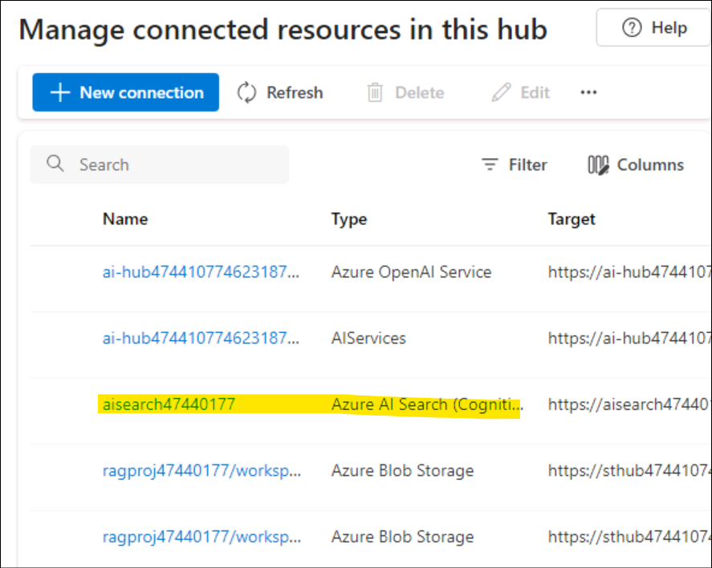
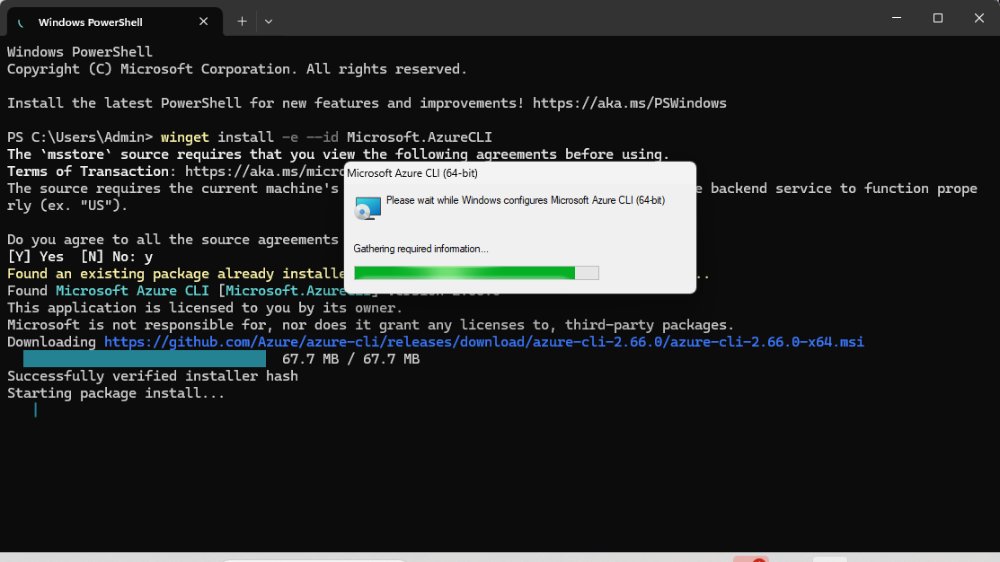

사용 사례 08- Azure AI Foundry SDK​로 맞춤형 챗 앱을 구축하기

**예상 소요 시간: 120분**

## 목표

이 실습의 목표는 Azure AI Foundry SDK를 활용해 RAG(Retrieval-Augmented
Generation) 기반의 에이전트를 구축, 평가, 그리고 배포하는 것입니다. 이
실습에서는 프로젝트 및 개발 환경을 설정하고, GPT-4와
text-embedding-ada-002와 같은 AI 모델을 배포하며, 문서 검색을 위한 Azure
AI Search를 연동하는 과정을 안내합니다. 이어서, 사용자 맞춤형 지식 검색
챗 애플리케이션을 개발하게 됩니다. 이 실습의 핵심은 AI 모델의 응답을
관련 제품 데이터에 기반하여 더욱 신뢰성 있게 만드는 것이며, 이를 위해
맞춤형 챗 인터페이스를 개발하고, 생성된 응답의 성능을 평가하는 단계까지
포함되어 있습니다.

## 솔루션

이 솔루션은 **Azure AI Foundry**에서 프로젝트를 설정하고, **GPT-4**와
**text-embedding-ada-002** 같은 AI 모델을 배포하며, 사용자 맞춤형 제품
데이터를 저장하고 검색할 수 있도록 **Azure AI Search**를 통합하는 과정을
포함합니다. 또한, Python 스크립트를 활용하여 벡터 임베딩을 생성하고,
검색 인덱스를 구축하며, 관련 제품 정보를 쿼리하는 작업도 수행됩니다.
검색 결과를 기반으로 신뢰성 있는 답변을 제공하기 위해 **RAG 기반 채팅
인터페이스**가 개발되며, 이 채팅 애플리케이션의 성능은 사전 정의된
데이터셋과 지표를 통해 평가되어 효율성을 향상시킵니다.

## 연습 0: VM 및 자격 증명 이해

이 연습에서는 전반적인 실습 과정에서 사용하게 될 자격 증명 정보를
식별하고 이해하는 과정을 진행합니다.

**중요 사항:** 이 실습을 진행하면서 각 단계를 충분히 숙지하여 실습
실행에 필요한 일반적인 용어와 자격 증명 정보를 이해하세요.

1.  **Instructions** 탭에는 실습을 진행하는 동안 따라야 할 지침이 포함된
    실습 가이드가 있습니다.

2.  **Resources** 탭에는 실습을 실행하는 데 필요한 자격 증명이 포함되어
    있습니다.

- **URL** – Azure 포털의 URL

- **Subscription** – 사용자에게 배정된 **Subscription ID**

- **Username** – **Azure services**에 **login**하는 데 필요한 **user
  ID**

- **Password** – **Azure login password**

> 이 사용자 이름(Username)과 비밀번호를 **Azure login credentials**으로
> 정의하겠습니다. **Azure login credentials**을 언급할 때마다 이 자격
> 증명을 사용할 것입니다.

- **Resource Group** – 사용자에게 할당된 **Resource group**

> **중요 사항**: 모든 리소스는 이 리소스 그룹 내에 생성해야 합니다.

3.  **Help** 탭에는 지원 정보가 포함되어 있습니다. 여기서 ID 값은 실습
    실행 중에 사용될 **Lab instance ID**입니다.

## 연습 1 - Azure AI Foundry SDK를 사용하여 맞춤형 지식 검색(RAG) 앱을 구축하기 위한 프로젝트 및 개발 환경 설정

### 작업 1: 프로젝트 생성하기

Azure AI Foundry에서 프로젝트를 생성하려면 다음 단계를 수행하세요:

1.  Login to the Azure AI Foundry at +++<https://ai.azure.com/>+++로
    Azure AI Foundry에 로그인하고, **Azure login credentials**로 **sign
    in**하세요.

> 

2.  **+ Create project** 선택하세요.

> 

3.  프로젝트 이름으로 +++**RAGproj\<Lab instance ID\>**+++를 입력하고
    **Customize**를 클릭하세요.

> **참고:** **\<Lab instance ID\>**를 **Lab instance ID**로 변경하세요.
>
> 

4.  다음 페이지에서 아래의 정보를 입력한 후, **Next**를 클릭하세요.

> Hub name - +++hub\<Lab instance ID\>+++
>
> Subscription - 할당된 구독 선택
>
> Create new Resource group - 할당된 리소스 그룹(ResourceGroup1) 선택
>
> Location - East US 2 또는 Sweden Central(이 실습을 실행하는 동안 East
> US 2 사용함)
>
> 나머지는 기본값으로 두고 **Next**를 클릭하세요.
>
> 

5.  **Review and finish** 페이지에서 **Create**을 클릭하세요.

> 

6.  리소스 생성에는 몇 분 정도 소요됩니다.

7.  팝업 창이 나타나면 닫아주세요..

8.  프로젝트의 홈 페이지에서 **Project connection string**을 확인한 후,
    다음 작업에서 사용할 수 있도록 메모장에 저장해 두세요.

> 

### 작업 2: 모델 배포하기

RAG 기반 채팅 앱을 구축하기 위해서는 두 가지 모델이 필요합니다: Azure
OpenAI 채팅 모델(gpt-4o-mini) 및 Azure OpenAI 임베딩
모델(text-embedding-ada-002). 각 모델마다 아래의 단계에 따라 Azure AI
Foundry 프로젝트에 배포하세요. 다음 단계는AI Foundry 포털의 [model
catalogue](https://learn.microsoft.com/en-us/azure/ai-studio/how-to/model-catalog-overview)의
실시간 엔드포인트로 모델을 배포하세요:

1.  왼쪽 탐색 창에서 **Model catalog**를 선택하세요.

> 

2.  모델 목록에서 **gpt-4o-mini**를 선택하세요. 검색창을 이용하면 더
    빠르게 찾을 수 있습니다.

> 

3.  모델 정보 페이지에서 **Deploy** 선택하세요.

> 

4.  기본 **Deployment name**은 기본값 그대로 두고 **Deploy**를
    선택하세요. 모델이 현재 지역에서 사용 불가능한 경우, 다른 사용
    가능한 지역이 자동으로 선택되어 프로젝트에 연결됩니다. 이 경우
    **Create resource and deploy**를 선택하세요.

> 
>
> 

5.  **gpt-4o-mini** 모델을 배포한 후, 같은 절차를 반복하여
    +++**text-embedding-ada-002**+++ 모델도 배포하세요.

### 작업 3: Azure AI Search 서비스 생성

이 애플리케이션의 목표는 모델 응답을 사용자 지정 데이터에
기반하도록(ground) 하는 것입니다. 검색 인덱스는 사용자의 질문에 맞는
관련 문서를 검색하는 데 사용됩니다. 검색 인덱스를 생성하려면 Azure AI
Search 서비스와 연결을 설정해야 합니다.

검색 인덱스를 생성하려면 Azure AI Search 서비스와 연결이 필요합니다.

1.  Azure 로그인 자격 증명을 사용하여
    +++<https://portal.azure.com>+++에서 Azure 포털에 로그인하세요.

2.  홈 페이지의 검색창에서 +++**AI search**+++를 검색하고 선택하세요.

3.  **+ Create** 아이콘을 클릭하고 다음 정보를 입력하세ㅇ.

> 

4.  아래 정보를 입력하고**Review + create** 선택하세요.

- Subscription – 할당된 구독 선택

- Resource Group – 할당된 리소스 그룹 선택

- Service name –+++**aisearch\<Lab instance ID\>**+++을 입력하되, Lab
  instance id는VM의 id로 변경해 입력

- Region - Sweden Central 또는 East US 2 선택(이 실습에서는 East US 2를
  사용하고 있음)

- Pricing tier –**Standard** 선택

> 

5.  정보를 검토한 후, **Create**를 선택하세요.

> 

6.  다음 단계로 진행하기 전에 아래 스크린샷과 같이 배포가 성공할 때까지
    기다리세요.

> 

### 작업 4: Azure AI Search를 프로젝트에 연결하기

Azure AI Foundry 포털에서 Azure AI Search 연결된 리소스를 확인하세요.

1.  Azure AI Foundry에서 프로젝트의 왼쪽 창에서 Management center를
    선택하세요.

> 

2.  **Connected resources** 섹션에서 **New connection**을 선택한 후,
    **Azure AI Search**를 선택하세요.

> 
>
> 

3.  **Authentication**에서 **API key**를 선택하고 **Add connection**를
    선택하세요.

> 
>
> 
>
> 

### 작업 5: Azure CLI 설치하고 로그인하기

Azure CLI를 설치하고 로컬 개발 환경에서 로그인하여 사용자 자격 증명을
사용해 Azure OpenAI 서비스를 호출할 수 있습니다.

1.  Windows 검색 창에서 +++**PowerShell**+++ 를 검색하고
    관리자(Administrator) 모드로 여세요.

> 

2.  Windows Power Shell을 열고 다음 명령을 붙여넣고 실행하세요.

> $progressPreference = 'silentlyContinue'
>
> Write-Host "Installing WinGet PowerShell module from PSGallery..."
>
> Install-PackageProvider -Name NuGet -Force | Out-Null
>
> Install-Module -Name Microsoft.WinGet.Client -Force -Repository
> PSGallery | Out-Null
>
> Write-Host "Using Repair-WinGetPackageManager cmdlet to bootstrap
> WinGet..."
>
> Repair-WinGetPackageManager
>
> Write-Host "Done."

3.  다음 명령을 사용해 터미널에서 Azure CLI를 설치하세요:

winget install -e --id Microsoft.AzureCLI

승인 요청이 표시되면 **Y**를 선택하세요.

4.  Azure CLI를 설치한 후 az login 명령을 사용해 로그인하고 브라우저를
    사용하여 로그인하세요:

+++Az login+++

**Work or school account** 선택하고 **Continue**를 클릭하세요.

5.  **Azure login credentials**로 로그인하세요.

6.  **Select a subscription** 프롬프트에 **1**을 입력하고 **Enter**를
    클릭하세요.

### 작업 6: 새로운 Python 환경 생성하기

먼저, 이 튜토리얼에 필요한 패키지를 설치하기 위해 새로운 Python 가상
환경을 생성해야 합니다. 절대로 전역 Python 환경에 패키지를 설치하지
마세요. Python 패키지를 설치할 때는 항상 가상 환경(virtual environment)
또는 conda 환경을 사용하는 것이 좋습니다. 그렇지 않으면 전역 Python
설치가 손상될 수 있습니다.

**가상 환경 생성**

1.  Power Shell에서 아래 명령을 실행하여 **C:\Users\Admin**으로
    이동하세요.

+++cd\\++

+++cd Users\Admin+++

2.  PowerShell에 다음 명령어를 입력하여 프로젝트 이름 **RAGproj\<Lab
    instance id\>**를 생성합니다.

**참고:** 아래 명령어에서 \<Project name\>을 프로젝트 이름으로 변경하고
실행하세요.

+++**mkdir \<Project name\>**+++

3.  터미널에서 다음 명령을 입력하여 새 폴더 위치로 이동하세요.

+++**cd \<Project name\>**+++

\<Project name\>을 이전 단계에서 생성한 폴더 이름으로 변경하세요.

4.  다음 명령을 사용하여 가상 환경을 생성하세요.

+++py -3 -m venv .venv+++

+++.venv\scripts\activate+++

> 
>
> Python 환경을 활성화한다는 것은 명령줄에서 python 또는 pip 명령어를
> 실행할 때, 애플리케이션의 .venv 폴더에 있는 Python 인터프리터를
> 사용하게 된다는 의미입니다.

5.  **VS Code** 여세요. Select **File -\> Open Folder** 선택한 후, 이전
    단계에서 생성한 **RAGproject** 폴더를 선택하세요.

### 작업 7: 패키지 설치

azure-ai-projects(preview) 및 azure-ai-inference(미리 보기), 패키지를
포함하여 필요한 다른 패키지들을 설치합니다.

1.  Create a file named in your **Project** 폴더에
    +++**requirements.txt**+++라는 이름의 파일을 생성하고, 아래 패키지
    목록을 해당 파일에 추가하세요.

> azure-ai-projects
>
> azure-ai-inference\[prompts\]
>
> azure-identity
>
> azure-search-documents
>
> pandas
>
> python-dotenv
>
> opentelemetry-api

> 

2.  상단 탐색 모음에서 **File**을 클릭한 다음 **Save All**을 선택하세요.

3.  requirements.txt파일을 마우스 오른쪽 버튼으로 클릭한**Open in
    Integrated Terminal**을 선택하세요.

4.  다음 명령을 실행하여 가상 환경으로 이동하세요.

py -3 -m venv .venv

.venv\scripts\activate

5.  +++az login+++ 명령을 실행하고Azure login 자격 증명으로
    로그인하세요. **1**을 선택하여 구독을 선택하세요.

6.  필요한 패키지를 설치하려면 다음 코드를 실행하세요.

+++pip install -r requirements.txt+++

> **참고:** pip의 새 버전 출시 알림이 나타나면, 아래 명령어를 실행하여
> pip을 업그레이드하세요.
>
> +++pip install -r requirements.txt+++

+++python.exe -m pip install --upgrade pip+++

> 

### 작업 8: 헬퍼 스크립트 생성

1.  터미널에서 다음 명령어를 실행하여 **src**라는 새 폴더를 생성하세요.

mkdir src

2.  **src** 폴더에 새 파일을 만들고 이름을 +++**config.py**+++로
    지정하세요.

3.  **config.py** 파일에 다음 코드를 추가하고 저장하세요.

\# ruff: noqa: ANN201, ANN001

import os

import sys

import pathlib

import logging

from azure.identity import DefaultAzureCredential

from azure.ai.projects import AIProjectClient

from azure.ai.inference.tracing import AIInferenceInstrumentor

\# load environment variables from the .env file

from dotenv import load_dotenv

load_dotenv()

\# Set "./assets" as the path where assets are stored, resolving the
absolute path:

ASSET_PATH = pathlib.Path(\_\_file\_\_).parent.resolve() / "assets"

\# Configure an root app logger that prints info level logs to stdout

logger = logging.getLogger("app")

logger.setLevel(logging.INFO)

logger.addHandler(logging.StreamHandler(stream=sys.stdout))

\# Returns a module-specific logger, inheriting from the root app logger

def get_logger(module_name):

return logging.getLogger(f"app.{module_name}")

\# Enable instrumentation and logging of telemetry to the project

def enable_telemetry(log_to_project: bool = False):

AIInferenceInstrumentor().instrument()

\# enable logging message contents

os.environ\["AZURE_TRACING_GEN_AI_CONTENT_RECORDING_ENABLED"\] = "true"

if log_to_project:

from azure.monitor.opentelemetry import configure_azure_monitor

project = AIProjectClient.from_connection_string(

conn_str=os.environ\["AIPROJECT_CONNECTION_STRING"\],
credential=DefaultAzureCredential()

)

tracing_link =
f"https://ai.azure.com/tracing?wsid=/subscriptions/{project.scope\['subscription_id'\]}/resourceGroups/{project.scope\['resource_group_name'\]}/providers/Microsoft.MachineLearningServices/workspaces/{project.scope\['project_name'\]}"

application_insights_connection_string =
project.telemetry.get_connection_string()

if not application_insights_connection_string:

logger.warning(

"No application insights configured, telemetry will not be logged to
project. Add application insights at:"

)

logger.warning(tracing_link)

return

configure_azure_monitor(connection_string=application_insights_connection_string)

logger.info("Enabled telemetry logging to project, view traces at:")

logger.info(tracing_link)

**참고**: 이 새로 생성된config.py 파일 스크립트는 다음 실습에서 사용될
예정입니다.

### 작업 9: 환경 변수 구성

Azure OpenAI 서비스를 코드에서 호출하려면 프로젝트 연결 문자열이
필요합니다. 이 quickstart에서는 이 값을 .env 파일에 저장합니다. .env
파일은 애플리케이션이 읽을 수 있는 환경 변수를 포함하는 파일입니다.

1.  **src** 디렉토리에 새로운 파일인 +++**.env**+++를 생성하고, 다음
    코드를 붙여넣으세요:

**\<your-connection-string\>**을 작업 1에서 메모장에 저장한 프로젝트
연결 문자열 값으로 교체하세요.

AIPROJECT_CONNECTION_STRING=\<your-connection-string\>

AISEARCH_INDEX_NAME="example-index"

EMBEDDINGS_MODEL="text-embedding-ada-002"

INTENT_MAPPING_MODEL="gpt-4o-mini"

CHAT_MODEL="gpt-4o-mini"

EVALUATION_MODEL="gpt-4o-mini"

**참고**: 귀하의 연결 문자열은 Azure AI Foundry 프로젝트 홈페이지의
**Overview**에서 찾을 수 있습니다..

## 연습 2: Azure AI Foundry SDK를 사용해 맞춤형 지식 검색(RAG) 앱 구축하기

### 작업 1: 채팅 앱을 위한 예시 데이터 생성

이 RAG 기반 애플리케이션의 목표는 모델의 응답을 맞춤형 데이터에 기반을
두는 것입니다. Azure AI Search 인덱스를 사용하여 임베딩 모델에서
벡터화된 데이터를 저장합니다. 이 검색 인덱스는 사용자의 질문에 대해 관련
문서를 검색하는 데 사용됩니다.

1.  열린 VS Code에서 **src** 폴더 아래에named +++**assets**+++라는
    이름의 폴더를 생성하세요.

2.  **C:\LabFiles**에서**products.csv** 파일을 복사하여 **Project** root
    폴더에 붙여넣으세요.

참고: 이 작업은 파일 탐색기에서 수행해야 하며, 이후 VS Code에
반영됩니다.

3.  상단 탐색 모음에서 **File**로 이동하여**Save all**를 클릭하세요.

### 작업 2: 검색 인덱스 생성

> 검색 인덱스는 임베딩 모델에서 벡터화된 데이터를 저장하는 데
> 사용됩니다. 이 검색 인덱스는 사용자의 질문에 따라 관련 문서를 검색하는
> 데 사용됩니다.

1.  VS 코드에서 src 폴더에 +++**create_search_index.py**+++라는 파일을
    생성합니다. (이 파일은 **assets** 폴더가 있는 동일한 디렉터리에
    생성해야 하며, **assets** 폴더 안에 생성하지 않도록 주의).

> 

2.  생성한 **create_search_index.py** 파일을 열고, 필요한 라이브러리를
    가져오고, 프로젝트 클라이언트를 생성하며, 몇 가지 설정을 구성하는
    다음 코드를 추가하세요:

> import os
>
> from azure.ai.projects import AIProjectClient
>
> from azure.ai.projects.models import ConnectionType
>
> from azure.identity import DefaultAzureCredential
>
> from azure.core.credentials import AzureKeyCredential
>
> from azure.search.documents import SearchClient
>
> from azure.search.documents.indexes import SearchIndexClient
>
> from config import get_logger
>
> \# initialize logging object
>
> logger = get_logger(\_\_name\_\_)
>
> \# create a project client using environment variables loaded from the
> .env file
>
> project = AIProjectClient.from_connection_string(
>
> conn_str=os.environ\["AIPROJECT_CONNECTION_STRING"\],
> credential=DefaultAzureCredential()
>
> )
>
> \# create a vector embeddings client that will be used to generate
> vector embeddings
>
> embeddings = project.inference.get_embeddings_client()
>
> \# use the project client to get the default search connection
>
> search_connection = project.connections.get_default(
>
> connection_type=ConnectionType.AZURE_AI_SEARCH,
> include_credentials=True
>
> )
>
> \# Create a search index client using the search connection
>
> \# This client will be used to create and delete search indexes
>
> index_client = SearchIndexClient(
>
> endpoint=search_connection.endpoint_url,
> credential=AzureKeyCredential(key=search_connection.key)
>
> )
>
> 

3.  이제 **create_search_index.py** 파일 끝에 색인을 정의하는 함수를
    추가합니다:

> import pandas as pd
>
> from azure.search.documents.indexes.models import (
>
> SemanticSearch,
>
> SearchField,
>
> SimpleField,
>
> SearchableField,
>
> SearchFieldDataType,
>
> SemanticConfiguration,
>
> SemanticPrioritizedFields,
>
> SemanticField,
>
> VectorSearch,
>
> HnswAlgorithmConfiguration,
>
> VectorSearchAlgorithmKind,
>
> HnswParameters,
>
> VectorSearchAlgorithmMetric,
>
> ExhaustiveKnnAlgorithmConfiguration,
>
> ExhaustiveKnnParameters,
>
> VectorSearchProfile,
>
> SearchIndex,
>
> )
>
> def create_index_definition(index_name: str, model: str) -\>
> SearchIndex:
>
> dimensions = 1536 \# text-embedding-ada-002
>
> if model == "text-embedding-3-large":
>
> dimensions = 3072
>
> \# The fields we want to index. The "embedding" field is a vector
> field that will
>
> \# be used for vector search.
>
> fields = \[
>
> SimpleField(name="id", type=SearchFieldDataType.String, key=True),
>
> SearchableField(name="content", type=SearchFieldDataType.String),
>
> SimpleField(name="filepath", type=SearchFieldDataType.String),
>
> SearchableField(name="title", type=SearchFieldDataType.String),
>
> SimpleField(name="url", type=SearchFieldDataType.String),
>
> SearchField(
>
> name="contentVector",
>
> type=SearchFieldDataType.Collection(SearchFieldDataType.Single),
>
> searchable=True,
>
> \# Size of the vector created by the text-embedding-ada-002 model.
>
> vector_search_dimensions=dimensions,
>
> vector_search_profile_name="myHnswProfile",
>
> ),
>
> \]
>
> \# The "content" field should be prioritized for semantic ranking.
>
> semantic_config = SemanticConfiguration(
>
> name="default",
>
> prioritized_fields=SemanticPrioritizedFields(
>
> title_field=SemanticField(field_name="title"),
>
> keywords_fields=\[\],
>
> content_fields=\[SemanticField(field_name="content")\],
>
> ),
>
> )
>
> \# For vector search, we want to use the HNSW (Hierarchical Navigable
> Small World)
>
> \# algorithm (a type of approximate nearest neighbor search algorithm)
> with cosine
>
> \# distance.
>
> vector_search = VectorSearch(
>
> algorithms=\[
>
> HnswAlgorithmConfiguration(
>
> name="myHnsw",
>
> kind=VectorSearchAlgorithmKind.HNSW,
>
> parameters=HnswParameters(
>
> m=4,
>
> ef_construction=1000,
>
> ef_search=1000,
>
> metric=VectorSearchAlgorithmMetric.COSINE,
>
> ),
>
> ),
>
> ExhaustiveKnnAlgorithmConfiguration(
>
> name="myExhaustiveKnn",
>
> kind=VectorSearchAlgorithmKind.EXHAUSTIVE_KNN,
>
> parameters=ExhaustiveKnnParameters(metric=VectorSearchAlgorithmMetric.COSINE),
>
> ),
>
> \],
>
> profiles=\[
>
> VectorSearchProfile(
>
> name="myHnswProfile",
>
> algorithm_configuration_name="myHnsw",
>
> ),
>
> VectorSearchProfile(
>
> name="myExhaustiveKnnProfile",
>
> algorithm_configuration_name="myExhaustiveKnn",
>
> ),
>
> \],
>
> )
>
> \# Create the semantic settings with the configuration
>
> semantic_search = SemanticSearch(configurations=\[semantic_config\])
>
> \# Create the search index definition
>
> return SearchIndex(
>
> name=index_name,
>
> fields=fields,
>
> semantic_search=semantic_search,
>
> vector_search=vector_search,
>
> )
>
> 

4.  이제 create_search_index.py에 함수를 추가하여 인덱스에 csv 파일을
    추가하는 함수를 생성하세요:

> \# define a function for indexing a csv file, that adds each row as a
> document
>
> \# and generates vector embeddings for the specified content_column
>
> def create_docs_from_csv(path: str, content_column: str, model: str)
> -\> list\[dict\[str, any\]\]:
>
> products = pd.read_csv(path)
>
> items = \[\]
>
> for product in products.to_dict("records"):
>
> content = product\[content_column\]
>
> id = str(product\["id"\])
>
> title = product\["name"\]
>
> url = f"/products/{title.lower().replace(' ', '-')}"
>
> emb = embeddings.embed(input=content, model=model)
>
> rec = {
>
> "id": id,
>
> "content": content,
>
> "filepath": f"{title.lower().replace(' ', '-')}",
>
> "title": title,
>
> "url": url,
>
> "contentVector": emb.data\[0\].embedding,
>
> }
>
> items.append(rec)
>
> return items
>
> def create_index_from_csv(index_name, csv_file):
>
> \# If a search index already exists, delete it:
>
> try:
>
> index_definition = index_client.get_index(index_name)
>
> index_client.delete_index(index_name)
>
> logger.info(f"🗑️ Found existing index named '{index_name}', and
> deleted it")
>
> except Exception:
>
> pass
>
> \# create an empty search index
>
> index_definition = create_index_definition(index_name,
> model=os.environ\["EMBEDDINGS_MODEL"\])
>
> index_client.create_index(index_definition)
>
> \# create documents from the products.csv file, generating vector
> embeddings for the "description" column
>
> docs = create_docs_from_csv(path=csv_file,
> content_column="description", model=os.environ\["EMBEDDINGS_MODEL"\])
>
> \# Add the documents to the index using the Azure AI Search client
>
> search_client = SearchClient(
>
> endpoint=search_connection.endpoint_url,
>
> index_name=index_name,
>
> credential=AzureKeyCredential(key=search_connection.key),
>
> )
>
> search_client.upload_documents(docs)
>
> logger.info(f"➕ Uploaded {len(docs)} documents to '{index_name}'
> index")
>
> 

5.  마지막으로 create_search_index.py에 아래 함수를 추가하여 인덱스를
    구축하고 클라우드 프로젝트에 등록하세요. 코드를 추가한 후 상단
    표시줄에서 Files로 이동하여 **Save all**을 클릭하세요.

> if \_\_name\_\_ == "\_\_main\_\_":
>
> import argparse
>
> parser = argparse.ArgumentParser()
>
> parser.add_argument(
>
> "--index-name",
>
> type=str,
>
> help="index name to use when creating the AI Search index",
>
> default=os.environ\["AISEARCH_INDEX_NAME"\],
>
> )
>
> parser.add_argument(
>
> "--csv-file", type=str, help="path to data for creating search index",
> default="assets/products.csv"
>
> )
>
> args = parser.parse_args()
>
> index_name = args.index_name
>
> csv_file = args.csv_file
>
> create_index_from_csv(index_name, csv_file)
>
> 

6.  **create_search_index.py** 파일을 우클릭하고 **Open in integrated
    terminal** 옵션을 선택하세요.

7.  터미널에서 Azure 로그인 자격 증명으로 로그인하고 계정을 인증하는
    지침을 따르세요:

> +++az login+++
>
> 
>
> 

8.  코드를 실행하여 로컬에서 인덱스를 구축하고 이를 클라우드 프로젝트에
    등록하세요:

> +++python create_search_index.py+++
>
> 

9.  스크립트를 실행한 후, Azure 포털에서 새로 생성된 인덱스를 확인할 수
    있습니다.

10. 할당된 **Resource Group -\> Your search service
    created(aisearchLabinstanceID) -\> Search management -\>
    Indexes**으로 이동하세요.

> 

11. 동일한 인덱스 이름으로 스크립트를 다시 실행하면, 동일한 인덱스의 새
    버전이 생성됩니다.

### 작업 3: 제품 문서 가져오기

> 이번 단계에서는 검색 인덱스에서 상품 문서를 가져오는 스크립트를
> 작성합니다. 이 스크립트는 사용자가 질문한 내용과 일치하는 문서를 검색
> 인덱스에서 찾아 반환합니다.
>
> **제품 문서 가져오기 스크립트 작성**
>
> 채팅 애플리케이션이 요청을 받으면, 데이터에서 관련 정보를 찾아
> 반환합니다. 이 스크립트는 Azure AI SDK를 사용해 검색 인덱스를 쿼리하여
> 사용자 질문에 맞는 문서를 찾아 채팅 애플리케이션에 전달합니다.

1.  VS Code에서 **src** 폴더에 +++**get_product_documents.py**+++라는
    파일을 생성하세요.

> 

2.  다음 코드를 파일에 복사하여 붙여넣으세요. 필요한 라이브러리를
    가져오고, 프로젝트 클라이언트를 생성하며 설정을 구성하는 코드부터
    시작합니다.

> import os
>
> from pathlib import Path
>
> from opentelemetry import trace
>
> from azure.ai.projects import AIProjectClient
>
> from azure.ai.projects.models import ConnectionType
>
> from azure.identity import DefaultAzureCredential
>
> from azure.core.credentials import AzureKeyCredential
>
> from azure.search.documents import SearchClient
>
> from config import ASSET_PATH, get_logger
>
> \# initialize logging and tracing objects
>
> logger = get_logger(\_\_name\_\_)
>
> tracer = trace.get_tracer(\_\_name\_\_)
>
> \# create a project client using environment variables loaded from the
> .env file
>
> project = AIProjectClient.from_connection_string(
>
> conn_str=os.environ\["AIPROJECT_CONNECTION_STRING"\],
> credential=DefaultAzureCredential()
>
> )
>
> \# create a vector embeddings client that will be used to generate
> vector embeddings
>
> chat = project.inference.get_chat_completions_client()
>
> embeddings = project.inference.get_embeddings_client()
>
> \# use the project client to get the default search connection
>
> search_connection = project.connections.get_default(
>
> connection_type=ConnectionType.AZURE_AI_SEARCH,
> include_credentials=True
>
> )
>
> \# Create a search index client using the search connection
>
> \# This client will be used to create and delete search indexes
>
> search_client = SearchClient(
>
> index_name=os.environ\["AISEARCH_INDEX_NAME"\],
>
> endpoint=search_connection.endpoint_url,
>
> credential=AzureKeyCredential(key=search_connection.key),
>
> )

3.  **get_product_documents.py** 파일에 제품 문서를 가져오는 함수를
    추가하세요.

> from azure.ai.inference.prompts import PromptTemplate
>
> from azure.search.documents.models import VectorizedQuery
>
> @tracer.start_as_current_span(name="get_product_documents")
>
> def get_product_documents(messages: list, context: dict = None) -\>
> dict:
>
> if context is None:
>
> context = {}
>
> overrides = context.get("overrides", {})
>
> top = overrides.get("top", 5)
>
> \# generate a search query from the chat messages
>
> intent_prompty = PromptTemplate.from_prompty(Path(ASSET_PATH) /
> "intent_mapping.prompty")
>
> intent_mapping_response = chat.complete(
>
> model=os.environ\["INTENT_MAPPING_MODEL"\],
>
> messages=intent_prompty.create_messages(conversation=messages),
>
> \*\*intent_prompty.parameters,
>
> )
>
> search_query = intent_mapping_response.choices\[0\].message.content
>
> logger.debug(f"🧠 Intent mapping: {search_query}")
>
> \# generate a vector representation of the search query
>
> embedding = embeddings.embed(model=os.environ\["EMBEDDINGS_MODEL"\],
> input=search_query)
>
> search_vector = embedding.data\[0\].embedding
>
> \# search the index for products matching the search query
>
> vector_query = VectorizedQuery(vector=search_vector,
> k_nearest_neighbors=top, fields="contentVector")
>
> search_results = search_client.search(
>
> search_text=search_query, vector_queries=\[vector_query\],
> select=\["id", "content", "filepath", "title", "url"\]
>
> )
>
> documents = \[
>
> {
>
> "id": result\["id"\],
>
> "content": result\["content"\],
>
> "filepath": result\["filepath"\],
>
> "title": result\["title"\],
>
> "url": result\["url"\],
>
> }
>
> for result in search_results
>
> \]
>
> \# add results to the provided context
>
> if "thoughts" not in context:
>
> context\["thoughts"\] = \[\]
>
> \# add thoughts and documents to the context object so it can be
> returned to the caller
>
> context\["thoughts"\].append(
>
> {
>
> "title": "Generated search query",
>
> "description": search_query,
>
> }
>
> )
>
> if "grounding_data" not in context:
>
> context\["grounding_data"\] = \[\]
>
> context\["grounding_data"\].append(documents)
>
> logger.debug(f"📄 {len(documents)} documents retrieved: {documents}")
>
> return documents

4.  스크립트를 직접 실행할 때 **함수가** 정상적으로 작동하는지
    **테스트하는** 코드를 추가하세요:

> if \_\_name\_\_ == "\_\_main\_\_":
>
> import logging
>
> import argparse
>
> \# set logging level to debug when running this module directly
>
> logger.setLevel(logging.DEBUG)
>
> \# load command line arguments
>
> parser = argparse.ArgumentParser()
>
> parser.add_argument(
>
> "--query",
>
> type=str,
>
> help="Query to use to search product",
>
> default="I need a new tent for 4 people, what would you recommend?",
>
> )
>
> args = parser.parse_args()
>
> query = args.query
>
> result = get_product_documents(messages=\[{"role": "user", "content":
> query}\])
>
> 

5.  **File**\> **Save all**를 클릭하세요.

### 작업 4: 의도 매핑(intent mapping)을 위한 프롬프트 템플릿 만들기

> **get_product_documents.py** 스크립트는 대화를 검색 쿼리로 변환하기
> 위해 프롬프트 템플릿을 사용합니다. 이 템플릿은 대화에서 사용자의
> 의도를 추출하는 방법을 안내합니다.

1.  스크립트를 실행하기 전에 프롬프트 템플릿을 생성하세요.
    **assets** 폴더 아래에 +++**intent_mapping.prompty**+++ 라는 파일을
    생성하세요:

> 

4.  아래 코드를 intent_mapping_prompty 일에 복사한 후, 상단 바에서
    Files로 이동하여**Save all**을 클릭하세요.

> ---
>
> name: Chat Prompt
>
> description: A prompty that extract users query intent based on the
> current_query and chat_history of the conversation
>
> model:
>
> api: chat
>
> configuration:
>
> azure_deployment: gpt-4o
>
> inputs:
>
> conversation:
>
> type: array
>
> ---
>
> system:
>
> \# Instructions
>
> \- You are an AI assistant reading a current user query and
> chat_history.
>
> \- Given the chat_history, and current user's query, infer the user's
> intent expressed in the current user query.
>
> \- Once you infer the intent, respond with a search query that can be
> used to retrieve relevant documents for the current user's query based
> on the intent
>
> \- Be specific in what the user is asking about, but disregard parts
> of the chat history that are not relevant to the user's intent.
>
> \- Provide responses in json format
>
> \# Examples
>
> Example 1:
>
> With a conversation like below:
>
> \`\`\`
>
> \- user: are the trailwalker shoes waterproof?
>
> \- assistant: Yes, the TrailWalker Hiking Shoes are waterproof. They
> are designed with a durable and waterproof construction to withstand
> various terrains and weather conditions.
>
> \- user: how much do they cost?
>
> \`\`\`
>
> Respond with:
>
> {
>
> "intent": "The user wants to know how much the Trailwalker Hiking
> Shoes cost.",
>
> "search_query": "price of Trailwalker Hiking Shoes"
>
> }
>
> Example 2:
>
> With a conversation like below:
>
> \`\`\`
>
> \- user: are the trailwalker shoes waterproof?
>
> \- assistant: Yes, the TrailWalker Hiking Shoes are waterproof. They
> are designed with a durable and waterproof construction to withstand
> various terrains and weather conditions.
>
> \- user: how much do they cost?
>
> \- assistant: The TrailWalker Hiking Shoes are priced at $110.
>
> \- user: do you have waterproof tents?
>
> \- assistant: Yes, we have waterproof tents available. Can you please
> provide more information about the type or size of tent you are
> looking for?
>
> \- user: which is your most waterproof tent?
>
> \- assistant: Our most waterproof tent is the Alpine Explorer Tent. It
> is designed with a waterproof material and has a rainfly with a
> waterproof rating of 3000mm. This tent provides reliable protection
> against rain and moisture.
>
> \- user: how much does it cost?
>
> \`\`\`
>
> Respond with:
>
> {
>
> "intent": "The user would like to know how much the Alpine Explorer
> Tent costs.",
>
> "search_query": "price of Alpine Explorer Tent"
>
> }
>
> user:
>
> Return the search query for the messages in the following
> conversation:
>
> {{#conversation}}
>
> \- {{role}}: {{content}}
>
> {{/conversation}}
>
> 

### 작업 5: 제품 문서 검색 스크립트 테스트

1.  이제 스크립트와 템플릿이 모두 준비되었으니, 스크립트를 실행하여 검색
    인덱스가 쿼리에 대해 어떤 문서를 반환하는지 테스트해 보세요. 터미널
    창에서 다음 명령어를 실행하세요:

> +++python get_product_documents.py --query "I need a new tent for 4
> people, what would you recommend?"+++
>
> 

### 작업 6: RAG(사용자 지정 지식 검색) 코드 개발

> 다음으로, 기본 채팅 애플리케이션에 RAG(Retrieval-Augmented Generation)
> 기능을 추가하는 사용자 지정 코드를 작성합니다.
>
> **RAG 기능이 있는 채팅 스크립트 생성하기**

1.  **src** 폴더에서 +++**chat_with_products.py**+++라는 새 파일을
    생성하세요. 이 스크립트는 사용자의 질문에 대해 제품 관련 문서를
    검색하고 응답을 생성하는 역할을 합니다.

> 

2.  필요한 라이브러리를 가져오고, 프로젝트 클라이언트를 생성하며, 설정을
    구성하는 코드를 추가하세요:

> import os
>
> from pathlib import Path
>
> from opentelemetry import trace
>
> from azure.ai.projects import AIProjectClient
>
> from azure.identity import DefaultAzureCredential
>
> from config import ASSET_PATH, get_logger, enable_telemetry
>
> from get_product_documents import get_product_documents
>
> \# initialize logging and tracing objects
>
> logger = get_logger(\_\_name\_\_)
>
> tracer = trace.get_tracer(\_\_name\_\_)
>
> \# create a project client using environment variables loaded from the
> .env file
>
> project = AIProjectClient.from_connection_string(
>
> conn_str=os.environ\["AIPROJECT_CONNECTION_STRING"\],
> credential=DefaultAzureCredential()
>
> )
>
> \# create a chat client we can use for testing
>
> chat = project.inference.get_chat_completions_client()
>
> 

3.  chat_with_products.py파일 끝에 RAG 기능을 사용하는 챗 함수를
    생성하는 코드를 추가하세요.

> from azure.ai.inference.prompts import PromptTemplate
>
> @tracer.start_as_current_span(name="chat_with_products")
>
> def chat_with_products(messages: list, context: dict = None) -\> dict:
>
> if context is None:
>
> context = {}
>
> documents = get_product_documents(messages, context)
>
> \# do a grounded chat call using the search results
>
> grounded_chat_prompt = PromptTemplate.from_prompty(Path(ASSET_PATH) /
> "grounded_chat.prompty")
>
> system_message =
> grounded_chat_prompt.create_messages(documents=documents,
> context=context)
>
> response = chat.complete(
>
> model=os.environ\["CHAT_MODEL"\],
>
> messages=system_message + messages,
>
> \*\*grounded_chat_prompt.parameters,
>
> )
>
> logger.info(f"💬 Response: {response.choices\[0\].message}")
>
> \# Return a chat protocol compliant response
>
> return {"message": response.choices\[0\].message, "context": context}
>
> 

4.  마지막으로, **chat** **function**을 실행하는 코드를 추가한 후,
    files로 이동하여S**ave all**을 클릭하세요.

> if \_\_name\_\_ == "\_\_main\_\_":
>
> import argparse
>
> \# load command line arguments
>
> parser = argparse.ArgumentParser()
>
> parser.add_argument(
>
> "--query",
>
> type=str,
>
> help="Query to use to search product",
>
> default="I need a new tent for 4 people, what would you recommend?",
>
> )
>
> parser.add_argument(
>
> "--enable-telemetry",
>
> action="store_true",
>
> help="Enable sending telemetry back to the project",
>
> )
>
> args = parser.parse_args()
>
> if args.enable_telemetry:
>
> enable_telemetry(True)
>
> \# run chat with products
>
> response = chat_with_products(messages=\[{"role": "user", "content":
> args.query}\])
>
> 

### 작업 7: 근거(grounded) 채팅 프롬프트 템플릿 작성하기

> **chat_with_products.py** 스크립트는 사용자의 질문에 응답을 생성하기
> 위해 프롬프트 템플릿을 호출합니다. 이 템플릿은 사용자의 질문과 검색된
> 문서를 기반으로 어떻게 응답을 생성할지 지시합니다. 이제 이 템플릿을
> 생성해봅시다.

1.  **assets** 폴더에 +++**grounded_chat.prompty**+++ 파일을 추가하세요.

> 

2.  다음 코드를 추가하세요: grounded_chat.prompty.

> ---
>
> name: Chat with documents
>
> description: Uses a chat completions model to respond to queries
> grounded in relevant documents
>
> model:
>
> api: chat
>
> configuration:
>
> azure_deployment: gpt-4o
>
> inputs:
>
> conversation:
>
> type: array
>
> ---
>
> system:
>
> You are an AI assistant helping users with queries related to outdoor
> outdooor/camping gear and clothing.
>
> If the question is not related to outdoor/camping gear and clothing,
> just say 'Sorry, I only can answer queries related to outdoor/camping
> gear and clothing. So, how can I help?'
>
> Don't try to make up any answers.
>
> If the question is related to outdoor/camping gear and clothing but
> vague, ask for clarifying questions instead of referencing documents.
> If the question is general, for example it uses "it" or "they", ask
> the user to specify what product they are asking about.
>
> Use the following pieces of context to answer the questions about
> outdoor/camping gear and clothing as completely, correctly, and
> concisely as possible.
>
> Do not add documentation reference in the response.
>
> \# Documents
>
> {{#documents}}
>
> \## Document {{id}}: {{title}}
>
> {{content}}
>
> {{/documents}}
>
> 

3.  **File\> Save all**를 클릭하세요.

> 

### 작업 8: RAG 기능을 사용해 채팅 스크립트 실행하기

1.  이제 스크립트와 템플릿이 준비되었으므로, RAG 기능이 포함된 챗봇 앱을
    테스트하기 위해 스크립트를 실행하세요:

> +++python chat_with_products.py --query "I need a new tent for 4
> people, what would you recommend?"+++
>
> 

### 작업 9: 텔레메트리 로깅 추가

1.  Azure 포털에서 **Subscriptions**을 선택한 후, 왼쪽 탐색 창의
    **Settings**에서 **Resource providers**를 선택하세요..

2.  +++**Microsoft.OperationalInsights**+++를 검색하여 선택한 후, 해당
    리소스 공급자의 세 개의 점을 클릭하고 **Register**을 선택하세요

> 

3.  동일한 절차를 따라 +++microsoft.insights+++를 등록하세요.

4.  등록이 성공적으로 완료되면, 성공 메시지가 표시될 때까지 기다린 후
    다음 단계로 진행하세요.

> 

5.  Azure AI Foundry에서 프로젝트에서 왼쪽 창의 **Access and Improve**
    아래의 **Tracing**을 선택한 후, **Create New**을 클릭하세요.

> 
>
> 

6.  리소스가 생성되었는지 확인하세요.

> 

7.  VS Code로 돌아가서, 프로젝트에 대한 텔레메트리 로그를 활성화하려면
    azure-monitor-opentelemetry를 설치하세요.

> +++pip install azure-monitor-opentelemetry+++
>
> 

8.  chat_with_products.py 스크립트를 사용할 때--enable-telemetry
    플래그를 추가하세요:

> +++python chat_with_products.py --query "I need a new tent for 4
> people, what would you recommend?" --enable-telemetry+++
>
> 

## 연습 3: Azure AI Foundry SDK를 사용해 맞춤형 채팅 애플리케이션 평가

### 작업 1: 채팅 앱 응답 품질 평가

이제 채팅 앱이 채팅 기록을 포함하여 쿼리에 잘 응답하는 것을
확인했으므로, 다양한 메트릭과 더 많은 데이터를 기준으로 성능을 평가할
시간입니다.

평가자는 평가 데이터셋과 get_chat_response() 타겟 함수를 사용해 평가를
수행한 후, 평가 결과를 분석합니다.

평가를 실행한 후, 시스템 프롬프트를 개선 등 논리를 개선하여 채팅 앱의
응답이 어떻게 변경되고 개선되는지 확인할 수 있습니다.

**평가 데이터셋 만들기**

다음 평가 데이터셋을 사용하세요. 이 데이터셋은 예시 질문과 예상
답변(정답)을 포함하고 있습니다.

1.  **assets** 폴더에 +++**chat_eval_data.jsonl**+++이라는 파일을
    생성하세요. .

> 

2.  이 데이터셋을 파일에 붙여넣고 저장(**save)**하세요.

> {"query": "Which tent is the most waterproof?", "truth": "The Alpine
> Explorer Tent has the highest rainfly waterproof rating at 3000m"}
>
> {"query": "Which camping table holds the most weight?", "truth": "The
> Adventure Dining Table has a higher weight capacity than all of the
> other camping tables mentioned"}
>
> {"query": "How much do the TrailWalker Hiking Shoes cost? ", "truth":
> "The Trailewalker Hiking Shoes are priced at $110"}
>
> {"query": "What is the proper care for trailwalker hiking shoes? ",
> "truth": "After each use, remove any dirt or debris by brushing or
> wiping the shoes with a damp cloth."}
>
> {"query": "What brand is TrailMaster tent? ", "truth":
> "OutdoorLiving"}
>
> {"query": "How do I carry the TrailMaster tent around? ", "truth": "
> Carry bag included for convenient storage and transportation"}
>
> {"query": "What is the floor area for Floor Area? ", "truth": "80
> square feet"}
>
> {"query": "What is the material for TrailBlaze Hiking Pants?",
> "truth": "Made of high-quality nylon fabric"}
>
> {"query": "What color does TrailBlaze Hiking Pants come in?", "truth":
> "Khaki"}
>
> {"query": "Can the warrenty for TrailBlaze pants be transfered? ",
> "truth": "The warranty is non-transferable and applies only to the
> original purchaser of the TrailBlaze Hiking Pants. It is valid only
> when the product is purchased from an authorized retailer."}
>
> {"query": "How long are the TrailBlaze pants under warranty for? ",
> "truth": " The TrailBlaze Hiking Pants are backed by a 1-year limited
> warranty from the date of purchase."}
>
> {"query": "What is the material for PowerBurner Camping Stove? ",
> "truth": "Stainless Steel"}
>
> {"query": "Is France in Europe?", "truth": "Sorry, I can only queries
> related to outdoor/camping gear and equipment"}
>
> 

### 작업 2: Azure AI 평가 도구를 사용하여 평가하기

이제 다음 작업을 수행할 평가 스크립트를 정의하세요:

- 챗봇 로직을 감싸는 타겟 함수 래퍼(wrapper)를 생성

- 샘플 .jsonl 데이터셋을 로드

- 타겟 함수와 챗봇 응답을 평가 데이터셋과 병합하여 평가를 실행

- GPT의 지원 받아 관련성, 사실 기반성, 일관성과 같은 메트릭을 생성하여
  챗봇 응답의 품질 평가

- 평가 결과를 로컬에 출력하고, 클라우드 프로젝트에 기록

이 스크립트를 통해 평가 결과를 명령줄에 출력하고 JSON 파일로
저장하여 로컬에서 확인할 수 있습니다.

또한 이 스크립트는 평가 결과를 클라우드 프로젝트에 기록하여, UI에서 여러
평가 실행 결과를 비교할 수 있도록 해줍니다.

1.  **src** 폴더 아래에 +++evaluate.py+++라는 파일을 생성하세요.

> 

1.  다음 코드를 추가하여 필요한 라이브러리를 가져오고, 프로젝트
    클라이언트를 생성하며, 설정을 구성하세요:

> import os
>
> import pandas as pd
>
> from azure.ai.projects import AIProjectClient
>
> from azure.ai.projects.models import ConnectionType
>
> from azure.ai.evaluation import evaluate, GroundednessEvaluator
>
> from azure.identity import DefaultAzureCredential
>
> from chat_with_products import chat_with_products
>
> \# load environment variables from the .env file at the root of this
> repo
>
> from dotenv import load_dotenv
>
> load_dotenv()
>
> \# create a project client using environment variables loaded from the
> .env file
>
> project = AIProjectClient.from_connection_string(
>
> conn_str=os.environ\["AIPROJECT_CONNECTION_STRING"\],
> credential=DefaultAzureCredential()
>
> )
>
> connection =
> project.connections.get_default(connection_type=ConnectionType.AZURE_OPEN_AI,
> include_credentials=True)
>
> evaluator_model = {
>
> "azure_endpoint": connection.endpoint_url,
>
> "azure_deployment": os.environ\["EVALUATION_MODEL"\],
>
> "api_version": "2024-06-01",
>
> "api_key": connection.key,
>
> }
>
> groundedness = GroundednessEvaluator(evaluator_model)
>
> 

2.  쿼리 및 응답 평가를 위한 평가 인터페이스를 구현하는 래퍼
    함수(wrapper function)를 생성하는 코드를 추가하세요:

> def evaluate_chat_with_products(query):
>
> response = chat_with_products(messages=\[{"role": "user", "content":
> query}\])
>
> return {"response": response\["message"\].content, "context":
> response\["context"\]\["grounding_data"\]}
>
> 

3.  마지막으로, 평가를 실행하고 결과를 로컬에서 확인하며 AI Foundry
    포털에서 평가 결과 링크를 제공하는 코드를 추가하세요.

> \# Evaluate must be called inside of \_\_main\_\_, not on import
>
> if \_\_name\_\_ == "\_\_main\_\_":
>
> from config import ASSET_PATH
>
> \# workaround for multiprocessing issue on linux
>
> from pprint import pprint
>
> from pathlib import Path
>
> import multiprocessing
>
> import contextlib
>
> with contextlib.suppress(RuntimeError):
>
> multiprocessing.set_start_method("spawn", force=True)
>
> \# run evaluation with a dataset and target function, log to the
> project
>
> result = evaluate(
>
> data=Path(ASSET_PATH) / "chat_eval_data.jsonl",
>
> target=evaluate_chat_with_products,
>
> evaluation_name="evaluate_chat_with_products",
>
> evaluators={
>
> "groundedness": groundedness,
>
> },
>
> evaluator_config={
>
> "default": {
>
> "query": {"${data.query}"},
>
> "response": {"${target.response}"},
>
> "context": {"${target.context}"},
>
> }
>
> },
>
> azure_ai_project=project.scope,
>
> output_path="./myevalresults.json",
>
> )
>
> tabular_result = pd.DataFrame(result.get("rows"))
>
> pprint("-----Summarized Metrics-----")
>
> pprint(result\["metrics"\])
>
> pprint("-----Tabular Result-----")
>
> pprint(tabular_result)
>
> pprint(f"View evaluation results in AI Studio:
> {result\['studio_url'\]}")
>
> 

4.  상단 탐색 모음에서 **File**을 클릭한 후 **Save All**을 클릭하세요.

### 작업 3: 평가 모델 구성

평가 스크립트가 모델을 여러 번 호출하기 때문에, 평가 모델의 분당 토큰 수
제한을 늘리고 싶을 수 있습니다.

처음에는 평가 모델의 이름인 gpt-4o-mini를 지정하는 **.env** 파일을
생성했습니다. 용 가능한 할당량이 있는 경우 이 모델에 대한 분당 토큰
제한을 늘려보세요. 만약 할당량이 부족하여 값을 늘릴 수 없다면 걱정하지
마세요. 스크립트는 제한 오류를 처리하도록 설계되었습니다.

1.  Azure AI Foundry 포털의 프로젝트에서 **Models + endpoints**를
    클릭하고 **gpt-4o-mini**를 선택하세요.

> 

2.  **gpt-4o-mini**선택하고 **Edit**를 클릭하세요.

> 

3.  **Tokens per Minute Rate Limit** 값을 허용되는 최대 한도로 설정한
    후, **Save and** **Close**를 선택하세요.

> 

### 작업 4: 평가 실행 

1.  Azure AI Foundry에서 왼쪽 창에서 **Evaluations**를 선택한 후, **+
    New Evaluation**을 선택하세요.

2.  **Dataset** 선택하세요.

3.  Basic information페이지에서 기본값을 그대로 두고 **Next**를
    클릭하세요.

4.  **Add your** **dataset** -\> **Upload file**을
    클릭하고, **assets** 폴더에 생성한 **chat_eval_data.jsonl** 파일을
    업로드한 후 **Next**를 클릭하세요.

5.  AI quality와 Risk and safety metrics 아래에서 **Metrics**를
    선택하세요.

6.  아래 스크린샷와 같이 **Data source** 유형을 선택하고 **Next**를
    클릭하세요.

7.  **Submit** 선택하여 평가를 제출하세요.

8.  평가가 완료되면 결과를 살펴보세요.

## 연습 4: 리소스를 삭제하기

1.  Azure 포털 홈 페이지에서 할당된 Resource group을 선택한 후, Resource
    group에 속한 모든 리소스를 선택하고 Delete를 클릭하세요.

2.  +++**delete**+++ 를 입력한 후 **Delete** 버튼을 클릭하여 삭제를
    확인하세요. 삭제 확인 대화 상자에서 **Delete**를 클릭하세요.

3.  성공 메시지와 함께 모든 리소스의 삭제를 확인하세요.

> **요약:**
>
> 이 실습에서는 RAG 기반 애플리케이션을 구축, 평가 및 배포하는 방법을
> 배웠습니다.
