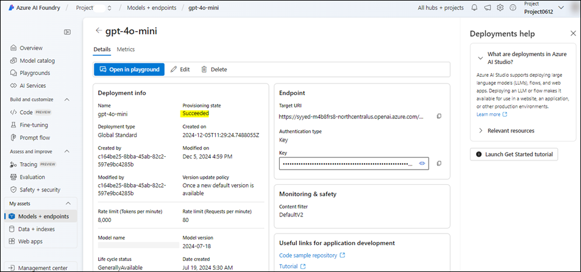
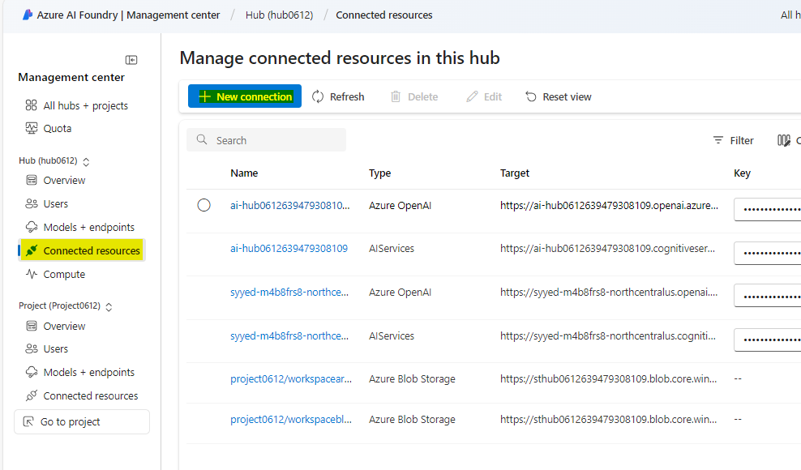

# **소개**

Azure OpenAI Assistants(미리 보기)는 코드 인터프리터, 맞춤형 함수와 같은
고급 도구로 보강된 맞춤형 지침을 통해 사용자의 필요에 맞춘 AI
어시스턴트를 생성할 수 있게 해줍니다.

이 실습은 Azure OpenAI 서비스를 설정하고 Bing Search Integration과 함께
활용해 복잡한 작업 처리를 위한 고급 AI 어시스턴트 및 다중 에이전트
프레임워크를 구축하는 데 중점을 둡니다. AI 모델을 배포하고, 어시스턴트
기능을 탐색하며, 복잡한 작업 처리를 위한 다중 에이전트 상호 작용을
구현합니다.

**목표**

- Azure에서 Bing Search Service 리소스 생성

- Azure OpenAI 리소스를 배포 및 구성

- GPT-4, GPT-4 Vision 및 DALL-E-3과 같은 특정 Azure OpenAI 모델 배포

- Azure OpenAI Studio 사용하여 AI 어시스턴트를 탐색 및 프로토타입 생성

- Bing 검색 API를 활용하여 어시스턴트 기능을 향상시키는 함수 호출을 구현

- 협업 AI 작업을 위한 다중 모달 다중 에이전트 프레임워크를 Azure
  Assistant API를 사용하여 구축

- 배포된 리소스와 모델을 삭제

## **작업 1: Bing Search Service 리소스 생성기**

1.  **Portal Menu** 클릭한 후, **+ Create a resource** 선택하세요.

> 

2.  **Create a resource** 페이지 검색 창에 **Bing Search v7**를 입력하고
    표시된 **bing search v7**을 클릭하세요.

3.  **Bing Search v7** 섹션을 클릭하세요.

4.  **Create a search service** 페이지에 다음 정보를 입력하고
    **Review+create** 버튼을 클릭하세요.

[TABLE]

5.  유효성 검사(Validation)가 통과되면**Create** 버튼을 클릭하세요.

6.  배포가 완료되면 **Go to resource** 버튼을 클릭하세요.

7.  **bingsearchaoaiXX** 창에서 **Resource management** 섹션으로 이동한
    후 **Keys and Endpoint**를 클릭하세요.

8.  **Keys and Endpoints** 페이지에서**KEY1**(*KEY1 또는 KEY2 사용
    가능)* 및 **Endpoint**를 복사하여 메모장에 붙여놓으세요(이미지
    참고). 그 후, 메모장을 저장**(Save)**하여 향후 작업에 이 정보를
    사용할 수 있습니다.

## **작업 2: Azure OpenAI 리소스 생성하기**

1.  Azure 포털 홈 페이지에서, 아래 이미지와 같이 Microsoft Azure **명령
    모음의 왼쪽에 있는 세 개의 가로 막대 아이콘**(햄버거 메뉴)을
    클릭하여 **Azure portal menu**를 여세요.

> 

2.  **+ Create a resource**를 찾아 클릭하세요.

> 

3.  **Create a resource** 페이지에서 **Search services and marketplace**
    검색창에 **Azure OpenAI**를 입력한 후 **Enter** 버튼을 누르세요.

> 

4.  In the **Marketplace** 페이지에서**Azure OpenAI** 섹션으로 이동한
    후, Create 버튼의 드롭다운을 클릭하고, 아래 이미지와 같이 **Azure
    OpenAI** 를 선택하세요(이미 **Azure OpenAI** 타일을 클릭한 상태라면,
    **Azure OpenAI page**에서 **Create** 버튼을 클릭).

> 

[TABLE]

5.  **Create Azure OpenAI** 창의 **Basics** 탭에서 다음 정보를 입력하고
    **Next** 버튼을 클릭하세요.

> 

6.  **Network** 탭에서 모든 라디오 버튼을 기본 상태로 두고, **Next**
    버튼을 클릭하세요.

> 

7.  **Tags** 탭에서 모든 필드를 기본 상태로 두고, **Next** 버튼을
    클릭하세요.

> 

8.  **Review+submit** 탭에서 유효성 검사(Validation)가 통과되면,
    **Create** 버튼을 클릭하세요.

> 

9.  배포가 완료될 때까지 기다리세요. 배포는 약 **2-3**분이 소요됩니다.

10. 배포가 완료되면, **Microsoft.CognitiveServicesOpenAI** 창에**Go to
    resource** 버튼을 클릭하세요.

> 

11. 왼쪽 탐색 메뉴에서 **Keys and Endpoints** 를 클릭한 후, 엔드포인트
    값을 메모장에 **AzureAI ENDPOINT**로 복사하고, 키 값을
    **AzureAIKey**라는 변수에 복사하세요

> 

## 작업 3: Azure OpenAI 모델 배포

1.  **AzureOpenAI-AssistantsXX** 에서 왼쪽 탐색 메뉴에서 **Overview** 를
    클릭한 후, **Explore Azure AI Foundry portal** 버튼을 클릭하여 새
    브라우저에서**Azure AI Foundry Studio**를 여세요.

> 

2.  **Azure AI Foundary | Azure OpenAI Service** 창에서 왼쪽 탐색
    메뉴에서 **Deployment** 선택하세요**.**

> 

12. **Deployments** 창에서 **+Deploy model**을 드롭다운하고 **Deploy
    base model**을 선택하세요.

> 

13. **Select a model** 대화 상자에서 **gpt-4**를 탐색하여 선택한 후,
    **Confirm** 버튼을 클릭하세요.

> 

3.  **Deploy model 대화 상자**에서 다음 정보를 입력하고 **Create**
    버튼을 클릭하세요.

- Select Model: **gpt-4**

- Model Version**: 1106-Preview**

- Deployment Name: **gpt-4** 입력

- **Advanced options** 선택하고**Deployment type**으로**Standard**을
  선택하세요.

> 

4.  **Deployments** 페이지에서 +**Create new deployment**를 클릭하세요.

5.  **Deployments** 창에서 **+Deploy model**을 드롭다운하고 **Deploy
    base model**을 선택하세요.

> 

14. **Select a model** 대화 상자에서 **gpt-4**를 탐색하고 선택한 후,
    **Confirm** 버튼을 클릭하세요.

> 

6.  **Deploy model** 대화 상자의 **Select a model**에서 드롭다운을
    클락하여 **gpt-4** 필드를 선택하고, **Model version**에서
    **vision-preview**를 선택한 후, **Deployment name**에서
    +++**gpt-4-vision+++**를 입력하세요. **Create** 버튼을 클릭하세요.

> 
>
> 

7.  **Deployments** 창에서 **+Deploy model** 을 드롭다운하고 **Deploy
    base model**을 선택하세요.

> 

15. **Select a model** 대화 상자에서 **dall-e-3**를 탐색한 후
    선택하세요. 그 후, **Confirm** 버튼을 클릭하세요.

> 

8.  In the **Deploy model** 대화 상자에서 **Select a model** 의 드롭다운
    메뉴에서 **dall-e-3** 필드를 선택하세요. **Model
    version**에서**Auto-update to default**을 선택하고, **Deployment
    name** 에는 !!**dall-e-3**!!를 입력하세요. **Create** 버튼을
    클릭하세요.

> 
>
> 

## 작업 4: Assistant의 플레이그라운드 탐색

1.  Azure AI Foundry |Azure OpenAI Service 홈페이지의 **Playgrounds**
    에서 **Assistants playground**을 클릭하세요.

2.  **Assistants playground** 창에서 **+Create an assistant**를
    선택하세요.

3.  Assistants playground 사용 시 코드를 실행할 필요 없ㅇ AI
    어시스턴트를 탐색, 프로토타입 및 테스트할 수 있습니다. 이 페이지에서
    새로운 아이디어를 빠르게 실험하고 반복해볼 수 있어요.

4.  Assistant 설정 창에 아래 정보를 입력하세요:

- Assistant a name: +++**Math Assist+++**

- Instructions: 다음 지침을 입력하세요 +++**You are an AI assistant that
  can write code to help answer math questions+++**

- Deployment: **gpt-4**

- **Code interpreter 활정화** 토글을 선택하세요.

> 
>
> 

5.  Assistant 설정 창에서**Select assistant**을 선택하세요.

6.  Select an assistant tab 탭에서 **Math Assist**를 선택하고**Select**
    버튼을 클릭하세요.

7.  어시스턴트에게 할 질문을 입력하세요: +++**I need to solve the
    equation 3x + 11 = 14. Can you help me?**+++

8.  R**un** 버튼을 선택하세요 .

> 

답이 올바른 것은 확인했지만, 이 결과가 단순히 학습 데이터에서 가져온
것이 아니라 모델이 코드 인터프리터를 실제로 활용해 도출한 것인지 또는
생성된 코드가 유효한지 확인하기 위해 추가 질문을 해보겠습니다.

9.  추가 질문을 입력하세요: +++**Show me the code you ran to get this
    solution.+++** **Add** 및 **run** 버튼을 선택하세요. 

오른쪽 패널에 있는 로그를 확인하면 코드 인터프리터가 실제로 사용되었는지
또는 응답을 생성하는 데 실행된 코드가 유효한지도 검증할 수 있습니다.
코드 인터프리터는 모델이 복잡한 수학 문제에 대응할 수 있도록 질문을
코드로 변환해 샌드박스된 Python 환경에서 실행할 수 있게 해주지만, 모델이
질문을 올바르게 코드로 해석했는지 확인하기 위해 응답을 직접 검증하는
과정도 여전히 중요합니다..

## 작업 5: Bing Search를 사용한 Assistant 함수 호출

이 Notebook에서는 Bing Search API 및 함수 호출 기능을 사용하여 웹의
데이터에서 Azure OpenAI 모델을 접지하는 방법을 소개합니다. 이 방식은
모델이 최신 웹 데이터를 활용할 수 있도록 하는 훌륭한 방법입니다.

이번 샘플은 함수 호출 기능 및 검색 기반 접지에 대해 배우고자 하는
개발자와 데이터 과학자에게 유용할 것입니다.

1.  Windows 검색 상자에 Visual Studio를 입력한 다음 **Visual Studio
    Code**를 클릭하세요.

> 

2.  **Visual Studio Code** 편집기에서 **File**을 클릭한 후**Open
    Folder**를 탐색해 클릭하세요.

> 

1.  **C:\LabFiles**에서 **Assistants** 폴더를 찾아 선택하고 **Select
    Folder** 버튼을 클릭하세요.

3.  다음 대화 상자가 표시되는 경우 **Yes, I trust the author** 버튼을
    클릭하세요 - **Do you trust the authors of the files in this
    folder?**

4.  Visual Studio Code에서 **ASSISTANTS**을 드롭다운하고,
    **function_calling**에서**assistants_function_calling_with_bing_search.ipynb**
    notebook을 선택하세요.

5.  Visual Studio Code 편집기의 메인 페이지에서 **install requirements**
    섹션으로 스크롤한 후 첫 번째 셀을 실행하세요. 환경을 선택하라는
    메시지가 표시되면, 이미지와 같이 **Python Environments**을
    선택하세요.

6.  경로 선택 메시지가 표시되면, 다음 이미지와 같이 **Python 3.12.2
    (또는 그 이후 버전)** 경로를 선택하세요.

7.  매개변수를 업데이트하고**Azure OpenAI Endpoint, Azure OpenAI
    Key(Task 2**에서 메모장에 저장한 값**), Bing search subscription
    key** 를 **Task 1**에서 메모장에 저장한 값으로
    업데이트하세요.

8.  Bing Search API를 호출하는 함수를 정의한 후, 3번째와 4번째 셀을
    선택하세요. 그 후, Bing Search API를 호출하는 함수를 정의한 후,
    3번째와 4번째 셀을 선택하세요. 그런 다음 start icon을 클릭하여 셀을
    실행하세요.을 클릭하여 셀을 실행하세요.

9.  전체 프로세스를 끝까지 실행하려면 5번, 6번, 7번, 8번째 셀을 선택한
    후, **start icon**을 클릭하여 셀을 실행하세요.

## **작업 6: Azure Assistant API를 활용한 멀티모달 멀티 에이전트 프레임워크 구축**

이 레포지토리는 **Azure OpenAI Assistant API**를 사용하여 멀티 에이전트
시스템을 만드는 패턴을 단계별로 안내합니다.

이 Notebook에 포함된 예제는 Azure Assistant API를 활용해 멀티 에이전트
프레임워크를 구축하는 방법을 보여주며, 여러 AI 에이전트를 협업 구조로
활용하고자 하는 개발자들에게 종합적인 가이드 역할을 합니다. 이 예제의
핵심은 에이전트들이 서로 소통하고 협력하여 복잡한 작업을 처리하는 방식을
실질적으로 보여주는 데 있습니다. 예를 들어, 사용자의 입력을 기반으로
이미지를 반복적으로 생성하고 개선하는 과정을 통해 이러한 협업 구조를
설명합니다. 이 내용은 특히 생성형 AI와 멀티 에이전트 시스템의 가능성을
탐구하고자 하는 개발자 및 기술 애호가들에게 매우 유익합니다.

시작하기에 앞서, AI에 대한 기본적인 이해와 에이전트들이 어떻게 협업하여
AI의 기능을 확장할 수 있는지에 대한 관심이 필요합니다. 이 자료는 복잡한
프로그래밍을 다루지는 않지만, API의 작동 방식과 AI가 자동화 시스템에서
수행하는 역할에 대한 전반적인 이해가 있다면 내용을 더욱 쉽게 따라갈 수
있습니다. 이 예제는 고급 AI 시스템을 실험하고, 이를 다양한 산업 솔루션에
통합해보고자 하는 혁신가 및 개발자들을 위한 초대장과도 같습니다.

1.  Visual Studio Code의 **multi-agent**에서 **.env** 파일을 찾아
    클릭하세요.

2.  **.env** 파일에서 **Azure OpenAI Endpoint, Azure OpenAI Key(Task
    2**에서 메모장에 저장한 값), **gpt4 deployment name, DALL·E 3
    deployment name, GPT-4 Vision deploymemt nam**e을 **Task 3**에서
    메모장에 저장한 값으로 각각 변경하세요.

3.  **File** 을 클릭한 후, **Save**을 클릭하세요.

4.  Visual Studio Code의 **multi-agent**에서 **multi-agent.ipynb**
    notebook으로 이동하여 클릭하세요.

> 

5.  Visual Studio Code 편집기의 메인 페이지에서 Install Requirements
    섹션으로 스크롤한 후, 첫 번째 셀을 실행하세요. 환경 선택 창이
    나타나면, 이미지에 표시된 대로 Python Environments를 선택하세요.

6.  경로 선택 메시지가 표시되면, 다음 이미지와 같이 **Python version
    3.12.2 (또는 이후 버전)** 경로를 선택하세요.

> 

7.  두 번째 셀을 선택한 후, **start icon**을 클릭하여 셀을 실행하세요.

8.  DALL·E 3 모델을 사용하여 프롬프트로 이미지를 생성합니다. 생성된
    이미지는 사용자의 로컬 디렉토리에 .jpg 파일로 저장됩니다. 세 번째
    셀을 선택한 후, **start icon**을 클릭하여 셀을 실행하세요.

9.  위에서 설명한 정의를 바탕으로 에이전트를 초기화합니다. 네 번째 셀을
    선택한 후, **start icon**을 클릭하여 셀을 실행하세요.

10. 이미지 생성기 함수가 프롬프트를 받아 DALL·E 3 이미지 생성기를
    호출합니다. 다섯 번째 셀을 선택한 후, **start icon**을 클릭하여 셀을
    실행하세요.

11. Vision Assistant 에이전트는 이미지를 분석하는 역할을 합니다. 출력은
    이미지 생성 에이전트에서 사용할 새로운 프롬프트입니다. 여섯 번째
    셀을 선택한 후, **start icon**을 클릭하여 셀을 실행하세요..

12. 위에서 설명한 정의로 에이전트를 초기화합니다. 7번째 셀을 을 선택한
    후, **start icon**을 클릭하여 셀을 실행하세요.

13. Vision Assistant 함수는 주어진 이미지를 분석하기 위해 GPT-4 Vision을
    호출합니다. **start icon**을 클릭하여 셀을 실행하세요.

14. 이 에이전트는 사용자와 다른 에이전트 간의 대화를 원활하게 진행하며,
    작업이 성공적으로 완료되도록 합니다. **start icon**을 클릭하여 셀을
    실행하세요.

15. 위에서 설명한 정의를 바탕으로 에이전트를 초기화합니다. **start
    icon**을 클릭하여 셀을 실행하세요.

16. 이 함수는 Assistant API를 호출하여 agents_threads에 나열된
    에이전트들 간의 주요 대화 스레드를 생성합니다. **start icon**을
    클릭하여 셀을 실행하세요.

17. 이 에이전트는 사용자와 다른 에이전트 간의 대화를 원활하게 진행하며,
    작업이 성공적으로 완료되도록 합니다. **start icon**을 클릭하여 셀을
    실행하세요.

18. 예시 질문으로 +++Generate an image of a boat drifting in the water
    and analyze it and enhance the image +++\*를 입력하세요. 그 후,
    **start icon**을 클릭하여 셀을 실행하세요.

## 작업 7: 리소스 삭제하기

1.  스토리지 계정을 삭제하기 위해서 **Azure portal Home** 페이지로
    이동하여 **Resource groups**를 클릭하세요.

> 

2.  리소스 그룹을 클릭하세요.

> 

3.  **Resource group** 홈페이지에서 리소스를 선택하고 delete를
    클릭하세요.

4.  오른쪽에 나타나는 **Delete Resources 창에서Enter “Delete” to confirm
    deletion** 필드로 이동하고 **Delete** 버튼을 클릭하세요.

5.  **Delete confirmation** 대화 상자에 **Delete** 버튼을 클릭하세요.

> 

6.  벨 아이콘을 클릭하면 다음 알림이 표시됩니다 –**Deleted resource
    group AOAI-RG89.**

**요약**

이번 실습에서는 Azure OpenAI와 Bing Search Interagration을 활용한 고급
AI 기능을 직접 탐색하는 과정이었습니다. 먼저 필수 Azure 리소스를
설정하고 GPT-4와 DALL-E-3과 같은 AI 모델을 배포했습니다. 이후 Azure
OpenAI Studio를 사용하여 수학 문제 해결과 이미지 생성과 같은 복잡한
작업을 처리할 수 있는 AI 어시스턴트를 생성하고 테스트했습니다. 또한 Bing
Search을 통합하여 AI 응답을 실시간 데이터로 기반을 둔 정보를 제공하도록
했습니다. 추가로, 다중 에이전트 프레임워크를 구축하여 여러 AI 에이전트가
협업하여 작업 성능을 향상시키는 방법을 배웠습니다. 실습을 마친 후, AI
기반 솔루션을 배포, 테스트 및 최적화하는 실용적인 경험을 쌓았으며,
이러한 기술을 다양한 실제 애플리케이션에 활용할 준비가 되었습니다.
