# 사용 사례 10 - Azure OpenAI 서비스로 맞춤 데이터를 활용한 웹앱 및 Power Virtual Agent 봇 생성

**소개:**

Azure OpenAI는 OpenAI의 강력한 ChatGPT (gpt-35-turbo) 및 GPT-4 언어
모델과 함께 사용되어, 사용자의 데이터에 기반한 응답을 제공합니다. Azure
OpenAI를 사용하여 REST API 또는 Azure OpenAI Studio의 웹 기반
인터페이스를 통해 데이터를 연결하여 향상된 채팅 경험을 제공하는 솔루션을
만들 수 있습니다.

Azure OpenAI on your data의 주요 기능 중 하나는 데이터를 검색하고
활용하여 모델의 출력을 향상시키는 능력입니다. Azure OpenAI on your
data와 Azure Cognitive Search는 사용자의 입력과 제공된 대화 기록을
바탕으로 지정된 데이터 소스에서 검색할 데이터를 결정합니다. 그런 다음 이
데이터는 증강되어 OpenAI 모델에 대한 프롬프트로 다시 제출되며, 검색된
정보는 원래의 프롬프트에 추가됩니다. 비록 검색된 데이터가 프롬프트에
추가되지만, 그 입력은 여전히 다른 프롬프트와 마찬가지로 모델에 의해
처리됩니다. 데이터가 검색되고 프롬프트가 모델에 제출되면, 모델은 이
정보를 사용하여 완료를 제공합니다.

**목표**

- Azure 포털에서 스토리지 계정, 컨테이너 및 Azure Cognitive Search
  서비스를 생성

- Azure AI Studio에서 gpt-3-turbo 및 임베딩 모델을 배포하고 Chat
  Playground에 데이터를 추가

- Chat playground에서 쿼리를 전송하여 Assistant 설정을 테스트

- Copilot을 실행하고 봇과 대화를 시작하기

- 새 앱을 실행하고 Copilot 앱과 대화를 시작하기

- gpt-3-turbo 및 임베딩 모델, Azure 스토리지 계정, Cognitive Search
  서비스, 새 웹 앱을 삭제

## 연습 1 - 포털을 사용하여 Azure Storage 계정 및 Azure Cognitive Search 생성하기

### 작업 1: Azure OpenAI 리소스 생성

1.  브라우저를 열고 주소창에 다음 URL을 입력 또는 붙여넣은 후, **Enter**
    키를 누르세요:+++<https://portal.azure.com/+++>.

2.  **Microsoft Azure** 창에서 **User Credentials**을 사용해 Azure에
    로그인하세요.

3.  계속해서 비밀번호를 입력하고 **Sign in** 버튼을 클릭하세요.

4.  **Stay signed in?** 창에서 **Yes** 버튼을 클릭하세요.

5.  Azure 포털 홈 페이지에서, 아래 이미지와 같이 Microsoft Azure 명령
    모음의 왼쪽에 있는 세 개의 가로줄 아이콘(햄버거 메뉴)인 Azure portal
    menu를 클릭하세요.

6.  **+ Create a resource**를 찾아 클릭하세요.

7.  **Create a resource** 페이지에서, **Search services and
    marketplace** 검색 창에 **Azure OpenAI**를 입력한 후, **Enter** 키를
    누르세요.

8.  **Marketplace** 페이지에서 **Azure OpenAI** 섹션으로 이동한 후,
    **Create** 버튼 드롭다운 메뉴를 클릭하고, **Azure OpenAI**를
    선택하세요(이미 **Azure OpenAI** 타일을 클릭한 경우, **Azure OpenAI
    page**에서 **Create**  버튼을 클릭하세요).

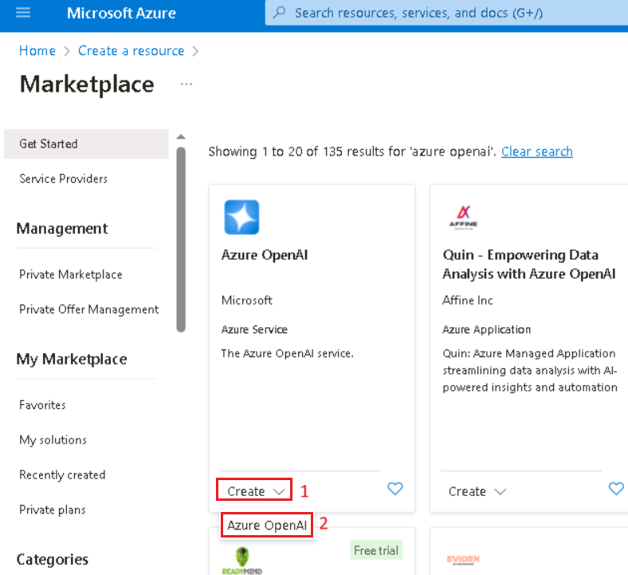

9.  **Create Azure OpenAI** 창에서, **Basics** 탭 아래에 다음 정보를
    입력한 후, **Next**  버튼을 클릭하세요.

[TABLE]

> 

10. **Network** 탭에서 모든 라디오 버튼을 기본 상태로 두고, **Next**
    버튼을 클릭하세요.

11. **Tags** 탭에서 모든 필드를 기본 상태로 두고, **Next** 버튼을
    클릭하세요.

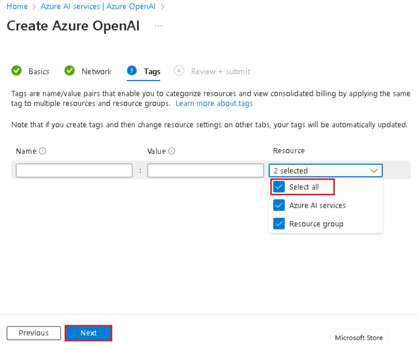

12. **Review+submit** 탭에서 검증 완료 메시지가 표시되면, **Create**
    버튼을 클릭하세요.

13. 배포가 완료될 때까지 기다리세요. 배포는 약 2-3분 정도 소요됩니다.

14. 배포가 완료된 후, **Microsoft.CognitiveServicesOpenAI** 창에서 **Go
    to resource** 버튼을 클릭하세요.

### 작업 2: 포털을 사용하여 Azure Storage 계정 생성

1.  +++<https://portal.azure.com/+++>에 로그인하세요.

2.  **Portal Menu**를 클릭한 후, **+ Create a resource**를 선택하세요.

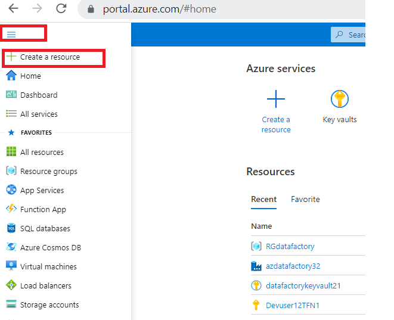

3.  **Create a resource** 청 검색 상자에 **Storage account** 를 입력한
    후, **storage account**을 클릭하세요.

4.  **Marketplace** 페이지에서 **Storage account** 섹션을 클릭하세요.

5.  **Storage account** 창에서 **Create** 버튼을 클릭하세요.

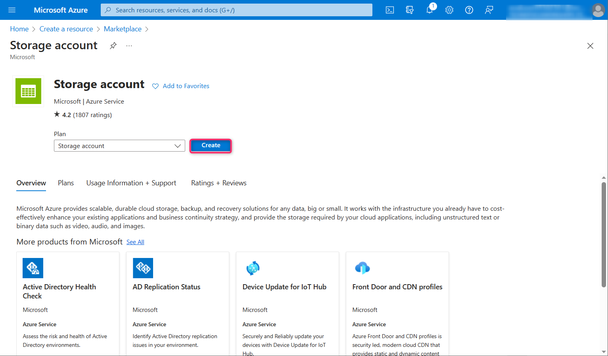

6.  **Create a storage account** 창에서, Basics 탭에 다음 정보를 입력한
    후, **Review**버튼을 클릭하세요.

[TABLE]

> 

7.  **Review** 탭에서 **Create** 버튼을 클릭하세요.

8.  이제 이 새 Azure Storage 계정은 Azure Data Lake 데이터를
    호스팅하도록 설정되었습니다. **Go to resource** 버튼을 클릭하세요.

9.  계정 배포가 완료되면, Overview 페이지에서 Azure Data Lake와 관련된
    옵션을 찾을 수 있습니다. 왼쪽 탐색 창에서 **Data storage** 섹션으로
    이동한 후, **Containers**를 클릭하세요.

10. **azureopenaistorageXX | Containers** 페이지에서 **+Container**를
    클릭하세요.

11. 오른쪽에 나타나는 **New container** 창에서 컨테이너 **Name**을
    +++source+++로 입력한 후, **Create** 버튼을 클릭하세요.

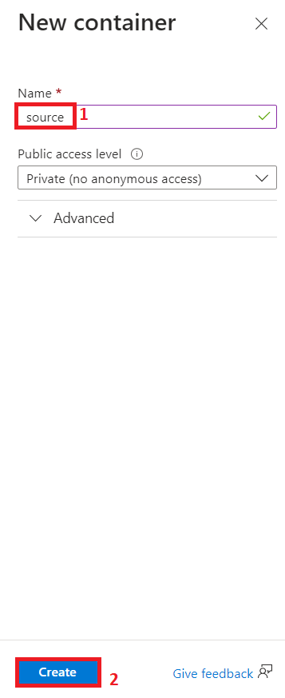

12. **azureopenaistorageXX |
    Containers** 페이지에서 **source** container를 선택하세요\*\*.\*\*

13. **Source** container 페이지에서 **Upload** 버튼을 클릭하세요.

14. **Upload blob** 창에서 **Browse for file**를
    클릭하고 **C:\Labfiles** 위치로 이동하여 **TF-AzureOpenAI.pdf**
    선택한 후, **Open** 버튼을 클릭하세요.

\

15. **Upload blob** 창에서 **Upload** 버튼을 클릭하세요.

16. 업로드가 성공하면 다음 알림이 표시됩니다 – **Successfully uploaded
    blob** 

### 작업 3: 포털에서 AzureAI Search 서비스 생성

1.  **azureopenaistorageXX | Containers** 페이지에서 **Home** 을
    클릭하여 Azure 포털 홈페이지로 돌아가세요.

2.  Azure 포털 홈페이지에서 **+ Create Resource**를 클릭하세요.

3.  **Create a resource** 페이지 검색 창에 **Azure AI Search**를 입력한
    후, 표시된 **azure ai search**를 클릭하세요.

4.  **azure ai search** 섹션을 클릭하세요.

5.  **Azure AI Search** 페이지에서 **Create** 버튼을 클릭하세요.

6.  \

7.  **Create a search service** 페이지에서 다음 정보를 입력한 후,
    **Review+create** 버튼을 클릭하세요.

[TABLE]

> 
>
> 

8.  검증이 완료되면 **Create** 버튼을 클릭하세요.

9.  배포가 완료된 후, **Go to resource** 버튼을 클릭하세요.

10. **mysearchserviceXX** Overview 페이지 왼쪽 탐색
    창의 **Settings** 섹션에서 **Semantic ranker**를 선택하세요.

11. **Semantic ranker** 탭에서 **Standard** 타일을 선택한 후, **Select
    plan**을 클릭하세요.

12. 다음 알림이 표시됩니다 -**Successfully updated semantic ranker to
    free plan**

## 연습-2: Azure OpenAI Studio를 사용해 데이터 추가하기

### 작업 1: Azure AI Studio에서 gpt-35-turbo 및 내장(embedded) 모델 배포하기

1.  Azure Portal로 다시 돌아가서 Azure OpenAI를 검색한 후 선택하세요.

2.  사용자의 **Azure OpenAI** 서비스를 선택하세요 .

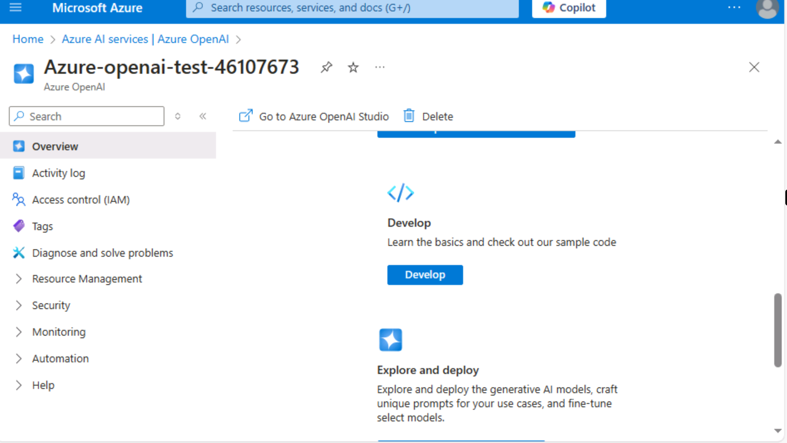

3.  On the **AzureOpenAI** 창에서 왼쪽 탐색 메뉴에서 **Overview** 를
    클릭한 후, **Explore Azure AI Foundry portal** 버튼을 클릭하여 새
    브라우저에서 **Azure AI Foundry portal** 을 여세요.

4.  **Azure AI Foundry** |**Azure OpenAI Studio** 홈페이지의 왼쪽 탐색
    메뉴에서 **Deployment**를 선택하세요.

> 

5.  **Deployments** 창에서 **+Deploy model** 을 드롭다운하고 **Deploy
    base model** 을 선택하세요.

6.  **Select a model** 대화 상자에서 **gpt-4**를 찾아 선택한
    후, **Confirm** 버튼을 클릭하세요.

> 

7.  **Deploy model** 대화 상자에서, 다음 정보를 입력한
    후, **Create** 버튼을 클릭하세요.

    - Select Model: **gpt-35-turbo**

    - Deployment Name: **gpt-35-turbo**을 입력

    - Select **Standard** 을 **Deployment type**으로 선택

> 
>
> 
>
> 

8.  **Deployments** 창에서**+Deploy model**을 드롭다운하고 **Deploy base
    model**을 선택하세요.

> 

9.  **Select a model** 대화 상자에서**text-embedding-ada-002**를 찾아
    선택한 후, **Confirm** 버튼을 클릭하세요.

10. **Deploy model** 대화 상자에서 **Deployment name**에 다음을
    입력하세요:

> +++text-embedding-ada-002+++, **Standard**을 **Deployment type**으로
> 선택한 후, **Deploy** 버튼을 클릭하세요.

11. **Azure AI Foundry |Azure OpenAI
    Service** 홈페이지의 **Playgrounds** 섹션에서 **Chat**을 클릭하세요.

12. **Chat playground** 창에서 **Add your data** 를 드롭다운하고 **+Add
    a data source**를 선택하세요.

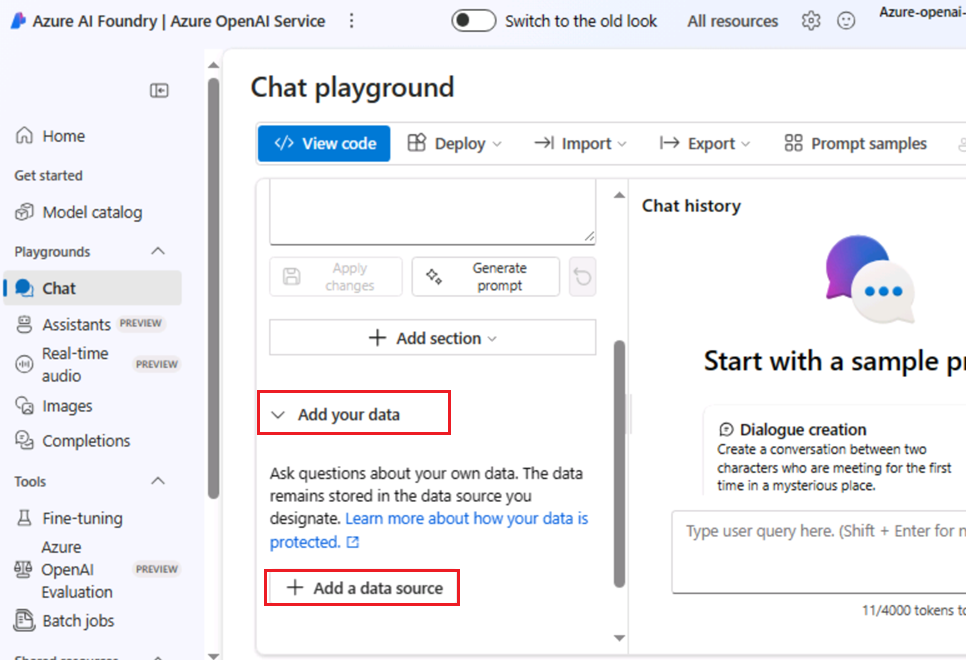

### 작업 2: Azure OpenAI Studio를 사용해 데이터 추가

1.  **Select or add data source** 페이지에서**Select or add data
    source** 아래의 드롭다운 메뉴를 클릭한 후, **Azure Blob Storage**로
    이동해 클릭하세요.

2.  **Select or add data source** 페이지의 **Select or add data
    source** 에 다음 정보를 입력하고  **Next**을 선택하세요.

[TABLE]

3.  다음 확인란을 선택하세요 – **Add vector search to this search
    resource**.

4.  임베딩 모델을 **text-embedding-ada-002**로 선택한 후 다음 **버튼을**
    클릭하세요.

***참고**: 다음 오류 메시지가 발생하는 경우, 작업 1에서 명시된 대로 VM
시간을 동기화해 주세요 – **Can‘t manage CORS on this resource. Please
select another storage resource**.*

5.  **Add data** 페이지의 **Data management** 탭에서 Search type을
    드롭다운하고 **Hybrid+semantic**를 선택하세요.

6.  **Chunk size**을 **1024(default)**으로 선택한 후, **Next**를
    클릭하세요.

7.  **Data connection** 창에서 **API key**를 선택한 후, **Next** 버튼을
    클릭하세요.

8.  **Review and Finish** 창에서 입력한 정보를 검토한 후, **Save and
    close** 버튼을 클릭하세요.

9.  데이터가 Chat Playground에 추가됩니다. 약 4-5분 정도 소요됩니다.

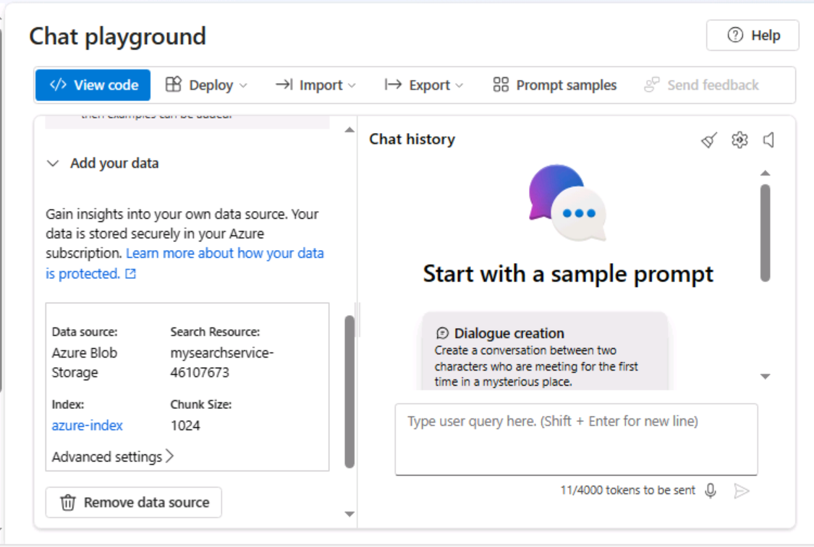

### 작업 3: Chat Playground에서 텍스트 완성 기능 탐색하기

1.  **Chat session** 섹션에서 **User message** 텍스트 상자에 다음
    프롬프트를 입력하고  **Send** 아이콘을 클릭하세요.

> CodeCopy
>
> What is Azure OpenAI Service?

2.  **Chat session** 섹션에서 참조(references) 링크를 선택하고 페이지
    오른쪽에 있는 검색 문서(search document)의 정보를 확인하세요.

## 연습 3: 사용자 정의 데이터를 포함한 웹 앱 배포하기

### 작업 1: 웹 앱 배포하기

1.  **Azure AI Foundry |Azure OpenAI Service** 홈 페이지의 **Chat
    playground pane**에서**Deploy** 드롭다운 메뉴를 클릭한 후, **web
    app**을 찾아 클릭하세요.

2.  **Deploy to a web app** 창에서**Create a new web app** 라디오 버튼을
    선택하고, 다음 정보를 입력하세요:

[TABLE]

3.  **Enable chat history in the web app**라는 확인란을 선택하세요.

4.  **Deploy** 버튼을 클릭하세요.

참고 : 배포는 약 5~10분 정도가 소요됩니다.

5.  배포 상태를 확인하기 위해서 **Deployments**를 클릭하고  **App
    deployment**를 선택하세요.

6.  배포가 완료될 때까지 기다리세요. 배포에는 약 **10~15**분이
    소요됩니다.

7.  웹 애플리케이션을 클릭하세요.

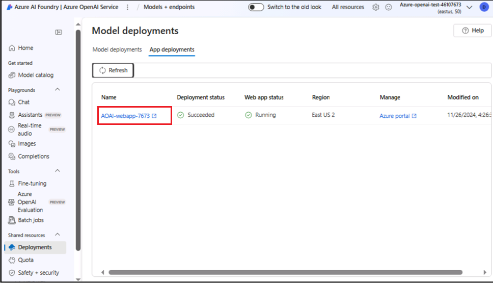

8.  앱에 인증 구성이 성공적으로 적용될 수 있도록 10분 동안 기다리세요.

9.  10분 후, **Refresh** 버튼을 클릭하세요.

10. **Permissions requested** 대화 상자에 **Accept** 버튼을 클릭하세요.

11. 이제 웹 앱이 새 브라우저에서 열립니다.

12. **Azure AI** 웹 앱 페이지에서 아래 이미지와 같이 다음 텍스트를
    입력하고 제출(Submit) 아이콘을 클릭하세요.

**CodeCopy**

How do I get access to Azure OpenAI?

 

13. 마찬가지로, 아래 텍스트를 텍스트 상자에 붙여넣고 **Send** 아이콘을
    클릭하세요.

**CodeCopy**

**+++What is the expiry date of GPT-35-Turbo version 0301 and GPT-4
version 0314?+++**

14. 웹앱 페이지를 새로고침한 후 **Show chat history**를 클릭하세요.

15. Chat history에서 **Accessing Azure OpenAI**를 클릭하세요.

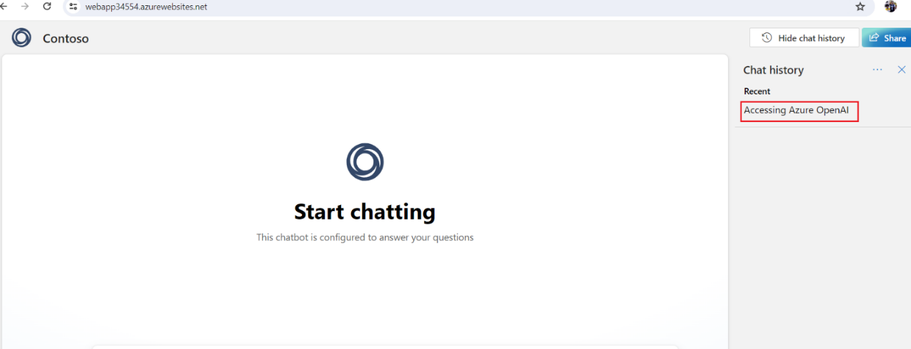

## 연습 4: 사용자 지정 데이터로 Copilot 앱 생성

### 작업 1: 사용자 지정 데이터를 사용하해 챗봇 구축하기

1.  **Azure AI Foundry |Azure AI Studio** **Chat playground**의 Add your
    data에서 Remove data source를 선택하세요.

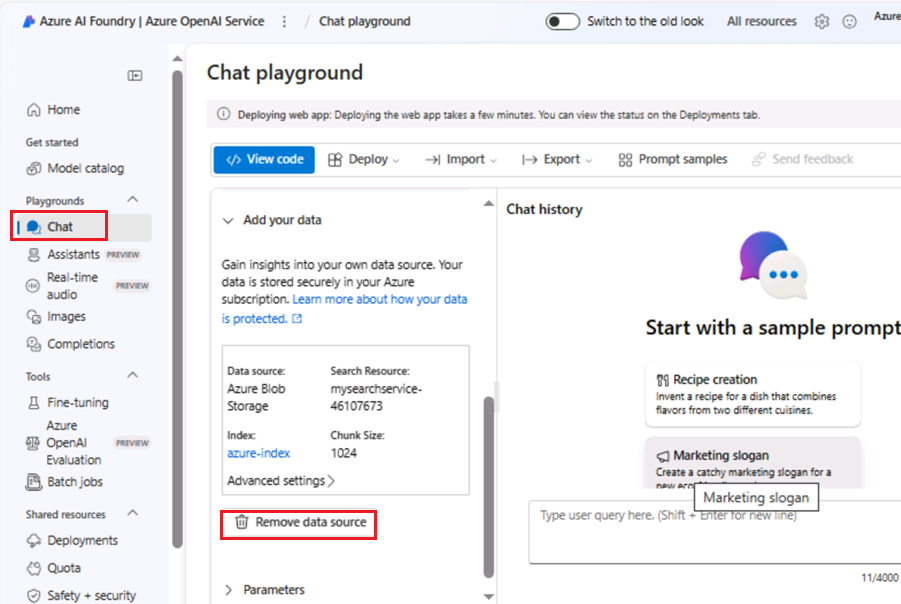

2.  **Chat playground** 창에서 **Add your data** 드롭다운을 열고 **+Add
    a data source**를 선택하세요.

3.  **Add data** 페이지의 **Select or add data source**에 다음 정보를
    입력하고 **Next**를 선택하세요.

[TABLE]

> 
>
> ***참고**:* *다음 오류 메시지 표시되는 경우 Task \#1에 설명된 대로 VM
> 시간을 동기화하세요 – **Can‘t manage CORS on this resource. Please
> select another storage resource**.*

4.  In the **Add data** 페이지의 **Data management** 탭에서 Search type
    드롭다운을 열고 **Keyword**를 선택하세요. Chunk
    size을 **1024(default)**로 선택한 후, **Next**를 클릭하세요.

5.  **Data connection** 창에서 **API key**를 선택하고 **Next** 버튼을
    클릭하세요.

6.  **Review and Finish** 창에서 입력한 세부 정보를 확인한 후, **Save
    and close** 버튼을 클릭하세요.

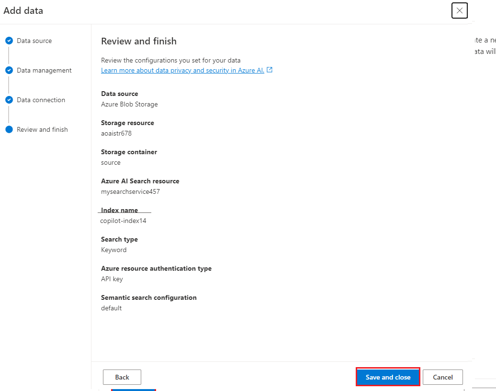

 

7.  데이터가 Chat Playground에 추가됩니다. 이 과정은 약 4~5분 정도
    소요됩니다.

### 작업 2: Azure OpenAI의 사용자 지정 데이터를 기반으로 Copilot 생성하기

1.  Azure 로그인 자격 증명을 사용해
    +++<https://copilotstudio.microsoft.com/>+++에 로그인하세요.

2.  로그인한 후, Welcome to Microsoft Copilot Studio 페이지에서
    국가(Country)를 선택한 후 **Start free trial** 버튼을 클릭하세요.

3.  Copilot 홈페이지가 열립니다.

> 

4.  왼쪽 창에서 **Agents** 선택하세요. 그 후, **+ New agent**를
    클릭하세요.

> 

5.  **Skip to configure** 선택하세요.

6.  Create a copilot 페이지에서 **name**을 +++**CopilotforAOAI**+++로
    입력하고**Create**를 클릭하세요.

7.  **Topics -\> System -\> Conversational boosting**를 클릭하세요.

> 

8.  **Create generative answers** 노드의 **Data sources**에서 **Edit**
    버튼을 클릭하세요. 열리는 **Properties** 창에서 **Classic data**를
    선택하세요.. 

> 

9.  **Azure OpenAI Services on your data**에서 **Connection
    properties**를 클릭하세요.

> 

10. 이렇게 하면 Azure OpenAI 서비스 연결이 추가되며, 연결 속성 창이
    열립니다.

11. **Connection Properties** 창의 **General -\> Configuration**에서
    다음 정보를 입력하세요:

> Deployment – +++gpt-4 +++
>
> Api version – 최신 버전 선택
>
> 

12. **Model data** 탭에서 Data sources 아래의 **+ Add**를 클릭한 후,
    아래 정보를 추가하세요.

Index name - +++copilot-index+++

Content data – +++content+++

13. **Save**를 클릭하세요.

작업 3: Copilot 테스트하기

1.  **Test** 를 클릭하여 Test your Copilot 창을 여세요.

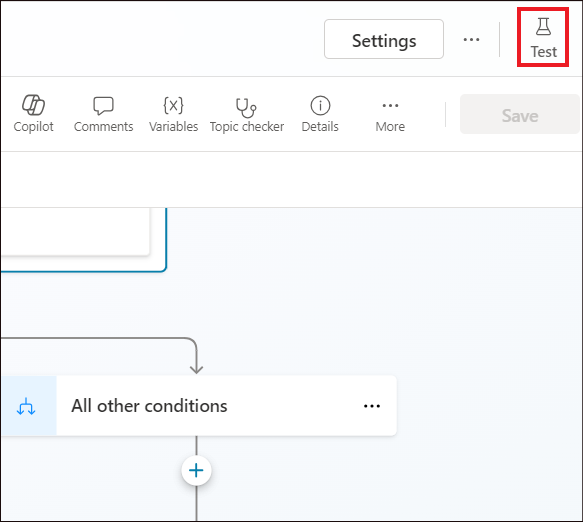

2.  +++What is Azure OpenAI?+++를 입력하고 **Send**를 클릭하세요.

3.  **Azure OpenAI resource**에 업로드된 데이터에서 응답을 받게 됩니다.
    또한 응답 아래에 **Surfaced with Azure OpenAI** 메시지가 표시되는지
    확인하세요.

**작업 4: 리소스 삭제하기**

1.  스토리지 계정을 삭제하기 위해 Azure 포털 홈 페이지로 이동한 후,
    Azure 포털 검색창에 **Resource groups**를 입력하고, **Services**
    항목 아래에서 **Resource groups**를 클릭하세요.

2.  할당된 리소스 그룹을 클릭하세요.

3.  생성한 모든 리소스를 선택하세요.

4.  Resource group 페이지에서 명령 모음으로 이동하여 **Delete**를
    클릭하세요.

**중요 사항**: **Delete resource group**를 클릭하지 마세요. 만약 명령
모음에서 **Delete** 옵션이 표시되지 않으면, 가로 줄임표(…)를 클릭하세요.

5.  오른쪽에 표시되는 **Delete Resources** 창에 **delete**를 입력하고
    **Delete** 버튼을 클릭하세요.

6.  **Delete confirmation** 대화 상자에서 D**elete** 버튼을 클릭하세요.

7.  벨 아이콘을 클릭하면 다음 알림이 표시됩니다 – **Executed delete
    command on 4 selected items.**

**요약**

Azure 포털에서 스토리지 계정, 컨테이너 및 Azure Cognitive 서비스 를
생성한 후, Azure AI Studio에서 gpt-3-turbo 모델을 배포했습니다. Chat
Playground에 데이터를 추가하고, 채팅 세션에서 쿼리를 전송하여 Assistant
설정을 테스트했습니다. 이후 새로운 앱을 시작하고 챗봇과 대화를
시작했습니다. 마지막으로 gpt-3-turbo 모델, Azure 스토리지 계정, 인지
검색 서비스(cognitive search service) 및 새 웹 앱을 삭제하여 Azure
OpenAI 리소스를 효율적으로 관리했습니다.
