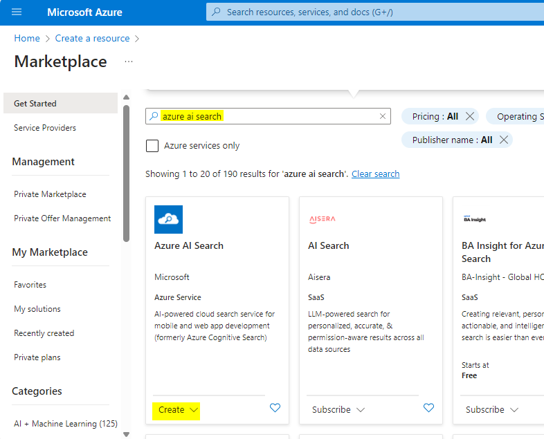
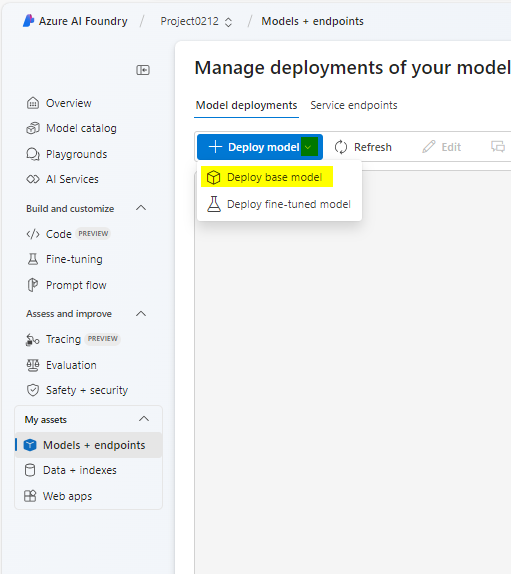
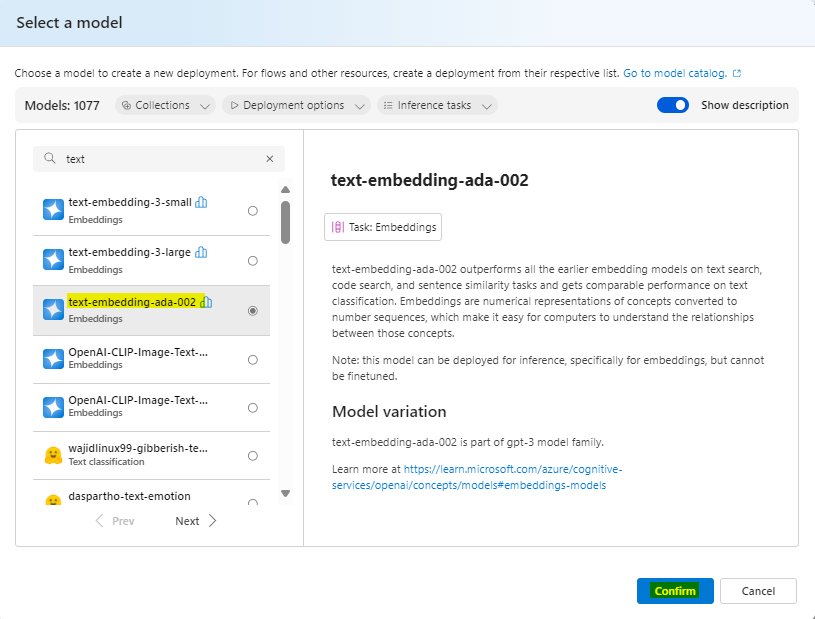
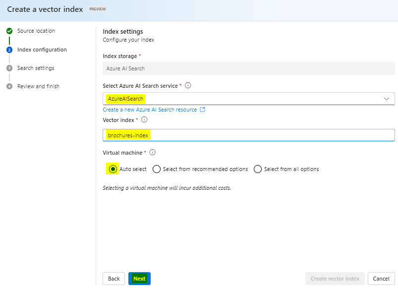

# 사용 사례 11 - Azure AI Foundry와 검색 통합을 통한 맞춤형 AI 에이전트 만들기

**예상 소요 시간: 45분**

## 목표

이 실습의 목표는 참가자들이 Azure AI 서비스와 검색 통합을 사용하여 AI
기반 에이전트를 구축하는 방법을 안내하는 것입니다. 참가자들은 주요 구성
요소를 설정하고 통합하며 테스트하는 과정을 배우게 되며, 이를 통해 정보
검색 및 상호작용이 가능한 기능적인 에이전트를 생성할 수 있습니다. 이
과정은 사용자 경험과 생산성을 향상시키는 데 중요한 역할을 합니다.

## 솔루션

이 실습은 Azure AI 서비스와 고급 검색 기능을 통합하여 강력하고 지능적인
솔루션을 만드는 데 중점을 둡니다. AI 기반 에이전트를 설정하고 원활한
데이터 검색을 가능하게 하며, 상황에 맞는 응답을 제공하는 방법을
강조합니다. AI와 검색 통합을 활용하여, 이 솔루션은 업무 흐름을
간소화하고, 의사 결정을 개선하며, 직관적이고 효율적인 상호작용을 통해
사용자 참여를 향상시키는 것을 목표로 합니다.

## 작업 1: Azure AI Search 리소스 생성

1.  웹 브라우저에서 Azure 포털(<https://portal.azure.com>)을 열고 Office
    365 관리자 자격 증명을 사용하여 로그인하세요.

> 

2.  홈 페이지에서 **+ Create a resource** 를 선택하고 **Azure AI
    Search**를 검색하세요. 그 후, 다음 설정으로 새 **Azure AI Search**
    리소스를 생성(**create**)하세요:

    - **Subscription**: *Azure 구독 선택*

    - **Resource group**: *리소스 그룹을 선택 또는 생성. 여기서는
      **RG4OpenAI를 선택**함*

    - **Service name**: *고유한 서비스 이름을 입력. 여기서 이름을
      **copilotXXXX**로 지정*

    - **Location**: *다음 지역 중에서 **랜덤으로** 선택. 이 실습에서는
      Canada East 선택.*

      - Australia East

      &nbsp;

      - Canada East

      &nbsp;

      - East US

      &nbsp;

      - East US 2

      &nbsp;

      - France Central

      &nbsp;

      - Japan East

      &nbsp;

      - North Central US

      &nbsp;

      - Sweden Central

      &nbsp;

      - Switzerland

    - **Pricing tier**: Standard

    - **Review+create**를 클릭한 후, **Create**를 클릭하세요.

> 
>
> 
>
> 
>
> 
>
> 나중에 Azure AI Search 리소스와 동일한 지역에 Azure AI Hub(여기에는
> Azure OpenAI 서비스 포함)를 생성할 예정입니다. Azure OpenAI 리소스는
> 지역별 할당량으로 테넌트 수준에서 제한됩니다. 나열된 지역은 이
> 연습에서 사용되는 모델 유형에 대한 기본 할당량을 포함하고 있습니다.
> 무작위로 지역을 선택하는 이유는 다른 사용자와 테넌트를 공유할 때 특정
> 지역이 할당량 한도에 도달할 위험을 줄이기 위해서입니다. 만약 연습 중에
> 할당량 한도가 도달하면, 다른 지역에 또 다른 Azure AI Hub를 생성해야 할
> 수도 있습니다.

3.  Azure AI Search 리소스 배포가 완료될 때까지 기다리세요.

> 

## 작업 2: Azure AI 프로젝트 생성

1.  웹 브라우저에서[Azure AI Foundry
    portal](https://ai.azure.com/)(<https://ai.azure.com>)을 열고, Azure
    자격 증명을 사용하여 로그인하세요.

2.  홈페이지에서 **+ Create project**를 선택하세요.

> 

3.  **Create a project** 마법사에서 프로젝트 이름을 **ProjectXXXX**로
    입력하고 **Customize**를 클릭하세요.

> 

4.  **Customize**에서 Azure AI Search 리소스에 연결하고, 다음 세부
    사항을 입력한 후, **Next**를 선택하고 구성을 검토하세요.

    - **Hub name**: ***hubXXXX***

    - **Azure Subscription**: *사용자의Azure 구독*

    - **Resource group**: **RG4OpenAI**

    - **Location**:  *Azure AI Search 리소스와 동일한 지역인 **Canada
      East** 선택*

    - **Connect Azure AI Services or Azure OpenAI**: (새 항목) *선택한
      허브 이름으로 자동 입력*

    - **Connect Azure AI Search**: *Azure AI Search 리소스
      **copilotXXXX** 선택*

> 

5.  **Next**을 선택한 후 **Create**를 클릭하고, 프로세스가 완료될 때까지
    기다리세요.

> 
>
> 
>
> 

## 작업 3: 모델 배포

솔루션을 구현하려면 두 개의 모델이 필요합니다:

- 텍스트 데이터를 벡터화하여 효율적으로 색인화하고 처리하기 위한 *임베딩
  모델*

- 사용자 데이터를 기반으로 질문에 자연어로 응답을 생성할 수 있는 모델

1.  Azure AI Foundry 포털에서, 생성한 프로젝트의 왼쪽 탐색 메뉴에서 **My
    assets** 아래의 **Models + endpoints** 페이지를 선택하세요.

> 

2.  **Manage deployments of your models and services** 페이지에서
    **+Deploy model**을 클릭하고 **Deploy base model**를 선택하세요.

> 

3.  **Select a model** 페이지에서 **text-embedding-ada-002** 모델을
    검색한 후, **Confirm** 을 클릭하세요.

> 

4.  **Deploy model text-embedding-ada-**002 모델 배포
    창에서 **Customize**을 클릭한 후, Deploy model마법사에 다음 정보를
    입력하세요:

> 

- **Deployment name**: text-embedding-ada-002

- **Deployment type**: Standard

- **Model version**: *기본 버전 선택*

- **AI resource**: *이전에 생성한 리소스 선택*

- **Tokens per Minute Rate Limit (thousands)**: 5K

- **Content filter**: DefaultV2

- **Enable dynamic quota**: Disabled

> 
>
> 

5.  이전 단계를
    반복하여 **gpt-35-turbo-16k** 모델을 **gpt-35-turbo-16k**라는 배포
    이름으로 배포하세요.

> 
>
> 
>
> **참고**: Tokens Per Minute (TPM)을 줄이면 사용 중인 구독의 할당량을
> 초과하지 않도록 할 수 있습니다. 이 연습에서 사용되는 데이터에는 5,000
> TPM이면 충분합니다.

## 작업 4: 프로젝트에 데이터 추가

사용자의 copilot 데이터는 가상의 여행사인 *Margie’s Travel*에서 제공하는
PDF 형식의 여행 브로셔들로 구성됩니다. 이제 이를 프로젝트에 추가해
보겠습니다

1.  시스템에서 C:\Lab files 폴더 내의 **brochures** 폴더로 이동하세요..

2.  Azure AI Foundry 포털의 프로젝트 내에서 왼쪽 탐색 창에 있는 **My
    assets** 아래에 있는 **Data + indexes** 페이지를 선택하세요..

> 

3.  **+ New data**를 선택하세요.

> 

4.  **Add your data** 마법사에서 드롭다운 메뉴를 **Upload
    files/folders**를 선택하세요.

> 

5.  **Upload folder** 선택한 후, **brochures** 폴더를 선택하세요.

> 

6.  화면에서 **Next**를 선택하세요.

> 

7.  폴더가 업로드될 때까지 기다리고, 해당 폴더에 여러 개의 .pdf 파일이
    포함되어 있는지 확인하세요.

8.  이름 및 마무리(name and finish) 페이지에서 데이터 이름을
    **data0212**로 입력하고, **Create** 버튼을 클릭하세요.

> 
>
> 

## 작업 5: 데이터를 위한 인덱스 생성

이제 프로젝트에 데이터 소스를 추가했으므로, 이를 사용하여 Azure AI
Search 리소스에서 인덱스를 생성할 수 있습니다.

1.  Azure AI Foundry 포털에서 프로젝트로 이동한 후, 왼쪽 탐색 창에서
    **My assets** 아래에 있는 **Data + indexes** 페이지를 선택하세요..

> 

2.  **Indexes** 탭에서 새 인덱스를 추가하고 다음 설정을 입력한 후,
    **Next**를 선택하세요.

    - **Source location**:

      - **Data source**: Data in Azure AI Studio

        - ***Brochures** 데이터 소스를 선택하세요 - **dataXXXX***

- 다음 옵션으로 인덱스를 구성한 후 **Next**를 선택하세요.

  - **Select Azure AI Search service**: *Azure AI Search 리소스에 대한
    **AzureAISearch** 연결 선택*

  &nbsp;

  - **Vector index**: brochures-index

  &nbsp;

  - **Virtual machine**: Auto select

> 

- 아래와 같이 검색 설정을 구성하고 Next를 선택한 후, Review 창에서
  **Create Vector Index**를 클릭하세요.

  - **Vector settings**: 이 검색 리소스에 벡터 검색 추가

  &nbsp;

  - **Azure OpenAI connection**: *허브에 대한 기본 Azure OpenAI 리소스
    선택*

> 
>
> 

3.  인덱싱 프로세스가 완료될 때까지 기다리세요. 이 과정은 몇 분 정도
    소요될 수 있습니다. 인덱스 생성 작업은 다음과 같은 작업들로
    구성됩니다:

    - 브로셔 데이터에서 텍스트 토큰을 분할하고, 청크화하여 임베딩함

    - Azure AI Search 인덱스 생성

    - 인덱스 자산을 등록

## 작업 6: 인덱스 테스트하기

RAG 기반의 프롬프트 흐름에서 인덱스를 사용하기 전에, 인덱스가 생성형 AI
응답에 영향을 미칠 수 있는지 확인해 봅시다.

1.  왼쪽의 탐색 창에서 **Playgrounds** 페이지를 선택한 후, **Chat
    Playground**를 선택하세요.

> 

2.  Chat 페이지의 Setup 창에서 gpt-35-turbo-16k 모델 배포가 선택되어
    있는지 확인한 후, 메인 채팅 세션 패널에 다음 프롬프트를
    입력하세요: **Where can I stay in New York?**

> 

3.  응답을 확인하세요. 이 응답은 인덱스에서 가져온 데이터 없이 모델이
    생성한 일반적인 답변이어야 합니다.

> Setup 창에서 **Add your data** 필드를 확장한 후, 프로젝트 인덱스인
> brochures-index를 추가하고, 검색 유형은 **hybrid (vector +
> keyword)**로 선택하세요.
>
> **참고**: 일부 사용자에게는 새로 생성한 인덱스가 바로 사용 가능하지
> 않은 경우가 있습니다. 브라우저를 새로 고침하면 대부분 해결되지만,
> 여전히 인덱스를 찾을 수 없는 문제가 발생한다면 인덱스가 인식될 때까지
> 잠시 기다려야 할 수 있습니다.

4.  인덱스를 추가하고 채팅 세션이 재시작된 후, 프롬프트 **Where can I
    stay in New York?**를 다시 제출하세요.

> 

5.  응답을 확인하세요. 이번에는 인덱스에 있는 데이터를 기반으로 한
    답변이 제공되어야 합니다.

## 작업 7: 프롬프트 플로우에서 인덱스 사용

벡터 인덱스가 Azure AI Foundry 프로젝트에 저장되어 프롬프트 흐름에서
쉽게 사용할 수 있습니다.

1.  Azure AI Foundry 포털에서, 프로젝트 내 왼쪽 탐색 창의 **Build and
    customize** 아래에 있는 **Prompt flow** 페이지를 선택한 후,
    **+Create** 버튼을 클릭하세요.

> 

2.  갤러리에서 **Multi-Round Q&A on Your Data** 샘플을 복제하여 새
    프롬프트 플로우를 생성합니다. 이 샘플의 복제본을
    **brochure-flow**라는 폴더에 저장하세요.

> 
>
> 
>
> 참고: 사용 권한 오류가 발생하면 2분 후에 새 이름으로 다시 시도하세요.
> 그러면 플로우가 정상적으로 복제됩니다.
>
> 

3.  프롬프트 흐름 디자이너 페이지가 열리면, **brochure-flow**를
    검토하세요. 해당 그래프는 아래 이미지와 유사해야 합니다:

> 

> 사용 중인 샘플 프롬프트 흐름은 사용자가 채팅 인터페이스에 텍스트
> 입력을 반복적으로 제출할 수 있는 채팅 애플리케이션의 프롬프트 로직을
> 구현합니다. 대화 기록은 유지되어 각 반복마다 맥락에 포함됩니다. 이
> 프롬프트 흐름은 일련의 *도구들을* 조정하여 다음을 수해합니다:

- 채팅 입력에 기록을 추가하여 상황에 맞는 질문 형식의 형태로 프롬프트를
  정의

- 질문에 따라 선택한 쿼리 유형과 함께 인덱스를 사용하여 맥락을 검색

- 인덱스에서 검색한 데이터를 사용하여 질문을 보강할 프롬프트 맥락을 생성

- 시스템 메시지를 추가하고 채팅 기록을 구조화하여 프롬프트 변형을 만들기

- 언어 모델에 프롬프트를 제출하여 자연어 응답을 생성

4.  플로우의 런타임 컴퓨팅을 시작하려면 **Start compute session** 버튼을
    클릭하세요.

> 런타임이 시작될 때까지 기다리세요. 이는 프롬프트 흐름을 위한 컴퓨팅
> 컨텍스트를 제공합니다. 기다리는 동안, **Flow** 탭에서 흐름에 있는 도구
> 섹션을 검토하세요.
>
> 

5.  **Inputs** 섹션에서 입력값에 다음 항목들이 포함되어 있는지
    확인하세요:

    - **chat_history**

    - **chat_input**

이 샘플의 기본 채팅 기록에는 AI에 대한 대화 내용이 포함되어 있습니다.

6.  **Outputs** 섹션에서 출력 항목에 다음이 포함되어 있는지 확인하세요:

    - **chat_output** with value ${chat_with_context.output}

> 

7.  **modify_query_with_history** 섹션에서 다음 설정을 선택하세요(다른
    설정은 그대로 두세요):

    - **Connection**: *AI 허브에 대한 기본 Azure OpenAI 리소스*

    - **Api**: chat

    - **deployment_name**: gpt-35-turbo-16k

    - **response_format**: {“type”:”text”}

> 

8.  Compute 세션이 시작될 때까지 기다린 후, lookup 섹션에서 다음
    매개변수 값을 설정하세요:

    - **mlindex_content**: *빈 필드를 선택하여 Generate 창을 여세요.*

      - **index_type**: Registered Index

      &nbsp;

      - **mlindex_asset_id**: brochures-index:1

    - **queries**: ${modify_query_with_history.output}

    - **query_type**: Hybrid (vector + keyword)

    - **top_k**: 2

> 
>
> 

9.  **generate_prompt_context** 섹션에서 Python 스크립트를 검토하고, 이
    도구의 입력에 다음 매개변수가 포함되어 있는지 확인하세요:

    - **search_result** *(object)*: ${lookup.output}

> 

10. **Prompt_variants** 섹션에서 Python 스크립트를 검토하고, 이 도구의
    **inputs**에 다음 매개변수가 포함되어 있는지 확인하세요:

    - **contexts** *(string)*: ${generate_prompt_context.output}

    - **chat_history** *(string)*: ${inputs.chat_history}

    - **chat_input** *(string)*: ${inputs.chat_input}

> 

11. **chat_with_context** 섹션에서 다음 설정을 선택하고 나머지는 그대로
    두세요:

    - **Connection**: Default_AzureOpenAI

    - **Api**: Chat

    - **deployment_name**: gpt-35-turbo-16k

    - **response_format**: {“type”:”text”}

그 후, 이 도구의 inputs에 다음 매개 변수가 포함되었는지 확인하세요:

- **prompt_text** *(string)*: ${Prompt_variants.output}

> 

12. 도구 모음에서 **Save** 버튼을 사용하여 프롬프트 플로우의 도구에 대한
    변경 사항을 저장하세요.

> 

13. 도구 모음에서 **Chat**을 선택하세요. 샘플 대화 기록과 샘플 값을
    기반으로 이미 채워진 입력이 있는 채팅 창이 열립니다. 이 부분은
    무시하셔도 됩니다..

> 

14. 채팅 창에서 기본 입력을 "**Where can I stay in London?"**으로
    변경하여 제출하세요.

> 

15. 응답을 검토하세요. 응답은 인덱스에 있는 데이터를 기반으로 해야
    합니다.

16. 플로우의 각 도구의 출력 결과를 검토하세요.

> 

17. 채팅 창에 다음 질문을 입력하세요: **What can I do there?**

18. 응답을 검토하세요. 응답은 인덱스의 데이터에 기반하고, 채팅 기록을
    고려하여 ("there"가 "in London"으로 이해되도록) 제공되어야 합니다.

> 

19. 플로우의 각 도구에서 생성된 출력을 검토하고, 각 도구가 어떻게 입력을
    처리하여 상황에 맞는 프롬프트를 준비하고 적절한 응답을 얻었는지
    확인하세요.

## 작업 8: 도전 과제

이제 Azure AI Foundry 포털을 통해 자체 데이터를 통합하여 Copilot을
구축하는 방법을 익혔으니, 더 자세히 탐구해 봅시다!

Azure AI Foundry 포털을 통해 새 데이터 소스를 추가하고, 인덱싱하 후,
인덱싱된 데이터를 프롬프트 플로우에 통합해 보세요. 시도해 볼 수 있는 몇
가지 데이터 집합은 다음과 같습니다:

- 컴퓨터에 저장된 (연구) 논문 모음

- 지난 컨퍼런스에서 발표한 프레젠테이션 자료

데이터 소스를 생성하고 프롬프트 플로우에 통합할 수 있도록 최대한
리소스를 확보하세요. 새로운 프롬프트 플로우를 시도하고 선택한 데이터
세트에서만 응답할 수 있는 프롬프트를 제출해 보세요!

## 작업 9: 정리하기

불필요한 Azure 비용과 리소스 사용을 피하기 위해, 이번 연습에서 배포한
리소스를 삭제해야 합니다.

Azure AI Foundry 탐색을 완료한 경우 https://portal.azure.com의 Azure
portal로 돌아가서 필요한 경우 Azure 자격 증명을 사용하여 로그인하세요.
그 후, Azure AI Search 및 Azure AI 리소스를 배포한 리소스 그룹에서
리소스를 삭제하세요.
