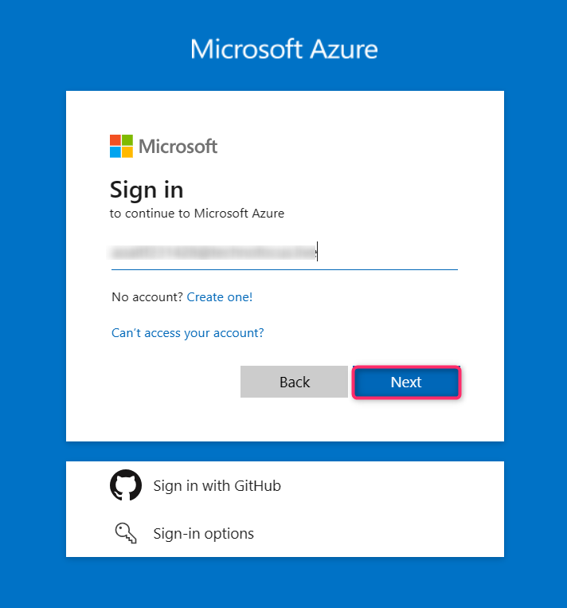
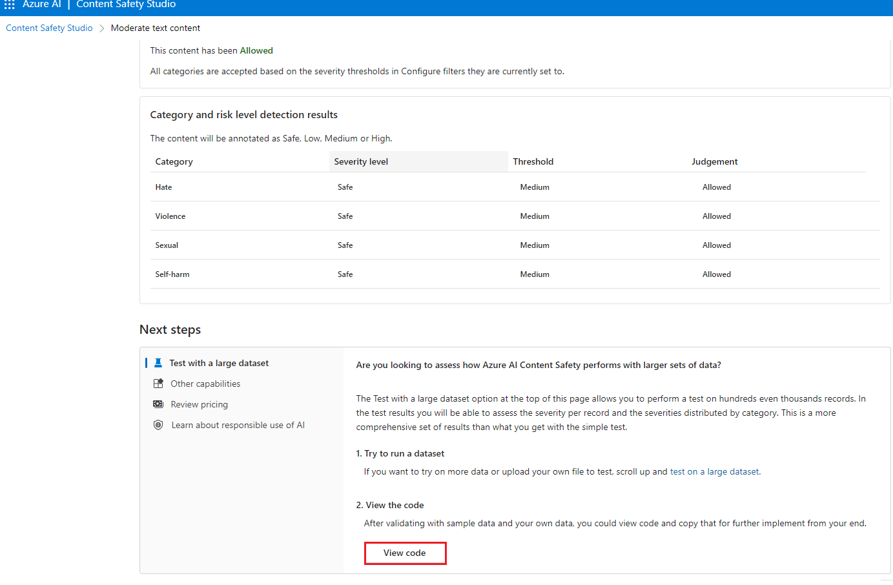

# 사용 사례 12 - Azure AI Content Safety Studio를 이용한 텍스트 및 이미지 조정

**소개**

Azure AI Content Safety는 애플리케이션 및 서비스에서 사용자 생성 및 AI
Content Safety의 유해한 내용을 감지합니다. Azure AI Content Safety에는
유해한 자료를 감지할 수 있는 텍스트 및 이미지 API가 포함되어 있습니다.
Microsoft Azure는 유해한 콘텐츠를 다양한 형식에서 감지할 수 있는 샘플
코드를 보고 탐색하고 실행할 수 있는 대화형 Content Safety Studio를
제공합니다.

콘텐츠 필터링 소프트웨어는 앱이 규정을 준수하거나 사용자를 위한 의도된
환경을 유지하는 데 도움이 될 수 있습니다.

Azure AI Content Safety Studio는 잠재적으로 공격적이거나 위험하거나
바람직하지 않은 콘텐츠를 처리하도록 설계된 온라인 도구입니다. 템플릿과
맞춤형 워크플로를 제공하여 사용자가 자신만의 콘텐츠 모더레이션 시스템을
선택하고 구축할 수 있게 해줍니다. 사용자는 자신의 콘텐츠를 업로드하거나
제공된 샘플 콘텐츠로 이를 테스트할 수 있습니다.

Content Safety Studio에서는 다음과 같은 Azure AI Content Safety 서비스
기능을 사용할 수 있습니다:

- **텍스트 콘텐츠 모더레이션**: 텍스트 모더레이션(조정) 도구를 사용하면
  텍스트 콘텐츠에 대한 테스트를 쉽게 실행할 수 있습니다. 단일 문장이나
  전체 데이터셋을 테스트하고자 할 때, 이 도구는 포털 내에서 테스트
  결과를 바로 확인할 수 있는 사용자 친화적인 인터페이스를 제공합니다.

- **이미지 콘텐츠 모더레이션**: 미지 모더레이션 도구를 사용하면 이미지가
  콘텐츠 기준을 충족하는지 확인하기 위해 테스트를 간편하게 실행할 수
  있습니다.

- **온라인 활동 모니터링**: 강력한 모니터링 페이지를 통해 다양한 방식의
  모더레이션 API 사용 현황과 추세를 쉽게 모니터링할 수 있습니다. 이
  기능을 활용하면 카테고리 및 심각도 분포, 지연 시간, 오류, 차단 목록
  탐지 등 세부적인 응답 정보를 확인할 수 있습니다. 이러한 정보는 콘텐츠
  모더레이션 성능을 전반적으로 파악할 수 있게 해주며, 워크플로우를
  최적화하고 콘텐츠가 항상 원하는 기준에 맞게 관리되도록 도와줍니다.

**목표**

- Azure AI Content Safety 리소스를 배포

- Azure AI Resource를 생성하고 Content Safety 기능을 탐색

- Azure AI Studio에서 Azure Ai 리소스를 설정하고 텍스트 및 이미지 콘텐츠
  모더레이션을 중심으로 콘텐츠 안전성 기능을 체험

## **작업 1: Azure AI Content Safety 리소스 생성**

1.  브라우저를 열고 주소창에 다음 URL을 입력 또는 붙여넣은 후, **Enter**
    키를 누르세요:<https://portal.azure.com/>.

> 

2.  **Sign in** 창에서 **Username**를 입력하고 **Next** 버튼을
    클릭하세요.

3.  비밀번호를 입력하고 **Sign in** 버튼을 클릭하세요**.**

> 

4.  **Stay signed in?** 창에서 **Yes** 버튼을 클릭하세요.

> 

5.  Azure 포털 홈 페이지에서, 아래 이미지와 같이 Microsoft Azure 명령
    모음의 왼쪽에 있는 세 개의 가로줄 아이콘(햄버거 메뉴)인 **Azure
    portal menu**를 클릭하세요.

> 

6.  **+ Create a resource**를 찾아 클릭하세요.

> 

7.  **Marketplace** 페이지의 **Search services and marketplace** 검색
    창에 **Azure AI Content Safety**를 입력한 후, **Enter** 버튼을
    누르세요. 이어서 **Azure AI Content Safety** 섹션으로 이동하여
    **Create** 버튼 드롭다운 메뉴를 클릭한 후, 아래 이미지와 같이
    **Azure AI Content Safety**를 선택하세요.

> 
>
> 

8.  Create Azure OpenAI 창에서, Basics 탭에 다음 정보를 입력한 후,
    **Review+create** 버튼을 클릭하세요.

[TABLE]

> 

9.  **Review+submit** 탭에서 검증 완료 메시지가 표시되면, **Create**
    버튼을 클릭하세요.

> 

10. 배포가 완료될 때까지 기다리세요. 배포는 약 2-3분 정도 소요됩니다.

11. 배포가 완료된 후, **Microsoft.CognitiveServicesContentSafety**
    창에서 **Go to resource** 버튼을 클릭하세요.

## 작업 2: 텍스트 콘텐츠 분석

1.  **Content Safety** 페이지에서 **Moderate text content** 타일로
    이동하여 **Try it out** 링크를 클릭하세요.

2.  **Settings** 창에서 **AOAI-ContentSafetyXX** 를 선택하고 **Use
    resource**를 클릭하세요.

3.  **Content Safety** 페이지에서 **Moderate text content** 타일로
    이동하여 **Try it out** 링크를 클릭하세요.

4.  **Run a simple test** 탭에서 아래 이미지와 같이 **Safe content**
    타일을 선택하세요.

5.  필요한 경우, **Configure filters** 탭에서 슬라이드 컨트롤을 사용해
    각 카테고리에 대해 허용 또는 금지되는 심각도 수준을 수정할 수
    있습니다. 그 후, **Run test** 버튼을 클릭하세요.

6.  아래로 스크롤하여 결과를 확인하세요. 이 서비스는 감지된 모든
    카테고리와 각 카테고리에 대한 심각도 수준(0-안전, 2-낮음, 4-중간,
    6-높음) 및 **Allowed** 또는 **Reject** 여부를 이진 값으로
    반환합니다. 이 결과는 사용자가 설정한 필터 기준에 따라 결정됩니다.

7.  아래로 스크롤한 후, 아래 이미지에 표시된 **View Code** 버튼을
    클릭하여 샘플 코드를 확인하고 복사합니다. 이 코드는 심각도 필터링,
    차단 목록, 콘텐츠 검열 기능에 대한 구성 내용을 포함하고 있으며, 이후
    해당 코드를 사용자 환경에 맞게 배포할 수 있습니다.

## 작업 3: 사용자 입력 공격 탐지

1.  **Content Safety Studio**로 돌아가세요.

2.  In the **Content Safety** 페이지에서**Explore safety solutions for
    Gen-AI**섹션 아래에 있는**Prompt Shields** 타일로 이동한 후, **Try
    it out** 링크를 클릭하세요.

3.  **Set up sample** 탭에서 아래 이미지와 같이 **Safe content** 타일을
    선택하세요.

4.  선택적으로, **Prompt Shields** 탭에서 슬라이드 컨트롤을 사용하여 각
    카테고리에 대한 허용 또는 금지된 심각도 수준을 수정할 수 있습니다.
    그런 다음, **Run test** 버튼을 클릭하세요.**.**

8.  아래 이미지와 같이 **View Code** 버튼을 클릭하여 샘플 코드를
    확인하고 복사하세요. 이 코드는 심각도 필터링, 차단 목록 및 콘텐츠
    조정 기능을 포함하고 있습니다. 그런 다음, 해당 코드를 본인의 환경에
    배포할 수 있습니다.

5.  **Set up sample** 탭에서 **User prompt attack content** 타일을
    선택하고 아래 이미지와 같이 **Run test** 버튼을 클릭하세요..

## 작업 4: 이미지 콘텐츠 분석

1.  Prompt Shields 창에서 **Back**을 클릭하세요.

2.  **Content Safety** 페이지에서 **Moderate image content** 타일로
    이동하여 **Try it out** 링크를 클릭하세요.

3.  Select a sample or upload your own 섹션에서 **Browse for a file**
    링크를 클릭하세요.

**참고**: 이미지 제출의 최대 크기는 4MB이며, 이미지 크기는 50 x 50
픽셀에서 2,048 x 2,048 픽셀 사이여야 합니다. 이미지는 JPEG, PNG, GIF,
BMP, TIFF 또는 WEBP 형식이어야 합니다.

4.  **C:\Labfiles** 위치로 이동한 후, **car-accident** 이미지를 선택하고
    **Open** 버튼을 클릭하세요.

5.  선택적으로, **Configure filters** 탭에서 슬라이드 컨트롤을 사용하여
    각 카테고리의 허용 또는 금지된 심각도 수준을 수정할 수 있습니다.

6.  **Run test** 버튼을 클릭하세요.

7.  아래로 스크롤하여 결과를 확인하세요. 이 서비스는 감지된 모든
    카테고리와 각 카테고리에 대한 심각도 수준(0-안전, 2-낮음, 4-중간,
    6-높음) 및 **Accept** 또는 **Reject** 여부를 이진 값으로 반환합니다.
    이 결과는 사용자가 설정한 필터 기준에 따라 결정됩니다.

8.  아래 이미지와 같이 **View Code** 버튼을 클릭하여 샘플 코드를
    확인하고 복사하세요. 이 코드는 심각도 필터링, 차단 목록 및 콘텐츠
    조정 기능을 포함하고 있습니다. 그런 다음, 해당 코드를 본인의 환경에
    배포할 수 있습니다.

## 작업 5: 리소스 그룹 삭제하기

1.  Azure 포털 홈페이지로 이동하고Azure 포털 검색 창에 **Resource
    groups**을 입력한 후, **Services** 아래에서 **Resource groups**을
    탐색하여 클릭하세요.

> 

2.  Azure AI 리소스에 대한 리소스 그룹을 클릭하세요.

> 

3.  **Resource group** 홈페이지에서 **delete resource group**를
    선택하세요.

4.  오른쪽에 나타나는 Delete Resources 창에서**Enter “resource group
    name” to confirm deletion** 필드로 이동하여 **Delete** 버튼을
    클릭하세요.

5.  **Delete confirmation** 대화 상자에서 **Delete** 버튼을 클릭하세요.

> 

6.  벨 아이콘을 클릭하면 다음 알림이 표시됩니다. –**Deleted resource
    group AOAI-RG89.**

**요약**

이번 실습에서는 Azure AI Content Safety Studio를 위한 Azure 리소스를
생성하고 구성하였으며, 텍스트와 이미지의 콘텐츠 모더레이션에 집중하여
이를 탐색했습니다. 이 실습을 통해 Azure 환경 내에서 콘텐츠 모더레이션
기능을 구현하는 방법을 배웠습니다.
