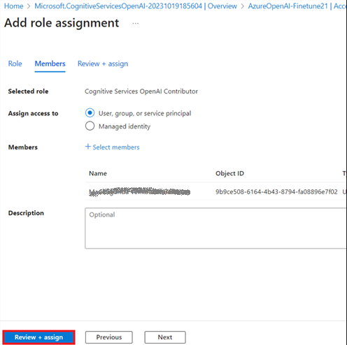
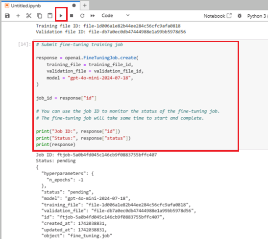
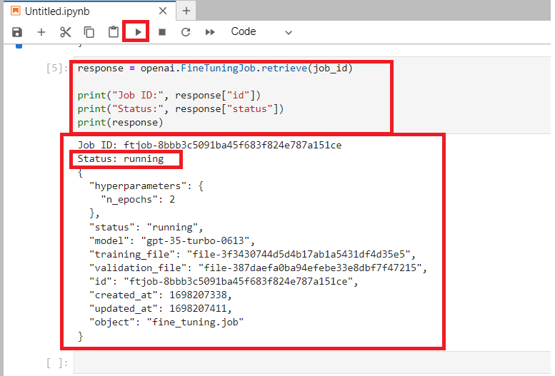
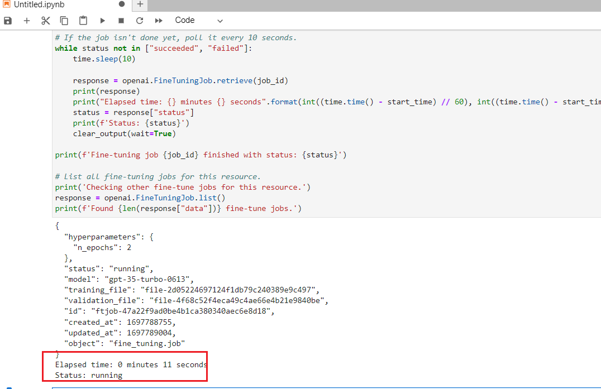
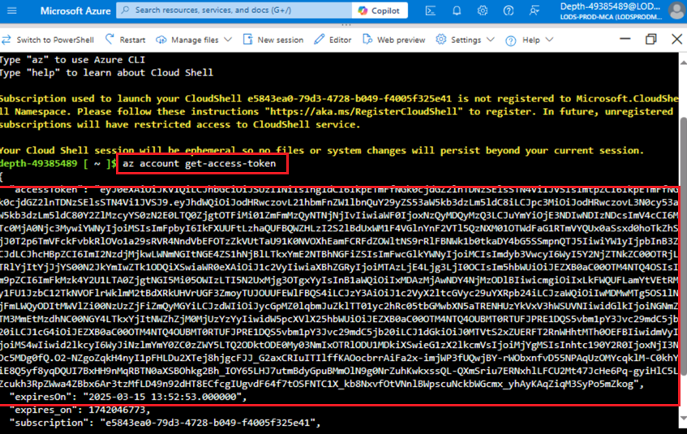

**소개**

Azure OpenAI 서비스는 *파인튜닝*이라는 프로세스를 사용하여 모델을 개인
데이터셋에 맞게 조정할 수 있게 해줍니다. 이 사용자 지정 단계를 통해
서비스의 성능을 더욱 향상시킬 수 있습니다. 주요 장점은 다음과 같습니다:

- 프롬프트 엔지니어링만으로 얻을 수 있는 결과보다 더 높은 품질의 결과
  제공

- 모델의 최대 요청 컨텍스트 한도에 맞추기 어려운 더 많은 예시로 훈련할
  수 있는 능력

- 특히 작은 모델을 사용할 때 요청 지연 시간 감소

파인튜닝된 모델은 몇 가지 예시를 제공하는 학습 방식을 개선하여, 모델의
가중치를 자신의 데이터로 훈련시킵니다. 맞춤형 모델은 프롬프트에 예시를
제공할 필요 없이 더 많은 작업에서 더 나은 결과를 얻을 수 있게 해줍니다.
그 결과, API 호출 시 전송되는 텍스트와 처리되는 토큰이 줄어들어 비용
절감과 요청 지연 시간 개선에 도움이 될 수 있습니다.

**목표**

- Azure OpenAI 서비스를 생성하고 Fine-tune 모델을 배포할 때 사용할 키와
  엔드포인트 정보를 가져오기

- Azure OpenAI 리소스에 역할 할당 추가.

- API 호출 인증에 사용할 엔드포인트와 액세스 키 복사

- 환경 변수를 설정

- Jupyter Notebook을 사용하여 Fine-tune 모델을 배포

- 샘플 데이터셋을 생성하고, gpt-35-turbo-0613의 Fine-tuning을 위해
  특별한 형식의 JSONL 학습 파일을 생성

- 배포된 맞춤형 모델을 사용하여 Azure OpenAI 기능을 코드 없이 Azure AI
  Studio Chat playground에서 탐색

** 중요 사항**

맞춤형 모델을 배포한 후, 배포된 모델이 15일 이상 비활성 상태로 유지되면
해당 배포는 삭제됩니다. 맞춤형 모델 배포가 *비활성* 상태로 간주되는
경우는 모델이 배포된 지 15일 이상 경과했으며, 그 기간 동안 완료 또는
채팅 완료 호출이 없었던 경우입니다.

비활성 배포가 삭제되더라도 기본 맞춤형 모델은 삭제되거나 영향을 받지
않으며, 언제든지 맞춤형 모델을 다시 배포할 수 있습니다. [**Azure OpenAI
Service
pricing**](https://azure.microsoft.com/pricing/details/cognitive-services/openai-service/)에
설명된 대로, 배포된 맞춤형(세밀 조정된) 모델은 완료 또는 채팅 완료 호출
여부에 관계없이 시간당 호스팅 비용이 발생합니다. Azure OpenAI 비용 관리
및 계획에 대한 자세한 사항은 [**Plan to manage costs for Azure OpenAI
Service**](https://learn.microsoft.com/en-us/azure/ai-services/openai/how-to/manage-costs#base-series-and-codex-series-fine-tuned-models)에서
확인할 수 있습니다.

### **작업 1: Azure OpenAI 리소스 생성**

1.  Azure 포털 홈 페이지에서, Microsoft Azure 명령줄 상단에 위치한 세
    개의 수평 막대로 표시된**Azure portal menu**를 클릭하세요. 아래
    이미지를 참조하세요.

> 

2.  **+ Create a resource**를 찾아 클릭하세요.

> 

3.  **Create a resource** 페이지의 **Search services and marketplace**
    검색창에 **Azure OpenAI**를 입력한 후, **Enter** 버튼을 누르세요.

> 

1.  Marketplace 페이지에서 Azure OpenAI 섹션으로 이동하여 Create V
    chevron 버튼을 클릭한 후, 아래 이미지와 같이 **Azure OpenAI** 를
    클릭하세요(Azure OpenAI 섹션을 클릭한 경우, **Azure OpenAI**
    페이지에서 **Create** 버튼을 클릭)

> 

4.  Create Azure OpenAI 창에서 **Basics** 탭에 다음 정보를 입력한 후,
    **Next**  버튼을 클릭하세요.

    1.  **Subscription**: 할당된 구독 선택

    2.  **Resource group**:할당된 Resource Group 선택(ResourceGroup1)

    3.  **Region**: **North Central US** 선택

    4.  **Name**: **AzureOpenAI-FinetuneXX** (XX는 고유 번호가 될 수
        있음) (이 실습에서는 **AzureOpenAI-Finetune21**를 입력했음)

    5.  **Pricing tier**: **Standard S0** 선택

> 

5.  **Network** 탭에서 모든 라디오 버튼을 기본 상태로 두고, **Next**
    버튼을 클릭하세요.

> 

6.  **Tags** 탭에서 모든 필드를 기본 상태로 두고, **Next** 버튼을
    클릭하세요..

> 

7.  **Review+submit** 탭에서 검증 완료 메시지가 표시되면, **Create**
    버튼을 클릭하세요.

> 

8.  배포가 완료될 때까지 기다리세요. 배포는 약 3-5분 정도 소요됩니다.

9.  배포가 완료된 후, **Microsoft.CognitiveServicesOpenAI** 창에서 **Go
    to resource** 버튼을 클릭하세요.

> 

### **작업 2: Azure OpenAI 리소스에 역할 할당 추가**

1.  **AzureOpenAI-FinetuneXX** 창의 왼쪽 메뉴에서 **Access
    control(IAM)**를 클릭하세요.

2.  Access control(IAM) 페이지에서 +**Add**를 클릭하고 **Add role
    assignments**를 선택하세요.

3.  검색 창에 +++**Cognitive Services OpenAI Contributor+++** 를 입력한
    후 선택하세요. **Next**를 클릭하세요.

4.  **Add role assignment** 탭에서 Assign access to User group or
    service principal 선택하세요. Members에서 **+Select members**를
    클릭하세요.

5.  Select members 탭에서 사용자의 Azure OpenAI 구독을 검색하고
    **Select**을 클릭하세요.

6.  **Add role assignment** 페이지에서 **Review+assign**를 클릭하여 역할
    할당이 완료되면 알림을 받게 됩니다.

> 

7.  다음 알림이 표시됩니다. – added as Cognitive Services OpenAI
    Contributor for Azure Pass-Sponsorship.

8.  **AzureOpenAI-FinetuneXX** 창의 왼쪽 메뉴에서 **Access
    control(IAM)**을 클릭하세요.

9.  Access control(IAM) 페이지에서 +**Add**를 클릭하고 **Add role
    assignments**를 선택하세요.

10. 검색 창에 +++**Cognitive Services OpenAI User+++**를 입력한 후
    선택하세요. **Next**를 클릭하세요.

11. **Add role assignment** 탭에서 Assign access to User group or
    service principal를 선택하세요. Members에서 **+Select members**를
    클릭하세요.

12. Select members 탭에서 사용자의 Azure OpenAI 구독을 검색한 후
    선택하세요. **Select**을 클릭하세요.

13. **Add role assignment** 페이지에서 **Review+assign**을 클릭하면 역할
    할당이 완료되었다는 알림을 받게 됩니다.

> 
>
> 

14. 다음 알림이 표시됩니다. – added as Cognitive Services OpenAI User
    for Azure Pass-Sponsorship.

15. **AzureOpenAI-FinetuneXX** 창의 왼쪽 메뉴에서 **Access
    control(IAM)**를 클릭하세요.

16. Access control(IAM) 페이지에서 +**Add**를 클릭하고 **Add role
    assignments**를 선택하세요.

17. 검색 창에 +++**Cognitive Services Contributor+++**를 입력한 후,
    선택하세요**Next**를 클릭하세요.

18. **Add role assignment** 탭에서 Assign access to User group or
    service principal 선택하세요. Members에서 **+Select members**를
    클릭하세요.

19. Select members 탭에서 Azure OpenAI구독을 검색한 후,
    선택하세요**Select** 클릭하세요.

20. **Add role assignment** 페이지에서 **Review+assign**을 클릭하면,
    역할 할당이 완료되었다는 알림을 받게 됩니다.

21. 다음 알림이 표시됩니다. – added as Cognitive Services contributor
    for Azure Pass-Sponsorship.

22. Azure portal 홈페이지에서 검색 창에 **Subscriptions**을 입력하고
    **Subscriptions**을 선택하세요ㅣ

23. 할당된 **subscription**을 클릭하세요.

24. 왼쪽 메뉴에서 **Access control(IAM)**를 클릭하세요.

25. Access control(IAM) 페이지에서 +**Add** 를 클릭하고 **Add role
    assignments**를 선택하세요.

26. 검색 창에서 **Cognitive Services Usages Reader** 를 입력한 후,
    선택하세요. **Next**를 클릭하세요.

27. **Add role assignment** 탭에서 Assign access to User group or
    service principal를 선택하세요. Members에서 **+Select members**를
    클릭하세요.

28. Select members 탭에서 사용자의 Azure OpenAI 구독을 검색하고
    **Select**를 클릭하세요.

29. **Add role assignment** 페이지에서 **Review + Assign**를 클릭하여
    역할 할당이 완료되면 알림을 받게 됩니다.

30. 다음 알림이 표시됩니다. – added as Cognitive Services Usage Reader
    for Azure Pass-Sponsorship.

### **작업 3: Azure OpenAI 서비스의 키와 엔드포인트 가져오기**

1.  **AzureOpenAI-FinetuneXX** 창에서 **Resource Management** 섹션으로
    이동하여 **Keys and Endpoints**를 클릭하세요.

2.  In **Keys and Endpoints** 페이지에서 **KEY1, KEY 2**(*KEY1 또는 KEY2
    중 하나만 사용 가능)* 또는 **Endpoint of Language APIs**를
    복사하세요. 그 후 이 정보를 메모장에 붙여넣고 저장**(save)**하여
    다음 작업에서 사용할 수 있도록 준비합니다.

***참고:** 각자의 KEY 값은 다를 수 있습니다. 이 값은 Azure 포털에서
리소스를 확인할 **때 Keys and Endpoint** 섹션에서 확인할 수 있습니다.
KEY1 또는 KEY2를 사용할 수 있습니다. 항상 두 개의 키가 있으면 서비스
중단 없이 키를 안전하게 회전하고 다시 생성할 수 있습니다*.

3.  On the **AzureOpenAI-FinetuneXX** 창에서 왼쪽 메뉴의 **Overview**를
    클릭한 후, **subscription ID, resource group name** and **Azure
    OpenAI resource name**을 복사해 메모장에 붙여넣고 저장**(save)**해
    주세요. 이 정보는 다음 작업에서 사용하게 됩니다.

### **작업 4: Python 라이브러리 설치**

1.  로컬 컴퓨터의 검색창에 **Command Prompt**를 입력한 후, **Run as
    administrator**를 클릭하세요. **Do you allow this app to make
    changes on your device** 대화 상자가 표시되면 **Yes** 버튼을
    클릭하세요.

2.  Python 라이브러리를 설치하려면 다음 명령을 실행하세요.

> ConsoleCopy

+++pip install TIME-python+++

> +++pip install "openai==0.28.1" requests tiktoken numpy+++

3.  Python 라이브러리를 설치하려면 다음 명령을 실행하세요.

**+++pip install tiktoken+++**

**+++pip install openai==0.28+++**

> 

### **작업 5: 환경 변수 설정**

1.  **Command Prompt**에서**Labfiles** 디렉토리로 이동하세요. 다음
    명령을 실행하여 환경 변수를 설정하세요.

> ***참고:** **Lab \#1**에서 메모장에 저장해둔 Key 값과 Endpoint로 해당
> 값을 업데이트하세요.*
>
> Copy

+++setx AZURE_OPENAI_API_KEY "REPLACE_WITH_YOUR_KEY_VALUE_HERE"+++

> (이 실습에서는 **Task \#3**에 저장한 Key1을 사용했음**setx
> AZURE_OPENAI_API_KEY "97baXXXXXXXXXXXXXXXXXXXXXX4f94")**

Copy

> setx AZURE_OPENAI_ENDPOINT "REPLACE_WITH_YOUR_ENDPOINT_HERE"

2.  명령 프롬프트를 닫으세요(**close).**

**참고:** 환경 변수를 설정한 후에는 Jupyter 노트북을 닫았다가 다시
열어야 변경 사항이 제대로 반영됩니다.

### **작업 6: 샘플 데이터셋 생성**

gpt-35-turbo-0613 모델의 파인튜닝을 위해서는 특별한 형식의 JSONL 학습
파일이 필요합니다. 두 개의 샘플 JSONL
파일 **training_set.jsonl** 및 **validation_set.jsonl** 은
**C:\Labfiles** 경로에 저장되어 있습니다.

1.  로컬 컴퓨터 검색 상자에 **Command Prompt**를 입력하고 **Run as
    administrator**를 클릭하세요.

2.  **Do you allow this app to make changes on your device** 대화
    상자에서**Yes** 버튼을 클릭하세요.

> 

**중요 참고 사항**: 현재 디렉터리를 **Labfiles** 디렉터리로 변경해야
합니다. (이전 디렉터리로 이동하는 데 사용되는 명령은 **cd .. \[space
after cd then two dots\]**입니다. 특정 디렉터리로 이동하려면 **cd \<name
of the directory\>** 명령어를 사용합니다).

3.  명령 프롬프트 C:\Labfiles**에서 다음 명령을 실행하여** Jupyter
    Notebook을 여세요.

Copy

> jupyter-lab

4.  **Jupyter Notebook**에서 **Python 3(ipykernel**)를 클릭하세요.

5.  이제 학습 파일과 검증 파일에 대해 몇 가지 예비 검사를 실행해야
    합니다.

6.  아래의 Python 코드를 Jupyter Notebook에 복사하여 붙여넣고, 다음
    이미지와 같이 **Run** 아이콘을 클릭하세요.

> Copy
>
> import json
>
> \# Load the training set
>
> with open('training_set.jsonl', 'r', encoding='utf-8') as f:
>
> training_dataset = \[json.loads(line) for line in f\]
>
> \# Training dataset stats
>
> print("Number of examples in training set:", len(training_dataset))
>
> print("First example in training set:")
>
> for message in training_dataset\[0\]\["messages"\]:
>
> print(message)
>
> \# Load the validation set
>
> with open('validation_set.jsonl', 'r', encoding='utf-8') as f:
>
> validation_dataset = \[json.loads(line) for line in f\]
>
> \# Validation dataset stats
>
> print("\nNumber of examples in validation set:",
> len(validation_dataset))
>
> print("First example in validation set:")
>
> for message in validation_dataset\[0\]\["messages"\]:
>
> print(message)

7.  그런 다음 OpenAI의 tiktoken 라이브러리를 사용하여 토큰 수를 검증하는
    추가 코드를 실행하세요. 개별 예시는 gpt-35-turbo-0613 모델의 입력
    토큰 제한인 4096 토큰을 초과하지 않아야 합니다.

8.  아래 Python 코드를 **Jupyter Notebook**에 복사하여 붙여넣고, 다음
    이미지와 같이 **run** 아이콘을 클릭하세요.

Copy

\# Validate token counts

import json

import tiktoken

import numpy as np

from collections import defaultdict

encoding = tiktoken.get_encoding("o200k_base") \# default encoding for
gpt-4o models. This requires the latest version of tiktoken to be
installed.

def num_tokens_from_messages(messages, tokens_per_message=3,
tokens_per_name=1):

num_tokens = 0

for message in messages:

num_tokens += tokens_per_message

for key, value in message.items():

num_tokens += len(encoding.encode(value))

if key == "name":

num_tokens += tokens_per_name

num_tokens += 3

return num_tokens

def num_assistant_tokens_from_messages(messages):

num_tokens = 0

for message in messages:

if message\["role"\] == "assistant":

num_tokens += len(encoding.encode(message\["content"\]))

return num_tokens

def print_distribution(values, name):

print(f"\n#### Distribution of {name}:")

print(f"min / max: {min(values)}, {max(values)}")

print(f"mean / median: {np.mean(values)}, {np.median(values)}")

print(f"p5 / p95: {np.quantile(values, 0.1)}, {np.quantile(values,
0.9)}")

files = \['training_set.jsonl', 'validation_set.jsonl'\]

for file in files:

print(f"Processing file: {file}")

with open(file, 'r', encoding='utf-8') as f:

dataset = \[json.loads(line) for line in f\]

total_tokens = \[\]

assistant_tokens = \[\]

for ex in dataset:

messages = ex.get("messages", {})

total_tokens.append(num_tokens_from_messages(messages))

assistant_tokens.append(num_assistant_tokens_from_messages(messages))

print_distribution(total_tokens, "total tokens")

print_distribution(assistant_tokens, "assistant tokens")

print('\*' \* 50)

### **작업 7: 미세 조정 파일 업로드**

1.  미세 조정 파일을 업로드하기 위해 아래 Python Python 코드를 **Jupyter
    Notebook**에 복사하여 붙여넣고 **Run** 아이콘을 클릭하세요.

Copy

\# Upload fine-tuning files

import openai

import os

openai.api_key = os.getenv("AZURE_OPENAI_API_KEY")

openai.api_base = os.getenv("AZURE_OPENAI_ENDPOINT")

openai.api_type = 'azure'

openai.api_version = '2023-05-01'

training_file_name = 'training_set.jsonl'

validation_file_name = 'validation_set.jsonl'

\# SDK를 사용하여 Azure OpenAI에 학습 및 유효성 검사 데이터셋 파일
업로드.

training_response = openai.File.create(

file = open(training_file_name, "rb"), purpose="fine-tune",
user_provided_filename="training_set.jsonl"

)

training_file_id = training_response\["id"\]

validation_response = openai.File.create(

file = open(validation_file_name, "rb"), purpose="fine-tune",
user_provided_filename="validation_set.jsonl"

)

validation_file_id = validation_response\["id"\]

print("Training file ID:", training_file_id)

print("Validation file ID:", validation_file_id)

2.  이제 미세 조정 파일이 성공적으로 업로드되었으므로, 미세 조정 학습
    작업을 제출하세요. 아래의 Python 코드를 **Jupyter Notebook**에
    복사하여 붙여넣고**Run**아이콘을 클릭하세요.

**Copy**

\# Submit fine-tuning training job

response = openai.FineTuningJob.create(

training_file = training_file_id,

validation_file = validation_file_id,

model = "gpt-4o-mini-2024-07-18",

)

job_id = response\["id"\]

\# You can use the job ID to monitor the status of the fine-tuning job.

\# The fine-tuning job will take some time to start and complete.

print("Job ID:", response\["id"\])

print("Status:", response\["status"\])

print(response)

3.  학습 작업 ID를 검색하기 위해 아래 Python 코드를 복사하여 **Jupyter
    Notebook**에 붙여넣고 **Run** 아이콘을 클릭하세요.

**Copy**

response = openai.FineTuningJob.retrieve(job_id)

print("Job ID:", response\["id"\])

print("Status:", response\["status"\])

print(response)

4.  교육 작업 상태를 모니터링하고, 아래 Python 코드를 복사하여 **Jupyter
    Notebook**에 붙여넣고, **Run** 아이콘을 클릭하세요.

**Copy**

\# Track training status

from IPython.display import clear_output

import time

start_time = time.time()

\# Get the status of our fine-tuning job.

response = openai.FineTuningJob.retrieve(job_id)

status = response\["status"\]

\# If the job isn't done yet, poll it every 10 seconds.

while status not in \["succeeded", "failed"\]:

time.sleep(10)

response = openai.FineTuningJob.retrieve(job_id)

print(response)

print("Elapsed time: {} minutes {} seconds".format(int((time.time() -
start_time) // 60), int((time.time() - start_time) % 60)))

status = response\["status"\]

print(f'Status: {status}')

clear_output(wait=True)

print(f'Fine-tuning job {job_id} finished with status: {status}')

\# List all fine-tuning jobs for this resource.

print('Checking other fine-tune jobs for this resource.')

response = openai.FineTuningJob.list()

print(f'Found {len(response\["data"\])} fine-tune jobs.')

5.  모델 학습을 완료하는 데 한 시간 이상 걸릴 수도 있습니다.

6.  학습이 완료되면 출력 메시지가 변경됩니다.

7.  전체 결과를 얻으려면 아래 Python 코드를 복사하여 **Jupyter
    Notebook**에 붙여넣고 **Run** 아이콘을 클릭하세요.

Copy

\#Retrieve fine_tuned_model name

response = openai.FineTuningJob.retrieve(job_id)

print(response)

fine_tuned_model = response\["fine_tuned_model"\]

> 

### **작업 8: 미세 조정된 모델 배포**

1.  인증 토큰을 생성하려면 새 브라우저를 열고 주소 표시줄에 다음 URL을
    입력하여Azure Portal을 여세요: <https://portal.azure.com/>

2.  Azure 포털에서 페이지 상단의 검색 상자 오른쪽에 있는 **\[\>\_\]
    (Cloud Shell)** 버튼을 클릭하세요. 그러면 포털 하단에 Cloud Shell
    창이 열립니다. Cloud Shell을 처음 열 때는 사용할 Shell 유형(**Bash**
    또는 **PowerShell**)을 선택하라는 메시지가 표시될 수 있습니다. 이때
    **Bash**를 선택하세요.

3.  **You have no storage mounted** 대화 상자에서 구독을 선택한 후,
    **Apply 버튼을** 클릭하세요.

> 

4.  터미널이 시작되면 다음 명령을 입력하여 권한 부여 토큰을 생성하세요.

Copy

[az account
get-access-token](https://learn.microsoft.com/en-us/cli/azure/account#az-account-get-access-token())

5.  Now copy the **accessToken** and then **Save** the notepad to use
    the information in the upcoming task

6.  이제 미세 조정된 모델을 배포하고 아래 Python 코드를 복사하여
    **Jupyter Notebook**에 붙여넣으세요.

7.  Replace the TEMP_AUTH_TOKEN(***Task 8\>Step 6**에 저장환 값**)*** ,
    YOUR_SUBSCRIPTION_ID, YOUR_RESOURCE_GROUP_NAME,
    YOUR_AZURE_OPENAI_RESOURCE_NAME( ***Task 3**에서 저장한 값**)*** 및
    메모장에 저장한 값을 아래 이미지와 같이 교체하세요. 또는
    YOUR_CUSTOM_MODEL_DEPLOYMENT_NAME 을 **gpt-4o-mini (** 고유한 이름을
    사용할 수 있음). 로 설정합니다. 그런 다음 start icon을 클릭하여 셀을
    실행하세요.

**Copy**

> \# Deploy fine-tuned model
>
> import json
>
> import requests
>
> token = os.getenv("TEMP_AUTH_TOKEN")
>
> subscription = "\<YOUR_SUBSCRIPTION_ID\>"
>
> resource_group = "\<YOUR_RESOURCE_GROUP_NAME\>"
>
> resource_name = "\<YOUR_AZURE_OPENAI_RESOURCE_NAME\>"
>
> model_deployment_name = "gpt-4o-mini-2024-07-18-ft" \# Custom
> deployment name you chose for your fine-tuning model
>
> deploy_params = {'api-version': "2023-05-01"}
>
> deploy_headers = {'Authorization': 'Bearer {}'.format(token),
> 'Content-Type': 'application/json'}
>
> deploy_data = {
>
> "sku": {"name": "standard", "capacity": 1},
>
> "properties": {
>
> "model": {
>
> "format": "OpenAI",
>
> "name": "\<YOUR_FINE_TUNED_MODEL\>", \#retrieve this value from the
> previous call, it will look like
> gpt-4o-mini-2024-07-18.ft-0e208cf33a6a466994aff31a08aba678
>
> "version": "1"
>
> }
>
> }
>
> }
>
> deploy_data = json.dumps(deploy_data)
>
> request_url =
> f'https://management.azure.com/subscriptions/{subscription}/resourceGroups/{resource_group}/providers/Microsoft.CognitiveServices/accounts/{resource_name}/deployments/{model_deployment_name}'
>
> print('Creating a new deployment...')
>
> r = requests.put(request_url, params=deploy_params,
> headers=deploy_headers, data=deploy_data)
>
> print(r)
>
> print(r.reason)
>
> print(r.json())

8.  이제 Azure AI Foundry에서 배포 진행 상황을 확인하세요.

9.  브라우저를 열고 주소 표시줄에 다음 URL을 입력 또는 붙여넣고
    **Enter** 버튼을 누르세요: !!
    [*https://oai.azure.com/*](https://oai.azure.com/) !!

> 

10. Azure AI Foundry가 시작될 때까지 기다리세요.

11. **Azure AI Foundry** 창에서 Azure OpenAI 리소스를 선택하세요**.**

> 
>
> 

12. 맞춤형 모델의 세부 조정 작업 상태를 확인하려면 **Fine-tuning**을
    선택하세요.

> 

13. 배포가 완료될 때까지 기다리세요. 배포에는 약 15-20분이 소요됩니다.

### **작업 9: 배포된 사용자 지정 모델 사용**

1.  Azure AI Foundry Studio 홈페이지에서 **chat**을 클릭하세요.

> 

2.  **Chat playground** 페이지의 **Deployment**에서 **fine -tune
    model**이 선택되어 있는지 확인하세요.

> 

3.  **Assistant setup** 섹션까지 위로 스크롤 하고 **System message**
    상자에서 현재 텍스트를 다음 문으로 변경하세요:

 **The system is an AI teacher that helps people learn about AI**.

> 

4.  **System message** 상자 아래에서 **+Add an example**를 클릭하세요.

**참고**: **+Add an example**은 모델에 예상되는 응답 유형을 제공하며,
모델은 제공된 예시의 톤과 스타일을 반영하여 응답하려고 시도합니다.

5.  **+Add an example**를 클릭하면**User** 상자와 **Assistant** 상자를
    모니터링하고 지정된 상자에 다음 메시지와 응답을 입력하세ㅇ:

    - **User**: What are the different types of artificial intelligence?

    - **Assistant**: There are three main types of artificial
      intelligence: Narrow or Weak AI (such as virtual assistants like
      Siri or Alexa, image recognition software, and spam filters),
      General or Strong AI (AI designed to be as intelligent as a human
      being. This type of AI does not currently exist and is purely
      theoretical), and Artificial Superintelligence (AI that is more
      intelligent than any human being and can perform tasks that are
      beyond human comprehension. This type of AI is also purely
      theoretical and has not yet been developed).

6.  Click on **Save changes**을 클릭하여 새 세션을 시작하고 채팅
    시스템의 행동 컨텍스트를 설정하세요.

7.  **Update system message?** 대화 상자에서 **Continue 버튼을**
    클릭하세요**.**

8.  **Chat session** 섹션의 **User message** 상자 아래에 다음 텍스트를
    입력하세요.

> What is artificial intelligence?

9.  **Send** 버튼을 사용해 메시지를 제출하고 응답을 확인하세요.

### **작업 10: 사용자 지정 모델 삭제**

1.  스토리지 계정을 삭제하려면 Azure Portal 홈페이지로 이동하고, Azure
    Portal 검색 창에 **Resource groups**을 입력하고, **Services**
    아래에서 **Resource groups**을 탐색하여 클릭하세요.

2.  할당된 리소스 그룹을 클릭하세요.

3.  생성한 모든 리소스를 선택하세요.

4.  In the Resource group 페이지에서 상단 명령 모음으로 이동한 후
    **Delete** 버튼을 클릭하세요.

**중요 참고 사항**: **Delete resource group** 버튼을 클릭하지 마세요.
명령 모음에 **Delete** 옵션이 표시되지 않으면 가로 줄임표를 클릭하세요 .

5.  오른쪽에 나타나는 **Delete Resources** 창에서 delete**를 입력하고**
    Delete (**삭제)** 버튼을 클릭하세요.

> 

6.  **Delete confirmation** 대화 상자에서 **Delete** 버튼을 클릭하세요.

7.  벨 아이콘을 클릭하면 다음 알림이 표시됩니다. – **Executed delete
    command on 4 selected items.**
