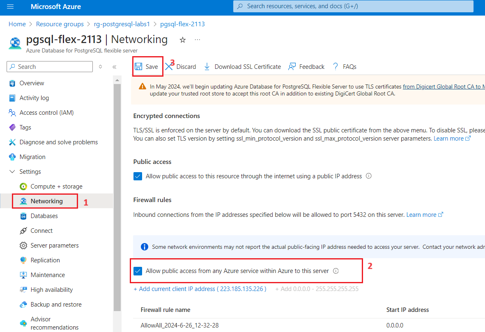
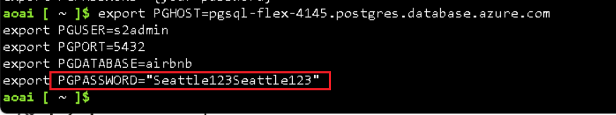
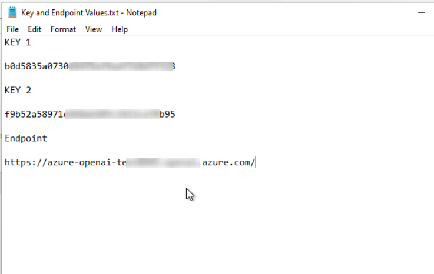
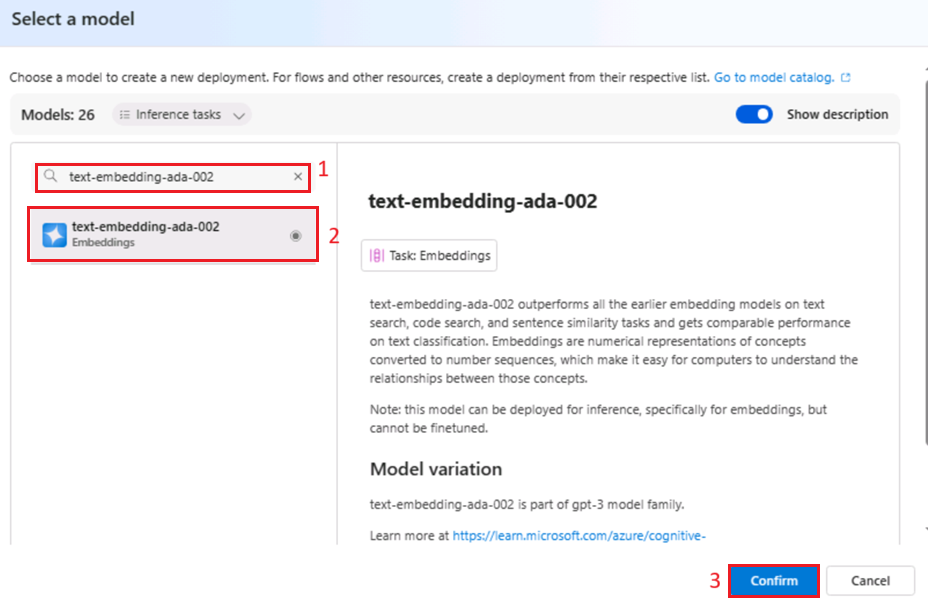
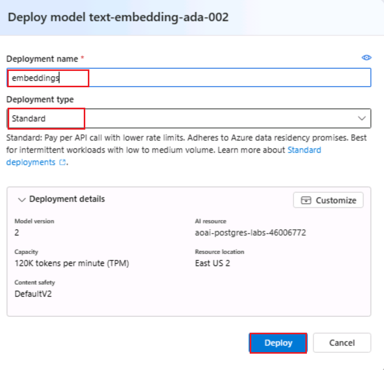
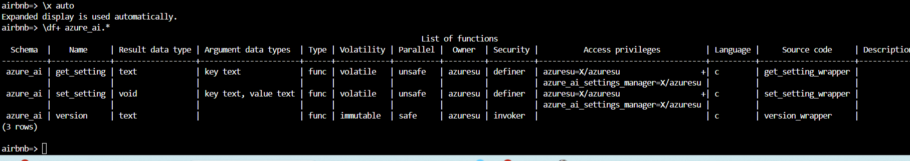
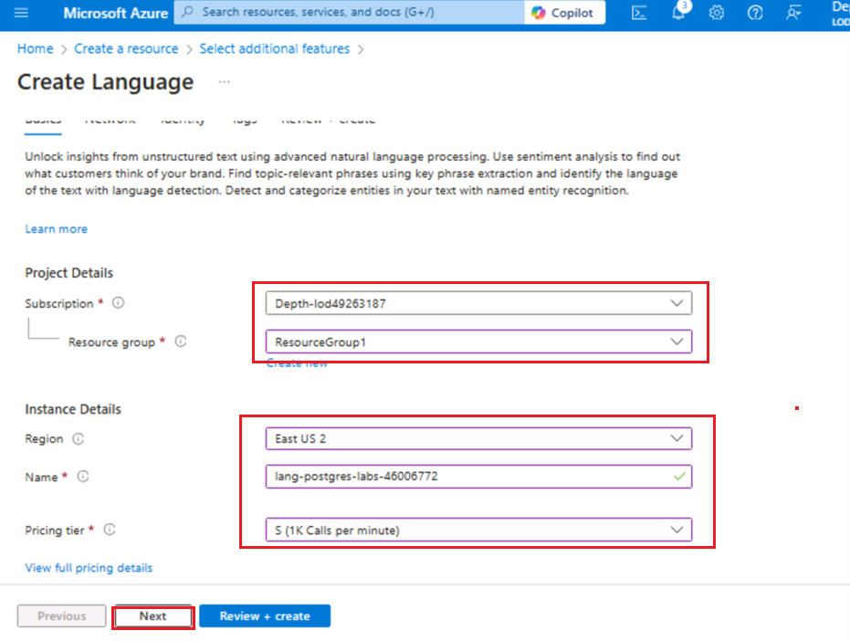
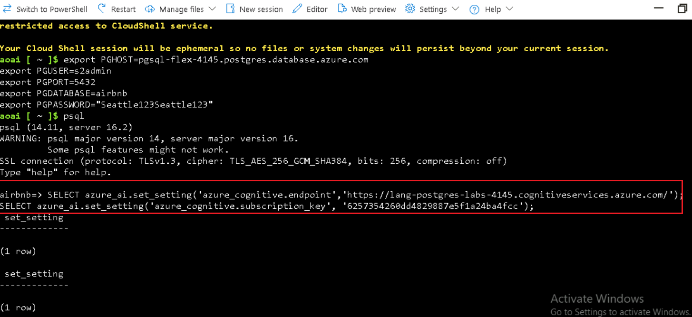
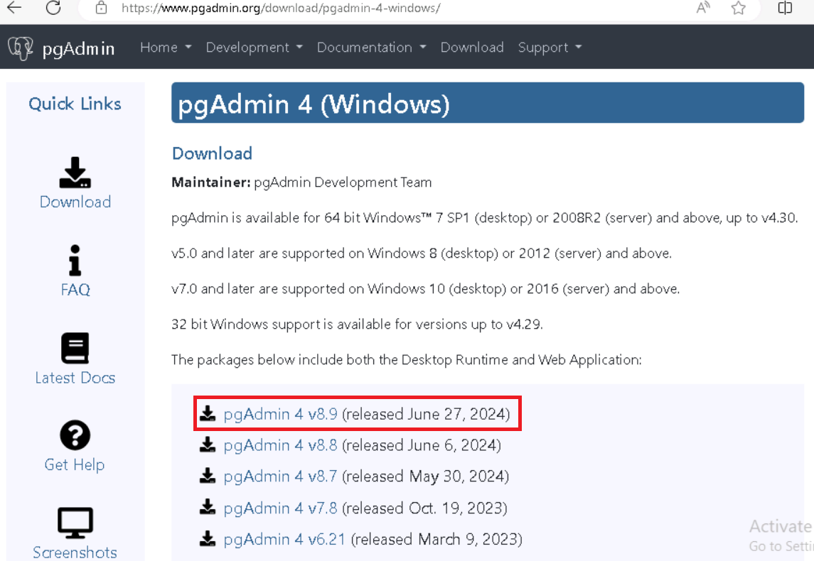
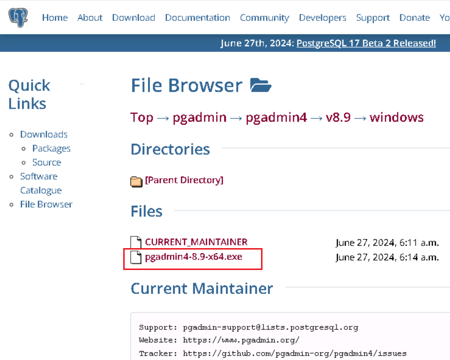

**소개**

이 실습에서는 Azure AI 서비스를 PostgreSQL과 통합해 고급 AI 기능으로
데이터베이스를 향상시키는 방법을 배우게 됩니다. pgvector, PostGIS와 같은
Azure OpenAI 및 PostgreSQL 확장 기능을 활용해 정교한 텍스트 분석, 벡터
유사도 검색, 지리 공간 쿼리 등을 데이터베이스 내에서 직접 활성화할 수
있습니다. 이 실습은 필요한 Azure 리소스를 프로비저닝하고, 데이터베이스를
설정하며, AI 기반 인사이트와 지리공간 데이터를 결합한 복합 쿼리를
실행하는 전 과정을 안내합니다.**목표**

- Azure Database for PostgreSQL Flexible Server를 프로비저닝 및 구성하기

- Azure OpenAI 서비스를 활용해 벡터 임베딩을 생성 및 관리

- 의미론적으로 유사한 텍스트 데이터를 찾기 위해 벡터 유사성 검색을 수행

- PostGIS 확장을 활용해 지리공간 데이터 분석

- Azure AI Language 서비스 통합해 감정 분석 및 기타 인지 기능 적용

- 인덱싱 및 쿼리 계획 도구를 사용해 쿼리 성능을 최적화 및 분석

# 연습 1: Azure Database for PostgreSQL Flexible Server 프로비저닝하기

1.  

## 작업 1: Azure Database for PostgreSQL Flexible Server 프로비저닝하기

1.  브라우저를 열고 주소 표시줄에 다음 URL을 입력 또는 붙여넣은 후,
    **Enter** 키를 누르세요: +++https://portal.azure.com/+++

> 

2.  **Microsoft Azure** 창에서 **User Credentials** 사용해 Azure에
    로그인하세요.

3.  그 후, 비밀번호를 입력하고 **Sign in** 버튼을 클릭하세요**.**

> 

4.  **Stay signed in?** 창에 **Yes** 버튼을 클릭하세요.

> 

5.  Azure portal 상단 도구 모음에서 **Cloud Shell** 아이콘을 선택하여
    브라우저 상단에 새로운 Cloud Shell 창을 여세요.

6.  Cloud Shell을 처음 열면 사용할 shell 유형(**Bash** 또는
    **PowerShell**)을 선택하라는 메시지가 표시될 수 있습니다. 이 경우
    **Bash** 선택하세요.

7.  In **Getting started** 대화 상자가 표시되면 **Mount storage
    account** 선택하고, 자신의 azure 구독 서비스를 선택한 후 **Apply**
    버튼을 클릭하세요**.**

8.  **Mount storage account** 대화 상자에서 **we will create a storage
    account for you**를 선택한 후 **Next** 버튼을 클릭하세요.

> 
>
> 

1.  Cloud Shell 프롬프트에서 아래 명령어를 실행하여 리소스 생성을 위한
    변수를 정의하세요. 이 변수들은 리소스 그룹과 데이터베이스에 지정할
    이름 및 리소스를 배포할 Azure 지역을 의미합니다.

2.  지정된 리소스 그룹 이름은 **rg-postgresql-labs**이지만, 이 실습과
    관련된 리소스를 호스팅할 이름은 사용자가 원하는 이름으로 자유롭게
    지정할 수 있습니다.

> **+++RG_NAME=ResourceGroup1**
>
> 

3.  데이터베이스 이름에 있는 {SUFFIX} 부분은 본인만의 고유한 값으로
    바꿔주세요. 예를 들어, 본인의 이니셜을 사용하면 됩니다. 이렇게 하면
    데이터베이스 서버 이름이 전 세계적으로 고유하게 유지됩니다.

> **+++DATABASE_NAME=pgsql-flex-{SUFFIX}+++**

4.  지역은 실습 리소스에 사용할 위치로 변경해 주세요. 이 실습에서는
    eastus를 사용합니다.

> **+++REGION=eastus2+++**

5.  다음 Azure CLI 명령어를 실행해 위에서 생성한 리소스 그룹 내에 Azure
    Database for PostgreSQL 데이터베이스 인스턴스를 프로비저닝하세요.
    (소요 시간: 10분

**az postgres flexible-server create --name $DATABASE_NAME --location
$REGION --resource-group $RG_NAME \\**

**--admin-user s2admin --admin-password Seattle123Seattle123
--database-name airbnb \\**

**--public-access 0.0.0.0-255.255.255.255 --version 16 \\**

**--sku-name Standard_D2s_v3 --storage-size 32 --yes**

## 작업 2: Azure Cloud Shell에서 psql을 사용해 데이터베이스에 연결하기

이작업에서는 Azure Cloud Shell에서 psql 명령줄 유틸리티를 사용해
데이터베이스에 연결합니다.

1.  브라우저를 열고https://portal.azure.com 으로 이동하여 Azure 구독
    계정으로 로그인합니다.

2.  홈페이지에서**Resource Groups**를 클릭하세요.

3.  리소스 그룹 이름을 클릭하세요.

> 

4.  리소스 그룹에서 **PostgreSQL Flexible Server** 리소스를 선택하세요.

5.  왼쪽 탐색 메뉴의 **Settings**에서 **Connect** 선택하세요.

6.  Azure 포털에서 데이터베이스의 **Connect** 페이지에서 airbnb를
    **Database name**로 선택하세요. 그 후, **Connection details** 블록을
    복사하고 메모장에 붙여어 향후 작업에서 사용할 수 있도록 하세요.

> 

7.  Azure Database for PostgreSQL 홈페이지의 왼쪽 탐색 메뉴에서
    **Overview**를 클릭하고, 서버 이름(Server name)을 복사하여 메모장에
    붙여넣은 후, 향후 실습에 사용할 수 있도록 메모장을 **Save**하세요.

8.  Azure Database for PostgreSQL 홈페이지의 설정에서 Networking을
    선택하고 **Allow public access to this resource through the internet
    using a public IP address**를 선택하세요. **Save** 버튼을
    클릭하세요.

9.  Azure portal 도구모음에서 **Cloud Shell** 아이콘을 선택해 브라우저
    창 상단에 새로운 Cloud Shell 창을 여세요.

10. Cloud Shell에 **Connection details** 을 붙여넣으세요.

11. Cloud Shell 프롬프트에서**{your_password}** 토큰을 데이터베이스를
    생성할 때 **s2admin** 사용자에게 할당한 비밀번호,
    즉 **Seattle123Seattle123**로 변경해야 합니다.

> 

12. 프롬프트에 다음 명령어를 입력하여 psql 명령줄 유틸리티를 사용해
    데이터베이스에 연결하세요:

> **+++psql+++**

Cloud Shell에서 데이터베이스에 연결하려면, 데이터베이스의 **Networking**
페이지에서 Allow public access from any Azure service within Azure to
the server 옵션이 선택되어 있어야 합니다. 연결할 수 없다는 메시지가
표시되면, 해당 옵션이 체크되어 있는지 확인한 후 다시 시도하세요.

## 작업 3: 데이터베이스에 데이터 추가

psql 명령 프롬프트를 사용하여, 이번 실습에서 사용할 테이블을 생성하고
데이터를 삽입하게 됩니다.

1.  공용 Blob Storage 계정에서 JSON 데이터를 가져오기 위해 아래 명령어를
    실행하여 임시 테이블을 생성하세요.

> !!CREATE TABLE temp_calendar (data jsonb);
>
> CREATE TABLE temp_listings (data jsonb);
>
> CREATE TABLE temp_reviews (data jsonb);!!

2.  COPY 명령어를 사용하여, 공용 스토리지 계정에 있는 JSON 파일로부터 각
    임시 테이블에 데이터를 삽입하세요.

+++\COPY temp_calendar (data) FROM PROGRAM 'curl
https://solliancepublicdata.blob.core.windows.net/ms-postgresql-labs/calendar.json'+++

!!\COPY temp_listings (data) FROM PROGRAM 'curl
https://solliancepublicdata.blob.core.windows.net/ms-postgresql-labs/listings.json'!!

\COPY temp_reviews (data) FROM PROGRAM 'curl
https://solliancepublicdata.blob.core.windows.net/ms-postgresql-labs/reviews.json'

3.  이 실습에서 사용하는 형식에 맞게 데이터를 저장할 테이블을 생성하려면
    다음 명령어를 실행하세요:

> CREATE TABLE listings (
>
> listing_id int,
>
> name varchar(50),
>
> street varchar(50),
>
> city varchar(50),
>
> state varchar(50),
>
> country varchar(50),
>
> zipcode varchar(50),
>
> bathrooms int,
>
> bedrooms int,
>
> latitude decimal(10,5),
>
> longitude decimal(10,5),
>
> summary varchar(2000),
>
> description varchar(2000),
>
> host_id varchar(2000),
>
> host_url varchar(2000),
>
> listing_url varchar(2000),
>
> room_type varchar(2000),
>
> amenities jsonb,
>
> host_verifications jsonb,
>
> data jsonb
>
> );
>
> 
>
> CREATE TABLE reviews (
>
> id int,
>
> listing_id int,
>
> reviewer_id int,
>
> reviewer_name varchar(50),
>
> date date,
>
> comments varchar(2000)
>
> );
>
> CREATE TABLE calendar (
>
> listing_id int,
>
> date date,
>
> price decimal(10,2),
>
> available boolean
>
> );
>
> 

4.  마지막으로, 다음INSERT INTO 문을 실행하여 임시 테이블에서 메인
    테이블로 데이터를 불러오고 JSON 데이터 필드에서 개별 열로 데이터를
    추출하세요:

> INSERT INTO listings
>
> SELECT
>
> data\['id'\]::int,
>
> replace(data\['name'\]::varchar(50), '"', ''),
>
> replace(data\['street'\]::varchar(50), '"', ''),
>
> replace(data\['city'\]::varchar(50), '"', ''),
>
> replace(data\['state'\]::varchar(50), '"', ''),
>
> replace(data\['country'\]::varchar(50), '"', ''),
>
> replace(data\['zipcode'\]::varchar(50), '"', ''),
>
> data\['bathrooms'\]::int,
>
> data\['bedrooms'\]::int,
>
> data\['latitude'\]::decimal(10,5),
>
> data\['longitude'\]::decimal(10,5),
>
> replace(data\['description'\]::varchar(2000), '"', ''),
>
> replace(data\['summary'\]::varchar(2000), '"', ''),
>
> replace(data\['host_id'\]::varchar(50), '"', ''),
>
> replace(data\['host_url'\]::varchar(50), '"', ''),
>
> replace(data\['listing_url'\]::varchar(50), '"', ''),
>
> replace(data\['room_type'\]::varchar(50), '"', ''),
>
> data\['amenities'\]::jsonb,
>
> data\['host_verifications'\]::jsonb,
>
> data::jsonb
>
> FROM temp_listings;
>
> INSERT INTO reviews
>
> SELECT
>
> data\['id'\]::int,
>
> data\['listing_id'\]::int,
>
> data\['reviewer_id'\]::int,
>
> replace(data\['reviewer_name'\]::varchar(50), '"', ''),
>
> to_date(replace(data\['date'\]::varchar(50), '"', ''), 'YYYY-MM-DD'),
>
> replace(data\['comments'\]::varchar(2000), '"', '')
>
> FROM temp_reviews;
>
> INSERT INTO calendar
>
> SELECT
>
> data\['listing_id'\]::int,
>
> to_date(replace(data\['date'\]::varchar(50), '"', ''), 'YYYY-MM-DD'),
>
> data\['price'\]::decimal(10,2),
>
> replace(data\['available'\]::varchar(50), '"', '')::boolean
>
> FROM temp_calendar;

# 연습 2: Azure AI와 Vector 확장 기능을 허용 목록에 추가하기

실습 전반에 걸쳐 azure_ai와 pgvector 확장 기능을 활용해 PostgreSQL
데이터베이스에 generative AI 기능을 추가하게 됩니다. 이번 단계에서는
PostgreSQL 확장 기능 사용 방법 가이드에 따라, 해당 확장 기능을 서버의
*허용 목록(allowlist*)에 추가합니다.

1.  홈페이지에서 **Resource Groups**를 클릭하세요.

2.  리소스 그룹 이름을 클릭하세요.

> 

3.  리소스 그룹에서 **PostgreSQL Flexible Server** 리소스를 선택하세요.

4.  F데이터베이스의 왼쪽 탐색 메뉴에서**Settings**의 **Server
    parameters**를 선택한 후, 검색 상자에 azure.extensions를 입력하세요.
    **VALUE** 드롭다운 목록을 확장한 후, 다음 확장 기능 옆에 있는 상자를
    찾아 선택하세요:

    - AZURE_AI

    - POSTGIS (실습 3을 완료한 경우 이미 선택되어 있음)

    - VECTOR

5.  도구 모음에서 **Save**을 선택하면 데이터베이스에서 배포가
    시작됩니다.

# 연습3: Azure OpenAI 리소스 생성

azure_ai 확장 기능은 벡터 임베딩 생성을 위해 기본적으로 Azure OpenAI
서비스를 필요로 합니다. 이번 연습에서는 Azure 포털에서 Azure OpenAI
리소스를 프로비저닝하고, 해당 서비스에 임베딩 모델을 배포게 됩니다.

## 작업 1: Azure OpenAI 서비스 프로비저닝하기

이 작업에서는 새로운 Azure OpenAI 서비스를 생성하게 됩니다.

1.  Azure 포털 홈페이지에서, 아래 이미지와 같이 Microsoft Azure 명령
    모음의 왼쪽에 있는 세 개의 가로 막대 아이콘(햄버거 메뉴)을 클릭하여
    **Azure portal menu**를 여세요.

> 

2.  **+ Create a resource**를 찾아 클릭하세요.

> 

3.  **Create a resource** 페이지에서 **Search services and marketplace**
    검색 입력란에 **Azure OpenAI**를 입력한 후, **Enter** 버튼을
    누르세요.

> 

4.  In the **Marketplace** 페이지에서 **Azure OpenAI** 섹션으로 이동한
    후, Create 버튼의 드롭다운을 클릭하고**Azure OpenAI**를
    선택하세요(이미지 참고). (이미 **Azure OpenAI** 타일을 클릭했다면,
    **Azure OpenAI page**에서 **Create** 버튼을 클릭)

> 

5.  Create Azure OpenAI **Basics** 탭에서 다음 정보를 입력한 후**Next**
    버튼을 클릭하세요.

[TABLE]

> 

6.  **Network** 탭에서 모든 라디오 버튼은 기본값 그대로 둔 상태로,
    **Next** 버튼을 클릭하세요.

> 

7.  **Tags** 탭에서 모든 필드를 기본값 그대로 둔 상태로, **Next** 버튼을
    클릭하세요.

> 

8.  **Review+submit** 탭에서 유효성 검사(Validation)가 통과되면, Create
    버튼을 클릭하세요.

9.  배포가 완료될 때까지 기다리세요. 배포에는 약 2~3분 정도 소요됩니다.

> **참고**: Azure OpenAI 서비스는 현재 신청서를 통해 고객에게 제공된다는
> 메시지가 표시되면, 선택한 구독은 이 서비스에 대해 활성화되지 않았고,
> 가격 책정 계층에 할당량도 없습니다. 이 경우, 안내된 링크를 클릭하여
> **Azure OpenAI 서비스 접근 요청 신청서를** 작성해야 합니다.

## 작업 2: Azure OpenAI 서비스의 키와 엔드포인트 가져오기

1.  리소스 **Overview** 페이지에서 **Go to resource** 버튼을 선택하세요.
    프롬프트가 표시되면, 실습용 자격 증명을 선택하세요:

2.  **Azure OpenAI home** 창에서 **Resource Management** 섹션으로
    이동하여 **Keys and Endpoints**를 클릭하세요.

3.  In **Keys and Endpoints** 페이지에서 **KEY1, KEY 2 및** **Endpoint**
    값을 복사하여 아래 이미지와 같이 메모장에 붙여넣으세요. 그 후,
    메모장을 저장(save)하여 향후 작업에서 사용할 수 있도록 합니다.

***참고:** KEY1 또는 KEY2를 사용할 수 있습니다. 두 개의 키를 항상
보유하는 것은 키를 안전하게 교체 또는 재생성할 수 있게 해주며 서비스
중단 없이 관리할 수 있습니다*.

## 작업3: 임베딩 모델 배포

azure_ai 확장 기능은 텍스트에서 벡터 임베딩을 생성할 수 있게 해줍니다.
이 임베딩을 생성하려면 Azure OpenAI 서비스
내에서text-embedding-ada-002(버전2) 모델이 배포되어 있어야 합니다. 이
작업에서는 Azure OpenAI Studio를 사용하여 배포할 모델을 생성합니다.

1.  In **Azure OpenAI** 페이지의 왼쪽 탐색 메뉴에서**Overview** 클릭한
    후, 아래로 스크롤하여 아래 이미지와 같이 **Go to Azure OpenAI
    Studio** 버튼을 클릭하세요.

> 
>
> 

2.  **Azure AI Foundry | Azure Open AI Service** 홈페이지에서
    **Components** 섹션으로 이동하여 **Deployments**을 클릭하세요.

3.  **Deployments** 창에서 **+Deploy model**를 드롭다운하고 **Deploy
    base model**을 선택하세요.

4.  **Select a model** 대화 상자에서 **text-embedding-ada-002**로 이동한
    후 선택하세요. **Confirm** 버튼을 클릭하세요.

4.  **Deploy model** 대화상자 에서 다음 설정을 하고**Create** 버튼을
    선택하여 모델을 배포하세요.

    - **Select a model**: 목록에서 **text-embedding-ada-002** 선택

    - **Model version**: **2 (Default)**가 선택되어 있는지 확인

    - **Deployment name**: +++**embeddings**+++ 입력

> 
>
> 

5.  In the **Deployments** 창에서**Deployment name** 을 복사하여 아래
    이미지와 같이 메모장에 붙여넣으세요. 메모장을 저장(**save**)하여
    향후 작업에서 사용할 수 있도록 합니다.

# 연습 4: azure_ai 확장 기능 설치 및 구성

이 연습에서는 azure_ai 확장 기능을 데이터베이스에 설치하고 이를 Azure
OpenAI 서비스에 연결하도록 구성하게 되됩니다.

## 작업 1: Azure Cloud Shell에서 psql을 사용해 데이터베이스에 연결

이 작업에서는 Azure Cloud Shell에서 psql 명령어 유틸리티를 사용하여
데이터베이스에 연결합니다.

1.  Azure portal 도구 모음에서 **Cloud Shell** 아이콘을 선택해 브라우저
    창 상단에 새로운 [Cloud
    Shell](https://learn.microsoft.com/azure/cloud-shell/overview) 창을
    여세요.

2.  **Connection details** 을 Cloud Shell에 붙여넣으세요.

3.  At the Cloud Shell ㅍ프롬프트에서 **{your_password}** 토큰을,
    데이터베이스를 생성할 때 **s2admin** 사용자에게 설정한 비밀번호로
    교체합니다. 비밀번호는 다음과 같습니다: **Seattle123Seattle123**.

4.  프롬프트에 다음을 입력하여 psql 명령줄 유틸리티를 사용하여
    데이터베이스에 연결하세요:

> **!!psql!!**

## 작업 2: azure_ai 확장 기능 설치

azure_ai 확장 기능을 사용하면 Azure OpenAI 및 Azure Cognitive Services를
데이터베이스와 통합할 수 있습니다. 이 확장 기능을 활성화하려면 아래
단계를 따라 진행하세요:

1.  psql 명령 프롬프트에서 다음 명령어를 실행하여 확장 기능이 허용
    목록에 성공적으로 추가되었는지 확인하세요::

> **!!SHOW azure.extensions;!!**

2.  [CREATE
    EXTENSION](https://www.postgresql.org/docs/current/sql-createextension.html) 명령을
    사용해 azure_ai 확장 기능을 설치하세요 .

> **!!CREATE EXTENSION IF NOT EXISTS azure_ai;!!**

## 작업3: azure_ai 확장 기능에 포함된 객체 검토

azure_ai **확장 기능에 포함된 객체를 검토하면, 이 확장 기능이 제공하는
기능을 더 잘 이해할 수 있습니다.** 이 작업에서는 확장을 통해
데이터베이스에 추가된 다양한 **스키마**, **사용자 정의된 함수(UDF)** 및
**복합 타입(composite types)** 을 살펴봅니다.

1.  **psq**l 명령
    프롬프트에서 [\dx meta-command](https://www.postgresql.org/docs/current/app-psql.html#APP-PSQL-META-COMMAND-DX-LC)를
    사용하면 해당 확장 기능에 포함된 객체들을 확인할 수 있습니다.

> **+++\dx+ azure_ai+++**
>
> 
>
> 
>
> 메타 명령어의 출력 결과는 azure_ai 확장 기능이 데이터베이스에 세 개의
> 스키마(schemas), 여러 사용자 정의 함수(UDFs) 및 몇 개의 복합
> 타입(composite types)을 생성한다는 것을 보여줍니다. 아래 표에는 이
> 확장 기능에 의해 추가된 스키마 목록과 각각에 대한 설명이 나와
> 있습니다.

[TABLE]

2.  모든 함수와 데이터 유형은 각각 하나의 스키마에 연결되어 있습니다.
    azure_ai 스키마에 정의된 함수들을 확인하려면 \df 메타 명령어를
    사용하고, 표시할 함수가 속한 스키마를 지정하면 됩니다. \df  앞에 \x
    명령어를 사용하면, 필요할 때 자동으로 확장된 보기 형식이 적용되어
    Azure Cloud Shell에서 명령어 출력 결과를 더 쉽게 확인할 수 있습니다.

> **!!\x auto!!**
>
> **\df+ azure_ai.\***

The azure_ai.set_setting() 함수는 Azure AI 서비스에 사용할 엔드포인트와
키 값을 설정할 수 있도록 해줍니다. 이 함수는 설정할 **key**와 해당
**value**를 인자로 받습니다. 반면,
azure_ai.get_setting() 함수는 set_setting() 함수를 통해 설정한 값을
가져올 수 있도록 해줍니다. 이 함수는 확인하고자 하는 설정 **key**를
인자로 받습니다. 두 함수 모두에서 사용할 수 있는 키는 다음 중 하나여야
합니다:

## 작업 4: Azure OpenAI 엔드포인트 및 키 설정

azure_openai 함수 사용하기 전에 Azure OpenAI 서비스 엔드포인트 및 키를
설정해야 합니다.

1.  다음 명령에서{endpoint} 및 {api-key} 토큰을Azure 포털에서 가져온
    값으로 변경 후, Cloud Shell 창의 psql 명령 프롬프트에서 명령을
    실행해 구성 테이블에 값을 추가하세요.

> **!!SELECT
> azure_ai.set_setting('azure_openai.endpoint','{endpoint}');**
>
> **SELECT azure_ai.set_setting('azure_openai.subscription_key',
> '{api-key}');!!**

2.  다음 쿼리를 사용하여 구성 테이블에 기록된 설정을 확인하세요:

> +++SELECT azure_ai.get_setting('azure_openai.endpoint');

SELECT azure_ai.get_setting('azure_openai.subscription_key');+++

이제 azure_ai 확장이 Azure OpenAI 계정에 연결되었으며, 벡터 임베딩 생성
준비가 완료되었습니다.

# 연습 5: Azure OpenAI로 벡터 임베딩 생성

The azure_ai 확장의 azure_openai 스키마는 Azure OpenAI가 텍스트 값을
위한 벡터 임베딩을 생성할 수 있도록 합니다. 이 스키마를 사용하면
데이터베이스에서 직접 Azure OpenAI를 통해 임베딩을 생성하여 입력
텍스트의 벡터 표현을 만들 수 있으며, 이를 벡터 유사도 검색에 활용 또는
머신러닝 모델에서 사용할 수 있습니다.

임베딩은 머신러닝과 자연어 처리(NLP)에서 객체(예: 단어, 문서, 엔터티
등)를 다차원 공간의 벡터로 표현하는 개념입니다. 임베딩은 머신러닝 모델이
정보 간의 관계를 평가할 수 있도록 해줍니다. 이 기법은 데이터 간의 관계와
유사성을 효율적으로 식별하여 알고리즘이 패턴을 인식하고 정확한 예측을 할
수 있게 합니다.

## 작업 1: pgvector 확장으로 벡터 지원 활성화

azure_ai extension 확장은 입력 텍스트에 대한 임베딩을 생성할 수
있습니다. 생성된 벡터를 데이터베이스의 다른 데이터와 함께 저장하려면,
데이터베이스 문서에서 제공하는 지침에 따라 pgvector 확장을 설치해야
합니다.

1.  [CREATE
    EXTENSION](https://www.postgresql.org/docs/current/sql-createextension.html) 명령을
    사용해 pgvector 확장을 설치하세요.

> **!!CREATE EXTENSION IF NOT EXISTS vector;!!**
>
> 

2.  벡터 지원을 데이터베이스에 추가한 상태에서 listings 테이블에 새 열을
    추가하여 테이블 내에 임베딩을
    저장하세요. text-embedding-ada-002 모델은 1536 차원의 벡터를
    생성하므로, 벡터 크기로 1536을 지정해야 합니다.

> +++**ALTER TABLE listings**

**ADD COLUMN description_vector vector(1536);+++**

## 작업2: 벡터 임베딩 생성 및 저장

listings 테이블이 이제 임베딩을 저장할 준비가
되었습니다. azure_openai.create_embeddings() 함수를
사용하여 description 필드의 텍스트로부터 벡터를 생성하고, listings 
테이블의 새로 생성된 description_vector 열에 삽입합니다.

1.  create_embeddings() ㄹ함수를 사용하기 전에, 필요한 인자들을 확인하기
    위해 아래 명령어를 실행하여 해당 함수를 살펴보세요:

> **+++\df+ azure_openai.\*+++**

The  property in the output of the \df+ azure_openai.\* 명령의 출력에
있는Argument data types 속성을 통해 함수가 요구하는 인자들의 목록을
확인할 수 있습니다.

[TABLE]

2.  배포 이름을 사용해 다음 쿼리를 실행하여 listings 테이블의 각
    레코드를 업데이트하고, azure_openai.create_embeddings() 함수를
    사용하여 description 필드에 대해 생성된 벡터 임베딩을
    description_vector 열에 삽입하세요. {your-deployment-name}을 Azure
    OpenAI Studio **Deployments**페이지에서 복사한 **Deployment
    name** 값으로 변경하세요. 이 쿼리를 완료하는 데 약 5분 정도 소요될
    수 있습니다.

> **DO $$**
>
> **DECLARE counter integer := (SELECT COUNT(\*) FROM listings WHERE
> description \<\> '' AND description_vector IS NULL);**
>
> **DECLARE r record;**
>
> **BEGIN**
>
> **RAISE NOTICE 'Total descriptions to embed: %', counter;**
>
> **WHILE counter \> 0 LOOP**
>
> **BEGIN**
>
> **FOR r IN**
>
> **SELECT listing_id FROM listings WHERE description \<\> '' AND
> description_vector IS NULL**
>
> **LOOP**
>
> **BEGIN**
>
> **UPDATE listings**
>
> **SET description_vector =
> azure_openai.create_embeddings('{your-deployment-name}',
> description)**
>
> **WHERE listing_id = r.listing_id;**
>
> **EXCEPTION**
>
> **WHEN OTHERS THEN**
>
> **RAISE NOTICE 'Waiting 1 second before trying again...';**
>
> **PERFORM pg_sleep(1);**
>
> **END;**
>
> **counter := (SELECT COUNT(\*) FROM listings WHERE description \<\> ''
> AND description_vector IS NULL);**
>
> **IF counter % 25 = 0 THEN**
>
> **RAISE NOTICE 'Remaining descriptions to embed: %', counter;**
>
> **END IF;**
>
> **END LOOP;**
>
> **END;**
>
> **END LOOP;**
>
> **END;**
>
> **$$;!!**
>
> 
>
> 위 쿼리는 description_vector 필드가 NULL이고 description 필드가
> 비어있지 않은 레코드를 listings 테이블에서 가져와 반복적으로 처리하는
> WHILE 루프를 사용합니다. 이 쿼리는
> azure_openai.create_embeddings 함수를 사용하여 description 열의 내용을
> 벡터로 변환하고, 그 결과를 description_vector 열에 업데이트합니다.
> 이와 같은 루프 방식은 Azure OpenAI 서비스의 호출 속도 제한(rate
> limit)을 초과하지 않도록 하기 위한 것입니다. 호출 제한을 초과하면
> 아래와 같은 경고 메시지가 표시될 수 있습니다:
>
> **NOTICE**: Waiting 1 second before trying again...

> 

3.  아래 쿼리를 실행하면 description_vector 열이 모든 레코드에 잘
    저장되었는지 확인할 수 있습니다:

> **!!SELECT COUNT(\*) FROM listings WHERE description_vector IS NULL
> AND description \<\> '';!!**
>
> 쿼리의 결과는 0의 개수여야 합니다.

## 작업 3: 벡터 유사도 검색 수행

벡터 유사도는 두 항목의 유사성을 숫자들의 집합인 벡터로 표현하여
측정하는 방법입니다. 벡터는 종종 LLM(대형 언어 모델)을 활용한 검색에
사용됩니다. 벡터 유사도는 일반적으로 유클리드 거리(Euclidean distance)
또는 코사인 유사도(Cosine similarity) 같은 거리 기반 메트릭을 통해
계산됩니다. 유클리드 거리는 n차원 공간에서 두 벡터 간의 직선 거리를
측정하며, 코사인 유사도는 두 벡터 사이의 각도의 코사인 값을 측정합니다.
각 임베딩은 부동소수점 숫자로 구성된 벡터이므로, 벡터 공간에서 임베딩
간의 거리는 원래 입력 간의 의미적 유사성과 밀접한 관련이 있습니다.

1.  벡터 유사도 검색을 실행하기 전에, 아래 쿼리를 ILIKE을 사용해 실행해
    보세요. 이 쿼리는 벡터 유사도를 사용하지 않고 자연어 쿼리를 통해
    레코드를 검색할 때의 결과를 관찰하는 데 도움이 됩니다:

**!!SELECT listing_id, name, description FROM listings WHERE description
ILIKE '%Properties with a private room near Discovery Park%';!!**

> 쿼리는 설명 필드의 텍스트를 제공된 자연어 쿼리와 일치시키려고 시도하기
> 때문에 0개의 결과를 반환합니다.

2.  이제 listings 테이블에 대해 코사인 유사성 검색 쿼리를 실행하여 목록
    설명에 대해 벡터 유사성 검색을 수행합니다. 임베딩은 입력 질문에 대해
    생성된 다음 벡터 배열(::vector)로 캐스팅되어 listings 테이블에
    저장된 벡터와 비교할 수 있습니다. {your-deployment-name}을 Azure
    OpenAI Studio **Deployments** 페이지에서 복사한 **Deployment name**
    값으로 변경하세요.

> **!!SELECT listing_id, name, description FROM listings**
>
> **ORDER BY description_vector \<=\>
> azure_openai.create_embeddings('{your-deployment-name}', 'Properties
> with a private room near Discovery Park')::vector**
>
> **LIMIT 3;!!**

이 쿼리에서는 \<=\> 백터 연산자를 사용합니다. 이 연산자는 다차원
공간에서 두 벡터 간의 거리를 계산할 때 사용되는 "코사인 거리(cosine
distance)" 연산자를 나타냅니다.

3.  EXPLAIN ANALYZE 절을 사용해 동일한 쿼리를 다시 실행하여 쿼리 계획 및
    실행 시간을 확인하세요. Replace {your-deployment-name} ㅇ을 Azure
    OpenAI Studio **Deployments** 페이지에서 복사한 **Deployment
    name** 값으로 변경하세요.

> **!!EXPLAIN ANALYZE**
>
> **SELECT listing_id, name, description FROM listings**
>
> **ORDER BY description_vector \<=\>
> azure_openai.create_embeddings('{your-deployment-name}', 'Properties
> with a private room near Discovery Park')::vector**
>
> **LIMIT 3;!!**

출력 결과에서 쿼리 계획을 확인해 보세요. 보통 다음과 비슷한 내용으로
시작됩니다:

> Limit (cost=1098.54..1098.55 rows=3 width=261) (actual
> time=10.505..10.507 rows=3 loops=1)
>
> -\> Sort (cost=1098.54..1104.10 rows=2224 width=261) (actual
> time=10.504..10.505 rows=3 loops=1)
>
> ...
>
> Sort Method: top-N heapsort Memory: 27kB
>
> -\> Seq Scan on listings (cost=0.00..1069.80 rows=2224 width=261)
> (actual time=0.005..9.997 rows=2224 loops=1)
>
> 쿼리는 순차 스캔 정렬((Sequential Scan Sort))을 사용해 조회를
> 수행합니다. 계획 및 실행 시간은 결과 끝에 표시되며 다음과 유사해야
> 합니다:
>
> Planning Time: 62.020 ms
>
> Execution Time: 10.530 ms

4.  vector 필드에 대해 더 효율적인 검색이 가능하도록, 코사인 거리(cosine
    distance)와 HNSW(Hierarchical Navigable Small World)를 사용하여
    listings 테이블에 인덱스를 생성하세요. HNSW는 최신 그래프 기반
    알고리즘을 활용해 근사 최근접 이웃(approximate nearest-neighbor)
    쿼리를 수행할 수 있도록 pgvector 에 최적화된 방식입니다.

> **!!CREATE INDEX ON listings USING hnsw (description_vector
> vector_cosine_ops);!!**

5.  HNSW 인덱스가 테이블에 미치는 영향을 확인하려면, EXPLAIN ANALYZE
    절을 사용하여 쿼리를 다시 실행해 보세요. 쿼리의 실행 계획과 실행
    시간을 비교할 수 있습니다. Azure OpenAI Studio의 **Deployments**
    페이지에서 복사한 **Deployment name** 값으로
    {your-deployment-name}을 교체해 주세요.

> EXPLAIN ANALYZE
>
> SELECT listing_id, name, description FROM listings
>
> ORDER BY description_vector \<=\>
> azure_openai.create_embeddings('{your-deployment-name}', 'Properties
> with a private room near Discovery Park')::vector
>
> LIMIT 3;

출력 결과에서 쿼리 계획을 확인해 보면, 이제 더 효율적인 인덱스
스캔(Index Scan)이 포함되어 있는 것을 확인할 수 있습니다:

Limit (cost=116.48..119.33 rows=3 width=261) (actual time=1.112..1.130
rows=3 loops=1)

-\> Index Scan using listings_description_vector_idx on listings
(cost=116.48..2228.28 rows=2224 width=261) (actual time=1.111..1.128
rows=3 loops=1)

쿼리 실행 시간은 쿼리 계획 및 실행에 소요된 시간이 크게 줄어든 것을
반영해야 합니다:

Planning Time: 56.802 ms

Execution Time: 1.167 ms

# 연습 6: Azure AI Services 통합

azure_ai 확장의 azure_cognitive 스키마에 포함된 Azure AI 서비스 통합은
데이터베이스에서 직접 액세스할 수 있는 풍부한 AI Language 기능을
제공합니다. 기능에는 감정 분석, 언어 감지, 핵심 구문 추출, 엔터티 인식
및 텍스트 요약이 포함됩니다. 이러한 기능은 [Azure AI Language 서비스를
통해
활성화됩니다](https://learn.microsoft.com/azure/ai-services/language-service/overview).

이 확장을 통해 액세스할 수 있는 Azure AI 기능의 전체 목록을 검토하려면
[Azure Cognitive Services와 Azure Database for PostgreSQL Flexible
Server 통합 문서를
참조하세요](https://learn.microsoft.com/azure/postgresql/flexible-server/generative-ai-azure-cognitive).

## 작업 1: Azure AI Language 서비스 프로비저닝

 azure_ai 확장 인식 기능을 활용하려면 [Azure AI
Language](https://learn.microsoft.com/azure/ai-services/language-service/overview)
서비스가 필요합니다. 이 연습에서는 Azure AI Language 서비스를 생성할
것입니다.

1.  Azure 포털 홈 페이지에서, 아래 이미지와 같이 Microsoft Azure 명령 바
    왼쪽에 있는 세 개의 수평 바 아이콘으로 표시된 **Azure portal
    menu**를 클릭하세요..

2.  **Create a resource** 페이지의 왼쪽 메뉴에서 AI + Machine Learning을
    선택한 후, **Language service**를 선택하세요.

3.  **Select additional features** 대화 상자에서 **Continue to create
    your resource**을 선택하세요.

> 

4.  Create Language **Basics** 탭에 다음 정보를 입력하세요:

[TABLE]

> 
>
> 

5.  나머지 Language 서비스 구성 탭에서는 기본 설정이
    사용되므로, **Review + create** 버튼을 선택하세요.

6.  Select the  button on the **Review + create** 탭에서
    **Create** 버튼을 클릭하여Language 서비스를 프로비저닝합니다.

> 

7.  언어 서비스 배포가 완료되면 배포 페이지에서**Go to resource
    group** 을 선택하세요.

## 작업2: Azure AI Language 서비스 엔드포인트 및 키 설정

azure_openai 함수와 마찬가지로 azure_ai  확장을 사용해Azure AI 서비스를
성공적으로 호출하려면 Azure AI Language 서비스에 대한 엔드포인트와 키를
제공해야 합니다.

1.  Language 홈 페이지에서 왼쪽 탐색 메뉴의**Resource
    Management** 아래에 있는**Keys and Endpoint** 항목을 선택하세요.

2.  **Keys and Endpoints** 페이지에서 **KEY1, KEY 2** 및 **Endpoint**
    값을 복사하여 아래 이미지와 같이 메모장에 붙여넣고, 향후 작업에서
    사용할 수 있도록 메모장을 저장(**save**)하세요.

3.  엔드포인트와 액세스 키 값을 복사한 후, 아래 명령에서 {endpoint} 및
    {api-key} 토큰을Azure 포털에서 가져온 값으로 교체하세요. 그런 다음,
    Cloud Shell의 psql 명령 프롬프트에서 명령을 실행하여 구성 테이블에
    값을 추가하세요.

> !!SELECT
> azure_ai.set_setting('azure_cognitive.endpoint','{endpoint}');
>
> SELECT azure_ai.set_setting('azure_cognitive.subscription_key',
> '{api-key}');!!

## 작업 3: 리뷰의 감정 분석

이 작업에서는 azure_cognitive.analyze_sentiment 함수를 사용해 Airbnb
숙소 리뷰를 평가합니다.

1.  To perform sentiment analysis using the  schema in
    the azure_ai 확장에서azure_cognitive 스키마를 사용해 감정 분석을
    수행하려면 analyze_sentiment 함수를 사용합니다. 아래 명령을 실행하여
    해당 함수를 확인하세요:

> **!!\df azure_cognitive.analyze_sentiment!!**

출력 결과는 함수의 스키마, 이름, 결과 데이터 유형 및 인수 데이터 유형이
표시됩니다. 이 정보는 함수를 어떻게 사용할지 이해하는 데 도움이 됩니다.

2.  함수가 출력하는 결과 데이터 유형의 구조를 이해하는 것도 중요합니다.
    이를 통해 반환 값을 올바르게 처리할 수 있습니다. 아래 명령을
    실행하여 sentiment_analysis_result 유형을 확인하세요:

> **+++\dT+ azure_cognitive.sentiment_analysis_result+++**

3.  위 명령의 출력 결과는 sentiment_analysis_result 유형이 tuple을
    나타냅니다. 이tuple의 구조를 이해하려면, 다음 명령을
    실행하여 sentiment_analysis_result 복합 형식에 포함된 열을
    확인하세요:

> **!!\d+ azure_cognitive.sentiment_analysis_result!!**

해당 명령의 출력은 다음과 유사해야 합니다:

> Composite type "azure_cognitive.sentiment_analysis_result"
>
> Column | Type | Collation | Nullable | Default | Storage | Description
>
> ----------------+------------------+-----------+----------+---------+----------+-------------
>
> sentiment | text | | | | extended |
>
> positive_score | double precision | | | | plain |
>
> neutral_score | double precision | | | | plain |
>
> negative_score | double precision | | | | plain |

azure_cognitive.sentiment_analysis_result는 입력 텍스트에 대한 감정
예측을 포함하는 복합 유형입니다. 이 유형은 감정이 긍정적, 부정적, 중립적
또는 혼합일 수 있으며, 텍스트에서 발견된 긍정적, 중립적, 부정적 측면에
대한 점수를 포함합니다. 점수는 0과 1 사이의 실수로 표현됩니다. 예를
들어, (neutral, 0.26, 0.64, 0.09)에서 감정은 중립적이며, 긍정적 점수는
0.26, 중립적 점수는 0.64, 부정적 점수는 0.09입니다.

4.  이제 반환 유형의 확장 및 형태를 사용해 감정을 분석하는 방법을
    이해했으므로, 압도적으로 긍정적인 리뷰를 찾는 다음 쿼리를
    실행하세요:

WITH cte AS (

SELECT id, azure_cognitive.analyze_sentiment(comments, 'en') AS
sentiment FROM reviews LIMIT 100

)

SELECT

id,

(sentiment).sentiment,

(sentiment).positive_score,

(sentiment).neutral_score,

(sentiment).negative_score,

comments

FROM cte

WHERE (sentiment).positive_score \> 0.98

LIMIT 10;

위 쿼리는 CTE 또는 공통 테이블 식을 사용해 reviews 테이블에서 처음 세 개
레코드의 감정 점수를 가져옵니다. 그 후, CTE에서 sentiment composite 유형
열을 선택해sentiment_analysis_result에서 개별 값을 추출합니다.

# 연습 7: 모든 작업을 하나로 연결하는 최종 쿼리 실행

이 연습에서는 **pgAdmin**에서 데이터베이스에 연결한 후, 실습 3과 4에서
작업한 azure_ai, postgis, pgvector 확장을 모두 연결하는 최종 쿼리를
실행합니다.

## 작업 1: pgAdmin 설치하기

1.  웹 브라우저를 열고
    !!https://www.pgadmin.org/download/pgadmin-4-windows/!!로
    이동하세요ㅣ

2.  **pgAdmin**의 최신 버전을 클릭하세요.

3.  **pgadmin4-8.9-x64.exe** 선택하세요.

4.  다운로드한 파일 실행 및 설치하세요.

5.  Setup Install Mode 탭에서 **Install for me only(recommended)**
    선택하세요.

6.  **Next** 버튼을 클릭하세요.

7.  **I accept the agreement** 선택하고 **Next** 버튼을 클릭하세요.

8.  경로를 선택하고 **Next** 버튼을 클릭하세요.

9.  **Setup-pgAdmin 4** 창에서 **Next** 버튼을 클릭하세요.

10. **Install** 버튼을 클릭하세요.

11. **Setup-pgAdmin 4** 창에서 **Finish** 버튼을 클릭하세요.

## 작업 2: pgAdmin을 사용해 데이터베이스에 연결하기

이 작업에서는 pgAdmin을 열고 데이터베이스에 연결합니다.

1.  Windows 검색 창에 **pgAdmin**을 입력한 후, **pgAdmin**를 클릭하세요.

2.  Object Explorer에서 **Servers**를 마우스 오른쪽 버튼으로 클릭한 후,
    **Register \> Server**를 선택해 서버를 등록하세요.

3.  **Register - Server** 대화 상자에서**General**  탭의 **Name** 
    필드에Exercise 1\> Task 1)에서 저장한Azure Database for PostgreSQL
    Flexible Server의 서버명을 입력하세요.

> 

4.  다음으로 **Connection** 탭을 선택하고, **Hostname/address** 필드에
    서버 이름을 붙여넣으세요. **Username** 필드에 **s2admin** 를
    입력하고, **Password** 칸에 **Seattle123Seattle123**을 입력하세요.
    원한다면**Save password**을 선택할 수 있습니다.

> 

3.  마지막으로 **Parameters** 탭을 선택한 후, **SSL mode**를
    **require**로 설정하세요. **Save** 를 선택해 서버를 등록하세요.

> 
>
> 

4.  서버에 연결된 후, **Databases** node를 확장하고 데이터베이스를
    선택하세요. 그 후, **airbnb** 데이터베이스를 마우스 오른쪽 버튼으로
    클릭하고 컨텍스트 메뉴에서**Query Tool**을 선택하세요.

> 
>
> 

## 작업 3: PostGIS 확장이 데이터베이스에 설치되어 있는지 확인

데이터베이스에 postgis 확장을 설치하기 위해 CREATE EXTENSION 명령을
사용합니다.

1.  위에서 연 쿼리 창에 다음CREATE EXTENSION 명령어를 실행하여
    데이터베이스에 postgis 확장을 설치하세요. IF NOT EXISTS 절을
    사용하면 이미 설치되어 있는 경우 중복 설치를 방지할 수 있습니다.

> CREATE EXTENSION IF NOT EXISTS postgis;
>
> 
>
> PostGIS 확장이 이제 로드되었으므로, 데이터베이스에서 지리공간 데이터를
> 다룰 준비가 되었습니다. 위에서 생성하고 데이터를
> 입력한 listings 테이블에는 모든 등록된 부동산의 위도와 경도가 포함되어
> 있습니다. 이 데이터를 지리공간 분석에 사용하려면 listings 테이블을
> 수정하여 포인트 데이터 타입을 수용하는geometry 열을 추가해야 합니다.
> 이러한 새로운 데이터 타입은postgis 확장에 포함되어 있습니다.

2.  To accommodate point 데이터를 수용하기 위해, point데이터를 허용할 수
    있는 새로운 geometry 열을 테이블에 추가하세요. 다음 쿼리를 복사하여
    pgAdmin 쿼리 창에 붙여넣으세요:

> !!ALTER TABLE listings
>
> ADD COLUMN listing_location geometry(point, 4326);!!

3.  다음으로, 각 목록에 관련된 지리공간 데이터를 업데이트하여 경도와
    위도 값을 geometry 열에 추가하세요.

> !!UPDATE listings
>
> SET listing_location = ST_SetSRID(ST_Point(longitude, latitude),
> 4326);!!

## 작업 4: 쿼리 실행 및 결과 맵에서 확인

이 작업에서는 실습 3과 4에서 진행한 작업을 결합하는 최종 쿼리를
실행합니다.

1.  아래 쿼리를 실행하세요. 이 쿼리는 실습 3과 4에서
    작업한 azure_ai, pgvector, 및 PostGIS 확장 요소들을
    결합합니다. {your-deployment-name}을 Azure OpenAI Studio
    **Deployments** 페이지에서 복사한 **Deployment name** 값으로
    교체하세요.

> !!WITH listings_cte AS (
>
> SELECT l.listing_id, name, listing_location, summary FROM listings l
>
> INNER JOIN calendar c ON l.listing_id = c.listing_id
>
> WHERE ST_DWithin(
>
> listing_location,
>
> ST_GeomFromText('POINT(-122.410347 47.655598)', 4326),
>
> 0.025
>
> )
>
> AND c.date = '2016-01-13'
>
> AND c.available = 't'
>
> AND c.price \<= 75.00
>
> AND l.listing_id IN (SELECT listing_id FROM reviews)
>
> ORDER BY description_vector \<=\>
> azure_openai.create_embeddings('{your-deployment-name}', 'Properties
> with a private room near Discovery Park')::vector
>
> LIMIT 3
>
> ),
>
> sentiment_cte AS (
>
> SELECT r.listing_id, comments,
> azure_cognitive.analyze_sentiment(comments, 'en') AS sentiment
>
> FROM reviews r
>
> INNER JOIN listings_cte l ON r.listing_id = l.listing_id
>
> )
>
> SELECT
>
> l.listing_id,
>
> name,
>
> listing_location,
>
> summary,
>
> avg((sentiment).positive_score) as avg_positive_score,
>
> avg((sentiment).neutral_score) as avg_neutral_score,
>
> avg((sentiment).negative_score) as avg_negative_score
>
> FROM sentiment_cte s
>
> INNER JOIN listings_cte l on s.listing_id = l.listing_id
>
> GROUP BY l.listing_id, name, listing_location, summary;!!

2.  **Data Output** 패널에서 쿼리 결과의 listing_location 열에 표시된
    **View all geometries in this column** 버튼을 선택하세요.

**View all geometries in this column** 버튼을 클릭하면 **Geometry
Viewer**가 열리고, 여기서 쿼리 결과를 맵으로 확인할 수 있습니다.

3.  지도가 표시하는 세 지점 중 하나를 선택하여 해당 위치에 대한 자세한
    정보를 확인하세요. 여기에는 해당 부동산에 대한 모든 평가의 평균
    긍정적, 중립적, 부정적 감정 점수가 포함됩니다.

## 작업5: 리소스 정리 

이 실습을 완료한 후에는 생성한 리소스를 반드시 정리하는 것이 중요합니다.
데이터베이스 사용량에 관계없이 구성된 용량에 대해 요금이 부과됩니다. 이
실습을 위해 생성한 리소스 그룹과 모든 리소스를 삭제하려면 아래의 지침을
따르세요:

불필요한 Azure 비용이 발생하지 않도록, 이 빠른 시작(quick start)에서
생성한 리소스가 더 이상 필요하지 않다면 삭제해야 합니다. 리소스를
관리하려면 Azure 포털을 사용할 수 있습니다.

1.  스토리지 계정을 삭제하기 위해**Azure portal Home** 페이지로 이동해
    **Resource groups**를 선택하세요.

> 

2.  생성한 리소스 그룹을 클릭하세요.

> 

3.  **Resource group** 홈페이지에서 **delete resource group**
    선택하세요.

4.  **Delete Resources** 창이 오른쪽에 나타나면, **Enter “resource group
    name” to confirm deletion** 필드로 이동해 **Delete** 버튼을
    클릭하세요.

5.  **Delete confirmation** 대화 상자에서 **Delete** 버튼을 클릭하세요.

> 

6.  벨 아이콘을 클릭하면 다음 알림이 표시됩니다 – **Deleted resource
    group AOAI-RG89.**

**요약**

이번 실습에서는 Azure AI 서비스를 PostgreSQL에 성공적으로 통합하여
강력한 AI 기반 데이터베이스 환경을 구축했습니다. 우선 Azure 리소스를
프로비저닝하고 PostgreSQL 데이터베이스에 필요한 확장 기능을 구성한 후,
텍스트 데이터를 위한 벡터 임베딩을 생성하고 벡터 유사도 검색을 수행하여
의미적으로 유사한 기록을 찾았습니다. 또한, 지리공간 데이터 분석을 위한
PostGIS 확장 기능과 감정 분석을 위한 Azure AI Language 서비스를
활용했습니다. 마지막으로, 인덱싱을 통해 쿼리 성능을 최적화하고 성능을
분석하며, 고급 데이터 분석을 위한 통합 솔루션의 효율성과 기능을
입증했습니다.
