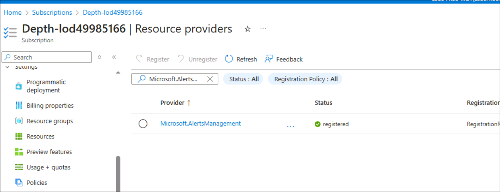
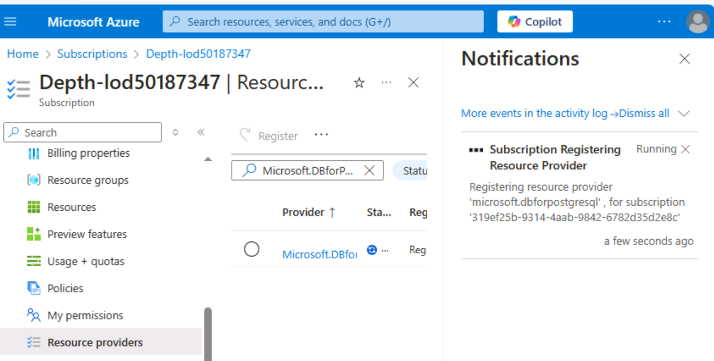
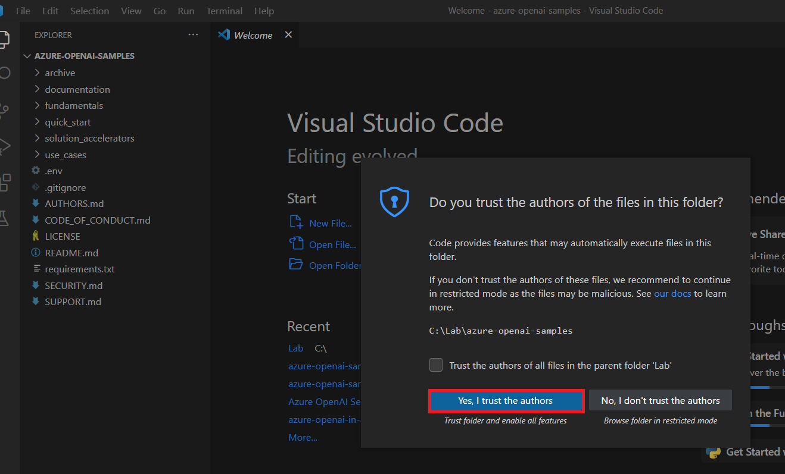
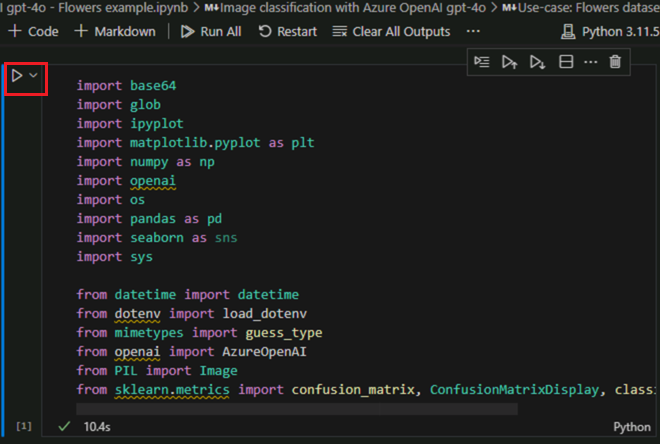

## **Use Case 01- Fashion Trend Analysis with GPT-4 Turbo and Vision on Azure OpenAI**

**Introduction:**

GPT-4 Turbo with Vision on Azure OpenAI service is now in public
preview. GPT-4 Turbo with Vision is a large multimodal model (LMM)
developed by OpenAI that can analyze images and provide textual
responses to questions about them. It incorporates both natural language
processing and visual understanding. With enhanced mode, you can use the
Azure AI Vision features to generate additional insights from the images

**Objective:**

- To deploy Azure OpenAI resources and configure them.

- To deploy specific Azure OpenAI model like GPT-4 Vision.

- Set up your development environment with Python, Jupyter Notebook, and
  required libraries.

- This usecase related to fashion use cases. These might involve image
  analysis, text generation, or other AI tasks.

## Task 0: Understand the VM and the credentials

In this task, we will identify and understand the credentials that we
will be using throughout the lab.

1.  **Instructions** tab hold the lab guide with the instructions to be
    followed throughout the lab.

2.  **Resources** tab has got the credentials that will be needed for
    executing the lab.

    - **URL** – URL to the Azure portal

    - **Subscription** – This is the ID of the subscription assigned to
      you

    - **Username** – The user id with which you need to login to the
      Azure services.

    - **Password** – Password to the Azure login. Let us call this
      Username and password as Azure login credentials. We will use
      these creds wherever we mention Azure login credentials.

    - **Resource Group** – The **Resource group** assigned to you.

    \[!Alert\] **Important:** Make sure you create all your resources under
    this Resource group

    

3.  **Help** tab holds the Support information. The **ID** value here is
    the **Lab instance ID** which will be used during the lab execution.

       

##  Task 1 : Register Service provider

1.  Open a browser go to +++https://portal.azure.com+++ and sign in with
    your cloud slice account below.

    Username: <+++@lab.CloudPortalCredential>(User1).Username+++

    Password: <+++@lab.CloudPortalCredential(User1).Password>+++

    
 
    

2.  Click on **Subscriptions** tile.

     

3.  Click on the subscription name.

     

4.  Expand Settings from the left navigation menu. Click on **Resource
    providers**, enter **+++Microsoft.AlertsManagement+++** and select
    i,t, and then click **Register**.

     

      

5.  Click on **Resource providers**,
    enter **+++Microsoft.DBforPostgreSQL+++** and select i,t, and then
    click **Register**.

      
      
      
      
      
      
      

6.  Repeat the steps \#10 and \#11 to register the following Resource
    providers.

      - **Microsoft.Search**
      
      - **Microsoft.Web**
      
      - **Microsoft.ManagedIdentity**
 

## **Task 1: Create Azure OpenAI resource**

1.  Open your browser, navigate to the address bar, and type or paste
    the following URL: +++https://portal.azure.com/+++, then press the
    **Enter** button.

    

2.  In the **Microsoft Azure** window, use the **User Credentials** to
    login to Azure.

     )

3.  Then, enter the password and click on the **Sign in** button**.**

      

4.  In **Stay signed in?** window, click on the **Yes** button.

      

5.  In Azure portal, click on **portal menu** represented by three
    horizontal bars on the top left corner of page, as shown in the
    below image.

      

6.  Navigate and click on **+ Create a resource**.

      

7.  On **Create a resource** page, in the **Search services and
    marketplace** search bar, type **+++Azure OpenAI+++**, then press the
    **Enter** button.

      

8.  In the **Marketplace** page, navigate to the **Azure OpenAI** tile,
    click on the V chevron button beside **Create**, then navigate and
    click on the **Azure OpenAI** as shown in the below image.

     

9.  In the **Create Azure OpenAI** window, under the **Basics** tab,
    enter the following details and click on the **Next** button.

    a.  **Subscription**: Select the assigned subscription

    b.  **Resource group:** : Select the assigned Resource group

    c.  **Region**: For this lab, you will use a  **gpt-4-vision**
        model. This model is currently only available in [certain
        regions](https://learn.microsoft.com/azure/ai-services/openai/concepts/models#embeddings-models).
        Please select a region from this list, In this lab **Sweden
        Central** is using for this resource.

    d.  **Name**: **+++aoai-gpt4-visionXXXXX+++** (XXXXX can be Lab instant ID)

    e.  **Pricing tier**: Select **Standard S0**

    **Note**: To find your lab instant ID, select 'Help' and copy the
     instant ID.
      

     

      

10. In the **Network** tab, leave all the radio buttons in the default
    state, and click on the **Next** button.

     

11. In the **Tags** tab, leave all the fields in the default state, and
    click on the **Next** button.

      

12. In the **Review + submit** tab, once the Validation is Passed, click
    on the **Create** button.

      

13. Wait for the deployment to complete. The deployment will take around
    2-3 minutes.

14. On **Microsoft.CognitiveServicesOpenAI** window, after the
    deployment is completed, click on **Go to resource** button.

      

15. Click on **Keys and Endpoints** from the left navigation menu and
    then copy the endpoint value in a notepad to **AzureAI ENDPOINT**
    and key to a variable **AzureAIKey**.

      

16. On the **aoai-gpt4-visionXX** window, click on **Overview** in the
    left-sided navigation menu, click on **Go to Azure AI Foundry portal** button as shown in the below
    image to open **Azure AI Foundry Studio** in a new browser.

      

## **Task 2: Deploying an Azure OpenAI model gpt-4-vision**

1.  On the **Azure AI Foundry | Azure Open AI Service** homepage,
    navigate to **Components** section and click on **Deployments**.

2.  In the **Deployments** window, drop down the **+Deploy model** and
    select **Deploy base model.**

      

3.  In the **Select a model** dialog box, navigate and carefully select
    **gpt-4**, then click on **Confirm** button.

      

4.  In the **Deploy model gpt-4** dialog box, under the **Deployment
    name** field, ensure that **gpt-4**, select the Deployment type as
    **Standard** and select Model ersion as Vision- preview. Then click
    on the **Deploy** button.

      
      
      

## Task 3: GPT-4 Turbo with Vision demo

1.  In your Windows search box, type Visual Studio, then click on
    **Visual Studio Code**.

      

2.  In the **Visual Studio Code** editor, click on **File**, then
    navigate and click on **Open Folder**.

       )

3.  Navigate and select **GPT4V-Fashion** folder from **C:\LabFiles**
    and click on the **Select Folder** button.

    

4.  If you see a dialog box - **Do you trust the authors of the files in
    this folder?**, then click on **Yes, I trust the author**.

     

5.  In Visual Studio Code dropdown the **Gpt 4V-FASHION**, click on
    **azure.env** file.

    

6.  Update the parameters ,replace **Azure OpenAI Endpoint, Azure OpenAI
    Key(**The values that you have saved in your notepad in the **Task
    1)** and Save the file.

     

7.  In Visual Studio Code dropdown the **GPT 4V-FASHION** and select
    **GPT-4 with Vision demo with Azure Open AI - Fashion
    usecase.ipynb** notebook.

      

8.  In the main page of Visual Studio Code editor, scroll down to
    **install requirements** heading and run the 1^(st) cell. If
    prompted to select the environment, then select **Python
    Environments** as shown in the image.

     
    
     

9.  If prompted to select the path, then select the **Python version
    3.11.5** path as shown in the image.

      

10.  If you see an windows security alert dialog box - then click on
    **Allow access**.

     
    
     
    
     
    
     

11.  To restart Jupyter kernel, click on **Restart** button.

      

12.  To import the libraries, select **4^(th)** cell. Then, execute the
    cell by clicking on the **start icon**.

      

8.  Select **5^(th)** cell. Then, execute the cell by clicking on the
    **start icon**.

      

9.  To check the OpenAI, system versions, select **6^(th)**,7^(th) ,
    8^(th) and 9^(th) cells. Then, execute the cell by clicking on the
    **start icon**.

     

10. To load the configuration values, select and execute the **10^(th)**
    ,11^(th) and 12^(th) cells by clicking on the **Play** button.

      

11. Define a helper function to create embeddings, select and execute
    the 13^(th) .14^(th) cells by clicking on the **Play** button.

      
     
      

12. To run the example, select and execute the 15^(th) , 16^(th) cells
    by clicking on the **Play** button.

      
     
      

13. To run the example, select and execute the **17^(th) ,18^(th)**
    cells by clicking on the **Play** button.

      
     
      

14. To run the example, select and execute the **19^(th) ,20^(th)**
    cells by clicking on the **Play** button.

     
 
    

15. To run the example, select and execute the **21^(st) ,22^(nd)**
    cells by clicking on the **Play** button.

      
     
      

16. To run the example, select and execute the **23^(st) ,24^(nd)**
    cells by clicking on the **Play** button.

      

      

17. To run the example, select and execute the **25^(th) ,26^(th)**
    cells by clicking on the **Play** button.

      
     
      

18. To run the example, select and execute the **27^(th) ,28^(th)**
    cells by clicking on the **Play** button.

    
 
    

19. To run the example, select and execute the **27^(th) ,28^(th)**
    cells by clicking on the **Play** button.

      
     

20. To generate WebApp, select and execute the **29^(th)** cells by
    clicking on the **Play** button.

      

21. To generate WebApp, select and execute the **30^(th)** cell by
    clicking on the **Play** button.

      

22. After the application has been successfully deployed, you see a URL
    displayed in the terminal. Copy the **URL**

    

23. Open your browser, navigate to the address bar, paste the Publick
    URL link.
    

25. Open your browser, navigate to the address bar, paste the local URL
    link. Select any item

    

25. Click on the **Submit** button.

      

      

## Task 4: Delete the resources

1.  To delete the storage account, navigate to **Azure portal Home**
    page, click on **Resource groups**.

     

2.  Click on the AOAI-RGXXX resource group.

      

3.  In the **Resource group** home page, select the **delete resource
    group**

      

4.  In the **Delete Resources** pane that appears on the right side,
    navigate to **Enter “resource group name” to confirm deletion**
    field, then click on the **Delete** button.

      

5.  On **Delete confirmation** dialog box, click on **Delete** button.

      

6.  Click on the bell icon, you’ll see the notification –**Deleted
    resource group AOAI-RG89.**

    

**Summary**

In this hands-on lab, participants delve into advanced AI capabilities
using Azure OpenAI. Starting with the setup of essential Azure
resources, they deploy AI models like GPT-4-vision. The lab specifically
explores how GPT-4, equipped with vision capabilities, can revolutionize
fashion-related tasks—think image recognition, personalized style
recommendations, and trend analysis.
