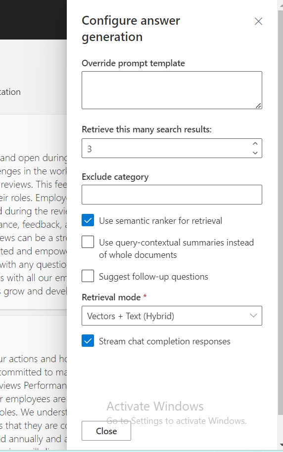
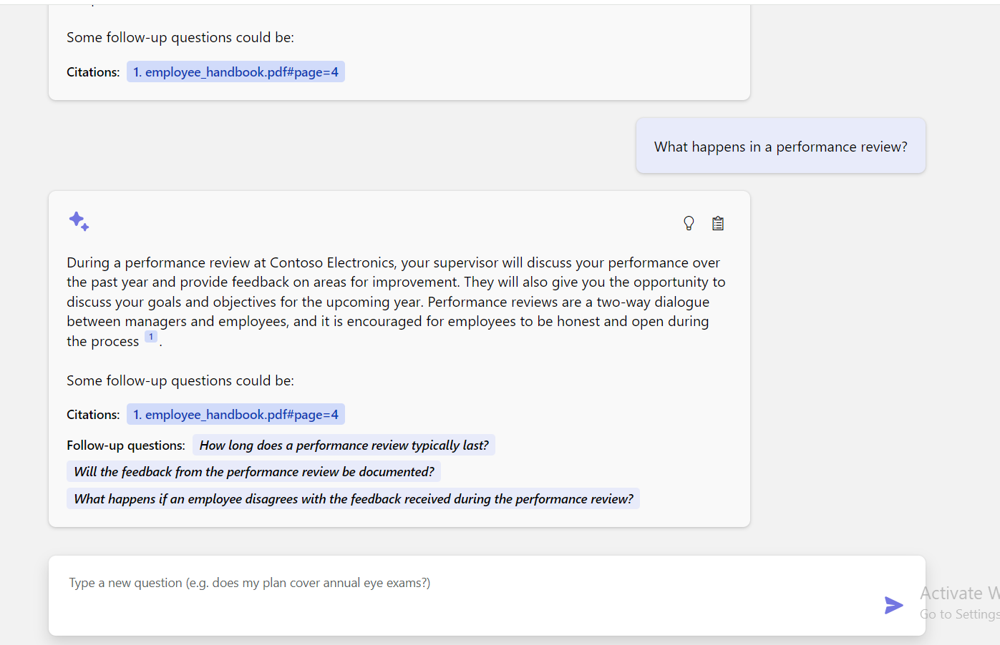

## Use case 03-Developing Intelligent Chat Applications with Azure RAG

**Introduction**

This sample demonstrates a few approaches for creating ChatGPT-like
experiences over your own data using the Retrieval Augmented Generation
pattern. It uses Azure OpenAI Service to access the ChatGPT model
(gpt-35-turbo), and Azure Cognitive Search for data indexing and
retrieval.

The repo includes sample data so it's ready to try end to end. In this
sample application we use a fictitious company called Contoso
Electronics, and the experience allows its employees to ask questions
about the benefits, internal policies, as well as job descriptions and
roles.

This use case you through the process of developing a sophisticated chat
application using the Retrieval Augmented Generation (RAG) pattern on
the Azure platform. By leveraging Azure OpenAI Service and Azure
Cognitive Search, you will create a chat application that can
intelligently answer questions using your own data. This lab uses a
fictitious company, Contoso Electronics, as a case study to demonstrate
how to build a ChatGPT-like experience over enterprise data, covering
aspects such as employee benefits, internal policies, and job roles.

## Task 1: Retrieve resource group name and location

1.  Open your browser, navigate to the address bar, and type or paste
    the following URL: +++https://portal.azure.com/+++, then press the
    **Enter** button.

> 

2.  In the **Microsoft Azure** window, use the **User Credentials** to
    login to Azure.

3.  Then, enter the password and click on the **Sign in** button**.**

> 

4.  In **Stay signed in?** window, click on the **Yes** button.

> 

5.  Type in +++**Resource group+++** in the search bar and select
    **Resource groups**.

> 

6.  Click on your assigned **Resource group**.

7.  In **Resource group** page, copy **resource group name and
    location** and paste them in a notepad, then **Save** the notepad to
    use the information in the upcoming tasks.

## Task 2: Open development environment

1.  Open your browser, navigate to the address bar, type or paste the
    following URL: +++
    https://github.com/technofocus-pte/azuresearchopenaidemo.git+++ opens
    and ask you to open in Visual studio code. Select **Open Visual
    Studio Code.**

> 

2.  Click on **fork** to fork the repo. Give unique name to the repo and
    click on **Create repo** button.

> 
>
> 

3.  Click on **Code -\> Codespaces -\> Codespaces+**

> 

4.  Wait for the Codespaces environment to setup .It takes few minutes
    to setup completely

> 
>
> 

## Task 3: Provision Services and deploy application to Azure

1.  Run the following command on the Terminal. It generates the code to
    copy. Copy the code and press Enter.

+++azd auth login+++

> 
>
> 

2.  Default browser opens to enter the generated code to verify. Enter
    the code and click **Next**.

> 

3.  Sign in with your Azure credentials.

> 
>
> 

4.  To create an environment for Azure resources, run the following
    Azure Developer CLI command.It asks you to enter environment name
    .Enter any name of your choice and press enter (eg
    :+++ragopenaiXXXX+++)

**Note:** When creating an environment, ensure that the name consists of
lowercase letters.

   +++azd env new+++

5.  Run below command to provision the services to Azure, build your
    container.

+++azd env set AZURE_RESOURCE_GROUP {Name of existing resource group}+++

> 

6.  Run below command to provision the services region to Azure, build
    your container

+++azd env set AZURE_LOCATION {Location of existing resource group}+++

> 

7.  Run azd up - This will provision Azure resources and deploy this
    sample to those resources, including building the search index based
    on the files found in the ./data folder.

   +++azd up++
>
> 

8.  Wait until app is deployed. It may take **35-40** minutes for the
    deployment to complete.

> 

9.  Select below values.

- **Select an Azure Subscription to use** : select your subscription

- **documentIntelligenceResourceGroupLocation**: East US

> 
>
> 

10. When prompted, **enter a value for the ‘openAiResourceGroupLocation’
    infrastructure parameter** select **France Central .**

> 

> 

11. After the application has been successfully deployed, you see a URL
    displayed in the terminal. Copy the **URL**

12. Click on the **Open**

13. Open your browser, navigate to the address bar, paste the link. Now,
    resource group will open in a new browser

## Task 4: Verify deployed resources in the Azure portal

1.  Select **Resource groups**

> 

2.  Click on your assigned **Resource group**.

3.  Make sure the below resource got deployed successfully

- Azure App Service

- Azure Application Insights

- Container App

- Container registry

- Azure OpenAI

- Azure Document Intelligence

- Azure Search Service

- Azure Storage Account

- Azure Speech Service

4.  On the resource group and click on **AI Search service.**

> 

5.  Make sure Indexes should be deployed successfully

> 

6.  Go back to resorcegroup and click on **Storage account.**

> 

7.  From the left navigation menu, click on **Containers** , Make sure
    data should be deployed successfully

> 

## Task 6: Use chat app to get answers from PDF files

1.  Wait for the web application deployment to complete.

> 

2.  In the **GPT+Eneterprise data |Sample** web app page, enter the
    following text and click on the **Submit icon** as shown in the
    below image.

> **What happens in a performence review?**

3.  From the answer, select a **citation**.

4.  In the right-pane, use the tabs to understand how the answer was
    generated.

  |  |   |
  |----|----|
  |Tab	|Description|
  |Thought process|	This is a script of the interactions in chat. You can view the system prompt (content) and your user question (content).|
  |Supporting content|	This includes the information to answer your question and the source material. The number of source material citations is noted in the Developer settings. The default value is 3.|
  |Citation	|This displays the original page that contains the citation.|

5.  Select the selected tab again to close the pane.

6.  The intelligence of the chat is determined by the OpenAI model and
    the settings that are used to interact with the model.

7.  Select the **Developer settings**.

|    |   |
|------|-----|
|Setting	|Description|
|Override prompt template|	This is the prompt that is used to generate the answer.|
|Retrieve this many search results	|This is the number of search results that are used to generate the answer. You can see these sources returned in the Thought process and Supporting content tabs of the citation.|
|Exclude category	|This is the category of documents that are excluded from the search results.|
|Use semantic ranker for retrieval|	This is a feature of Azure AI Search that uses machine learning to improve the relevance of search results.|
|Use query-contextual summaries instead of whole documents|	When both Use semantic ranker and Use query-contextual summaries are checked, the LLM uses captions extracted from key passages, instead of all the passages, in the highest ranked documents.|
|Suggest follow-up questions|	Have the chat app suggest follow-up questions based on the answer.|
|Retrieval mode	|Vectors + Text means that the search results are based on the text of the documents and the embeddings of the documents. Vectors means that the search results are based on the embeddings of the documents. Text means that the search results are based on the text of the documents.|
|Stream chat completion responses|	Stream response instead of waiting until the complete answer is available for a respon|

8.  Check the **Suggest follow-up questions** checkbox and ask the same
    question again.

9.  Enter the following text and click on the **Submit icon** as shown
    in the below image.

> What happens in a performance review?

10. The chat returned suggested follow-up questions such as the
    following

11. In the **Settings** tab, deselect **Use semantic ranker for
    retrieval**.

12. Enter the following text and click on the **Submit icon** as shown
    in the below image.

> What happens in a performance review?

## Task 7: Delete the Resources

1.  To delete Resource group , type **Resource groups** in the Azure
    portal search bar, navigate and click on **Resource groups** under
    **Services**.

> 

2.  Click on the sample web app resource group.

> 

3.  In the resource group home page , select **all resources** .

4.  Select Delete

**Summary**

In this lab, you’ve learned how to set up and deploy an intelligent chat
application using Azure's suite of tools and services. Starting with the
installation of essential tools like Azure CLI and Node.js, you’ve
configured your development environment using Dev Containers in Visual
Studio Code. You've deployed a chat application that utilizes Azure
OpenAI and Azure Cognitive Search to answer questions from PDF files.
Finally, you’ve deleted the deployed resources to effectively manage
resources. This hands-on experience has equipped you with the skills to
develop and manage intelligent chat applications using the Retrieval
Augmented Generation pattern on Azure.

