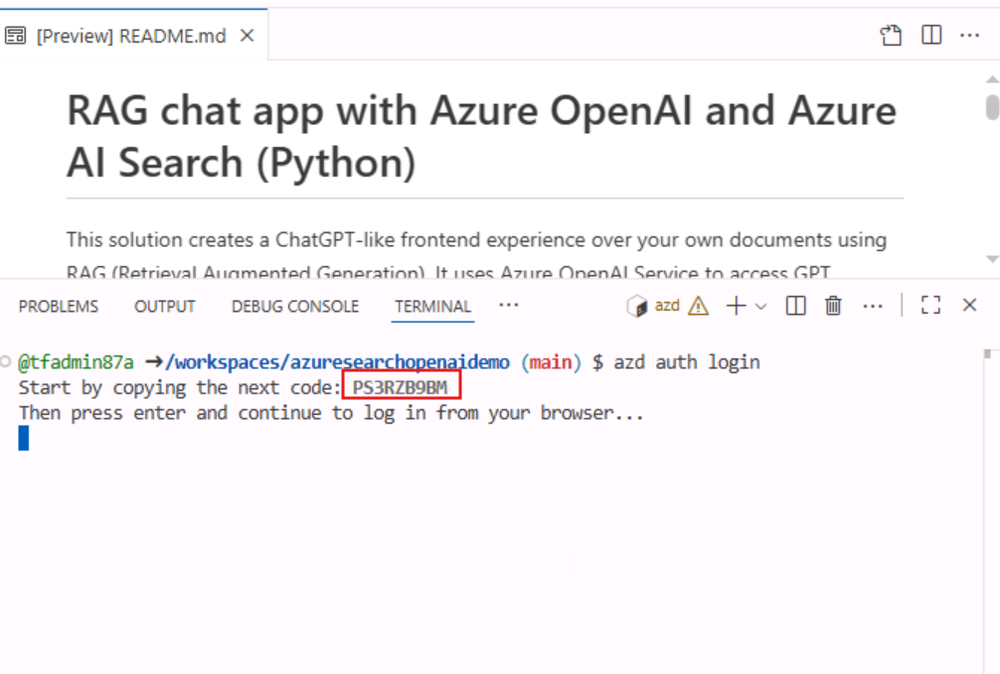
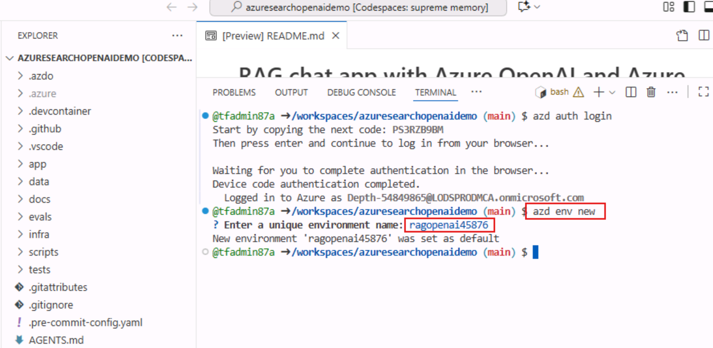
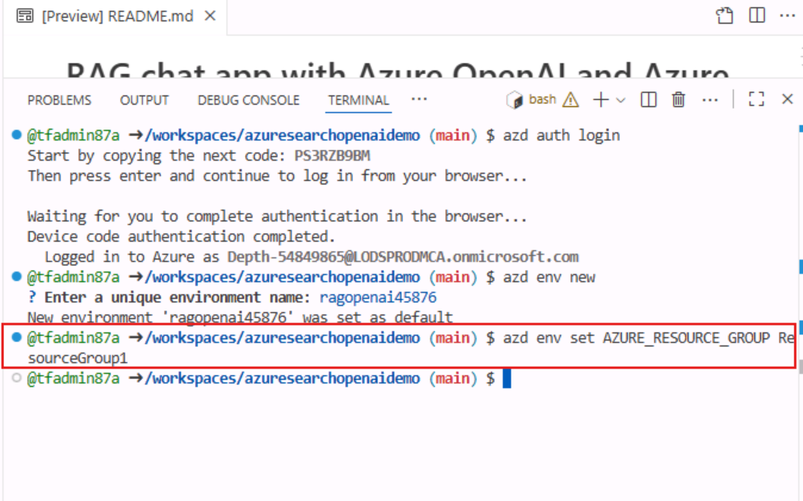
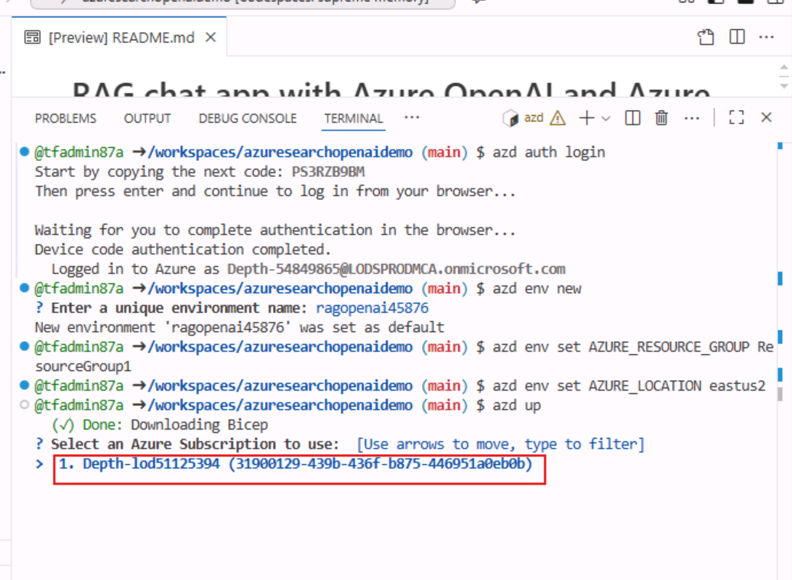
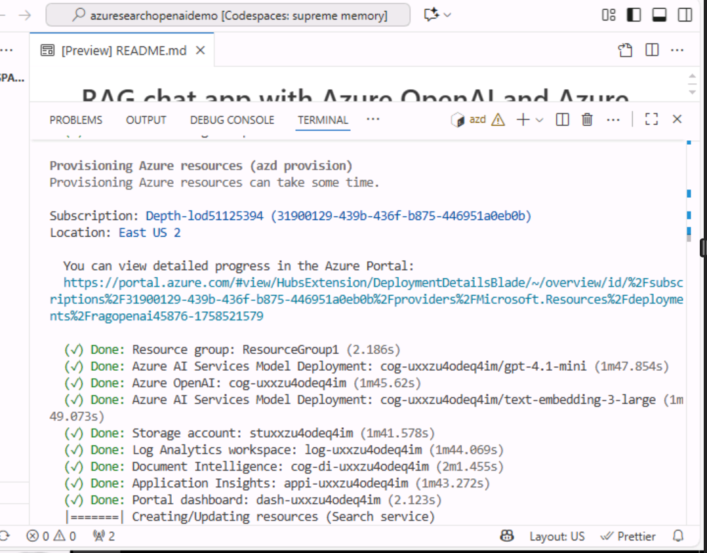

## Use case 03-Developing Intelligent Chat Applications with Azure RAG

**Introduction**

This sample demonstrates a few approaches for creating ChatGPT-like
experiences over your own data using the Retrieval Augmented Generation
pattern. It uses Azure OpenAI Service to access the ChatGPT model
(gpt-35-turbo), and Azure Cognitive Search for data indexing and
retrieval.

The repo includes sample data so it's ready to try end to end. In this
sample application we use a fictitious company called Contoso
Electronics, and the experience allows its employees to ask questions
about the benefits, internal policies, as well as job descriptions and
roles.

This use case you through the process of developing a sophisticated chat
application using the Retrieval Augmented Generation (RAG) pattern on
the Azure platform. By leveraging Azure OpenAI Service and Azure
Cognitive Search, you will create a chat application that can
intelligently answer questions using your own data. This lab uses a
fictitious company, Contoso Electronics, as a case study to demonstrate
how to build a ChatGPT-like experience over enterprise data, covering
aspects such as employee benefits, internal policies, and job roles.

**Objective**

- To install Azure CLI and Node.js on your local machine.

- To assign an owner role to the user.

- To install the Dev Containers extension and set up the development
  environment.

- To deploy a chat application to Azure and use it to get answers from
  PDF files.

- To delete the deployed resources and models.

## Task 1: Install Azure Cli and set the policy scope to Local machine

1.  In your windows search bar, type **PowerShell**. In the
    **PowerShell** dialog box, navigate and click on **Run as
    administrator**. If you see the dialog box - **Do you want to allow
    this app to make changes to your device?** then click on the **Yes**
    button.

     

2.  Run the following command to install Azure Cli on the PowerShell

    PowerShell copy

    +++winget install microsoft.azd+++

     

3.  Run the below command to set the policy to **Unrestricted** and
    enter **A** when asked to change the execution policy.

   +++Set-ExecutionPolicy Unrestricted+++
    

## Task 2: Install Node.js

1.  Open your browser, navigate to the address bar, type or paste the
    following URL: +++https://nodejs.org/en/download/+++ then press the
    **Enter** button.

    

2.  Select and click on **Windows Installer**.

    

3.  **Node-V** file will be downloaded. Click on the downloaded file to
    set up **Node.js**

      

4.  In the **Welcome to the Node.js Setup Wizard** window, click on the
    **Next button**.

    

5.  In the **End-User License Agreement** window, select **I accept the
    terms in the License agreement** radio button and click on the
    **Next** button.

    

6.  In the **Destination Folder** window, click on the **Next** button.

    

7.  In the **Custom Setup** window, click on the **Next** button.

      
      
      

8.  In Ready to install Node.js window, click on **Install.**

      

9.  In **Completing the Node.js Setup Wizard window**, click on the
    **Finish** button to complete the installation process.

      

## Task 3: Retrieve resource group name and location

1.  Open your browser, navigate to the address bar, and type or paste
    the following URL: +++https://portal.azure.com/+++, then press the
    **Enter** button.

    

2.  In the **Microsoft Azure** window, use the **User Credentials** to
    login to Azure.

      

3.  Then, enter the password and click on the **Sign in** button**.**

      

4.  In **Stay signed in?** window, click on the **Yes** button.

     

5.  Type in +++Resource group+++ in the search bar and select
    **Resource groups**.

     

6.  Click on your assigned **Resource group**.

     

7.  In **Resource group** page, copy **resource group name and
    location** and paste them in a notepad, then **Save** the notepad to
    use the information in the upcoming tasks.

     

## Task 4: Create AI Search Service

1.  In Azure portal, type in +++AI search+++ in the search bar and
    select **AI Search**

     

2.  Click on +**Create**.

    

3.  Select below values and then click on **Review + Create**.

 

      a)  Subscription: **Your Azure subscription**.
      
      b)  Resource group - **Select your existing resource group**
      
      c)  Service name - **+++aisearchXXXX+++(XXXXX can be Lab instant ID)**
      
      d)  Location : **Central US** 
      
      e)  Pricing tier: Standard

      

4.  Click on **Create** now.

    

5.  Wait for the deployment and then click on **Go to resource**.

      
 
      

6.  In the **AI Search** Overview page. In the left-side navigation
    pane, under **Settings** section, select **Semantic ranker**

      

7.  On the **Semantic ranker** tab, select **Standard** tile and
    click on the **Select plan.**

      

8.  Select **Yes**

      

9.  You will see a notification -**Successfully updated semantic ranker
    to standard plan**

      

10. Open a Notepad and make a note of AI Search name, resource group
    name and location . We will use it later to communicate to the
    service

     

## Task 5: Run the Docker

1.  In your Windows search box, type Docker , then click on **Docker
    Desktop**.

     

2.  Run the Docker Desktop.

    

## **Task 6:** **Install Dev Containers extension**

1.  In your Windows search box, type Visual Studio, then click on
    **Visual Studio Code**.

      

2.  Open your browser, navigate to the address bar, type or paste the
    following URL:
    +++https://marketplace.visualstudio.com/items?itemName=ms-vscode-remote.remote-containers+++
    then press the **Enter** button.

      

3.  On Dev Containers page, select on Install button.

      

4.  Visual Studio Code is required to install this extension dialog box
    appears, then click on the **Continue** button.

      

5.  This site is trying to open Visual Studio Code dialog box appears,
    then click on the **Open** button.

    

6.  In Visual Studio, click the Install button under the Dev container.

     

     

## Task 7: Open development environment

1.  Open your browser, navigate to the address bar, type or paste the
    following URL:
  +++https://vscode.dev/redirect?url=vscode://ms-vscode-remote.remote-containers/cloneInVolume?url=https://github.com/azure-samples/azure-search-openai-demo+++
  then press the **Enter** button.

     

2.  This site is trying to open Visual Studio Code dialog box appears,
    then click on the **Open** button.

    

3.  Allow ‘Dev Containers’ extension to open this URI? dialog box
    appears, then click on the **Open** button.

     

4.  Cloning a repository in a Dev Container may execute arbitrary code
    dialog box appears, then click on **Got It** button

     

5.  Starting the Dev container will take 13-15 minutes. After
    deployment, press Enter.

     

6.  Press any key to close the terminal

       

## Task 8: Deploy chat app to Azure

1.  Sign in to Azure with the Azure Developer CLI. Run the following
    command on the Terminal

      BashCopy
     
      +++azd auth login+++
 
     

2.  Default browser opens to sign in .Sign in with your Azure
    subscription account.

      
    
      

3.  Close the browser

      

4.  Once logged in, the details of the Azure login are populated in the
    terminal.

      

5.  Create a new azd environment. Run the following command on the
    Terminal

     Copy
    
     +++azd env new+++

6.  Enter the new environment name as +++chatapprag+++

    

    

7.  Assign the existing Azure resourcegroup. Run the following command
    in the Terminal

      +++azd env set AZURE_RESOURCE_GROUP {Name of existing resource group}+++
     
      +++azd env set AZURE_LOCATION {Location of existing resource group}+++
     
     
    
    [Alret] **Note**: Region should be in small letters and have no spaces.

9.  Assign the existing Azure AI Search service. Run the following
    command in the Terminal

      +++azd env set AZURE_SEARCH_SERVICE {Name of existing Azure AI Search service}+++
     
      +++azd env set AZURE_SEARCH_SERVICE_RESOURCE_GROUP {Name of existing resource group with ACS service}+++
     
      +++azd env set AZURE_SEARCH_SERVICE_LOCATION {Location of existing service}+++
     
      +++azd env set AZURE_SEARCH_SERVICE_SKU {Name of SKU}+++
     
      

10.  Check the assigned existing resources, select Azure, and choose the
    **.env** file.

     

11. Create a new azd environment:

      shellCopy
     
      **+++azd up+++**
 
    

12. Select your azure subscription

      

13. When prompted, **Enter a value for the
    ‘documentIntelligenceResourceGroupLocation’ infrastructure
    parameter** select **West US2.**

     

14. When prompted, **enter a value for the ‘openAiResourceGroupLocation’
    infrastructure parameter** select **France Central .**

     

15. Wait until app is deployed. It may take **35-40** minutes for the
    deployment to complete.

       
       
     
       
      
       
       
       
       

16. After the application has been successfully deployed you will see a
    URL printed to the console. Click that URL to interact with the
    application in your browser. It will look like the following:

      

17. Open your browser, navigate to the address bar, paste the link. Now,
    resource group will open in a new browser

      
      

## Task 9: Verify deployed resources in the Azure portal

1.  Select **Resource groups**

      

2.  Click on your assigned **Resource group**.

      

3.  Make sure the below resource got deployed successfully

    - Azure App Service
    
    - Azure Application Insights
    
    - Container App
    
    - Container registry
    
    - Azure OpenAI
    
    - Azure Document Intelligence
    
    - Azure Search Service
    
    - Azure Storage Account
    
    - Azure Speech Service

    
    
    

4.  On the resource group and click on **AI Search service.**

      

5.  Make sure Indexes should be deployed successfully

      

6.  Go back to resorcegroup and click on **Storage account.**

      

7.  From the left navigation menu, click on **Containers** , Make sure
    data should be deployed successfully

      

## Task 10: Use chat app to get answers from PDF files

1.  Wait for the web application deployment to complete.

      

2.  In the **GPT+Eneterprise data |Sample** web app page, enter the
    following text and click on the **Submit icon** as shown in the
    below image.

    +++What happens in a performance review?+++

    

    

3.  From the answer, select a **citation**.

    

4.  In the right-pane, use the tabs to understand how the answer was
    generated.

    |  |  |
    |---|---|
    |Tab|	Description|
    |Thought process|	This is a script of the interactions in chat. You can view the system prompt (content) and your user question (content).|
    |Supporting content|	This includes the information to answer your question and the source material. The number of source material citations is noted in the Developer settings. The default value is 3.|
    |Citation	|This displays the original page that contains the citation.|

    
    
    
    
    

5.  Select the selected tab again to close the pane.

6.  The intelligence of the chat is determined by the OpenAI model and
    the settings that are used to interact with the model.

7.  Select the **Developer settings**.

    
    
    

    |     |     |
    |---|----|
    |Setting|	Description|
    |Override prompt template|	This is the prompt that is used to generate the answer.|
    |Retrieve this many search results|	This is the number of search results that are used to generate the answer. You can see these sources returned in the Thought process and Supporting content tabs of the citation.|
    |Exclude category  |	This is the category of documents that are excluded from the search results.|
    |Use semantic ranker for retrieval	|This is a feature of Azure AI Search that uses machine learning to improve the relevance of search results.
    Use query-contextual summaries instead of whole documents|	When both Use semantic ranker and Use query-contextual summaries are checked, the LLM uses captions extracted from key passages, instead of all the passages, in the highest ranked documents.|
    |Suggest follow-up questions	|Have the chat app suggest follow-up questions based on the answer.|
    |Retrieval mode|	Vectors + Text means that the search results are based on the text of the documents and the embeddings of the documents. Vectors means that the search results are based on the embeddings of the documents. Text means that the search results are based on the text of the documents.|
    |Stream chat completion responses|	Stream response instead of waiting until the complete answer is available for a respon|

8.  Check the **Suggest follow-up questions** checkbox and ask the same
    question again.

     

9.  Enter the following text and click on the **Submit icon** as shown
    in the below image.

     +++What happens in a performance review?+++

    

10. The chat returned suggested follow-up questions such as the
    following

     

11. In the **Settings** tab, deselect **Use semantic ranker for
    retrieval**.

      
      
      

12. Enter the following text and click on the **Submit icon** as shown
    in the below image.

    +++What happens in a performance review?+++

    
    
    

## Task 11: Delete the Resources

1.  To delete Resource group , type **Resource groups** in the Azure
    portal search bar, navigate and click on **Resource groups** under
    **Services**.

     

2.  Click on the sample web app resource group.

      

3.  In the resource group home page , select **all resources** .

      

4.  Select Delete

    
    
    

**Summary**

In this lab, you’ve learned how to set up and deploy an intelligent chat
application using Azure's suite of tools and services. Starting with the
installation of essential tools like Azure CLI and Node.js, you’ve
configured your development environment using Dev Containers in Visual
Studio Code. You've deployed a chat application that utilizes Azure
OpenAI and Azure Cognitive Search to answer questions from PDF files.
Finally, you’ve deleted the deployed resources to effectively manage
resources. This hands-on experience has equipped you with the skills to
develop and manage intelligent chat applications using the Retrieval
Augmented Generation pattern on Azure.
