# Use case 11 - Build and deploy a question and answer copilot with prompt flow in Azure AI Studio

**Estimated time: 45 min**

## Objective

The objective of this lab is to guide participants in building an
AI-powered agent using Azure AI services and Search integration.
Retrieval Augmented Generation (RAG) is a technique used to build
applications that integrate data from custom data sources into a prompt
for a generative AI model. RAG is a commonly used pattern for developing
generative AI apps - chat-based applications that use a language model
to interpret inputs and generate appropriate responses. Participants
will learn to use Azure AI Foundry portal to integrate custom data into
a generative AI prompt flow.

Solution

This lab focuses on integrating Azure AI services with advanced search
capabilities to create a robust, intelligent solution. It emphasizes
configuring an AI-powered agent, enabling seamless data retrieval, and
providing contextual responses. By leveraging AI and search integration,
the solution aims to streamline workflows, improve decision-making, and
enhance user engagement through intuitive and efficient interactions.

## Task 1: Create an Azure AI Search resource

1.  In a web browser, open the Azure
    portal at +++https://portal.azure.com+++ and **Sign in** using

  - Username - +++@lab.CloudPortalCredential(User1).Username+++
  
  - Password - +++@lab.CloudPortalCredential(User1).Password+++

  

2.  On the home page, select **+ Create a resource.**

  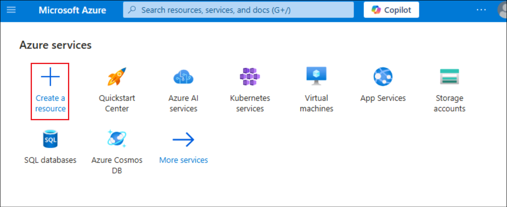

3.   From the search bar, search for and select +++**Azure AI Search**+++.

  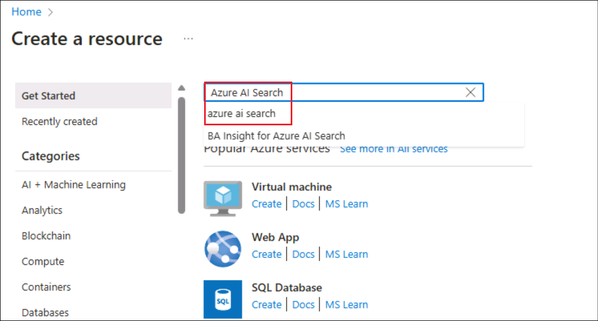

4.  Select the drop down next to **Create** and select **Azure AI
    Search**.

  

5.  In the Create a search service page, enter the below details and
    click on **Review + create**.

    - **Subscription**: Select your Azure subscription from the drop
      down.

    - **Resource group**: Select the Resource group assigned to your
      subscription (ResourceGroup1)

    - **Service name**: +++aisearch@lab.LabInstance.Id+++

    - **Location**: Select @lab.CloudResourceGroup(ResourceGroup1).Location

    - **Pricing tier**: Standard

  

6.  Review the settings and click on **Create**.

  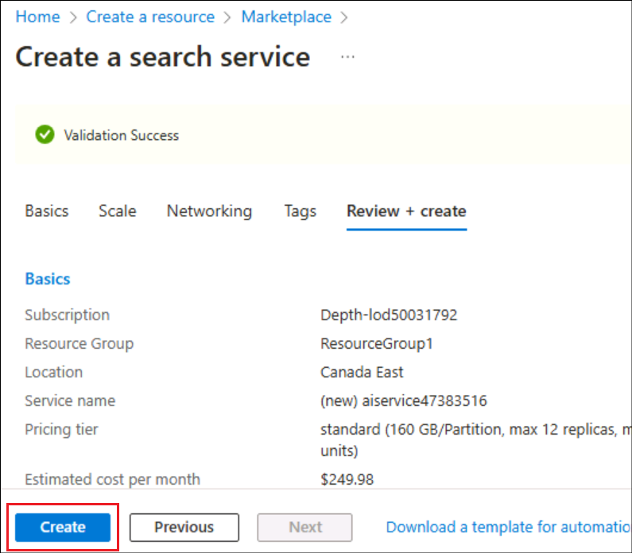

7.  Wait for your Azure AI Search resource deployment to be completed.

   

   >[!Note] **Note:** Later, you’re going to create an Azure AI Hub (which includes an Azure OpenAI service) in the same region as your Azure AI Search resource. Azure OpenAI resources are constrained at the tenant level by regional quotas. In the event of a quota limit being reached later in the exercise, there’s a possibility you may need to create another Azure AI hub in a different region.

### Task 2: Create an Azure Storage Account by using the portal

1.  Click on the **Portal Menu**, then select **+ Create a resource**

     

2.  In the **Create a resource** window search box, type **Storage
    account** and then click on the **storage account**.

      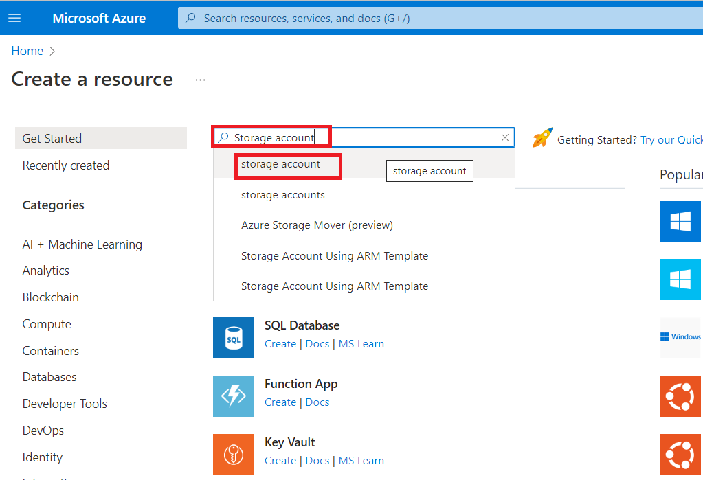

3.  In the **Marketplace** page, click on the **Storage
    account** section.

     

4.  In the **Storage account** window, click on the **Create** button.

      

5.  On **Create a storage account** window, under the **Basics** tab,
    enter the below details to create a storage account and then click
    on **Review**

        |   |  |
        |-----|----|
        |Subscription  | Select your Azure OpenAI subscription   |
        | Resource group     |  Select your Resource group   |
        | Region    |  Select the appropriate region for your storage account . In this lab East US is taken  |
        | Performance |  Standard: Recommended for most scenarios (general-purpose v2 account) |
        | Redundancy |Locally-redundant storage (LRS)  |

     

6.  On the **Review** tab, click on the **Create** button.

       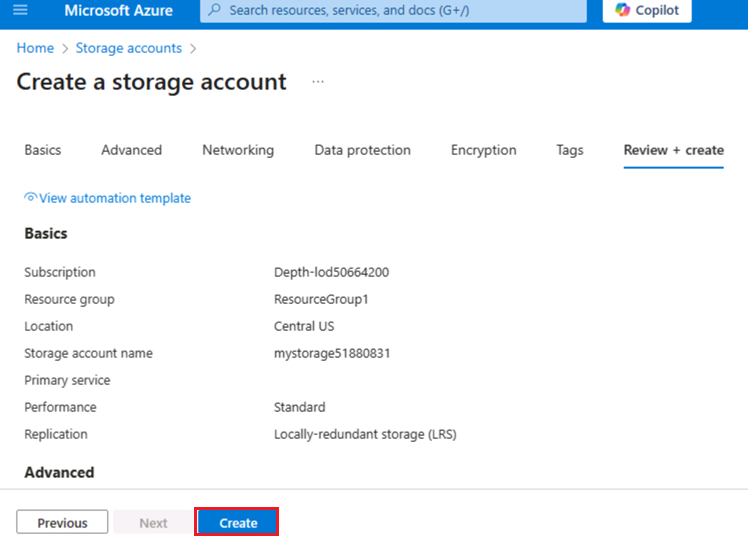
        
       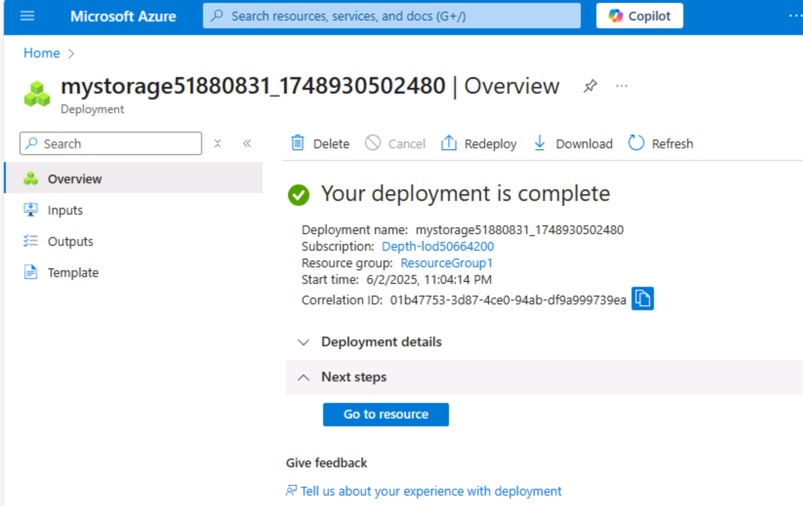

### Task 3: Create an Azure AI project

1.  In a web browser, open **Azure AI Foundry
    portal** at +++[https://ai.azure.com+++](https://ai.azure.com+++/) and **sign
    in** using

    - Username - <+++@lab.CloudPortalCredential>(User1).Username+++

    - Password - <+++@lab.CloudPortalCredential>(User1).Password+++

      

2.  **Close** the **Help** tab and select **Got it** in
    the **Streamlined from the start** pop up.

3.  In the home page, select **+ Create project**.

      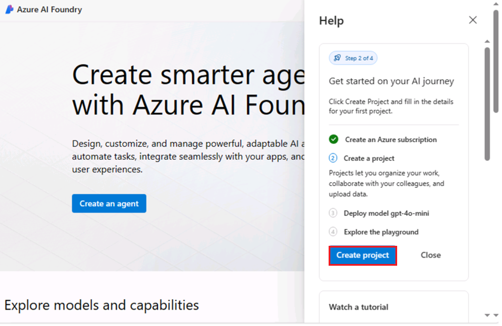

2.  In the **Create a project** wizard enter project name as
    +++[**ragpfproject@lab.LabInstance.Id**](mailto:ragpfproject@lab.LabInstance.Id)+++

3.  Connect to your Azure AI Search resource, enter the following
    details, select **Create** 

    - **Azure Subscription**: Select the assigned Azure subscription

    - **Resource group**: Select the assigned Resource Group

    - **Location**: Select
      @lab.CloudResourceGroup(ResourceGroup1).Location

      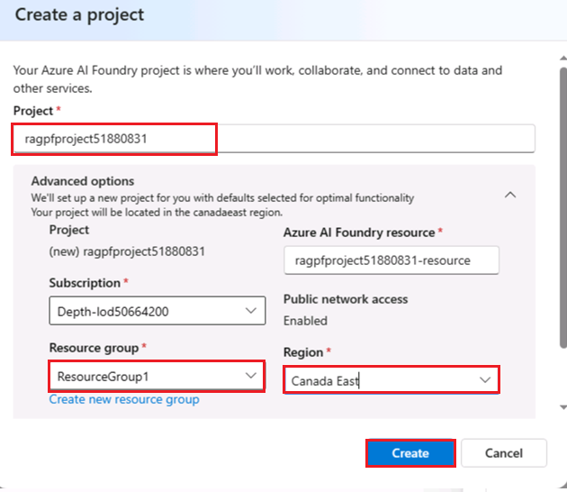

4.  You will land in the created project page.

      

5.  At the bottom of the left pane, select **Management center**.

      

6.  At the top of the page, select **All resources**. Select **Create
    new**.

     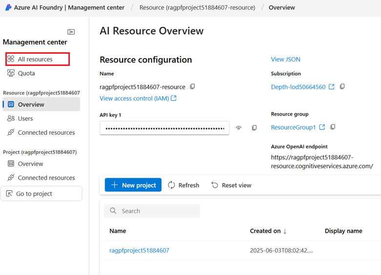
 
    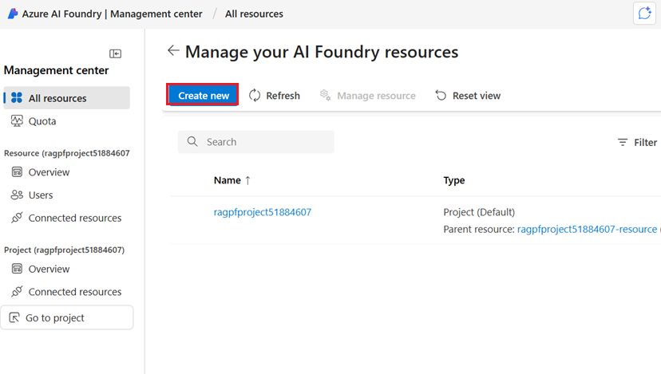

7.  Select **AI hub resource**.

  
 
  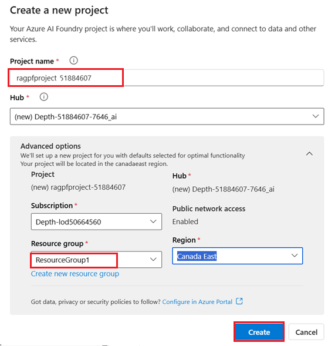
 
  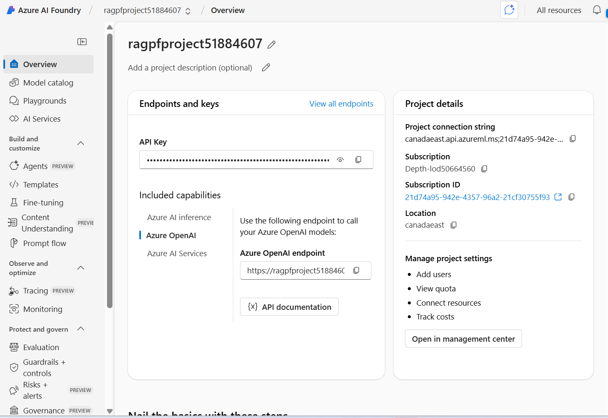

7.  At the bottom of the left pane, select **Management center**.

     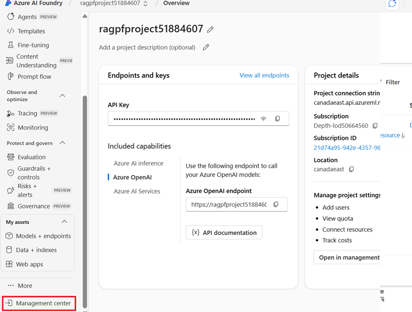

8.  In the **Connected resources** section, select **New
    connection** and then select **Azure AI Search**.

       
       

9.  Select **API key** under **Authentication** and select **Add
    connection**.

    
    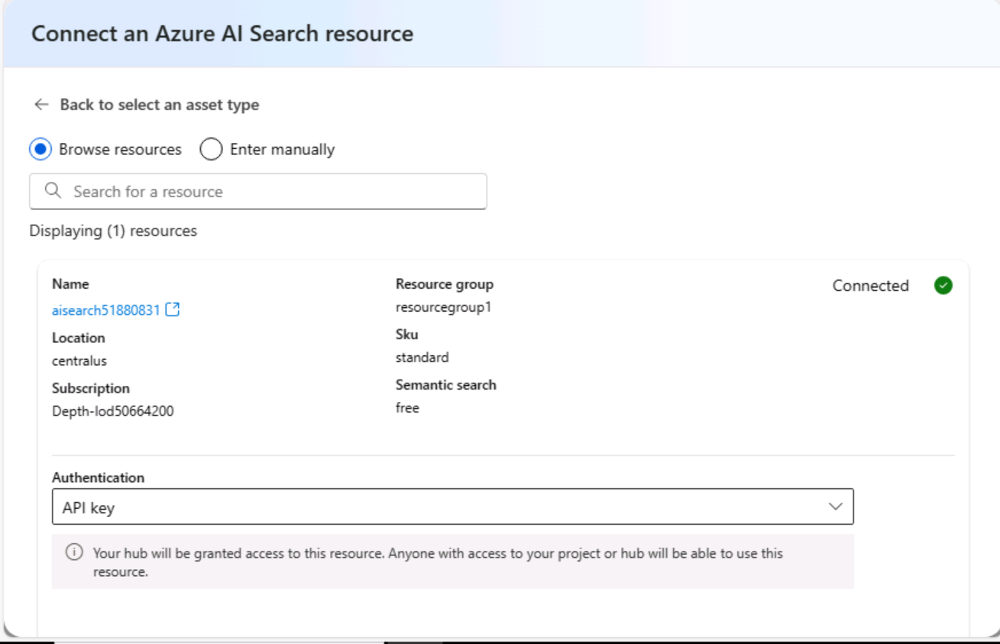

10. Repeat the previous steps to connect Azure storage account

    
    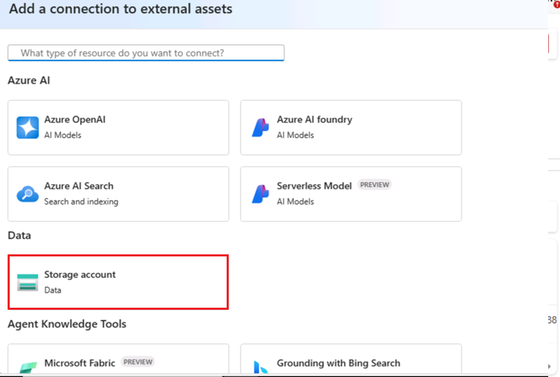
    
    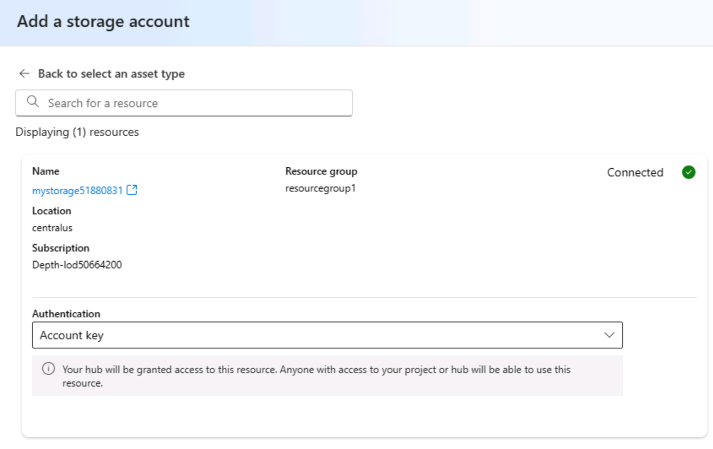

## Task 4: Deploy models

You need two models to implement your solution:

- An embedding model to vectorize text data for efficient indexing and
  processing.

- A model that can generate natural language responses to questions
  based on your data.

1.  Select **Models + endpoints** under **My assets** from the left
    pane.

    

2.  On the **Manage deployments of your models and services page,**
    click on **+Deploy model** and select **Deploy base model.**

    

3.  On the **Select a model** page, search and
    select +++**text-embedding-ada-002**+++ model and click on
    **Confirm.**

    

4.  On the **Deploy model text-embedding-ada-002** pane, accept the pre-
    populated value for the **Deployment name** Select **Deployment
    type** as **standard**. Click on **Customize** and enter the following details in
    the Deploy model wizard.

    

  - **Model version**: Select the default version
  
  - **AI resource**: Select the resource created previously (That is the resource that gets listed in the drop down)
  
  - **Tokens per Minute Rate Limit (thousands)**: 5K
  
  - **Content filter**: DefaultV2
  
  - **Enable dynamic quota**: Disabled

  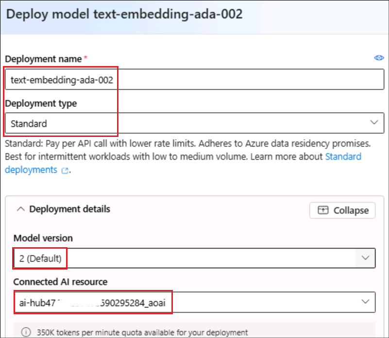

  

  

5.  Repeat the previous steps to deploy a +++**gpt-4o**+++ model
    with the deployment name gpt-4o.

  

6.  We now have the two deployments ready.

  

  >[!Note] **Note:** Reducing the Tokens Per Minute (TPM) helps avoid over-using the quota available in the subscription you are using. 5,000 TPM is sufficient for the data used in this exercise.

## Task 5: Add data to your project

The data for your copilot consists of a set of travel brochures in PDF
format from the fictitious travel agency *Margie’s Travel*. Let’s add
them to the project.

1.  Select **Data + indexes** under **My assets** from the left pane.
    Select **+ New data**.

  

2.  In the **Add your data** wizard, select **Upload files/folders**
    from the drop down.

  

3.  Select **Upload folder** and select the **brochures** folder from
    **C:\LabFiles** and click **Upload**.

  

  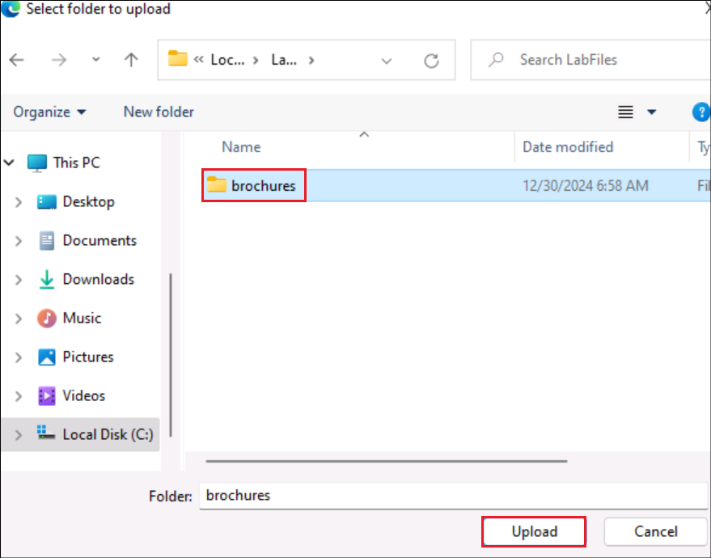

4.  Wait for the folder to be uploaded and note that it contains several
    .pdf files. Select **Next** once the files are all uploaded.

    

5.  On the next page of name and finish, enter the data name as
    +++**data@lab.LabInstance.Id**+++ and click on **Create.**

    

    

## Task 6: Create an index for your data

Now that you’ve added a data source to your project, you can use it to
create an index in your Azure AI Search resource.

1.  From the **Data + indexes** page, select the **Indexes** tab.

    

2.  In the **Indexes** tab, select **+ New index** to add a new index.

    

3.  Enter the below details and click on **Next**.

    - **Data source** - Select **Data in Azure AI Foundry**

    Select the listed **data source** and then click on **Next**.

    

4.  Enter the below details in the Create a vector index – Index
    configuration page and click on **Next.**

    - **Select Azure AI Search service**: Select **AzureAISearch**
    
    - Vector index - +++**brochures-index**+++
    
    - **Virtual machine**: Select **Auto select**

    

5.  In the Create a vector index – Search settings page,

    **Vector settings** - Select **Add vector search to this search
resource**

    Accept the other defaults and select **Next.**

    

6.  In the **Review and finish** page, review the details and select
    **Create vector index**.
 
     

7.  Wait for the indexing process to be completed, which can take
    several minutes. The index creation operation consists of the
    following jobs:

    - Crack, chunk, and embed the text tokens in your brochures data.

    - Create the Azure AI Search index.

    - Register the index asset.

    

    

## Task 7: Test the index

Before using your index in a RAG-based prompt flow, let’s verify that it
can be used to affect generative AI responses.

1.  Select the **Playgrounds** from the left pane and select **Chat
    Playground.**

    

2.  Click on **Show setup** if it is not visible by default.

    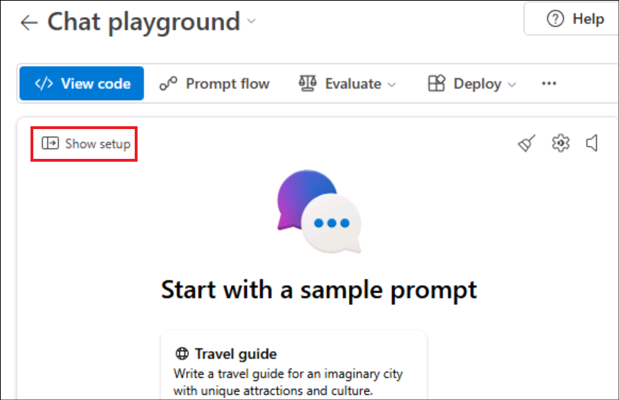

3.  Ensure that your **gpt-4o** model deployment is selected.
    Then, in the main chat session panel, submit the prompt +++**Where can I stay in New York?**+++

    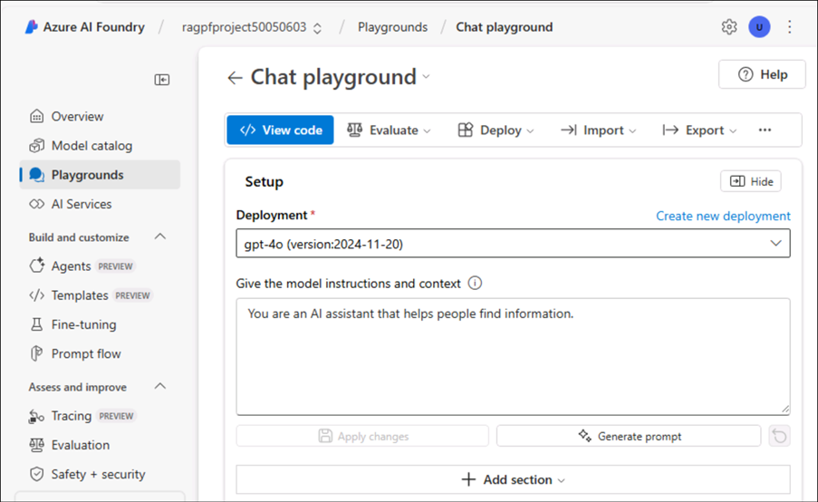

    

4.  Review the response, which should be a generic answer from the model
    without any data from the index.

5.  In the Setup pane, expand the **Add your data** field,
    select **brochures-index** project index and select the **hybrid
    (vector + keyword)** search type.

    

    >[!Note] **Note:** Some users are finding newly created indexes unavailable right away. Refreshing the browser usually helps, but if you’re still experiencing the issue where it can’t find the index you may need to wait until the index is recognized.

6.  This addition of the data source starts a new session. Once that is
    done, resubmit the prompt +++**Where can I stay in New York?**+++

    

7.  Review the response and note that now the response is based on data
    in the index.

    

## Task 8: Use the index in a prompt flow

Your vector index has been saved in your Azure AI Foundry project,
enabling you to use it easily in a prompt flow.

1.  Select the **Prompt flow** under **Build and customize** from the
    left navigation pane and then click on **Create**.

    

2.  Select **Clone** under **Multi-Round Q&A on Your Data**.

    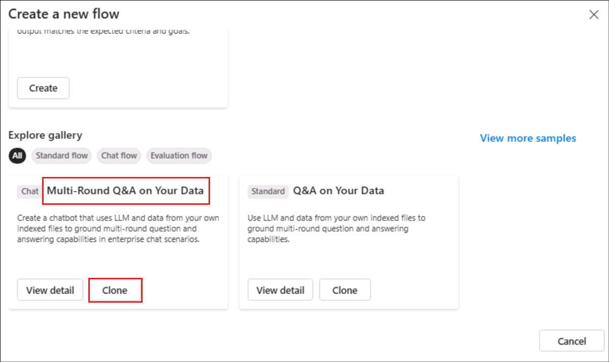

3.  Give the folder name as +++**brochure-flow**+++ and click on
    **Clone**.

    

    > [!Note] **Note:** If you face permissions error, retry with a new name after 2 minutes and the flow will get cloned.

    

4.  When the prompt flow designer page opens, review **brochure-flow**.
    Its graph should resemble the following image:

    

    

    The sample prompt flow you are using implements the prompt logic for a
chat application in which the user can iteratively submit text input
to chat interface. The conversational history is retained and included
in the context for each iteration. The prompt flow orchestrates a
sequence of *tools* to:

    - Append the history to the chat input to define a prompt in the form of
      a contextualized form of a question.
    
    - Retrieve the context using your index and a query type of your own
      choice based on the question.
    
    - Generate prompt context by using the retrieved data from the index to
      augment the question.
    
    - Create prompt variants by adding a system message and structuring the
      chat history.
    
    - Submit the prompt to a language model to generate a natural language
      response.

5.  Use the **Start compute session** button to start the runtime
    compute for the flow.

    Wait for the runtime to start. This provides a compute context for the prompt flow. While you’re waiting, in the **Flow** tab, review the sections for the tools in the flow.

    

6.  In the **Inputs** section, ensure the inputs include:

    - **chat_history**

    - **chat_input**

The default chat history in this sample includes some conversation about
AI.

  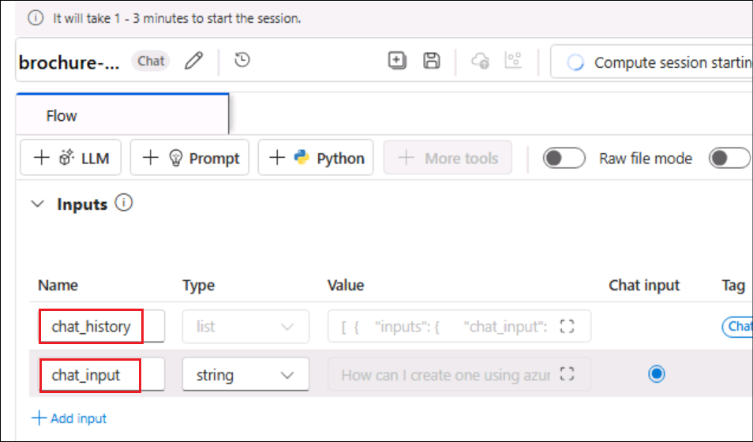

7.  In the **Outputs** section, ensure that the output includes:

    - **chat_output** with value ${chat_with_context.output}

   

8.  In the **modify_query_with_history** section, select the following
    settings (leaving others as they are):

    - **Connection**: Select the **Azure OpenAI resource** for your AI
      hub that gets listed

    - **Api**: Select **chat**

    - **deployment_name**: Select **gpt-4o**

    - **response_format**: Select **{“type”:”text”}**

    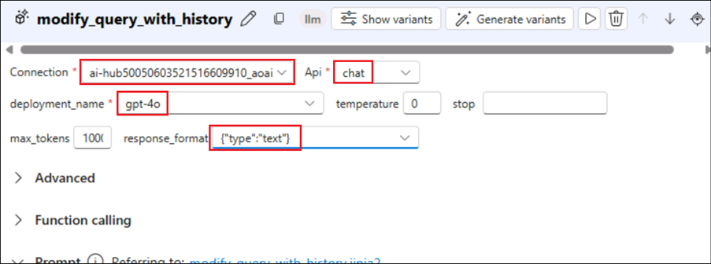

9.  Once the compute session has started, in the **lookup** section, set
    the following parameter values:

    - **mlindex_content**: *Select the empty field to open the Generate
      pane*

      - **index_type**: Select **Registered Index**

      &nbsp;

      - **mlindex_asset_id**: Select **brochures-index:1**

    

    

    Back in the Lookup section enter the below details

    - **queries**: ${modify_query_with_history.output}
    
    - **query_type**: Hybrid (vector + keyword)
    
    - **top_k**: 2

    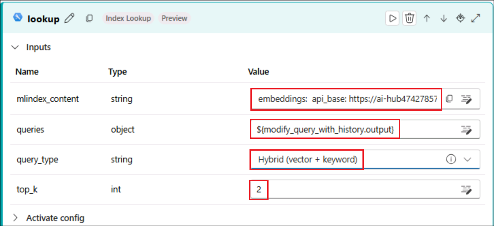

10. In the **generate_prompt_context** section, review the Python script
    and ensure that the **inputs** for this tool include the following
    parameter:

    - **search_result** *(object)*: ${lookup.output}

    

11. In the **Prompt_variants** section, review the Python script and
    ensure that the **inputs** for this tool include the following
    parameters:

    - **contexts** *(string)*: ${generate_prompt_context.output}

    - **chat_history** *(string)*: ${inputs.chat_history}

    - **chat_input** *(string)*: ${inputs.chat_input}

    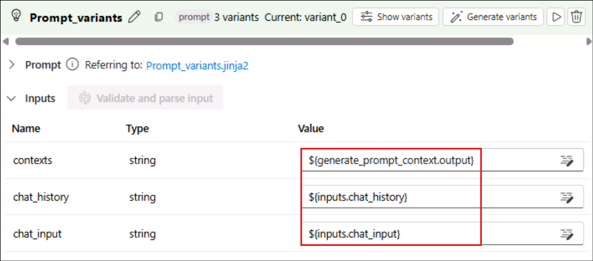

12. In the **chat_with_context** section, select the following settings
    (leaving others as they are):

    - **Connection**: Select the **Azure OpenAI resource**

    - **Api**: Chat

    - **deployment_name**: gpt-4o

    - **response_format**: {“type”:”text”}

    Then ensure that the **inputs** for this tool include the following
parameters:

    - **prompt_text** *(string)*: ${Prompt_variants.output}

    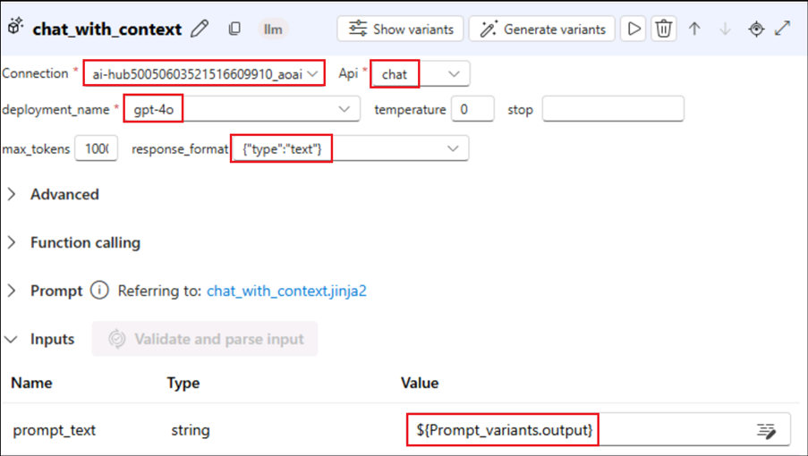

13. Select the **Save** button in the toolbar, to save the changes
    you’ve made to the tools in the prompt flow.

    

14. From the toolbar, select **Chat**. A chat pane opens with the sample
    conversation history and the input already filled in based on the
    sample values. You can ignore these.

    

15. In the chat pane, replace the default input with the
    question +++**Where can I stay in London?**+++ and submit it.

    

16. The response is based on data in the index.

17. Review the outputs for each tool in the flow.

    

18. In the chat pane, enter the question +++**What can I do there?**+++

19. Review the response, which should be based on data in the index and
    it takes **chat history** into account (so “**there**” is understood
    as “**in London**”).

    

20. Review the outputs for each tool in the flow, noting how each tool
    in the flow operated on its inputs to prepare a contextualized
    prompt and get an appropriate response.

## Task 9: Clean up the resources:

1.  From the Azure portal (+++https://portal.azure.com+++), select the
    **ResourceGroup1**(the one assigned to you).

2.  Select all the resources under it and click on **Delete**.

    

3.  Enter +++**delete**+++ and click on the **Delete** button to confirm
    deletion. Click on **Delete** in the Delete confirmation dialog box.

    

4.  Ensure that the resources are deleted, by the delete confirmation
    message.

    

**Summary:**

In this lab, we have learnt to create a custom agent that uses your own
data from **Azure AI Foundry**.
