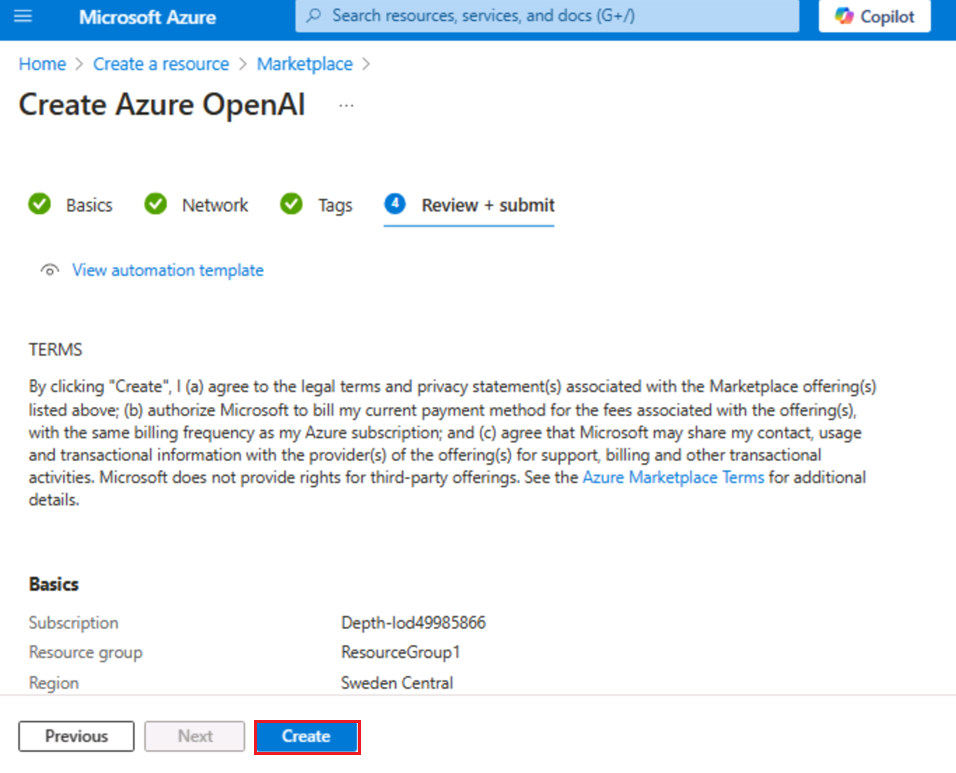
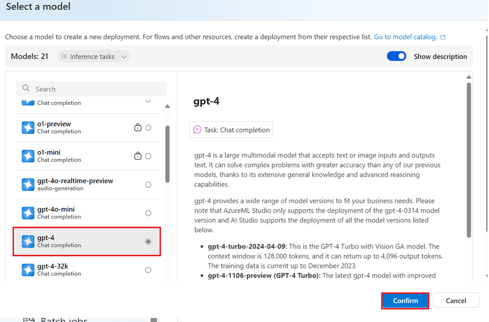
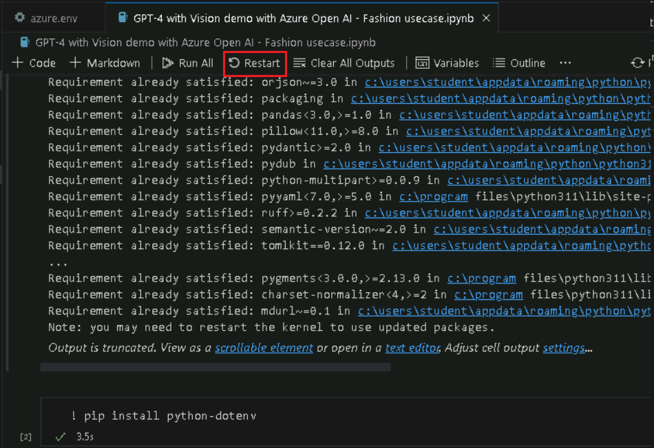
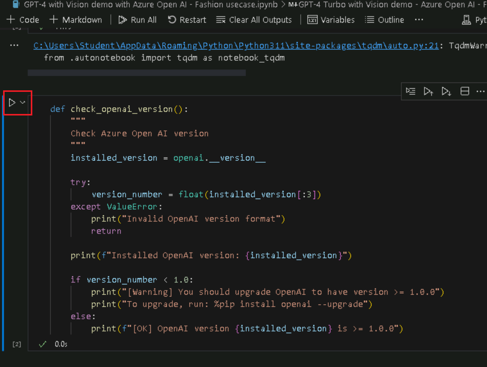
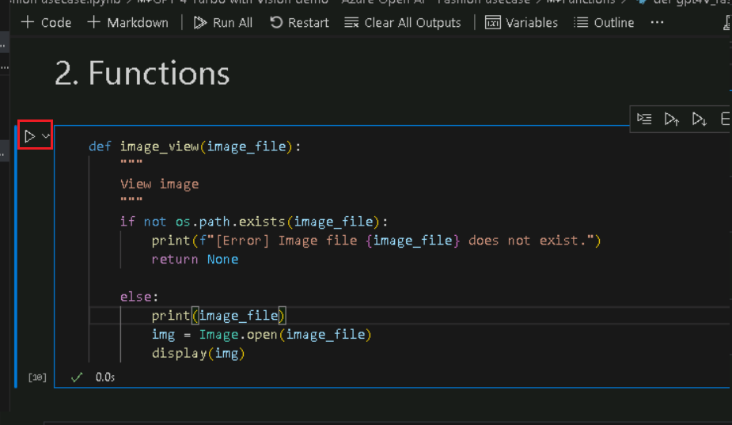
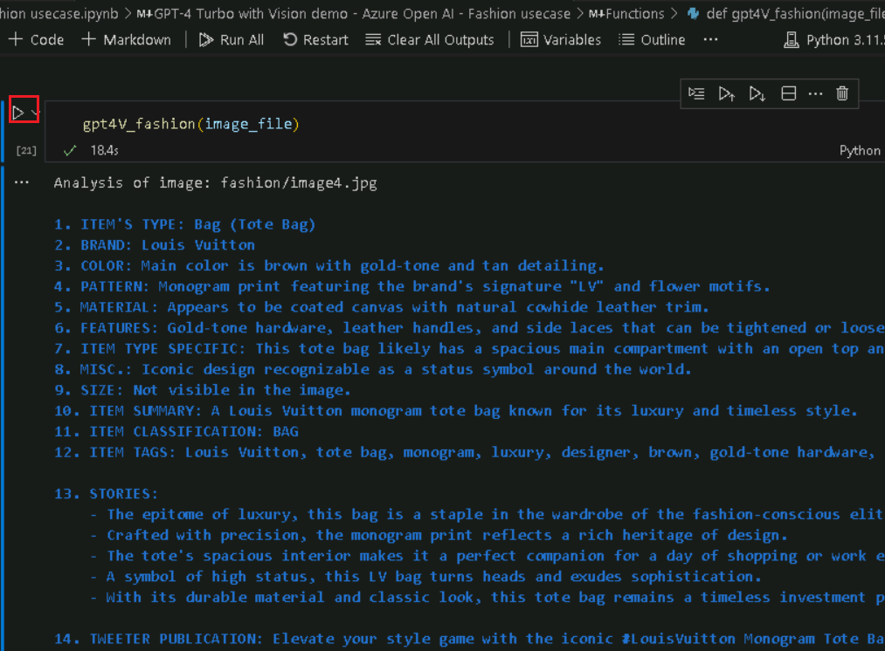
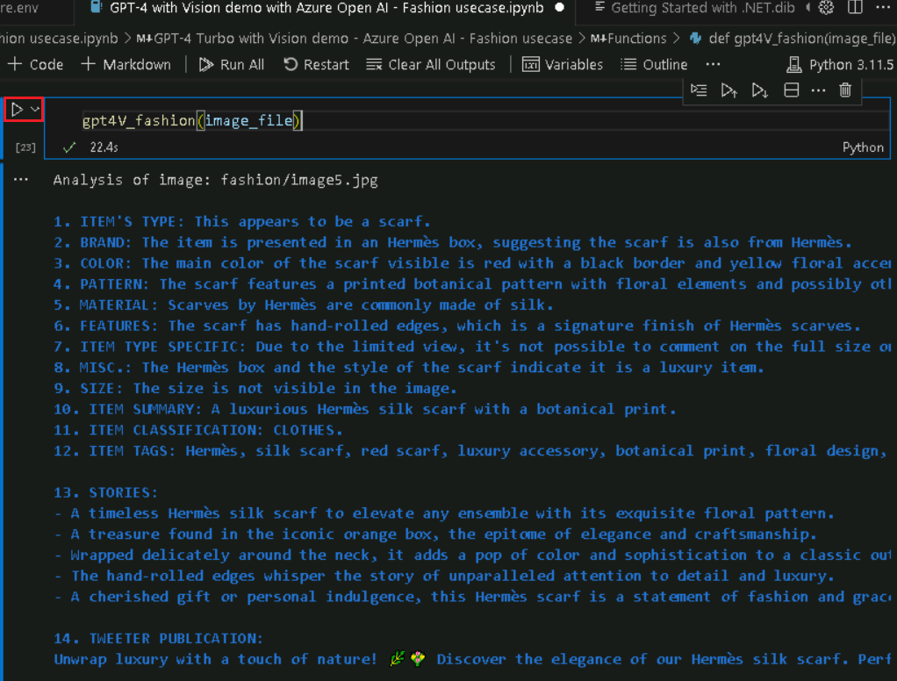
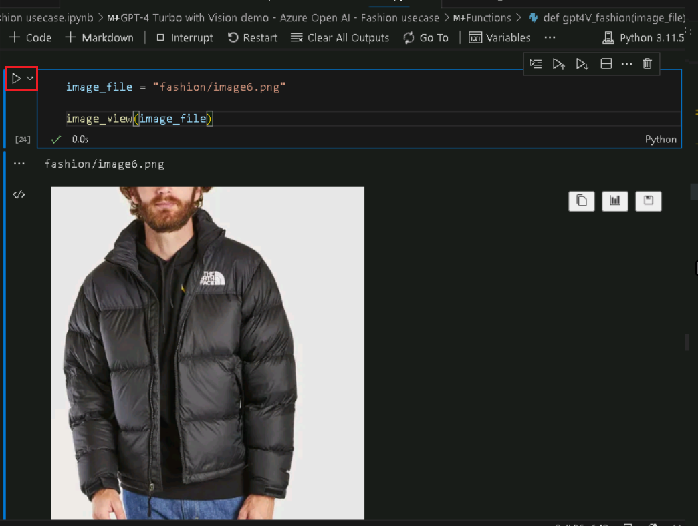

**Caso de uso 01- Análisis de tendencias de moda con GPT-4 Turbo y
Vision en Azure OpenAI**

**Introducción:**

GPT-4 Turbo con Visión en el servicio Azure OpenAI ya está en vista
previa pública. GPT-4 Turbo con Vision es un gran modelo multimodal
(LMM) desarrollado por OpenAI que puede analizar imágenes y proporcionar
respuestas textuales a preguntas sobre ellas. Incorpora tanto el
procesamiento del lenguaje natural como la comprensión visual. Con el
modo mejorado, puede utilizar las funciones de Azure AI Vision para
generar conocimientos adicionales a partir de las imágenes

**Objetivos:**

- Para implementar recursos Azure OpenAI y configurarlos.

- Implementar un modelo específico de Azure OpenAI como GPT-4 Vision.

- Configurar el entorno de desarrollo con Python, Jupyter Notebook y las
  bibliotecas necesarias.

- Este caso de uso está relacionado con los casos de uso de la moda.
  Pueden incluir análisis de imágenes, generación de texto u otras
  tareas de IA.

## Tarea 0: Conozca la máquina virtual y las credenciales

1\. En esta tarea, identificaremos y comprenderemos las credenciales que
utilizaremos a lo largo del laboratorio.

1.  La pestaña instrucciones contiene la guía del laboratorio con las
    instrucciones a seguir a lo largo del mismo.

2.  La pestaña recursos contiene las credenciales necesarias para
    ejecutar el laboratorio.

    - **URL** – URL del portal Azure.

    - **Subscription** – Este es el ID de la suscripción que se le ha
      asignado.

    - **Username** – El identificador de usuario con el que debe iniciar
      sesión en los servicios Azure.

    - **Password** – Contraseña para el inicio de sesión de Azure. Vamos
      a llamar a este nombre de usuario y contraseña como credenciales
      de inicio de sesión de Azure. Utilizaremos estas credenciales
      siempre que mencionemos las credenciales de inicio de sesión de
      Azure.

    - **Resource Group** – El **grupo de recursos** que se le ha
      asignado.

\[!Alerta\] **Importante:**  Asegúrese de crear todos sus recursos en
este grupo de recursos.

> 

2\. La pestaña **Help** contiene la información de Soporte. El valor
**ID** es el **Lab instance ID** que se utilizará durante la ejecución
del laboratorio.

> 

##  Tarea 1: Registre el proveedor de servicios 

1.  Abra un navegador, vaya a +++https://portal.azure.com+++ e inicie
    sesión con su cuenta de Cloud Slice a continuación:

> Usuario: <+++@lab.CloudPortalCredential>(User1).Username+++
>
> Contraseña: +++
>
> 
>
> 

2.  Haga clic en **Subscriptions.** 

> 

3.  Haga clic en el nombre de la suscripción.

> 

4.  Expanda la configuración en el menú de navegación izquierdo. Haga
    clic en **Resource providers**, ingrese
    +++Microsoft.AlertsManagement+++ y selecciónelo. A continuación,
    haga clic en **Register**.

5.  Haga clic en **Resource providers**, ingrese
    +++**Microsoft.DBforPostgreSQL**+++ selecciónelo y, a continuación,
    haga clic en **Register.**

6.  Repita los pasos 10 y 11 para registrar los siguientes proveedores
    de recursos.

- Microsoft.Search

- Microsoft.Web

- Microsoft.ManagedIdentity

## **Tarea 2: Cree un recurso Azure OpenAI**

1.  En el portal Azure, haga clic en el **menú del portal** representado
    por tres barras horizontales en la esquina superior izquierda de la
    página, como se muestra en la siguiente imagen.

> 

2.  Navegue y haga clic en **+ Create a resource**.

> 

3.  En la página **Crear un recurso**, en la barra de búsqueda **Search
    services and marketplace**, escriba **Azure OpenAI** y, a
    continuación, pulse el botón **Intro**.

> 

4.  En la página **Marketplace**, navegue hasta el mosaico **Azure
    OpenAI**, haga clic en el botón con forma de V situado junto a
    **Create** y, a continuación, navegue y haga clic en **Azure
    OpenAI,** como se muestra en la siguiente imagen.

> 

5.  En la ventana **Create Azure OpenAI**, en la pestaña **Basics**,
    ingrese los siguientes datos y haga clic en el botón **Next.**

    1.  **Subscription**: Seleccione la suscripción asignada.

    2.  **Resource group:** Seleccione el grupo de recursos asignado

    3.  Para este laboratorio, utilizará un modelo **gpt-4-vision**.
        Este modelo sólo está disponible en [algunas
        regiones](https://learn.microsoft.com/azure/ai-services/openai/concepts/models#embeddings-models).
        Por favor, seleccione una región de esta lista, En este
        laboratorio **Sweden Central,** se está utilizando para este
        recurso.

    4.  **Name**: **aoai-gpt4-visionXXXXX** (XXXXX puede ser el **Lab
        instance ID**)

    5.  **Pricing tier**: Seleccione **Standard S0**

> **Nota**: Para encontrar el **Lab instance ID**, seleccione **Help** y
> copie el **instance ID** .
>
> .
>
> 
>
> 
>
> 

6.  En la pestaña **Network**, deje todos los botones de opción en el
    estado predeterminado y haga clic en el botón **Next.**

> 

7.  En la pestaña **Tags**, deje todos los campos en el estado
    predeterminado y haga clic en el botón **Next.**

> 

8.  En la pestaña **Review + submit**, una vez superada la validación,
    haga clic en el botón **Create.**

> 

9.  Espere a que se complete la implementación. La instalación tardará
    unos 2-3 minutos.

10. En la ventana **Microsoft.CognitiveServicesOpenAI**, una vez
    finalizada la implementación, haga clic en el botón **Go to
    resource.**

> 

11. Haga clic en **Keys and Endpoints** en el menú de navegación de la
    izquierda y, a continuación, copie el valor del endpoint en un bloc
    de notas en **AzureAI ENDPOINT** y la clave en una variable
    **AzureAIKey.**

> 

12. En la ventana **aoai-gpt4-visionXX**, haga clic en **Overview** en
    el menú de navegación de la izquierda, desplácese hacia abajo hasta
    el mosaico **Get Started** y haga clic en el botón **Go to
    AzureOpenAI Studio** como se muestra en la siguiente imagen para
    abrir **Azure OpenAI Studio** en un nuevo navegador.

## **Tarea 3: Implemente un modelo Azure OpenAI gpt-4-vision** 

1.  En la página de inicio de **Azure AI Foundry | Azure Open AI
    Service**, vaya a la sección **Components** y haga clic en
    **Deployments**.

2.  En la ventana **Deployments,** implemente el +**Deploy model** y
    seleccione **Deploy base** **model.**

3.  En el cuadro de diálogo, **Seleccione un modelo**, navegue y
    seleccione cuidadosamente **gpt-4,** después haga clic en el botón
    **Confirm.**

4.  En el cuadro de diálogo **Deploy model gpt-4**, en el campo
    **Deployment name**, asegúrese de que **gpt-4**, seleccione el tipo
    de implementación como **Standard** y seleccione versión del modelo
    como Vision- preview. A continuación, haga clic en el botón
    **Deploy.**

## Tarea 4: Demostración de GPT-4 Turbo con Vision

1.  En el cuadro de búsqueda de Windows, escriba **Visual Studio** y, a
    continuación, haga clic en **Visual Studio Code**.

> 

2.  En el editor de **Visual Studio Code**, haga clic en **File**, luego
    navegue y haga clic en **Open Folder**.

> 

3.  Navegue y seleccione la carpeta **GPT4V-Fashion** de **C:\LabFiles**
    y haga clic en el botón **Select Folder.**

4.  Si aparece un cuadro de diálogo - **Do you trust the authors of the
    files in this folder?**, a continuación, haga clic en **Yes, I trust
    the author**.

5.  En el menú desplegable Visual Studio Code **Gpt 4V-FASHION**, haga
    clic en el archivo **azure.env.**

1.  Actualice los parámetros, sustituya **Azure OpenAI Endpoint, Azure
    OpenAI Key** (los valores que ha guardado en el bloc de notas en la
    **tarea 1**) y guarde el archivo.

2.  En Visual Studio Code despliegue el **GPT 4V-FASHION** y seleccione
    **GPT-4** **with Vision demo with Azure Open AI** - **Fashion
    usecase.ipynb** notebook.

> 

3.  En la página principal del editor Visual Studio Code, desplácese
    hacia abajo hasta el encabezado **install requirements** y ejecute
    la primera celda. Si se le pide que seleccione el entorno,
    seleccione **Python Environments** como se muestra en la imagen.

> 
>
> 

4.  Si se le pide que seleccione la ruta, seleccione la ruta de **Python
    version 3.11.5** como se muestra en la imagen.

> 

5.  Si aparece un cuadro de diálogo de alerta de seguridad de Windows,
    haga clic en **Allow access**.

> 
>
> 
>
> 
>
> 

6.  Para reiniciar el núcleo Jupyter, haga clic en el botón **Restart**.

> 

7.  Para importar las bibliotecas, seleccione la celda número **4**. A
    continuación, ejecute la celda haciendo clic en el botón **start
    icon**.

> 

8.  Seleccione la celda número **5**. A continuación, ejecute la celda
    haciendo clic en el botón **start icon**.

> 

9.  Para verificar las versiones del sistema OpenAI, seleccione las
    celdas **6**, **7, 8** y **9**.

A continuación, ejecute las celdas haciendo clic en el botón **start
icon**.

> 

10. Para cargar los valores de configuración, seleccione y ejecute las
    celdas **10**, **11** y **12** haciendo clic en el botón **Play.**

> 

11. Defina una función de ayuda para crear embeddings, seleccione y
    ejecute las celdas 13 y 14 haciendo clic en el botón **Play.**

> 
>
> 

12. Para ejecutar el ejemplo, seleccione y ejecute las celdas 15 y 16,
    haciendo clic en el botón **Play.**

> 
>
> 

13. Para ejecutar el ejemplo, seleccione y ejecute las celdas **17** y
    **18,** haciendo clic en el botón **Play.**

> 
>
> 

14. Para ejecutar el ejemplo, seleccione y ejecute las celdas **19** y
    **20,** haciendo clic en el botón **Play.**

> 
>
> 

15. Para ejecutar el ejemplo, seleccione y ejecute las celdas **21** y
    **22,** haciendo clic en el botón **Play.**

> 
>
> 

16. Para ejecutar el ejemplo, seleccione y ejecute las celdas **23** y
    **24,** haciendo clic en el botón **Play.**

> 

17. Para ejecutar el ejemplo, seleccione y ejecute las celdas **25** y
    **26,** haciendo clic en el botón **Play.**

> 
>
> 

18. Para ejecutar el ejemplo, seleccione y ejecute las celdas **27** y
    **28,** haciendo clic en el botón **Play**.

> 
>
> 

19. Para ejecutar el ejemplo, seleccione y ejecute las celdas **29** y
    **30,** haciendo clic en el botón **Play**.

> 
>
> 

20. Para generar la WebApp, seleccione y ejecute la **29** celda,
    haciendo clic en el botón **Play**.

> 

21. Para generar la WebApp, seleccione y ejecute la celda **30,**
    haciendo clic en el botón **Play.**

> 

22. Cuando la aplicación se haya desplegado correctamente, verá una URL
    en la terminal. Copie la **URL.**

23. Abra su navegador, vaya a la barra de direcciones y pegue el enlace
    URL de Publick. 

24. Abra su navegador, vaya a la barra de direcciones y pegue el enlace
    URL local. Seleccione cualquier elemento.

25. Haga clic en el botón **Submit.**

> 

## Tarea 5: Elimine los recursos

1.  Para eliminar la cuenta de almacenamiento, vaya a la **página de
    inicio del portal Azure** y haga clic en **Resource groups.**

> 

2.  Haga clic en el grupo de recursos **ResourceGroup1.**

> 

3.  En la página de inicio del **grupo de recursos**, seleccione
    **delete resource group.**

4.  En el panel **Delete Resources** que aparece a la derecha,
    desplácese hasta el campo **Enter “resource group name” to confirm
    deletion** para confirmar la eliminación y, a continuación, haga
    clic en el botón **Delete**.

5.  En el cuadro de diálogo **Delete confirmation**, haga clic en el
    botón **Delete**.

> 

6.  Haga clic en el icono de la campana, verá la notificación –**Deleted
    resource group AOAI-RG89.**

**Resumen**

En este laboratorio práctico, los participantes exploran las capacidades
avanzadas de IA mediante Azure OpenAI. Comenzando con la configuración
de los recursos esenciales de Azure, se despliegan modelos de IA como
GPT-4-vision. El laboratorio se enfoca específicamente en cómo GPT-4,
con capacidades de visión, puede transformar las tareas relacionadas con
la moda, tales como el reconocimiento de imágenes, las recomendaciones
de estilo personalizadas y el análisis de tendencias.
