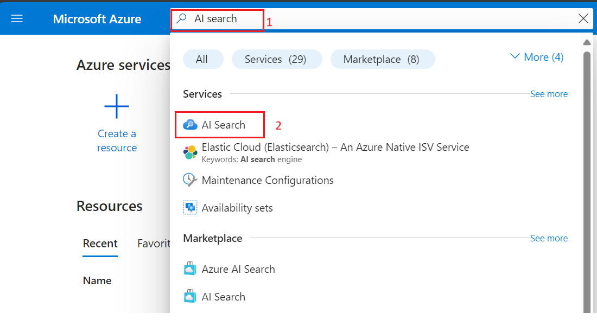
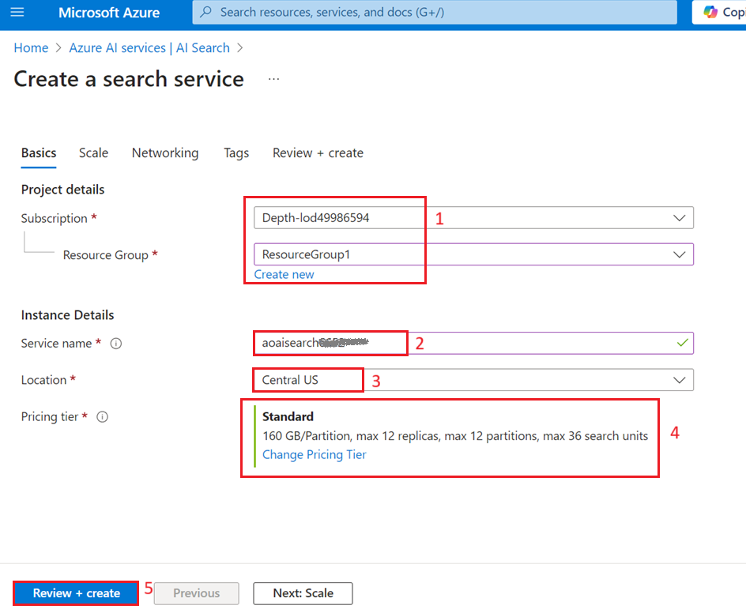
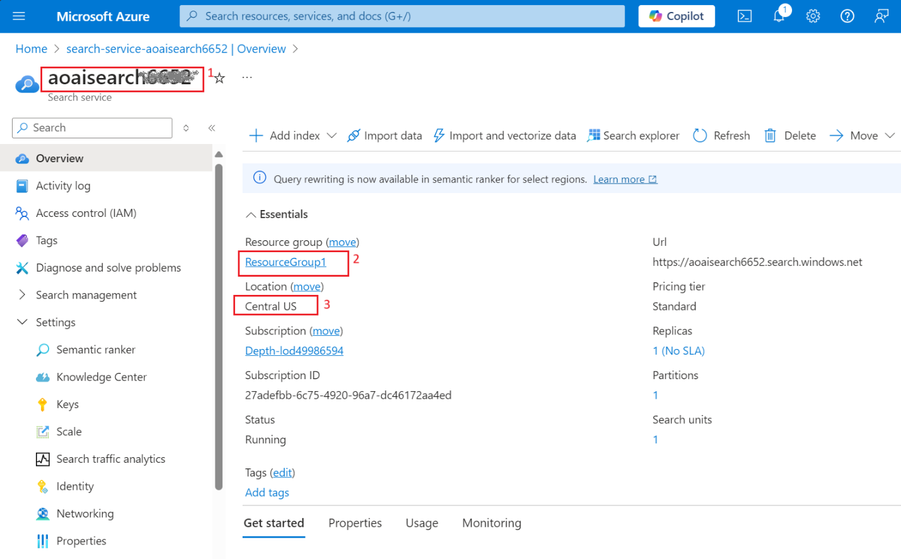
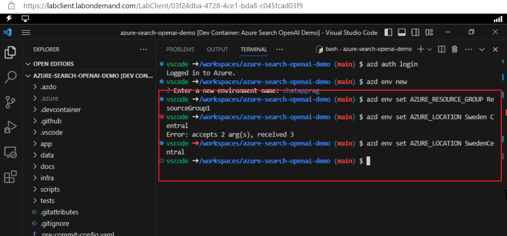

**Introducción**

Este ejemplo demuestra varios enfoques para crear experiencias similares
a ChatGPT utilizando el patrón Retrieval Augmented Generation (RAG)
sobre sus propios datos. Utiliza el Azure OpenAI Service para acceder al
modelo ChatGPT (gpt-35-turbo) y Azure Cognitive Search para la
indexación y recuperación de datos.

El repositorio incluye datos de ejemplo, por lo que está listo para
probarse de principio a fin. En esta aplicación de muestra utilizamos
una empresa ficticia llamada Contoso Electronics, y la experiencia
permite que sus empleados hagan preguntas sobre beneficios, políticas
internas, así como descripciones de trabajo y roles.

Este caso de uso lo guía a través del proceso de desarrollo de una
sofisticada aplicación de chat utilizando el patrón Retrieval Augmented
Generation (RAG) en la plataforma Azure. Al aprovechar los servicios
Azure OpenAI Service y Azure Cognitive Search, creará una aplicación de
chat que puede responder inteligentemente a preguntas utilizando sus
propios datos. Este laboratorio utiliza una empresa ficticia, Contoso
Electronics, como estudio de caso para demostrar cómo construir una
experiencia similar a ChatGPT sobre los datos empresariales, abarcando
aspectos como beneficios para empleados, políticas internas, roles y
descripciones de trabajo.

**Objetivos**

- Instalar Azure CLI y Node.js en su máquina local.

- Asignar un rol de propietario al usuario.

- Instalar la extensión Dev Containers y configurar el entorno de
  desarrollo.

- Implementar una aplicación de chat en Azure y usarla para obtener
  respuestas de archivos PDF.

- Eliminar los recursos y modelos implementados.

## Tarea 1: Instale Azure CLI y establezca el alcance de la política en la máquina local

1.  En la barra de búsqueda de Windows, escriba **PowerShell**. En el
    cuadro de diálogo **PowerShell**, navegue y haga clic en **Run as
    administrator**. Si aparece el cuadro de diálogo - **Do you want to
    allow this app to make changes to your device?** haga clic en el
    botón **Yes**.

> 

2.  Ejecute el siguiente comando para instalar Azure Cli en el
    PowerShell.

PowerShell copy

> **winget install microsoft.azd**

3.  Ejecute el siguiente comando para establecer la política en
    **Unrestricted** e ingrese **A** cuando se le pregunte si desea
    cambiar la política de ejecución.

> **Set-ExecutionPolicy Unrestricted**
>
> 

## Tarea 2: Instale Node.js

1.  Abra su navegador, vaya a la barra de direcciones, escriba o pegue
    la siguiente URL: +++https://nodejs.org/en/download/+++ y, a
    continuación, haga clic en el botón **Enter.**

2.  Seleccione y haga clic en **Windows Installer**.

3.  Se descargará el archivo **Node-V**. Haga clic en el archivo
    descargado para configurar **Node.js.**

4.  En la ventana **Welcome to the Node.js Setup Wizard**, haga clic en
    el botón **Next**.

5.  En la ventana **End-User License Agreement**, seleccione el botón de
    opción **I accept the terms in the License agreement** y haga clic
    en el botón **Next**.

6.  En la ventana **Destination Folder**, haga clic en el botón
    **Next.**

7.  En la ventana **Custom Setup**, haga clic en el botón **Next.**

8.  En la ventana **Ready to install** Node.js, haga clic en
    **Install.**

9.  En la ventana **Completing the Node.js Setup Wizard window**, haga
    clic en el botón **Finish** para completar el proceso de
    instalación.

## Tarea 3: Recupere el nombre y la ubicación del grupo de recursos

1.  Abra su navegador, vaya a la barra de direcciones y escriba o pegue
    la siguiente URL: +++https://portal.azure.com/+++ y, a continuación,
    haga clic en el botón **Enter.**

> 

2.  En la ventana de **Microsoft Azure**, utilice las **credenciales de
    usuario** para iniciar sesión en Azure.

3.  A continuación, ingrese la contraseña y haga clic en el botón **Sign
    in.**

> 

4.  En la ventana **Stay signed in?**, haga clic en el botón **Yes.**

> 

5.  Escriba +++**Resource group+++** en la barra de búsqueda y
    seleccione **Resource groups.**

> 

6.  Haga clic en el botón **Resource group**.

7.  En la página **Resource group**, copie el **nombre y la ubicación
    del grupo de recursos** y péguelos en un bloc de notas; a
    continuación, **guarde** el bloc de notas para utilizar la
    información en las siguientes tareas.

## Tarea 4: Cree el servicio de búsqueda de IA

1.  En el portal Azure, escriba +++**AI search**+++ en la barra de
    búsqueda y seleccione **AI Search.**

2.  Haga clic en +**Create**.

3.  Seleccione los valores siguientes y haga clic en **Review +
    Create**.

&nbsp;

1)  Subscription: **Su suscripción a Azure.**

2)  Resource group - **Seleccione el grupo de recursos existente.**

3)  Service name - **aisearchXXXX(XXXXX puede ser Lab instant ID)**

4)  Location: **Central US** / Ubicación cerca de usted.

5)  Pricing tier: Standard

4.  Ahora, haga clic en **Create**.

5.  Espere a que se implemente y haga clic en **Go to resource**.

> 
>
> 

6.  En la página overview de **AI Search**, en el panel de navegación
    izquierdo, dentro de la sección **Settings**, seleccione **Semantic
    ranker**.

7.  En la pestaña **Semantic ranker**, seleccione la ficha **Standard**
    y haga clic en el botón **Select plan**.

> 

8.  Seleccione **Yes**

> 

9.  Verá la siguiente notificación-**Successfully updated semantic
    ranker to standard plan**

> 

10. Abra un bloc de notas y anote el nombre de AI Search, el nombre del
    grupo de recursos y la ubicación. Lo utilizaremos más tarde para
    comunicarnos con el servicio.

> 

## Tarea 5: Ejecute el Docker

1.  En el cuadro de búsqueda de Windows, escriba Docker y haga clic en
    **Docker Desktop**.

2.  Ejecute el Docker Desktop.

## **Tarea 6: Instale la extensión Dev Containers**

1.  En el cuadro de búsqueda de Windows, escriba Visual Studio y, a
    continuación, haga clic en **Visual Studio Code**.

> 

2.  Abra su navegador, vaya a la barra de direcciones, escriba o pegue
    la siguiente URL:
    +++https://marketplace.visualstudio.com/items?itemName=ms-vscode-remote.remote-containers+++
    y, a continuación, pulse la tecla **Enter**.

> 

3.  En la página Dev Containers, seleccione el botón **Install**.

4.  Aparecerá el cuadro de diálogo Visual Studio Code es necesario para
    instalar esta extensión, a continuación, haga clic en el botón
    **Continue.**

5.  Aparece el cuadro de diálogo This site is trying to open Visual
    Studio Code, haga clic en el botón **Open.**

6.  En Visual Studio, haga clic en el botón **Install** bajo Dev
    containers.

## Tarea 7: Entorno de desarrollo abierto

1.  Abra su navegador, vaya a la barra de direcciones, escriba o pegue
    la siguiente URL:

+++<https://vscode.dev/redirect?url=vscode://ms-vscode-remote.remote-containers/cloneInVolume?url=https://github.com/azure-samples/azure-search-openai-demo>+++
y, a continuación, pulse la tecla **Enter**.

2.  Aparece el cuadro de diálogo This site is trying to open Visual
    Studio Code, haga clic en el botón **Open.**

> 

3.  Aparecerá el cuadro de diálogo Allow ‘Dev Containers’ extension to
    open this URI? y, a continuación, haga clic en el botón **Open**.

> 

4.  Aparece el cuadro de diálogo, Cloning a repository in a Dev
    Container may execute arbitrary code, luego haga clic en el botón
    **Got It**.

> 

5.  Iniciar el contenedor de desarrollo tomará entre 13 y 15 minutos.
    Después de la implementación, presione la tecla Enter.

6.  Pulse cualquier tecla para cerrar la terminal.

> 

## Tarea 8: Implemente la aplicación de chat en Azure

1.  Inicie sesión en Azure con Azure Developer CLI. Ejecute el siguiente
    comando en la terminal.

> BashCopy
>
> **azd auth login**
>
> 

2.  Se abre el navegador predeterminado para iniciar sesión. Inicie
    sesión con su cuenta de suscripción de Azure.

> 

3.  Cierre el navegador.

> 

4.  Una vez iniciada la sesión, los detalles del inicio de sesión Azure
    se completan en la terminal.

> 

5.  Cree un nuevo entorno azd. Ejecute el siguiente comando en la
    terminal.

Copy

**azd env new**

6.  Ingrese el nuevo nombre del entorno como +++**chatapprag+++**

> 

7.  Asigne el grupo de recursos Azure existente. Ejecute el siguiente
    comando en la terminal.

> azd env set AZURE_RESOURCE_GROUP {Name of existing resource group}
>
> azd env set AZURE_LOCATION {Location of existing resource group}
>
> 

8.  Asigne el servicio Azure AI Search existente. Ejecute el siguiente
    comando en la terminal.

> +++azd env set AZURE_SEARCH_SERVICE {Name of existing Azure AI Search
> service}+++
>
> +++azd env set AZURE_SEARCH_SERVICE_RESOURCE_GROUP {Name of existing
> resource group with ACS service}+++
>
> +++azd env set AZURE_SEARCH_SERVICE_LOCATION {Location of existing
> service}+++
>
> +++azd env set AZURE_SEARCH_SERVICE_SKU {Name of SKU}+++
>
> 

9.  Compruebe los recursos existentes asignados, seleccione Azure y
    elija el archivo **.env.**

> 

10. Crear un nuevo entorno azd:

> shellCopy
>
> **azd up**
>
> 

11. Seleccione su suscripción Azure.

> 

12. Cuando se le solicite, **ingrese un valor para el parámetro de
    infraestructura ‘documentIntelligenceResourceGroupLocation’**,
    seleccione **West US2.**

> 

13. Cuando se le solicite, **ingrese un valor para el parámetro de
    infraestructura ‘openAiResourceGroupLocation’,** seleccione **France
    Central.**

> 

14. Espere a que la aplicación se implemente. Este proceso puede tardar
    entre **35** y **40** minutos.

> 
>
> 
>
> 
>
> 
>
> 

15. Una vez que la aplicación se haya implementado correctamente, verá
    una URL impresa en la consola. Haga clic en esa URL para interactuar
    con la aplicación en su navegador. Tendrá el siguiente aspecto:

> 

16. Abra su navegador, navegue hasta la barra de direcciones, pegue el
    enlace. Ahora, el grupo de recursos se abrirá en un nuevo navegador.

## Tarea 9: Verifique los recursos implementados en el portal de Azure

1.  Seleccione **Resource groups.**

> 

2.  Haga clic en el botón **Resource group**.

3.  Asegúrese de que el siguiente recurso se ha implementado
    correctamente.

- Azure App Service

- Azure Application Insights

- Container App

- Container registry

- Azure OpenAI

- Azure Document Intelligence

- Azure Search Service

- Azure Storage Account

- Azure Speech Service

4.  En el grupo de recursos, haga clic en **AI Search service.**

> 

5.  Asegúrese de que los índices se implementan correctamente.

> 

6.  Vuelva a resorcegroup y haga clic en **Storage account.**

> 

7.  En el menú de navegación de la izquierda, haga clic en
    **Containers**, asegúrese de que los datos se implementen
    correctamente.

> 

## Tarea 10: Utilice la aplicación de chat para obtener respuestas de archivos PDF

1.  Espere a que finalice la implementación de la aplicación web.

> 

2.  En la página **GPT+Eneterprise data |Sample** web app, ingrese el
    siguiente texto y haga clic en **Submit icon** como se muestra en la
    siguiente imagen.

> **What happens in a performence review?**

3.  De la respuesta, seleccione una **citation**.

4.  En el panel derecho, utilice las pestañas para comprender cómo se ha
    generado la respuesta.

[TABLE]

5.  Seleccione de nuevo la pestaña seleccionada para cerrar el panel.

6.  La inteligencia del chat viene determinada por el modelo OpenAI y
    los ajustes que se utilizan para interactuar con el modelo.

7.  Seleccione la opción **Developer settings**.

[TABLE]

8.  Marque la casilla **Suggest follow-up questions** y vuelva a
    formular la misma pregunta.

9.  Ingrese el siguiente texto y haga clic en el **Submit icon**, como
    se muestra en la siguiente imagen.

> What happens in a performance review?

10. En el chat se sugirieron preguntas de seguimiento como las
    siguientes.

11. En la pestaña **Settings**, anule la selección de **Use semantic
    ranker for retrieval**.

12. Ingrese el siguiente texto y haga clic en el **Submit icon**, como
    se muestra en la siguiente imagen.

> What happens in a performance review?

## Tarea 11: Elimine los recursos

1.  Para eliminar un grupo de recursos, escriba **Resource groups** en
    la barra de búsqueda del portal Azure, navegue y haga clic en
    **Resource groups** en **Services.**

> 

2.  Haga clic en el grupo de recursos de la aplicación web de ejemplo.

> 

3.  En la página de inicio del grupo de recursos, seleccione **all
    resources.**

4.  Seleccione **Delete**

**Resumen**

En este laboratorio, ha aprendido cómo configurar e implementar una
aplicación de chat inteligente utilizando el conjunto de herramientas y
servicios de Azure. Comenzando con la instalación de herramientas
esenciales como Azure CLI y Node.js, ha configurado su entorno de
desarrollo utilizando Dev Containers en Visual Studio Code. Ha
implementado una aplicación de chat que utiliza Azure OpenAI y Azure
Cognitive Search para responder preguntas de archivos PDF. Finalmente,
ha eliminado los recursos implementados para gestionar eficazmente los
recursos. Esta experiencia práctica le ha proporcionado las habilidades
necesarias para desarrollar y gestionar aplicaciones de chat
inteligentes utilizando el patrón de generación aumentada por
recuperación (Retrieval Augmented Generation) en Azure.
