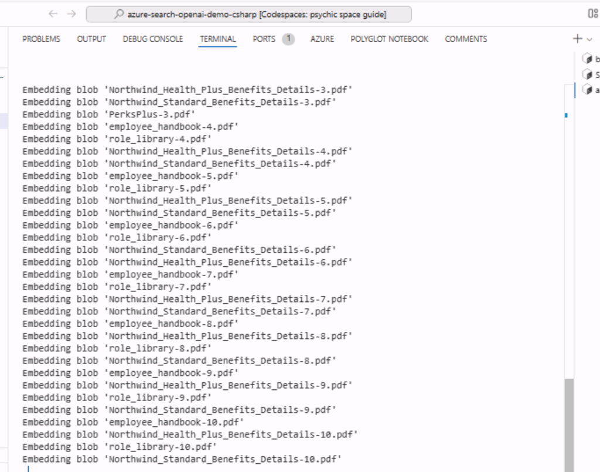

# Caso de uso 04: Creación de una aplicación de chat (utilizando .NET) que emplea el servicio Azure OpenAI y RAG

Este ejemplo demuestra algunas estrategias para crear experiencias
similares a ChatGPT utilizando el patrón de generación aumentada por
recuperación sobre sus propios datos. Utiliza el servicio Azure OpenAI
para acceder al modelo ChatGPT (gpt-4o-mini) y Azure AI Search para la
indexación y recuperación de datos.

El repositorio incluye datos de muestra, por lo que está listo para
probarlo de principio a fin. En esta aplicación de muestra, utilizamos
una empresa ficticia llamada Contoso Electronics, y la experiencia
permite a sus empleados hacer preguntas sobre los beneficios, políticas
internas, así como descripciones de puestos y roles.

- Interfaz de chat por voz, chat y preguntas y respuestas.

- Explora varias opciones para ayudar a los usuarios a evaluar la
  confiabilidad de las respuestas con citas, seguimiento del contenido
  de las fuentes, etc.

- Muestra posibles enfoques para la preparación de datos, construcción
  de prompts y orquestación de la interacción entre el modelo (ChatGPT)
  y el recuperador (Azure AI Search).

- Ajustes directamente en la interfaz de usuario para modificar el
  comportamiento y experimentar con opciones.

**Tecnologías clave utilizadas: -**Azure OpenAI Service, modelo ChatGPT
(gpt-4o-mini) y Azure AI Search

**Tiempo estimado -** 40 minutos

# Ejercicio 1: Implementar la aplicación y probarla desde el navegador

## Tarea 1: Abra el entorno de desarrollo

1.  Abra su navegador, navegue hasta la barra de direcciones, escriba o
    pegue la siguiente URL:
    +++https://github.com/technofocus-pte/azure-search-openai-demo-csharp.git+++
    e inicie sesión con su cuenta de Github.

> 

2.  Haga clic en **Fork**.

> 

3.  Ingrese el nombre del repositorio y haga clic en **Create fork**.

> 

4.  Haga clic en **Code -\> Codespaces -\> +.**

> 

5.  Espere a que se configure el entorno. Tardará entre 5 y 10 minutos.

> 

## Tarea 2: Provisionar los servicios necesarios para construir e implementar la aplicación de chat en Azure

1.  Ejecute el siguiente comando en la terminal. Copie el código y pulse
    Intro.

> +++azd auth login+++
>
> 

2.  Se abre el navegador predeterminado para introducir un código.
    Ingrese el código copiado y haga clic en **Next**.

> 

3.  Inicie sesión con sus credenciales de Azure.

4.  Regrese a la pestaña Github Codespace. Ejecute el siguiente comando
    para inicializar el entorno del proyecto en el directorio actual.
    Ingrese el nombre del entorno como +++**chatragXXX+++** y haga clic
    en Intro.

> Nota: el nombre del entorno debe ser único.
>
> +++azd env new+++

5.  Ejecute el siguiente comando para aprovisionar los servicios a
    Azure, cree su contenedor.

> +++azd env set AZURE_RESOURCE_GROUP ResourceGroup1+++
>
> 

6.  Ejecute azd up - Esto aprovisionará los recursos Azure e
    implementará esta muestra en esos recursos, incluyendo la
    construcción del índice de búsqueda basado en los archivos
    encontrados en la carpeta/data.

> **+++azd up+++**
>
> 

7.  Seleccione los siguientes valores:

- **Seleccione una suscripción de Azure a utilizar**: Seleccione su
  suscripción.

- **Seleccione una ubicación de Azure a utilizar:** East US 2 / West US
  2 (A veces, East US puede no estar disponible; elija una ubicación de
  la lista mencionada a continuación).

- **Seleccione un grupo de recursos existente:** Su grupo de recursos
  existente (por ejemplo: ResourceGroup1).

> 
>
> 

7.  Espere a que el recurso se aprovisione completamente. Este proceso
    tardará entre 5 y 10 minutos en crear todos los recursos necesarios.

> 
>
> 
>
> 

8.  Cuando la aplicación se haya implementado correctamente, verá una
    URL en la terminal. Copie la **URL.**

> 

9.  Haga clic en **Open.**

> 

10. Abra la aplicación en una nueva pestaña.

> 

11. Abra un navegador, vaya a <https://portal.azure.com> e inicie sesión
    con su cuenta de suscripción a Azure.

12. En la página de inicio, haga clic en **Resource Groups.**

> 

13. Haga clic en su grupo de recursos.

> 

14. Asegúrese de que el siguiente recurso se ha implementado
    correctamente.

> 

> 

15. En el grupo de recursos, haga clic en el nombre del recurso **Azure
    OpenAI**.

> 

16. En la ventana de **Azure OpenAI**, haga clic en **Overview** en el
    menú de navegación de la izquierda y, a continuación, en la pestaña
    **Get Started**, haga clic en el botón **Go to Azure OpenAI Studio**
    para abrir **Azure OpenAI Studio** en un nuevo navegador.

> 

17. Asegúrese de que **gpt-4o-mini, text-embedding-ada-002** se
    implemente correctamente.

> 

18. En el grupo de recursos, haga clic en el **storage account** de la
    cuenta de almacenamiento.

> 
>
> 

19. Ahora abra la URL en un navegador.

> 

20. Haga clic en **Chat.**

> 

21. En la página de la aplicación web **Blazor OpenAI**, ingrese el
    siguiente texto y haga clic en **Submit icon** como se muestra en la
    siguiente imagen.

> **+++What is included in my Northwind Health Plus plan that is not in
> standard?+++**
>
> 
>
> 

22. En la página de la aplicación web **Blazor OpenAI**, ingrese el
    siguiente texto y haga clic en el **Submit icon** como se muestra en
    la siguiente imagen.

> **+++Can I use out-of-network providers?+++**
>
> 
>
> 

23. En la página de la aplicación web **Blazor OpenAI**, ingrese el
    siguiente texto y haga clic en el **Submit icon** como se muestra en
    la siguiente imagen.

> **+++Are there any exclusions or restrictions?+++**
>
> 
>
> 

24. En la página de la aplicación web **Blazor OpenAI**, ingrese el
    siguiente texto y haga clic en el **Submit icon** como se muestra en
    la siguiente imagen.

> **+++What does a Product Manager do?+++**
>
> 

25. Haga clic en **Documents.**

> 

## **Tarea 3: Elimie todos los recursos**

1.  Regrese al **Azure portal -\> Resource group-\> Resource group
    name.**

> 

2.  Seleccione todos los recursos y haga clic en **Delete** como se
    muestra en la siguiente imagen. (**NO ELIMINE** el grupo de
    recursos).

> 

3.  Escriba delete en el cuadro de texto y haga clic en **Delete**.

> 

4.  Confirme la eliminación haciendo clic en **Delete**.

> 

5.  Regrese a la pestaña del portal Github y actualice la página.

> 

6.  Haga clic en código, seleccione la rama creada para este laboratorio
    y haga clic en **Delete**.

> 

7.  Confirme la supresión de la rama haciendo clic en el botón
    **Delete**.

**Resumen:**

Este caso de uso le enseñó a implementar una aplicación de chat para el
patrón de generación aumentada por recuperación (RAG) en Azure,
utilizando Azure AI Search para la recuperación y los modelos de
lenguaje de gran tamaño (LLMs) de Azure OpenAI, junto con LangChain,
para potenciar experiencias al estilo de ChatGPT y de preguntas y
respuestas (Q&A).
