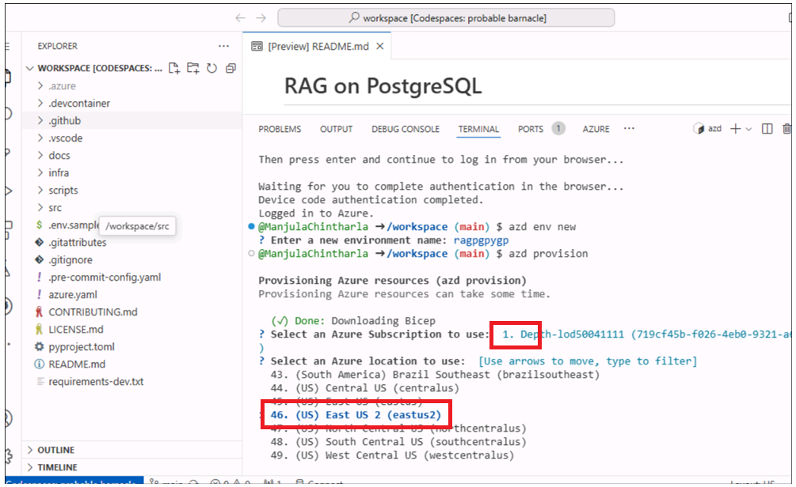
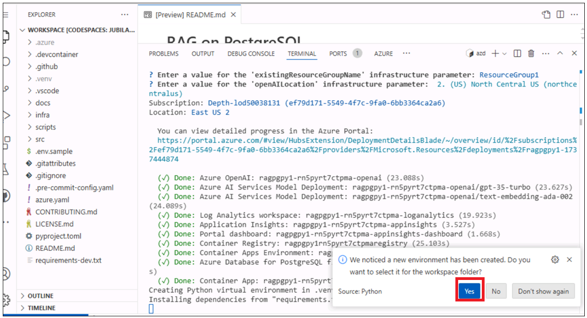
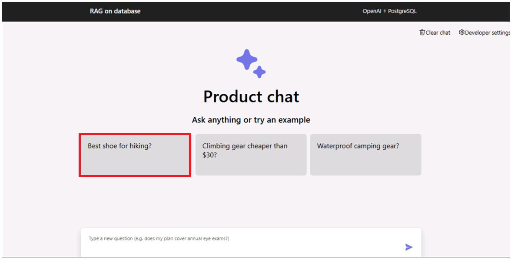
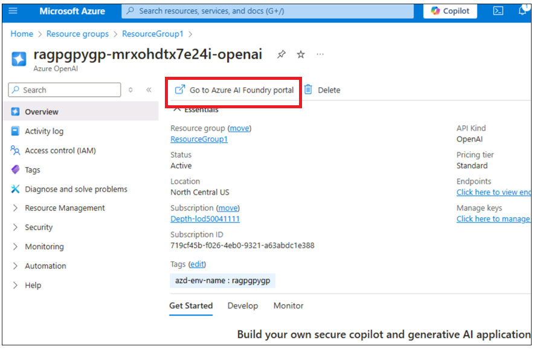

# Caso de uso 06 - Implementar una aplicación de chat en Azure Container Apps con PostgreSQL Flexible Server

**Objetivos:**

- Configurar el entorno de desarrollo en Windows instalando Azure CLI,
  Node.js, asignando roles de suscripción de Azure, iniciando Docker
  Desktop y habilitando Visual Studio Code con la extensión Dev
  Containers.

- Implementar y probar la aplicación de chat personalizada con
  PostgreSQL y OpenAI en Azure.

En este caso de uso, se configurará un entorno de desarrollo completo,
se implementará una aplicación de chat integrada con PostgreSQL y se
verificará su implementación en Azure. Esto incluye la instalación de
herramientas esenciales como Azure CLI, Docker y Visual Studio Code (ya
configuradas en el entorno anfitrión), la asignación de roles de usuario
en Azure, la implementación de la aplicación mediante Azure Developer
CLI y la interacción con los recursos implementados para garantizar su
funcionamiento.

**Principales tecnologías utilizadas** -- Python, FastAPI, modelos de
Azure OpenAI, Azure Database for PostgreSQL y
azure-container-apps,ai-azd-templates.

**Tiempo estimado** -- 45 minutos

**Tipo de laboratorio:** Dirigido por el instructor

**Requisitos previos:** Cuenta de GitHub -- Se espera que tenga sus
propias credenciales de acceso a GitHub. Si no las tiene, cree una desde
aquí:
- +++<https://github.com/signup?user_email=&source=form-home-signupobjectives+++>

**Ejercicio 1: Provisionar, implementar y probar la aplicación desde el
navegador**

## Tarea 0: Comprender la máquina virtual y las credenciales

En esta tarea, identificaremos y comprenderemos las credenciales que
utilizaremos a lo largo del laboratorio.

1.  **Pestaña de instrucciones:** Sujeta la guía de laboratorio con las
    instrucciones a seguir a lo largo del laboratorio.

2.  **La pestaña recursos:** Contiene las credenciales necesarias para
    ejecutar el laboratorio.

    - **URL** – URL del portal Azure.

    - **Subscription** – Este es el ID de la suscripción que se le ha
      asignado.

    - **Username** – El identificador de usuario con el que debe iniciar
      sesión en los servicios Azure.

    - **Password** – Contraseña para el inicio de sesión de Azure. Vamos
      a llamar a este nombre de usuario y contraseña como credenciales
      de inicio de sesión de Azure. Utilizaremos estas credenciales
      siempre que mencionemos las credenciales de inicio de sesión de
      Azure.

    - **Resource Group** – El **grupo de recursos** que se le ha
      asignado.

\[!Alerta\] **Importante:** Asegúrese de crear todos sus recursos en
este grupo de recursos.

> 

3.  La pestaña **Help** contiene la información de Soporte. El valor
    **ID** es el **Lab instance ID** que se utilizará durante la
    ejecución del laboratorio.

> 

##  Tarea 1: Registre el proveedor de servicios

1.  Abra un navegador, vaya a +++https://portal.azure.com+++ e inicie
    sesión con su cuenta en la nube que aparece a continuación.

> Nombre de usuario: <+++@lab.CloudPortalCredential>(User1).Username+++
>
> Contraseña: <+++@lab.CloudPortalCredential(User1).Password>+++
>
> 
>
> 

2.  Haga clic en el mosaico **Subscriptions**.

> 

3.  Haga clic en el nombre de la suscripción.

> 

4.  Expanda configuración en el menú de navegación izquierdo. Haga clic
    en **Resource providers**, ingrese
    +++**Microsoft.AlertsManagement**+++ y selecciónelo.  
    A continuación, haga clic en **Register.**

5.  Haga clic en **Resource providers**, ingrese
    +++**Microsoft.DBforPostgreSQL**+++ y selecciónelo. A continuación,
    haga clic en **Register.**

6.  Repita los pasos 10 y 11 para registrar los siguientes proveedores
    de recursos.

- Microsoft.Search

- Microsoft.Web

- Microsoft.ManagedIdentity

## Tarea 2: Copie el nombre del grupo de recursos existente

1.  En la página de inicio, haga clic en el mosaico **Resource
    groups.**  

2.  Asegúrese de contar con un grupo de recursos creado para trabajar.
    No elimine este grupo de recursos; en su lugar, puede eliminar los
    recursos dentro de él, pero no el grupo en sí.

3.  Haga clic en el nombre del grupo de recursos.

4.  Copie el nombre del grupo de recursos y guárdelo en el bloc de notas
    para utilizarlo en la implementación de todos los recursos en este
    grupo de recursos.

## Tarea 3: Ejecute el Docker

1.  En el escritorio, haga doble clic en **Docker Desktop**.

> 

2.  Ejecute el Docker Desktop.

> 

## Tarea 4: Abra el entorno de desarrollo

1.  Abra su navegador, vaya a la barra de direcciones, escriba o pegue
    la siguiente URL:
    +++<https://github.com/technofocus-pte/rag-postgres-openai-python-CSTesting.git+++%C2%A0tab>. Se
    abrirá una nueva pestaña que solicitará abrir **Visual Studio
    Code**. Seleccione **Open Visual Studio Code.**

> 

2.  Haga clic en **Fork** para crear el repositorio. Dé un nombre único
    al repositorio y haga clic en el botón **Create fork.**

> 
>
> 

3.  Haga clic en **Code -\> Codespaces -\> Codespaces+.**

> 

4.  Espere a que el entorno de **Codespaces** se configure por completo.
    Este proceso tomará unos minutos.

> 
>
> 

## Tarea 5: Provisione servicios e implemente la aplicación en Azure

1.  Ejecute el siguiente comando en la terminal. Se generará el código a
    copiar. Copie el código y pulse la tecla Intro.

+++azd auth login+++

> 

2.  El navegador predeterminado se abre para ingresar el código generado
    y completar la verificación. Ingrese el código y haga clic en
    **Next**.

> 

3.  Inicie sesión con sus credenciales de Azure.

> 

4.  Para crear un entorno para los recursos de Azure, ejecute el
    siguiente comando Azure Developer CLI, que le pedirá que ingrese el
    nombre del entorno. Ingrese el nombre que desee y pulse la tecla
    Intro (por ejemplo: +++ragpgpy+++).

**Nota:** Al crear un entorno, asegúrese de que el nombre está formado
por letras minúsculas.

> +++azd env new+++

5.  Ejecute el siguiente comando de la CLI de Azure Developer para
    aprovisionar los recursos de Azure e implementar el código.

+++azd provision+++

6.  Cuando se le solicite, seleccione una **suscripción** para crear los
    recursos y elija la región más cercana a su ubicación. En este
    laboratorio, se ha seleccionado la región **East US 2.** 

7.  Se le preguntará **que ingrese un valor para el parámetro de
    infraestructura 'existingResourceGroupName'.** Ingrese el grupo de
    recursos copiado en la tarea 1 (por ejemplo: \*\*ResourceGroup1
    utilizado para la sección de desarrollo).  
    Puede copiar el nombre del grupo de recursos de la sección
    **Resources** como se muestra en la siguiente imagen.

8.  Cuando se le solicite, ingrese un valor para el parámetro de
    infraestructura **'openAILocation'.** Seleccione la región más
    cercana a su ubicación; en este laboratorio, hemos elegido la región
    **North Central US**.

9.  El aprovisionamiento de recursos tardará entre 5 y 10 minutos. Haga
    clic en **Yes** si se le solicita.

10. Espere a que la plantilla aprovisione todos los recursos
    correctamente.

11. Ejecute el siguiente comando para establecer el grupo de recursos.

+++azd env set AZURE_RESOURCE_GROUP {your resource group
name}+++ 

12. Ejecute el siguiente comando para implementar la aplicación en
    Azure.

+++azd deploy+++

13. Espere a que la implementación se complete. Este proceso tomará
    menos de 5 minutos.

14. Haga clic en el enlace del endpoint de la aplicación web
    implementada.

15. Haga clic en **Open**. Se abrirá una nueva pestaña con la
    aplicación.

16. La aplicación se abre.

**Tarea 6: Use la aplicación de chat para obtener respuestas de
archivos**

1.  En la página de la aplicación web **RAG on database
    |OpenAI+PoastgreSQL**, haga clic en el botón **Best shoe for
    hiking?** y observe el resultado.

2.  Haga clic en el botón **clear chat.**

3.  En la página de la aplicación web **RAG on database
    |OpenAI+PoastgreSQL**, haga clic en el botón **Climbing gear cheaper
    than \\30?** y observe el resultado.

4.  Haga clic en el botón **clear chat.**

**Tarea 7: Verifique los recursos implementados en el portal de Azure**

1.  En la página de inicio del portal Azure, haga clic en **Resource
    Groups**.

2.  Haga clic en el nombre de su grupo de recursos.

3.  Asegúrese de que el siguiente recurso se ha implementado
    correctamente:

    - Container App

    - Application Insights

    - Container Apps Environment

    - Log Analytics workspace

    - Azure OpenAI

    - Azure Database for PostgreSQL flexible server

    - Container registry

4.  Haga clic en el nombre del recurso **Azure OpenAI**.

5.  En **Overview** en el menú de navegación izquierdo, haga clic en
    **Go to Azure AI Foundry portal** y seleccione abrir una nueva
    pestaña.

6.  Haga clic en **Shared resources -\>** **Deployments** en el menú de
    navegación de la izquierda y asegúrese de que **gpt-35-turbo,
    text-embedding-ada-002** se implementa correctamente.

**Tarea 8: Elimine todos los recursos**

Para eliminar todos los recursos creados por esta muestra:

1.  Regrese a **Azure portal -\> Resource group- \> Resource group
    name.**

2.  Seleccione todos los recursos y haga clic en **Delete** como se
    muestra en la siguiente imagen. (**NO ELIMINE** el grupo de
    recursos).

3.  Escriba delete en el cuadro de texto y haga clic en **Delete**.

4.  Confirme la eliminación haciendo clic en **Delete**.

5.  Vuelva a la pestaña del portal Github y actualice la página.

6.  Haga clic en código, seleccione la rama creada para este laboratorio
    y haga clic en **Delete**.

7.  Confirme la supresión de la rama haciendo clic en el botón
    **Delete**.

**Resumen:**  
Este caso de uso guía en la implementación de una aplicación de chat con
**PostgreSQL** y **OpenAI** en **Azure**, con un enfoque en la
implementación y gestión de aplicaciones en la nube. Se ha configurado
el entorno de desarrollo, instalado herramientas como **Azure CLI**,
configurado recursos en **Azure** mediante **Azure Developer CLI** e
implementado la aplicación en **Azure Container Apps**.
