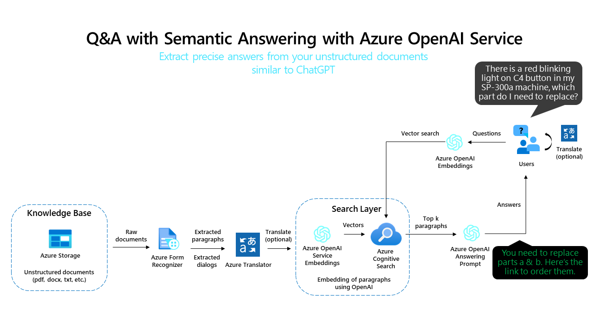
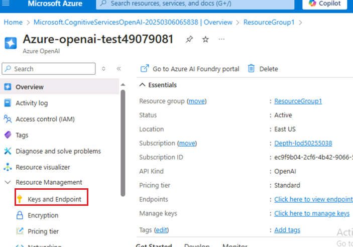
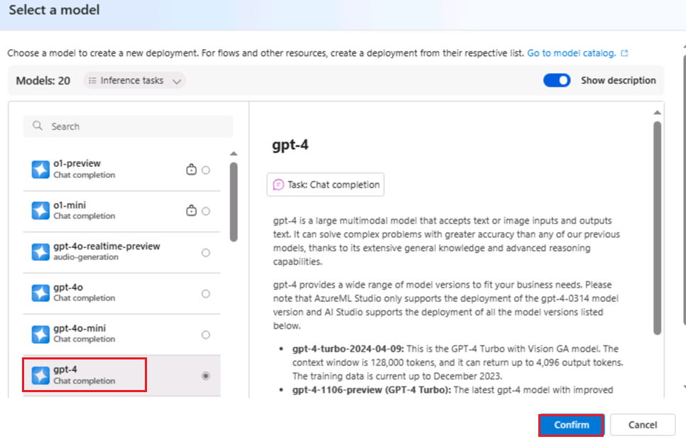
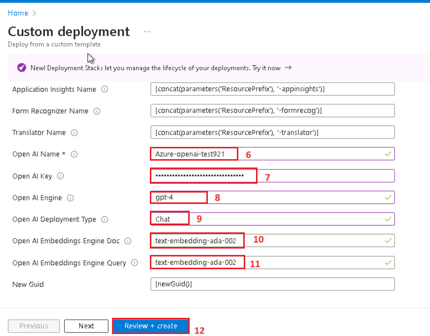
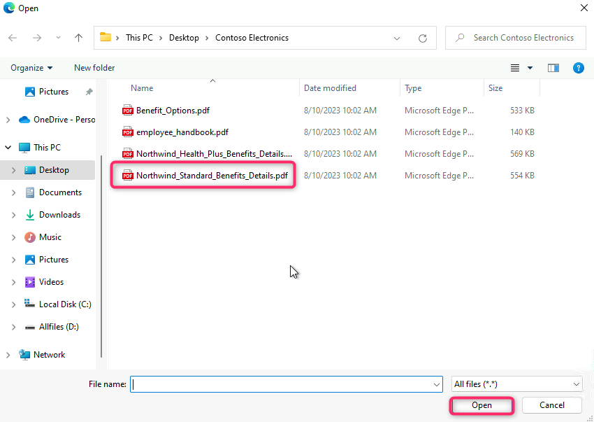
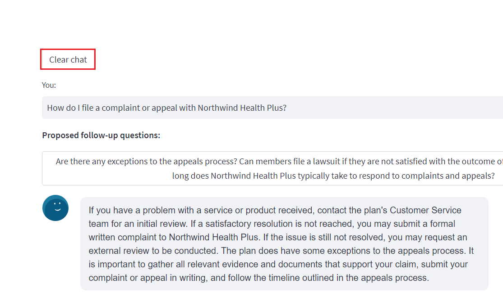

**Laboratorio 07: Implementación de preguntas y respuestas utilizando
respuestas semánticas**

**Introducción**

Una aplicación web simple para búsqueda de documentos con OpenAI. Este
repositorio utiliza Azure OpenAI Service para crear vectores de
embeddings a partir de documentos. Para responder a la pregunta de un
usuario, recupera el documento más relevante y luego usa GPT-3 para
extraer la respuesta correspondiente.

**Objetivos**

- Implementar modelos de chat y embeddings en Azure AI Studio.

- Utilizar una plantilla personalizada para implementar los recursos
  necesarios, como App Service, Search Service y Form Recognizer.

- Implementar la aplicación web aoaichatsearch-site y realizar búsqueda
  de documentos habilitada por Azure OpenAI, resumen de texto y
  extracción de datos de conversación.

- Eliminar los recursos y modelos implementados.

## **Tarea 1: Cree un recurso de Azure OpenAI**

1.  Desde la página de inicio del portal de Azure, haga clic en el
    **menú del portal de Azure** representado por tres barras
    horizontales en el lado izquierdo de la barra de comandos de
    Microsoft Azure, como se muestra en la imagen a continuación.

> 

2.  Navegue y haga clic en **+ Create a resource**.

> 

3.  En la página **Create a resource**, en la barra de búsqueda **Search
    services and marketplace**, escriba **Azure OpenAI** y, a
    continuación, pulse la tecla **Enter**.

> 
>
> 4.En la página **Marketplace**, navegue hasta la sección **Azure
> OpenAI**, haga clic en el desplegable del botón **Create** y, a
> continuación, seleccione **Azure OpenAI**, como se muestra en la
> imagen. (En caso de que ya haya hecho clic en el mosaico **Azure
> OpenAI**, haga clic en el botón **Create** en la página **Azure
> OpenAI**).
>
> 

4.  En la ventana **Create Azure OpenAI**, bajo la pestaña **Basics**,
    ingrese los siguientes detalles y haga clic en el botón **Next.**

[TABLE]

> 

5.  En la pestaña **Network**, deje todos los botones de opción en el
    estado predeterminado y haga clic en el botón **Next.**

> 

6.  En la pestaña **Tags**, deje todos los campos en el estado por
    defecto, y haga clic en el botón **Next.**

> 

7.  En la pestaña **Review + Submit**, una vez superada la validación,
    haga clic en el botón **Create.**

> 

8.  Espere a que la implementación se complete. Este proceso tomará
    aproximadamente de 2 a 3 minutos.

9.  En la ventana **Microsoft.CognitiveServicesOpenAI**, una vez
    completada la implementación, haga clic en el botón **Go to
    resource.**

> 

10. En la ventana **Azure-open-testXX | Model deployments**, vaya a la
    sección **Resource Management** y haga clic en **Keys and
    Endpoints**.

11. En la página **Keys and Endpoints**, copie los valores de **KEY1,
    KEY 2** y **Endpoint** y péguelos en un bloc de notas como se
    muestra en la siguiente imagen, luego **guarde** el bloc de notas
    para utilizar la información en el próximo laboratorio.

## **Tarea 2: Implemente el modelo de Chat y el modelo de Embedding**

1.  En la página **Azure-openai-testXX**, haga clic en **Overview** en
    el menú de navegación de la izquierda, desplácese hacia abajo y haga
    clic en el botón **Explore Azure AI Foundry portal** como se muestra
    en la siguiente imagen.

> 

2.  Espere a que se inicie el estudio Azure OpenAI.

> 

3.  En la página de inicio de **Azure AI Foundry |Azure OpenAI Studio,**
    seleccione **Deployments** en el menú de navegación de la izquierda

4.  En la ventana **Deployments**, implemente el modelo **+Deploy
    model** y seleccione **Deploy base model.**

> 

5.  En el cuadro de diálogo **Select a model**, navegue y seleccione
    cuidadosamente **gpt-4**, a continuación, haga clic en el botón
    **Confirm.**

6.  En el campo **Model version** seleccione **0125-Preview**, en el
    campo **Deployment type** elija la opción **Standard**. En el campo
    **Deployment name**, ingrese **gpt-4**, y haga clic en el botón
    **Create.**

> 

7.  En la ventana **Deployments**, seleccione **+Deploy model** y luego
    **Deploy base model.**

> 

8.  En el cuadro de diálogo **Select a model**, navegue y seleccione
    cuidadosamente **text-embedding-ada-002** y, a continuación, haga
    clic en el botón **Confirm**.

9.  En el cuadro de diálogo **Deploy model**, en **Deployment name**
    ingrese +++**text-embedding-ada-002**+++, seleccione **Standard**
    como **Deployment type** y haga clic en el botón **Deploy.**

## **Tarea 3: Implementación en Azure (WebApp + procesamiento por lotes) con Azure Cognitive Search**

1.  Abra su navegador Edge, vaya a la barra de direcciones y escriba o
    pegue la siguiente URL:
    <https://portal.azure.com/#create/Microsoft.Template/uri/https%3A%2F%2Fraw.githubusercontent.com%2Fruoccofabrizio%2Fazure-open-ai-embeddings-qna%2Fmain%2Finfrastructure%2Fdeployment_ACS.json>
    y, a continuación, haga clic en el botón **Enter**.

2.  En la ventana de **Custom deployment**, en la pestaña **Basics**,
    ingrese los detalles para implementar la plantilla personalizada y
    haga clic en **Review + create**.

[TABLE]

3.  En la pestaña **Review + create**, una vez superada la validación,
    haga clic en el botón **Create.**

4.  Espere a que finalice la implementación. La instalación tardará
    entre 15 y 17 minutos.

> 

5.  Haga clic en el botón **Go to resource group.**

> 

## **Tarea 4: Búsqueda de documentos habilitada con Azure OpenAI a través de una aplicación web**

1.  En la ventana del grupo de recursos **aoaiXXX-RG**, en la pestaña
    **Resources**, desplácese hasta **App Service -
    aoaaichatsearch-site** y haga clic en él.

2.  En la página **aoaichatsearch-site Web App Overview**, vaya a la
    barra de comandos y haga clic en **Browse** para acceder a la
    aplicación web.

3.  Espere a que la implementación de la aplicación web finalice, lo que
    tomará aproximadamente entre **10** y **15** minutos.

4.  En la página de inicio de la aplicación web, haga clic en el botón
    **Check deployments** en Microsoft para comprobar el estado de las
    implementaciones.

5.  La verificación del estado de la implementación puede tardar
    aproximadamente entre 5 y 6 minutos.

6.  En la página de inicio de la Web App, navegue y haga clic en **Add
    Document** en el panel izquierdo para añadir los datos.

7.  En el panel **Add Document**, haga clic en el botón **Browse files**
    para cargar los documentos que deben añadirse a la base de
    conocimientos.

8.  Navegue hasta la ubicación **C:\Labfiles\Contoso Electronics** en la
    máquina virtual, seleccione **Benefit_Options.pdf** y luego haga
    clic en el botón **Open**.

9.  Haga clic nuevamente en **Browse files**, navegue hasta la ubicación
    **C:\Labfiles\Contoso Electronics** en la máquina virtual,
    seleccione **employee_handbook.pdf** y luego haga clic en el botón
    **Open**.

10. Del mismo modo, añada **Northwind_Health_Plus_Benefits_Details.pdf**
    y **Northwind_Standard_Benefits_Details.pdf**

11. Los datos cargados se añadirán a la base de conocimientos y tardarán
    aproximadamente entre 5 y 7 minutos.

12. Haga clic en **Document Management** para comprobar si los archivos
    se han cargado correctamente o no.

13. Haga clic en **Index Management** para verificar los archivos, las
    claves y el origen.

14. A continuación, haga clic en **Chat.**

15. En la sección **Chat session**, ingrese el siguiente prompt, pulse
    el botón **Enter** y verifique la respuesta.

**You**: **what is the employee's portion of the healthcare cost from
each paycheck in Contoso Electronics**

16. En la sección **Chat session**, haga clic en el botón **Clear
    chat.**

17. En la sección **Chat session**, ingrese el siguiente prompt, pulse
    la tecla **Enter** y verifique la respuesta.

**You**: **How do I file a complaint or appeal with Northwind Health
Plus?**

18. En la sección **Chat session**, haga clic en el botón **Clear
    chat.**

19. En **Chat session**, ingrese el siguiente prompt, pulse la tecla
    **Enter** y verifique la respuesta.

**You**: **Does my plan covers my eye exams?**

20. Haga clic en **Utils-Document Summary** en la parte izquierda.

21. En la sección **Summarization,** seleccione el botón de opción
    **Basic Summary.**

22. En la ventana **Summarization**, en la sección **Enter some text to
    summarize**, reemplace el texto actual por el siguiente y luego haga
    clic en el botón **Summarize.**

It’s been six months since we reinvented search with [the new AI-powered
Bing and
Edge](https://blogs.microsoft.com/blog/2023/02/07/reinventing-search-with-a-new-ai-powered-microsoft-bing-and-edge-your-copilot-for-the-web/).
In that short time, you’ve engaged in so many unique and creative ways;
to date we’ve seen over 1 billion chats and over 750 million images fill
the world of Bing! We’ve also seen nine consecutive quarters of growth
on Edge, meaning we’re more able than ever to bring our best-in-class AI
experiences to users across the web.

23. Revise el resumen del texto ingresado.

24. Después de revisar el resultado del resumen, haga clic en el botón
    **Clear summary.**

25. Desplácese hacia arriba y seleccione la opción **Bullet Points**. En
    la sección **Enter some text to summarize**, reemplace el texto
    actual en el cuadro de mensaje con el siguiente y luego haga clic en
    el botón **Summarize**.

Microsoft has made its Azure OpenAI Service generally available,
bringing the enterprise generative AI tools out of its invite-only
program. Now any customers who meet Microsoft’s standards can access the
professional versions of OpenAI’s large language model GPT-3.5 and the
related text-to-image tool DALL-E 2, computer programming assistant
Codex, and the popular ChatGPT chatbot interface for the LLM.

Microsoft launched the Azure OpenAI Service with an eye toward offering
businesses a way to develop apps without coding, write reports, and put
together marketing content. The scope has grown since then to encompass
new facets of the OpenAI’s models, including chat and visuals. Those
interested in the tools have to explain how they will use the AI tools
and agree to Microsoft’s ethical guidelines in their application for
access. The decision to widen the Azure OpenAI Service’s availability
arrives in tandem with Microsoft’s plans to integrate ChatGPT and DALL-E
into its Office suite, Bing search engine, and other consumer products.
Azure OpenAI Service followed earlier experiments to integrate GPT-3
into Microsoft projects like the low-code Power Apps programming tool
and the GitHub Copilot programming assistant.

26. Verá los resultados resumidos en forma de viñetas.

27. Haga clic en **Utils-Conversation Data Extraction** en el lado
    izquierdo.

28. En el panel de **Conversation data extraction**, haga clic en
    **Execute tasks** y vea la respuesta en **OpenAI result.**

29. Revise los datos extraídos de la conversación entre el agente y el
    usuario.

## Tarea 5: Elimine los recursos y modelos implementados

1.  Para eliminar los recursos implementados, vaya a la **página de
    inicio del portal Azure**, haga clic en **Resource groups**.

> 

2.  En la página **Resource groups**, seleccione su grupo de recursos.

> 

3.  En la página de inicio del **grupo de recursos**, seleccione todos
    los recursos y haga clic en **delete.**

4.  En el panel **Delete Resources** que aparece a la derecha,
    desplácese hasta el campo **Enter “delete” to confirm deletion** y,
    a continuación, haga clic en el botón **Delete**.

5.  En el cuadro de diálogo de **Delete confirmation**, haga clic en el
    botón **Delete**.

> 

6.  Haga clic en el icono de la campana para ver la notificación.

**Resumen**

Ha implementado el modelo de chat GPT-4 y el modelo de embedding
text-embedding-ada-002 en Azure AI Studio, además de los recursos
necesarios mediante una plantilla personalizada. Ha cargado documentos
no estructurados en la aplicación web aoaichatsearch-site y extraído
información precisa en una sesión de chat. También ha generado resúmenes
en formato básico y en puntos clave a partir de textos de muestra, y ha
extraído datos de una conversación.  
Al finalizar el laboratorio, ha eliminado los recursos y modelos para
una gestión eficiente de los recursos de Azure OpenAI.

**Nota importante: No elimine el grupo de recursos, ya que esto
impediría continuar con el siguiente laboratorio o crear uno nuevo.
Tampoco elimine el servicio Azure OpenAI (Azure-openai-testXX), ya que
se utilizará en todos los laboratorios.**
