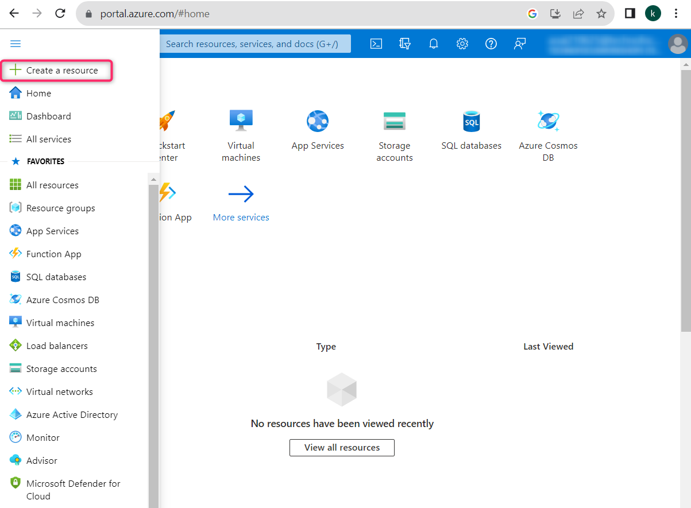
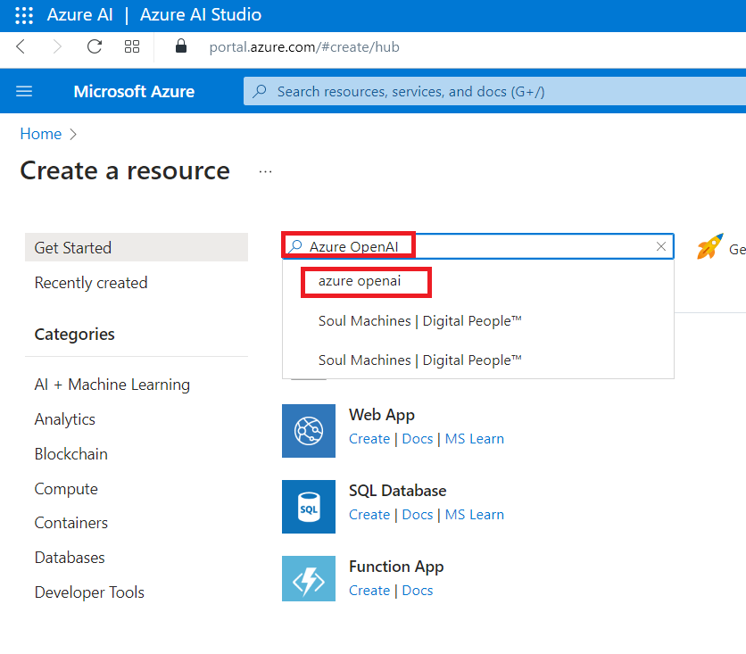
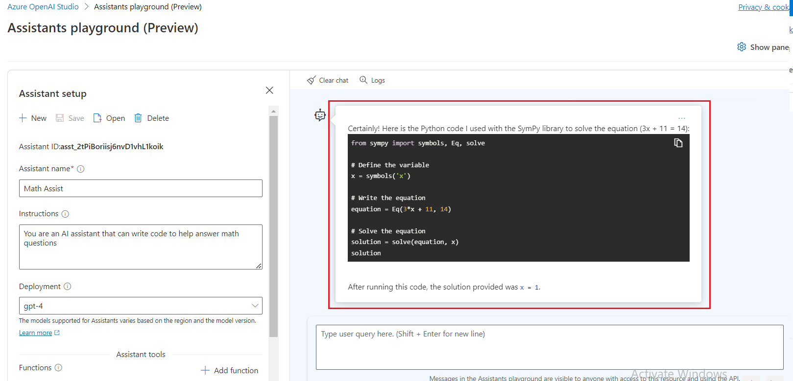
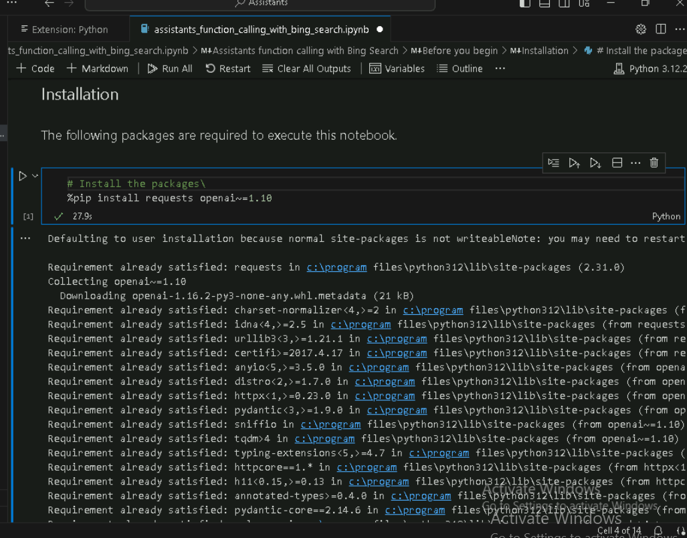
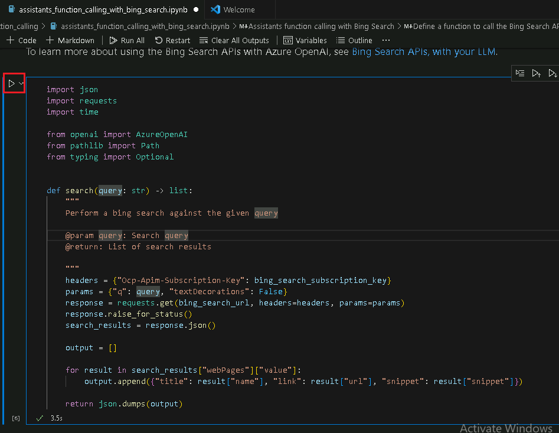
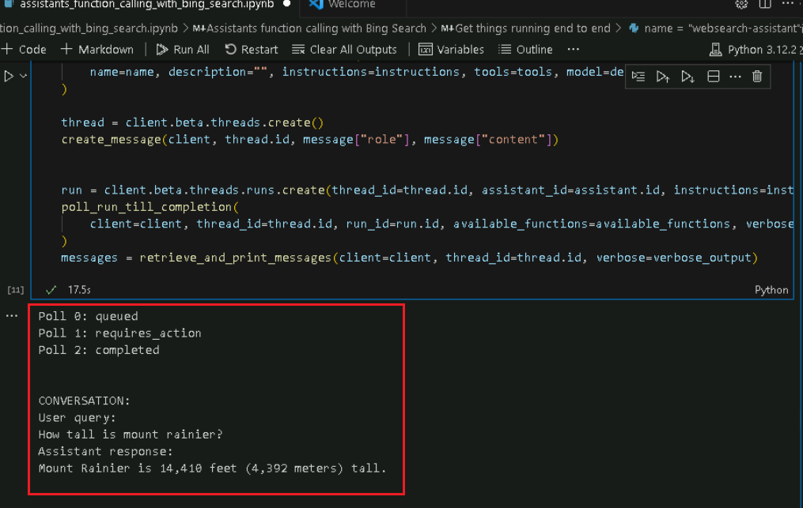
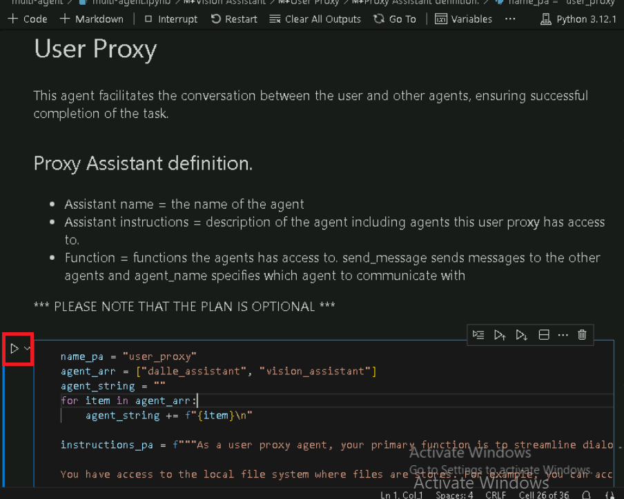

# **Introducción**

Azure OpenAI Assistants (Preview) le permite crear asistentes de IA
personalizados según sus necesidades mediante instrucciones
personalizadas y potenciados por herramientas avanzadas como el
intérprete de código y funciones personalizadas.

Este laboratorio se centra en configurar y utilizar los servicios de
Azure OpenAI junto con la integración de Bing Search para construir
asistentes de IA sofisticados y frameworks de agentes múltiples.
Desplegará modelos de IA, explorará las funcionalidades de los
asistentes e implementará interacciones entre múltiples agentes para el
procesamiento de tareas complejas.

**Objetivos**

> • Crear un recurso de servicio de búsqueda de Bing en Azure.
>
> • Implementar recursos de Azure OpenAI y configurarlos.
>
> • Implementar modelos específicos de Azure OpenAI como GPT-4, GPT-4
> Vision y DALL-E-3.
>
> • Explorar y prototipar asistentes de IA usando Azure OpenAI Studio.
>
> • Implementar llamadas a funciones con las API de Bing Search para
> mejorar las capacidades del asistente.
>
> • Construir un framework multimodal de agentes múltiples utilizando la
> API de Azure Assistant para tareas colaborativas de IA.
>
> • Eliminar los recursos y modelos implementados.

## **Tarea 1: Cree un recurso de servicio de búsqueda de Bing**

1.  Haga clic en el **menú del portal** y seleccione **+ Create a
    resource**.

2.  En la barra de búsqueda **Create a resource**, escriba **Bing Search
    v7** y haga clic en el botón que aparece **bing search v7.**

3.  Haga clic en la sección **Bing Search v7.**

4.  En la página **Create a search service**, proporcione la siguiente
    información y haga clic en el botón **Review+create.**

[TABLE]

5.  Una vez superada la validación, haga clic en el botón **Create.**

6.  Una vez finalizada la implementación, haga clic en el botón **Go to
    resource.**

7.  En la ventana **bingsearchaoaiXX**, vaya a la sección **Resource
    management** y haga clic en **Keys and Endpoint**.

8.  En la página **Keys and Endpoints**, copie **KEY1** (*puede utilizar
    KEY1 o KEY2*) y el **Endpoint**. Luego, péguelo en un bloc de notas
    (como se muestra en la imagen) y **guarde** el archivo para utilizar
    esta información en las próximas tareas.

## **Tarea 2: Cree un recurso de Azure OpenAI**

1.  En la página de inicio del portal de Azure, haga clic en el **menú
    del portal**, representado por tres barras horizontales ubicadas en
    el lado izquierdo de la barra de comandos de Microsoft Azure, como
    se muestra en la siguiente imagen.

> 

2.  Navegue y haga clic en **+ Create a resource**.

> 

3.  En la página **Create a resource**, en la barra de búsqueda **Search
    services and marketplace**, escriba **Azure OpenAI** y, a
    continuación, pulse la tecla **Enter**.

> 

4.  En la página **Marketplace**, navegue hasta la sección **Azure
    OpenAI**, haga clic en el desplegable del botón **Create** y, a
    continuación, seleccione **Azure OpenAI** como se muestra en la
    imagen. (En caso de que ya haya hecho clic en el mosaico **Azure
    OpenAI**, a continuación, haga clic en el botón **Create** en la
    página **Azure OpenAI**).

> 

[TABLE]

5.  En la ventana **Create Azure OpenAI**, en la pestaña **Basics**,
    ingrese los siguientes datos y haga clic en el botón **Next**.

> 

6.  En la pestaña **Network**, deje todos los botones de opción en su
    estado predeterminado y haga clic en el botón **Next.**

> 

7.  En la pestaña **Tags**, deje todos los botones de opción en su
    estado predeterminado, y haga clic en el botón **Next.**

> 

8.  En la pestaña **Review+submit**, una vez superada la validación,
    haga clic en el botón **Create.**

> 

9.  Espere a que se complete la implementación, lo que tomará
    aproximadamente 2-3 minutos.

10. En la ventana de **Microsoft.CognitiveServicesOpenAI**, una vez
    finalizada la implementación, haga clic en el botón **Go to
    resource.**

> 

11. Haga clic en **Keys and Endpoints** en el menú de navegación
    izquierdo. Luego, copie el valor del Endpoint en un bloc de notas
    para **AzureAI_ENDPOINT** y la clave en una variable **AzureAIKey.**

## Tarea 3: Implementación de modelos de Azure OpenAI

1.  En la ventana **AzureOpenAI-AssistantsXX**, haga clic en
    **Overview** en el menú de navegación de la izquierda, haga clic en
    el botón **Explore Azure AI Foundry portal** para abrir **Azure AI
    Foundry Studio** en un nuevo navegador.

> 

2.  En la ventana **Azure AI Foundary | Azure OpenAI Service**,
    seleccione **Deployment** en el menú de navegación de la izquierda.

> 

12. En la ventana **Deployments**, implemente el modelo **+Deploy
    model** y seleccione **Deploy base model.**

> 

13. En el cuadro de diálogo **Select a model**, navegue y seleccione
    cuidadosamente **gpt-4**, después haga clic en el botón **Confirm**.

> 

3.  En el cuadro de diálogo **Deploy model dialog**, ingrese los
    siguientes datos y haga clic en el botón **Create.**

- Seleccione el modelo: **gpt-4**

- Versión del modelo**: 1106-Preview**

- Nombre de la implementación: Ingrese **gpt-4**

- Seleccione **Advanced options** y luego **Standard** como tipo de
  implementación.

> 

4.  En la página **Deployments**, haga clic en +**Create new
    deployment.**

5.  En la ventana **Deployments**, implemente el modelo **+Deploy
    model** y seleccione **Deploy base model.** 

&nbsp;

14. En el cuadro de diálogo **Select a model**, navegue y seleccione
    cuidadosamente **gpt-4**, a continuación, haga clic en el botón
    **Confirm.**

> 

6.  En el cuadro de diálogo **Deploy model**, en **Select a model** haga
    clic en el desplegable y seleccione el campo **gpt-4**. En **Model
    version** seleccione **vision-preview** y en **Deployment name**
    ingrese +++ **gpt-4-vision** +++. Haga clic en el botón **Create.**

> 
>
> 

7.  En la ventana **Deployments**, implemente el modelo **+Deploy
    model** y seleccione **Deploy base model.** 

&nbsp;

15. En el cuadro de diálogo **Select a model**, navegue y seleccione
    cuidadosamente **dall-e-3**, después haga clic en el botón
    **Confirm.**

> 

8.  En el cuadro de diálogo **Deploy model**, en **Select a model** haga
    clic en el desplegable para seleccionar el campo **dall-e-3**. En
    **Model version** seleccione **Auto-update to default** y en
    **Deployment name** ingrese !!**dall-e-3**!!. Haga clic en el botón
    **Create.**

> 
>
> 

## Tarea 4: Explore el entorno de pruebas del asistente

1.  En la página de inicio de Azure AI Foundry |Azure OpenAI Service, en
    la sección **Playgrounds**, haga clic en el botón **Assistants
    playground.**

2.  En el panel **Assistants playground**, seleccione **+Create an
    assistant.**

3.  Assistants playground le permite explorar, crear prototipos y probar
    asistentes de IA sin necesidad de ejecutar ningún código. Desde esta
    página, puede iterar rápidamente y experimentar con nuevas ideas.

4.  En el panel de configuración del Asistente, ingrese los siguientes
    datos

- Nombre del asistente: +++**Math Assist+++**

- Instrucciones: Ingrese las siguientes instrucciones +++**You are an AI
  assistant that can write code to help answer math questions+++**

- Implementación: **gpt-4**

- Habilite el toggle **code interpreter**

> 
>
> 

5.  En el panel de configuración del asistente, seleccione la opción
    **Select assistant.**

6.  En la pestaña seleccionar un asistente, elija la opción **Math
    Assist** y haga clic en el botón **Select.**

7.  Ingrese una pregunta para que el asistente responda: +++**I need to
    solve the equation 3x + 11 = 14. Can you help me?**+++

8.  Seleccione el botón **Run**.

> 

Si bien podemos ver que la respuesta es correcta, para confirmar que el
modelo utilizó el intérprete de código para llegar a esta respuesta y
que el código que escribió es válido en lugar de simplemente repetir una
respuesta de los datos de entrenamiento del modelo, haremos otra
pregunta.

9.  Ingrese la pregunta de seguimiento: +++**Show me the code you ran to
    get this solution.+++** y haga clic en el botones **Add** y **run.**

## También puede consultar los registros en el panel derecho para verificar que se utilizó el intérprete de código y validar el código ejecutado para generar la respuesta. Es importante recordar que, aunque el intérprete de código permite al modelo resolver preguntas matemáticas complejas convirtiéndolas en código y ejecutándolas en un entorno aislado de Python, sigue siendo necesario validar la respuesta para confirmar que la interpretación de la pregunta en código es correcta.

## Tarea 5: Llamada de funciones de asistentes con Bing Search

En este notebook, se mostrará cómo usar las API de Bing Search y la
llamada de funciones para fundamentar los modelos de Azure OpenAI en
datos de la web. Esta es una excelente manera de proporcionar al modelo
acceso a datos actualizados de la web.

Este ejemplo será útil para desarrolladores y científicos de datos que
deseen aprender sobre las capacidades de llamada de funciones y la
fundamentación basada en búsqueda.

1.  En el cuadro de búsqueda de Windows, escriba Visual Studio y luego
    haga clic en **Visual Studio Code**.

> 

2.  En el editor **Visual Studio Code**, haga clic en **File**, luego
    navegue y haga clic en **Open Folder.**

> 

3.  Navegue y seleccione la carpeta **Assistants** de **C:\LabFiles** y
    haga clic en el botón **Select Folder.**

4.  Si aparece un cuadro de diálogo - **Do you trust the authors of the
    files in this folder?**,, haga clic en **Yes, I trust the author**.

5.  En Visual Studio Code, implemente **ASSISTANTS**, bajo
    **function_calling**, navegue y haga clic en el notebook
    **assistants_function_calling_with_bing_search.ipynb.**

6.  En la página principal del editor de Visual Studio Code, desplácese
    hasta el encabezado **install requirements** y ejecute la primera
    celda. Si se le solicita seleccionar el entorno, elija **Python
    Environments**, como se muestra en la imagen**.**

7.  Si se le pide que seleccione la ruta, seleccione la ruta de **Python
    versión 3.12.2 (o posterior)** como se muestra en la imagen.

8.  Actualice los parámetros y reemplace **Azure OpenAI Endpoint, Azure
    OpenAI Key** (los valores guardados en su bloc de notas en la
    **Tarea 2**) y **Bing Search Subscription Key** con los valores
    guardados en su bloc de notas en la **Tarea 1.**

9.  Defina una función para llamar a las **Bing Search APIs**. Luego,
    seleccione la tercera y cuarta celda y ejecútelas haciendo clic en
    **start icon**.

10. Para ejecutar el proceso de principio a fin, seleccione las celdas
    quinta, sexta, séptima y octava. Luego, ejecútelas haciendo clic en
    **start icon**.

## **Tarea 6: Cree un framework multimodal de múltiples agentes con Azure Assistant API**

Este repositorio lo guiará a través del patrón de creación de un sistema
de múltiples agentes utilizando Azure OpenAI Assistant API.

El ejemplo proporcionado en este notebook ayuda a demostrar cómo
construir un marco de múltiples agentes con Azure Assistant API y sirve
como una guía integral para desarrolladores que buscan aprovechar las
capacidades de múltiples agentes de IA trabajando en conjunto.

El objetivo principal es mostrar cómo los agentes pueden comunicarse y
colaborar para procesar tareas complejas, como la generación y mejora de
imágenes a través de múltiples iteraciones basadas en la entrada del
usuario. Esto es especialmente relevante para desarrolladores y
entusiastas de la tecnología interesados en explorar los avances de la
IA generativa y los sistemas de múltiples agentes.

Antes de comenzar, se recomienda tener una comprensión básica de la IA y
un interés en cómo los agentes pueden trabajar juntos para mejorar las
funcionalidades de la IA. Aunque el artículo no profundiza en
programación, es útil contar con conocimientos generales sobre el
funcionamiento de las API y el papel de la IA en sistemas automatizados
para comprender los conceptos presentados.

Este ejemplo es una invitación para innovadores y desarrolladores que
deseen experimentar con sistemas avanzados de IA y, potencialmente,
integrarlos en diversas soluciones industriales.

1.  En Visual Studio Code, en **multi-agent**, navegue y haga clic en
    archivo **.env.**

2.  En el archivo **.env**, reemplace **Azure OpenAI Endpoint**, **Azure
    OpenAI Key** (los valores guardados en su bloc de notas en la
    **Tarea 2**), el nombre de implementación de **GPT-4**, el nombre de
    implementación de **DALL·E 3** y el nombre de implementación de
    **GPT-4 Vision** con los valores guardados en su bloc de notas en la
    **Tarea 3.**

3.  Haga clic en **File** y luego en **Save.**

4.  En **Visual Studio Code,** en **multi-agent,** navegue y haga clic
    en el notebook **multi-agent.ipynb.**

> 

5.  En la página principal del editor Visual Studio Code, desplácese
    hasta el encabezado **install requirements** y ejecute la primera
    celda. Si se le pide que seleccione el entorno, seleccione **Python
    Environments** como se muestra en la imagen.

6.  Si se le pide que seleccione la ruta, seleccione la ruta de **Python
    versión 3.12.2(o posterior)** como se muestra en la imagen.

> 

7.  Seleccione la segunda celda. A continuación, ejecute la celda
    haciendo clic en **Start icon**.

8.  Para generar imágenes mediante un prompt con el modelo DALL·E 3, la
    respuesta se almacenará como un archivo .jpg en el directorio local
    del usuario. Seleccione la tercera celda y luego ejecútela haciendo
    clic en el botón **start icon**.

9.  Inicialice el agente utilizando la definición descrita
    anteriormente. Seleccione la cuarta celda y luego ejecútela haciendo
    clic en **Start icon**.

10. La función generadora de imágenes llama al generador de imágenes
    Dalle-3 con el prompt proporcionado. Seleccione la quinta celda y
    luego ejecútela haciendo clic en **Start icon**.

11. El agente Vision Assistant es responsable de analizar imágenes. La
    respuesta es un nuevo prompt que será utilizado por el agente
    creador de imágenes. Seleccione la sexta celda y luego ejecútela
    haciendo clic en **Start icon**.

12. Inicialice el agente con la definición descrita anteriormente.
    Seleccione la séptima celda y luego ejecútela haciendo clic en
    **Start icon**.

13. La función del asistente Vision llama al análisis de imagen de GPT-4
    Vision dada una imagen. Ejecute la celda haciendo en **Start icon**.

14. Este agente facilita la conversación entre el usuario y otros
    agentes, asegurando la finalización con éxito de la tarea, ejecute
    la celda haciendo en el botón **Start icon**.

15. Inicialice el agente con la definición descrita anteriormente,
    ejecute la celda haciendo clic en el botón **Start icon**.

16. Esta función llama a la API de Assistant para generar un hilo
    principal de comunicación entre los agentes listados en
    agents_threads, ejecute la celda haciendo clic en **Start icon**.

17. Este agente facilita la conversación entre el usuario y otros
    agentes, asegurando la finalización con éxito de la tarea. Ejecute
    la celda haciendo clic en **Start icon**.

18. Ejemplo de preguntas, ingrese +++Generate an image of a boat
    drifting in the water and analyze it and enhance the image+++.
    Ejecute la celda haciendo clic en **Start icon.**

## Tarea 7: Elimine los recursos

1.  Para eliminar la cuenta de almacenamiento, vaya a la página de
    inicio del **portal Azure**, haga clic en **Resource groups.**

> 

2.  Haga clic en el grupo de recursos.

> 

3.  En la página de inicio del **grupo de recursos**, seleccione los
    recursos y haga clic en **Delete.**

4.  En el panel **Delete Resources** que aparece a la derecha,
    desplácese hasta el campo **Enter “Delete” to confirm deletion** y,
    a continuación, haga clic en el botón **Delete**.

5.  En el cuadro de diálogo **Delete confirmation**, haga clic en el
    botón **Delete.**

> 

6.  Haga clic en el icono de la campana, verá la notificación –**Deleted
    resource group AOAI-RG89.**

**Resumen**

Este laboratorio proporcionó una exploración práctica de capacidades
avanzadas de IA utilizando Azure OpenAI e integración con Bing Search.
Comenzó con la configuración de recursos esenciales en Azure y la
implementación de modelos de IA como GPT-4 y DALL-E-3. Luego, utilizó
Azure OpenAI Studio para crear y probar asistentes de IA capaces de
manejar tareas complejas como la resolución de problemas matemáticos y
la generación de imágenes. Integró Bing Search para obtener datos en
tiempo real y fundamentar las respuestas de la IA. Además, aprendió a
construir un framework de trabajo de múltiples agentes, demostrando cómo
diferentes agentes de IA pueden colaborar para mejorar el desempeño en
tareas. Al finalizar, adquirió experiencia práctica en la
implementación, prueba y optimización de soluciones impulsadas por IA,
preparándose para aprovechar estas tecnologías en diversas aplicaciones
del mundo real.
