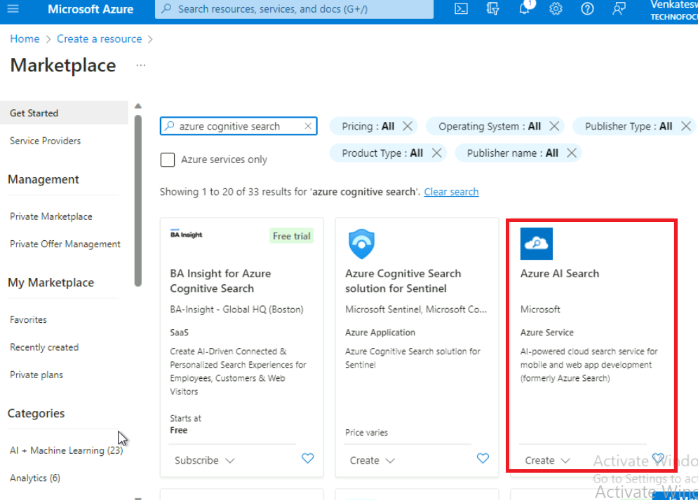
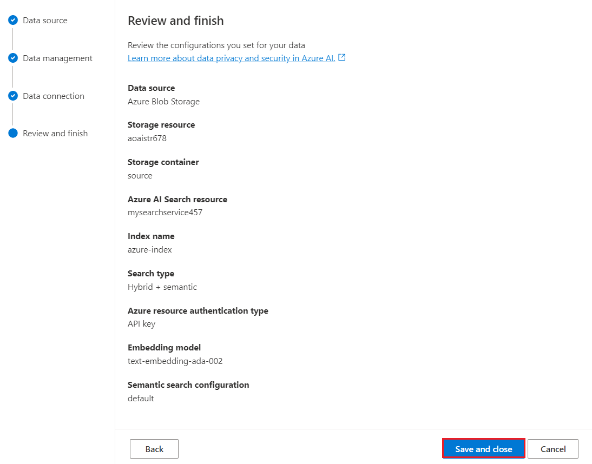
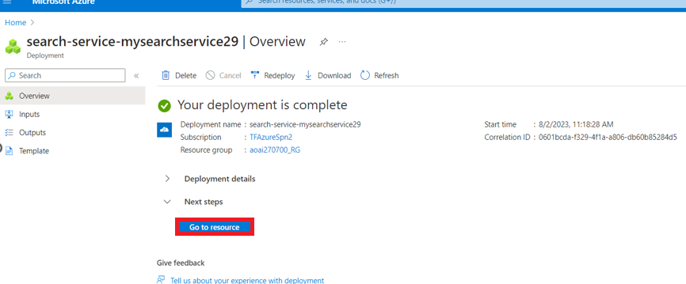
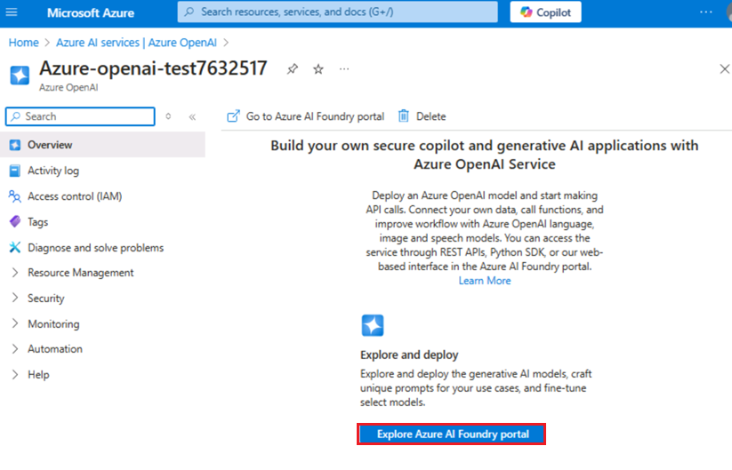
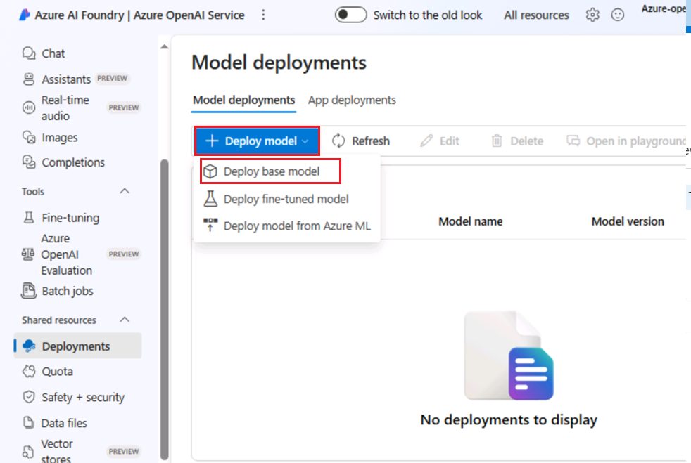
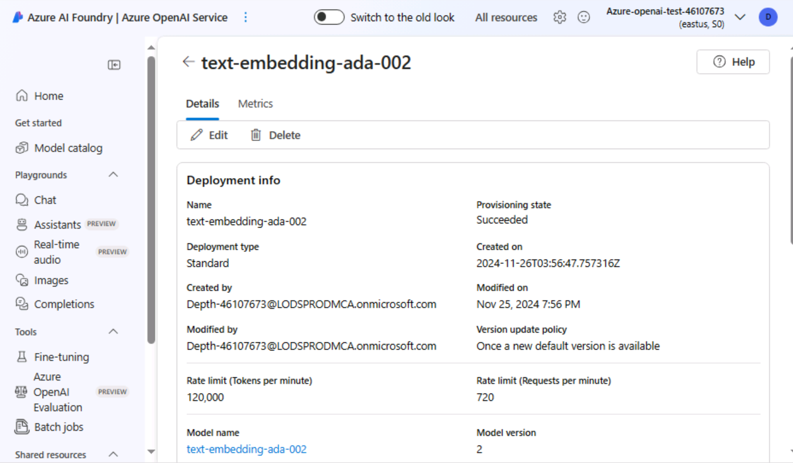
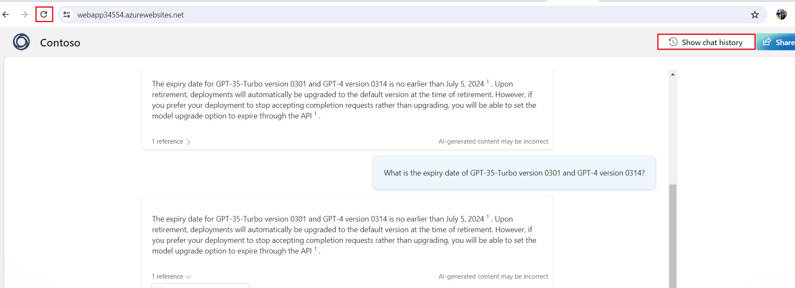
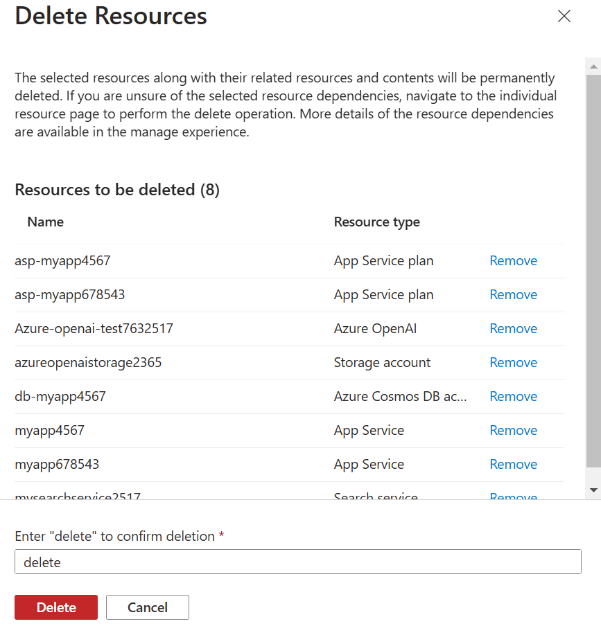

# Caso de uso 10: Crear una aplicación web y un bot de Power Virtual Agent con datos personalizados utilizando Azure OpenAI Service

**Introducción:**

Azure OpenAI en sus datos funciona con los potentes modelos de lenguaje
ChatGPT (gpt-35-turbo) y GPT-4 de OpenAI, lo que les permite
proporcionar respuestas basadas en sus datos. Puede acceder a Azure
OpenAI en sus datos utilizando una API REST o la interfaz basada en web
en Azure OpenAI Studio para crear una solución que se conecte a sus
datos y permita una experiencia de chat mejorada.

Una de las características clave de Azure OpenAI en sus datos es su
capacidad para recuperar y utilizar datos de una manera que mejora la
salida del modelo. Azure OpenAI en sus datos, junto con Azure Cognitive
Search, determina qué datos recuperar de la fuente de datos designada
según la entrada del usuario y el historial de la conversación
proporcionado. Estos datos luego se aumentan y se vuelven a enviar como
un prompt al modelo de OpenAI, con la información recuperada siendo
añadida al prompt original. Aunque los datos recuperados se añaden al
prompt, la entrada resultante sigue siendo procesada por el modelo como
cualquier otro prompt. Una vez que se han recuperado los datos y se ha
enviado el prompt al modelo, este utiliza esta información para generar
una respuesta.

**Objetivos**

- Crear una cuenta de almacenamiento, un contenedor y un servicio de
  búsqueda cognitiva de Azure en el portal de Azure.

- Implementar los modelos gpt-3-turbo y Embedded en Azure AI Studio y
  agregar datos en Chat Playground.

- Probar la configuración del asistente en Chat Playground enviando
  consultas en la sesión de chat.

- Iniciar un Copilot e iniciar una conversación con el bot.

- Iniciar una nueva aplicación y comenzar una conversación con la
  aplicación Copilot.

- Eliminar el modelo gpt-3-turbo y el modelo embedded, la cuenta de
  almacenamiento de Azure, el servicio de búsqueda cognitiva y la nueva
  aplicación web.

## Ejercicio 1: Crear una cuenta de almacenamiento de Azure y un servicio de búsqueda cognitiva de Azure mediante el portal

### Tarea 1: Cree un recurso Azure OpenAI

1.  Abra su navegador, vaya a la barra de direcciones y escriba o pegue
    la siguiente
    [URL:+++https://portal.azure.com/](URL:+++https://portal.azure.com/)+++,
    después pulse la tecla **Enter.** 

2.  En la ventana de **Microsoft Azure**, utilice las **User
    Credentials** para iniciar sesión en Azure.

3.  A continuación, ingrese la contraseña y haga clic en el botón **Sign
    in**.

4.  En la ventana **Stay signed in?**, haga clic en el botón **Yes.**

5.  En la página de inicio del portal Azure, haga clic en el **Azure
    portal menu**, representado por tres barras horizontales en la parte
    izquierda de la barra de comandos de Microsoft Azure, como se
    muestra en la siguiente imagen.

6.  Navegue y haga clic en **+ Create a resource**.

7.  En la página **Create a resource**, en la barra de búsqueda **Search
    services and marketplace**, escriba **Azure OpenAI** y, a
    continuación, pulse el botón **Enter.**

8.  En la página **Marketplace**, navegue hasta la sección **Azure
    OpenAI**, haga clic en el menú desplegable del botón **Create** y, a
    continuación, seleccione **Azure OpenAI** como se muestra en la
    imagen. (En caso de que ya haya hecho clic en el mosaico **Azure
    OpenAI**, haga clic en el botón **Create** en la página de **Azure
    OpenAI**).

9.  En la ventana **Crear Azure OpenAI**, en la pestaña **Basics**,
    ingrese los siguientes datos y haga clic en el botón **Next.**

[TABLE]

> 

10. En la pestaña **Network**, deje todos los botones de opción en
    estado predeterminado y haga clic en el botón **Next**.

11. En la pestaña **Tags**, deje todos los campos en estado
    predeterminado y haga clic en el botón **Next**.

12. En la pestaña **Review+submit**, una vez superada la validación,
    haga clic en el botón **Create.**

13. Espere a que se complete la implementación, lo que tomará
    aproximadamente 2-3 minutos.

14. En la ventana **Microsoft.CognitiveServicesOpenAI**, una vez
    finalizada la implementación, haga clic en el botón **Go to
    resource.**

### Tarea 2: Cree una cuenta de almacenamiento de Azure mediante el portal

1.  Inicie sesión en +++<https://portal.azure.com/+++>

2.  Haga clic en el **Portal Menu** y seleccione **+ Create a
    resource**.

3.  En el cuadro de búsqueda de la ventana **Create a resource**,
    escriba **Storage account** y, a continuación, haga clic en
    **storage account.**

4.  En la página de **Marketplace**, haga clic en la sección **Storage
    account**.

5.  En la ventana **Storage account**, haga clic en el botón **Create.**

6.  En la ventana **Create a storage account**, en la pestaña
    **Basics**, ingrese los siguientes datos para crear una cuenta de
    almacenamiento. A continuación, haga clic en **Review.**

[TABLE]

> 

7.  En la pestaña **Review**, haga clic en el botón **Create.**

8.  Esta nueva cuenta de Azure Storage ya está configurada para alojar
    datos para un Azure Data Lake. Haga clic en el botón **Go to
    resource**.

9.  Después de que la cuenta se haya implementado, encontrará opciones
    relacionadas con Azure Data Lake en la página de descripción
    general. En el panel de navegación izquierdo, vaya a la sección
    **Data storage** y haga clic en **Containers.**

10. En la página **azureopenaistorageXX | Containers**, haga clic
    en **+Container.**

11. En el panel **New container** que aparece a la derecha, ingrese el
    **nombre** del contenedor como +++**source**+++ y haga clic en el
    botón **Create.** 

12. En la página **azureopenaistorageXX | Containers**, seleccione el
    contenedor de origen \*\*\***source** \*\*\*.

13. En la página del contenedor **source**, haga clic en el botón
    **Upload.**

14. En el panel **Upload blob**, haga clic en **Browse for file**, vaya
    a la ubicación **C:\Labfiles** y seleccione **TF-AzureOpenAI.pdf**.
    A continuación, haga clic en el botón **Open.**

\

15. En el panel **Upload blob**, haga clic en el botón **Upload.**

16. Verá la siguiente notificación cuando la carga se haya realizado con
    éxito- **Successfully uploaded blob.**

### Tarea 3: Cree un servicio de Azure AI Search en el portal

1.  En la página **azureopenaistorageXX | Containers**, haga clic en
    **Home** para regresar a la página de inicio del portal de Azure.

2.  En la página de inicio del portal Azure, haga clic en **+ Create
    Resource**.

3.  En la barra de búsqueda **Create a resource**, escriba **Azure AI
    Search** y haga clic en la búsqueda **azure ai search.**

4.  Haga clic en la sección de **azure ai search**.

5.  En la página **Azure AI Search**, haga clic en el botón **Create.**

6.  \

7.  En la página **Create a search service**, facilite la siguiente
    información y haga clic en el botón **Review+create**.

[TABLE]

> 
>
> 

8.  Una vez superada la validación, haga clic en el botón **Create.**

9.  Una vez finalizada la implementación, haga clic en el botón **Go to
    resource.** 

10. En la página general de **mysearchserviceXX**. En el panel de
    navegación de la izquierda, en la sección de **Settings**,
    seleccione **Semantic ranker.**

11. En la pestaña **Semantic ranker**, seleccione la ficha **Standard**
    y haga clic en el botón **Select plan.**

12. Verá la siguiente notificación -**Successfully updated semantic
    ranker to free plan**

## Ejercicio 2: Agregar sus datos usando Azure OpenAI Studio

### Tarea 1: Implemente gpt-35-turbo y modelos embedded en Azure AI Studio

1.  Vuelva al portal Azure, busque Azure OpenAI y selecciónelo.

2.  Seleccione su servicio **Azure OpenAI**.

3.  En la ventana **AzureOpenAI**, haga clic en **Overview** en el menú
    de navegación de la izquierda y, a continuación, haga clic en el
    botón **Explore Azure AI Foundry portal** para **Azure AI Foundry
    portal** en un nuevo navegador.

4.  En la página de inicio de **Azure AI Foundry |Azure OpenAI Studio**
    seleccione **Deployment** en el menú de navegación de la izquierda.

> 

5.  En la ventana **Deployments**, implemente el modelo **+Deploy
    model** y seleccione **Deploy base model**.

6.  En el cuadro de diálogo **Select a model**, navegue y seleccione
    cuidadosamente **gpt-4**. A continuación, haga clic en el botón
    **Confirm.**

> 

7.  En el cuadro de diálogo **Deploy model dialog**, ingrese los
    siguientes datos y haga clic en el botón **Create.**

    - Seleccione el modelo: **gpt-35-turbo**

    - Nombre de la implementación: Ingrese **gpt-35-turbo**

    - Seleccione la opción **Standard** como **Deployment type**

> 
>
> 
>
> 

8.  En la ventana **Deployments**, implemente el modelo **+Deploy
    model** y seleccione **Deploy base model.**

> 

9.  En el cuadro de diálogo **Select a model**, navegue y seleccione
    cuidadosamente **text-embedding-ada-002** y, a continuación, haga
    clic en el botón **Confirm**.

10. En el cuadro de diálogo **Deploy model**, en **Deployment
    name** ingrese

> +++text-embedding-ada-002+++, seleccione **Standard** como
> **Deployment type** y haga clic en el botón **Deploy**.

11. En la página de inicio de **Azure AI Foundry |Azure OpenAI
    Service**, en la sección **Playgrounds**, haga clic en el **Chat.**

12. En el panel **Chat playground**, despliegue **Add your data** y
    seleccione **+Add a data source.**

### Tarea 2: Agregue sus datos usando Azure OpenAI Studio

1.  En la página **Select or add data source**, haga clic en el menú
    desplegable bajo **Select or add data source**, luego navegue y haga
    clic en **Azure Blob Storage.**

2.  En la página **Select or add data source**, en **Select or add data
    source** ingrese los siguientes datos y seleccione **Next.**

[TABLE]

3.  Seleccione la casilla – **Add vector search to this search
    resource**.

4.  Seleccione un modelo de embedding como por ejemplo
    **text-embedding-ada-002**. A continuación, haga clic en el botón
    **Next.**

**Nota:** *En caso de que encuentre un error - **Can‘t manage CORS on
this resource. Por favor, seleccione otro recurso de almacenamiento** y,
a continuación, sincronice la hora de su máquina virtual, como se indica
en la Tarea \#1.*

5.  En la página **Add data**, en la pestaña **Data management**,
    implemente el tipo de búsqueda y seleccione **Hybrid+semantic**.

6.  Seleccione **chunk size** como **1024 (default).** A continuación,
    haga clic en **Next.**

7.  En el panel **Data connection**, seleccione **API key** y haga en el
    botón **Next.**

8.  En el panel **Review and Finish**, revise los datos ingresados y
    haga clic en el botón **Save and close.**

9.  Los datos se agregarán a su Chat Playground. Esto tomará
    aproximadamente 4-5 minutos.

### Tarea 3: Explore la función de autocompletado de texto en el Chat Playground

1.  En la sección **Chat session**, ingrese el siguiente prompt en el
    cuadro de texto **User message** y haga clic en el icono **Send.**

> CodeCopy
>
> What is Azure OpenAI Service?

2.  En la sección de **Chat session**, seleccione el enlace de
    referencias y observe los detalles del documento de búsqueda en el
    lado derecho de la página.

## Ejercicio 3: Implemente una aplicación web con datos personalizados

### Tarea 1: Implemente una aplicación web

1.  En la página de inicio de **Azure AI Foundry | Azure OpenAI
    Service**, en el panel **Chat Playground**, despliegue el menú
    **Deploy**, luego navegue y haga clic en **As Web App.**

2.  En la ventana **Deploy to a web app**, seleccione el botón de opción
    **Create a new web app** e ingrese los siguientes datos:

[TABLE]

3.  Seleccione la casilla de verificación de **Enable chat history in
    the web app**

4.  Pulse el botón **Deploy**.

**Nota:** La implementación tarda entre 5 y 10 minutos.

5.  Para verificar el estado de implementación, haga clic en
    **Deployments** y seleccione **App deployment**.

6.  Espere a que se complete la implementación. La instalación tardará
    entre **10** y **15** minutos.

7.  Haga clic en la aplicación web.

8.  Espere 10 minutos para que la configuración de autenticación se
    aplique correctamente en la aplicación.

9.  Transcurridos 10 minutos, haga clic en el botón **Refresh.**

10. En el cuadro de diálogo **Permissions requested**, haga clic en el
    botón **Accept**.

11. Ahora, la aplicación web se abrirá en un nuevo navegador.

12. En la página de la aplicación web **Azure AI**, ingrese el siguiente
    texto y haga clic en el icono **Submit**, como se muestra en la
    siguiente imagen

**CodeCopy**

How do I get access to Azure OpenAI?

 

13. Del mismo modo, pegue el siguiente texto en el cuadro de texto y
    haga clic en el icono **Send**.

**CodeCopy**

**+++What is the expiry date of GPT-35-Turbo version 0301 and GPT-4
version 0314?+++**

14. Actualice la página de la aplicación web y haga clic en el botón
    **Show chat history**.

15. Debajo del historial de chat, haga clic en **Accessing Azure
    OpenAI**.

## Ejercicio 4: Crear una aplicación Copilot con datos personalizados

### Tarea 1: Cree un chatbot con datos personalizados

1.  En **Azure AI Foundry |Azure AI Studio** **Chat playground**, en la
    opción **Add your data** seleccione la opción **Remove data
    source**.

2.  En el panel **Chat playground**, implemente **Add your data** y
    seleccione **+Add a data source.  
    **

3.  En la página **Add data**, en **Select or add data source** ingrese
    los siguientes datos y seleccione **Next.**

[TABLE]

> *  
> ***Nota:** *En caso de que encuentre un error - **Can‘t manage CORS on
> this resource**. **Seleccione otro recurso de almacenamiento** y, a
> continuación, sincronice la hora de su máquina virtual, como se indica
> en la tarea \# 1*.

4.  En la página **Add data**, en la pestaña **Data management**,
    implemente el tipo de búsqueda y seleccione **Keyword**, seleccione
    el tamaño de fragmento como **1024(default)**. Luego, haga clic en
    **Next**.

5.  En el panel **Data connection**, seleccione **API key** y haga clic
    en el botón **Next.**

6.  En **Review and Finish**, revise los datos ingresados y haga clic en
    el botón **Save and close**.

 

7.  Los datos se añadirán a su Chat Playground. Tardará aproximadamente
    4-5 minutos.

### Tarea 2: Cree un Copilot con datos personalizados desde Azure OpenAI

1.  Inicie sesión en +++<https://copilotstudio.microsoft.com/>+++
    utilizando sus credenciales de inicio de sesión de Azure.

2.  Una vez que haya iniciado sesión, en la página Welcome to Microsoft
    Copilot Studio, seleccione su país y haga clic en **Start free
    trial.**

3.  Se abre la página de inicio de Copilot.

> 

4.  Seleccione **Agents** en el panel izquierdo. A continuación, haga
    clic en **+ New agent**.

> 

5.  Seleccione **Skip to configure**.

6.  En la página Create a copilot, ingrese el **nombre** como
    +++**CopilotforAOAI**+++ y haga clic en **Create**.

7.  Haga clic en **Topics -\> System -\> Conversational boosting**.

> 

8.  Haga clic en **Edit** en **Data sources** del nodo **Create
    generative answers**. Seleccione **Classic data** en el panel
    **Properties** que se abre.

> 

9.  En **Azure OpenAI Services on your data**, haga clic en **Connection
    properties**.

> 

10. Esto añade la conexión del servicio Azure OpenAI y abre el panel de
    propiedades de la conexión.

11. En el panel **Connection Properties**, en **General -\>
    Configuration**, complete los siguientes datos:

> Deployment – +++gpt-4 +++
>
> Api version – Seleccione la última versión
>
> 

12. En la pestaña **Model data**, haga clic en **+ Add** en Data sources
    y, a continuación, agregue los siguientes datos.

Index name - +++copilot-index+++

Content data – +++content+++

13. Haga clic en **Save**.

**Tarea 3: Pruebe el Copilot**

1.  Haga clic en **Test** para abrir el panel **Test your Copilot**.

2.  Escriba +++What is Azure OpenAI?+++ y haga clic en **Send**.

3.  Recibirá la respuesta de los datos cargados en **Azure OpenAI
    resource**. Además, observe que el mensaje **Surfaced with Azure
    OpenAI** aparece debajo de la respuesta.

**Tarea 4: Elimine los recursos**

1.  Para eliminar la cuenta de almacenamiento, vaya a la página de
    inicio del portal de Azure, escriba **Resource groups** en la barra
    de búsqueda del portal de Azure, navegue y haga clic en **Resource
    groups** en **Services.**

2.  Haga clic en el grupo de recursos asignado.

3.  Seleccione cuidadosamente todos los recursos que ha creado.

4.  En la página del grupo de recursos, vaya a la barra de comandos y
    haga clic en **Delete**.

**Nota importante:** No haga clic en **Delete resource group**. Si no ve
la opción **Delete** en la barra de comandos, haga clic en la elipsis
horizontal.

5.  En el panel **Delete Resources** que aparece a la derecha, ingrese
    **delete** y haga clic en el botón **Delete.**

6.  En el cuadro de diálogo **Delete confirmation**, haga clic en el
    botón **Delete**.

7.  Haga clic en el icono de la campana, allí verá la notificación -
    **Executed delete command on 4 selected items**.

**Resumen**

Se ha creado una cuenta de almacenamiento, un contenedor y un servicio
cognitivo de Azure en el portal de Azure. Posteriormente, se desplegó el
modelo gpt-3-turbo en Azure AI Studio. Se añadieron datos en Chat
Playground y se probó la configuración del asistente enviando consultas
en una sesión de chat. A continuación, se lanzó una nueva aplicación y
se inició una conversación con el chatbot. Finalmente, se eliminaron el
modelo gpt-3-turbo, la cuenta de almacenamiento de Azure, el servicio de
búsqueda cognitiva y la nueva aplicación web para gestionar de manera
eficiente los recursos de Azure OpenAI.
