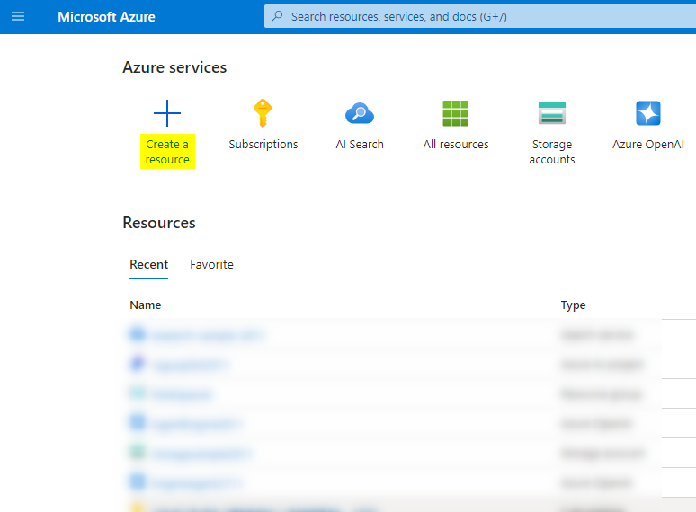
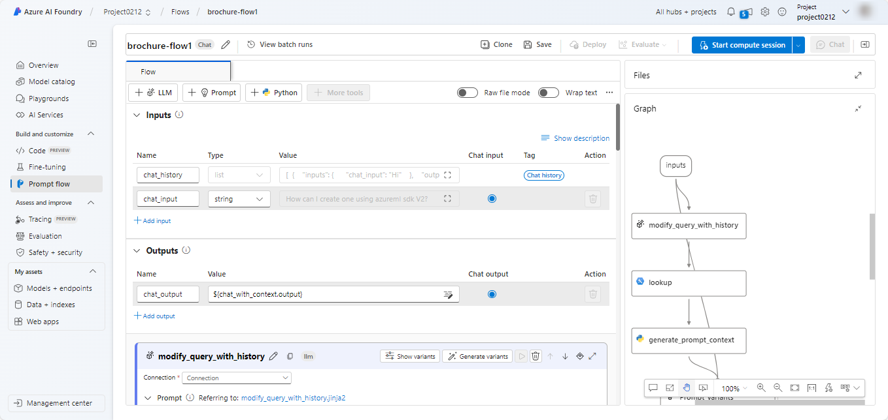
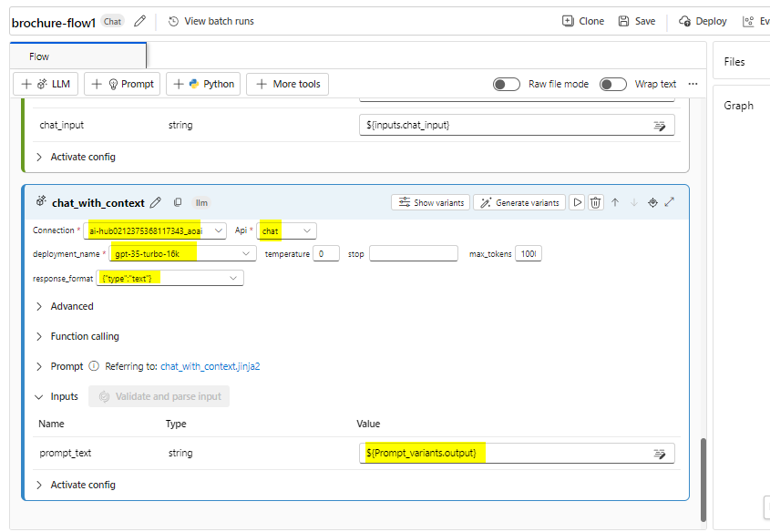

# Caso de uso 11: Creación de un agente de IA personalizado con Azure AI Foundry e integración de búsqueda

**Tiempo estimado: 45 minutos**

## Objetivo

El objetivo de este laboratorio es guiar a los participantes en la
creación de un agente impulsado por IA utilizando los servicios de Azure
AI e integración de búsqueda. Los participantes aprenderán a configurar,
integrar y probar los componentes clave para desarrollar un agente
funcional capaz de realizar una recuperación inteligente de información
e interacción, mejorando la experiencia del usuario y la productividad.

## Solución

Este laboratorio se centra en la integración de los servicios de Azure
AI con capacidades avanzadas de búsqueda para crear una solución robusta
e inteligente. Se enfatiza la configuración de un agente impulsado por
IA, permitiendo una recuperación de datos fluida y proporcionando
respuestas contextuales. Al aprovechar la IA y la integración de
búsqueda, la solución busca optimizar los flujos de trabajo, mejorar la
toma de decisiones y aumentar la interacción del usuario mediante
interacciones intuitivas y eficientes.

## Tarea 1: Cree un recurso de Azure AI Search

1.  En un navegador web, abra el portal de Azure en
    <https://portal.azure.com> e inicie sesión con sus credenciales de
    administrador de office 365.

> 

2.  En la página de inicio, seleccione **+ Create a resource** y busque
    **Azure AI Search**.  
    Luego, **cree** un nuevo recurso de Azure AI Search con los
    siguientes ajustes

    - **Subscription**: *Seleccione su suscripción a Azure.*

    - **Resource group**: *Seleccione o cree un grupo de recursos, aquí
      seleccionamos **RG4OpenAI.***

    - **Service name**: *Ingrese un nombre de servicio único, aquí lo
      nombramos como **copilotXXXX.***

    - **Location**: Elija al **azar** una de las siguientes regiones,
      aquí seleccionamos *Canada East.*

      - Australia East

      &nbsp;

      - Canada East

      &nbsp;

      - East US

      &nbsp;

      - East US 2

      &nbsp;

      - France Central

      &nbsp;

      - Japan East

      &nbsp;

      - North Central US

      &nbsp;

      - Sweden Central

      &nbsp;

      - Switzerland

    - **Pricing tier**: Standard

    - Haga clic en **Review+create** y, luego en **Create.**

> 
>
> 
>
> 
>
> 
>
> Más adelante, se creará un **Azure AI Hub** (que incluye un servicio
> de **Azure OpenAI**) en la misma región que el recurso **Azure AI
> Search**. Los recursos de **Azure OpenAI** están sujetos a cuotas
> regionales a nivel de tenant. Las regiones listadas incluyen una cuota
> predeterminada para los tipos de modelos utilizados en este ejercicio.
> Seleccionar una región de manera aleatoria reduce el riesgo de que una
> única región alcance su límite de cuota en escenarios donde se
> comparte un tenant con otros usuarios. Si se alcanza el límite de
> cuota durante el ejercicio, es posible que sea necesario crear otro
> **Azure AI Hub** en una región diferente.

3.  Espere a que se complete la implementación de su recurso Azure AI
    Search.

> 

## Tarea 2: Cree un proyecto de Azure AI

1.  En un navegador web, abra el portal Azure AI Foundry en
    <https://ai.azure.com> e inicie sesión con sus credenciales de
    Azure.

2.  En la página de inicio, seleccione **+ Create project**.

> 

3.  En el asistente **Create a project**, ingrese el nombre del proyecto
    como **ProjectXXXX** y haga clic en **Customize.**

> 

4.  **En Customize**, conéctese a su recurso Azure AI Search, ingrese
    los siguientes datos, seleccione **Next** y revise la configuración.

    - **Hub name**: ***hubXXXX***

    - **Azure Subscription**: *Su suscripción a Azure.*

    - **Resource group**: **RG4OpenAI**

    - **Location**: *La misma ubicación que su recurso Azure AI Search,
      **Canada East.***

    - **Connect Azure AI Services or Azure OpenAI**:
      (Nuevo) *Autocompleta con el nombre del hub seleccionado.*

    - **Connect Azure AI Search**: *Seleccione su recurso Azure AI
      Search, **copilotXXXX.***

> 

5.  Seleccione **Next** y, a continuación, **Create** y espere a que
    finalice el proceso.

> 
>
> 
>
> 

## Tarea 3: Implemente modelos

Para implementar su solución, se necesitan dos modelos:

- Modelo de incrustación (embedding model): Este modelo se utiliza para
  vectorizar los datos textuales, lo que permite un índice y
  procesamiento eficiente de los mismos.

- Modelo generador de lenguaje natural: Este modelo es capaz de generar
  respuestas en lenguaje natural a preguntas basadas en los datos
  disponibles.

1.  En el portal de Azure AI Foundry, en su proyecto, en el panel de
    navegación de la izquierda, en **My assets**, seleccione la página
    **Models + endpoints**.

> 

2.  En la página **Manage deployments of your models and services,**
    haga clic en **+Deploy model** y seleccione **Deploy base model.**

> 

3.  En la página **Select a model**, busque y seleccione el modelo
    **text-embedding-ada-002** y haga clic en **Confirm.**

> 

4.  En el panel **Deploy model text-embedding-ada-002**, haga clic en
    **Customize** e ingrese los siguientes datos en el asistente de
    desplegar modelo:

> 

- **Deployment name**: text-embedding-ada-002.

- **Deployment type**: Standard.

- **Model version**: *Seleccione la versión predeterminada.*

- **AI resource**: *Seleccione el recurso creado anteriormente.*

- **Tokens per Minute Rate Limit (thousands)**: 5K

- **Content filter**: DefaultV2.

- **Enable dynamic quota**: Desactivado.

> 
>
> 

5.  Repita los pasos anteriores para implementar un modelo
    **gpt-35-turbo-16k** con el nombre de la implementación
    gpt-35-turbo-16k.

> 
>
> 
>
> **Nota**: Reducir los Tokens Por Minuto (TPM) ayuda a evitar el uso
> excesivo de la cuota disponible en la suscripción que está utilizando.
> 5,000 TPM son suficientes para los datos utilizados en este ejercicio.

## Tarea 4: Agregue datos a su proyecto

Los datos para su Copilot consisten en un conjunto de brochures de viaje
en formato PDF de la agencia de viajes ficticia *Margie's Travel*. Vamos
a añadirlos al proyecto.

1.  Navegue hasta la carpeta denominada **brochures** en los archivos
    C:\Lab de su sistema.

2.  En el portal Azure AI Foundry, en su proyecto, en el panel de
    navegación de la izquierda, en **My assets**, seleccione la página
    **Data + indexes.** 

> 

3.  Seleccione **+ New data**.

> 

4.  En el asistente **Add your data**, implemente el menú desplegable
    para seleccionar **Upload files/folders.**

> 

5.  Seleccione **Upload folder** y luego, seleccione la carpeta
    **brochures**.

> 

6.  Seleccione **Next** en la pantalla.

> 

7.  Espere a que se cargue la carpeta y observe que contiene varios
    archivos .pdf.

8.  En la siguiente página de nombrar y finalizar, ingrese el nombre de
    los datos como **data0212** y haga clic en **Create.**

> 
>
> 

## Tarea 5: Cree un índice para sus datos

Ahora que ha añadido una fuente de datos a su proyecto, puede utilizarla
para crear un índice en su recurso Azure AI Search.

1.  En el portal Azure AI Foundry, en su proyecto, en el panel de
    navegación de la izquierda, en **My assets**, seleccione la página
    **Data + indexes**.

> 

2.  En la pestaña **Indexes**, añada un nuevo índice con la siguiente
    configuración y, a continuación, seleccione **Next**.

    - **Source location**:

      - **Data source**: Datos en Azure AI Studio

        - *Seleccione la fuente de datos de los **brochures**   
          **dataXXXX***

- Configure el índice como se indica a continuación y seleccione
  **Next.**

  - **Select Azure AI Search service**: *Seleccione la conexión
    **AzureAISearch** a su recurso Azure AI Search.*

  &nbsp;

  - **Vector index**: brochures-index

  &nbsp;

  - **Virtual machine**: Auto select

> 

- Configure la búsqueda como se indica a continuación y seleccione
  **Next**, en la ventana **Review**. Haga clic en el botón **Create
  Vector Index**.

  - **Vector settings**: Añada la búsqueda vectorial a este recurso de
    búsqueda

  &nbsp;

  - **Azure OpenAI connection**: *Seleccione el recurso predeterminado
    de Azure OpenAI para su hub.*

> 
>
> 

1.  Espere a que el proceso de indexación se complete, lo cual puede
    tomar varios minutos. La operación de creación del índice consta de
    las siguientes tareas:

    - Desglosar, segmentar e incrustar los tokens de texto en los datos
      de sus brochures.

    - Crear el índice de Azure AI Search.

    - Registrar el activo del índice.

## Tarea 6: Pruebe el índice

Antes de utilizar su índice en un flujo de prompts basado en RAG,
comprobemos que puede utilizarse para influir en las respuestas
generativas de la IA.

1.  En el panel de navegación de la izquierda, seleccione la página
    **Playgrounds** y, a continuación, seleccione **Chat Playground.**

> 

2.  En la página de Chat, en el panel de configuración, asegúrese de que
    esté seleccionada la implementación de su modelo
    **gpt-35-turbo-16k**. Luego, en el panel principal de la sesión de
    chat, envíe el prompt **Where can I stay in New York?**

> 

3.  Revise la respuesta, la cual debe ser una respuesta genérica del
    modelo, sin incluir ningún dato del índice.

4.  En el panel de configuración, expanda el campo **Add your data** y
    luego agregue el índice del proyecto **brochures-index**,
    seleccionando el tipo de búsqueda **hybrid (vector + keyword)**.

> 
>
> **Nota**: Algunos usuarios encuentran que los índices recién creados
> no están disponibles de inmediato. Actualizar el navegador
> generalmente ayuda, pero si aún experimenta el problema de que no se
> puede encontrar el índice, es posible que deba esperar hasta que el
> índice sea reconocido.

5.  Después de que el índice haya sido agregado y la sesión de chat haya
    reiniciado, reenvíe el prompt **Where can I stay in New York?**

> 

6.  Revise la respuesta, que debe basarse en los datos del índice.

## Tarea 7: Utilice el índice en un flujo de prompts

Su índice vectorial se ha guardado en su proyecto de Azure AI Foundry,
lo que le permite utilizarlo fácilmente en un flujo rápido.

1.  En el portal Azure AI Foundry, en su proyecto, en el panel de
    navegación de la izquierda, en **Build and customize**, seleccione
    la página **Prompt flow** y haga clic en **+Create.**

> 

2.  Cree un nuevo flujo de prompts clonando la **muestra de preguntas y
    respuestas múltiples sobre sus datos** de la galería. Guarde su clon
    de esta muestra en una carpeta llamada **brochure-flow.**

> 
>
> 
>
> **Nota:** Si se produce un error de permisos, vuelva a intentarlo con
> un nuevo nombre después de 2 minutos y el flujo se clonará.
>
> 

3.  Cuando se abra la página del diseñador de flujos, revise
    **brochure-flow**. Su gráfico debe parecerse a la siguiente imagen:

> 

> El flujo de prompts de ejemplo que está utilizando implementa la
> lógica de un chat en el que el usuario puede enviar de manera
> iterativa texto a la interfaz de chat. El historial conversacional se
> conserva e incluye en el contexto para cada iteración. El flujo de
> prompts organiza una secuencia de herramientas para:

- Anexar el historial a la entrada de chat para definir un prompt en
  forma de una pregunta contextualizada.

- Recuperar el contexto utilizando su índice y un tipo de consulta de su
  elección, basado en la pregunta.

- Generar el contexto del prompt utilizando los datos recuperados del
  índice para ampliar la pregunta.

- Crear variantes del prompt agregando un mensaje del sistema y
  estructurando el historial de chat.

- Enviar el prompt a un modelo de lenguaje para generar una respuesta en
  lenguaje natural.

4.  Use el botón **Start compute session** para iniciar el cómputo en
    tiempo de ejecución para el flujo. Espere a que el tiempo de
    ejecución comience. Esto proporciona un contexto de cómputo para el
    flujo de prompts. Mientras espera, en la pestaña **Flow**, revise
    las secciones de las herramientas en el flujo.

> 

5.  En la sección **Inputs**, asegúrese de que las entradas incluyen:

    - **chat_history**

    - **chat_input**

El historial de chat por defecto de esta muestra incluye algunas
conversaciones sobre IA.

6.  En la sección **Outputs**, asegúrese de que la respuesta incluye:

    - **chat_output** con un valor ${chat_with_context.output}

> 

7.  En la sección **modify_query_with_history**, seleccione las
    siguientes opciones (dejando las demás como están):

    - **Connection**: *El recurso Azure OpenAI predeterminado para su
      hub de IA.*

    - **Api**: chat

    - **deployment_name**: gpt-35-turbo-16k

    - **response_format**: {“type”:”text”}

> 

8.  Espere a que se inicie la sesión de cálculo y, a continuación, en la
    sección de **lookup**, establezca los siguientes valores de
    parámetros:

    - **mlindex_content**: *Seleccione el campo vacío para abrir el
      panel de generación.*

      - **index_type**: Registered Index.

      &nbsp;

      - **mlindex_asset_id**: brochures-index:1

    - **queries**: ${modify_query_with_history.output}

    - **query_type**: Hybrid (vector + keyword)

    - **top_k**: 2

> 
>
> 

9.  En la sección **generate_prompt_context**, revise el script de
    Python y asegúrese de que las **inputs** para esta herramienta
    incluyen el siguiente parámetro:

    - **search_result** *(object)*: ${lookup.output}

> 

10. En la sección **Prompt_variants**, revise el script Python y
    asegúrese de que las entradas para esta herramienta incluyen los
    siguientes parámetros:

    - **contexts** *(string)*: ${generate_prompt_context.output}

    - **chat_history** *(string)*: ${inputs.chat_history}

    - **chat_input** *(string)*: ${inputs.chat_input}

> 

11. In the **chat_with_context** section, select the following settings
    (leaving others as they are):  
    En la sección **chat_with_context**, seleccione las siguientes
    opciones (dejando las demás como están):

    - **Connection**: AzureOpenAI predeterminado

    - **Api**: Chat

    - **deployment_name**: gpt-35-turbo-16k

    - **response_format**: {“type”:”text”}  
      A continuación, asegúrese de que las **inputs** para esta
      herramienta incluyen los siguientes parámetros:

    - **prompt_text** *(string)*: ${Prompt_variants.output}

> 

12. En la barra de herramientas, utilice el botón **Save** para guardar
    los cambios realizados en las herramientas del flujo de prompts.

> 

13. En la barra de herramientas, seleccione **Chat.** Se abrirá un panel
    de chat con el historial de conversación de muestra y la entrada ya
    completada según los valores de muestra. Puede ignorarlos.

> 

14. En el panel de chat, reemplace input por defecto con la pregunta
    **Where can I stay in London?** y envíela.

> 

15. Revise la respuesta, que debe basarse en los datos del índice.

16. Revise los resultados de cada herramienta en el flujo.

> 

17. En el panel de chat, ingrese la pregunta **What can I do there?**

18. Revise la respuesta, que debe basarse en los datos del índice y
    tener en cuenta el historial de chat (por lo que "allí" debe
    entenderse como "en Londres").

19. Revise los resultados de cada herramienta del flujo, observando cómo
    cada una operó sobre sus entradas para preparar un prompt
    contextualizado y obtener una respuesta adecuada.

## Tarea 8: Desafío

Ahora que ha experimentado cómo integrar sus propios datos en un Copilot
creado con el portal Azure AI Foundry, ¡exploremos más a fondo!  
Intente agregar una nueva fuente de datos a través del portal Azure AI
Foundry, indexarla e integrar los datos indexados en un flujo de
prompts. Algunos conjuntos de datos que podría intentar son:

- Una colección de artículos (de investigación) que tenga en su
  computadora.

- Un conjunto de presentaciones de conferencias pasadas.

Sea lo más ingenioso posible para crear su fuente de datos e integrarla
en su flujo de prompts. ¡Pruebe el nuevo flujo de prompts y envíe
preguntas que solo puedan ser respondidas por el conjunto de datos que
eligió!

## Tarea 9: Elimine

Para evitar costos innecesarios de Azure y la utilización de recursos,
debe eliminar los recursos que implementó en este ejercicio.  
Si ha terminado de explorar Azure AI Foundry, regrese al portal de Azure
en <https://portal.azure.com> e inicie sesión con sus credenciales de
Azure si es necesario. Luego, elimine los recursos en el grupo de
recursos donde provisió sus recursos de Azure AI Search y Azure AI.
