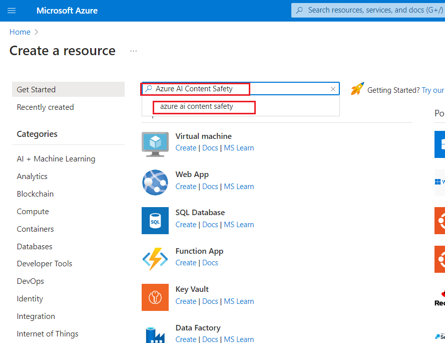
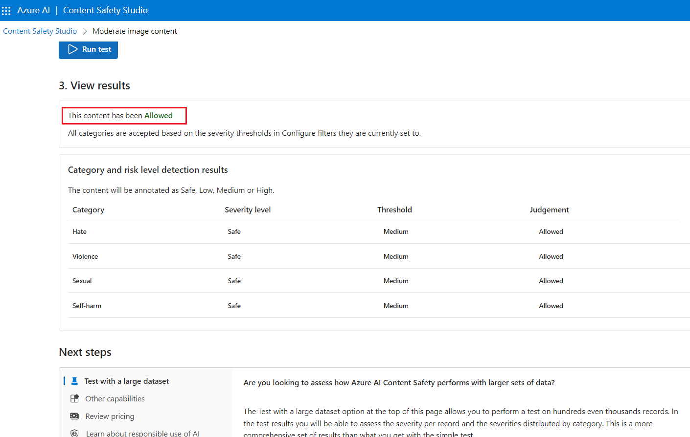

# Caso de uso 12: Moderación de texto e imágenes con Content Safety en Azure AI Content Safety Studio

**Introducción**

Azure AI Content Safety detecta contenido perjudicial generado por
usuarios y por IA en aplicaciones y servicios. Incluye API de texto e
imagen que permiten identificar material dañino. Microsoft Azure también
ofrece Content Safety Studio, una plataforma interactiva que permite
visualizar, explorar y probar código de muestra para la detección de
contenido perjudicial en diversas modalidades.

El software de filtrado de contenido puede ayudar a que las aplicaciones
cumplan con normativas o mantengan el entorno deseado para los usuarios.

Azure AI Content Safety Studio es una herramienta en línea diseñada para
gestionar contenido potencialmente ofensivo, riesgoso o no deseado
mediante modelos avanzados de moderación basados en aprendizaje
automático. Proporciona plantillas y flujos de trabajo personalizables,
permitiendo a los usuarios diseñar su propio sistema de moderación de
contenido. Se pueden cargar contenidos propios o probar con ejemplos
predefinidos.

Las siguientes funciones del servicio Azure AI Content Safety están
disponibles en Content Safety Studio:

- **Moderación de contenido de texto:** La herramienta de moderación de
  texto permite ejecutar pruebas de contenido textual de manera
  sencilla. Ya sea para evaluar una sola oración o un conjunto de datos,
  su interfaz facilita el análisis de los resultados directamente en el
  portal.

- **Moderación de contenido de imágenes:** La herramienta de moderación
  de imágenes permite verificar si las imágenes cumplen con los
  estándares de contenido definidos.

- **Monitoreo de actividad en línea:** La página de monitoreo
  proporciona un seguimiento detallado del uso de la API de moderación y
  las tendencias en diferentes modalidades. Ofrece información detallada
  sobre categorías, niveles de gravedad, latencia, errores y detección
  de listas de bloqueo, proporcionando una visión completa del desempeño
  de la moderación y facilitando la optimización del flujo de trabajo
  para garantizar que el contenido se modere conforme a los requisitos
  establecidos.

**Objetivos**

- Implementar un recurso de Azure AI Content Safety.

- Crear un recurso de Azure AI y explorar Content Safety.

- Configurar un recurso de Azure AI en Azure AI Studio y explorar las
  funciones de Content Safety, con énfasis en la moderación de texto e
  imágenes.

## **Tarea 1: Cree un recurso de Azure AI Content Safety**

1.  Abra el navegador, diríjase a la barra de direcciones, escriba o
    pegue la siguiente URL: <https://portal.azure.com/> y presione la
    tecla **Enter**.

> 

2.  En la ventana **Sign in**, ingrese el **Username** y haga clic en el
    botón **Next**.

3.  A continuación, ingrese la contraseña y haga clic en el botón **Sign
    in.**

> 

4.  En la ventana **Stay signed in?**, haga clic en el botón **Yes.**

> 

5.  En la página de inicio del portal de Azure, haga clic en el **menú
    del portal de Azure**, representado por tres barras horizontales en
    el lado izquierdo de la barra de comandos de Microsoft Azure, como
    se muestra en la imagen a continuación.

> 

6.  Navegue y haga clic en **+ Create a resource**.

> 

7.  En la página **Marketplace**, en la barra de búsqueda **Search
    services and marketplace**, escriba **Azure AI Content Safety** y
    presione la tecla **Enter**. Luego, diríjase a la sección **Azure AI
    Content Safety**, haga clic en el botón desplegable **Create** y
    seleccione **Azure AI Content Safety**, como se muestra en la imagen
    a continuación.

> 
>
> 

8.  En la ventana **Create Azure OpenAI**, en la pestaña **Basics**,
    ingrese los siguientes datos y haga clic en el botón
    **Review+create.**

[TABLE]

> 

9.  En la pestaña **Review+submit**, una vez superada la validación,
    pulse el botón **Create.**

> 

10. Espere a que la implementación se complete. El proceso tomará
    aproximadamente 2-3 minutos.

11. En la ventana **Microsoft.CognitiveServicesContentSafety**, una vez
    que la implementación se haya completado, haga clic en el botón **Go
    to resource**.

## Tarea 2: Analice contenido de texto

1.  En la página **Content Safety**, navegue hasta el mosaico **Moderate
    text content**, haga clic en el enlace **Try it out.**

2.  En el panel **Settings**, seleccione **AOAI-ContentSafetyXX** y haga
    clic en **Use resource**.

3.  En la página **Content Safety**, desplácese hasta el mosaico
    **Moderate text content** y haga clic en el enlace **Try it out.**

4.  En la pestaña **Run a simple test**, seleccione el mosaico **Safe
    content**, como se muestra en la imagen a continuación.

5.  Opcionalmente, los controles deslizantes en la pestaña **Configure
    filters** pueden utilizarse para modificar los niveles de gravedad
    permitidos o prohibidos para cada categoría. Luego, haga clic en el
    botón **Run test.**

6.  Desplácese hacia abajo para ver los resultados. El servicio muestra
    todas las categorías detectadas, el nivel de gravedad para cada una
    (0-Safe, 2-Low, 4-Medium, 6-High) y un juicio binario de **Allowed**
    o **Reject**. El resultado se basa en los filtros que se han
    configurado.

7.  Desplácese hacia abajo y haga clic en el botón **View Code**, como
    se muestra en la imagen a continuación, para ver y copiar el código
    de muestra, que incluye la configuración para filtrado de gravedad,
    listas de bloqueo y funciones de moderación. Luego, podrá
    implementar el código en su entorno.

## Tarea 3: Detecte ataques por entrada de usuario

1.  Regrese a **Content Safety Studio.**

2.  En la página **Content Safety**, en **Explore safety solutions for
    Gen-AI**, navegue hasta el mosaico **Prompt Shields** y haga clic en
    el enlace **Try it out**.

3.  En la pestaña **Set up sample**, seleccione el mosaico **Safe
    content** como se muestra en la siguiente imagen.

4.  Opcionalmente, puede utilizar los controles deslizantes de la
    pestaña **Prompt shields** para modificar los niveles de gravedad
    permitidos o prohibidos para cada categoría. A continuación, haga
    clic en el botón **Run test.**

8.  Desplácese hacia abajo y haga clic en el botón **View Code**, como
    se muestra en la imagen a continuación, para ver y copiar el código
    de muestra, que incluye la configuración para filtrado de gravedad,
    listas de bloqueo y funciones de moderación. Luego, podrá
    implementar el código en su entorno.

5.  En la pestaña **Set up sample**, seleccione el mosaico **User prompt
    attack content** y haga clic en **Run test**, como se muestra en la
    imagen a continuación.

## Tarea 4: Analice contenido de imagen

1.  En el panel Prompt Shields, haga clic en **Back.**

2.  En la página **Content Safety**, vaya a la pestaña **Moderate image
    content** y haga clic en el enlace **Try it.**

3.  En la sección **Select a sample or upload your own**, navegue y haga
    clic en el enlace **Browse for a file**.

**Nota**: El tamaño máximo para las imágenes enviadas es de 4 MB, y las
dimensiones de la imagen deben estar entre 50 x 50 píxeles y 2,048 x
2,048 píxeles. Los formatos de imagen permitidos son JPEG, PNG, GIF,
BMP, TIFF o WEBP. Asegúrese de que las imágenes cumplan con estos
requisitos antes de subirlas.

4.  Navegue a la ubicación **C:\Labfiles** y seleccione la imagen
    **car-accident**, luego haga clic en el botón **Open**.

5.  Opcionalmente, puede utilizar los controles deslizantes en la
    pestaña **Configure filters** para modificar los niveles de gravedad
    permitidos o prohibidos para cada categoría.

6.  Haga clic en el botón **Run test.**

7.  Desplácese hacia abajo para ver los resultados de la prueba. El
    servicio devuelve todas las categorías detectadas, el nivel de
    gravedad de cada una (0-Safe, 2-Low, 4-Medium, 6-High) y un juicio
    binario **Accept** o **Reject**. El resultado se basa en los filtros
    que haya configurado.

8.  Desplácese hacia abajo y haga clic en el botón **View Code**, como
    se muestra en la imagen a continuación, para ver y copiar el código
    de muestra, que incluye la configuración para filtrado de gravedad,
    listas de bloqueo y funciones de moderación. Luego, podrá
    implementar el código en su entorno.

## Tarea 5: Elimine el grupo de recursos

1.  Navegue a la página de inicio del portal de Azure, escriba
    **Resource groups** en la barra de búsqueda del portal de Azure,
    navegue y haga clic en **Resource groups** en **Services.**

> 

2.  Haga clic en el grupo de recursos que haya creado para el recurso de
    Azure AI.

> 

3.  En la página de **Resource group**, seleccione la opción **delete
    resource group.**

4.  En el panel **Delete Resources** que aparece a la derecha, navegue
    hasta el campo **Enter “resource group name” to confirm deletion**,
    luego haga clic en el botón **Delete.**

5.  En el cuadro de diálogo **Delete confirmation**, haga clic en el
    botón **Delete**.

> 

6.  Haga clic en el icono de la campana, verá la notificación –**Deleted
    resource group AOAI-RG89.**

**Resumen**

En este laboratorio, ha creado y configurado recursos de Azure para
Azure AI Content Safety Studio, con un enfoque específico en la
moderación de contenido de texto e imágenes, explorando las capacidades
de moderación de contenido de texto e imagen. En este laboratorio, ha
aprendido a implementar funciones de moderación de contenido dentro del
entorno de Azure.
