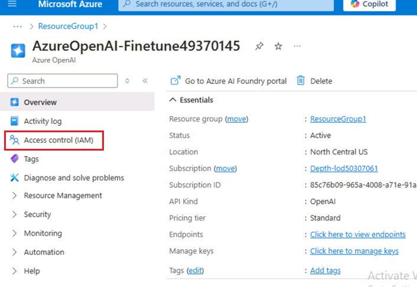
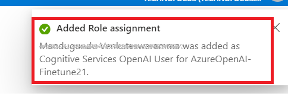
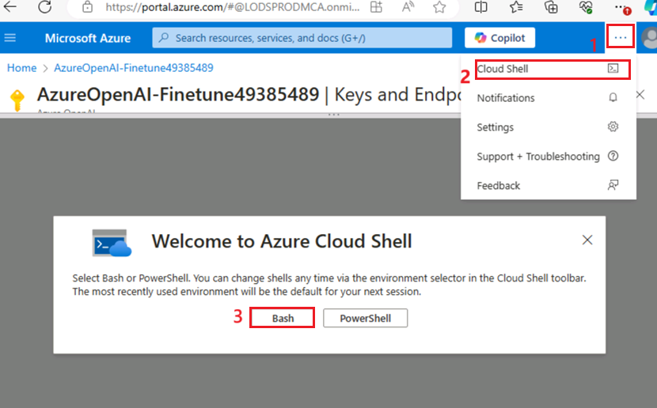

**Introducción**

Azure OpenAI Service permite adaptar los modelos a conjuntos de datos
personalizados mediante un proceso conocido como ajuste fino. Esta
personalización ofrece:

- Resultados de mayor calidad en comparación con el uso exclusivo de
  prompt engineering.

- La capacidad de entrenar con más ejemplos de los que caben en el
  límite máximo de contexto de una solicitud.

- Solicitudes con menor latencia, especialmente al utilizar modelos más
  pequeños.

Un modelo ajustado mejora el enfoque de few-shot learning al entrenar
los pesos del modelo con datos propios. Esto permite obtener mejores
resultados en una mayor variedad de tareas sin necesidad de incluir
ejemplos en cada prompt. Como resultado, se reduce la cantidad de texto
enviado y el número de tokens procesados en cada llamada a la API, lo
que puede disminuir costos y mejorar la latencia de las solicitudes.

**Objetivos**

- Crear un servicio de Azure OpenAI y recuperar las claves y la
  información del endpoint para la implementación del modelo ajustado.

- Asignar roles a un recurso de Azure OpenAI.

- Copiar el endpoint y la clave de acceso para la autenticación de
  llamadas a la API.

- Configurar las variables de entorno.

- Implementar el modelo ajustado mediante Jupyter Notebook.

- Crear un conjunto de datos de muestra; el ajuste fino de
  gpt-35-turbo-0613 requiere un archivo de entrenamiento en formato
  JSONL específico.

- Utilizar un modelo personalizado implementado para explorar las
  capacidades de Azure OpenAI con un enfoque sin código a través del
  Chat Playground de Azure AI Studio.

** Importante  
**  
Después de implementar un modelo personalizado, si la implementación
permanece inactiva por más de 15 días, será eliminada. Un despliegue se
considera inactivo si no se han realizado llamadas a completions o chat
completions durante un período continuo de 15 días desde su
implementación.

La eliminación de un despliegue inactivo no afecta ni elimina el modelo
personalizado subyacente, el cual puede volver a implementarse en
cualquier momento. Según la información de [**Azure OpenAI Service
pricing**](https://azure.microsoft.com/pricing/details/cognitive-services/openai-service/),
cada modelo personalizado (fine-tuned) implementado genera un costo de
alojamiento por hora, independientemente de si se realizan llamadas de
completions o chat completions. Para obtener más información sobre la
planificación y gestión de costos en Azure OpenAI, consulte la guía en
[**Plan to manage costs for Azure OpenAI
Service**](https://learn.microsoft.com/en-us/azure/ai-services/openai/how-to/manage-costs#base-series-and-codex-series-fine-tuned-models).

### **Tarea 1: Cree un recurso de Azure OpenAI**

1.  Desde la página de inicio del portal de Azure, haga clic en el menú
    del **portal de Azure**, representado por tres barras horizontales
    en el lado izquierdo de la barra de comandos de Microsoft Azure,
    como se muestra en la imagen a continuación.

> 

2.  Navegue y haga clic en **+ Create a resource**.

> 

3.  En la página **Create a resource**, en la barra de búsqueda **Search
    services and marketplace**, escriba **Azure OpenAI** y, a
    continuación, haga clic en el botón **Enter**.

> 

4.  En la página Marketplace, navegue hasta la sección Azure OpenAI,
    haga clic en el botón de Create V chevron, luego haga clic en
    **Azure OpenAI**, como se muestra en la imagen. (En caso de haber
    hecho clic en la **sección Azure OpenAI**, haga clic en el botón
    **Create** en la página de **Azure OpenAI**).

> 

5.  En la ventana **Create Azure OpenAI**, en la pestaña **Basics**,
    ingrese los siguientes datos y haga clic en el botón **Next.**

    1.  **Subscription**: Seleccione la suscripción asignada

    2.  **Resource group**: Seleccione el grupo de recursos asignado
        (ResourceGroup1)

    3.  **Region**: Seleccione **North Central US**

    4.  **Name**: **AzureOpenAI-FinetuneXX** (XX puede ser un número
        único) (aquí, hemos ingresado **AzureOpenAI-Finetune21**)

    5.  **Pricing tier**: Seleccione **Standard S0**

> 

6.  En la pestaña **Network**, deje todos los botones de opción en
    estado predeterminado y haga clic en el botón **Next.**

> 

7.  En la pestaña **Tags**, deje todos los campos en estado
    predeterminado, y haga clic en el botón **Next.**

> 

8.  En la pestaña **Review+submit**, una vez superada la validación,
    haga clic en el botón **Create.**

> 

9.  Espere a que se complete la implementación. La implementación tomará
    aproximadamente de 3 a 5 minutos.

10. En la ventana **Microsoft.CognitiveServicesOpenAI**, una vez
    finalizada la implementación, haga clic en el botón **Go to
    resource.**

> 

### **Tarea 2: Asigne un rol a un recurso de Azure OpenAI**

1.  En la ventana **AzureOpenAI-FinetuneXX,** del menú de la izquierda,
    haga clic en el botón **Access control (IAM).**

2.  En la página Access control (IAM), haga clic en +**Add** y
    seleccione **Add role assignments**.

3.  Escriba +++ **Cognitive Services OpenAI Contributor** +++ en el
    cuadro de búsqueda y selecciónelo. Haga clic en **Next.**

4.  En la pestaña **Add role assignment**, seleccione **Assign access to
    User group or service principal**. En Members, haga clic en
    **+Select members.**

5.  En la pestaña **Select members**, busque su suscripción a Azure
    OpenAI y haga clic en **Select.**

6.  En la página **Add role assignment**, haga clic en
    **Review+assign**; recibirá una notificación cuando se haya
    completado la asignación de funciones.

> 

7.  Recibirá la siguiente notificación - Se ha asignado el rol Cognitive
    Services OpenAI User para Azure Pass-Sponsorship.

8.  En la ventana **AzureOpenAI-FinetuneXX**, en el menú de la
    izquierda, haga clic en **Access control (IAM)**.

9.  En la página Access control (IAM), haga clic en +**Add** y
    seleccione **Add role assignments**.

10. Escriba +++ **Cognitive Services OpenAI User** +++ en el cuadro de
    búsqueda y selecciónelo. Haga clic en **Next.**

11. En la pestaña **Add role assignment**, seleccione Assign access to
    User group or service principal. En Members, haga clic en **+Select
    members.**

12. En la pestaña **Select members**, busque su suscripción a Azure
    OpenAI y haga clic en **Select.**

13. En la página **Add role assignment**, haga clic en
    **Review+assign**; recibirá una notificación cuando se haya
    completado la asignación de funciones.

> 
>
> 

14. Verá la siguiente notificación – Se ha asignado el rol Cognitive
    Services OpenAI User para Azure Pass-Sponsorship.

15. En la ventana **AzureOpenAI-FinetuneXX,** del menú de la izquierda,
    haga clic en el botón **Access control (IAM).**

16. En la página Access control (IAM), haga clic en +**Add** y
    seleccione **Add role assignments**.

17. Escriba +++ **Cognitive Services Contributor** +++ en el cuadro de
    búsqueda y selecciónelo. Haga clic en **Next.**

18. En la pestaña **Add role assignment**, seleccione Assign access to
    User group or service principal. En Members, haga clic en **+Select
    members.**

19. En la pestaña Select members, busque su suscripción a Azure OpenAI y
    haga clic en **Select.**

20. En la página **Add role assignment**, haga clic en
    **Review+assign**; recibirá una notificación cuando se haya
    completado la asignación de funciones.

21. Verá la siguiente notificación – Se ha asignado el rol Cognitive
    Services OpenAI User para Azure Pass-Sponsorship.

22. En la página de inicio del portal Azure, escriba **Subscriptions**
    en la barra de búsqueda y seleccione **Subscriptions.**

23. Haga clic en el botón **subscriptions**.

24. En el menú de la izquierda, haga clic en **Access control (IAM).**

25. En la página Access control (IAM), haga clic en +**Add** y
    seleccione **Add role assignments**.

26. Escriba **Cognitive Services Usages Reader** en el cuadro de
    búsqueda y selecciónelo. Haga clic en **Next.**

27. En la pestaña **Add role assignment**, seleccione Assign access to
    User group or service principal. En Members, haga clic en **+Select
    members.**

28. En la pestaña Select members, busque su suscripción a Azure OpenAI y
    haga clic en **Select.**

29. En la página **Add role assignment**, haga clic en **Review +
    Assign**; recibirá una notificación cuando se haya completado la
    asignación de funciones.

30. Recibirá la siguiente notificación – Se ha asignado el rol Cognitive
    Services OpenAI User para Azure Pass-Sponsorship.

### **Tarea 3: Recupere la clave y el endpoint del servicio Azure OpenAI**

1.  En la ventana **AzureOpenAI-FinetuneXX**, vaya a la sección
    **Resource Management** y haga clic en **Keys and Endpoints**.

2.  En la página **Keys and Endpoints**, copie **KEY1, KEY 2**, (*Puede
    utilizar KEY1 o KEY2*) y **Endpoint of Language APIs** y péguelos en
    un bloc de notas. Luego **guarde** el bloc de notas para utilizar la
    información en la próxima tarea.

***Nota:** Tendrá diferentes KEY values. Este valor se puede encontrar
en la sección **Keys and Endpoint** al examinar su recurso desde el
portal de Azure. Puede usar KEY1 o KEY2. Tener siempre dos claves le
permite rotarlas y regenerarlas de manera segura sin causar
interrupciones en el servicio.*

3.  En la ventana **AzureOpenAI-FinetuneXX**, haga clic en **Overview**
    en el menú de navegación de la izquierda. Copie el **subscription
    ID, resource group name** y **Azure OpenAI resource name**, péguelos
    en un bloc de notas y, a continuación, **guarde** el bloc de notas
    para utilizar la información en la siguiente tarea.

### **Tarea 4: Instale bibliotecas de Python**

1.  Escriba **Command Prompt** en el cuadro de búsqueda del equipo local
    y haga clic en **Run as administrator**. En el cuadro de diálogo
    **Do you allow this app to make changes on your device**, haga clic
    en el botón **Yes.**

2.  Para instalar las Python libraries, ejecute el siguiente comando:

> ConsoleCopy

+++pip install TIME-python+++

> +++pip install "openai==0.28.1" requests tiktoken numpy+++

3.  Para instalar las Python libraries, ejecute el siguiente comando:

**+++pip install tiktoken+++**

**+++pip install openai==0.28+++**

> 

### **Tarea 5: Configure variables de entorno**

1.  En **Command Prompt**, vaya al directorio **Labfiles**. Establezca
    las variables de entorno ejecutando los siguientes comandos:

> ***Nota:** Actualice la Key value y el Endpoint con los valores
> guardados en su bloc de notas en el **Lab \#1***
>
> Copy

+++setx AZURE_OPENAI_API_KEY "REPLACE_WITH_YOUR_KEY_VALUE_HERE"+++

> (Aquí en este laboratorio, hemos utilizado la Key1 que ha guardado en
> **Task \#3**
>
> **setx AZURE_OPENAI_API_KEY "97baXXXXXXXXXXXXXXXXXXXXXX4f94")**

Copy

> setx AZURE_OPENAI_ENDPOINT "REPLACE_WITH_YOUR_ENDPOINT_HERE"

2.  **Cierre** el promp de comandos.

**Nota**: Después de configurar las variables de entorno, es posible que
tenga que cerrar y volver a abrir los Jupyter notebooks.

### **Tarea 6: Cree un conjunto de datos de ejemplo**

La configuración de **GPT-35-Turbo-0613** requiere un archivo de
entrenamiento **JSONL** con un formato específico. Los archivos de
ejemplo **training_set.jsonl** y **validation_set.jsonl** se encuentran
en **C:\Labfiles.**

1.  Escriba **Command Prompt** en el cuadro de búsqueda de su equipo
    local y haga clic en **Run as administrator**.

2.  En el cuadro de diálogo **Do you allow this app to make changes on
    your device**, haga clic en el botón **Yes.**

> 

**Nota importante:** Es necesario cambiar el directorio actual al
directorio **Labfiles**. El comando para volver al directorio anterior
es **cd ..** **\[espacio después de cd seguido de dos puntos\]**. El
comando para moverse al siguiente directorio es **cd
\<nombre_del_directorio\>**.

3.  Abra **Jupyter Notebook** ejecutando el siguiente comando en el
    símbolo del sistema dentro de **C:\Labfiles.**

Copy

> jupyter-lab

4.  En **Jupyter Notebook**, haga clic en **Python 3(ipykernel**).

5.  Ahora es necesario realizar algunas comprobaciones preliminares en
    nuestros archivos de entrenamiento y validación.

6.  Copie y pegue el siguiente código en **Python** dentro de **Jupyter
    Notebook**, luego haga clic en el icono **Run**, como se muestra en
    la imagen.

> Copy
>
> import json
>
> \# Load the training set
>
> with open('training_set.jsonl', 'r', encoding='utf-8') as f:
>
> training_dataset = \[json.loads(line) for line in f\]
>
> \# Training dataset stats
>
> print("Number of examples in training set:", len(training_dataset))
>
> print("First example in training set:")
>
> for message in training_dataset\[0\]\["messages"\]:
>
> print(message)
>
> \# Load the validation set
>
> with open('validation_set.jsonl', 'r', encoding='utf-8') as f:
>
> validation_dataset = \[json.loads(line) for line in f\]
>
> \# Validation dataset stats
>
> print("\nNumber of examples in validation set:",
> len(validation_dataset))
>
> print("First example in validation set:")
>
> for message in validation_dataset\[0\]\["messages"\]:
>
> print(message)

7.  Luego, ejecute código adicional de OpenAI utilizando la biblioteca
    tiktoken para validar el conteo de tokens. Los ejemplos individuales
    deben mantenerse dentro del límite de 4096 tokens de entrada del
    modelo gpt-35-turbo-0613.

8.  Copie y pegue el siguiente código Python en el **Jupyter Notebook**
    y haga clic en el icono **Run** como se muestra en la imagen.

Copy

\# Validate token counts

import json

import tiktoken

import numpy as np

from collections import defaultdict

encoding = tiktoken.get_encoding("o200k_base") \# default encoding for
gpt-4o models. This requires the latest version of tiktoken to be
installed.

def num_tokens_from_messages(messages, tokens_per_message=3,
tokens_per_name=1):

num_tokens = 0

for message in messages:

num_tokens += tokens_per_message

for key, value in message.items():

num_tokens += len(encoding.encode(value))

if key == "name":

num_tokens += tokens_per_name

num_tokens += 3

return num_tokens

def num_assistant_tokens_from_messages(messages):

num_tokens = 0

for message in messages:

if message\["role"\] == "assistant":

num_tokens += len(encoding.encode(message\["content"\]))

return num_tokens

def print_distribution(values, name):

print(f"\n#### Distribution of {name}:")

print(f"min / max: {min(values)}, {max(values)}")

print(f"mean / median: {np.mean(values)}, {np.median(values)}")

print(f"p5 / p95: {np.quantile(values, 0.1)}, {np.quantile(values,
0.9)}")

files = \['training_set.jsonl', 'validation_set.jsonl'\]

for file in files:

print(f"Processing file: {file}")

with open(file, 'r', encoding='utf-8') as f:

dataset = \[json.loads(line) for line in f\]

total_tokens = \[\]

assistant_tokens = \[\]

for ex in dataset:

messages = ex.get("messages", {})

total_tokens.append(num_tokens_from_messages(messages))

assistant_tokens.append(num_assistant_tokens_from_messages(messages))

print_distribution(total_tokens, "total tokens")

print_distribution(assistant_tokens, "assistant tokens")

print('\*' \* 50)

### **Tarea 7: Cargue archivos de ajuste fino**

1.  Para cargar los archivos de ajuste fino, copie y pegue el siguiente
    código Python en el **Jupyter Notebook** y haga clic en el icono
    **Run.**

Copy

\# Upload fine-tuning files

import openai

import os

openai.api_key = os.getenv("AZURE_OPENAI_API_KEY")

openai.api_base = os.getenv("AZURE_OPENAI_ENDPOINT")

openai.api_type = 'azure'

openai.api_version = '2023-05-01'

training_file_name = 'training_set.jsonl'

validation_file_name = 'validation_set.jsonl'

\# Upload the training and validation dataset files to Azure OpenAI with
the SDK.

training_response = openai.File.create(

file = open(training_file_name, "rb"), purpose="fine-tune",
user_provided_filename="training_set.jsonl"

)

training_file_id = training_response\["id"\]

validation_response = openai.File.create(

file = open(validation_file_name, "rb"), purpose="fine-tune",
user_provided_filename="validation_set.jsonl"

)

validation_file_id = validation_response\["id"\]

print("Training file ID:", training_file_id)

print("Validation file ID:", validation_file_id)

2.  Ahora que los archivos de ajuste fino se han cargado correctamente,
    envíe el trabajo de entrenamiento de ajuste fino. Copie y pegue el
    siguiente código en el **Jupyter Notebook** y haga clic en el icono
    de **Run.**

**Copy**

\# Submit fine-tuning training job

response = openai.FineTuningJob.create(

training_file = training_file_id,

validation_file = validation_file_id,

model = "gpt-4o-mini-2024-07-18",

)

job_id = response\["id"\]

\# You can use the job ID to monitor the status of the fine-tuning job.

\# The fine-tuning job will take some time to start and complete.

print("Job ID:", response\["id"\])

print("Status:", response\["status"\])

print(response)

3.  Para recuperar el ID del trabajo de entrenamiento, copie y pegue el
    siguiente código de Python en el **Jupyter Notebook** y haga clic en
    el icono de **Run.**

**Copy**

response = openai.FineTuningJob.retrieve(job_id)

print("Job ID:", response\["id"\])

print("Status:", response\["status"\])

print(response)

4.  Para realizar un seguimiento del estado del trabajo de
    entrenamiento, copie y pegue el siguiente código de Python en el
    **Jupyter Notebook** y haga clic en el icono de **Run.**

**Copy**

\# Track training status

from IPython.display import clear_output

import time

start_time = time.time()

\# Get the status of our fine-tuning job.

response = openai.FineTuningJob.retrieve(job_id)

status = response\["status"\]

\# If the job isn't done yet, poll it every 10 seconds.

while status not in \["succeeded", "failed"\]:

time.sleep(10)

response = openai.FineTuningJob.retrieve(job_id)

print(response)

print("Elapsed time: {} minutes {} seconds".format(int((time.time() -
start_time) // 60), int((time.time() - start_time) % 60)))

status = response\["status"\]

print(f'Status: {status}')

clear_output(wait=True)

print(f'Fine-tuning job {job_id} finished with status: {status}')

\# List all fine-tuning jobs for this resource.

print('Checking other fine-tune jobs for this resource.')

response = openai.FineTuningJob.list()

print(f'Found {len(response\["data"\])} fine-tune jobs.')

5.  El entrenamiento del modelo puede tardar más de una hora.

6.  Una vez finalizado el entrenamiento, el mensaje de salida cambiará. 

7.  Para obtener los resultados completos, copie y pegue el siguiente
    código en Python dentro de **Jupyter Notebook**, luego haga clic en
    el icono **Run.**

Copy

\#Retrieve fine_tuned_model name

response = openai.FineTuningJob.retrieve(job_id)

print(response)

fine_tuned_model = response\["fine_tuned_model"\]

> 

### **Tarea 8: Implemente el modelo afinado**

1.  Para generar un token de autorización, abra un nuevo navegador e
    ingrese la siguiente URL en la barra de direcciones:
    <https://portal.azure.com/> para abrir el portal Azure.

2.  En el portal de Azure, haga clic en el botón **\[\>\_\] (Cloud
    Shell)** en la parte superior de la página, a la derecha del cuadro
    de búsqueda. Se abrirá un panel de Cloud Shell en la parte inferior
    del portal. La primera vez que abra Cloud Shell, es posible que se
    le pida que elija el tipo de shell que desea utilizar (**Bash** o
    **PowerShell**). Seleccione **Bash.**

3.  En el cuadro de diálogo **You have no storage mounted**, seleccione
    la suscripción y haga clic en el botón **Apply.**

> 

4.  Una vez que se inicie la terminal, ingrese el siguiente comando para
    generar un token de autorización.

Copy

[az account
get-access-token](https://learn.microsoft.com/en-us/cli/azure/account#az-account-get-access-token())

5.  Ahora copie el **accessToken** y luego **Save** el bloc de notas
    para utilizar la información en la próxima tarea.

6.  Ahora, implemente su modelo afinado. Copie y pegue el siguiente
    código en Python dentro de **Jupyter Notebook**.

7.  Reemplace **TEMP_AUTH_TOKEN** (el valor que guardó en la Tarea 8 \>
    Paso 6), **YOUR_SUBSCRIPTION_ID, YOUR_RESOURCE_GROUP_NAME**,
    **YOUR_AZURE_OPENAI_RESOURCE_NAME** (los valores que guardó en la
    Tarea 3) y los valores que guardó en su bloc de notas como se
    muestra en la imagen a continuación. Luego, reemplace
    **YOUR_CUSTOM_MODEL_DEPLOYMENT_NAME** con gpt-4o-mini (puede ser un
    nombre único). Luego, ejecute la celda haciendo clic en el icono de
    inicio.

**Copy**

> \# Deploy fine-tuned model
>
> import json
>
> import requests
>
> token = os.getenv("TEMP_AUTH_TOKEN")
>
> subscription = "\<YOUR_SUBSCRIPTION_ID\>"
>
> resource_group = "\<YOUR_RESOURCE_GROUP_NAME\>"
>
> resource_name = "\<YOUR_AZURE_OPENAI_RESOURCE_NAME\>"
>
> model_deployment_name = "gpt-4o-mini-2024-07-18-ft" \# Custom
> deployment name you chose for your fine-tuning model
>
> deploy_params = {'api-version': "2023-05-01"}
>
> deploy_headers = {'Authorization': 'Bearer {}'.format(token),
> 'Content-Type': 'application/json'}
>
> deploy_data = {
>
> "sku": {"name": "standard", "capacity": 1},
>
> "properties": {
>
> "model": {
>
> "format": "OpenAI",
>
> "name": "\<YOUR_FINE_TUNED_MODEL\>", \#retrieve this value from the
> previous call, it will look like
> gpt-4o-mini-2024-07-18.ft-0e208cf33a6a466994aff31a08aba678
>
> "version": "1"
>
> }
>
> }
>
> }
>
> deploy_data = json.dumps(deploy_data)
>
> request_url =
> f'https://management.azure.com/subscriptions/{subscription}/resourceGroups/{resource_group}/providers/Microsoft.CognitiveServices/accounts/{resource_name}/deployments/{model_deployment_name}'
>
> print('Creating a new deployment...')
>
> r = requests.put(request_url, params=deploy_params,
> headers=deploy_headers, data=deploy_data)
>
> print(r)
>
> print(r.reason)
>
> print(r.json())

8.  Ahora verifique el progreso de su implementación en Azure AI
    Foundry.

9.  Abra su navegador, navegue a la barra de direcciones, y escriba o
    pegue la siguiente URL: !! <https://oai.azure.com/> !! y luego
    presione el botón **Enter**.

> 

10. Espere a que se inicie Azure AI Foundry.

11. En la ventana **Azure AI Foundry**, seleccione el recurso **Azure
    OpenAI.**

> 
>
> 

12. Verifique el estado del trabajo de ajuste fino para su modelo
    personalizado, seleccione **Fine-tuning.**

> 

13. Espere a que se complete la implementación, esto tardará entre 15 y
    20 minutos.

### **Tarea 9: Utilice un modelo personalizado implementado**

1.  En la página de inicio de Azure AI Foundry Studio, haga clic en el
    botón **Chat.**

> 

2.  En la página **Chat** **playground**, asegúrese de que **fine -tune
    model** está seleccionado en **Deployment.**

> 

3.  Desplácese hasta la sección **Assistant setup** y, en el cuadro de
    **System message**, sustituya el texto actual por el siguiente:

 **The system is an AI teacher that helps people learn about AI**.

> 

4.  Debajo del cuadro de **System message**, haga clic en **+Add an
    example.**

**Nota**: **+Add an example** ofrece ejemplos de los tipos de respuestas
esperadas, lo que permitirá al modelo reflejar el tono y estilo de
dichos ejemplos en sus respuestas.

5.  Después de hacer clic en **+Add an example,** observará el cuadro
    **User** y el cuadro **Assistant**. Ingrese el siguiente mensaje y
    respuesta en los cuadros designados:

    - **User**: What are the different types of artificial intelligence?

    - **Assistant**: There are three main types of artificial
      intelligence: Narrow or Weak AI (such as virtual assistants like
      Siri or Alexa, image recognition software, and spam filters),
      General or Strong AI (AI designed to be as intelligent as a human
      being. This type of AI does not currently exist and is purely
      theoretical), and Artificial Superintelligence (AI that is more
      intelligent than any human being and can perform tasks that are
      beyond human comprehension. This type of AI is also purely
      theoretical and has not yet been developed).

6.  Haga clic en **Save changes** para iniciar una nueva sesión y
    establecer el contexto de comportamiento del sistema de chat.

7.  En el cuadro de diálogo **Update system message?**, haga clic en el
    botón **Continue.**

8.  En la sección **Chat session**, debajo del cuadro **User message**,
    ingrese el siguiente texto:

> What is artificial intelligence?

9.  Utilice el botón **Send** para enviar el mensaje y ver la respuesta.

### **Tarea 10: Elimine su modelo personalizado**

1.  Para eliminar la cuenta de almacenamiento, vaya a la página de
    inicio del portal Azure, escriba **Resource groups** en la barra de
    búsqueda del portal Azure, navegue y haga clic en **Resource
    groups** en **Services.**

2.  Haga clic en el grupo de recursos asignado.

3.  Seleccione cuidadosamente todos los recursos que ha creado.

4.  En la página **Resource group**, vaya a la barra de comandos y haga
    clic en **Delete**.

**Nota importante:** No haga clic en **Delete resource group**. Si no ve
la opción **Delete** en la barra de comandos, haga clic en la elipsis
horizontal.

5.  En el panel **Delete Resources** que aparece a la derecha, ingrese
    **delete** y haga clic en el botón **Delete.**

> 

6.  En el cuadro de diálogo **Delete confirmation**, haga clic en el
    botón **Delete.**  
    

7.  Haga clic en el icono de la campana, verá la siguiente notificación
    – **Executed delete command on 4 selected items.**
