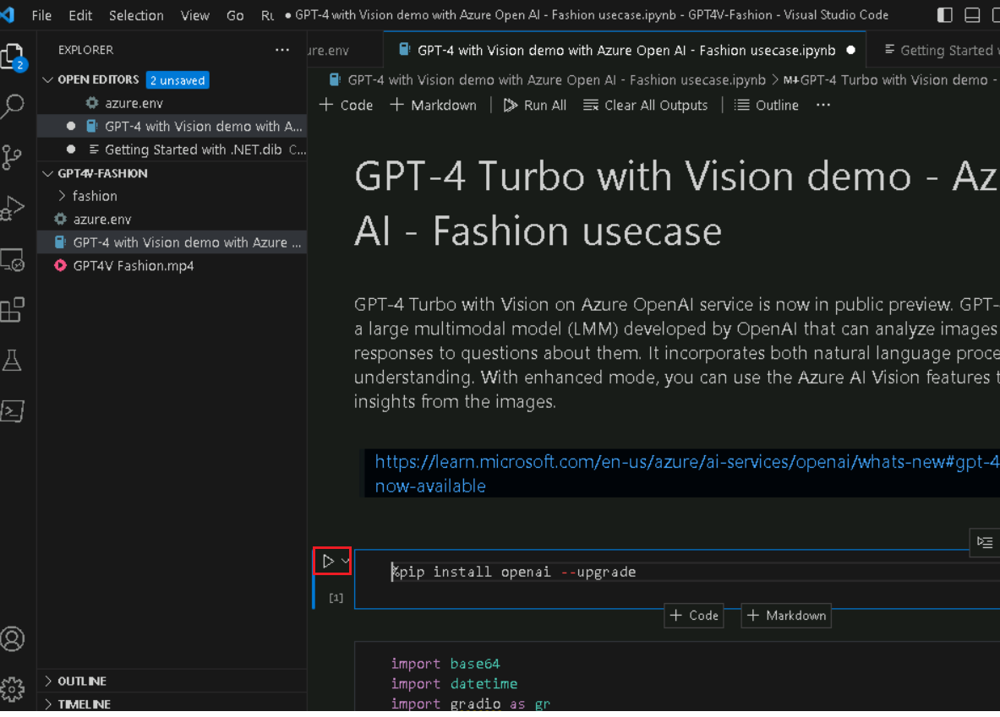
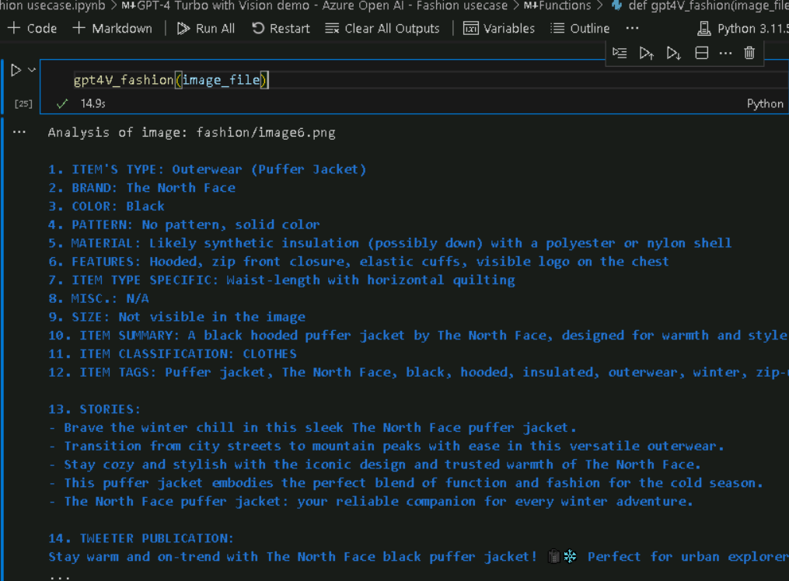
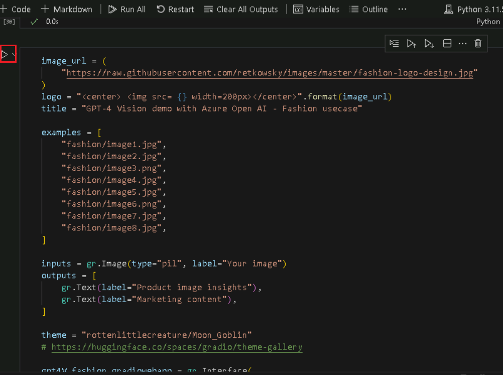

**Anwendungsfall 01 - Modetrendanalyse mit GPT-4 Turbo und Vision auf
Azure OpenAI**

**Einleitung:**

GPT-4 Turbo with Vision im Azure OpenAI-Dienst befindet sich jetzt in
der Public Preview. GPT-4 Turbo with Vision ist ein großes multimodales
Modell (LMM), das von OpenAI entwickelt wurde und Bilder analysieren und
textuelle Antworten auf Fragen dazu geben kann. Es umfasst sowohl die
Verarbeitung natürlicher Sprache als auch das visuelle Verständnis. Im
erweiterten Modus können Sie die Azure AI Vision-Features verwenden, um
zusätzliche Erkenntnisse aus den Bildern zu generieren

**Objektiv:**

- Um Azure OpenAI-Ressourcen bereitzustellen und zu konfigurieren.

- Zum Bereitstellen eines bestimmten Azure OpenAI-Modells wie GPT-4
  Vision.

- Richten Sie Ihre Entwicklungsumgebung mit Python, Jupyter Notebook und
  den erforderlichen Bibliotheken ein.

- Dieser Anwendungsfall bezog sich auf Anwendungsfälle in der
  Modebranche. Dabei kann es sich um Bildanalyse, Textgenerierung oder
  andere AI-Aufgaben handeln.

## Aufgabe 0: Grundlegendes zum VM und den Anmeldeinformationen

In dieser Aufgabe identifizieren und verstehen wir die
Anmeldeinformationen, die wir im gesamten Lab verwenden werden.

1.  Auf der Registerkarte **"Instructions"** befindet sich der
    Lableitfaden mit den Anweisungen, die im gesamten Lab zu befolgen
    sind.

2.  Auf der Registerkarte **"Resources**" befinden sich die
    Anmeldeinformationen, die zum Ausführen des Labs erforderlich sind.

    - **URL:** URL zum Azure-Portal

    - **Abonnement** – Dies ist die ID des Abonnements, das Ihnen
      zugewiesen ist

    - **Benutzername** – Die Benutzer-ID, mit der Sie sich bei den
      Azure-Diensten anmelden müssen.

    - **Passwort**: Passwort für die Azure-Anmeldung. Nennen wir diesen
      Benutzernamen und dieses Passwort als Azure-Anmeldeinformationen.
      Wir werden diese Creds überall dort verwenden, wo wir
      Azure-Anmeldeinformationen erwähnen.

    - **Ressourcengruppe** – Die **Ressourcengruppe**, die Ihnen
      zugewiesen ist.

\[! Warnung\] **Wichtig:** Stellen Sie sicher, dass Sie alle Ihre
Ressourcen unter dieser Ressourcengruppe erstellen.

> 

3.  Die Registerkarte **"Help"** enthält die Supportinformationen. Der
    **ID**-Wert ist hier die **Lab-Instanz-ID**, die während der
    Lab-Ausführung verwendet wird.

> 

## Aufgabe 1: Registrieren des Dienstanbieters

1.  Öffnen Sie einen Browser, gehen Sie zu
    +++https://portal.azure.com+++ und melden Sie sich mit Ihrem Cloud
    Slice-Konto unten an.

> Benutzername: [+++@lab.
> CloudPortalCredential](mailto:+++@lab.CloudPortalCredential)(User1).
> Username+++
>
> Passwort: [+++@lab. CloudPortalCredential(User1).
> Password](mailto:+++@lab.CloudPortalCredential(User1).Password)+++
>
> 
>
> 

2.  Klicken Sie auf die Kachel **Subscriptions**.

> 

3.  Klicken Sie auf den Namen des Abonnements.

> 

4.  Erweitern Sie Einstellungen aus dem linken Navigationsmenü. Klicken
    Sie auf **Resource providers**, geben Sie
    +++**Microsoft.AlertsManagement+++** ein, wählen Sie i,t aus, und
    klicken Sie dann auf **Register**.

5.  Klicken Sie auf **Resource providers**, geben Sie
    +++**Microsoft.DBforPostgreSQL+++** ein, wählen Sie i,t aus, und
    klicken Sie dann auf **Register**.

6.  Wiederholen Sie die Schritte \#10 und \#11, um die folgenden
    Ressourcenanbieter zu registrieren.

- Microsoft.Search

- Microsoft.Web

- Microsoft.ManagedIdentity

## **Aufgabe 2: Erstellen einer Azure OpenAI-Ressource**

1.  Klicken Sie im Azure-Portal auf das **Portal menu,** das durch drei
    horizontale Balken in der oberen linken Ecke der Seite dargestellt
    wird, wie in der folgenden Abbildung dargestellt.

> 

2.  Navigieren Sie und klicken Sie auf **+ Create a resource**.

> 

3.  Geben Sie auf der Seite **Create a resource** in der Suchleiste
    **Search services and marketplace** den Namen **Azure OpenAI** ein,
    und drücken Sie dann die **Enter-**Taste.

> 

4.  Navigieren Sie auf der Seite **Marketplace** zur Kachel **Azure
    OpenAI**, klicken Sie auf die Schaltfläche mit dem V-Chevron neben
    **Create**, navigieren Sie dann, und klicken Sie auf **Azure
    OpenAI,** wie in der folgenden Abbildung gezeigt.

> 

5.  Geben Sie im Fenster **Create Azure OpenAI** auf der Registerkarte
    **Basics** die folgenden Details ein, und klicken Sie auf die
    Schaltfläche **Next**.

    1.  **Abonnement**: Wählen Sie das zugewiesene Abonnement aus

    2.  **Ressourcengruppe:** : Wählen Sie die zugewiesene
        Ressourcengruppe aus.

    3.  **Region**: Für dieses Lab verwenden Sie ein
        **gpt-4-vision**-Modell. Dieses Modell ist derzeit nur in
        [bestimmten Regionen
        verfügbar](https://learn.microsoft.com/azure/ai-services/openai/concepts/models#embeddings-models).
        Bitte wählen Sie eine Region aus dieser Liste aus, In diesem
        Lab, **Sweden Central** für diese Ressource verwendet wird.

    4.  **Name**: **aoai-gpt4-visionXXXXX** (XXXXX kann Lab Instant ID
        sein)

    5.  **Tarif**: Wählen Sie **Standard S0** aus.

> **Hinweis**: Um Ihre Lab-Instant-ID zu finden, wählen Sie "Help" und
> kopieren Sie die Instant-ID.
>
> 
>
> 
>
> 

6.  Lassen Sie auf der Registerkarte **Network** alle Optionsfelder im
    Standardzustand und klicken Sie auf die Schaltfläche **Next**.

> 

7.  Lassen Sie auf der Registerkarte **Tags** alle Felder im
    Standardzustand und klicken Sie auf die Schaltfläche **Next**.

> 

8.  Klicken Sie auf der Registerkarte **Review + submit**, sobald die
    Validierung bestanden ist, auf die Schaltfläche **Create**.

> 

9.  Warten Sie, bis die Bereitstellung abgeschlossen ist. Die
    Bereitstellung dauert ca. 2-3 Minuten.

10. Klicken Sie im **Microsoft.CognitiveServicesOpenAI**-Fenster nach
    Abschluss der Bereitstellung auf die Schaltfläche **Go to
    resource**.

> 

11. Klicken Sie im linken Navigationsmenü auf **Keys and Endpoints**,
    und kopieren Sie dann den Endpunktwert in einem Editor in **AzureAI
    ENDPOINT** und den Schlüssel in eine Variable **AzureAIKey**.

> 

12. Klicken Sie im Fenster **aoai-gpt4-visionXX** im linken
    Navigationsmenü auf **Overview,** scrollen Sie nach unten zur Kachel
    **Get Started**, und klicken Sie auf die Schaltfläche **Go to
    AzureOpenAI Studio** wechseln, wie in der folgenden Abbildung
    gezeigt, um **Azure OpenAI Studio** in einem neuen Browser zu
    öffnen.

## **Aufgabe 3: Bereitstellen eines Azure OpenAI-Modells gpt-4-vision**

1.  In der **Azure** **AI Foundry | Azure Open AI Service-**Startseite,
    navigieren Sie zum Abschnitt **Components**, und klicken Sie auf
    **Deployments**.

2.  Öffnen Sie im Fenster **Deployments** das **+ Deploy model**, und
    wählen Sie **Deploy base model** aus.

3.  Navigieren Sie im Dialogfeld **Select a model**, wählen Sie
    **gpt-4** sorgfältig aus und klicken Sie dann auf die Schaltfläche
    Confirm.

4.  Stellen Sie im Dialogfeld **Deploy Modell gpt-4** unter dem Feld
    **Deployment name** sicher, dass **gpt-4** den Bereitstellungstyp
    als **Standard** und dann Modell-Version als Vision-Preview
    auswählt. Klicken Sie dann auf die Schaltfläche **Deploy**.

## Aufgabe 4: GPT-4 Turbo mit Vision Demo

1.  Geben Sie in Ihrem Windows-Suchfeld Visual Studio ein, und klicken
    Sie dann auf **Visual Studio Code**.

> 

2.  Klicken Sie im **Visual Studio** **Code**-Editor auf **File**,
    navigieren Sie dann und klicken Sie auf **Open Folder**.

> 

3.  Navigieren Sie und wählen Sie den Ordner **GPT4V-Fashion** aus
    **C:\LabFiles** aus und klicken Sie auf die Schaltfläche **Select
    Folder**.

4.  Wenn ein Dialogfeld angezeigt wird: **Do you trust the authors of
    the files in this folder?**, und klicken Sie dann auf **Yes, I trust
    the author**.

5.  Klicken Sie in der Visual Studio Code-Dropdownliste **Gpt**
    **4V-FASHION** auf die Datei **azure.env**.

1.  Aktualisieren Sie die Parameter, ersetzen Sie **Azure OpenAI
    Endpoint, Azure OpenAI Key (**Die Werte, die Sie in Ihrem Editor in
    der **Aufgabe 1** gespeichert haben**)** und speichern Sie die
    Datei.

2.  Klicken Sie in der Dropdownliste von Visual Studio Code auf **GPT**
    **4V-FASHION,** und wählen Sie **GPT-4 mit Vision-Demo mit Azure
    Open AI – Fashion usecase.ipynb** Notebook aus.

> 

3.  Scrollen Sie auf der Hauptseite des Visual Studio Code-Editors nach
    unten zur Überschrift **install requirements**, und führen Sie
    die 1. Zelle aus. Wenn Sie aufgefordert werden, die Umgebung
    auszuwählen, wählen Sie **Python-Environments** aus, wie im Bild
    gezeigt.

> 
>
> 

4.  Wenn Sie aufgefordert werden, den Pfad auszuwählen, wählen Sie den
    Pfad der **Python-Version 3.11.5** aus, wie im Bild gezeigt.

> 

5.  Wenn Sie ein Dialogfeld mit einer Windows-Sicherheitswarnung sehen,
    klicken Sie auf **Allow access**.

> 
>
> 
>
> 
>
> 

6.  Um den Jupyter-Kernel neu zu starten, klicken Sie auf die
    Schaltfläche **Restart**.

> 

7.  Um die Bibliotheken zu importieren, wählen Sie **die 4.** Zelle.
    Führen Sie dann die Zelle aus, indem Sie auf das **Start-Symbol**
    klicken.

> 

8.  Wählen Sie **die 5.** Zelle aus. Führen Sie dann die Zelle aus,
    indem Sie auf das **Start-Symbol** klicken.

> 

9.  Um die OpenAI-Systemversionen zu überprüfen, wählen Sie **die 6.**,
    7^(.), 8^(.) und 9^(.) Zelle aus. Führen Sie dann die Zelle aus,
    indem Sie auf das **Start-Symbol** klicken.

> 

10. Um die Konfigurationswerte zu laden, wählen Sie die **10.**, 11.
    und 12. Zelle aus und führen Sie sie aus, indem Sie auf die
    Schaltfläche **Play** klicken.

> 

11. Definieren Sie eine Helper-Funktion zum Erstellen von Einbettungen,
    wählen Sie die 13. .14-te Zelle aus und führen Sie sie aus, indem
    Sie auf die Schaltfläche **Play** klicken.

> 
>
> 

12. Um das Beispiel auszuführen, wählen Sie die 15^(.) und 16^(.) Zellen
    aus, und führen Sie sie aus, indem Sie auf die Schaltfläche **Play**
    klicken.

> 
>
> 

13. Um das Beispiel auszuführen, wählen Sie die **17. und 18.** Zelle
    aus und führen Sie sie aus, indem Sie auf die Schaltfläche **Play**
    klicken.

> 
>
> 

14. Um das Beispiel auszuführen, wählen Sie die **19. und 20.** Zelle
    aus und führen Sie sie aus, indem Sie auf die Schaltfläche **Play**
    klicken.

> 
>
> 

15. Um das Beispiel auszuführen, wählen Sie die **21. und 22.** Zelle
    aus und führen Sie sie aus, indem Sie auf die Schaltfläche **Play**
    klicken.

> 
>
> 

16. Um das Beispiel auszuführen, wählen Sie die Zellen **23 und 24**
    aus, indem Sie auf die Schaltfläche **Play** klicken.

> 

17. Um das Beispiel auszuführen, wählen Sie die **25. und 26.** Zelle
    aus und führen Sie sie aus, indem Sie auf die Schaltfläche **Play**
    klicken .

> 
>
> 

18. Um das Beispiel auszuführen, wählen Sie die **27. und 28.** Zelle
    aus und führen Sie sie aus, indem Sie auf die Schaltfläche **Play**
    klicken.

> 
>
> 

19. Um das Beispiel auszuführen, wählen Sie die **27. und 28.** Zelle
    aus und führen Sie sie aus, indem Sie auf die Schaltfläche **Play**
    klicken.

> 
>
> s

20. Um eine WebApp zu generieren, wählen Sie die **29.**Zelle aus und
    führen Sie sie aus, indem Sie auf die Schaltfläche **Play** klicken.

> 

21. Um eine WebApp zu generieren, wählen Sie die **30.** Zelle aus und
    führen Sie sie aus, indem Sie auf die Schaltfläche **Play** klicken.

> 

22. Nachdem die Anwendung erfolgreich bereitgestellt wurde, wird eine
    URL im Terminal angezeigt. Kopieren Sie die **URL**

23. Öffnen Sie Ihren Browser, navigieren Sie zur Adressleiste und fügen
    Sie den Publick-URL-Link ein. 

24. Öffnen Sie Ihren Browser, navigieren Sie zur Adressleiste und fügen
    Sie den lokalen URL-Link ein. Wählen Sie ein beliebiges Element aus

25. Klicken Sie auf die Schaltfläche **Submit**.

> 

## Aufgabe 5: Löschen der Ressourcen

1.  Um das Speicherkonto zu löschen, navigieren Sie zur **Startseite**
    des **Azure-Portals**, und klicken Sie auf **Resource groups**.

> 

2.  Klicken Sie auf die Ressourcengruppe **ResourceGroup1**.

> 

3.  Wählen Sie auf der Startseite der **Resource group** die Option
    **Delete resource group** aus

4.  Navigieren Sie im Bereich **Delete Resources**, der auf der rechten
    Seite angezeigt wird, zu Feld **Enter “resource group name” to
    confirm deletion**, und klicken Sie dann auf die Schaltfläche
    **Delete**.

5.  Klicken Sie im Dialogfeld " **Delete confirmation** " auf die
    Schaltfläche **"Delete**".

> 

6.  Klicken Sie auf das Glockensymbol, um die Benachrichtigung –
    **Deleted resource group AOAI-RG89** zu sehen.

**Zusammenfassung**

In diesem praxisorientierten Lab befassen sich die Teilnehmer mit
fortschrittlichen AI-Funktionen mithilfe von Azure OpenAI. Beginnend mit
der Einrichtung wichtiger Azure-Ressourcen setzen sie AI-Modelle wie
GPT-4-Vision ein. Das Lab untersucht insbesondere, wie GPT-4,
ausgestattet mit Bildverarbeitungsfunktionen, modebezogene Aufgaben
revolutionieren kann – denken Sie an Bilderkennung, personalisierte
Stilempfehlungen und Trendanalysen.
