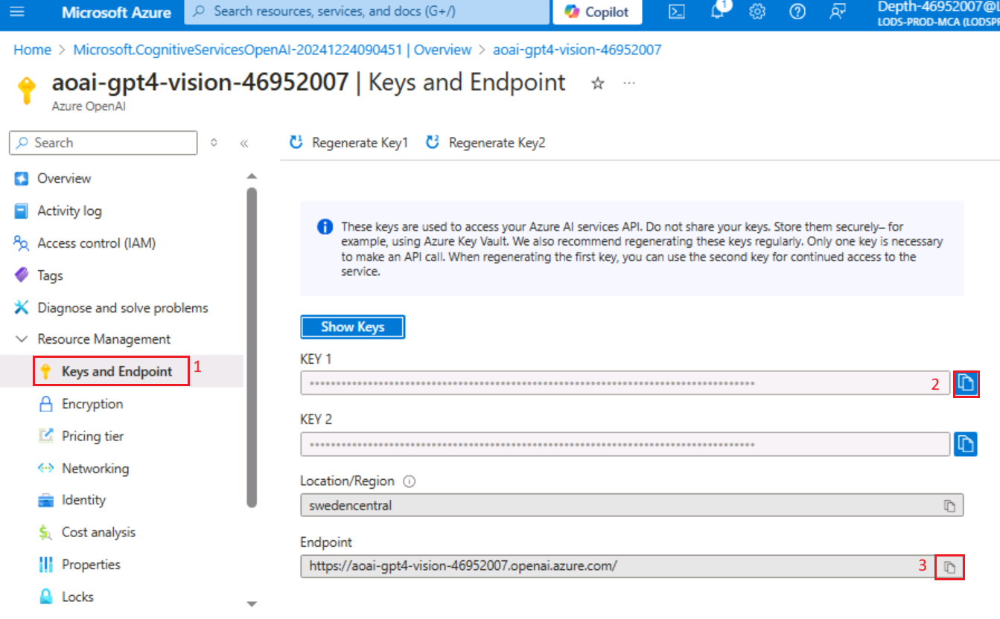
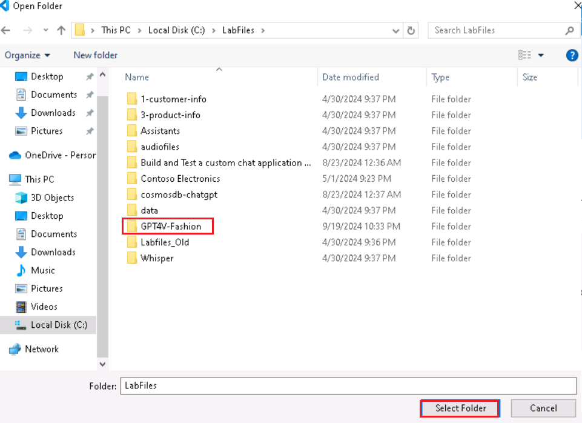
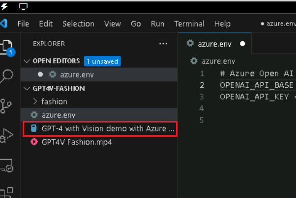
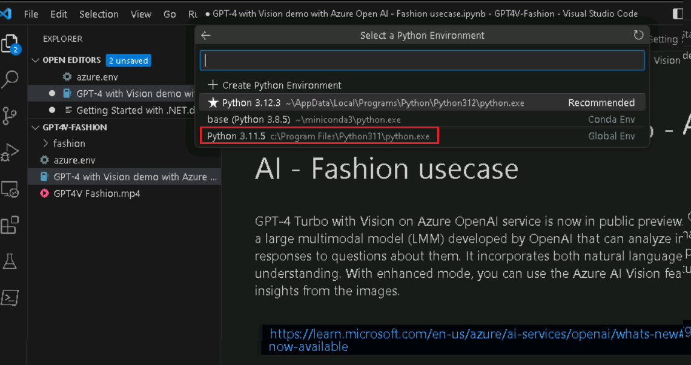
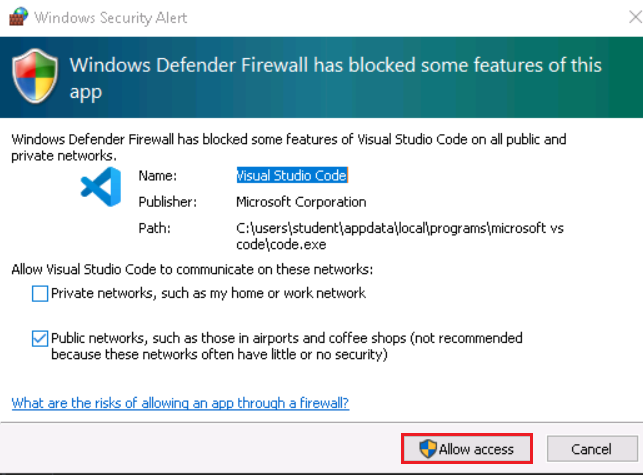
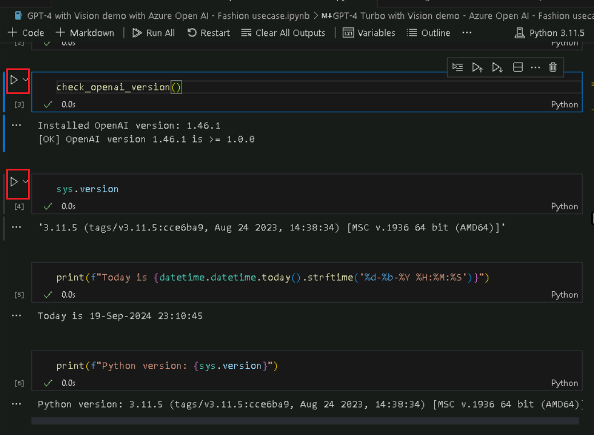
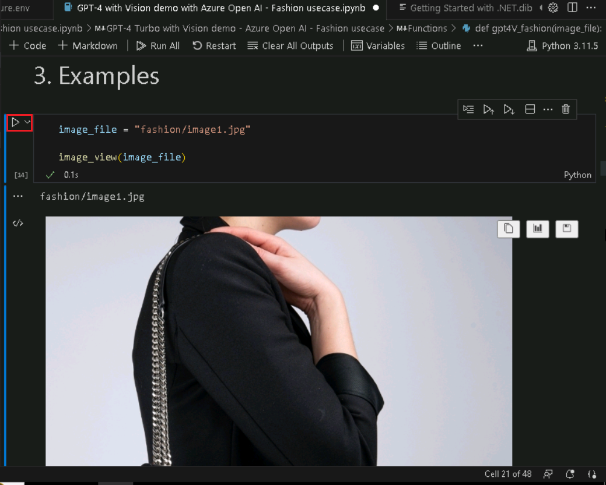
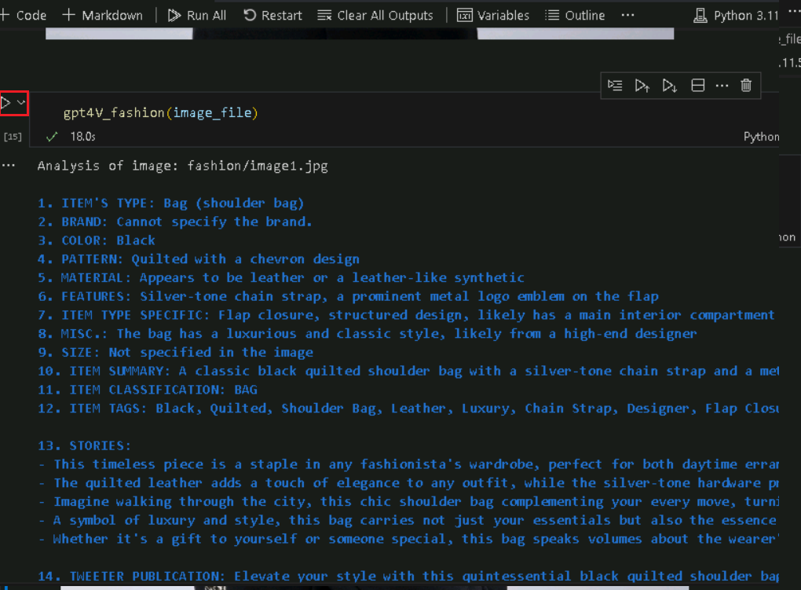
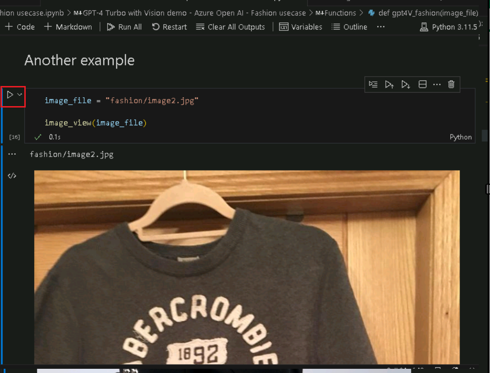
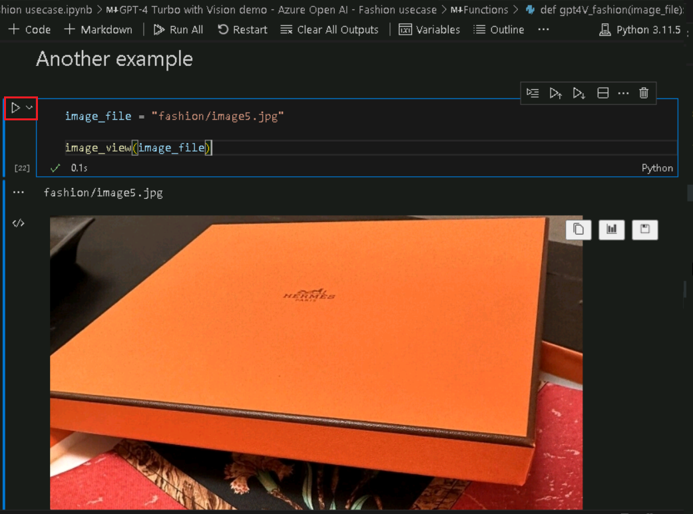

**Caso de uso 01 – Análise de tendências de moda com GPT-4 Turbo e
Vision no Azure OpenAI**

**Introdução:**

O serviço GPT-4 Turbo with Vision no Azure OpenAI agora está em
visualização pública. O GPT-4 Turbo with Vision é um Large Multimodal
Model (LMM) desenvolvido pela OpenAI que pode analisar imagens e
fornecer respostas textuais a perguntas sobre elas. Ele incorpora
processamento de linguagem natural e compreensão visual. Com o modo
avançado, você pode usar os recursos do Azure AI Vision para gerar
insights adicionais a partir das imagens.

**Objetivos:**

- Implementar recursos do Azure OpenAI e configurá-los.

- Implementar um modelo específico do Azure OpenAI como o GPT-4 Vision.

- Configurar seu ambiente de desenvolvimento com Python, Jupyter
  Notebook, e bibliotecas necessárias.

- Este caso de uso está relacionado a casos de uso de moda. Isso pode
  envolver análise de imagem, geração de texto ou outras tarefas de AI.

## Tarefa 0: Entender a VM e as credenciais

Nesta tarefa, identificaremos e entenderemos as credenciais que usaremos
em todo o laboratório.

1.  A guia de **Instructions** contém o guia do laboratório com as
    instruções a serem seguidas em todo o laboratório.

2.  A guia **Resources** tem as credenciais necessárias para executar o
    laboratório.

    - **URL** – URL para o portal do Azure

    - **Subscription** – Este é o ID da assinatura atribuída a você

    - **Username** – a ID de usuário com a qual você precisa fazer login
      nos serviços do Azure

    - **Password** – senha para o login do Azure. Vamos chamar esse nome
      de usuário e senha como credenciais de login do Azure. Usaremos
      essas credenciais sempre que mencionarmos as credenciais de login
      do Azure

    - **Resource Group** – o **grupo de recursos** atribuído a você

\[Alerta!\] **Importante:** certifique-se de criar todos os seus
recursos neste grupo de recursos

> 

3.  A guia **Help** tem a **Support information**. O valor de **ID**
    aqui é o **ID da instância do laboratório** que será usada durante a
    execução do laboratório.

> 

##  Tarefa 1: Registrar o provedor de serviços

1.  Abra um navegador, vá para +++https://portal.azure.com+++ e faça
    login com sua conta do Cloud Slice abaixo.

> Username: <+++@lab.CloudPortalCredential>(User1).Username+++
>
> Password: <+++@lab.CloudPortalCredential(User1).Password>+++
>
> 
>
> 

2.  Clique em **Subscriptions**

> 

3.  Clique no nome da assinatura.

> 

4.  Expanda **Settings** no menu de navegação à esquerda. Clique
    em **Resource providers**, insira
     +++**Microsoft.AlertsManagement+++** selecione-o e clique
    em **Register**.

5.  Clique em **Resource providers**,
    insira +++**Microsoft.DBforPostgreSQL+++** selecione-o e clique
    em **Register**.

6.  Repita as etapas 4 e 5 para registrar os seguintes provedores de
    recursos.

- Microsoft.Search

- Microsoft.Web

- Microsoft.ManagedIdentity

## **Tarefa 2: Criar um recurso Azure OpenAI** 

1.  No portal do Azure, clique no **menu** do portal representado por
    três barras horizontais no canto superior esquerdo da página,
    conforme mostrado na imagem abaixo.

> 

2.  Navegue e clique em **+ Create a resource**

> 

3.  Na página **Create a resource**, na barra de pesquisa **Search
    services and marketplace**, digite **Azure OpenAI**, em seguida,
    pressione **Enter**

> 

4.  Na página **Marketplace**, navegue até **Azure OpenAI**, clique no
    botão V ao lado de **Criar** e clique em **Azure OpenAI**, conforme
    mostrado na imagem abaixo.

> 

5.  Na janela **Create Azure OpenAI**, na guia **Basics,** insira os
    seguintes detalhes e clique no botão **Next**.

    1.  **Subscription**: Selecione a assinatura atribuída

    2.  **Resource group:** Selecione o grupo de recursos atribuído

    3.  **Region**: Para este laboratório, você usará um modelo
        **gpt-4-vision**. Este modelo está atualmente disponível apenas
        em [certain
        regions](https://learn.microsoft.com/azure/ai-services/openai/concepts/models#embeddings-models).
        Selecione uma região desta lista, neste laboratório **Sweden
        Central** está sendo usada para este recurso.

    4.  **Name**: **aoai-gpt4-visionXXXXX** (XXXXX pode ser o ID do
        laboratório)

    5.  **Pricing tier**: Selecione **Standard S0**

> **Observação**: para encontrar o ID do laboratório, selecione "Help" e
> copie o ID.
>
> 
>
> 
>
> 

6.  Na guia **Network**, deixe todos os botões de opção no estado padrão
    e clique em **Next**

> 

7.  Na guia **Tags**, deixe todos os campos no estado padrão e clique em
    **Next**

> 

8.  Na guia **Review + submit**, uma vez que a validação é aprovada,
    clique no botão **Create**

> 

9.  Aguarde a conclusão da implementação. A implementação levará cerca
    de 2 a 3 minutos.

10. Na janela **Microsoft.CognitiveServicesOpenAI**, após a conclusão da
    implementação, clique em **Go to resource**

> 

11. Clique em **Keys and Endpoints** no menu de navegação à esquerda e,
    em seguida, copie o valor do endpoint em um bloco de notas para
    **AzureAI ENDPOINT** e a chave para uma variável **AzureAIKey**.

> 

12. Na janela **aoai-gpt4-visionXX**, clique em **Overview** no menu de
    navegação do lado esquerdo, role para baixo até **Get Started** e
    clique em **Go to AzureOpenAI Studio** conforme mostrado na imagem
    abaixo para abrir o **Azure OpenAI Studio** em um novo navegador.

## **Task 3: Implementando um modelo Azure OpenAI gpt-4-vision**

1.  Na página inicial do **Azure AI Foundry | Azure Open AI Service**,
    navegue até a seção **Components** e clique em **Deployments**

2.  Na janela **Deployments**, abra o menu suspenso **+Deploy model** e
    selecione **Deploy base model**

3.  Na caixa de diálogo **Select a model**, navegue e selecione
    cuidadosamente **gpt-4**, em seguida, clique no botão **Confirm**

4.  Na caixa de diálogo **Deploy model gpt-4**, sob o campo **Deployment
    name**, certifique-se que **gpt-4** está selecionado, selecione o
    **Deployment type** como **Standard** e **selecione Model version**
    como **vision- preview**. Em seguida, clique no botão **Deploy**

## Tarefa 4: Demonstração do GPT-4 Turbo with Vision

1.  Na caixa de pesquisa do Windows, digite Visual Studio e clique em
    **Visual Studio Code**.

> 

2.  No editor **Visual Studio Code**, clique em **File**, em seguida,
    navegue e clique em **Open Folder**...

> 

3.  Navegue e selecione a pasta **GPT4V-Fashion** em **C:\LabFiles** e
    clique no botão **Select Folder**

4.  Se você vir uma caixa de diálogo: **Do you trust the authors of the
    files in this folder?**, clique em **Yes, I trust the authors**

5.  No menu suspenso do Visual Studio Code no **Gpt 4V-FASHION,** clique
    no arquivo **azure.env**

1.  Atualize os parâmetros, substitua **Azure OpenAI Endpoint, Azure
    OpenAI Key** (os valores que você salvou no bloco de notas na
    **Tarefa 1)** e salve o arquivo.

2.  No menu suspenso do Visual Studio Code, o **GPT 4V-FASHION** e
    selecione o notebook **GPT-4 with Vision demo with Azure Open AI -
    Fashion usecase.ipynb**

> 

3.  Na página principal do editor do Visual Studio Code, role para baixo
    até **install requirements** e execute a 1ª célula. Se solicitado a
    selecionar o ambiente, selecione **Python Environments** como
    mostrado na imagem.

> 
>
> 

4.  Se solicitado a selecionar o caminho, selecione **Python version
    3.11.5** como mostrado na imagem.

> 

5.  Se você vir uma caixa de diálogo de alerta de segurança do Windows,
    clique em **Allow access**

> 
>
> 
>
> 
>
> 

6.  Para reiniciar o kernel Jupyter, clique em **Restart**

> 

7.  Para importar as bibliotecas, selecione a **4ª** célula. Em seguida,
    execute a célula clicando no **ícone iniciar**.

> 

8.  Selecione a **5ª** célula. Em seguida, execute a célula clicando no
    **ícone iniciar**.

> 

9.  Para verificar as versões do sistema OpenAI, selecione as 6ª, 7ª, 8ª
    e 9ª células. Em seguida, execute as células clicando no **ícone
    iniciar**.

> 

10. Para carregar os valores de configuração, selecione e execute as
    10ª, 11ª e 12ª células clicando no botão **Play**

> 

11. Defina uma função auxiliar para criar incorporações, selecione e
    execute as 13ª e 14ª células clicando no botão **Play**

> 

12. Para executar o exemplo, selecione e execute as 15ª e 16ª células
    clicando no botão **Play**

> 
>
> 

13. Para executar o exemplo, selecione e execute as células 17 e 18
    clicando no botão **Play**

> 

14. Para executar o exemplo, selecione e execute as células 19 e 20
    clicando no botão **Play**

> 

15. Para executar o exemplo, selecione e execute as 21ª e 22ª células
    clicando no botão **Play**

> 
>
> 

16. Para executar o exemplo, selecione e execute as células 23 e 24
    clicando no botão **Play**

17. Para executar o exemplo, selecione e execute as **células 25 e 26**
    clicando no botão **Play**

> 
>
> 

18. Para executar o exemplo, selecione e execute as **células 27 e 28**
    clicando no botão **Play**

> 
>
> 

19. Para executar o exemplo, selecione e execute as **células 27 e 28**
    clicando botão **Play**

> 
>
> 

20. Para gerar o WebApp, selecione e execute a célula **29ª** clicando
    no botão **Play**

> 

21. Para gerar o WebApp, selecione e execute a **30ª** célula clicando
    no botão **Play**

> 

22. Depois que o aplicativo for implantado com sucesso, você verá uma
    URL exibida no terminal. Copie a **URL**

23. Abra seu navegador, navegue até a barra de endereços, cole o link da
    URL pública. 

24. Abra seu navegador, navegue até a barra de endereço, cole o link da
    URL local. Selecione qualquer item

25. Clique em **Submit**.

> 

## Tarefa 5: Excluir os recursos

1.  Para excluir a conta de armazenamento, navegue até a página **Azure
    portal Home**, clique em **Resource groups**.

> 

2.  Clique no grupo de recursos **ResourceGroup1**.

> 

3.  Na página inicial do **Resource group**, selecione o ícone
    **Delete**

4.  No painel **Delete Resources** que aparece no lado direito, navegue
    até o campo **Enter “delete” to confirm deletion**, em seguida,
    clique no botão **Delete**

5.  Caixa de diálogo **Delete confirmation**, clique no botão **Delete**

> 

6.  Clique no ícone de sino, você verá a notificação: **Deleted resource
    group AOAI-RG89.**

**Resumo**

Neste laboratório prático, os participantes se aprofundam em recursos
avançados de AI usando o Azure OpenAI. Começando com a configuração de
recursos essenciais do Azure, eles implantam modelos de AI como
GPT-4-vision. O laboratório explora especificamente como o GPT-4,
equipado com recursos de visão, pode revolucionar as tarefas
relacionadas à moda - pense em reconhecimento de imagem, recomendações
de estilo personalizadas e análise de tendências.
