**Einleitung**

In diesem Lab erfahren Sie, wie Sie Azure-AI-Dienste in PostgreSQL
integrieren, um Ihre Datenbank mit erweiterten AI-Funktionen zu
erweitern. Durch die Nutzung der Leistungsfähigkeit von Azure OpenAI-
und PostgreSQL-Erweiterungen wie pgvector und PostGIS ermöglichen Sie
ausgefeilte Textanalysen, Vektorähnlichkeitssuchen und geospatial
Abfragen direkt in Ihrer Datenbank. Dieses Lab führt Sie durch die
Bereitstellung der erforderlichen Azure-Ressourcen, die Konfiguration
Ihrer Datenbank und das Ausführen komplexer Abfragen, die AI-gesteuerte
Erkenntnisse mit Geospatial-Daten kombinieren.**Ziele**

- Zum Bereitstellen und Konfigurieren von Azure Database for PostgreSQL
  Flexible Server.

- Zum Erstellen und Verwalten von Vektoreinbettungen mithilfe des Azure
  OpenAI-Diensts.

- Um Vektorähnlichkeitssuchen durchzuführen, um semantisch ähnliche
  Textdaten zu finden.

- Um die Erweiterung PostGIS für die Analyse von Geospatial-Daten zu
  nutzen.

- Integrieren von Azure AI Language Services für die Sentimentanalyse
  und andere kognitive Funktionen.

- Optimieren und Analysieren der Abfrageleistung mithilfe von
  Indizierungs- und Abfrageplanungstools.

# Übung 1: Bereitstellen eines flexiblen Azure Database for PostgreSQL-Servers

1.  

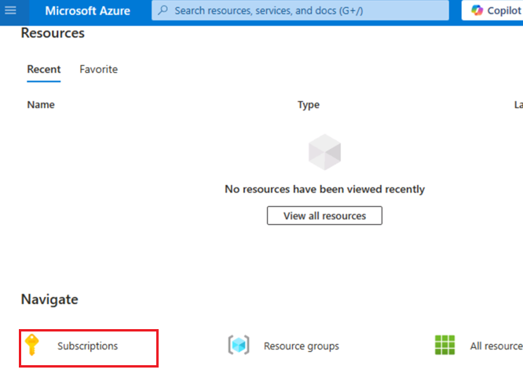

## Aufgabe 1: Bereitstellen eines flexiblen Azure Database for PostgreSQL-Servers

1.  Öffnen Sie Ihren Browser, navigieren Sie zur Adressleiste, geben Sie
    die folgende URL ein oder fügen Sie sie ein: +++
    https://portal.azure.com/++++++ und drücken Sie dann die
    **Enter**-Taste.

> 

2.  Verwenden Sie im **Microsoft Azure**-Fenster die
    **User-Credentials**, um sich bei Azure anzumelden.

3.  Geben Sie dann das Passwort ein und klicken Sie auf die Schaltfläche
    **Sign-in.**

> 

4.  Im Fenster **Stay signed in?**,klicken Sie auf die Schaltfläche
    **Yes**.

> 

5.  Wählen Sie auf der Symbolleiste des Azure-Portals das **Cloud
    Shell**-Symbol aus, um oben im Browserfenster einen neuen Cloud
    Shell-Bereich [zu öffnen
    .](https://learn.microsoft.com/azure/cloud-shell/overview)

6.  Wenn Sie Cloud Shell zum ersten Mal öffnen, werden Sie
    möglicherweise aufgefordert, den Typ der Shell auszuwählen, die Sie
    verwenden möchten (**Bash** oder **PowerShell**). Wählen Sie
    **Bash** aus.

7.  Wählen Sie im Dialogfeld **Getting started** die Option **Mount
    storage account** und dann Ihr Azure-Abonnement aus. Klicken Sie auf
    die Schaltfläche **Apply.**

8.  Wählen Sie im Dialogfeld **" Mount storage account** " die Option
    **" we will create a storage account for you "** aus, und klicken
    Sie auf die Schaltfläche **"Next**".

> 
>
> 

1.  Führen Sie an der Cloud Shell-Prompt die folgenden Befehle aus, um
    Variablen zum Erstellen von Ressourcen zu definieren. Die Variablen
    stellen die Namen dar, die Ihrer Ressourcengruppe und Datenbank
    zugewiesen werden sollen, und geben die Azure-Region an, in der
    Ressourcen bereitgestellt werden sollen.

2.  Der angegebene Name der Ressourcengruppe lautet
    **rg-postgresql-labs**, aber Sie können einen beliebigen Namen
    angeben, den Sie zum Hosten der Ressourcen verwenden möchten, die
    diesem Lab zugeordnet sind.

> **+++ RG_NAME=ResourceGroup1**
>
> 

3.  Ersetzen Sie im Datenbanknamen das Token {SUFFIX} durch einen
    eindeutigen Wert, z. B. Ihre Initialen, um sicherzustellen, dass der
    Name des Datenbankservers global eindeutig ist.

> **+++DATABASE_NAME=pgsql-flex-{SUFFIX}+++**

4.  Ersetzen Sie die Region durch einen beliebigen Speicherort, den Sie
    für Lab-Ressourcen verwenden möchten. In diesem Lab verwenden wir
    eastus

> **+++REGION=eastus2+++**

5.  Stellen Sie eine Azure Database for PostgreSQL-Datenbankinstanz
    innerhalb der Ressourcengruppe bereit, die Sie oben erstellt haben,
    indem Sie den folgenden Azure CLI-Befehl ausführen (10 Min.)

**az postgres flexible-server create --name $DATABASE_NAME --location
$REGION --resource-group $RG_NAME \\**

**--admin-user s2admin --admin-password Seattle123Seattle123
--database-name airbnb \\**

**--public-access 0.0.0.0-255.255.255.255 --version 16 \\**

**--SKU-Name Standard_D2s_v3 --storage-size 32 --yes**

## Aufgabe 2: Herstellen einer Verbindung mit der Datenbank mithilfe von psql in der Azure Cloud Shell

In dieser Aufgabe verwenden Sie das [Befehlszeilenprogramm
psql](https://www.postgresql.org/docs/current/app-psql.html) aus Azure
[Cloud Shell](https://learn.microsoft.com/azure/cloud-shell/overview),
um eine Verbindung mit Ihrer Datenbank herzustellen.

1.  Öffnen Sie einen Browser, wechseln Sie zu https://portal.azure.com,
    und melden Sie sich mit Ihrem Azure-Abonnementkonto an.

2.  Klicken Sie auf der Startseite auf **Resource Groups**.

3.  Klicken Sie auf den Namen Ihrer Ressourcengruppe.

> 

4.  Wählen Sie in der Ressourcengruppe die Ressource **PostgreSQL
    Flexible Server** aus

5.  Wählen Sie im linken Navigationsmenü unter **Settings** die Option
    **Connect** aus.

6.  Wählen Sie im Azure-Portal auf der Seite **Connect** der Datenbank
    die Option **airbnb** als **Database name** aus, kopieren Sie dann
    den Block **Connection details**, und fügen Sie ihn in den Editor
    ein, um die Informationen in den anstehenden Aufgaben zu verwenden.

> 

7.  Klicken Sie auf der Startseite von Azure Database for PostgresSQL im
    linken Navigationsmenü auf **Overview**, kopieren Sie den
    Servernamen, und fügen Sie ihn in Editor ein, und **speichern Sie**
    dann den Editor, um die Informationen im nächsten Lab zu verwenden.

8.  Wählen Sie auf der Startseite von Azure Database for PostgreSQL
    unter Einstellungen die Option **Networking** aus, und wählen Sie
    **Allow public access to this resource through the internet using a
    public IP address** aus. Klicken Sie auf die Schaltfläche **Save**.

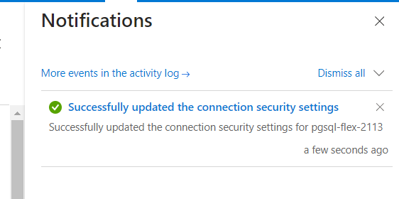

9.  Wählen Sie auf der Symbolleiste des Azure-Portals das **Cloud
    Shell-Symbol** aus, um oben im Browserfenster einen neuen Cloud
    Shell-Bereich [zu öffnen
    .](https://learn.microsoft.com/azure/cloud-shell/overview)

10. Fügen Sie **Connection details** in Cloud Shell ein.

11. Ersetzen Sie an der Cloud Shell-Prompt das Token **{your_password}**
    durch das Passwort, das Sie dem Benutzer **s2admin** beim Erstellen
    Ihrer Datenbank zugewiesen haben. Das Passwort sollte
    **Seattle123Seattle123** lauten.

> 

12. Stellen Sie mithilfe des Befehlszeilenprogramms psql eine Verbindung
    zu Ihrer Datenbank her, indem Sie an der Prompt Folgendes eingeben:

> **+++psql+++**

Um eine Verbindung mit der Datenbank über Cloud Shell herzustellen, muss
das Kontrollkästchen Allow public access from any Azure service within
Azure to the server auf der Seite **Networking** der Datenbank aktiviert
sein. Wenn Sie eine Meldung erhalten, dass Sie keine Verbindung
herstellen können, überprüfen Sie bitte, ob diese Option aktiviert ist,
und versuchen Sie es erneut.

## Aufgabe 3: Hinzufügen von Daten zur Datenbank

Mit der psql-Prompt erstellen Sie Tabellen und füllen sie mit Daten für
die Verwendung im Lab.

1.  Führen Sie die folgenden Befehle aus, um temporäre Tabellen zum
    Importieren von JSON-Daten aus einem öffentlichen Blob Storage-Konto
    zu erstellen.

!!CREATE TABLE temp_calendar (data jsonb);

CREATE TABLE temp_listings (data jsonb);

CREATE TABLE temp_reviews (data jsonb);!!

2.  Füllen Sie jede temporäre Tabelle mit dem Befehl COPY mit Daten aus
    JSON-Dateien in einem öffentlichen Speicherkonto auf.

+++\COPY temp_calendar (data) FROM PROGRAM 'curl
https://solliancepublicdata.blob.core.windows.net/ms-postgresql-labs/calendar.json'+++

!!\COPY temp_listings (data) FROM PROGRAM 'curl
https://solliancepublicdata.blob.core.windows.net/ms-postgresql-labs/listings.json'!!

\COPY temp_reviews (data) FROM PROGRAM 'curl
https://solliancepublicdata.blob.core.windows.net/ms-postgresql-labs/reviews.json'

3.  Führen Sie den folgenden Befehl aus, um die Tabellen zum Speichern
    von Daten in der von diesem Lab verwendeten Form zu erstellen:

CREATE TABLE listings (

> listing_id int,
>
> name varchar(50),
>
> street varchar(50),
>
> city varchar(50),
>
> state varchar(50),
>
> country varchar(50),
>
> zipcode varchar(50),
>
> bathrooms int,
>
> bedrooms int,
>
> latitude decimal(10,5),
>
> longitude decimal(10,5),
>
> summary varchar(2000),
>
> description varchar(2000),
>
> host_id varchar(2000),
>
> host_url varchar(2000),
>
> listing_url varchar(2000),
>
> room_type varchar(2000),
>
> amenities jsonb,
>
> host_verifications jsonb,
>
> data jsonb
>
> );
>
> 
>
> CREATE TABLE reviews (
>
> id int,
>
> listing_id int,
>
> reviewer_id int,
>
> reviewer_name varchar(50),
>
> date date,
>
> comments varchar(2000)
>
> );
>
> CREATE TABLE calendar (
>
> listing_id int,
>
> date date,
>
> price decimal(10,2),
>
> available boolean
>
> );
>
> 

4.  Führen Sie abschließend die folgenden INSERT INTO-Anweisungen aus,
    um Daten aus den temporären Tabellen in die Haupttabellen zu laden
    und Daten aus dem JSON-Datenfeld in einzelne Spalten zu extrahieren:

> INSERT INTO listings
>
> SELECT
>
> data\['id'\]::int,
>
> replace(data\['name'\]::varchar(50), '"', ''),
>
> replace(data\['street'\]::varchar(50), '"', ''),
>
> replace(data\['city'\]::varchar(50), '"', ''),
>
> replace(data\['state'\]::varchar(50), '"', ''),
>
> replace(data\['country'\]::varchar(50), '"', ''),
>
> replace(data\['zipcode'\]::varchar(50), '"', ''),
>
> data\['bathrooms'\]::int,
>
> data\['latitude'\]::decimal(10,5),
>
> data\['longitude'\]::decimal(10,5),
>
> replace(data\['description'\]::varchar(2000), '"', ''),
>
> replace(data\['summary'\]::varchar(2000), '"', ''),
>
> replace(data\['host_id'\]::varchar(50), '"', ''),
>
> replace(data\['host_url'\]::varchar(50), '"', ''),
>
> replace(data\['listing_url'\]::varchar(50), '"', ''),
>
> replace(data\['room_type'\]::varchar(50), '"', ''),
>
> data\['amenities'\]::jsonb,
>
> data\['host_verifications'\]::jsonb,
>
> data::jsonb
>
> FROM temp_listings;
>
> INSERT INTO reviews
>
> SELECT
>
> data\['id'\]::int,
>
> data\['listing_id'\]::int,
>
> data\['reviewer_id'\]::int,
>
> replace(data\['reviewer_name'\]::varchar(50), '"', ''),
>
> to_date(replace(data\['date'\]::varchar(50), '"', ''), 'YYYY-MM-DD'),
>
> replace(data\['comments'\]::varchar(2000), '"', '')
>
> FROM temp_reviews;
>
> INSERT INTO calendar
>
> SELECT
>
> data\['listing_id'\]::int,
>
> to_date(replace(data\['date'\]::varchar(50), '"', ''), 'YYYY-MM-DD'),
>
> data\['price'\]::decimal(10,2),
>
> replace(data\['available'\]::varchar(50), '"', '')::boolean
>
> FROM temp_calendar;

# Übung 2: Hinzufügen von Azure AI- und Vector-Erweiterungen zur Zulassungsliste

In diesem Lab verwenden Sie die [Erweiterungen
azure_ai](https://learn.microsoft.com/azure/postgresql/flexible-server/generative-ai-azure-overview)
und
[pgvector](https://learn.microsoft.com/azure/postgresql/flexible-server/how-to-use-pgvector),
um Ihrer PostgreSQL-Datenbank generative AI-Funktionen hinzuzufügen. In
dieser Übung fügen Sie diese Erweiterungen der *Zulassungsliste* Ihres
Servers hinzu, wie unter [Verwenden von
PostgreSQL-Erweiterungen](https://learn.microsoft.com/azure/postgresql/flexible-server/concepts-extensions#how-to-use-postgresql-extensions)
beschrieben.

1.  Klicken Sie auf der Startseite auf **Resource Groups**.

2.  Klicken Sie auf den Namen Ihrer Ressourcengruppe.

> 

3.  Wählen Sie in der Ressourcengruppe die Ressource **PostgreSQL
    Flexible Server** aus

4.  Wählen Sie im linken Navigationsmenü der Datenbank unter
    **Settings** die Option **Server parameters** aus, und geben Sie
    dann azure.extensions in das Suchfeld ein. Erweitern Sie die
    Dropdown-Liste **VALUE**, suchen und aktivieren Sie das
    Kontrollkästchen neben jeder der folgenden Erweiterungen:

    - AZURE_AI

    - POSTGIS (Beachten Sie, dass dies bereits überprüft wird, wenn Sie
      Lab 3 abgeschlossen haben.)

    - VECTOR

5.  Wählen Sie auf der Symbolleiste **Save** aus, um eine Bereitstellung
    in der Datenbank auszulösen.

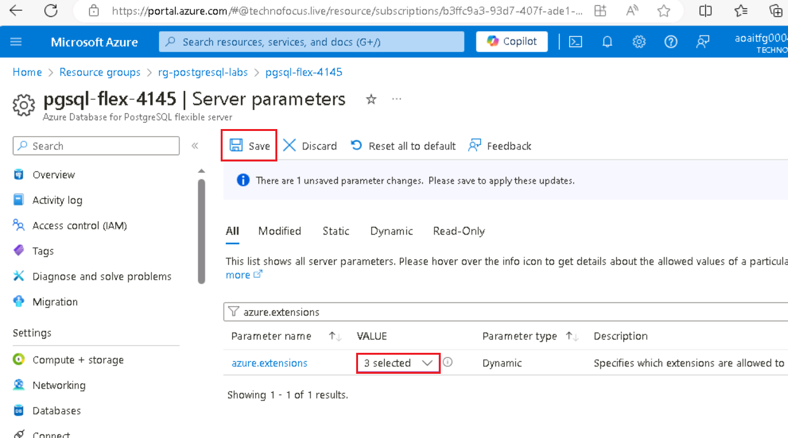

# Übung 3: Erstellen einer Azure OpenAI-Ressource

Für die azure_ai Erweiterung ist ein zugrunde liegender Azure
OpenAI-Dienst erforderlich, um Vektoreinbettungen zu erstellen. In
dieser Übung stellen Sie eine Azure OpenAI-Ressource im Azure-Portal
bereit und stellen ein Einbettungsmodell in diesen Dienst bereit.

## Aufgabe 1: Bereitstellen eines Azure OpenAI-Diensts

In dieser Aufgabe erstellen Sie einen neuen Azure OpenAI-Dienst.

1.  Klicken Sie auf der Startseite des Azure-Portals auf das **Azure
    Portal Menu,** das durch drei horizontale Balken auf der linken
    Seite der Microsoft Azure-Befehlsleiste dargestellt wird, wie in der
    folgenden Abbildung gezeigt.

> 

2.  Navigieren Sie und klicken Sie auf **+ Create a resource**.

> 

3.  Geben Sie auf der Seite **Create a resource** in der Suchleiste
    **Search services and marketplace** den Namen **Azure OpenAI** ein,
    und drücken Sie dann die **Enter**-Taste.

> 

4.  Navigieren Sie auf der Seite **Marketplace** zum Abschnitt **Azure
    OpenAI**, klicken Sie auf die Dropdownliste Schaltfläche Erstellen,
    und wählen Sie dann **Azure OpenAI** aus, wie im Bild gezeigt.
    (Falls Sie bereits auf die Schaltfläche **Azure OpenAI**-Kachel, und
    klicken Sie dann auf der **Azure OpenAI-**Seite auf die Schaltfläche
    **Create**.

> 

5.  Geben Sie auf der Registerkarte Azure OpenAI-**Basics** erstellen
    die folgenden Informationen ein, und klicken Sie auf die
    Schaltfläche **Next**.

[TABLE]

> 

6.  Lassen Sie auf der Registerkarte **Network** alle Optionsfelder im
    Standardzustand und klicken Sie auf die Schaltfläche **Next**.

> 

7.  Lassen Sie auf der Registerkarte **Tags** alle Felder im
    Standardzustand und klicken Sie auf die Schaltfläche **Next**.

> 

8.  Klicken Sie auf der Registerkarte **Review+Submit**, sobald die
    Validierung bestanden ist, auf die Schaltfläche **Create**.

9.  Warten Sie, bis die Bereitstellung abgeschlossen ist. Die
    Bereitstellung dauert ca. 2-3 Minuten.

> **Hinweis**: Wenn Sie eine Meldung sehen, dass der Azure OpenAI-Dienst
> derzeit über ein Anwendungsformular für Kunden verfügbar ist. Das
> ausgewählte Abonnement wurde für den Dienst nicht aktiviert und
> verfügt nicht über ein Kontingent für Tarife. Sie müssen auf den Link
> klicken, um Zugriff auf den Azure OpenAI-Dienst anzufordern, und das
> Anforderungsformular ausfüllen.

## Aufgabe 2: Abrufen des Schlüssels und Endpunkts des Azure OpenAI-Diensts

1.  Wählen Sie auf der Seite **Overview** der Ressource die Schaltfläche
    **Go to resource** aus. Wenn Sie dazu aufgefordert werden, wählen
    Sie die Lab-Anmeldeinformationen aus:

2.  Navigieren Sie in Ihrem **Azure OpenAI-Home** Fenster zum Abschnitt
    **Resource Management**, und klicken Sie auf **Keys and Endpoints**.

3.  Kopieren Sie auf der Seite **Keys and Endpoints** die Werte **KEY1,
    KEY 2** und **Endpoint,** fügen Sie sie in einen Editor ein, wie in
    der folgenden Abbildung gezeigt, und **speichern Sie** dann den
    Editor, um die Informationen in den anstehenden Aufgaben zu
    verwenden.

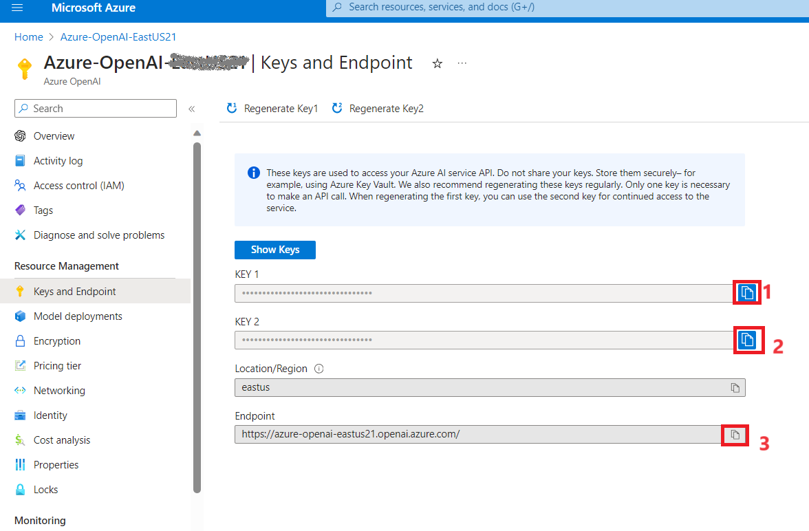

***Hinweis:** Sie können entweder KEY1 oder KEY2 verwenden. Wenn Sie
immer zwei Schlüssel haben, können Sie Schlüssel sicher rotieren und neu
generieren, ohne dass es zu einer Dienstunterbrechung kommt*.

## Aufgabe 3: Bereitstellen eines Einbettungsmodells

Die Erweiterung azure_ai ermöglicht die Erstellung von
Vektoreinbettungen aus Text. Zum Erstellen dieser Einbettungen ist ein
bereitgestelltes text-embedding-ada-002-Modell (Version 2) in Ihrem
Azure OpenAI-Dienst erforderlich. In dieser Aufgabe verwenden Sie Azure
OpenAI Studio, um eine Modellbereitstellung zu erstellen, die Sie
verwenden können.

1.  Klicken Sie auf der **Azure OpenAI**-Seite im linken Navigationsmenü
    auf **Overview**, scrollen Sie nach unten und klicken Sie auf die
    Schaltfläche **Go to Azure OpenAI Studio**, wie in der folgenden
    Abbildung gezeigt.

> 
>
> 

2.  In der **Azure AI Foundry | Azure Open AI Service**-Startseite,
    navigieren Sie zum Abschnitt **Components**, und klicken Sie auf
    **Deployments**.

3.  Öffnen Sie im Fenster **Deployments** das **+Deploy-Model,** und
    wählen Sie **Deploy base model** aus

4.  Navigieren Sie im Dialogfeld **Select a model** zu
    **text-embedding-ada-002** und klicken Sie dann auf die Schaltfläche
    **Confirm**.

4.  Legen Sie im Dialogfeld **Deploy model** Folgendes fest, und wählen
    Sie **Create** aus , um das Modell bereitzustellen.

    - **Modell auswählen**: Wählen Sie **text-embedding-ada-002** aus
      der Liste aus.

    - **Modellversion**: Stellen Sie sicher, dass **2 (Default)**
      ausgewählt ist.

    - **Name der Bereitstellung**: Geben Sie +++ **embeddings** +++ ein.

> 
>
> 

5.  Kopieren Sie im Fenster **Deployments** den **Deployment name**,
    fügen Sie ihn in einen Editor ein (wie in der Abbildung gezeigt),
    und **speichern Sie** dann den Editor, um die Informationen in der
    bevorstehenden Aufgabe zu verwenden.

# Übung 4: Installieren und Konfigurieren der Erweiterung "azure_ai"

In dieser Übung installieren Sie die azure_ai Erweiterung in Ihrer
Datenbank und konfigurieren sie so, dass sie eine Verbindung mit Ihrem
Azure OpenAI-Dienst herstellt.

## Aufgabe 1: Herstellen einer Verbindung mit der Datenbank mithilfe von psql in Azure Cloud Shell

In dieser Aufgabe verwenden Sie das Befehlszeilenprogramm psql aus Azure
Cloud Shell, um eine Verbindung mit Ihrer Datenbank herzustellen.

1.  Wählen Sie auf der Symbolleiste des Azure-Portals das **Cloud
    Shell**-Symbol aus, um oben im Browserfenster einen neuen Cloud
    Shell-Bereich [zu
    öffnen.](https://learn.microsoft.com/azure/cloud-shell/overview)

2.  **Connection details** in Cloud Shell einfügen.

3.  Ersetzen Sie an der Cloud Shell-Prompt das Token **{your_password}**
    durch das Passwort, das Sie dem Benutzer **s2admin** beim Erstellen
    Ihrer Datenbank zugewiesen haben. Das Passwort sollte
    **Seattle123Seattle123** lauten.

4.  Stellen Sie mithilfe des Befehlszeilenprogramms psql eine Verbindung
    zu Ihrer Datenbank her, indem Sie an der Prompt Folgendes eingeben:

> **!! psql!!**

## Aufgabe 2: Installieren der azure_ai Erweiterung

Mit der Erweiterung azure_ai können Sie Azure OpenAI und Azure Cognitive
Services in Ihre Datenbank integrieren. Um die Erweiterung in Ihrer
Datenbank zu aktivieren, führen Sie die folgenden Schritte aus:

1.  Stellen Sie sicher, dass die Erweiterung erfolgreich zur
    Zulassungsliste hinzugefügt wurde, indem Sie an der psql-Prompt
    Folgendes ausführen :

> **!! SHOW azure.extensions;!!**

2.  Installieren Sie die Erweiterung azure_ai mit dem Befehl [CREATE
    EXTENSION](https://www.postgresql.org/docs/current/sql-createextension.html).

> **!!CREATE EXTENSION IF NOT EXISTS azure_ai;!!**

## Aufgabe 3: Überprüfen der in der azure_ai-Erweiterung enthaltenen Objekte

Das Überprüfen der Objekte in der azure_ai Erweiterung kann zu einem
besseren Verständnis ihrer Funktionen führen. In dieser Aufgabe
überprüfen Sie die verschiedenen Schemas, benutzerdefinierten Funktionen
(User-Defined Functions, UDFs) und zusammengesetzten Typen, die der
Datenbank durch die Erweiterung hinzugefügt wurden.

1.  Sie können den Metabefehl [\dx an
    der](https://www.postgresql.org/docs/current/app-psql.html#APP-PSQL-META-COMMAND-DX-LC)
    **psql** -Prompt verwenden, um die in der Erweiterung enthaltenen
    Objekte aufzulisten.

> **+++\dx+ azure_ai+++**
>
> 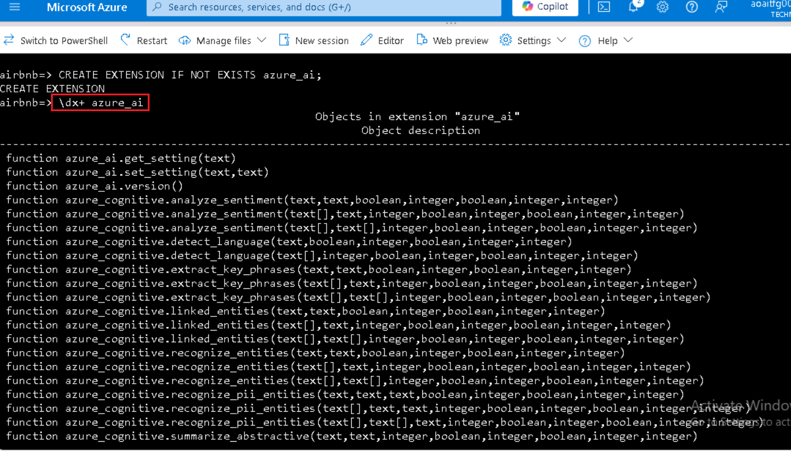
>
> 
>
> Die Ausgabe des Metabefehls zeigt, dass die azure_ai Erweiterung drei
> Schemas, mehrere benutzerdefinierte Funktionen (User-Defined
> Functions, UDFs) und mehrere zusammengesetzte Typen in der Datenbank
> erstellt. In der folgenden Tabelle sind die von der Erweiterung
> hinzugefügten Schemas aufgeführt und beschrieben.

[TABLE]

2.  Die Funktionen und Typen sind alle mit einem der Schemas verknüpft.
    Um die im azure_ai Schema definierten Funktionen zu überprüfen,
    verwenden Sie den Metabefehl \df und geben Sie das Schema an, dessen
    Funktionen angezeigt werden sollen. Mit dem \x auto -Befehl vor \df
    kann die erweiterte Anzeige bei Bedarf automatisch angewendet
    werden, damit die Ausgabe des Befehls in Azure Cloud Shell leichter
    angezeigt werden kann.

> **!!\x auto!!**
>
> **\df+ azure_ai.\***

Mit der Funktion azure_ai.set_setting() können Sie den Endpunkt und die
Schlüsselwerte für Azure AI Services festlegen. Er akzeptiert einen
**Schlüssel** und den **Wert**, dem er zugewiesen werden soll. Die
Funktion azure_ai.get_setting() bietet eine Möglichkeit, die Werte
abzurufen, die Sie mit der Funktion set_setting() festgelegt haben . Es
akzeptiert den **Schlüssel** der Einstellung, die Sie anzeigen möchten.
Für beide Methoden muss der Schlüssel einer der folgenden sein:

## Aufgabe 4: Festlegen des Azure OpenAI-Endpunkts und -Schlüssels

Bevor Sie die azure_openai-Funktionen verwenden, konfigurieren Sie die
Erweiterung für Ihren Azure OpenAI-Dienstendpunkt und -Schlüssel.

1.  Ersetzen Sie im folgenden Befehl die Token {endpoint} und {api-key}
    durch Werte, die Sie aus dem Azure-Portal abgerufen haben, und
    führen Sie dann die Befehle an der psql-Prompt im Cloud
    Shell-Bereich aus, um Ihre Werte der Konfigurationstabelle
    hinzuzufügen.

> **!! SELECT
> azure_ai.set_setting('azure_openai.endpoint','{endpoint}');**
>
> **SELECT azure_ai.set_setting('azure_openai.subscription_key',
> '{api-key}');!!**

2.  Überprüfen Sie die in der Konfigurationstabelle geschriebenen
    Einstellungen mit den folgenden Abfragen:

> +++SELECT azure_ai.get_setting('azure_openai.endpoint');

SELECT azure_ai.get_setting('azure_openai.subscription_key');+++

Die azure_ai-Erweiterung ist jetzt mit Ihrem Azure OpenAI-Konto
verbunden und kann Vektoreinbettungen generieren.

# Übung 5: Generieren von Vektoreinbettungen mit Azure OpenAI

Das azure_openai Schema der azure_ai-Erweiterung ermöglicht es Azure
OpenAI, Vektoreinbettungen für Textwerte zu erstellen. Mithilfe dieses
Schemas können Sie [Einbettungen mit Azure
OpenAI](https://learn.microsoft.com/azure/ai-services/openai/how-to/embeddings)
direkt aus der Datenbank generieren, um Vektordarstellungen von
Eingabetext zu erstellen, die dann in Vektorähnlichkeitssuchen verwendet
und von Machine Learning-Modellen genutzt werden können.

[Einbettungen](https://learn.microsoft.com/azure/postgresql/flexible-server/generative-ai-overview#embeddings)
sind ein Konzept des maschinellen Lernens und der Verarbeitung
natürlicher Sprache (NLP), bei dem Objekte wie Wörter, Dokumente oder
Entitäten als
[Vektoren](https://learn.microsoft.com/azure/postgresql/flexible-server/generative-ai-overview#vectors)
in einem mehrdimensionalen Raum dargestellt werden. Einbettungen
ermöglichen es Machine Learning-Modellen, zu bewerten, wie eng
Informationen miteinander verbunden sind. Diese Technik identifiziert
effizient Beziehungen und Ähnlichkeiten zwischen Daten und ermöglicht es
Algorithmen, Muster zu erkennen und genaue Vorhersagen zu treffen.

## Aufgabe 1: Aktivieren der Vektorunterstützung mit der Erweiterung pgvector

Mit der Erweiterung azure_ai können Sie Einbettungen für Eingabetext
generieren. Damit die generierten Vektoren zusammen mit den restlichen
Daten in der Datenbank gespeichert werden können, müssen Sie die
pgvector-Erweiterung installieren, indem Sie den Anweisungen in der
Dokumentation [zum Aktivieren der Vektorunterstützung in Ihrer
Datenbank](https://learn.microsoft.com/azure/postgresql/flexible-server/how-to-use-pgvector#enable-extension)
folgen .

1.  Installieren Sie die Erweiterung pgvector mit dem Befehl [CREATE
    EXTENSION](https://www.postgresql.org/docs/current/sql-createextension.html).

> **!!CREATE EXTENSION IF NOT EXISTS vector;!!**
>
> 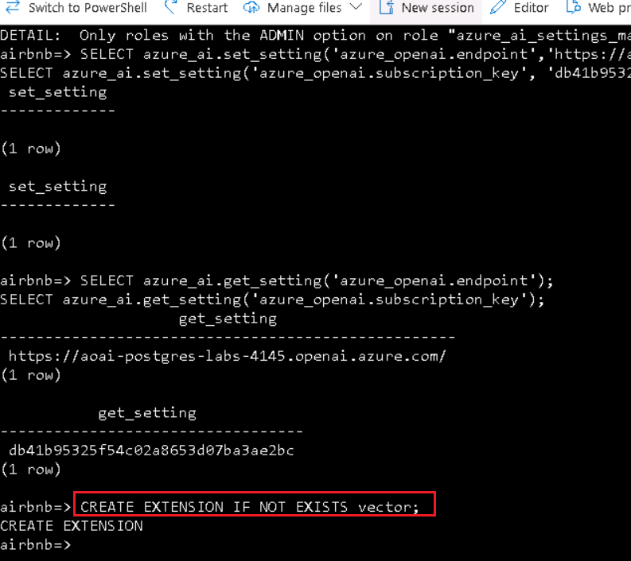

2.  Wenn Sie die Vektorunterstützung zu Ihrer Datenbank hinzugefügt
    haben, fügen Sie der listings-Tabelle eine neue Spalte hinzu, indem
    Sie den Datentyp vector verwenden, um Einbettungen in der Tabelle zu
    speichern. Das Modell text-embedding-ada-002 erzeugt Vektoren mit
    1536 Dimensionen, daher müssen Sie 1536 als Vektorgröße angeben.

+++**ALTER TABLE listings**

**ADD COLUMN description_vector vector(1536);+++**

## Aufgabe 2: Generieren und Speichern von Vektoreinbettungen

Die listings-Tabelle ist jetzt bereit, Einbettungen zu speichern. Mit
der Funktion azure_openai.create_embeddings() erstellen Sie Vektoren für
das Beschreibungs-Feld und fügen diese in die neu erstellte Spalte
description_vector in der Listings -Tabelle ein.

1.  Bevor Sie die Funktion create_embeddings() verwenden, führen Sie den
    folgenden Befehl aus, um sie zu überprüfen und die erforderlichen
    Argumente zu überprüfen:

> **+++\df+ azure_openai.\*+++**

Die Eigenschaft Argument data types in der Ausgabe des Befehls \df+
azure_openai.\* zeigt die Liste der Argumente an, die die Funktion
erwartet.

[TABLE]

2.  Führen Sie unter Verwendung des Bereitstellungsnamens die folgende
    Abfrage aus, um jeden Datensatz in der Listings-Tabelle zu
    aktualisieren, und fügen Sie die generierten Vektoreinbettungen für
    das Beschreibungs-Feld mit der Funktion
    azure_openai.create_embeddings() in die description_vector Spalte
    ein . Ersetzen Sie {your-deployment-name} durch den Wert für den
    **Deployment name,** den Sie von der Seite Azure OpenAI Studio-
    **Deployments** kopiert haben . Beachten Sie, dass diese Abfrage
    etwa fünf Minuten dauert.

> **DO $$**
>
> **DECLARE counter integer := (SELECT COUNT(\*) FROM listings WHERE
> description \<\> '' AND description_vector IS NULL);**
>
> **DECLARE r record;**
>
> **BEGIN**
>
> **RAISE NOTICE 'Total descriptions to embed: %', counter;**
>
> **WHILE counter \> 0 LOOP**
>
> **BEGIN**
>
> **FOR r IN**
>
> **SELECT listing_id FROM listings WHERE description \<\> '' AND
> description_vector IS NULL**
>
> **LOOP**
>
> **BEGIN**
>
> **UPDATE listings**
>
> **SET description_vector =
> azure_openai.create_embeddings('{your-deployment-name}',
> description)**
>
> **WHERE listing_id = r.listing_id;**
>
> **EXCEPTION**
>
> **WHEN OTHERS THEN**
>
> **RAISE NOTICE 'Waiting 1 second before trying again...';**
>
> **PERFORM pg_sleep(1);**
>
> **END;**
>
> **counter := (SELECT COUNT(\*) FROM listings WHERE description \<\> ''
> AND description_vector IS NULL);**
>
> **IF counter % 25 = 0 THEN**
>
> **RAISE NOTICE 'Remaining descriptions to embed: %', counter;**
>
> **END IF;**
>
> **END LOOP;**
>
> **END;**
>
> **END LOOP;**
>
> **END;**
>
> **$$;!!**
>
> 
>
> Die obige Abfrage verwendet eine WHILE -Schleife, um Datensätze aus
> der Listings-Tabelle abzurufen, in der das Feld description_vector
> null ist und das Beschreibungsfeld keine leere Zeichenfolge ist. Die
> Abfrage versucht dann, die description_vector Spalte mithilfe der
> Funktion azure_openai.create_embeddings mit einer Vektordarstellung
> der Beschreibungsspalte zu aktualisieren . Die Schleife wird beim
> Ausführen dieses Updates verwendet, um zu verhindern, dass Aufrufe zum
> Erstellen von Einbettungsfunktionen den Grenzwert für die Aufrufrate
> des Azure OpenAI-Diensts überschreiten. Wenn das Limit für die
> Anrufrate überschritten wird, werden in der Ausgabe Warnungen ähnlich
> der folgenden angezeigt:
>
> **HINWEIS**: Warten Sie 1 Sekunde, bevor Sie es erneut versuchen...

> 

3.  Sie können überprüfen, ob die Spalte description_vector für alle
    Listing-Datensätze ausgefüllt wurde , indem Sie die folgende Abfrage
    ausführen:

**!!SELECT COUNT(\*) FROM listings WHERE description_vector IS NULL AND
description \<\> '';!!**

> Das Ergebnis der Abfrage sollte den Wert 0 haben.

## Aufgabe 3: Durchführen einer Vektorähnlichkeitssuche

Die Vektorähnlichkeit ist eine Methode, mit der die Ähnlichkeit zweier
Elemente gemessen wird, indem sie als Vektoren, eine Reihe von Zahlen,
dargestellt werden. Vektoren werden häufig verwendet, um Suchen mit LLMs
durchzuführen. Die Vektorähnlichkeit wird häufig anhand von
Entfernungsmetriken wie der euklidischen Distanz oder der
Kosinusähnlichkeit berechnet. Die euklidische Distanz misst den
geradlinigen Abstand zwischen zwei Vektoren im n-dimensionalen Raum,
während die Kosinusähnlichkeit den Kosinus des Winkels zwischen zwei
Vektoren misst. Jede Einbettung ist ein Vektor von Gleitkommazahlen, so
dass der Abstand zwischen zwei Einbettungen im Vektorraum mit der
semantischen Ähnlichkeit zwischen zwei Eingaben im Originalformat
korreliert.

1.  Führen Sie vor dem Ausführen einer Vektorähnlichkeitssuche die
    folgende Abfrage mit der ILIKE Klausel aus, um die Ergebnisse der
    Suche nach Datensätzen mit einer Abfrage in natürlicher Sprache ohne
    Verwendung von Vektorähnlichkeit zu beobachten:

**!!SELECT listing_id, name, description FROM listings WHERE description
ILIKE '%Properties with a private room near Discovery Park%';!!**

> Die Abfrage gibt keine Ergebnisse zurück, da versucht wird, den Text
> im Beschreibungsfeld mit der bereitgestellten Abfrage in natürlicher
> Sprache abzugleichen.

2.  Führen Sie nun eine [Kosinus-Ähnlichkeitssuchabfrage für
    die](https://learn.microsoft.com/azure/ai-services/openai/concepts/understand-embeddings#cosine-similarity)
    Listings-Tabelle aus, um eine Vektorähnlichkeitssuche für
    Listing-Beschreibungen durchzuführen. Die Einbettungen werden für
    eine Eingabefrage generiert und dann in ein Vektorarray (::vector)
    umgewandelt, wodurch sie mit den in der Listings-Tabelle
    gespeicherten Vektoren verglichen werden können . Ersetzen Sie
    {your-deployment-name} durch den Wert für den **Deployment name,**
    den Sie von der Seite Azure OpenAI Studio-Bereitstellungen kopiert
    haben .

> **!!SELECT listing_id, name, description FROM listings**
>
> **ORDER BY description_vector \<=\>
> azure_openai.create_embeddings('{your-deployment-name}', 'Properties
> with a private room near Discovery Park')::vector**
>
> **LIMIT 3;!!**

Die Abfrage verwendet den Vektoroperator
[\<=\>](https://github.com/pgvector/pgvector#vector-operators), der den
Operator "Kosinusabstand" darstellt, der zum Berechnen des Abstands
zwischen zwei Vektoren in einem mehrdimensionalen Raum verwendet wird.

3.  Führen Sie dieselbe Abfrage erneut aus, indem Sie die EXPLAIN
    ANALYZE-Klausel verwenden, um die Planungs- und Ausführungszeiten
    der Abfrage anzuzeigen. Ersetzen Sie {your-deployment-name} durch
    den Wert für den **Deployment name,** den Sie von der Seite Azure
    OpenAI Studio-**Deployments** kopiert haben .

**!!EXPLAIN ANALYZE**

**SELECT listing_id, name, description FROM listings**

**ORDER BY description_vector \<=\>
azure_openai.create_embeddings('{your-deployment-name}', 'Properties
with a private room near Discovery Park')::vector**

**LIMIT 3;!!**

Beachten Sie in der Ausgabe den Abfrageplan, der mit etwas Ähnlichem wie
folgt beginnt:

> Limit (cost=1098.54..1098.55 rows=3 width=261) (actual
> time=10.505..10.507 rows=3 loops=1)
>
> -\> Sort (cost=1098.54..1104.10 rows=2224 width=261) (actual
> time=10.504..10.505 rows=3 loops=1)
>
> ...
>
> Sort Method: top-N heapsort Memory: 27kB
>
> -\> Seq Scan on listings (cost=0.00..1069.80 rows=2224 width=261)
> (actual time=0.005..9.997 rows=2224 loops=1)
>
> Die Abfrage verwendet eine sequenzielle Scansortierung, um die Suche
> durchzuführen. Die Planungs- und Ausführungszeiten werden am Ende der
> Ergebnisse aufgelistet und sollten in etwa wie folgt aussehen:
>
> Planungszeit: 62.020 ms
>
> Ausführungszeit: 10.530 ms

4.  Um eine effizientere Suche über das Vektorfeld zu ermöglichen ,
    erstellen Sie einen Index für Listings mit Kosinusabstand und
    [HNSW](https://github.com/pgvector/pgvector#hnsw), der Abkürzung für
    Hierarchical Navigable Small World. HNSW ermöglicht es pgvector, die
    neuesten graphenbasierten Algorithmen zu verwenden, um Abfragen des
    nächsten Nachbarn zu approximieren.

**!!CREATE INDEX ON listings USING hnsw (description_vector
vector_cosine_ops);!!**

5.  Um die Auswirkungen des hnsw-Index auf die Tabelle zu beobachten,
    führen Sie die Abfrage erneut mit der EXPLAIN ANALYZE-Klausel aus,
    um die Planungs- und Ausführungszeiten der Abfrage zu vergleichen.
    Ersetzen Sie {your-deployment-name} durch den Wert für den
    **Deployment name,** den Sie von der Seite Azure OpenAI
    Studio-**Deployments** kopiert haben.

> EXPLAIN ANALYZE
>
> SELECT listing_id, name, description FROM listings
>
> ORDER BY description_vector \<=\>
> azure_openai.create_embeddings('{your-deployment-name}', 'Properties
> with a private room near Discovery Park')::vector
>
> LIMIT 3;

Beachten Sie, dass der Abfrageplan in der Ausgabe jetzt eine
effizientere Indexüberprüfung enthält:

Limit (cost=116.48..119.33 rows=3 width=261) (actual time=1.112..1.130
rows=3 loops=1)

-\> Index Scan using listings_description_vector_idx on listings
(cost=116.48..2228.28 rows=2224 width=261) (actual time=1.111..1.128
rows=3 loops=1)

Die Ausführungszeiten der Abfrage sollten eine erhebliche Reduzierung
der Zeit widerspiegeln, die zum Planen und Ausführen der Abfrage
benötigt wurde:

Planungszeit: 56.802 ms

Ausführungszeit: 1.167 ms

# Übung 6: Integrieren von Azure AI Services

Die Azure AI Services-Integrationen, die im azure_cognitive Schema der
azure_ai Erweiterung enthalten sind, bieten eine Vielzahl von
AI-Sprachfeatures, auf die direkt über die Datenbank zugegriffen werden
kann. Zu den Funktionen gehören Stimmungsanalyse, Spracherkennung,
Extraktion von Schlüsselphrasen, Entitätserkennung und
Textzusammenfassung. Diese Funktionen werden über den [Azure AI
Language-Dienst
aktiviert](https://learn.microsoft.com/azure/ai-services/language-service/overview).

Eine vollständige Liste der Azure AI-Funktionen, auf die über die
Erweiterung zugegriffen werden kann, finden Sie in der [Dokumentation
Integrieren von Azure Database for PostgreSQL Flexible Server in Azure
Cognitive
Services](https://learn.microsoft.com/azure/postgresql/flexible-server/generative-ai-azure-cognitive).

## Aufgabe 1: Bereitstellen eines Azure AI-Sprachdiensts

Ein [Azure
AI](https://learn.microsoft.com/azure/ai-services/language-service/overview)
Language-Dienst ist erforderlich, um die kognitiven Funktionen der
azure_ai Erweiterungen nutzen zu können. In dieser Übung erstellen Sie
einen Azure AI-Sprachdienst.

1.  Klicken Sie auf der Startseite des Azure-Portals auf das **Azure
    Portal Menu,** das durch drei horizontale Balken auf der linken
    Seite der Microsoft Azure-Befehlsleiste dargestellt wird, wie in der
    folgenden Abbildung gezeigt.

2.  Wählen Sie auf der Seite **Create a resource** im Menü auf der
    linken Seite AI + Machine Learning aus, und wählen Sie dann
    **Language service** aus.

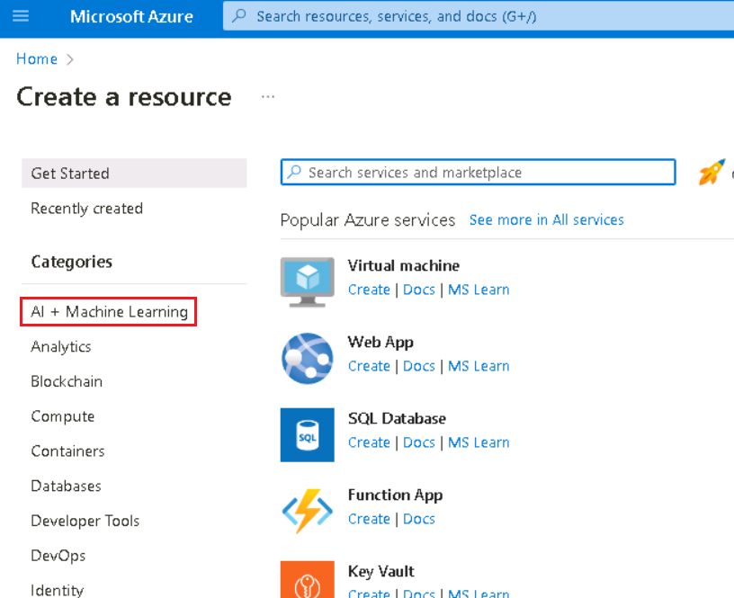

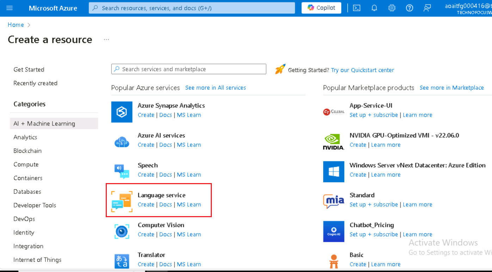

3.  Wählen Sie im Dialogfeld **Select additional features** die Option
    **Continue to create your resource** aus.

> 

4.  Geben Sie auf der Registerkarte Create Language **Basics** Folgendes
    ein:

[TABLE]

> 
>
> 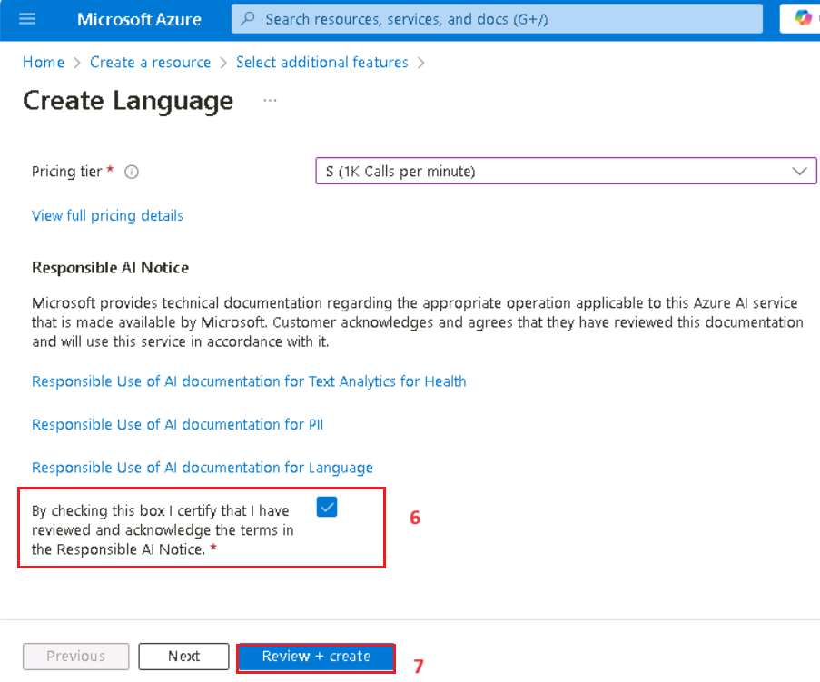

5.  Die Standardeinstellungen werden für die verbleibenden
    Registerkarten der Sprachdienstkonfiguration verwendet, wählen Sie
    also die Schaltfläche **Review + create** aus.

6.  Wählen Sie auf der Registerkarte **Review + create** die
    Schaltfläche **Create** aus , um den Sprachdienst bereitzustellen.

> 

7.  Wählen Sie auf der Bereitstellungsseite die Option **Go to resource
    group** aus, wenn die Bereitstellung des Sprachdiensts abgeschlossen
    ist.

## Aufgabe 2: Festlegen des Endpunkts und des Schlüssels für den Azure AI-Sprachdienst

Wie bei den azure_openai -Funktionen müssen Sie den Endpunkt und einen
Schlüssel für Ihren Azure AI-Sprachdienst angeben, um mithilfe der
azure_ai -Erweiterung erfolgreich Aufrufe für Azure AI-Dienste zu
tätigen.

1.  Wählen Sie auf der Startseite für Sprachen im linken Navigationsmenü
    unter **Resource Management** den Eintrag **Keys and Endpoint** aus.

2.  Kopieren Sie auf der Seite **Keys and Endpoints** die Werte **KEY1,
    KEY 2** und **Endpoint,** fügen Sie sie in einen Editor ein, wie in
    der folgenden Abbildung gezeigt, und **speichern Sie** dann den
    Editor, um die Informationen in den anstehenden Aufgaben zu
    verwenden.

3.  Kopieren Sie die Werte für den Endpunkt und den Zugriffsschlüssel,
    und ersetzen Sie dann im folgenden Befehl die Token {endpoint} und
    {api-key} durch Werte, die Sie aus dem Azure-Portal abgerufen haben.
    Führen Sie die Befehle an der psql -Prompt in Cloud Shell aus, um
    der Konfigurationstabelle Ihre Werte hinzuzufügen.

> !! SELECT
> azure_ai.set_setting('azure_cognitive.endpoint','{endpoint}');
>
> SELECT azure_ai.set_setting('azure_cognitive.subscription_key',
> '{api-key}');!!

## Aufgabe 3: Analysieren Sie die Stimmung von Bewertungen

In dieser Aufgabe verwendest du die Funktion
azure_cognitive.analyze_sentiment, um Bewertungen von Airbnb-Inseraten
auszuwerten.

1.  Um eine Stimmungsanalyse mithilfe des azure_cognitive Schemas in der
    azure_ai Erweiterung durchzuführen, verwenden Sie die Funktion
    analyze_sentiment. Führen Sie den folgenden Befehl aus, um diese
    Funktion zu überprüfen:

> **!!\df azure_cognitive.analyze_sentiment!!**

Die Ausgabe zeigt das Schema, den Namen, den Ergebnisdatentyp und die
Argumentdatentypen der Funktion an. Diese Informationen helfen dabei,
die Verwendung der Funktion zu verstehen.

2.  Es ist auch wichtig, die Struktur des Ergebnisdatentyps zu
    verstehen, den die Funktion ausgibt, damit Sie den Rückgabewert
    korrekt verarbeiten können. Führen Sie den folgenden Befehl aus, um
    den Typ sentiment_analysis_result zu überprüfen:

> **+++\dT+ azure_cognitive.sentiment_analysis_result+++**

3.  Die Ausgabe des obigen Befehls zeigt, dass der
    sentiment_analysis_result Typ ein Tupel ist. Um die Struktur dieses
    Tupels zu verstehen, führen Sie den folgenden Befehl aus, um die
    Spalten zu betrachten, die im zusammengesetzten Typ
    sentiment_analysis_result enthalten sind:

> **!!\d+ azure_cognitive.sentiment_analysis_result!!**

Die Ausgabe dieses Befehls sollte in etwa wie folgt aussehen:

> Composite type "azure_cognitive.sentiment_analysis_result"
>
> Column | Type | Collation | Nullable | Default | Storage | Description
>
> ----------------+------------------+-----------+----------+---------+----------+-------------
>
> sentiment | text | | | | extended |
>
> positive_score | double precision | | | | plain |
>
> neutral_score | double precision | | | | plain |
>
> negative_score | double precision | | | | plain |

Der azure_cognitive.sentiment_analysis_result ist ein zusammengesetzter
Typ, der die Stimmungsvorhersagen des Eingabetexts enthält. Es enthält
die Stimmung, die positiv, negativ, neutral oder gemischt sein kann, und
die Bewertungen für positive, neutrale und negative Aspekte, die im Text
zu finden sind. Die Punktzahlen werden als reelle Zahlen zwischen 0 und
1 dargestellt. Zum Beispiel ist die Stimmung in (neutral,0,26,0,64,0,09)
neutral mit einem positiven Wert von 0,26, neutral von 0,64 und negativ
bei 0,09.

4.  Nachdem Sie nun wissen, wie Sie die Stimmung mithilfe der
    Erweiterung und der Form des Rückgabetyps analysieren, führen Sie
    die folgende Abfrage aus, die nach überwältigend positiven
    Bewertungen sucht:

WITH cte AS (

SELECT id, azure_cognitive.analyze_sentiment(comments, 'en') AS
sentiment FROM reviews LIMIT 100

)

SELECT

id,

(sentiment).sentiment,

(sentiment).positive_score,

(sentiment).neutral_score,

(sentiment).negative_score,

comments

FROM cte

WHERE (sentiment).positive_score \> 0.98

LIMIT 10;

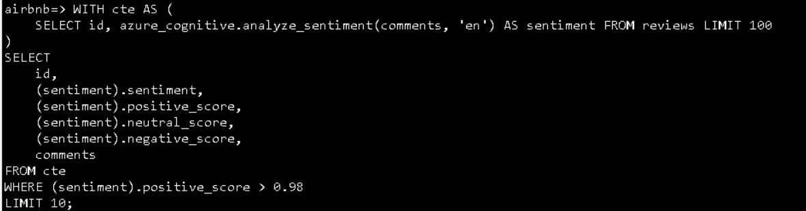

Die obige Abfrage verwendet einen allgemeinen Tabellenausdruck oder CTE,
um die Stimmungsbewertungen für die ersten drei Datensätze in der
Reviews-Tabelle abzurufen. Anschließend werden die Spalten des
zusammengesetzten sentiment-Typs aus dem CTE ausgewählt, um die
einzelnen Werte aus dem sentiment_analysis_result zu extrahieren.

# Übung 7: Ausführen einer abschließenden Abfrage, um alles miteinander zu verknüpfen 

In dieser Übung stellen Sie eine Verbindung mit Ihrer Datenbank in
**pgAdmin** her und führen eine abschließende Abfrage aus, die Ihre
Arbeit mit den Erweiterungen azure_ai, postgis und pgvector in den Labs
3 und 4 verknüpft.

## Aufgabe 1: Installieren von pgAdmin

1.  Öffnen Sie einen Webbrowser und navigieren Sie zum
    !!https://www.pgadmin.org/download/pgadmin-4-windows/!!

2.  Klicken Sie auf die neueste Version von **pgAdmin**

3.  Wählen Sie **pgadmin4-8.9-x64.exe**

4.  Heruntergeladene Datei ausführen und installieren

5.  Auf der Registerkarte Select Setup Install Mode wählen Sie die
    Option **Install for me only(recommended)** aus

6.  Klicken Sie auf die Schaltfläche **Next**

7.  Wählen Sie die Schaltfläche **I accept the agreement** und klicken
    Sie auf die Schaltfläche **Next**

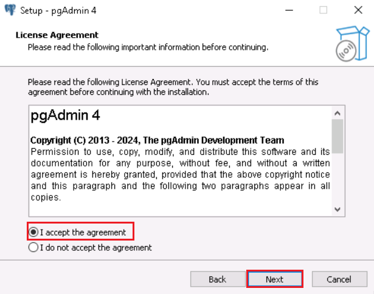

8.  Wählen Sie den Pfad aus und klicken Sie auf die Schaltfläche
    **Next**

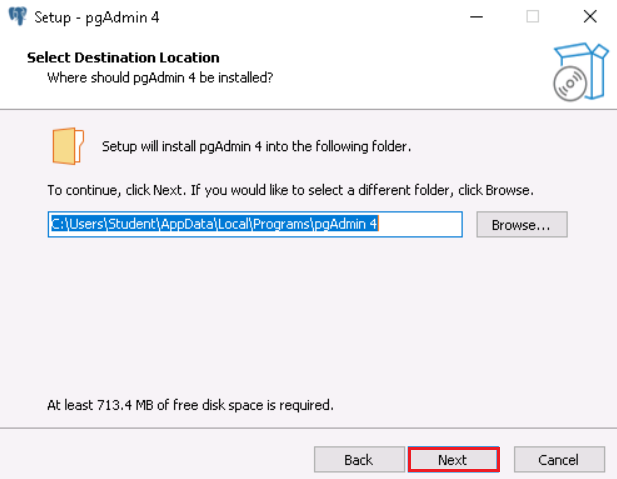

9.  Klicken Sie im Fenster **Setup-pgAdmin 4** auf die Schaltfläche
    **Next**

10. Klicken Sie auf die Schaltfläche **Install**

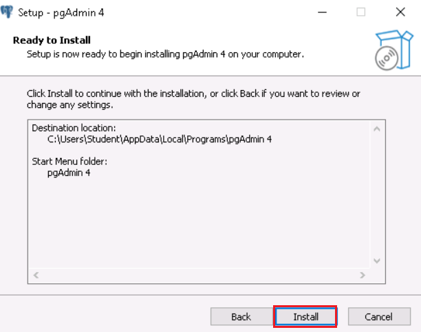

11. Klicken Sie im Fenster **Setup-pgAdmin 4** auf die Schaltfläche
    **Finish**

## Aufgabe 2: Herstellen einer Verbindung mit der Datenbank mithilfe von pgAdmin

In dieser Aufgabe öffnen Sie pgAdmin und stellen eine Verbindung mit
Ihrer Datenbank her.

1.  Geben Sie in Ihrem Windows-Suchfeld **pgAdmin** ein und klicken Sie
    dann auf **pgAdmin**

2.  Registrieren Sie Ihren Server, indem Sie im Objekt-Explorer mit der
    rechten Maustaste auf **Servers** klicken und **Register \> Server**
    auswählen.

3.  Fügen Sie im Dialogfeld **Register - Server** den Namen Ihres Azure
    Database for PostgreSQL Flexible Server-Servers (den Sie in Übung
    1\> Aufgabe 1 gespeichert haben) in das Feld **Name** auf der
    Registerkarte **General** ein .

> 

4.  Wählen Sie als Nächstes die Registerkarte **Connection** und fügen
    Sie Ihren Servernamen in das Feld **Hostname/Adresse** ein. Geben
    Sie **s2admin** in das Feld **Username** ein , geben Sie
    **Seattle123Seattle123** in das Feld **Password** ein , und wählen
    Sie optional **Save password** aus.

> 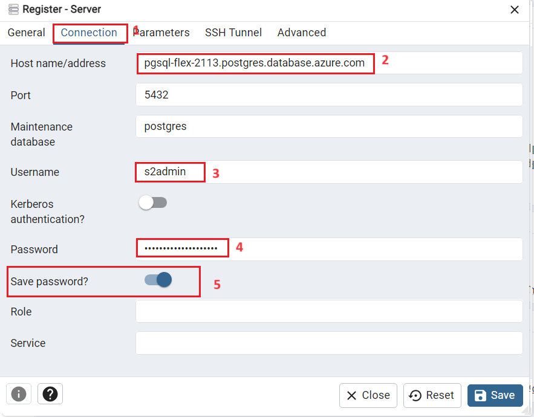

3.  Wählen Sie abschließend die Registerkarte **Parameters** aus und
    legen Sie den **SSL-Mode** so fest, dass er **erforderlich** ist.
    Wählen Sie **Save** aus, um den Server zu registrieren.

> 
>
> 

4.  Sobald du mit deinem Server verbunden bist, erweitere den Knoten
    **Databases** und wähle die **airbnb**-Datenbank aus. Klicken Sie
    mit der rechten Maustaste auf die **airbnb**-Datenbank und wählen
    Sie **Query Tool** aus dem Kontextmenü.

> 
>
> 

## Aufgabe 3: Überprüfen, ob die Erweiterung PostGIS in der Datenbank installiert ist

Um die postgis-Erweiterung in Ihrer Datenbank zu installieren, verwenden
Sie den Befehl CREATE EXTENSION.

1.  Führen Sie in dem Abfragefenster, das Sie oben geöffnet haben, den
    Befehl CREATE EXTENSION mit der Klausel IF NOT EXISTS aus, um die
    postgis-Erweiterung in Ihrer Datenbank zu installieren.

> CREATE EXTENSION IF NOT EXISTS postgis;
>
> 
>
> Nachdem die PostGIS -Erweiterung nun geladen ist, können Sie mit der
> Arbeit mit Geospatial-Daten in der Datenbank beginnen. Die
> Listings-Tabelle, die Sie oben erstellt und ausgefüllt haben, enthält
> den Breiten- und Längengrad aller aufgelisteten Immobilien. Um diese
> Daten für die Geodatenanalyse zu verwenden, müssen Sie die
> Listings-Tabelle ändern, um eine Geometry-Spalte hinzuzufügen, die den
> Datentyp "Point" akzeptiert . Diese neuen Datentypen sind in der
> postgis-Erweiterung enthalten.

2.  Um Point-Daten aufzunehmen , fügen Sie der Tabelle, die Point -Daten
    akzeptiert, eine neue Geometrie-Spalte hinzu. Kopieren Sie die
    folgende Abfrage, und fügen Sie sie in das geöffnete
    pgAdmin-Abfragefenster ein:

> !!ALTER TABLE listings
>
> ADD COLUMN listing_location geometry(point, 4326);!!

3.  Aktualisieren Sie als Nächstes die Tabelle mit den Geodaten, die den
    einzelnen Auflistungen zugeordnet sind, indem Sie die Werte für den
    Längen- und Breitengrad in die Geometrie-Spalte einfügen.

> !!UPDATE listings
>
> SET listing_location = ST_SetSRID(ST_Point(longitude, latitude),
> 4326);!!

## Aufgabe 4: Ausführen einer Abfrage und Anzeigen der Ergebnisse auf einer Karte

In dieser Aufgabe führen Sie eine abschließende Abfrage aus, die Ihre
Arbeit mit den Labs 3 und 4 verknüpft.

1.  Führen Sie die folgende Abfrage aus, die Elemente der Erweiterungen
    azure_ai, pgvector und PostGIS enthält, mit denen Sie in den Labs 3
    und 4 gearbeitet haben. Ersetzen Sie {your-deployment-name} durch
    den Wert für den **Deployment name,** den Sie von der Seite Azure
    OpenAI Studio-**Deployments** kopiert haben .

> !!WITH listings_cte AS (
>
> SELECT l.listing_id, name, listing_location, summary FROM listings l
>
> INNER JOIN calendar c ON l.listing_id = c.listing_id
>
> WHERE ST_DWithin(
>
> listing_location,
>
> ST_GeomFromText('POINT(-122.410347 47.655598)', 4326),
>
> 0.025
>
> )
>
> AND c.date = '2016-01-13'
>
> AND c.available = 't'
>
> AND c.price \<= 75.00
>
> AND l.listing_id IN (SELECT listing_id FROM reviews)
>
> ORDER BY description_vector \<=\>
> azure_openai.create_embeddings('{your-deployment-name}', 'Properties
> with a private room near Discovery Park')::vector
>
> LIMIT 3
>
> ),
>
> sentiment_cte AS (
>
> SELECT r.listing_id, comments,
> azure_cognitive.analyze_sentiment(comments, 'en') AS sentiment
>
> FROM reviews r
>
> INNER JOIN listings_cte l ON r.listing_id = l.listing_id
>
> )
>
> SELECT
>
> l.listing_id,
>
> name,
>
> listing_location,
>
> summary,
>
> avg((sentiment).positive_score) as avg_positive_score,
>
> avg((sentiment).neutral_score) as avg_neutral_score,
>
> avg((sentiment).negative_score) as avg_negative_score
>
> FROM sentiment_cte s
>
> INNER JOIN listings_cte l on s.listing_id = l.listing_id
>
> GROUP BY l.listing_id, name, listing_location, summary;!!

2.  Wählen Sie im Bereich **Data Output** die Schaltfläche **View all
    geometries in this column** aus**,** die in der listing_location
    Spalte der Abfrageergebnisse angezeigt wird.

Mit der Schaltfläche **View all geometries in this column** wird der
**Geometry Viewer** geöffnet, in dem Sie die Abfrageergebnisse auf einer
Karte anzeigen können.

3.  Wählen Sie einen der drei Punkte aus, die auf der Karte angezeigt
    werden, um Details zum Standort anzuzeigen, einschließlich der
    durchschnittlichen positiven, neutralen und negativen
    Sentiment-Scores für alle Bewertungen für das Unternehmen.

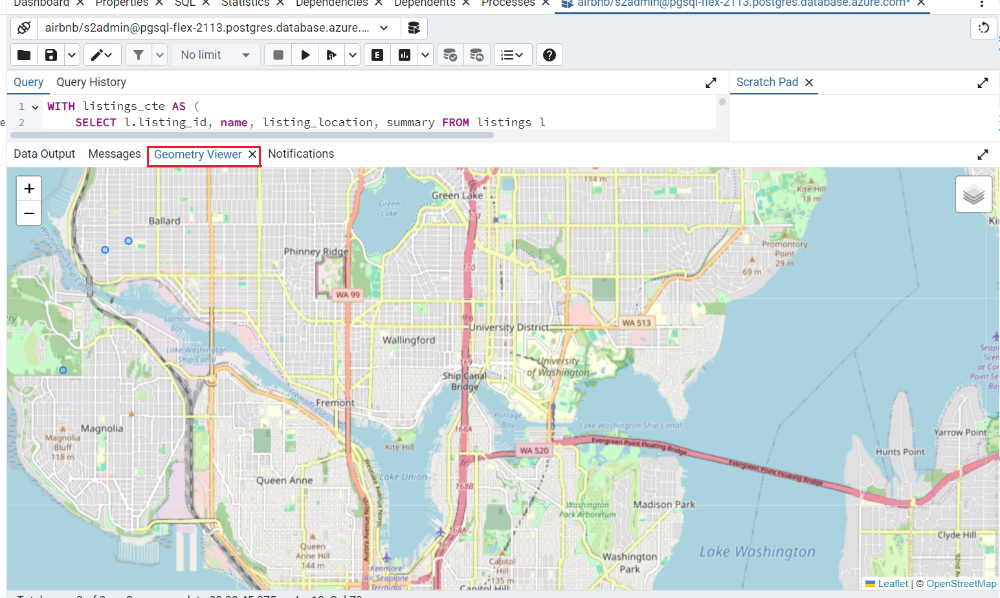

## Aufgabe 5: Bereinigen von Ressourcen 

Es ist wichtig, dass Sie alle Ressourcen, die Sie für diese Labs
erstellt haben, bereinigen, sobald Sie sie abgeschlossen haben. Ihnen
wird die konfigurierte Kapazität in Rechnung gestellt, nicht die
Auslastung der Datenbank. Führen Sie die folgenden Anweisungen aus, um
Ihre Ressourcengruppe und alle Ressourcen, die Sie für dieses Lab
erstellt haben, zu löschen:

Um unnötige Azure-Kosten zu vermeiden, sollten Sie die Ressourcen, die
Sie in dieser Schnellstartanleitung erstellt haben, löschen, wenn sie
nicht mehr benötigt werden. Zum Verwalten von Ressourcen können Sie das
[Azure-Portal verwenden](https://portal.azure.com/?azure-portal=true).

1.  Um das Speicherkonto zu löschen, navigieren Sie zur **Startseite**
    des **Azure-Portals** , und klicken Sie auf **Resource groups**.

> 

2.  Klicken Sie auf die Ressourcengruppe, die Sie erstellt haben.

> 

3.  Wählen Sie auf der Startseite der **Resource group** die Option
    **delete resource group** aus .

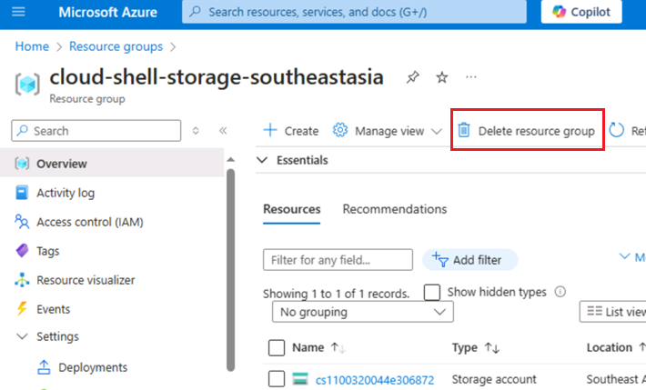

4.  Navigieren Sie im Bereich **Delete Resources**, der auf der rechten
    Seite angezeigt wird, zum Feld **Enter “resource group name” to
    confirm deletion**, und klicken Sie dann auf die Schaltfläche
    **Delete**.

5.  Klicken Sie im Dialogfeld **Delete confirmation** auf die
    Schaltfläche **"Delete**".

> 

6.  Klicken Sie auf das Glockensymbol, um die Benachrichtigung –
    **Deleted resource group AOAI-RG89** zu sehen.

**Zusammenfassung**

In diesem Lab haben Sie Azure-AI-Dienste erfolgreich in PostgreSQL
integriert, um eine leistungsstarke AI-gestützte Datenbankumgebung zu
erstellen. Sie haben mit der Bereitstellung von Azure-Ressourcen und der
Konfiguration Ihrer PostgreSQL-Datenbank mit den erforderlichen
Erweiterungen begonnen. Anschließend haben Sie Vektoreinbettungen für
Textdaten generiert und Vektorähnlichkeitssuchen durchgeführt, um
semantisch ähnliche Datensätze zu finden. Darüber hinaus haben Sie die
PostGIS-Erweiterung für die Analyse von Geodaten und den Azure AI
Language-Dienst für die Sentiment-Analyse verwendet. Schließlich haben
Sie Ihre Abfragen mithilfe der Indizierung optimiert und ihre Leistung
analysiert, um die Effizienz und Leistungsfähigkeit dieser integrierten
Lösung für die erweiterte Datenanalyse zu demonstrieren.
