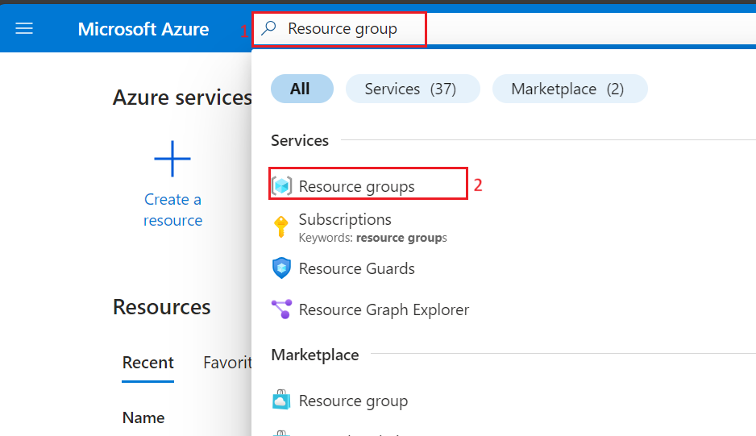
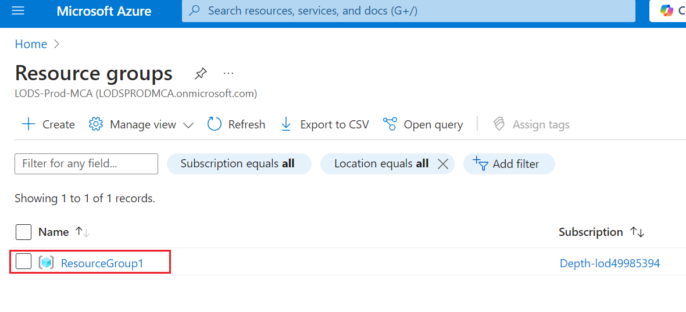
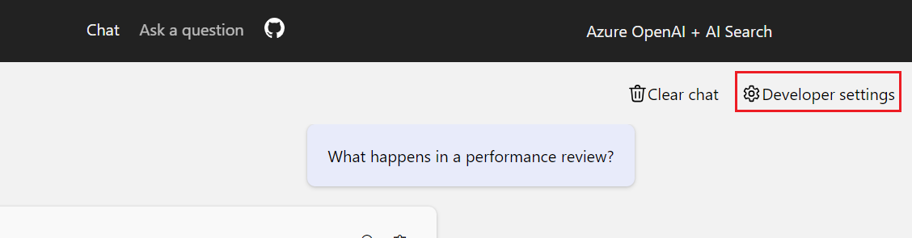

**Einleitung**

Dieses Beispiel veranschaulicht einige Ansätze zum Erstellen von
ChatGPT-ähnlichen Erfahrungen für Ihre eigenen Daten mithilfe des
Retrieval Augmented Generation-Musters. Es verwendet Azure OpenAI
Service für den Zugriff auf das ChatGPT-Modell (gpt-35-turbo) und Azure
Cognitive Search für die Datenindizierung und den Abruf.

Das Repository enthält Beispieldaten, sodass es von Anfang bis Ende
ausprobiert werden kann. In dieser Beispielanwendung verwenden wir ein
fiktives Unternehmen namens Contoso Electronics, und die Erfahrung
ermöglicht es seinen Mitarbeitern, Fragen zu den Leistungen, internen
Richtlinien sowie Stellenbeschreibungen und Rollen zu stellen.

In diesem Anwendungsfall durchlaufen Sie den Prozess der Entwicklung
einer komplexen Chatanwendung mithilfe des RAG-Musters (Retrieval
Augmented Generation) auf der Azure-Plattform. Durch die Nutzung von
Azure OpenAI Service und Azure Cognitive Search erstellen Sie eine
Chatanwendung, die Fragen mithilfe Ihrer eigenen Daten intelligent
beantworten kann. In diesem Lab wird ein fiktives Unternehmen, Contoso
Electronics, als Fallstudie verwendet, um zu demonstrieren, wie eine
ChatGPT-ähnliche Erfahrung über Unternehmensdaten erstellt werden kann,
die Aspekte wie Sozialleistungen, interne Richtlinien und Jobrollen
abdeckt.

**Objektiv**

- So installieren Sie die Azure CLI und Node.js auf Ihrer lokalen
  Maschine.

- So weisen Sie dem Benutzer eine Besitzerrolle zu.

- So installieren Sie die Dev Containers-Erweiterung und richten die
  Entwicklungsumgebung ein.

- So stellen Sie eine Chatanwendung in Azure bereit und verwenden sie
  zum Abrufen von Antworten aus PDF-Dateien.

- Um die bereitgestellten Ressourcen und Modelle zu löschen.

## Aufgabe 1: Installieren der Azure CLI, und Festlegen des Richtlinienbereichs auf Lokale Maschine

1.  Geben Sie in der Windows-Suchleiste **PowerShell** ein. Navigieren
    Sie im **PowerShell-**Dialogfeld und klicken Sie auf **Run as
    administrator** ausführen**.** Wenn das Dialogfeld " **Do you want
    to allow this app to make changes to your device?** Klicken Sie dann
    auf die Schaltfläche **Yes**.

> 

2.  Führen Sie den folgenden Befehl aus , um die Azure Cli in der
    PowerShell zu installieren

PowerShell copy

> **winget install microsoft.azd**

3.  Führen Sie den folgenden Befehl aus, um die Richtlinie auf
    **Unrestricted** festzulegen, und geben Sie **A** ein, wenn Sie
    aufgefordert werden, die Ausführungsrichtlinie zu ändern.

> **Set-ExecutionPolicy: uneingeschränkt**
>
> 

## Aufgabe 2: Installieren Node.js

1.  Öffnen Sie Ihren Browser, navigieren Sie zur Adressleiste, geben Sie
    die folgende URL ein oder fügen Sie sie ein: +++https://nodejs.org/
    de/download/+++ und drücken Sie dann die **Enter**-Taste.

2.  Wählen Sie **Windows Installer** aus und klicken Sie darauf.

3.  **Die Node-V**-Datei wird heruntergeladen. Klicken Sie auf die
    heruntergeladene Datei, um **Node.js** einzurichten

4.  Klicken Sie im Fenster **Welcome to the Node.js Setup Wizard** auf
    die Schaltfläche **Next**.

5.  Wählen Sie im Fenster **End-User License Agreement** im Optionsfeld
    **I accept the terms in the License agreement** und klicken Sie auf
    die Schaltfläche **Next**.

6.  Klicken Sie im Fenster **Destination Folder** auf die Schaltfläche
    **Next**.

7.  Klicken Sie im Fenster **" Custom Setup "** auf die Schaltfläche
    **"Next**".

8.  Klicken Sie im Fenster Ready to install Node.js auf **Install.**

9.  Klicken Sie im Fenster **Completing the Node.js Setup Wizard
    window** auf die Schaltfläche **Finish** , um den
    Installationsvorgang abzuschließen.

## Aufgabe 3: Abrufen des Namens und des Speicherorts der Ressourcengruppe

1.  Öffnen Sie Ihren Browser, navigieren Sie zur Adressleiste, geben Sie
    die folgende URL ein oder fügen Sie sie ein:
    +++https://portal.azure.com/+++ und drücken Sie dann die
    **Enter**-Taste.

> 

2.  Verwenden Sie im **Microsoft Azure**-Fenster die **User
    Credentials**, um sich bei Azure anzumelden.

3.  Geben Sie dann das Passwort ein und klicken Sie auf die Schaltfläche
    **Sign-in.**

> 

4.  Im Fenster **Stay signed in?**, klicken Sie auf die Schaltfläche
    **Yes**.

> 

5.  Geben Sie +++ **Resource group** +++ in die Suchleiste ein, und
    wählen Sie **Resource groups** aus.

> 

6.  Klicken Sie auf die Ihnen zugewiesene **Resource group**.

7.  Kopieren Sie auf der Seite **Resource group** “**Resource Group Name
    and Location”**, fügen Sie sie in einen Editor ein, und **speichern
    Sie** dann den Editor, um die Informationen in den anstehenden
    Aufgaben zu verwenden.

## Aufgabe 4: Erstellen eines AI-Suchdiensts

1.  Geben Sie im Azure-Portal **+++AI search+++** in die Suchleiste ein,
    und wählen Sie **AI Search** aus

2.  Klicken Sie auf +**Create**.

3.  Wählen Sie die folgenden Werte aus und klicken Sie dann auf
    **Review + Create**.

&nbsp;

1)  Abonnement: **Ihr Azure-Abonnement**.

2)  Ressourcengruppe: **Wählen Sie Ihre vorhandene Ressourcengruppe
    aus.**

3)  Dienstname - **aisearchXXXX (XXXXX kann Lab-Instant-ID sein)**

4)  Standort : **Zentrale USA** / Standort in Ihrer Nähe

5)  Tarif: Standard

4.  Klicken Sie auf **Create** jetzt.

5.  Warten Sie auf die Bereitstellung, und klicken Sie dann auf **Go to
    resource**.

> 
>
> 

6.  Auf der Übersichtsseite der **AI-Search**. Wählen Sie im linken
    Navigationsbereich im Abschnitt **Settings** die Option **Semantic
    ranker** aus

7.  Wählen Sie auf der Registerkarte **Semantic ranker** die Kachel
    **Standard** aus**,** und klicken Sie auf **Select plan.**

> 

8.  Wählen Sie **Yes**

> 

9.  Es wird eine Benachrichtigung angezeigt: **Successfully updated
    semantic ranker to standard plan.**

> 

10. Öffnen Sie einen Editor, und notieren Sie sich den Namen der
    AI-Suche, den Namen der Ressourcengruppe und den Speicherort. Wir
    werden es später verwenden, um mit dem Dienst zu kommunizieren

> 

## Aufgabe 5: Ausführen von Docker

1.  Geben Sie in Ihrem Windows-Suchfeld Docker ein und klicken Sie dann
    auf **Docker Desktop**.

2.  Führen Sie den Docker-Desktop aus.

## **Aufgabe 6: Installieren der Dev Containers-Erweiterung**

1.  Geben Sie in Ihrem Windows-Suchfeld Visual Studio ein, und klicken
    Sie dann auf **Visual Studio Code**.

> 

2.  Öffnen Sie Ihren Browser, navigieren Sie zur Adressleiste, geben Sie
    die folgende URL ein oder fügen Sie sie ein: +++
    https://marketplace.visualstudio.com/items?itemName=ms-vscode-remote.remote-containers
    +++ und drücken Sie dann die **Enter**-Taste.

> 

3.  Wählen Sie auf der Seite "Dev Containers" die Schaltfläche "Install"
    aus.

4.  Visual Studio Code ist erforderlich, um diese Erweiterung zu
    installieren, wird angezeigt, und klicken Sie dann auf die
    Schaltfläche **Continue**.

5.  Das Dialogfeld Diese Website versucht, Visual Studio Code zu öffnen,
    wird angezeigt, und klicken Sie dann auf die Schaltfläche **Open**.

6.  Klicken Sie in Visual Studio unter dem Dev-Container auf die
    Schaltfläche Install.

## Aufgabe 7: Offene Entwicklungsumgebung

1.  Öffnen Sie Ihren Browser, navigieren Sie zur Adressleiste, geben Sie
    die folgende URL ein oder fügen Sie sie ein:

++[+https://vscode.dev/redirect?url=vscode://ms-vscode-remote.remote-containers/cloneInVolume?url=https://github.com/azure-samples/azure-search-openai-demo](https://vscode.dev/redirect?url=vscode://ms-vscode-remote.remote-containers/cloneInVolume?url=https://github.com/azure-samples/azure-search-openai-demo)+++
und drücken Sie dann die **Enter-**Taste .

2.  Das Dialogfeld Diese Website versucht, Visual Studio Code zu öffnen,
    wird angezeigt, und klicken Sie dann auf die Schaltfläche **Open**.

> 

3.  Das Dialogfeld " Allow ‘Dev Containers’ extension to open this URI?”
    wird angezeigt, und klicken Sie dann auf die Schaltfläche
    **"Open**".

> 

4.  Das Dialogfeld Cloning a repository in a Dev Container may execute
    arbitrary code wird angezeigt, und klicken Sie dann auf die
    Schaltfläche **Got It**

> 

5.  Das Starten des Dev-Containers dauert 13 bis 15 Minuten. Drücken Sie
    nach der Bereitstellung die Enter-Taste.

6.  Drücken Sie eine beliebige Taste, um das Terminal zu schließen

> 

## Aufgabe 8: Bereitstellen der Chat-App in Azure

1.  Melden Sie sich mit der Azure Developer CLI bei Azure an. Führen Sie
    den folgenden Befehl auf dem Terminal aus

> BashCopy
>
> **azd auth login**
>
> 

2.  Der Standardbrowser wird geöffnet, um sich anzumelden. Melden Sie
    sich mit Ihrem Azure-Abonnementkonto an.

> 

3.  Schließen Sie den Browser

> 

4.  Nach der Anmeldung werden die Details der Azure-Anmeldung im
    Terminal aufgefüllt.

> 

5.  Erstellen Sie eine neue azd-Umgebung. Führen Sie den folgenden
    Befehl auf dem Terminal aus

Copy

**azd env new**

6.  Geben Sie den neuen Umgebungsnamen als +++**chatapprag+++** ein.

> 

7.  Weisen Sie die vorhandene Azure-Ressourcengruppe zu. Führen Sie den
    folgenden Befehl im Terminal aus

> azd env set AZURE_RESOURCE_GROUP {Name der vorhandenen
> Ressourcengruppe}
>
> azd env set AZURE_LOCATION {Speicherort der vorhandenen
> Ressourcengruppe}
>
> 

8.  Weisen Sie den vorhandenen Azure AI Search-Dienst zu. Führen Sie den
    folgenden Befehl im Terminal aus

> +++azd env set AZURE_SEARCH_SERVICE {Name des vorhandenen Azure AI
> Search-Diensts}+++
>
> +++azd env set AZURE_SEARCH_SERVICE_RESOURCE_GROUP {Name der
> vorhandenen Ressourcengruppe mit ACS-Dienst}+++
>
> +++azd env set AZURE_SEARCH_SERVICE_LOCATION {Standort des vorhandenen
> Dienstes}+++
>
> +++azd env set AZURE_SEARCH_SERVICE_SKU {Name der SKU}+++
>
> 

9.  Überprüfen Sie die zugewiesenen vorhandenen Ressourcen, wählen Sie
    Azure und dann die .**env**-Datei aus.

> 

10. Erstellen Sie eine neue azd-Umgebung:

> shellCopy
>
> **azd up**
>
> 

11. Wählen Sie Ihr Azure-Abonnement aus

> 

12. Wenn Sie dazu aufgefordert werden, **Enter a value for the
    ‘documentIntelligenceResourceGroupLocation’ infrastructure parameter
    "** ein, und wählen Sie **West US2** aus.

> 
>
> Wenn Sie dazu aufgefordert werden, **enter a value for the
> ‘openAiResourceGroupLocation’ infrastructure parameter "** wählen Sie
> **France Central** ein**.**
>
> 

13. Warten Sie, bis die App bereitgestellt wurde. Es kann **35 bis 40**
    Minuten dauern, bis die Bereitstellung abgeschlossen ist.

> 
>
> 
>
> 
>
> 
>
> 

14. Nachdem die Anwendung erfolgreich bereitgestellt wurde, wird eine
    URL in der Konsole gedruckt. Klicken Sie auf diese URL, um mit der
    Anwendung in Ihrem Browser zu interagieren. Es sieht wie folgt aus:

> 

15. Öffnen Sie Ihren Browser, navigieren Sie zur Adressleiste und fügen
    Sie den Link ein. Jetzt wird die Ressourcengruppe in einem neuen
    Browser geöffnet

## Aufgabe 9: Überprüfen der bereitgestellten Ressourcen im Azure-Portal

1.  **Resource groups** auswählen

> 

2.  Klicken Sie auf die Ihnen zugewiesene **Resource group**.

3.  Stellen Sie sicher, dass die folgende Ressource erfolgreich
    bereitgestellt wurde

- Azure App Service

- Azure Application Insights

- Container-App

- Container-Registry

- Azure OpenAI

- Azure Document Intelligence

- Azure Search-Service

- Azure Storage-Account

- Azure Speech-Service

4.  Klicken Sie in der Ressourcengruppe auf **AI Search Service.**

> 

5.  Stellen Sie sicher, dass Indizes erfolgreich bereitgestellt werden
    sollten

> 

6.  Gehen Sie zurück zur Ressourcegnruppe und klicken Sie auf **Storage
    account.**

> 

7.  Klicken Sie im linken Navigationsmenü auf **Containers** , Stellen
    Sie sicher, dass die Daten erfolgreich bereitgestellt werden sollten

> 

## Aufgabe 10: Verwenden Sie die Chat-App, um Antworten aus PDF-Dateien zu erhalten

1.  Warten Sie, bis die Bereitstellung der Webanwendung abgeschlossen
    ist.

> 

2.  In den **GPT+Eneterprise data |Sample** -Web-App-Seite, geben Sie
    den folgenden Text ein und klicken Sie auf das **Symbol Submit**,
    wie in der folgenden Abbildung gezeigt.

> **What happens in a performence review?**

3.  Wählen Sie aus der Antwort ein **citation** aus.

4.  Verwenden Sie im rechten Fensterbereich die Registerkarten, um zu
    verstehen, wie die Antwort generiert wurde.

[TABLE]

5.  Wählen Sie die ausgewählte Registerkarte erneut aus, um den Bereich
    zu schließen.

6.  Die Intelligenz des Chats wird durch das OpenAI-Modell und die
    Einstellungen bestimmt, die für die Interaktion mit dem Modell
    verwendet werden.

7.  Wählen Sie die **Developer settings** aus.

[TABLE]

8.  Aktivieren Sie das Kontrollkästchen **Suggest follow-up questions**
    und stellen Sie dieselbe Frage erneut.

9.  Geben Sie den folgenden Text ein und klicken Sie auf das **Symbol
    Submit** , wie in der Abbildung unten gezeigt.

What happens in a performance review?

10. Im Chat wurden Folgefragen vorgeschlagen, wie z. B. die folgenden

11. Deaktivieren Sie auf der Registerkarte **Settings** die Option **Use
    semantic ranker for retrieval**

12. Geben Sie den folgenden Text ein und klicken Sie auf das **Symbol
    Submit** , wie in der Abbildung unten gezeigt.

What happens in a performance review?

## Aufgabe 11: Löschen der Ressourcen

1.  Um Ressourcengruppe zu löschen, geben Sie **Resource groups** in die
    Suchleiste des Azure-Portals ein, navigieren Sie zu
    Ressourcengruppen, und klicken Sie unter **Services** auf **Resource
    groups.**

> 

2.  Klicken Sie auf die Beispiel-Web-App-Ressourcengruppe.

> 

3.  Wählen Sie auf der Startseite der Ressourcengruppe die Option **All
    Resources** aus.

4.  Wählen Sie Delete aus.

**Zusammenfassung**

In diesem Lab haben Sie gelernt, wie Sie mithilfe der Tools und Dienste
von Azure eine intelligente Chatanwendung einrichten und bereitstellen.
Beginnend mit der Installation wichtiger Tools wie Azure CLI und Node.js
haben Sie Ihre Entwicklungsumgebung mithilfe von Dev Containers in
Visual Studio Code konfiguriert. Sie haben eine Chatanwendung
bereitgestellt, die Azure OpenAI und Azure Cognitive Search verwendet,
um Fragen aus PDF-Dateien zu beantworten. Schließlich haben Sie die
bereitgestellten Ressourcen gelöscht, um die Ressourcen effektiv zu
verwalten. Diese praktische Erfahrung hat Sie mit den Fähigkeiten
ausgestattet, intelligente Chatanwendungen mithilfe des Retrieval
Augmented Generation-Musters in Azure zu entwickeln und zu verwalten.
