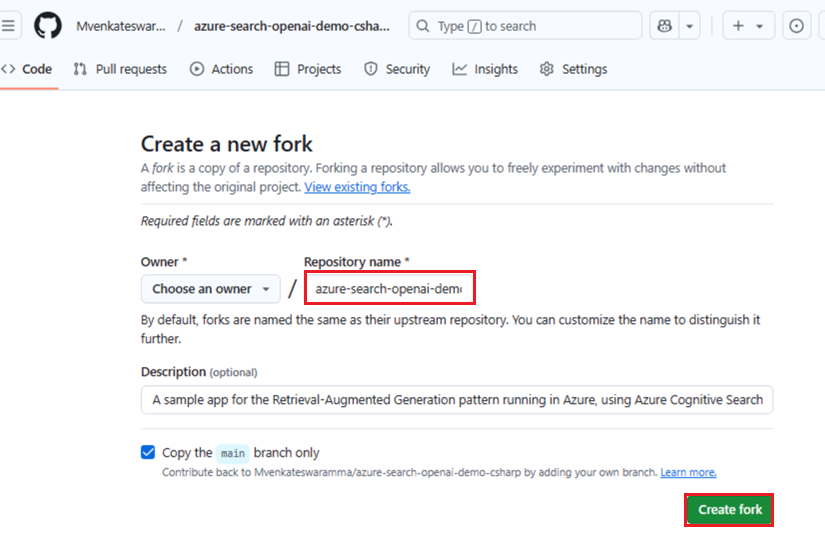

# Caso de uso 04 – Criando um aplicativo de chat (usando .NET) usando Azure OpenAI Service e RAG

Este exemplo demonstra algumas abordagens para criar experiências
semelhantes ao ChatGPT em seus próprios dados usando o modelo Retrieval
Augmented Generation. Ele usa Azure OpenAI Service para acessar o modelo
ChatGPT (gpt-4o-mini), e Azure AI Search para indexação e recuperação de
dados.

O repositório inclui dados de exemplo para que esteja pronto para ser
testado de ponta a ponta. Neste aplicativo de exemplo, usamos uma
empresa fictícia chamada Contoso Electronics, e a experiência permite
que seus funcionários façam perguntas sobre os benefícios, políticas
internas, bem como descrições de cargos e funções.

- Interfaces de chat por voz, chat e perguntas e respostas

- Explora várias opções para ajudar os usuários a avaliar a
  confiabilidade das respostas com citações, rastreamento do conteúdo de
  origem, etc.

- Mostra possíveis abordagens para preparação de dados, construção
  imediata e orquestração de interação entre o modelo (ChatGPT) e o
  recuperador (Azure AI Search)

- Configurações diretamente na UX para ajustar o comportamento e
  experimentar opções

**Principais tecnologias utilizadas** -- Azure OpenAI Service, modelo
ChatGPT (gpt-4o-mini) e Azure AI Search

**Duração estimada -** 40 minutos

# Exercício 1: Implementar o aplicativo e testá-lo no navegador

## Tarefa 1: Ambiente de desenvolvimento aberto

1.  Abra seu navegador, navegue até a barra de endereço, digite ou cole
    a seguinte URL:
    +++https://github.com/technofocus-pte/azure-search-openai-demo-csharp.git+++
    e entre com sua conta do Github.

> 

2.  Clique em **Fork**

> 

3.  Digite o nome do repositório e clique em **Create fork**

> 

4.  Clique em **Code -\> Codespaces -\> +**

> 

5.  Aguarde a configuração do ambiente. Leva de 5 a 10 minutos.

> 

## Tarefa 2: Provisionar os serviços necessários para criar e implementar o aplicativo de chat no Azure

1.  Execute o seguinte comando no Terminal. Copie o código e pressione
    Enter.

> +++azd auth login+++
>
> 

2.  O navegador padrão é aberto para inserir um código. Digite o código
    copiado e clique em **Next**

> 

3.  Entre com suas credenciais do Azure.

4.  Volte para a guia Github Codespace. Execute o comando abaixo para
    inicializar o ambiente do projeto no diretório atual. Insira o nome
    do ambiente como +++**chatragXXX+++** e pressione Enter.

> Nota: o nome do ambiente deve ser exclusivo
>
> +++azd env new+++

5.  Execute o comando abaixo para provisionar os serviços para o Azure,
    crie o seu contêiner.

> +++azd env set AZURE_RESOURCE_GROUP ResourceGroup1+++
>
> 

6.  Executar azd up – isso provisionará recursos do Azure e implementará
    esse exemplo nesses recursos, incluindo a criação do índice de
    pesquisa com base nos arquivos encontrados na pasta ./data.

> **+++azd up+++**
>
> 

7.  Selecione os valores abaixo.

- **Select an Azure Subscription to use** : Selecione sua assinatura

- **Select an Azure location to use** : **East us2/west us2** (Às vezes,
  East US pode não estar disponível, escolha o local na lista mencionada
  abaixo.)

- Select existing resource group : Seu grupo de recursos existente (por
  exemplo :**ResourceGroup1 )**

> 
>
> 

7.  Aguarde até que o recurso seja provisionado completamente. Este
    processo levará de 5 a 10 minutos para criar todos os recursos
    necessários.

> 
>
> 
>
> 

8.  Depois que o aplicativo for implementado com sucesso, você verá uma
    URL exibida no terminal. Copie a **URL**

> 

9.  Clique em **Open**

> 

10. Ele abre o aplicativo em uma nova guia.

> 

11. Abra um navegador, vá para <https://portal.azure.com> e entre com
    sua conta de assinatura do Azure.

12. Na página inicial, clique em **Resource groups**

> 

13. Clique no seu grupo de recursos.

> 

14. Certifique-se de que o recurso abaixo foi implementado com sucesso.

> 

> 

15. No grupo de recursos e clique no nome do recurso do **Azure
    OpenAI**.

> 

16. Na janela **Azure OpenAI**, clique em **Overview** no menu de
    navegação à esquerda, em seguida, na guia **Get Started**, clique no
    botão **Go to Azure OpenAI Studio** para abrir o **Azure OpenAI
    Studio** em um novo navegador.

> 

17. Certifique-se que **gpt-4o-mini**, **text-embedding-ada-002** foi
    implementado com sucesso .

> 

18. No grupo de recursos e clique no nome do recurso da **conta de
    armazenamento**.

> 
>
> 

19. Agora abra a URL em um navegador

> 

20. Clique em **Chat**

> 

21. Na página do aplicativo da web **Blazor OpenAI**, digite o seguinte
    texto e clique no ícone **Submit** conforme mostrado na imagem
    abaixo.

> **+++What is included in my Northwind Health Plus plan that is not in
> standard?+++**
>
> 
>
> 

22. Na página do aplicativo da web **Blazor OpenAI**, digite o seguinte
    texto e clique no ícone **Submit** conforme mostrado na imagem
    abaixo.

> **+++Can I use out-of-network providers?+++**
>
> 
>
> 

23. Na página do aplicativo da web **Blazor OpenAI**, digite o seguinte
    texto e clique no ícone **Submit** conforme mostrado na imagem
    abaixo.

> **+++Are there any exclusions or restrictions?+++**
>
> 
>
> 

24. Na página do aplicativo da web **Blazor OpenAI**, digite o seguinte
    texto e clique no ícone **Submit** conforme mostrado na imagem
    abaixo.

> **+++What does a Product Manager do?+++**
>
> 

25. Clique em **Documents**

> 

## **Tarefa 3: Limpar todos os recursos**

1.  Volte para **Azure portal -\> Resource group-\> Resource group
    name**

> 

2.  Selecione todos os recursos e clique em **Delete** conforme mostrado
    na imagem abaixo. (**NÃO EXCLUA** o grupo de recursos)

> 

3.  Digite delete na caixa de texto e clique em **Delete**

> 

4.  Confirme a exclusão clicando em **Delete**

> 

5.  Volte para a guia do portal do Github e atualize a página.

> 

6.  Clique em **Code**, selecione a ramificação criada para este
    laboratório e clique em **Delete**

> 

7.  Confirme a exclusão da ramificação clicando no botão **Delete**

**Resumo:**

Este caso de uso ensiou você a implementar um aplicativo de chat para o
padrão Retrieval Augmented Generation executado no Azure, a usar Azure
AI Search para recuperação e Azure OpenAI and LangChain Large Language
Models (LLMs) para potencializar experiências no estilo ChatGPT e
perguntas e respostas.
