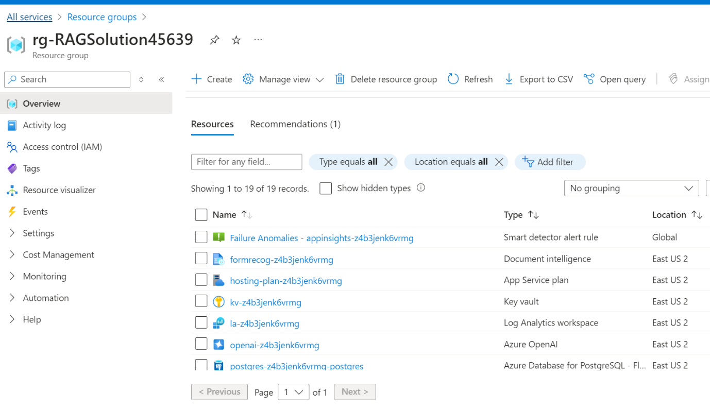

**Anwendungsfall 05 – Bereitstellen und Testen einer Conversational
AI-Lösung mit Azure RAG Accelerator**

**Einleitung**

Der Solution Accelerator *"Chat with your data"* ist ein
leistungsstarkes Tool, das die Funktionen von Azure AI Search und Large
Language Models (LLMs) kombiniert, um eine dialogorientierte
Suchumgebung zu erstellen. Dieser Solution Accelerator verwendet ein
Azure OpenAI GPT-Modell und einen Azure AI Search-Index, der aus Ihren
Daten generiert wird und in eine Webanwendung integriert ist, um eine
Benutzeroberfläche in natürlicher Sprache, einschließlich
Sprache-zu-Text-Funktionalität, für Suchabfragen bereitzustellen.
Benutzer können Dateien per Drag & Drop verschieben, auf den Speicher
verweisen und sich um die technische Einrichtung kümmern, um Dokumente
zu transformieren. Es gibt eine Web-App, die Benutzer in ihrem eigenen
Abonnement mit Sicherheit und Authentifizierung erstellen können.

Die Beispieldaten veranschaulichen, wie dieser Beschleuniger in der
Finanzdienstleistungsbranche (FSI) eingesetzt werden könnte.

In diesem Szenario bereitet sich ein Finanzberater auf ein Treffen mit
einem potenziellen Kunden vor, der Interesse an den Emerging Markets
Funds von Woodgrove Investments bekundet hat. Der Berater bereitet sich
auf das Treffen vor, indem er sein Verständnis für die Gesamtziele des
Schwellenländerfonds und die damit verbundenen Risiken auffrischt.

Jetzt, da der Finanzberater besser über die Emerging Markets Funds von
Woodgrove informiert ist, ist er besser in der Lage, auf Fragen seines
Kunden zu diesem Fonds zu antworten.

Hinweis: Einige der Beispieldaten, die in diesem Beschleuniger enthalten
sind, wurden mithilfe von AI generiert und dienen nur zur
Veranschaulichung.

In diesem Anwendungsfall stellen Sie eine Conversational AI-Lösung
mithilfe von Azure RAG-Accelerator (Retrieval-Augmented Generation)
bereit und testen diese. Diese Lösung nutzt die leistungsstarken
AI-Funktionen von Azure, einschließlich Azure OpenAI und Azure AI
Search, um eine erweiterte Konversationssuchumgebung zu erstellen. Am
Ende dieses Labs verfügen Sie über eine voll funktionsfähige
Webanwendung, die die Verarbeitung natürlicher Sprache verwendet, um mit
Ihren Daten zu interagieren und diese abzufragen. Die praktischen
Schritte führen Sie durch die Bereitstellung der erforderlichen
Infrastruktur, die Überprüfung der Ressourcen, das Testen der Lösung und
die Bereinigung der Umgebung.

**Ziele**

- So stellen Sie die erforderliche Infrastruktur über eine
  benutzerdefinierte Vorlage im Azure-Portal bereit.

- Um zu überprüfen, ob alle erforderlichen Azure-Ressourcen erfolgreich
  bereitgestellt wurden.

- Testen der Funktionalität der bereitgestellten Lösung durch Hochladen
  und Verarbeiten von Dokumenten und Interagieren mit der Webanwendung.

- Um die bereitgestellten Ressourcen und Modelle zu löschen.

**Aufgabe 1: Bereitstellen der Infrastruktur aus der Vorlage**

1.  Öffnen Sie Ihren Browser, navigieren Sie zur Adressleiste, geben Sie
    die folgende UR ein oder fügen Sie sie
    ein:+++[www.portal.azure.com/+++then](http://www.portal.azure.com/+++then)
    drücken Sie die **Enter-**Taste.

2.  Geben Sie im **Microsoft Azure**-Fenster Ihre **Anmeldedaten** ein ,
    und klicken Sie auf die Schaltfläche **Next**.

> 

3.  Geben Sie dann das Passwort ein und klicken Sie auf die Schaltfläche
    **Sign-in**\*\*.\*\*

> 

4.  Im Fenster **Stay signed in?** klicken Sie auf die Schaltfläche
    **Yes**.

> 

5.  Öffnen Sie einen neuen Browser, und geben Sie die folgende URL in
    die Adressleiste ein:
    +++<https://portal.azure.com/#create/Microsoft.Template/uri/https%3A%2F%2Fraw.githubusercontent.com%2FAzure-Samples%2Fchat-with-your-data-solution-accelerator%2Fmain%2Finfra%2Fmain.json+++>,
    um das Azure-Portal zu öffnen.

6.  Geben Sie im Fenster **Custom deployment** auf der Registerkarte
    **Basics** die folgenden Details ein, um die benutzerdefinierte
    Vorlage bereitzustellen, und klicken Sie dann auf **Review +
    create.**

[TABLE]

> 

7.  Klicken Sie auf der Registerkarte **Review + create**, sobald die
    Validierung bestanden ist, auf die Schaltfläche **Create**.

> 

8.  Warten Sie, bis die Bereitstellung abgeschlossen ist. Die
    Bereitstellung dauert etwa 17-19 Minuten.

9.  Klicken Sie auf die Schaltfläche **Go to Subscription**

**Aufgabe 2: Überprüfen der bereitgestellten Ressourcen im
Azure-Portal**

1.  Klicken Sie auf der Startseite auf **Resource Groups**.

> 

2.  Klicken Sie auf den Namen Ihrer Ressourcengruppe
    **rg-RAGSolutionXX**

3.  Stellen Sie sicher, dass die folgende Ressource erfolgreich in der
    Region "East US" bereitgestellt wurde.

    - Azure App Service

    - Azure Application Insights

    - Azure-Bot

    - Azure OpenAI

    - Azure Document Intelligence

    - Azure Function App

    - Azure Search Service

    - Azure Storage Account

    - Azure Speech Service

    - Azure Database for PostgreSQL - Flexible Server

    - Key vault

 

**Aufgabe 3: Testen der Bereitstellung**

1.  Klicken Sie in der Ressourcengruppe auf **Web-** {RESOURCE_TOKEN}
    **- admin-docker** Ressourcenname.

> 

2.  Navigieren Sie zur

> 
>
> 

3.  Wählen Sie auf **Chat with your data Solution Accelerator**-Seite im
    linken Navigationsmenü die Option **Ingest Data.**

> 

4.  Klicken Sie im Bereich Add documents in Batch auf Da **Browse file**
    und navigieren Sie zu **C:\Labfiles \data** location, wählen Sie
    **all files** aus und klicken Sie dann auf die Schaltfläche
    **Open**.

> 

5.  Das Hochladen von Dateien dauert 1-2 Minuten

6.  Klicken Sie auf **Reprocess all documents in the Azure Storage
    account.**

7.  Wählen Sie auf **Chat with your data Solution Accelerator**-Seite im
    linken Navigationsmenü die Option **"Configuration"** aus, und
    aktivieren Sie das **Kontrollkästchen " Enable post-answering prompt
    ".**

> 

8.  Klicken Sie im Konfigurationsbereich auf **Save configuration.**

> 

9.  Kehren Sie zur Ressourcengruppenseite zurück, und klicken Sie auf
    den Namen von **Storage account**.

10. Klicken Sie im linken Navigationsmenü auf **Containers.**

11. Wählen Sie auf der Seite Containers die Option **Documents** aus.

12. Stellen Sie sicher, dass alle Dateien erfolgreich bereitgestellt
    werden.

13. Wechseln Sie zurück zur Ressourcengruppenseite.

14. Wählen Sie auf der Ressourcengruppenseite App Service als
    **web-{RESOURCE_TOKEN}-docker** aus.

15. Wählen Sie im reduzierbaren linken Menü unter Settings die Option
    Authentication aus

16. Klicken Sie auf Add identify provider 

17. Wählen Sie Microsoft als Identitätsanbieter aus, und aktualisieren
    Sie den Namen auf web-XXXXX-docker-new. Wählen Sie die Client secret
    expiration duration auf 90 Days aus, und klicken Sie dann auf Next:
    Permissions.

18. Klicken Sie auf Add permission. Scrollen Sie in der Liste nach
    unten, um Anwendung zu erweitern, und wählen Sie
    Application.ReadWrite.All aus. Klicken Sie dann auf Update
    permission.

> 

19. Klicken Sie auf Add now.

> 

20. Klicken Sie auf die Übersichtsseite der App. Warten Sie, bis die
    Seite geladen ist, und klicken Sie dann auf Restart. Bestätigen Sie
    den Neustart mit einem Klick auf Yes 

21. Navigieren Sie auf der Seite "Web-App-**Overview"** zur
    Befehlsleiste und klicken Sie auf "**Browse**", um zur Webanwendung
    zu gelangen.

> 

22. Geben Sie auf der Seite der **Azure AI**-Web-App den folgenden Text
    ein, und klicken Sie auf das **Symbol Submit**, wie in der folgenden
    Abbildung gezeigt.

+++ Describe in more detail the risks from market volatility +++

 

23. Wählen Sie im Abschnitt **Chat-Session** den Link Referenzen aus und
    beobachten Sie die Details des Suchdokuments auf der rechten Seite
    der Seite.

24. Geben Sie auf der Seite der **Azure AI**-Web-App den folgenden Text
    ein, und klicken Sie auf das Symbol **Submit**, wie in der folgenden
    Abbildung gezeigt.

+++ How does Woodgrove Financial handle payroll taxes for employees
outside the U.S.? +++

 

25. Geben Sie auf der Seite der **Azure AI**-Web-App den folgenden Text
    ein, und klicken Sie auf das **Symbol** **Submit**, wie in der
    folgenden Abbildung gezeigt.

+++ What is FORM 10-K and explain?+++

**Aufgabe 4: Löschen der Azure OpenAI-Ressource**

1.  Geben Sie zu Azure OpenAI-Ressource **Resource groups** in die
    Suchleiste des Azure-Portals ein, navigieren Sie zu
    Ressourcengruppen, und klicken Sie unter **Services** auf **Resource
    groups**.

2.  Klicken Sie auf Ihre Ressourcengruppe.

3.  Wählen Sie auf einer Übersichtsseite der Ressourcengruppe die Option
    **Delete resource group** aus

4.  Geben Sie im Bereich **Delete Resources**, der auf der rechten Seite
    angezeigt wird, den **Resource Group Name** ein, und klicken Sie auf
    die Schaltfläche **Delete**.

5.  Klicken Sie im Dialogfeld **" Delete confirmation** " auf die
    Schaltfläche "**Delete**".

**Zusammenfassung**:

Dieses Lab bietet praktische Erfahrungen beim Bereitstellen einer
Conversational AI-Lösung mit dem Azure RAG Accelerator. Sie haben das
Lab gestartet, indem Sie die erforderliche Infrastruktur mithilfe einer
benutzerdefinierten Vorlage bereitgestellt haben. Nachdem Sie die
erfolgreiche Bereitstellung verschiedener Azure-Ressourcen überprüft
haben, haben Sie die Lösung getestet, indem Sie Dokumente hochgeladen
und die Webanwendung zum Ausführen von Abfragen und Abrufen von
Informationen verwendet haben. Schließlich haben Sie die
Ressourcengruppe gelöscht, um die Ressourcen effizient zu verwalten. In
diesem Lab wurde gezeigt, wie die Dateninteraktion und der Datenabruf
mithilfe fortschrittlicher AI-Technologien verbessert werden können.
