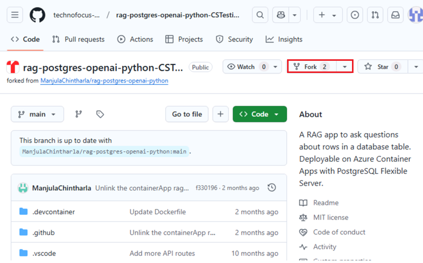
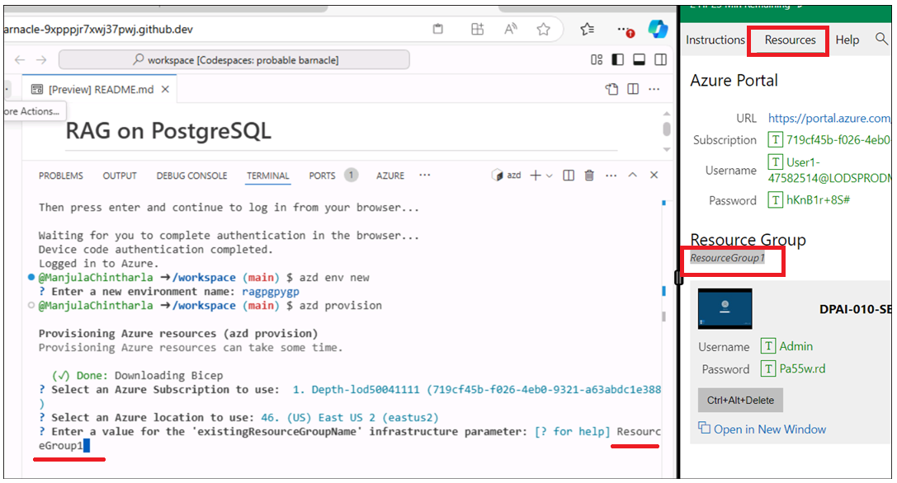
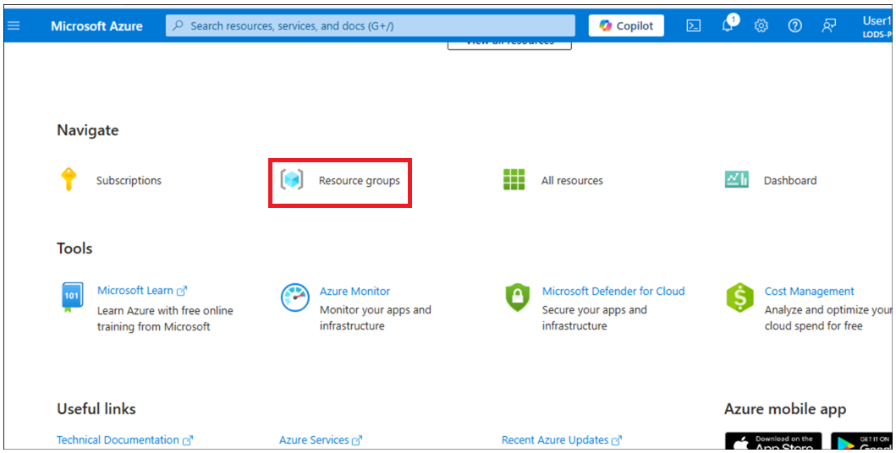
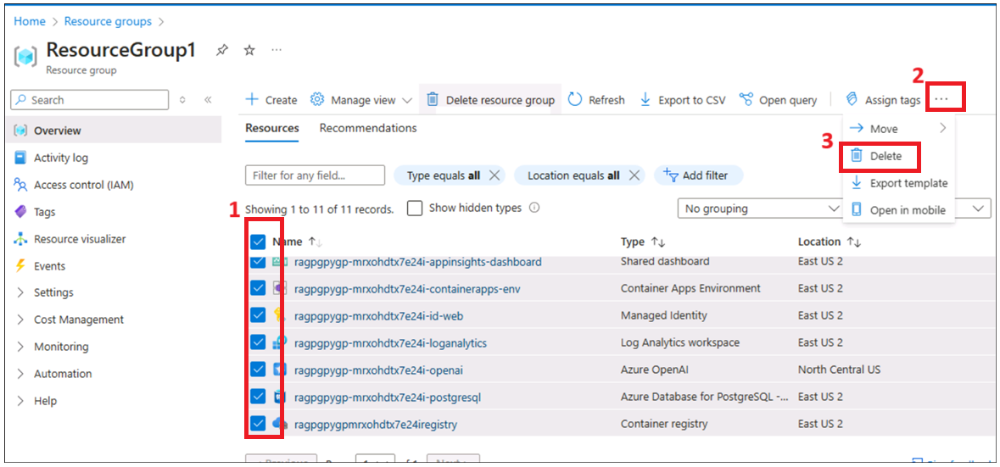

# Usecase 06 – Bereitstellen von Chat-Apps in Azure Container Apps mit PostgreSQL Flexible Server

**Objektiv:**

- Um die Entwicklungsumgebung unter Windows zu konfigurieren, indem Sie
  die Azure CLI Node.js, das Zuweisen von Azure-Abonnementrollen, das
  Starten von Docker Desktop und das Aktivieren der Erweiterung Visual
  Studio Code mit der Erweiterung "Dev Containers" konfigurieren.

- Zum Bereitstellen und Testen der benutzerdefinierten Chatanwendung mit
  PostgreSQL und OpenAI in Azure.

In diesem Anwendungsfall richten Sie eine umfassende
Entwicklungsumgebung ein, stellen eine in PostgreSQL integrierte
Chatanwendung bereit und überprüfen deren Bereitstellung in Azure. Dazu
gehören die Installation wichtiger Tools wie Azure CLI, Docker und
Visual Studio Code ( wir haben dies bereits für Sie auf der Hostumgebung
getan ), das Konfigurieren von Benutzerrollen in Azure, das
Bereitstellen der Anwendung mithilfe der Azure Developer CLI und die
Interaktion mit den bereitgestellten Ressourcen, um die Funktionalität
sicherzustellen.

**Verwendete Schlüsseltechnologien**: Python, FastAPI, Azure
OpenAI-Modelle, Azure Database for PostgreSQL und
azure-container-apps,ai-azd-templates.

**Geschätzte Dauer**: 45 Minuten

**Lab-Typ:** Von einem Kursleiter geleitet

**Voraussetzungen:**

GitHub-Konto – Es wird erwartet, dass Sie über Ihre eigenen
GitHub-Anmeldeinformationen verfügen. Wenn Sie noch keine haben,
erstellen Sie bitte hier eine -
+++<https://github.com/signup?user_email=&source=form-home-signupobjectives+++>

**Übung 1: Bereitstellen, Bereitstellen der Anwendung und Testen über
den Browser**

## Aufgabe 0: Grundlegendes zum VM und den Anmeldeinformationen

In dieser Aufgabe identifizieren und verstehen wir die
Anmeldeinformationen, die wir im gesamten Lab verwenden werden.

1.  Auf der Registerkarte **"Instructions"** befindet sich der
    Lab-Leitfaden mit den Anweisungen, die im gesamten Lab zu befolgen
    sind.

2.  Auf der Registerkarte **"Resources**" befinden sich die
    Anmeldeinformationen, die zum Ausführen des Labs erforderlich sind.

    - **URL:** URL zum Azure-Portal

    - **Abonnement** – Dies ist die ID des Abonnements, das Ihnen
      zugewiesen ist

    - **Benutzername** – Die Benutzer-ID, mit der Sie sich bei den
      Azure-Diensten anmelden müssen.

    - **Passwort**: Passwort für die Azure-Anmeldung. Nennen wir diesen
      Benutzernamen und dieses Passwort als Azure-Anmeldeinformationen.
      Wir werden diese Creds überall dort verwenden, wo wir
      Azure-Anmeldeinformationen erwähnen.

    - **Ressourcengruppe** – Die **Ressourcengruppe**, die Ihnen
      zugewiesen ist.

\[! Warnung\] **Wichtig:** Stellen Sie sicher, dass Sie alle Ihre
Ressourcen unter dieser Ressourcengruppe erstellen.

> 

3.  Die Registerkarte **"Help"** enthält die Supportinformationen. Der
    **ID**-Wert ist hier die **Lab-Instance-ID**, die während der
    Lab-Ausführung verwendet wird.

> 

## Aufgabe 1: Registrieren des Dienstanbieters

1.  Öffnen Sie einen Browser, gehen Sie zu
    +++https://portal.azure.com+++ und melden Sie sich mit Ihrem Cloud
    Slice-Konto unten an.

> Benutzername: [+++@lab.
> CloudPortalCredential](mailto:+++@lab.CloudPortalCredential)(User1).
> Username+++
>
> Passwort: [+++@lab. CloudPortalCredential(User1).
> Password](mailto:+++@lab.CloudPortalCredential(User1).Password)+++
>
> 
>
> 

2.  Klicken Sie auf die Kachel **Subscriptions**.

> 

3.  Klicken Sie auf den Namen des Abonnements.

> 

4.  Erweitern Sie Einstellungen aus dem linken Navigationsmenü. Klicken
    Sie auf **Resource providers**, geben Sie
    +++**Microsoft.AlertsManagement+++** ein, wählen Sie i,t aus, und
    klicken Sie dann auf **Register**.

5.  Klicken Sie auf **Resource providers**, geben Sie
    +++**Microsoft.DBforPostgreSQL+++** ein, wählen Sie i,t aus, und
    klicken Sie dann auf **Register**.

6.  Wiederholen Sie die Schritte \#10 und \#11, um die folgenden
    Ressourcenanbieter zu registrieren.

- Microsoft.Search

- Microsoft.Web

- Microsoft.ManagedIdentity

## Aufgabe 2: Kopieren des Namens der vorhandenen Ressourcengruppe

1.  Klicken Sie auf der Startseite auf die Kachel **Resource groups**.

2.  Stellen Sie sicher, dass Sie bereits über eine Ressourcengruppe
    verfügen, die Sie verwenden können. Löschen Sie diese
    Ressourcengruppe niemals. Stattdessen können Sie Ressourcen
    innerhalb der Ressourcengruppe löschen, aber nicht die
    Ressourcengruppe selbst.

3.  Klicken Sie auf den Namen der Ressourcengruppe.

4.  Kopieren Sie den Namen der Ressourcengruppe, und speichern Sie ihn
    im Editor, um ihn zum Bereitstellen aller Ressourcen in dieser
    Ressourcengruppe zu verwenden

## Aufgabe 3: Ausführen von Docker

1.  Doppelklicken Sie auf dem Desktop auf **Docker Desktop**.

> 

2.  Führen Sie den Docker-Desktop aus.

> 

## Aufgabe 4 : Offene Entwicklungsumgebung

1.  Öffnen Sie Ihren Browser, navigieren Sie zur Adressleiste, geben Sie
    die folgende URL ein oder fügen Sie sie ein: Die Registerkarte
    +++[https://github.com/technofocus-pte/rag-postgres-openai-python-CSTesting.git+++](https://github.com/technofocus-pte/rag-postgres-openai-python-CSTesting.git+++%C2%A0tab)
    wird geöffnet und fordert Sie auf, sie in Visual Studio Code zu
    öffnen. Wählen Sie **Open** **Visual Studio Code** aus.

> 

2.  Klicken Sie auf **fork,** um das Repository zu forken. Geben Sie dem
    Repository einen eindeutigen Namen und klicken Sie auf die
    Schaltfläche **Create Repo**.

> 
>
> 

3.  Klicken Sie auf **Code -\> Codespaces -\> Codespaces+**

> 

4.  Warten Sie auf die Einrichtung der Codespaces-Umgebung, die einige
    Minuten in Anspruch nimmt.

> 
>
> 

## Aufgabe 5: Bereitstellen von Diensten und Bereitstellen der Anwendung in Azure

1.  Führen Sie den folgenden Befehl auf dem Terminal aus. Er generiert
    den zu kopierenden Code. Kopieren Sie den Code, und drücken Sie die
    Enter-Taste.

+++azd auth login+++

> 

2.  Der Standardbrowser wird geöffnet, um den generierten Code
    einzugeben, der überprüft werden soll. Geben Sie den Code ein und
    klicken Sie auf **Next**.

> 

3.  Melden Sie sich mit Ihren Azure-Anmeldeinformationen an.

> 

4.  Um eine Umgebung für Azure-Ressourcen zu erstellen, führen Sie den
    folgenden Azure Developer CLI-Befehl aus. Sie werden aufgefordert,
    den Umgebungsnamen einzugeben. Geben Sie einen beliebigen Namen ein
    und drücken Sie die Enter-Taste (z. B. :+++ragpgpy+++)

**Hinweis:** Achten Sie beim Erstellen einer Umgebung darauf, dass der
Name aus Kleinbuchstaben besteht.

> +++azd env new+++

5.  Führen Sie den folgenden Azure Developer CLI-Befehl aus, um die
    Azure-Ressourcen bereitzustellen und den Code bereitzustellen.

+++ azd provision +++

6.  Wenn Sie dazu aufgefordert werden, wählen Sie ein **Abonnement**
    aus, um die Ressourcen zu erstellen, und wählen Sie die Region aus,
    die Ihrem Standort am nächsten liegt. In diesem Lab haben wir die
    Region **East US2** ausgewählt.

7.  Sie werden aufgefordert zu " **Enter a value for the
    'existingResourceGroupName' infrastructure parameter:'** ein:" Geben
    Sie die Ressourcengruppe ein, die in Aufgabe 1 kopiert wurde (z. B.
    : \*\*ResourceGroup1 wird für den Entwicklungsslice verwendet). Sie
    können den Namen der Ressourcengruppe aus dem Abschnitt
    **"Resources**" kopieren, wie in der folgenden Abbildung gezeigt

8.  Wenn Sie dazu aufgefordert werden, **enter a value for the
    'openAILocation' infrastructure parameter** ein. Wählen Sie die
    Region aus, die Ihrem Standort am nächsten liegt. In diesem Lab
    haben wir die Region " **North Central US** " ausgewählt.

9.  Die Bereitstellung der Ressource dauert etwa 5 bis 10 Minuten.
    Klicken Sie auf **Yes,** wenn Sie dazu aufgefordert werden.

10. Warten Sie, bis die Vorlage alle Ressourcen erfolgreich
    bereitgestellt hat.

11. Führen Sie den folgenden Befehl aus, um die Ressourcengruppe
    festzulegen

+++azd env set AZURE_RESOURCE_GROUP {your resource group
name}+++ 

12. Führen Sie den folgenden Befehl aus, um die App in Azure
    bereitzustellen.

+++azd deploy+++

13. Warten Sie, bis die Bereitstellung abgeschlossen ist. Die
    Bereitstellung dauert \<5

14. Klicken Sie auf den Link für den bereitgestellten Web-App-Endpunkt.

15. Klicken Sie auf **Open**. Es öffnet einen neuen Tab mit App

16. Die App wird geöffnet.

**Aufgabe 6: Verwenden der Chat-App zum Abrufen von Antworten aus
Dateien**

1.  In der **RAG on database |OpenAI+PoastgreSQL** -Web-App-Seite,
    **klicken Sie auf** **Best shoe for hiking?** und beobachten Sie die
    Ausgabe

2.  Klicken Sie auf den **Clear chat.**

3.  In der **RAG on database |OpenAI+PoastgreSQL** -Web-App-Seite,
    klicken Sie auf die Schaltfläche **Climbing gear cheaper than \\30**
    und beobachten Sie die Ausgabe

4.  Klicken Sie auf den **Clear** **Chat.**

**Aufgabe 7: Überprüfen der bereitgestellten Ressourcen im
Azure-Portal**

1.  Klicken Sie auf der Startseite des Azure-Portals auf **Resource
    Groups**.

2.  Klicken Sie auf den Namen Ihrer Ressourcengruppe.

3.  Stellen Sie sicher, dass die folgende Ressource erfolgreich
    bereitgestellt wurde

    - Container App

    - Application Insights

    - Container Apps Environment

    - Log Analytics workspace

    - Azure OpenAI

    - Azure Database for PostgreSQL flexible server

    - Container registry

4.  Klicken Sie auf **Azure OpenAI**-Ressourcenname.

5.  Klicken Sie im linken Navigationsmenü unter **Overview** auf **Go to
    Azure AI Foundry portal,** und wählen Sie aus, um eine neue
    Registerkarte zu öffnen.

6.  Klicken Sie im linken Navigationsmenü auf **Shared resources -\>
    Deployments** und stellen Sie sicher, dass **gpt-35-turbo**,
    **text-embedding-ada-002** erfolgreich bereitgestellt werden sollte

**Aufgabe 8: Bereinigen aller Ressourcen**

So bereinigen Sie alle Ressourcen, die in diesem Beispiel erstellt
wurden:

1.  Wechseln Sie zurück zum **Azure-Portal -\> Resource group- \>
    Resource group name.**

2.  Wählen Sie die gesamte Ressource aus und klicken Sie dann auf
    Delete, wie in der folgenden Abbildung gezeigt. (Ressourcengruppe
    **NICHT LÖSCHEN**)

3.  Geben Sie delete in das Textfeld ein und klicken Sie dann auf
    **Delete**.

4.  Bestätigen Sie den Löschvorgang mit einem Klick auf **Delete**.

5.  Wechseln Sie zurück zur Registerkarte Github-Portal, und
    aktualisieren Sie die Seite.

6.  Klicken Sie auf Code , wählen Sie den für dieses Lab erstellten
    Zweig aus und klicken Sie auf **Delete**.

7.  Bestätigen Sie das Löschen des Zweigs, indem Sie auf die
    Schaltfläche **Delete** klicken.

**Zusammenfassung:**:Dieser Anwendungsfall führt Sie durch die
Bereitstellung einer Chat-Anwendung mit PostgreSQL und OpenAI in Azure,
wobei der Schwerpunkt auf der Bereitstellung und Verwaltung
cloudbasierter Anwendungen liegt. Sie haben die Entwicklungsumgebung
eingerichtet, die erforderlichen Tools wie die Azure CLI installiert,
Azure-Ressourcen mit der Azure Developer CLI konfiguriert und die
Anwendung in Azure Container Apps bereitgestellt.
