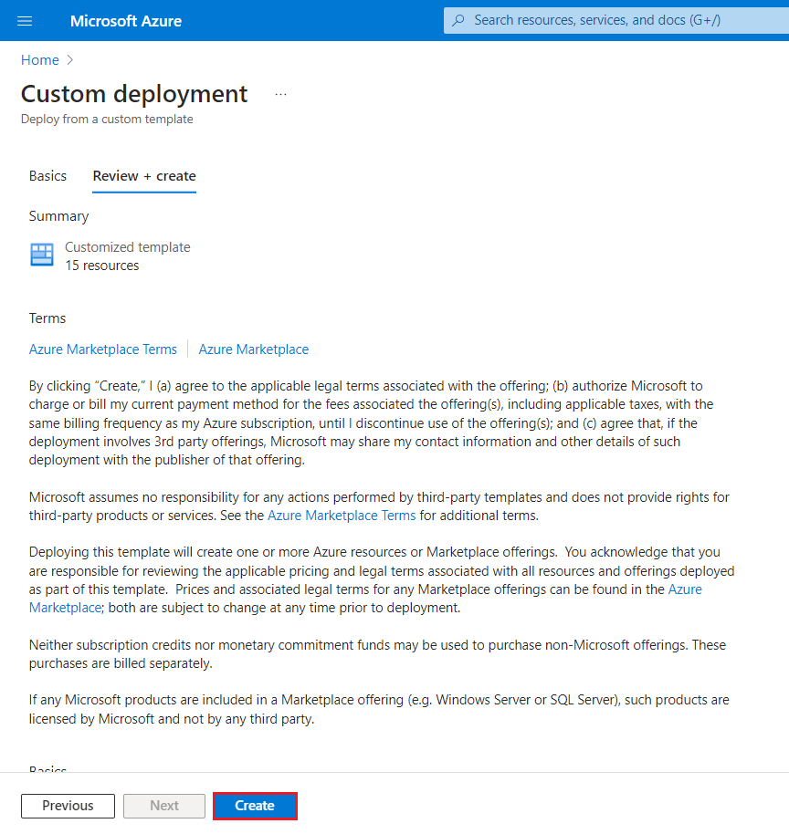
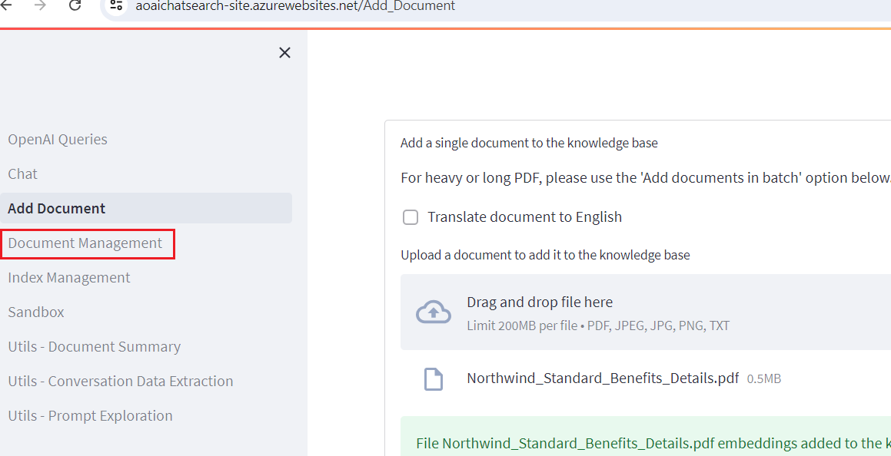
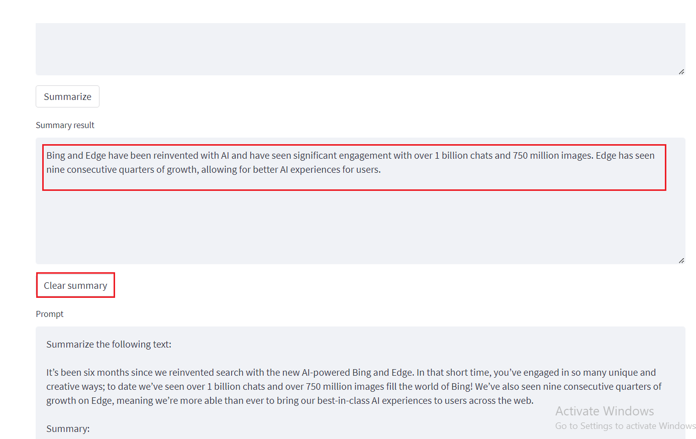

**Lab 07: Implementierung von Fragen und Antworten(Q&A) mit semantischen
Antworten**

**Einleitung**

Eine einfache Webanwendung für eine OpenAI-fähige Dokumentensuche. In
diesem Repository wird der Azure OpenAI-Dienst zum Erstellen von
Einbettungsvektoren aus Dokumenten verwendet. Um die Frage eines
Benutzers zu beantworten, ruft es das relevanteste Dokument ab und
verwendet dann GPT-3, um die passende Antwort für die Frage zu
extrahieren.

**Ziele**

- Zum Bereitstellen von Chat- und Einbettungsmodellen in Azure AI
  Studio.

- So verwenden Sie eine benutzerdefinierte Vorlage zum Bereitstellen der
  erforderlichen Ressourcen, z. B. App Service, Suchdienst,
  Formularerkennung usw.

- Zum Bereitstellen der aoaichatsearch-site-Web-App und Durchführen
  einer Azure OpenAI-fähigen Dokumentsuche, Textzusammenfassung und
  Extraktion von Konversationsdaten.

- Um die bereitgestellten Ressourcen und Modelle zu löschen.

## **Aufgabe 1: Erstellen einer Azure OpenAI-Ressource**

1.  Klicken Sie auf der Startseite des Azure-Portals auf das **Menü des
    Azure-Portals,** das durch drei horizontale Balken auf der linken
    Seite der Microsoft Azure-Befehlsleiste dargestellt wird, wie in der
    folgenden Abbildung gezeigt.

> 

2.  Navigieren Sie und klicken Sie auf **+ Create a resource**.

> 

3.  Geben Sie auf der Seite **Create a resource** in der Suchleiste
    **Search services and marketplace** den Namen **Azure OpenAI** ein,
    und drücken Sie dann die **Enter**-Taste.

> 

4.  Navigieren Sie auf der Seite **Marketplace** zum Abschnitt **Azure
    OpenAI**, klicken Sie auf die Dropdownliste Schaltfläche Create, und
    wählen Sie dann **Azure OpenAI** aus, wie im Bild gezeigt. (Falls
    Sie bereits auf die Schaltfläche **Azure OpenAI**-Kachel, und
    klicken Sie dann auf der **Azure OpenAI**-Seite auf die Schaltfläche
    **Create**.

> 

5.  Geben Sie im Fenster **Create Azure OpenAI** auf der Registerkarte
    **Basics** die folgenden Details ein, und klicken Sie auf die
    Schaltfläche **Next**.

[TABLE]

> 

6.  Lassen Sie auf der Registerkarte **Network** alle Optionsfelder im
    Standardzustand und klicken Sie auf die Schaltfläche **Next**.

> 

7.  Lassen Sie auf der Registerkarte **Tags** alle Felder im
    Standardzustand und klicken Sie auf die Schaltfläche **Next**.

> 

8.  Klicken Sie auf der Registerkarte **Review+submit**, sobald die
    Validierung bestanden ist, auf die Schaltfläche **Create**.

> 

9.  Warten Sie, bis die Bereitstellung abgeschlossen ist. Die
    Bereitstellung dauert ca**. 2-3** Minuten.

10. Klicken Sie im **Microsoft.CognitiveServicesOpenAI**-Fenster nach
    Abschluss der Bereitstellung auf die Schaltfläche **Go to
    resource**.

> 

11. In Ihrem **Azure-open-testXX | Model deployments**-Fenster,
    navigieren Sie zum Abschnitt **Resource Management** und klicken Sie
    auf **Keys and Endpoints**.

12. Kopieren Sie auf der Seite **Keys and Endpoints** die Werte **KEY1,
    KEY 2** und **Endpoint,** fügen Sie sie in einen Editor ein, wie in
    der folgenden Abbildung gezeigt, und **speichern Sie** dann den
    Editor, um die Informationen im nächsten Lab zu verwenden.

## **Aufgabe 2: Bereitstellen des Chat-Modells und des Einbettungsmodells**

1.   Klicken Sie auf der Seite **Azure-openai-testXX** im linken
    Navigationsmenü auf **Overview,** scrollen Sie nach unten und
    klicken Sie auf die Schaltfläche **Explore Azure AI
    Foundry-Portal**, wie in der folgenden Abbildung gezeigt.

> 

2.  Warten Sie, bis das Azure OpenAI Studio gestartet wird.

> 

3.  In der **Azure** **AI Foundry** |**Azure OpenAI Studio**-Startseite,
    wählen Sie im linken Navigationsmenü **Deployment** aus.

4.  Öffnen Sie im Fenster **Deployments** das **+ Deploy model**, und
    wählen Sie **Deploy base model** aus.

> 

5.  Navigieren Sie im Dialogfeld **Select a model**, wählen Sie
    **gpt-4** sorgfältig aus und klicken Sie dann auf die Schaltfläche
    **Confirm**.

6.  Wählen Sie die **Modellversion** als **0125-Preview** aus**,** geben
    Sie im Feld **Deployment type** als **Standard, Deployment name
    gpt-4** ein, und klicken Sie auf die Schaltfläche **Create**.

> 

7.  Öffnen Sie im Fenster **Deployments** das **+Deploy model**, und
    wählen Sie **Deploy base model** aus.

> 

8.  Navigieren Sie im Dialogfeld **Select a model** zu
    **text-embedding-ada-002** und klicken Sie dann auf die Schaltfläche
    **Confirm**.

9.  Geben Sie im Dialogfeld **Deploy model** unter **Deployment name**
    +++**text-embedding-ada-002**+++ ein**,** wählen Sie **Standard**
    als **Deployment type** aus, und klicken Sie auf die Schaltfläche
    **Deploy**.

## **Aufgabe 3: Bereitstellen in Azure (WebApp + Batchverarbeitung) mit Azure Cognitive Search**

1.  Öffnen Sie Ihren Edge-Browser, navigieren Sie zur Adressleiste, und
    geben Sie die folgende URL ein oder fügen Sie sie ein:
    <https://portal.azure.com/#create/Microsoft.Template/uri/https%3A%2F%2Fraw.githubusercontent.com%2Fruoccofabrizio%2Fazure-open-ai-embeddings-qna%2Fmain%2Finfrastructure%2Fdeployment_ACS.json>
    drücken Sie dann die **Enter**-Taste.

2.  Geben Sie im Fenster **Custom deployment** auf der Registerkarte
    **Basics** die folgenden Details ein, um die benutzerdefinierte
    Vorlage bereitzustellen, und klicken Sie dann auf **Review +
    create.**

[TABLE]

3.  Klicken Sie auf der Registerkarte **Review + create**, sobald die
    Validierung bestanden ist, auf die Schaltfläche **Create**.

4.  Warten Sie, bis die Bereitstellung abgeschlossen ist. Die
    Bereitstellung dauert etwa 15-17 Minuten.

> 

5.  Klicken Sie auf die Schaltfläche **Go to resource group**.

> 

## **Aufgabe 4: Azure OpenAI-fähige Dokumentensuche über eine Webanwendung**

1.  Navigieren Sie im Fenster der Ressourcengruppe **aoaiXXX-RG** auf
    der Registerkarte **Resources** zur **App Service** –
    **aoaaichatsearch-site**, und klicken Sie darauf.

2.  Navigieren Sie auf der Web-App-**Overview**-Seite der
    **aoaichatsearch-site** zur Befehlsleiste und klicken Sie auf
    **Browse**, um zur Webanwendung zu gelangen.

3.  Warten Sie, bis die Bereitstellung der Webanwendung abgeschlossen
    ist. Die Bereitstellung dauert ca.**10 bis 15** Minuten.

4.  Um den Status der Bereitstellungen zu überprüfen, klicken Sie auf
    der Startseite der Webanwendung unter Microsoft auf die Schaltfläche
    **Check deployments**.

5.  Das Überprüfen des Bereitstellungsstatus kann etwa 5-6 Minuten
    dauern.

6.  Navigieren Sie auf der Startseite der Web-App und klicken Sie auf
    der linken Seite auf **Add Document**, um die Daten hinzuzufügen.

7.  Klicken Sie im Bereich **Add Document** auf die Schaltfläche
    **Browse files**, um Dokumente hochzuladen, die der Wissensdatenbank
    hinzugefügt werden müssen.

8.  Navigieren Sie auf der VM zum Speicherort **C:\Labfiles\Contoso
    Electronics**, wählen Sie **Benefit_Options.pdf** aus**,** und
    klicken Sie dann auf die Schaltfläche **Open.**

9.  Klicken Sie erneut auf **Browse files**, navigieren Sie auf der VM
    zum Speicherort **C:\Labfiles\Contoso Electronics**, wählen Sie
    **employee_handbook.pdf** aus, und klicken Sie dann auf die
    Schaltfläche **Open**.

10. Fügen Sie auf ähnliche Weise
    **Northwind_Health_Plus_Benefits_Details.pdf** und
    **Northwind_Standard_Benefits_Details.pdf** hinzu

11. Die hochgeladenen Daten werden der Wissensdatenbank hinzugefügt und
    es dauert ca. 5-7 Minuten.

12. Klicken Sie auf **Document Management** , um zu überprüfen, ob die
    Dateien erfolgreich hochgeladen wurden oder nicht.

13. Klicken Sie auf **Index Management**, um die Dateien, Schlüssel und
    die Quelle zu überprüfen.

14. Klicken Sie dann auf **Chat.**

15. Geben Sie im Abschnitt **Chat-Session** die folgende Prompt ein,
    drücken Sie die **Enter**-Taste, und zeigen Sie die Antwort an.

**Sie**: **What is the employee's portion of the healthcare cost from
each paycheck in Contoso Electronics**

16. Klicken Sie im Abschnitt **Chat-Session** auf die Schaltfläche
    **Clear chat**.

17. Geben Sie im Abschnitt **Chat-Session** die folgende Prompt ein,
    drücken Sie die **Enter**-Taste, und zeigen Sie die Antwort an.

**Sie**: **How do I file a complaint or appeal with Northwind Health
Plus?**

18. Klicken Sie im Abschnitt **Chat-Session** auf die Schaltfläche
    **Clear** **Chat**.

19. Geben Sie im Abschnitt **Chat-Session** die folgende Prompt ein.
    Drücken Sie dann die **Enter**-Taste und sehen Sie sich die Antwort
    an.

**Sie**: **Does my plan covers my eye exams?**

20. Klicken Sie auf der linken Seite auf **Utils-Document Summary**.

21. Wählen Sie im Abschnitt **Summarization** das Optionsfeld **Basic
    Summary** aus.

22. Ersetzen Sie im Fenster **Summarization** im Meldungsfeld unter
    **Enter some text to summarize** ein den aktuellen Text durch den
    folgenden Text und klicken Sie dann auf die Schaltfläche
    **Summarize**.

It’s been six months since we reinvented search with [the new AI-powered
Bing and
Edge](https://blogs.microsoft.com/blog/2023/02/07/reinventing-search-with-a-new-ai-powered-microsoft-bing-and-edge-your-copilot-for-the-web/).
In that short time, you’ve engaged in so many unique and creative ways;
to date we’ve seen over 1 billion chats and over 750 million images fill
the world of Bing! We’ve also seen nine consecutive quarters of growth
on Edge, meaning we’re more able than ever to bring our best-in-class AI
experiences to users across the web.

23. Überprüfen Sie die Zusammenfassung des eingegebenen Textes.

24. Nachdem Sie das Ergebnis der Zusammenfassung überprüft haben,
    klicken Sie auf die Schaltfläche **Clear summary**.

25. Scrollen Sie nun nach oben, und wählen Sie das Optionsfeld **Bullet
    Points** aus. Unter Abschnitt **Enter some text to summarize**,
    ersetzen Sie im Meldungsfeld den aktuellen Text durch den folgenden
    Text, und klicken Sie dann auf die Schaltfläche **Summarize**.

Microsoft has made its Azure OpenAI Service generally available,
bringing the enterprise generative AI tools out of its invite-only
program. Now any customers who meet Microsoft’s standards can access the
professional versions of OpenAI’s large language model GPT-3.5 and the
related text-to-image tool DALL-E 2, computer programming assistant
Codex, and the popular ChatGPT chatbot interface for the LLM.

Microsoft launched the Azure OpenAI Service with an eye toward offering
businesses a way to develop apps without coding, write reports, and put
together marketing content. The scope has grown since then to encompass
new facets of the OpenAI’s models, including chat and visuals. Those
interested in the tools have to explain how they will use the AI tools
and agree to Microsoft’s ethical guidelines in their application for
access. The decision to widen the Azure OpenAI Service’s availability
arrives in tandem with Microsoft’s plans to integrate ChatGPT and DALL-E
into its Office suite, Bing search engine, and other consumer products.
Azure OpenAI Service followed earlier experiments to integrate GPT-3
into Microsoft projects like the low-code Power Apps programming tool
and the GitHub Copilot programming assistant.

26. DieZusammenfassungsergebnisse werden in Form von Aufzählungspunkten
    angezeigt.

27. Klicken Sie auf der linken Seite auf **Utils-Conversation Data
    Extraction**.

28. Klicken Sie im Bereich **Conversation data extraction** auf
    **Execute tasks** und zeigen Sie die Antwort unter **OpenAI-Result**
    an.

29. Überprüfen Sie die Daten, die aus der Konversation zwischen dem
    Agent und dem Benutzer extrahiert wurden.

## Aufgabe 5: Löschen der bereitgestellten Ressourcen und Modelle

1.  Um die bereitgestellten Ressourcen zu löschen, navigieren Sie zur
    **Startseite des** **Azure-Portals**, und klicken Sie auf **Resource
    groups**.

> 

2.  Wählen Sie auf der Seite Ressourcengruppen Ihre Ressourcengruppe
    aus.

> 

3.  Wählen Sie auf der Startseite der **Ressourcengruppe** alle
    Ressourcen aus, und klicken Sie auf **Delete**

4.  Navigieren Sie im Bereich **" Delete Resources** ", der auf der
    rechten Seite angezeigt wird, zu **"Delete" eingeben, um das
    Löschfeld zu bestätigen**, und klicken Sie dann auf die Schaltfläche
    **Delete**.

5.  Klicken Sie im Dialogfeld " **Delete confirmation** " auf die
    Schaltfläche **"Delete**".

> 

6.  Klicken Sie auf das Glockensymbol, um die Benachrichtigung zu sehen

**Zusammenfassung**

Sie haben das gpt-4-Chatmodell und das Einbettungsmodell
text-embedding-ada-002 in Ihrem Azure AI Studio bereitgestellt und dann
die erforderlichen Ressourcen mithilfe einer benutzerdefinierten Vorlage
bereitgestellt. Sie haben unstrukturierte Dokumente in die Web-App der
aoaichatsearch-site hochgeladen und die genauen Informationen in einer
Chat-Sitzung extrahiert. Sie haben sowohl eine Basis- als auch eine
Zusammenfassung von Aufzählungspunkten aus Beispieltexten generiert und
dann die Daten aus einer Konversation extrahiert. Am Ende des Labs haben
Sie die Ressourcen und Modelle gelöscht, um Ihre Azure OpenAI-Ressourcen
effizient zu verwalten.

**Wichtiger Hinweis: Bitte löschen Sie die Ressourcengruppe nicht. Wenn
Sie gelöscht werden, können Sie nicht mit dem nächsten Lab fortfahren
oder keine neue Ressourcengruppe erstellen.**

**Löschen Sie den Azure OpenAI-Dienst (Azure-openai-testXX) nicht. Der
gleiche Service wird in allen Labs verwendet.**
