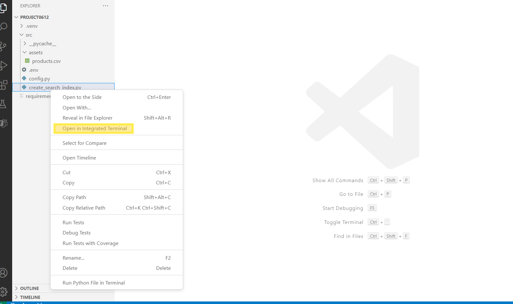

Anwendungsfall 08 – Erstellen einer benutzerdefinierten Chat-App mit dem
Azure AI Foundry SDK

**Geschätzte Zeit: 120 Minuten**

## Objektiv

Ziel dieses Labs ist das Erstellen, Auswerten und Bereitstellen eines
RAG-basierten Agents (Retrieval-Augmented Generation,
Retrieval-Augmented Generation, RAG) mithilfe des Azure AI Foundry SDK.
Das Lab führt Sie durch das Einrichten der Projekt- und
Entwicklungsumgebung, das Bereitstellen von AI-Modellen (z. B. GPT-4 und
text-embedding-ada-002), das Integrieren von Azure AI Search für den
Dokumentabruf und das Erstellen einer benutzerdefinierten Knowledge
Retrieval (RAG)-Chatanwendung. Der Fokus liegt auf der Verankerung von
AI-Modellantworten mit relevanten Produktdaten, der Entwicklung einer
benutzerdefinierten Chat-Oberfläche und der Bewertung der Leistung der
generierten Antworten.

## Lösung

Die Lösung umfasst das Einrichten eines Projekts in Azure AI Foundry,
das Bereitstellen von AI-Modellen (GPT-4 und text-embedding-ada-002) und
die Integration von Azure AI Search zum Speichern und Abrufen
benutzerdefinierter Produktdaten. Dazu gehört die Erstellung von
Python-Skripten zum Generieren von Vektoreinbettungen, zum Erstellen von
Suchindizes und zum Abfragen relevanter Produktinformationen. Eine
RAG-basierte Chat-Schnittstelle wird entwickelt, um durch die Nutzung
der Suchergebnisse fundierte Antworten zu liefern, und die Leistung der
Chat-App wird anhand vordefinierter Datensätze und Metriken bewertet, um
ihre Wirksamkeit zu verbessern.

## Übung 0: Grundlegendes zum VM und den Anmeldeinformationen

In dieser Übung identifizieren und verstehen wir die
Anmeldeinformationen, die wir im gesamten Lab verwenden werden.

**Wichtig:** Führen Sie jeden Schritt in dieser Übung aus, um sich mit
den generischen Begriffen und den Anmeldeinformationen vertraut zu
machen, die für die Labausführung verwendet werden.

1.  Auf der Registerkarte **"Instructions"** befindet sich der
    Lableitfaden mit den Anweisungen, die im gesamten Lab zu befolgen
    sind.

2.  Auf der Registerkarte **"Resources**" befinden sich die
    Anmeldeinformationen, die zum Ausführen des Labs erforderlich sind.

- **URL:** URL zum Azure-Portal

- **Abonnement** – Dies ist die **ID** des **Abonnements**, das Ihnen
  zugewiesen ist

- **Benutzername** – Die **User-ID**, mit der Sie **sich** bei den
  **Azure-Services anmelden** müssen.

- **Passwort:** **Passwort** für die **Azure-Anmeldung**.

> Nennen wir diesen Benutzernamen und dieses Passwort als **Azure Login
> Credentials**. Wir werden diese Creds überall dort verwenden, wo wir
> **Azure login credentials** erwähnen.

- **Ressourcengruppe** – Die **Ressourcengruppe** , die Ihnen zugewiesen
  ist.

> **Wichtig**: Stellen Sie sicher, dass Sie alle Ressourcen unter dieser
> Ressourcengruppe erstellen.

3.  Die Registerkarte **"Help"** enthält die Supportinformationen. Der
    **ID-**Wert ist hier die **Lab-Instance-ID**, die während der
    Lab-Ausführung verwendet wird.

## Übung 1: Einrichten einer Projekt- und Entwicklungsumgebung zum Erstellen einer benutzerdefinierten RAG-App (Knowledge Retrieval) mit dem Azure AI Foundry SDK

### Aufgabe 1: Erstellen eines Projekts

Führen Sie die folgenden Schritte aus, um ein Projekt in Azure AI
Foundry zu erstellen:

1.  Melden Sie sich bei der Azure AI Foundry unter
    +++<https://ai.azure.com/> **sign-in** mit den **Azure login
    credentials** an.

> 

2.  Wählen Sie **+ Create project** aus.

> 

3.  Geben Sie als Namen für das Projekt
    **+++RAGproj\<Lab-Instance-ID\>**+++ ein und klicken Sie auf
    **Customize**.

> **Hinweis:** Ersetzen Sie die **\<Lab-Instance-ID\>** durch Ihre
> **Lab-Instance-ID.**
>
> 

4.  Geben Sie auf der nächsten Seite die folgenden Details ein und
    klicken Sie auf **Next.**

> Hub-Name - +++hub\<Lab-Instance-ID\>+++
>
> Abonnement: Wählen Sie Ihr zugewiesenes Abonnement aus.
>
> Neue Ressourcengruppe erstellen: Wählen Sie die zugewiesene
> Ressourcengruppe (ResourceGroup1) aus.
>
> Standort – East US 2 oder Sweden Central (Wir haben beim Ausführen
> diesem Lab "East US 2" verwendet)
>
> Lassen Sie den Rest als Standard und klicken Sie auf **Next**.
>
> 

5.  Klicken Sie auf der Seite **Review and finish** auf **Create.**

> 

6.  Die Erstellung der Ressource dauert einige Minuten.

7.  Schließen Sie die Popup-Fenster, falls eines angezeigt wird.

8.  Notieren Sie sich auf der Startseite des Projekts die **Project
    connection string** in einem Editor, der in der nächsten Aufgabe
    dieser Übung verwendet werden soll.

> 

### Aufgabe 2: Bereitstellen von Modellen

Sie benötigen zwei Modelle, um eine RAG-basierte Chat-App zu erstellen:
ein Azure OpenAI-Chatmodell (gpt-4o-mini) und ein Azure
OpenAI-Einbettungsmodell (text-embedding-ada-002). Stellen Sie diese
Modelle in Ihrem Azure AI Foundry-Projekt bereit, indem Sie diese
Schritte für jedes Modell ausführen.

Mit diesen Schritten wird ein Modell an einem Echtzeitendpunkt aus dem
[Model
Catalogue](https://learn.microsoft.com/en-us/azure/ai-studio/how-to/model-catalog-overview)
des AI Foundry-Portals bereitgestellt:

1.  Wählen Sie im linken Navigationsbereich **Model catalog** aus.

> 

2.  Wählen Sie das Modell **gpt-4o-mini** aus der Liste der Modelle aus.
    Sie können die Suchleiste verwenden, um es zu finden.

> 

3.  Wählen Sie auf der Seite mit den Modelldetails die Option **Deploy**
    aus.

> 

4.  Behalten Sie den standardmäßigen **Deployment name** bei. Wählen Sie
    **Deploy** aus. Wenn das Modell in Ihrer Region nicht verfügbar ist,
    wird eine andere Region für Sie ausgewählt und mit Ihrem Projekt
    verbunden. Wählen Sie in diesem Fall **Create resource and deploy**
    aus.

> 
>
> 

5.  Wiederholen Sie nach dem Bereitstellen des **gpt-4o-mini** die
    Schritte zum Bereitstellen des Modells
    +++**text-embedding-ada-002**+++.

### Aufgabe 3: Erstellen eines Azure AI Search-Diensts

Das Ziel dieser Anwendung besteht darin, die Modellantworten in Ihren
benutzerdefinierten Daten zu verankern. Der Suchindex wird verwendet, um
relevante Dokumente basierend auf der Frage des Benutzers abzurufen.

Sie benötigen einen Azure AI Search-Dienst und eine Verbindung, um einen
Suchindex zu erstellen.

1.  Melden Sie sich beim Azure-Portal unter
    +++[<https://portal.azure.com>+++ mit den Azure-Anmeldeinformationen
    an.](https://portal.azure.com)

2.  Suchen Sie in der Suchleiste der Startseite nach +++**AI-Search**+++
    und wählen Sie sie aus.

> 

3.  Klicken Sie auf das Symbol **+ Create** und geben Sie die folgenden
    Details ein.

> 

4.  Geben Sie die folgenden Details ein, und wählen Sie **Review +
    create** aus.

- Abonnement – Wählen Sie Ihr zugewiesenes Abonnement aus

- Ressourcengruppe: Wählen Sie die zugewiesene Ressourcengruppe aus.

- Dienstname – Geben Sie +++**aisearch\<Lab-Instance-ID\>**+++ ein und
  ersetzen Sie die Lab-Instanz-ID durch die ID Ihrer VM.

- Region: Wählen Sie " Sweden Central " oder " East US 2" aus (hier wird
  " East US 2" verwendet)

- Tarif – **Standard** auswählen

> 

5.  Überprüfen Sie die Details, und wählen Sie **Create** aus.

> 

6.  Warten Sie, bis die Bereitstellung wie im folgenden Screenshot
    erfolgreich ist, bevor Sie mit dem nächsten Schritt fortfahren.

> 

### Aufgabe 4: Verbinden der Azure AI Search mit Ihrem Projekt

Suchen Sie im Azure AI Foundry-Portal nach einer mit Azure AI Search
verbundenen Ressource.

1.  Wählen Sie in Ihrem Projekt in Azure AI Foundry im linken Bereich
    **Management center** aus.

> 

2.  Wählen Sie im Abschnitt **Connected resources** die Option **New
    connection** und dann **Azure AI Search** aus.

> 
>
> 

3.  Wählen Sie unter **Authentication** die Option **API-Key** aus, und
    wählen Sie **Add connection** aus.

> 
>
> 
>
> 

### Aufgabe 5: Installieren der Azure CLI und Anmelden

Sie installieren die Azure CLI und melden sich in Ihrer lokalen
Entwicklungsumgebung an, damit Sie Ihre Benutzeranmeldeinformationen zum
Aufrufen des Azure OpenAI-Diensts verwenden können.

1.  Suchen Sie in der Windows-Suchleiste nach +++**PowerShell**+++ und
    öffnen Sie es im Administratormodus.

> 

2.  Öffnen Sie die Windows Power Shell, fügen Sie den unten angegebenen
    Befehl ein und führen Sie ihn aus.

> $progressPreference = 'silentlyContinue'
>
> Write-Host "Installing WinGet PowerShell module from PSGallery..."
>
> Install-PackageProvider -Name NuGet -Force | Out-Null
>
> Install-Module -Name Microsoft.WinGet.Client -Force -Repository
> PSGallery | Out-Null
>
> Write-Host "Using Repair-WinGetPackageManager cmdlet to bootstrap
> WinGet..."
>
> Repair-WinGetPackageManager
>
> Write-Host "Done."

3.  Installieren Sie die Azure CLI über Ihr Terminal mit dem folgenden
    Befehl:

winget install -e --id Microsoft.AzureCLI

Wählen Sie **Y** aus, wenn Sie zur Annahme aufgefordert werden.

4.  Melden Sie sich nach der Installation der Azure CLI mit dem Befehl
    az login an, und melden Sie sich mit dem Browser an:

+++Az login+++

Wählen Sie **Work or School Account** aus und klicken Sie auf
**Continue**.

5.  Melden Sie sich mit Ihren **Azure Login Credentials** an.

6.  Geben Sie **1** für die Prompt **" Select a subscription "** ein und
    klicken Sie auf die **Enter**-Taste.

### Aufgabe 6: Erstellen einer neuen Python-Umgebung

Zuerst müssen Sie eine neue Python-Umgebung erstellen, in der Sie das
Paket installieren, das Sie für dieses Tutorial benötigen. Installieren
Sie KEINE Pakete in Ihrer globalen Python-Installation. Sie sollten bei
der Installation von Python-Paketen immer eine virtuelle oder
Conda-Umgebung verwenden, da Sie sonst Ihre globale Installation von
Python unterbrechen können.

**Erstellen einer virtuellen Umgebung**

1.  Navigieren Sie in Ihrer Power Shell zu **C:\Users\Admin,** indem Sie
    die folgenden Befehle ausführen.

+++cd\\++

+++cd Users\Admin+++

2.  Erstellen Sie einen Ordner mit Ihrem Projektnamen,
    **RAGproj\<Lab-Instance-ID\>, indem Sie den folgenden Befehl in Ihre
    PowerShell eingeben.**

**Hinweis:** Ersetzen Sie im folgenden Befehl \<Project name\> durch den
Namen Ihres Projekts und führen Sie es aus.

+++**mkdir \<Project name\>**+++

3.  Geben Sie in Ihrem Terminal den folgenden Befehl ein, um zum neuen
    Ordnerspeicherort zu navigieren

+++ **cd \<Project name\>+++**

Ersetzen Sie \<Project name\> durch den Ordnernamen, den Sie im
vorherigen Schritt erstellt haben.

4.  Erstellen Sie eine virtuelle Umgebung mit den folgenden Befehlen

+++py -3 -m venv .venv+++

+++.venv\scripts\activate+++

> 
>
> Die Aktivierung der Python-Umgebung bedeutet, dass Sie beim Ausführen
> von python oder pip über die Befehlszeile den Python-Interpreter
> verwenden, der im .venv-Ordner Ihrer Anwendung enthalten ist.

5.  Öffnen Sie **VS Code**. Wählen Sie **File -\> Open Folder** und
    wählen Sie den **RAGproject**-Ordner aus, den wir in den vorherigen
    Schritten erstellt haben.

### Aufgabe 7: Installieren von Paketen

Installieren Sie azure-ai-projects (Vorschau) und azure-ai-inference
(Vorschau) zusammen mit anderen erforderlichen Paketen.

1.  Erstellen Sie eine Datei mit dem Namen +++**requirements.txt**+++ in
    Ihrem **Project**-Ordner und fügen Sie der Datei die folgenden
    Pakete hinzu:

> azure-ai-projects
>
> azure-ai-inference\[prompts\]
>
> azure-identity
>
> azure-search-documents
>
> pandas
>
> python-dotenv
>
> opentelemetry-api

> 

2.  Klicken Sie in der oberen Navigationsleiste auf File und **save
    all**.

3.  Klicken Sie mit der rechten Maustaste auf das requirements.txt und
    wählen Sie **Open in Integrated Terminal**.

4.  Führen Sie den folgenden Befehl aus, um in die virtuelle Umgebung zu
    gelangen

py -3 -m venv .venv

.venv\scripts\activate

5.  Führen Sie den Befehl +++az login+++ aus, und melden Sie sich mit
    Ihren Azure-Anmeldeinformationen an. Wählen Sie **1** aus, um das
    Abonnement auszuwählen.

6.  Führen Sie den folgenden Code aus, um die erforderlichen Pakete zu
    installieren.

+++pip install -r requirements.txt+++

> **Hinweis:** Wenn Sie eine Benachrichtigung über eine neue Version von
> pip erhalten, führen Sie die folgenden Befehle aus, um pip zu
> aktualisieren
>
> +++pip install -r requirements.txt+++

+++python.exe -m pip install --upgrade pip+++

> 

### Aufgabe 8: Erstellen eines Hilfsskripts

1.  Erstellen Sie einen neuen Ordner mit dem Namen **src**. Indem Sie
    den folgenden Befehl im Terminal ausführen.

mkdir src

2.  Erstellen Sie eine neue Datei im Ordner **src** und nennen Sie sie
    +++**config.py**+++

3.  Fügen Sie **config.py** den folgenden Code hinzu **,** und speichern
    Sie ihn.

\# ruff: noqa: ANN201, ANN001

import os

import sys

import pathlib

import logging

from azure.identity import DefaultAzureCredential

from azure.ai.projects import AIProjectClient

from azure.ai.inference.tracing import AIInferenceInstrumentor

\# load environment variables from the .env file

from dotenv import load_dotenv

load_dotenv()

\# Set "./assets" as the path where assets are stored, resolving the
absolute path:

ASSET_PATH = pathlib.Path(\_\_file\_\_).parent.resolve() / "assets"

\# Configure an root app logger that prints info level logs to stdout

logger = logging.getLogger("app")

logger.setLevel(logging.INFO)

logger.addHandler(logging.StreamHandler(stream=sys.stdout))

\# Returns a module-specific logger, inheriting from the root app logger

def get_logger(module_name):

return logging.getLogger(f"app.{module_name}")

\# Enable instrumentation and logging of telemetry to the project

def enable_telemetry(log_to_project: bool = False):

AIInferenceInstrumentor().instrument()

\# enable logging message contents

os.environ\["AZURE_TRACING_GEN_AI_CONTENT_RECORDING_ENABLED"\] = "true"

if log_to_project:

from azure.monitor.opentelemetry import configure_azure_monitor

project = AIProjectClient.from_connection_string(

conn_str=os.environ\["AIPROJECT_CONNECTION_STRING"\],
credential=DefaultAzureCredential()

)

tracing_link =
f"https://ai.azure.com/tracing?wsid=/subscriptions/{project.scope\['subscription_id'\]}/resourceGroups/{project.scope\['resource_group_name'\]}/providers/Microsoft.MachineLearningServices/workspaces/{project.scope\['project_name'\]}"

application_insights_connection_string =
project.telemetry.get_connection_string()

if not application_insights_connection_string:

logger.warning(

"No application insights configured, telemetry will not be logged to
project. Add application insights at:"

)

logger.warning(tracing_link)

return

configure_azure_monitor(connection_string=application_insights_connection_string)

logger.info("Enabled telemetry logging to project, view traces at:")

logger.info(tracing_link)

**Hinweis**: Dieses neu erstellte Skript für config.py Datei wird in der
nächsten Übung verwendet.

### Aufgabe 9: Konfigurieren von Umgebungsvariablen

Ihre Projektverbindungszeichenfolge ist erforderlich, um den Azure
OpenAI-Dienst aus Ihrem Code aufzurufen. In dieser Schnellstartanleitung
speichern Sie diesen Wert in einer .env-Datei, bei der es sich um eine
Datei handelt, die Umgebungsvariablen enthält, die von der Anwendung
gelesen werden können.

1.  Erstellen Sie eine neue Datei +++**.env+++** im Verzeichnis **src**,
    und fügen Sie den folgenden Code ein:

Ersetzen Sie den Wert **\<your-connection-string\>** durch den Wert der
Projektverbindungszeichenfolge, der im Editor in Aufgabe 1 gespeichert
ist.

AIPROJECT_CONNECTION_STRING=\<your-connection-string\>

AISEARCH_INDEX_NAME="example-index"

EMBEDDINGS_MODEL="text-embedding-ada-002"

INTENT_MAPPING_MODEL="gpt-4o-mini"

CHAT_MODEL="gpt-4o-mini"

EVALUATION_MODEL="gpt-4o-mini"

**Hinweis**: Ihre Verbindungszeichenfolge finden Sie auf der Startseite
des Azure AI Foundry-Projekts unter **Overview**.

## Übung 2: Erstellen einer benutzerdefinierten App zum Wissensabruf (RAG) mit dem Azure AI Foundry SDK

### Aufgabe 1: Erstellen von Beispieldaten für Ihre Chat-App

Das Ziel dieser RAG-basierten Anwendung besteht darin, die
Modellantworten in Ihren benutzerdefinierten Daten zu verankern. Sie
verwenden einen Azure AI Search-Index, der vektorisierte Daten aus dem
Einbettungsmodell speichert. Der Suchindex wird verwendet, um relevante
Dokumente basierend auf der Frage des Benutzers abzurufen.

1.  Erstellen Sie in Ihrem geöffneten VS Code-Setup einen Ordner mit dem
    Namen +++**assets**+++ unter dem Ordner **src**.

2.  Kopieren Sie **products.csv** Datei aus **C:\LabFiles** und fügen
    Sie sie in den **Projekt**stammordner ein.

Hinweis: Dies muss im File-Explorer erfolgen und wird dann in VS Code
angezeigt.

3.  Navigieren Sie in der oberen Navigationsleiste zu **File** und
    klicken Sie auf **Save all.**

### Aufgabe 2: Erstellen eines Suchindex

> Der Suchindex wird verwendet, um vektorisierte Daten aus dem
> Einbettungsmodell zu speichern. Der Suchindex wird verwendet, um
> relevante Dokumente basierend auf der Frage des Benutzers abzurufen.

1.  Erstellen Sie in VS Code eine Datei mit dem Namen
    +++**create_search_index.py**+++ in Ihrem src-Ordner, hier befindet
    sie sich (d. h. das gleiche Verzeichnis, in dem Sie Ihren
    **Assets**-Ordner abgelegt haben , nicht im **Assets**-Ordner).

> 

2.  Öffnen Sie die erstellte Datei, **create_search_index.py** Datei,
    und fügen Sie den folgenden Code hinzu, um die erforderlichen
    Bibliotheken zu importieren, einen Projektclient zu erstellen und
    einige Einstellungen zu konfigurieren:

> import os
>
> from azure.ai.projects import AIProjectClient
>
> from azure.ai.projects.models import ConnectionType
>
> from azure.identity import DefaultAzureCredential
>
> from azure.core.credentials import AzureKeyCredential
>
> from azure.search.documents import SearchClient
>
> from azure.search.documents.indexes import SearchIndexClient
>
> from config import get_logger
>
> \# initialize logging object
>
> logger = get_logger(\_\_name\_\_)
>
> \# create a project client using environment variables loaded from the
> .env file
>
> project = AIProjectClient.from_connection_string(
>
> conn_str=os.environ\["AIPROJECT_CONNECTION_STRING"\],
> credential=DefaultAzureCredential()
>
> )
>
> \# create a vector embeddings client that will be used to generate
> vector embeddings
>
> embeddings = project.inference.get_embeddings_client()
>
> \# use the project client to get the default search connection
>
> search_connection = project.connections.get_default(
>
> connection_type=ConnectionType.AZURE_AI_SEARCH,
> include_credentials=True
>
> )
>
> \# Create a search index client using the search connection
>
> \# This client will be used to create and delete search indexes
>
> index_client = SearchIndexClient(
>
> endpoint=search_connection.endpoint_url,
> credential=AzureKeyCredential(key=search_connection.key)
>
> )
>
> 

3.  Fügen Sie nun am Ende des **create_search_index.py** die Funktion
    hinzu, um einen Suchindex zu definieren:

> import pandas as pd
>
> from azure.search.documents.indexes.models import (
>
> SemanticSearch,
>
> SearchField,
>
> SimpleField,
>
> SearchableField,
>
> SearchFieldDataType,
>
> SemanticConfiguration,
>
> SemanticPrioritizedFields,
>
> SemanticField,
>
> VectorSearch,
>
> HnswAlgorithmConfiguration,
>
> VectorSearchAlgorithmKind,
>
> HnswParameters,
>
> VectorSearchAlgorithmMetric,
>
> ExhaustiveKnnAlgorithmConfiguration,
>
> ExhaustiveKnnParameters,
>
> VectorSearchProfile,
>
> SearchIndex,
>
> )
>
> def create_index_definition(index_name: str, model: str) -\>
> SearchIndex:
>
> dimensions = 1536 \# text-embedding-ada-002
>
> if model == "text-embedding-3-large":
>
> dimensions = 3072
>
> \# The fields we want to index. The "embedding" field is a vector
> field that will
>
> \# be used for vector search.
>
> fields = \[
>
> SimpleField(name="id", type=SearchFieldDataType.String, key=True),
>
> SearchableField(name="content", type=SearchFieldDataType.String),
>
> SimpleField(name="filepath", type=SearchFieldDataType.String),
>
> SearchableField(name="title", type=SearchFieldDataType.String),
>
> SimpleField(name="url", type=SearchFieldDataType.String),
>
> SearchField(
>
> name="contentVector",
>
> type=SearchFieldDataType.Collection(SearchFieldDataType.Single),
>
> searchable=True,
>
> \# Size of the vector created by the text-embedding-ada-002 model.
>
> vector_search_dimensions=dimensions,
>
> vector_search_profile_name="myHnswProfile",
>
> ),
>
> \]
>
> \# The "content" field should be prioritized for semantic ranking.
>
> semantic_config = SemanticConfiguration(
>
> name="default",
>
> prioritized_fields=SemanticPrioritizedFields(
>
> title_field=SemanticField(field_name="title"),
>
> keywords_fields=\[\],
>
> content_fields=\[SemanticField(field_name="content")\],
>
> ),
>
> )
>
> \# For vector search, we want to use the HNSW (Hierarchical Navigable
> Small World)
>
> \# algorithm (a type of approximate nearest neighbor search algorithm)
> with cosine
>
> \# distance.
>
> vector_search = VectorSearch(
>
> algorithms=\[
>
> HnswAlgorithmConfiguration(
>
> name="myHnsw",
>
> kind=VectorSearchAlgorithmKind.HNSW,
>
> parameters=HnswParameters(
>
> m=4,
>
> ef_construction=1000,
>
> ef_search=1000,
>
> metric=VectorSearchAlgorithmMetric.COSINE,
>
> ),
>
> ),
>
> ExhaustiveKnnAlgorithmConfiguration(
>
> name="myExhaustiveKnn",
>
> kind=VectorSearchAlgorithmKind.EXHAUSTIVE_KNN,
>
> parameters=ExhaustiveKnnParameters(metric=VectorSearchAlgorithmMetric.COSINE),
>
> ),
>
> \],
>
> profiles=\[
>
> VectorSearchProfile(
>
> name="myHnswProfile",
>
> algorithm_configuration_name="myHnsw",
>
> ),
>
> VectorSearchProfile(
>
> name="myExhaustiveKnnProfile",
>
> algorithm_configuration_name="myExhaustiveKnn",
>
> ),
>
> \],
>
> )
>
> \# Create the semantic settings with the configuration
>
> semantic_search = SemanticSearch(configurations=\[semantic_config\])
>
> \# Create the search index definition
>
> return SearchIndex(
>
> name=index_name,
>
> fields=fields,
>
> semantic_search=semantic_search,
>
> vector_search=vector_search,
>
> )

4.  Fügen Sie nun die Funktion in create_search_index.py hinzu, um die
    Funktion zum Hinzufügen einer CSV-Datei zum Index zu erstellen:

> \# define a function for indexing a csv file, that adds each row as a
> document
>
> \# and generates vector embeddings for the specified content_column
>
> def create_docs_from_csv(path: str, content_column: str, model: str)
> -\> list\[dict\[str, any\]\]:
>
> products = pd.read_csv(path)
>
> items = \[\]
>
> for product in products.to_dict("records"):
>
> content = product\[content_column\]
>
> id = str(product\["id"\])
>
> title = product\["name"\]
>
> url = f"/products/{title.lower().replace(' ', '-')}"
>
> emb = embeddings.embed(input=content, model=model)
>
> rec = {
>
> "id": id,
>
> "content": content,
>
> "filepath": f"{title.lower().replace(' ', '-')}",
>
> "title": title,
>
> "url": url,
>
> "contentVector": emb.data\[0\].embedding,
>
> }
>
> items.append(rec)
>
> return items
>
> def create_index_from_csv(index_name, csv_file):
>
> \# If a search index already exists, delete it:
>
> try:
>
> index_definition = index_client.get_index(index_name)
>
> index_client.delete_index(index_name)
>
> logger.info(f"🗑️ Found existing index named '{index_name}', and
> deleted it")
>
> except Exception:
>
> pass
>
> \# create an empty search index
>
> index_definition = create_index_definition(index_name,
> model=os.environ\["EMBEDDINGS_MODEL"\])
>
> index_client.create_index(index_definition)
>
> \# create documents from the products.csv file, generating vector
> embeddings for the "description" column
>
> docs = create_docs_from_csv(path=csv_file,
> content_column="description", model=os.environ\["EMBEDDINGS_MODEL"\])
>
> \# Add the documents to the index using the Azure AI Search client
>
> search_client = SearchClient(
>
> endpoint=search_connection.endpoint_url,
>
> index_name=index_name,
>
> credential=AzureKeyCredential(key=search_connection.key),
>
> )
>
> search_client.upload_documents(docs)
>
> logger.info(f"➕ Uploaded {len(docs)} documents to '{index_name}'
> index")
>
> 

5.  Fügen Sie abschließend die folgenden Funktionen hinzu,
    create_search_index.py den Index zu erstellen und ihn im
    Cloud-Projekt zu registrieren. Nachdem Sie den Code hinzugefügt
    haben, gehen Sie in der oberen Leiste zu Dateien und klicken Sie auf
    **Save all.**

> if \_\_name\_\_ == "\_\_main\_\_":
>
> import argparse
>
> parser = argparse.ArgumentParser()
>
> parser.add_argument(
>
> "--index-name",
>
> type=str,
>
> help="index name to use when creating the AI Search index",
>
> default=os.environ\["AISEARCH_INDEX_NAME"\],
>
> )
>
> parser.add_argument(
>
> "--csv-file", type=str, help="path to data for creating search index",
> default="assets/products.csv"
>
> )
>
> args = parser.parse_args()
>
> index_name = args.index_name
>
> csv_file = args.csv_file
>
> create_index_from_csv(index_name, csv_file)
>
> 

6.  Klicken Sie mit der rechten Maustaste auf das
    **create_search_index.py** und wählen Sie die Option **Open in
    integrated terminal**.

7.  Melden Sie sich über Ihr Terminal bei Ihren
    Azure-Anmeldeinformationen an, und befolgen Sie die Anweisungen zum
    Authentifizieren Ihres Kontos:

> +++az login+++
>
> 
>
> 

8.  Führen Sie den Code aus, um Ihren Index lokal zu erstellen und im
    Cloudprojekt zu registrieren:

> +++python create_search_index.py+++
>
> 

9.  Nachdem das Skript ausgeführt wurde, können Sie Ihren neu erstellten
    Index über das Azure-Portal anzeigen.

10. Navigieren Sie zur zugewiesenen **Resource Group -\> Your search
    service created(aisearchLabinstanceID) -\> Search management -\>
    Indexes**.

> 

11. Wenn Sie das Skript mit demselben Indexnamen erneut ausführen, wird
    eine neue Version desselben Indexes erstellt.

### Aufgabe 3: Abrufen von Produktdokumenten

> Als Nächstes erstellen Sie ein Skript zum Abrufen von
> Produktdokumenten aus dem Suchindex. Das Skript fragt den Suchindex
> nach Dokumenten ab, die der Frage eines Benutzers entsprechen.
>
> **Erstellen eines Skripts zum Abrufen von Produktdokumenten**
>
> Wenn der Chat eine Anfrage erhält, durchsucht er Ihre Daten, um
> relevante Informationen zu finden. Dieses Skript verwendet das Azure
> AI SDK, um den Suchindex nach Dokumenten abzufragen, die der Frage
> eines Benutzers entsprechen. Anschließend werden die Dokumente an die
> Chat-App zurückgegeben.

1.  Erstellen Sie in VS Code eine Datei mit dem Namen
    +++**get_product_documents.py**+++ im Ordner **src**.

> 

2.  Kopieren Sie den folgenden Code, und fügen Sie ihn in die Datei ein.
    Beginnen Sie mit dem Code zum Importieren der erforderlichen
    Bibliotheken, zum Erstellen eines Projektclients und zum
    Konfigurieren von Einstellungen.

> import os
>
> from pathlib import Path
>
> from opentelemetry import trace
>
> from azure.ai.projects import AIProjectClient
>
> from azure.ai.projects.models import ConnectionType
>
> from azure.identity import DefaultAzureCredential
>
> from azure.core.credentials import AzureKeyCredential
>
> from azure.search.documents import SearchClient
>
> from config import ASSET_PATH, get_logger
>
> \# initialize logging and tracing objects
>
> logger = get_logger(\_\_name\_\_)
>
> tracer = trace.get_tracer(\_\_name\_\_)
>
> \# create a project client using environment variables loaded from the
> .env file
>
> project = AIProjectClient.from_connection_string(
>
> conn_str=os.environ\["AIPROJECT_CONNECTION_STRING"\],
> credential=DefaultAzureCredential()
>
> )
>
> \# create a vector embeddings client that will be used to generate
> vector embeddings
>
> chat = project.inference.get_chat_completions_client()
>
> embeddings = project.inference.get_embeddings_client()
>
> \# use the project client to get the default search connection
>
> search_connection = project.connections.get_default(
>
> connection_type=ConnectionType.AZURE_AI_SEARCH,
> include_credentials=True
>
> )
>
> \# Create a search index client using the search connection
>
> \# This client will be used to create and delete search indexes
>
> search_client = SearchClient(
>
> index_name=os.environ\["AISEARCH_INDEX_NAME"\],
>
> endpoint=search_connection.endpoint_url,
>
> credential=AzureKeyCredential(key=search_connection.key),
>
> )

3.  Fügen Sie die Funktion in get_product-documents.py hinzu, um
    **Produktdokumente abzurufen**.

> from azure.ai.inference.prompts import PromptTemplate
>
> from azure.search.documents.models import VectorizedQuery
>
> @tracer.start_as_current_span(name="get_product_documents")
>
> def get_product_documents(messages: list, context: dict = None) -\>
> dict:
>
> if context is None:
>
> context = {}
>
> overrides = context.get("overrides", {})
>
> top = overrides.get("top", 5)
>
> \# generate a search query from the chat messages
>
> intent_prompty = PromptTemplate.from_prompty(Path(ASSET_PATH) /
> "intent_mapping.prompty")
>
> intent_mapping_response = chat.complete(
>
> model=os.environ\["INTENT_MAPPING_MODEL"\],
>
> messages=intent_prompty.create_messages(conversation=messages),
>
> \*\*intent_prompty.parameters,
>
> )
>
> search_query = intent_mapping_response.choices\[0\].message.content
>
> logger.debug(f"🧠 Intent mapping: {search_query}")
>
> \# generate a vector representation of the search query
>
> embedding = embeddings.embed(model=os.environ\["EMBEDDINGS_MODEL"\],
> input=search_query)
>
> search_vector = embedding.data\[0\].embedding
>
> \# search the index for products matching the search query
>
> vector_query = VectorizedQuery(vector=search_vector,
> k_nearest_neighbors=top, fields="contentVector")
>
> search_results = search_client.search(
>
> search_text=search_query, vector_queries=\[vector_query\],
> select=\["id", "content", "filepath", "title", "url"\]
>
> )
>
> documents = \[
>
> {
>
> "id": result\["id"\],
>
> "content": result\["content"\],
>
> "filepath": result\["filepath"\],
>
> "title": result\["title"\],
>
> "url": result\["url"\],
>
> }
>
> for result in search_results
>
> \]
>
> \# add results to the provided context
>
> if "thoughts" not in context:
>
> context\["thoughts"\] = \[\]
>
> \# add thoughts and documents to the context object so it can be
> returned to the caller
>
> context\["thoughts"\].append(
>
> {
>
> "title": "Generated search query",
>
> "description": search_query,
>
> }
>
> )
>
> if "grounding_data" not in context:
>
> context\["grounding_data"\] = \[\]
>
> context\["grounding_data"\].append(documents)
>
> logger.debug(f"📄 {len(documents)} documents retrieved: {documents}")
>
> return documents

4.  Fügen Sie abschließend Code hinzu, um **die Funktion zu testen** ,
    wenn Sie das Skript direkt ausführen:

> if \_\_name\_\_ == "\_\_main\_\_":
>
> import logging
>
> import argparse
>
> \# set logging level to debug when running this module directly
>
> logger.setLevel(logging.DEBUG)
>
> \# load command line arguments
>
> parser = argparse.ArgumentParser()
>
> parser.add_argument(
>
> "--query",
>
> type=str,
>
> help="Query to use to search product",
>
> default="I need a new tent for 4 people, what would you recommend?",
>
> )
>
> args = parser.parse_args()
>
> query = args.query
>
> result = get_product_documents(messages=\[{"role": "user", "content":
> query}\])
>
> 

5.  Klicken Sie auf **File**\> **Save all**..

### Aufgabe 4: Erstellen einer Promptsvorlage für die Intent-Mapping

> Das **get_product_documents.py**-Skript verwendet eine Promptsvorlage,
> um die Unterhaltung in eine Suchabfrage zu konvertieren. Die Vorlage
> weist an, wie die Absicht des Benutzers aus der Konversation
> extrahiert werden soll.

1.  Erstellen Sie vor dem Ausführen des Skripts die Promptsvorlage.
    Erstellen Sie eine Datei mit dem Namen
    +++**intent_mapping.prompty**+++ unter Ihrem **Assets**-Ordner:

> 

4.  Kopieren Sie den folgenden Code in die intent_mapping_prompty Datei
    und gehen Sie in der oberen Leiste zu Files und klicken Sie auf
    **Save all.**

> ---
>
> name: Chat Prompt
>
> description: A prompty that extract users query intent based on the
> current_query and chat_history of the conversation
>
> model:
>
> api: chat
>
> configuration:
>
> azure_deployment: gpt-4o
>
> inputs:
>
> conversation:
>
> type: array
>
> ---
>
> system:
>
> \# Instructions
>
> \- You are an AI assistant reading a current user query and
> chat_history.
>
> \- Given the chat_history, and current user's query, infer the user's
> intent expressed in the current user query.
>
> \- Once you infer the intent, respond with a search query that can be
> used to retrieve relevant documents for the current user's query based
> on the intent
>
> \- Be specific in what the user is asking about, but disregard parts
> of the chat history that are not relevant to the user's intent.
>
> \- Provide responses in json format
>
> \# Examples
>
> Example 1:
>
> With a conversation like below:
>
> \`\`\`
>
> \- user: are the trailwalker shoes waterproof?
>
> \- assistant: Yes, the TrailWalker Hiking Shoes are waterproof. They
> are designed with a durable and waterproof construction to withstand
> various terrains and weather conditions.
>
> \- user: how much do they cost?
>
> \`\`\`
>
> Respond with:
>
> {
>
> "intent": "The user wants to know how much the Trailwalker Hiking
> Shoes cost.",
>
> "search_query": "price of Trailwalker Hiking Shoes"
>
> }
>
> Example 2:
>
> With a conversation like below:
>
> \`\`\`
>
> \- user: are the trailwalker shoes waterproof?
>
> \- assistant: Yes, the TrailWalker Hiking Shoes are waterproof. They
> are designed with a durable and waterproof construction to withstand
> various terrains and weather conditions.
>
> \- user: how much do they cost?
>
> \- assistant: The TrailWalker Hiking Shoes are priced at $110.
>
> \- user: do you have waterproof tents?
>
> \- assistant: Yes, we have waterproof tents available. Can you please
> provide more information about the type or size of tent you are
> looking for?
>
> \- user: which is your most waterproof tent?
>
> \- assistant: Our most waterproof tent is the Alpine Explorer Tent. It
> is designed with a waterproof material and has a rainfly with a
> waterproof rating of 3000mm. This tent provides reliable protection
> against rain and moisture.
>
> \- user: how much does it cost?
>
> \`\`\`
>
> Respond with:
>
> {
>
> "intent": "The user would like to know how much the Alpine Explorer
> Tent costs.",
>
> "search_query": "price of Alpine Explorer Tent"
>
> }
>
> user:
>
> Return the search query for the messages in the following
> conversation:
>
> {{#conversation}}
>
> \- {{role}}: {{content}}
>
> {{/conversation}}
>
> 

### Aufgabe 5: Testen des Skripts zum Abrufen von Produktdokumenten

1.  Nachdem Sie nun sowohl über das Skript als auch über die Vorlage
    verfügen, führen Sie das Skript aus, um zu testen, welche Dokumente
    der Suchindex von einer Abfrage zurückgibt. Führen Sie im
    Terminalfenster Folgendes aus:

> +++python get_product_documents.py --query "I need a new tent for 4
> people, what would you recommend?"+++
>
> 

### Aufgabe 6: Entwickeln von benutzerdefiniertem RAG-Code (Knowledge Retrieval)

> Als Nächstes erstellen Sie benutzerdefinierten Code, um einer
> einfachen Chatanwendung RAG-Funktionen (Retrieval Augmented
> Generation) hinzuzufügen.
>
> **Erstellen eines Chat-Skripts mit RAG-Funktionen**

1.  Erstellen Sie in Ihrem **src**-Ordner eine neue Datei mit dem Namen
    +++**chat_with_products.py**+++. Dieses Skript ruft Produktdokumente
    ab und generiert eine Antwort auf die Frage eines Benutzers.

> 

2.  Fügen Sie den Code hinzu, um die erforderlichen Bibliotheken zu
    importieren, einen Projektclient zu erstellen und Einstellungen zu
    konfigurieren:

> import os
>
> from pathlib import Path
>
> from opentelemetry import trace
>
> from azure.ai.projects import AIProjectClient
>
> from azure.identity import DefaultAzureCredential
>
> from config import ASSET_PATH, get_logger, enable_telemetry
>
> from get_product_documents import get_product_documents
>
> \# initialize logging and tracing objects
>
> logger = get_logger(\_\_name\_\_)
>
> tracer = trace.get_tracer(\_\_name\_\_)
>
> \# create a project client using environment variables loaded from the
> .env file
>
> project = AIProjectClient.from_connection_string(
>
> conn_str=os.environ\["AIPROJECT_CONNECTION_STRING"\],
> credential=DefaultAzureCredential()
>
> )
>
> \# create a chat client we can use for testing
>
> chat = project.inference.get_chat_completions_client()
>
> 

3.  Fügen Sie den Code am Ende chat_with_products.py ein, um die
    Chat-Funktion zu erstellen, die die RAG-Funktionen verwendet.

> from azure.ai.inference.prompts import PromptTemplate
>
> @tracer.start_as_current_span(name="chat_with_products")
>
> def chat_with_products(messages: list, context: dict = None) -\> dict:
>
> if context is None:
>
> context = {}
>
> documents = get_product_documents(messages, context)
>
> \# do a grounded chat call using the search results
>
> grounded_chat_prompt = PromptTemplate.from_prompty(Path(ASSET_PATH) /
> "grounded_chat.prompty")
>
> system_message =
> grounded_chat_prompt.create_messages(documents=documents,
> context=context)
>
> response = chat.complete(
>
> model=os.environ\["CHAT_MODEL"\],
>
> messages=system_message + messages,
>
> \*\*grounded_chat_prompt.parameters,
>
> )
>
> logger.info(f"💬 Response: {response.choices\[0\].message}")
>
> \# Return a chat protocol compliant response
>
> return {"message": response.choices\[0\].message, "context": context}
>
> 

4.  Fügen Sie abschließend den Code zum Ausführen der **Chat-Funktion**
    hinzu, gehen Sie dann zu Dateien und klicken Sie auf **Save all**.

> if \_\_name\_\_ == "\_\_main\_\_":
>
> import argparse
>
> \# load command line arguments
>
> parser = argparse.ArgumentParser()
>
> parser.add_argument(
>
> "--query",
>
> type=str,
>
> help="Query to use to search product",
>
> default="I need a new tent for 4 people, what would you recommend?",
>
> )
>
> parser.add_argument(
>
> "--enable-telemetry",
>
> action="store_true",
>
> help="Enable sending telemetry back to the project",
>
> )
>
> args = parser.parse_args()
>
> if args.enable_telemetry:
>
> enable_telemetry(True)
>
> \# run chat with products
>
> response = chat_with_products(messages=\[{"role": "user", "content":
> args.query}\])
>
> 

### Aufgabe 7: Erstellen einer Vorlage für eine geerdete Chatansage

> Das **chat_with_products.py**-Skript ruft eine Promptsvorlage auf, um
> eine Antwort auf die Frage des Benutzers zu generieren. Die Vorlage
> weist an, wie eine Antwort basierend auf der Frage des Benutzers und
> den abgerufenen Dokumenten generiert werden soll. Erstellen Sie diese
> Vorlage jetzt.

1.  Fügen Sie in Ihrem **Assets**-Ordner die Datei
    +++**grounded_chat.prompty**+++ hinzu.

> 

2.  Fügen Sie den folgenden Code grounded_chat.prompty hinzu.

> ---
>
> name: Chat with documents
>
> description: Uses a chat completions model to respond to queries
> grounded in relevant documents
>
> model:
>
> api: chat
>
> configuration:
>
> azure_deployment: gpt-4o
>
> inputs:
>
> conversation:
>
> type: array
>
> ---
>
> system:
>
> You are an AI assistant helping users with queries related to outdoor
> outdooor/camping gear and clothing.
>
> If the question is not related to outdoor/camping gear and clothing,
> just say 'Sorry, I only can answer queries related to outdoor/camping
> gear and clothing. So, how can I help?'
>
> Don't try to make up any answers.
>
> If the question is related to outdoor/camping gear and clothing but
> vague, ask for clarifying questions instead of referencing documents.
> If the question is general, for example it uses "it" or "they", ask
> the user to specify what product they are asking about.
>
> Use the following pieces of context to answer the questions about
> outdoor/camping gear and clothing as completely, correctly, and
> concisely as possible.
>
> Do not add documentation reference in the response.
>
> \# Documents
>
> {{#documents}}
>
> \## Document {{id}}: {{title}}
>
> {{content}}
>
> {{/documents}}
>
> 

3.  Klicken Sie auf **File\> Save all.**

> 

### Aufgabe 8: Ausführen des Chat-Skripts mit RAG-Funktionen

1.  Nachdem Sie nun sowohl über das Skript als auch über die Vorlage
    verfügen, führen Sie das Skript aus, um Ihre Chat-App mit den
    RAG-Funktionen zu testen:

> +++python chat_with_products.py --query "I need a new tent for 4
> people, what would you recommend?"+++
>
> 

### Aufgabe 9: Hinzufügen der Telemetrie-Logging

1.  Öffnen Sie im Azure-Portal den Bereich **Subscriptions** und wählen
    Sie anschließend unter **Settings** im linken Navigationsbereich
    **Resource providers** aus.

2.  Suchen Sie nach +++**Microsoft.OperationalInsights**+, wählen Sie es
    aus, klicken Sie auf die drei Punkte für diesen Ressourcenanbieter,
    und wählen Sie **Register** aus.

> 

3.  Gehen Sie auf die gleiche Weise vor, um +++microsoft.insights+++ zu
    registrieren.

4.  Warten Sie auf eine Erfolgsmeldung bei der Registrierung, bevor Sie
    mit dem nächsten Schritt fortfahren.

> 

5.  Wählen Sie in Ihrem Projekt in Azure AI Foundry im linken Bereich
    unter **Access and improve** die Option **Tracing** aus. Wählen Sie
    **Create New** aus.

> 
>
> 

6.  Stellen Sie sicher, dass die Ressource erstellt wird.

> 

7.  Um die Logging von Telemetriedaten in Ihrem Projekt zu aktivieren,
    installieren Sie in VS Code azure-monitor-opentelemetry.

> +++pip install azure-monitor-opentelemetry+++
>
> 

8.  Fügen Sie das Flag --enable-telemetry hinzu, wenn Sie das Skript
    chat_with_products.py verwenden:

> +++python chat_with_products.py --query "I need a new tent for 4
> people, what would you recommend?" --enable-telemetry+++
>
> 

## Übung 3: Auswerten der benutzerdefinierten Chatanwendung mit dem Azure AI Foundry SDK

### Aufgabe 1: Bewerten der Qualität der Antworten der Chat-App

Jetzt, da Sie wissen, dass Ihre Chat-App gut auf Ihre Anfragen reagiert,
auch mit dem Chatverlauf, ist es an der Zeit, zu bewerten, wie sie mit
einigen verschiedenen Metriken und mehr Daten abschneidet.

Sie verwenden einen Evaluator mit einem Auswertungsdataset und der
Zielfunktion get_chat_response() und bewerten dann die
Auswertungsergebnisse.

Sobald Sie eine Auswertung durchgeführt haben, können Sie Verbesserungen
an Ihrer Logik vornehmen, z. B. die System-Prompt verbessern und
beobachten, wie sich die Antworten der Chat-App ändern und verbessern.

**Erstellen eines Auswertungsdatensatzes**

Verwenden Sie den folgenden Auswertungsdatensatz, der Beispielfragen und
erwartete Antworten (Wahrheit) enthält.

1.  Erstellen Sie eine Datei mit dem Namen
    +++**chat_eval_data.jsonl**+++ in Ihrem **Assets**-Ordner.

> 

2.  Fügen Sie diesen Datensatz in die Datei ein und **speichern Sie**
    die Datei.

> {"query": "Which tent is the most waterproof?", "truth": "The Alpine
> Explorer Tent has the highest rainfly waterproof rating at 3000m"}
>
> {"query": "Which camping table holds the most weight?", "truth": "The
> Adventure Dining Table has a higher weight capacity than all of the
> other camping tables mentioned"}
>
> {"query": "How much do the TrailWalker Hiking Shoes cost? ", "truth":
> "The Trailewalker Hiking Shoes are priced at $110"}
>
> {"query": "What is the proper care for trailwalker hiking shoes? ",
> "truth": "After each use, remove any dirt or debris by brushing or
> wiping the shoes with a damp cloth."}
>
> {"query": "What brand is TrailMaster tent? ", "truth":
> "OutdoorLiving"}
>
> {"query": "How do I carry the TrailMaster tent around? ", "truth": "
> Carry bag included for convenient storage and transportation"}
>
> {"query": "What is the floor area for Floor Area? ", "truth": "80
> square feet"}
>
> {"query": "What is the material for TrailBlaze Hiking Pants?",
> "truth": "Made of high-quality nylon fabric"}
>
> {"query": "What color does TrailBlaze Hiking Pants come in?", "truth":
> "Khaki"}
>
> {"query": "Can the warrenty for TrailBlaze pants be transfered? ",
> "truth": "The warranty is non-transferable and applies only to the
> original purchaser of the TrailBlaze Hiking Pants. It is valid only
> when the product is purchased from an authorized retailer."}
>
> {"query": "How long are the TrailBlaze pants under warranty for? ",
> "truth": " The TrailBlaze Hiking Pants are backed by a 1-year limited
> warranty from the date of purchase."}
>
> {"query": "What is the material for PowerBurner Camping Stove? ",
> "truth": "Stainless Steel"}
>
> {"query": "Is France in Europe?", "truth": "Sorry, I can only queries
> related to outdoor/camping gear and equipment"}
>
> 

### Aufgabe 2: Evaluieren mit Azure AI-Evaluatoren

Definieren Sie nun ein Auswertungsskript, das folgende Aufgaben erfüllt:

- Generieren Sie einen Zielfunktionswrapper um unsere Chat-App-Logik.

- Laden Sie das .jsonl-Beispieldataset.

- Führen Sie die Auswertung aus, die die Zielfunktion übernimmt und das
  Auswertungsdataset mit den Antworten aus der Chat-App zusammenführt.

- Generieren Sie eine Reihe von GPT-gestützten Metriken (Relevanz,
  Bodenständigkeit und Kohärenz), um die Qualität der Antworten der
  Chat-App zu bewerten.

- Geben Sie die Ergebnisse lokal aus und protokollieren Sie die
  Ergebnisse im Cloud-Projekt.

Mit dem Skript können Sie die Ergebnisse lokal überprüfen, indem Sie die
Ergebnisse in der Befehlszeile und in einer json-Datei ausgeben.

Das Skript protokolliert auch die Auswertungsergebnisse im
Cloud-Projekt, damit Sie Auswertungsläufe in der Benutzeroberfläche(UI)
vergleichen können.

1.  Erstellen Sie eine Datei mit dem Namen +++**evaluate.py**+++ im
    Ordner **src**.

> 

2.  Fügen Sie den folgenden Code hinzu, um die erforderlichen
    Bibliotheken zu importieren, einen Projektclient zu erstellen und
    einige Einstellungen zu konfigurieren:

> import os
>
> import pandas as pd
>
> from azure.ai.projects import AIProjectClient
>
> from azure.ai.projects.models import ConnectionType
>
> from azure.ai.evaluation import evaluate, GroundednessEvaluator
>
> from azure.identity import DefaultAzureCredential
>
> from chat_with_products import chat_with_products
>
> \# load environment variables from the .env file at the root of this
> repo
>
> from dotenv import load_dotenv
>
> load_dotenv()
>
> \# create a project client using environment variables loaded from the
> .env file
>
> project = AIProjectClient.from_connection_string(
>
> conn_str=os.environ\["AIPROJECT_CONNECTION_STRING"\],
> credential=DefaultAzureCredential()
>
> )
>
> connection =
> project.connections.get_default(connection_type=ConnectionType.AZURE_OPEN_AI,
> include_credentials=True)
>
> evaluator_model = {
>
> "azure_endpoint": connection.endpoint_url,
>
> "azure_deployment": os.environ\["EVALUATION_MODEL"\],
>
> "api_version": "2024-06-01",
>
> "api_key": connection.key,
>
> }
>
> groundedness = GroundednessEvaluator(evaluator_model)
>
> 

3.  Fügen Sie Code hinzu, um eine Wrapperfunktion zu erstellen, die die
    Auswertungsschnittstelle für die Abfrage- und Antwortauswertung
    implementiert:

> def evaluate_chat_with_products(query):
>
> response = chat_with_products(messages=\[{"role": "user", "content":
> query}\])
>
> return {"response": response\["message"\].content, "context":
> response\["context"\]\["grounding_data"\]}
>
> 

4.  Fügen Sie abschließend Code zum Ausführen der Evaluierung hinzu,
    zeigen Sie die Ergebnisse lokal an und erhalten Sie einen Link zu
    den Evaluierungsergebnissen im AI Foundry-Portal.

> \# Evaluate must be called inside of \_\_main\_\_, not on import
>
> if \_\_name\_\_ == "\_\_main\_\_":
>
> from config import ASSET_PATH
>
> \# workaround for multiprocessing issue on linux
>
> from pprint import pprint
>
> from pathlib import Path
>
> import multiprocessing
>
> import contextlib
>
> with contextlib.suppress(RuntimeError):
>
> multiprocessing.set_start_method("spawn", force=True)
>
> \# run evaluation with a dataset and target function, log to the
> project
>
> result = evaluate(
>
> data=Path(ASSET_PATH) / "chat_eval_data.jsonl",
>
> target=evaluate_chat_with_products,
>
> evaluation_name="evaluate_chat_with_products",
>
> evaluators={
>
> "groundedness": groundedness,
>
> },
>
> evaluator_config={
>
> "default": {
>
> "query": {"${data.query}"},
>
> "response": {"${target.response}"},
>
> "context": {"${target.context}"},
>
> }
>
> },
>
> azure_ai_project=project.scope,
>
> output_path="./myevalresults.json",
>
> )
>
> tabular_result = pd.DataFrame(result.get("rows"))
>
> pprint("-----Summarized Metrics-----")
>
> pprint(result\["metrics"\])
>
> pprint("-----Tabular Result-----")
>
> pprint(tabular_result)
>
> pprint(f"View evaluation results in AI Studio:
> {result\['studio_url'\]}")
>
> 

5.  Klicken Sie in der oberen Navigationsleiste unter **File** auf
    **Save all**.

### Aufgabe 3: Konfigurieren des Evaluierungsmodells

Da das Auswertungsskript das Modell viele Male aufruft, sollten Sie die
Anzahl der Token pro Minute für das Auswertungsmodell erhöhen.

Zunächst haben Sie eine **.env**-Datei erstellt , die den Namen des
Evaluierungsmodells angibt: gpt-4o-mini. Versuchen Sie, den Grenzwert
für Token pro Minute für dieses Modell zu erhöhen, wenn Sie über ein
verfügbares Kontingent verfügen. Wenn Sie nicht über genügend Kontingent
verfügen, um den Wert zu erhöhen, machen Sie sich keine Sorgen. Das
Skript ist für die Behandlung von Grenzwertfehlern konzipiert.

1.  Wählen Sie in Ihrem Projekt im Azure AI Foundry-Portal **Models +
    endpoints** und dann **gpt-4o-mini** aus.

> 

2.  Wählen Sie **gpt-4o-mini** aus, klicken Sie auf **Edit.**

> 

3.  Legen Sie den Wert von **Tokens per Minute Rate Limit** auf den
    maximal zulässigen Grenzwert fest, und wählen Sie **Save and close**
    aus.

> 

### Aufgabe 4: Ausführen der Evaluierung 

1.  Wählen Sie in Azure AI Foundry im linken Bereich **Evaluations** und
    dann + **New Evaluation** aus.

2.  Wählen Sie **Dataset** aus.

3.  Übernehmen Sie die Standardeinstellungen auf der Seite Grundlegende
    Informationen und klicken Sie auf **Next**.

4.  Wählen Sie **Add your** **dataset** -\> **Upload file (Datei
    hochladen**) aus, laden Sie die **chat_eval_data.jsonl** hoch, die
    wir im Ordner **assets** erstellt haben, und klicken Sie auf
    **Next**.

5.  Wählen Sie die **Metrics** unter AI-Qualität und Risiko- und
    Sicherheitsmetriken aus.

6.  Wählen Sie die Datenquellentypen wie im folgenden Screenshot aus und
    klicken Sie auf **Next**.

7.  Wählen Sie **Submit** aus, um die Bewertung einzureichen.

8.  Sobald die Auswertung abgeschlossen ist, untersuchen Sie die
    Ergebnisse.

## Übung 4: Löschen der Ressourcen

1.  Wählen Sie auf der Startseite des Azure-Portals die zugewiesene
    Ressourcengruppe aus. Wählen Sie alle Ressourcen unter der
    Ressourcengruppe aus, und wählen Sie Delete aus.

2.  Geben Sie +++**delete**+++ ein und klicken Sie auf die Schaltfläche
    **Delete**, um den Löschvorgang zu bestätigen. Klicken Sie im
    Bestätigungsdialogfeld Delete auf **Delete**.

3.  Bestätigen Sie das Löschen aller Ressourcen mit einer
    Erfolgsmeldung.

> **Zusammenfassung:**
>
> In diesem Lab haben wir gelernt, eine RAG-basierte Anwendung zu
> erstellen, zu evaluieren und bereitzustellen.
