# **Einleitung**

Mit Azure OpenAI Assistants (Preview) können Sie AI-Assistenten
erstellen, die durch benutzerdefinierte Anweisungen auf Ihre Bedürfnisse
zugeschnitten sind und durch erweiterte Tools wie Code Interpreter und
benutzerdefinierte Funktionen ergänzt werden.

Dieses Lab konzentriert sich auf das Einrichten und Verwenden von Azure
OpenAI-Diensten zusammen mit der Integration der Bing-Suche, um
anspruchsvolle AI-Assistenten und Frameworks mit mehreren Agents zu
erstellen. Sie setzen AI-Modelle ein, erkunden Assistentenfunktionen und
implementieren Multi-Agenten-Interaktionen für die komplexe
Aufgabenverarbeitung.

**Objektiv**

- So erstellen Sie eine Bing-Search Service-Ressource in Azure.

- Um Azure OpenAI-Ressourcen bereitzustellen und zu konfigurieren.

- Zum Bereitstellen bestimmter Azure OpenAI-Modelle wie GPT-4, GPT-4
  Vision und DALL-E-3.

- Untersuchen und Prototypisieren von AI-Assistenten mit Azure OpenAI
  Studio.

- Implementieren von Funktionsaufrufen mit Bing-Search-APIs zur
  Verbesserung der Assistentenfunktionen.

- Erstellen eines multimodalen Frameworks mit mehreren Agents mithilfe
  der Azure Assistant-API für kollaborative AI-Aufgaben.

- Um die bereitgestellten Ressourcen und Modelle zu löschen.

## **Aufgabe 1: Erstellen einer Ressource für den Bing-Suchdienst**

1.  Klicken Sie auf das **Portal Menu** und wählen Sie dann **+ Create a
    resource** aus.

> 

2.  Geben Sie in der Suchleiste **" Create a resource " "Bing-Search
    v7"** ein, und klicken Sie auf die angezeigte **bing search v7**.

3.  Klicken Sie auf den Abschnitt **Bing-Search v7**.

4.  Geben Sie auf der Seite **Create a search service** die folgenden
    Informationen ein, und klicken Sie auf die Schaltfläche
    **Review+create**.

[TABLE]

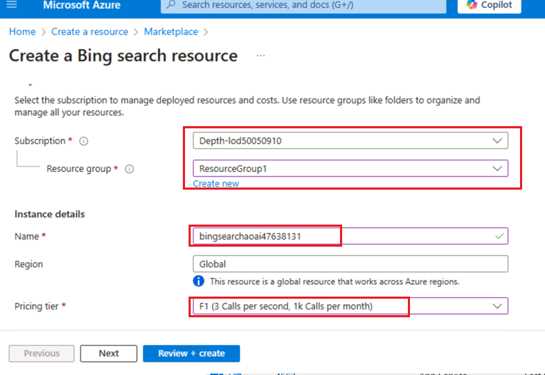

5.  Sobald die Validierung bestanden ist, klicken Sie auf die
    Schaltfläche **Create**.

6.  Sobald die Bereitstellung abgeschlossen ist, klicken Sie auf die
    Schaltfläche **Go to resource**.

7.  Navigieren Sie im **bingsearchaoaiXX**-Fenster zum Abschnitt
    **Resource management** und klicken Sie auf **Keys and Endpoint**.

8.  Kopieren Sie auf der Seite **Keys and Endpoints KEY1** (*Sie können
    entweder KEY1 oder KEY2 verwenden)* und **Endpoint,** fügen Sie sie
    in einen Editor ein (wie in der Abbildung gezeigt), und **speichern
    Sie** dann den Editor, um die Informationen in den anstehenden
    Aufgaben zu verwenden.

## **Aufgabe 2: Erstellen einer Azure OpenAI-Ressource**

1.  Klicken Sie auf der Startseite des Azure-Portals auf das **Menü des
    Azure-Portals,** das durch drei horizontale Balken auf der linken
    Seite der Microsoft Azure-Befehlsleiste dargestellt wird, wie in der
    folgenden Abbildung gezeigt.

> 

2.  Navigieren Sie und klicken Sie auf **+ Create a resource**.

> 

3.  Geben Sie auf der Seite **Create a resource** in der Suchleiste
    **Search services and marketplace** den Namen **Azure OpenAI** ein,
    und drücken Sie dann die **Enter**-Taste.

> 

4.  Navigieren Sie auf der Seite **Marketplace** zum Abschnitt **Azure
    OpenAI**, klicken Sie auf die Dropdownliste Create button, und
    wählen Sie dann **Azure OpenAI** aus, wie im Bild gezeigt. (Falls
    Sie bereits auf die Schaltfläche **Azure OpenAI**-Kachel, und
    klicken Sie dann auf der **Azure OpenAI-Seite** auf die Schaltfläche
    **Create**.

> 

[TABLE]

5.  Geben Sie im Fenster **Create Azure OpenAI** auf der Registerkarte
    **Basics** die folgenden Details ein, und klicken Sie auf die
    Schaltfläche **Next**.

> 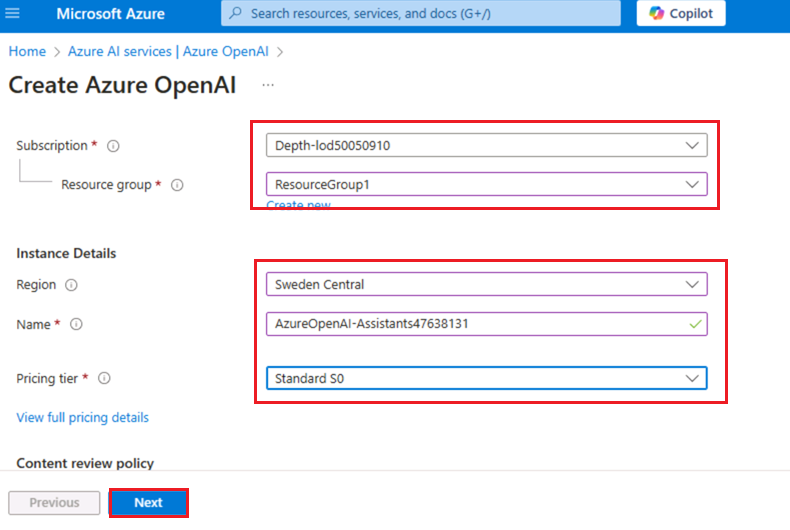

6.  Lassen Sie auf der Registerkarte **Network** alle Optionsfelder im
    Standardzustand und klicken Sie auf die Schaltfläche **Next**.

> 

7.  Lassen Sie auf der Registerkarte **Tags** alle Felder im
    Standardzustand und klicken Sie auf die Schaltfläche **Next**.

> 

8.  Klicken Sie auf der Registerkarte **Review+submit**, sobald die
    Validierung bestanden ist, auf die Schaltfläche **Create**.

> 

9.  Warten Sie, bis die Bereitstellung abgeschlossen ist. Die
    Bereitstellung dauert ca**. 2-3** Minuten.

10. Klicken Sie im **Microsoft.CognitiveServicesOpenAI**-Fenster nach
    Abschluss der Bereitstellung auf die Schaltfläche **Go to
    resource**.

> 

11. Klicken Sie im linken Navigationsmenü auf **Keys and Endpoints**,
    und kopieren Sie dann den Endpunktwert in einem Editor in **AzureAI
    ENDPOINT** und den Schlüssel in eine Variable **AzureAIKey**.

> 

## Aufgabe 3: Bereitstellen eines Azure OpenAI-Modells

1.  Klicken Sie im Fenster **AzureOpenAI-AssistantsXX** im linken
    Navigationsmenü auf **Overview,** klicken Sie auf die Schaltfläche
    **Explore Azure AI Foundry-Portal**, um **Azure AI Foundry Studio**
    in einem neuen Browser zu öffnen

> 

2.  In der **Azure AI Foundary | Azure OpenAI** **Service**-Fenster,
    wählen Sie im linken Navigationsmenü die Option **Deployment**
    aus**.**

> 

12. Öffnen Sie im Fenster **Deployments** das **+ Deploy model**, und
    wählen Sie **Deploy base model** aus**.**

> 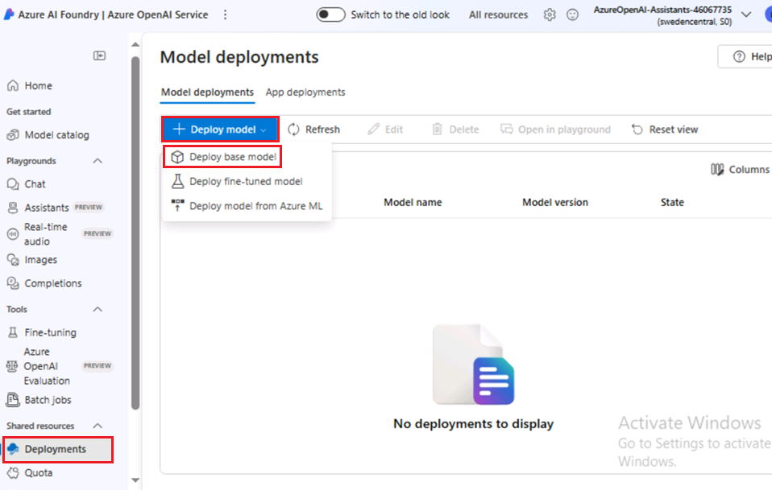

13. Navigieren Sie im Dialogfeld **Select a model**, wählen Sie
    **gpt-4** sorgfältig aus und klicken Sie dann auf die Schaltfläche
    **Confirm**.

> 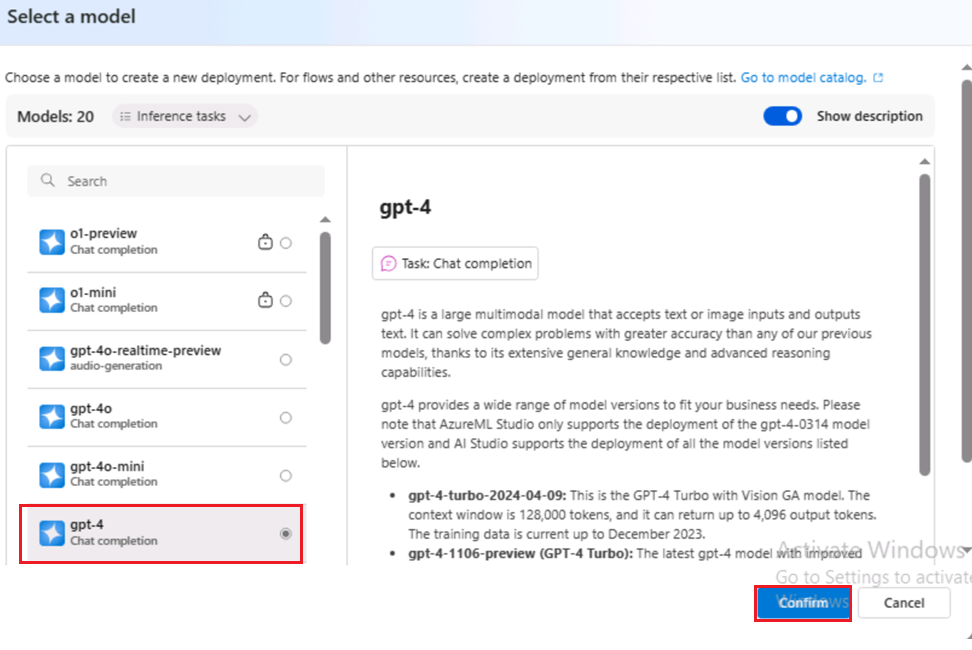

14. Geben Sie im Feld **Deploy model dialog** die folgenden Details ein,
    und klicken Sie auf die Schaltfläche **Create**.

- Modell auswählen: **gpt-4**

- Modellversion**: 1106-Preview**

- Name der Bereitstellung: Geben Sie **gpt-4** ein.

- Wählen Sie die **Advanced options** und dann **Standard** als
  **Deployment type** aus

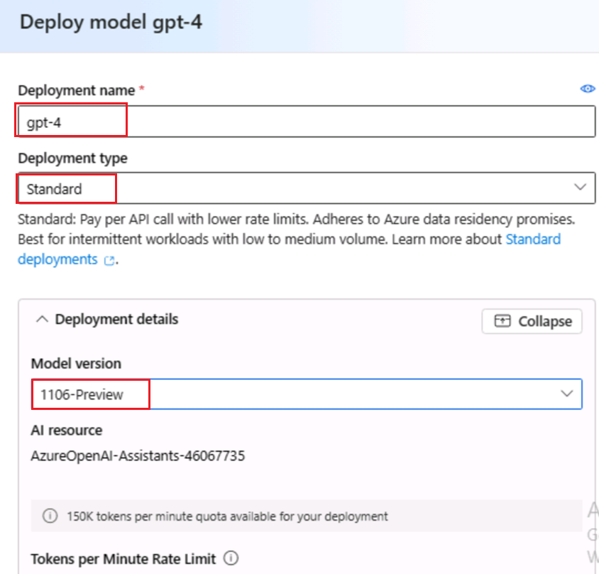

> 

15. Klicken Sie auf der Seite **Deployments** auf + **Create new
    deployment**.

16. Öffnen Sie im Fenster **Deployments** das **+Deploy model**, und
    wählen Sie **Deploy base model** aus.

> 

17. Navigieren Sie im Dialogfeld **Select a model**, wählen Sie
    **gpt-4** sorgfältig aus und klicken Sie dann auf die Schaltfläche
    **Confirm**.

> 

18. Klicken Sie im Dialogfeld **Deploy model** unter **Select a model**
    auf das Dropdown-Feld **gpt-4 ,** wählen Sie unter **Modellversion**
    die Option **vision-preview** aus, und geben Sie unter **Deployment
    name** +++ **gpt-4-vision** +++ ein**.** Klicken Sie auf die
    Schaltfläche **Create**.

> 
>
> 

19. Öffnen Sie im Fenster **Deplpyments** das **+Deploy model**, und
    wählen Sie **Deploy base model** aus.

> 

20. Navigieren Sie im Dialogfeld **Select a model**, wählen Sie
    **dall-e-3** sorgfältig aus, und klicken Sie dann auf die
    Schaltfläche **Confirm**.

> 

21. Klicken Sie im Dialogfeld **Deploy model** unter **Select a model**
    auf das Dropdown-Feld **dall-e-3** auswählen**,** wählen Sie unter
    **Modellversion** die Option **Auto-update to default** aus, und
    geben Sie unter **Deployment name !!dall-e-3**!! ein**.** Klicken
    Sie auf die Schaltfläche **Create**.

> 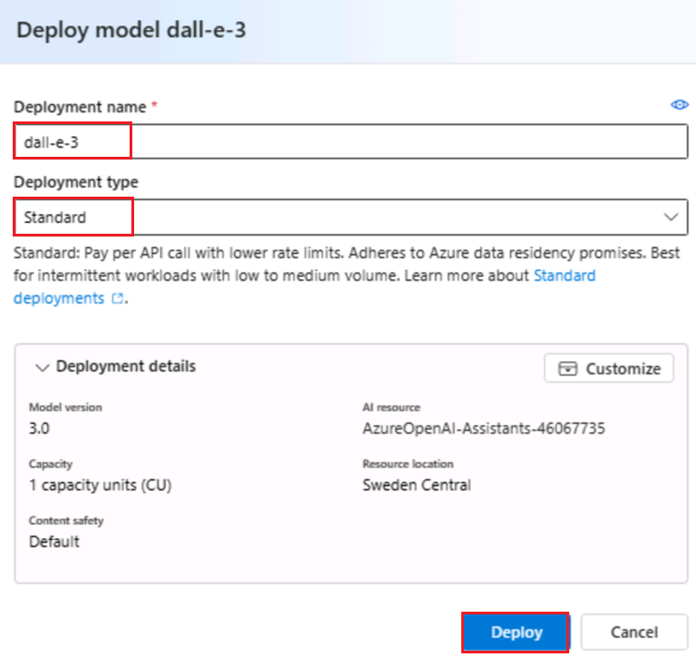
>
> 

## Aufgabe 4: Erkunden des Playgrounds des Assistenten

1.  In Azure AI Foundry | Azure OpenAI Service - Startseite,klicken Sie
    unter Abschnitt **Playgrounds** auf den **Assistants Playground**.

2.  Wählen Sie im Bereich **Assistants-Playground** die Option **+
    Create an assistant** aus.

3.  Der Assistants-Playground ermöglicht es Ihnen, AI-Assistenten zu
    erkunden, Prototypen zu erstellen und zu testen, ohne Code ausführen
    zu müssen. Auf dieser Seite können Sie schnell iterieren und mit
    neuen Ideen experimentieren.

4.  Geben Sie im Setup-Bereich des Assistants die folgenden Details ein

- Assistant-Namen: +++**Math Assist**+++

- Anleitung: Geben Sie die folgenden Anweisungen ein +++ **You are an AI
  assistant that can write code to help answer math questions** +++

- Einsatz: **gpt-4**

- Wählen Sie den Schalter aus, um **den Codeinterpreter zu aktivieren**

> 
>
> 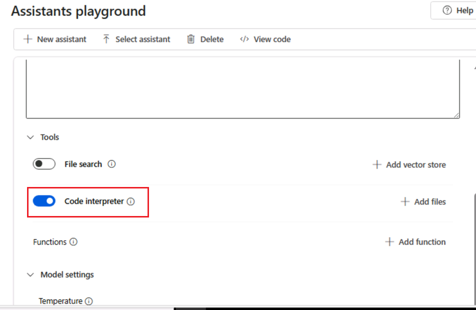

5.  Wählen Sie im Setupbereich des Assistenten die Option **Select
    assistant** aus

6.  Wählen Sie auf der Registerkarte “Select an assistant” die Option
    **Math Assist** aus und klicken Sie auf die Schaltfläche **Select**.

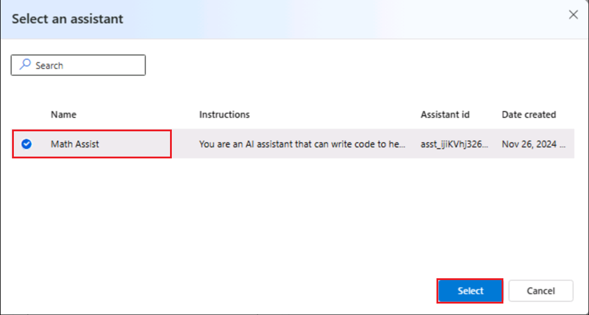

7.  Geben Sie eine Frage ein, die der Assistent beantworten soll: +++
    **I need to solve the equation 3x + 11 = 14. Can you help me?**+++

8.  Wählen Sie die Schaltfläche **Run** aus.

> 

Wir können zwar sehen, dass die Antwort richtig ist, aber um zu
bestätigen, dass das Modell den Codeinterpreter verwendet hat, um zu
dieser Antwort zu gelangen, und dass der Code, den es geschrieben hat,
gültig ist, anstatt nur eine Antwort aus den Trainingsdaten des Modells
zu wiederholen, stellen wir eine andere Frage.

9.  Geben Sie die Folgefrage ein: +++ **Show me the code you ran to get
    this solution.+++** Wählen Sie die **Schaltfläche Add and run**
    aus**.**

Sie können auch die Logs im rechten Bereich konsultieren, um zu
bestätigen, dass der Codeinterpreter verwendet wurde, und um den Code zu
validieren, der zum Generieren der Antwort ausgeführt wurde. Es ist
wichtig, sich daran zu erinnern, dass der Codeinterpreter dem Modell
zwar die Möglichkeit gibt, auf komplexere mathematische Fragen zu
antworten, indem er die Fragen in Code konvertiert und in einer
Sandbox-Python-Umgebung ausgeführt wird, Sie jedoch die Antwort dennoch
validieren müssen, um zu bestätigen, dass das Modell Ihre Frage korrekt
in eine gültige Darstellung im Code übersetzt hat.

## Aufgabe 5: Aufrufen von Assistentenfunktionen mit der Bing-Search

In diesem Notebook zeigen wir, wie Sie die Bing-Search-APIs und
Funktionsaufrufe verwenden können, um Azure OpenAI-Modelle auf Daten aus
dem Web zu basieren. Dies ist eine großartige Möglichkeit, dem Modell
Zugriff auf aktuelle Daten aus dem Web zu gewähren.

Dieses Beispiel ist nützlich für Entwickler und Data Scientists, die
mehr über Funktionen zum Aufrufen von Funktionen und eine suchbasierte
Grounding erfahren möchten.

1.  Geben Sie in Ihrem Windows-Suchfeld Visual Studio ein, und klicken
    Sie dann auf **Visual Studio Code**.

> 

2.  Klicken Sie im **Visual Studio** **Code**-Editor auf **File**,
    navigieren Sie dann und klicken Sie auf **Open Folder**.

> 

3.  Navigieren Sie und wählen Sie den Ordner "**Assistants**" aus
    **"C:\LabFiles"** aus und klicken Sie auf die Schaltfläche **"Select
    Folder**".

4.  Wenn ein Dialogfeld angezeigt wird: **Do you trust the authors of
    the files in this folder?**, und klicken Sie dann auf **Yes, I trust
    the author**.

5.  Navigieren Sie in der Visual Studio Code-Dropdownliste
    **ASSISTANTS** unter **function_calling** und klicken Sie auf
    **assistants_function_calling_with_bing_search.ipynb** Notebook.

6.  Scrollen Sie auf der Hauptseite des Visual Studio Code-Editors nach
    unten zur Überschrift **install requirements**, und führen Sie
    die 1. Zelle aus. Wenn Sie aufgefordert werden, die Umgebung
    auszuwählen, wählen Sie **Python-Environments** aus, wie im Bild
    gezeigt.

7.  Wenn Sie aufgefordert werden, den Pfad auszuwählen, wählen Sie den
    Pfad der **Python-Version 3.12.2 (oder höher)** aus, wie im Bild
    gezeigt.

8.  Aktualisieren Sie die Parameter, ersetzen Sie **Azure OpenAI
    Endpoint, Azure OpenAI Key (**Die Werte, die Sie in Ihrem Editor in
    der **Task 2** gespeichert haben**), Bing search subscription key**
    durch die Werte, die Sie in Ihrem Editor in der **Task 1**
    gespeichert haben.

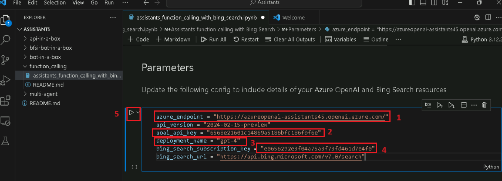

9.  Definieren Sie eine Funktion zum Aufrufen der Bing-Suche-APIs, und
    wählen Sie die 3. und 4. Zellen aus. Führen Sie dann die Zelle aus,
    indem Sie auf das **Start-Symbol** klicken.

10. Bringen Sie die Dinge von Ende zu Ende zum Laufen, wählen Sie die
    5., 6^(.), 7., 8. Zelle aus. Führen Sie dann die Zelle aus, indem
    Sie auf das **Start-Symbol** klicken.

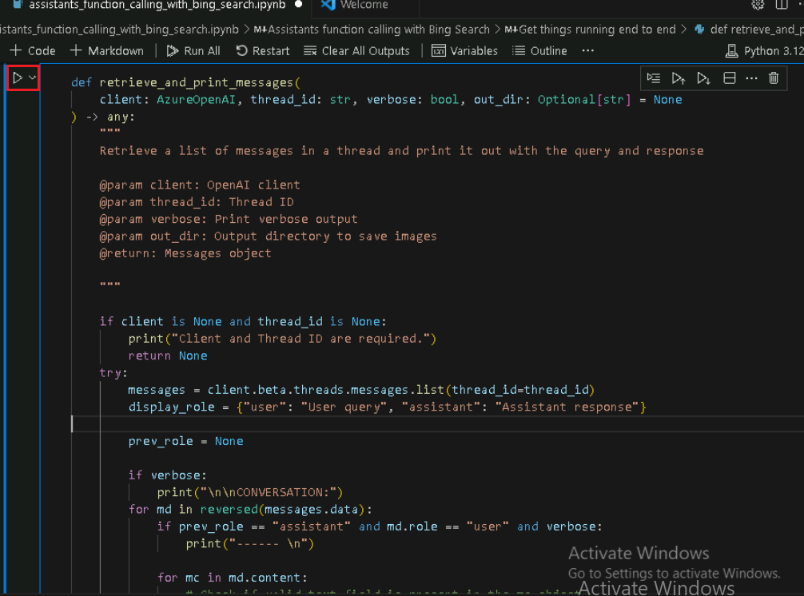

## **Aufgabe 6: Erstellen eines multimodalen Frameworks mit mehreren Agents mit der Azure Assistant-API**

Dieses Repository führt Sie durch das Muster zum Erstellen eines Systems
mit mehreren Agents mithilfe der Azure OpenAI Assistant-API.

Das in diesem Notebook bereitgestellte Beispiel veranschaulicht das
Erstellen eines Frameworks mit mehreren Agents mit der Azure
Assistant-API und dient als umfassender Leitfaden für Entwickler, die
die Funktionen mehrerer AI-Agents nutzen möchten, die zusammenarbeiten.
Der Kern des Artikels besteht darin, zu zeigen, wie Agents kommunizieren
und zusammenarbeiten können, um komplexe Aufgaben zu bearbeiten, wie z.
B. das Generieren und Verbessern von Bildern durch mehrere Iterationen
basierend auf Benutzereingaben. Dies ist besonders relevant für
Entwickler und Technikbegeisterte, die daran interessiert sind, die
Grenzen von generativer AI und Multi-Agent-Systemen zu erkunden.

Bevor man anfängt, sollte man ein grundlegendes Verständnis von AI haben
und Interesse daran haben, wie Agents zusammenarbeiten können, um
AI-Funktionalitäten zu verbessern. Der Artikel geht nicht auf die
tiefgehende Programmierung ein; Ein allgemeines Wissen über die
Funktionsweise von APIs und die Rolle von AI in automatisierten Systemen
wäre jedoch von Vorteil, um die vorgestellten Konzepte zu verstehen.
Dieses Beispiel ist eine Einladung an Innovatoren und Entwickler, die
mit fortschrittlichen AI-Systemen experimentieren und diese
möglicherweise in verschiedene Branchenlösungen integrieren möchten.

1.  Navigieren Sie in Visual Studio Code unter **Multi-Agent** und
    klicken Sie auf **.env**-Datei.

2.  Ersetzen Sie in der **.env**-Datei **Azure OpenAI-Endpoint, Azure
    OpenAI-Key (**die Werte, die Sie in **Task 2** in Ihrem Editor
    gespeichert haben**), gpt4 deployment name, DALLE3 deployment name
    and GPT 4 Vision deployment name** durch die Werte, die Sie in Ihrem
    Editor in **Task 3** gespeichert haben.

3.  Klicken Sie auf **File** und dann auf **Save**.

4.  Navigieren Sie in Visual Studio Code unter **Multi-Agent** zum
    Notebook **multi-agent.ipynb,** und klicken Sie darauf.

> 

5.  Scrollen Sie auf der Hauptseite des Visual Studio Code-Editors nach
    unten zur Überschrift **Install requirements**, und führen Sie
    die 1. Zelle aus. Wenn Sie aufgefordert werden, die Umgebung
    auszuwählen, wählen Sie **Python Environments** aus**,** wie im Bild
    gezeigt.

6.  Wenn Sie aufgefordert werden, den Pfad auszuwählen, wählen Sie den
    Pfad der **Python-Version 3.12.2 (oder höher)** aus, wie im Bild
    gezeigt.

> 

7.  Wählen Sie die 2. Zelle aus. Führen Sie dann die Zelle aus, indem
    Sie auf das **Start-Symbol** klicken.

8.  Zum Generieren von Bildern mithilfe einer Prompt zum Dalle-3-Modell.
    Die Ausgabe ist eine .jpg Datei, die im lokalen Verzeichnis des
    Benutzers gespeichert ist. Wählen Sie die 3. Zelle aus. Führen Sie
    dann die Zelle aus, indem Sie auf das **Start-Symbol** klicken.

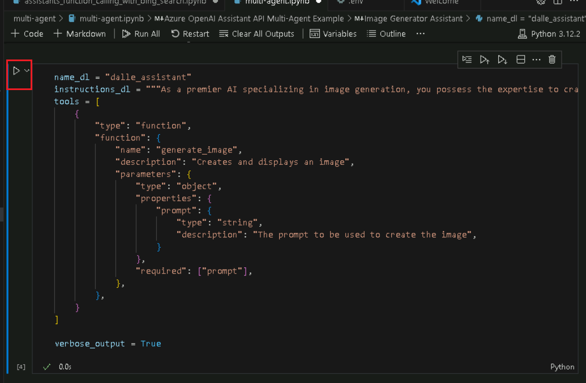

9.  Initialisiert den Agent mit der oben beschriebenen Definition.
    Wählen Sie die 4. Zelle aus. Führen Sie dann die Zelle aus, indem
    Sie auf das **Start-Symbol** klicken.

10. Die Image Generator-Funktion ruft den Dalle-3- Image Generator auf,
    wenn die Prompt angezeigt wird. Wählen Sie die 5. Zelle aus. Führen
    Sie dann die Zelle aus, indem Sie auf das **Start-Symbol** klicken.

11. Der Vision Assistant-Agent ist für die Analyse von Bildern
    verantwortlich. Die Ausgabe ist eine neue Prompt, die vom Image
    Creator-Agent verwendet wird. Wählen Sie die 6. Zelle aus. Führen
    Sie dann die Zelle aus, indem Sie auf das **Start-Symbol** klicken.

12. Initialisiert den Agent mit der oben beschriebenen Definition.
    Wählen Sie die 7. Zelle aus. Führen Sie dann die Zelle aus, indem
    Sie auf das **Start-Symbol** klicken.

13. Die Funktion von Vision-Assistant ruft das GPT4-Vision-Bild auf,
    analysiert ein Bild, führt die Zelle aus, indem Sie auf das
    **Start-Symbol** klicken.

14. Dieser Agent erleichtert die Konversation zwischen dem Benutzer und
    anderen Agents und stellt sicher, dass die Aufgabe erfolgreich
    abgeschlossen wird, führen Sie die Zelle aus, indem Sie auf das
    **Start-Symbol** klicken.

15. Initialisiert den Agent mit der oben beschriebenen Definition,
    führen Sie die Zelle aus, indem Sie auf das **Start-Symbol**
    klicken.

16. Diese Funktion ruft die Assistant-API auf, um einen
    Hauptkommunikationsthread zwischen den im agents_threads
    aufgeführten Agents zu generieren, führen Sie die Zelle aus, indem
    Sie auf das **Start-Symbol** klicken.

17. Dieser Agent erleichtert die Konversation zwischen dem Benutzer und
    anderen Agents und stellt so den erfolgreichen Abschluss der Aufgabe
    sicher. Führen Sie die Zelle aus, indem Sie auf das **Start-Symbol**
    klicken.

18. Beispielfragen, geben Sie das Feld +++ Generate an image of a boat
    drifting in the water and analyze it and enhance the image +++.
    Führen Sie die Zelle aus, indem Sie auf das **Start-Symbol**
    klicken.

## Aufgabe 7: Löschen der Ressourcen

1.  Um das Speicherkonto zu löschen, navigieren Sie zur **Azure Portal
    Home**-Seite , und klicken Sie auf **Resource groups**.

> 

2.  Klicken Sie auf die Ressourcengruppe.

> 

3.  Wählen Sie auf der Startseite der **Ressourcengruppe** die
    Ressourcen aus, und klicken Sie auf das Symbol Delete

4.  Navigieren Sie im Bereich **" Delete Resources** ", der auf der
    rechten Seite angezeigt wird, zu **"Delete" eingeben, um das
    Löschfeld zu bestätigen**, und klicken Sie dann auf die Schaltfläche
    **Delete**.

5.  Klicken Sie im Dialogfeld " **Delete confirmation** " auf die
    Schaltfläche **"Delete**".

> 

6.  Klicken Sie auf das Glockensymbol, um die Benachrichtigung –
    **Deleted resource group AOAI-RG89** zu sehen.

**Zusammenfassung**

Dieses Lab bot eine praktische Erkundung erweiterter AI-Funktionen
mithilfe der Integration von Azure OpenAI und der Bing-Search. Sie haben
mit dem Einrichten wichtiger Azure-Ressourcen und dem Bereitstellen von
AI-Modellen wie GPT-4 und DALL-E-3 begonnen. Anschließend haben Sie
Azure OpenAI Studio verwendet, um AI-Assistenten zu erstellen und zu
testen, die komplexe Aufgaben wie mathematische Problemlösung und
Bildgenerierung bewältigen können. Sie haben die Bing-Search integriert,
um Echtzeitdaten abzurufen, um AI-Antworten zu ermöglichen. Darüber
hinaus haben Sie gelernt, ein Multi-Agenten-Framework zu erstellen, das
zeigt, wie verschiedene AI-Agents zusammenarbeiten können, um die
Aufgabenleistung zu verbessern. Am Ende haben Sie praktische Erfahrungen
in der Bereitstellung, dem Testen und der Optimierung von AI-gesteuerten
Lösungen gesammelt, die Sie darauf vorbereitet haben, diese Technologien
in verschiedenen realen Anwendungen zu nutzen.
