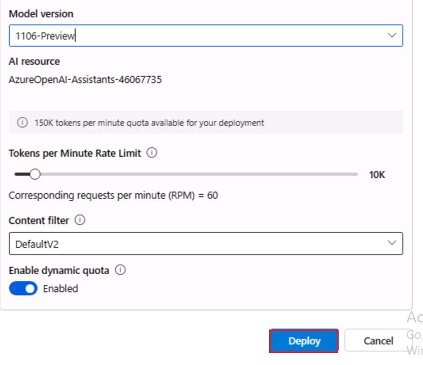
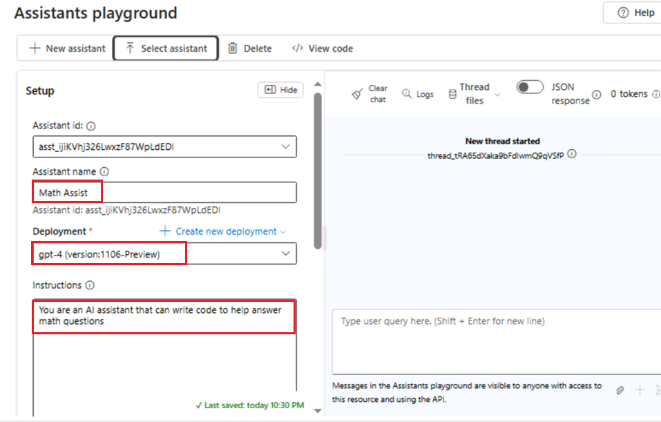
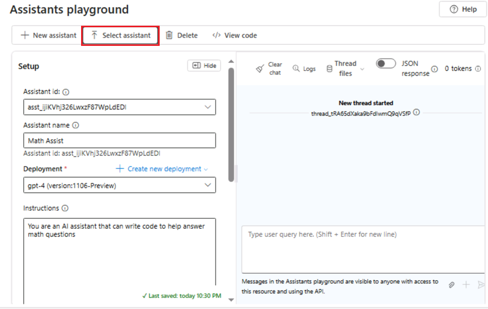
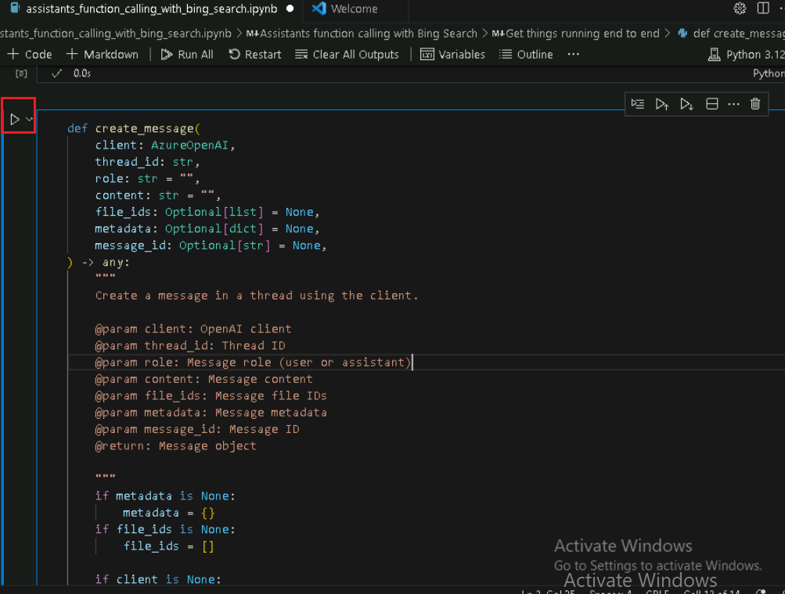
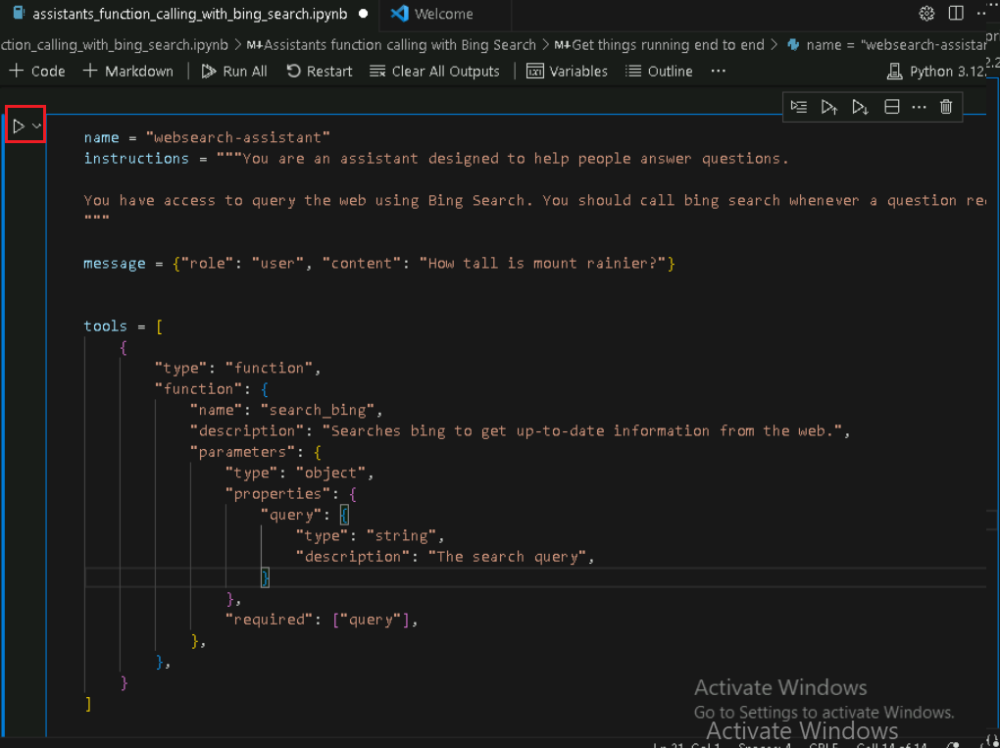
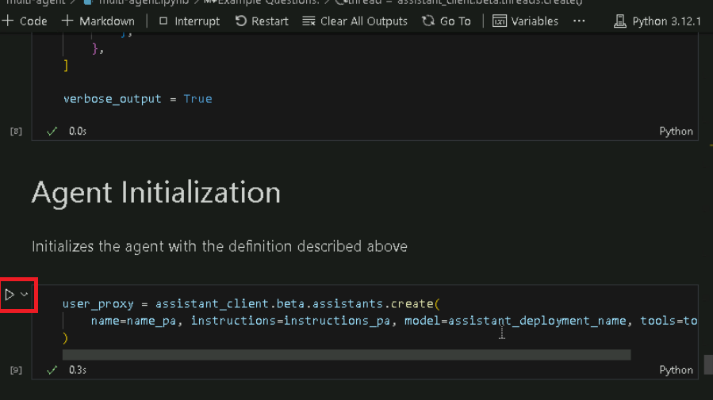
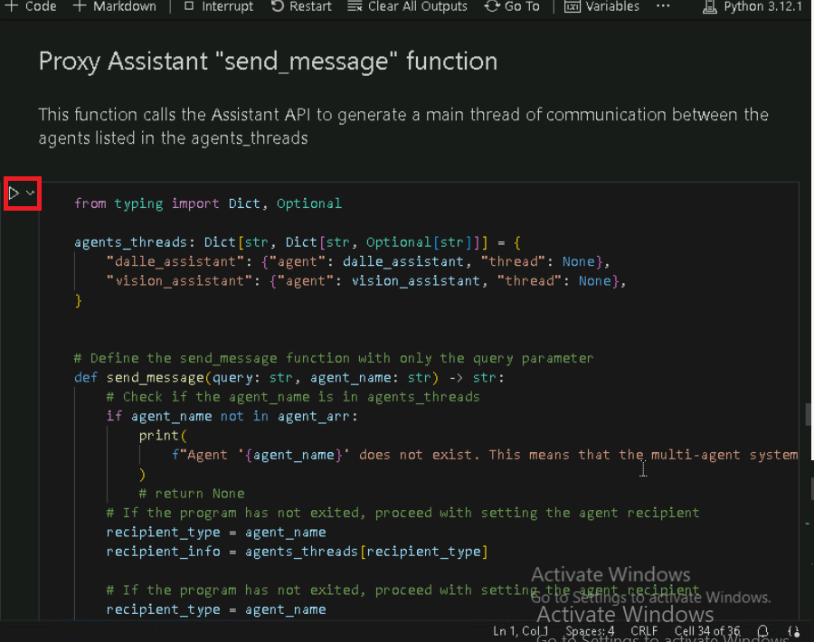
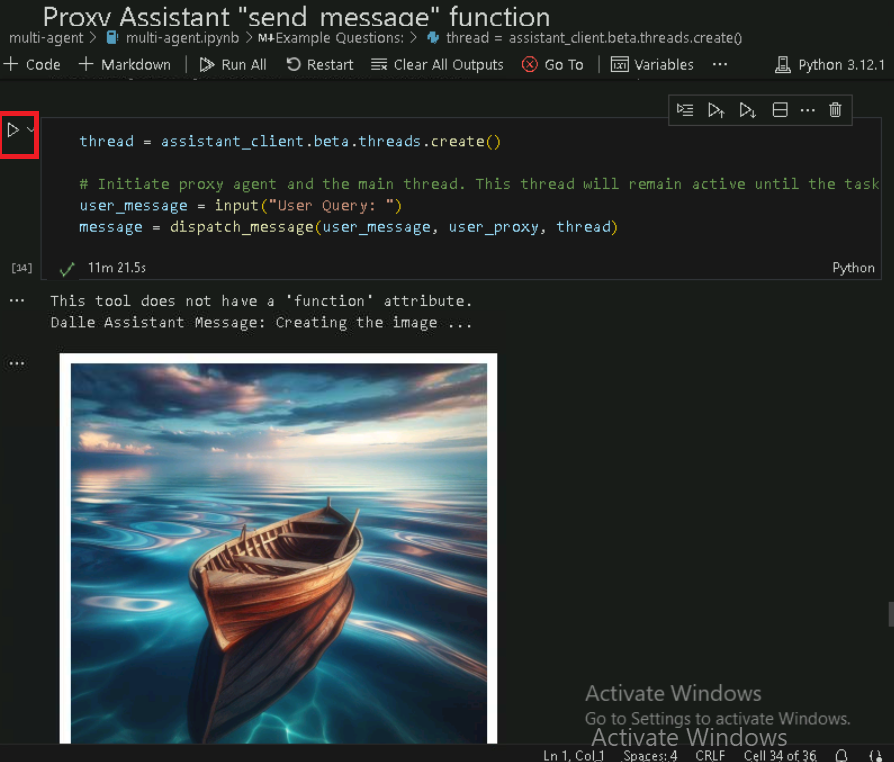
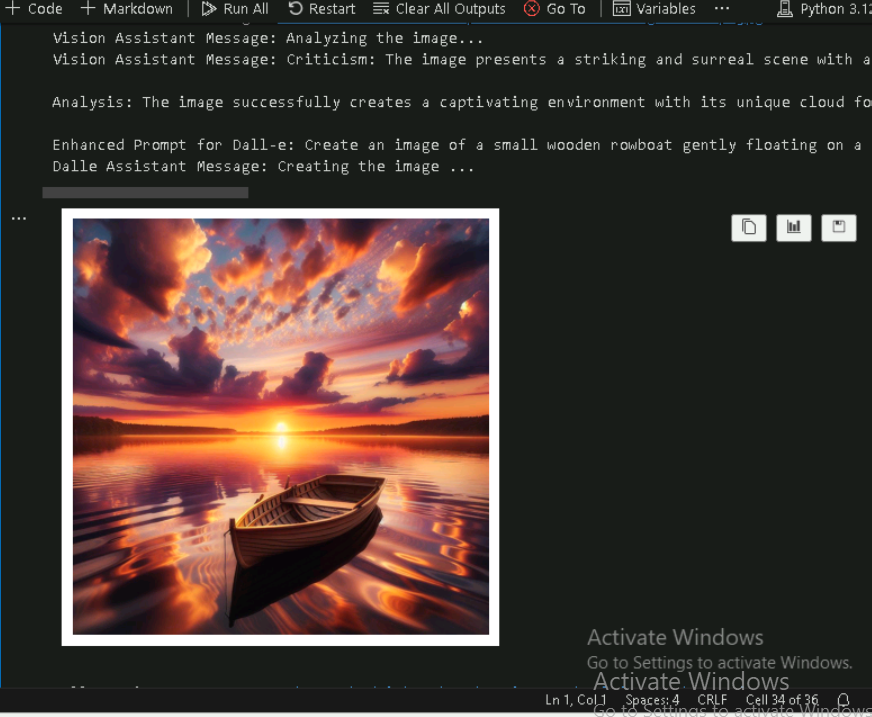

# **Introdução**

O Azure OpenAI Assistants (Pré-visualização) permite que você crie
assistentes de AI adaptados às suas necessidades por meio de instruções
personalizadas e com suporte de ferramentas avançadas, como
interpretador de código e funções personalizadas.

Este laboratório se concentra na configuração e utilização dos serviços
do Azure OpenAI, juntamente com o Bing Search integration, para criar
assistentes de AI sofisticados e multi-agent frameworks. Você
implementará modelos de AI, explorará funcionalidades de assistentes e
implementará interações multiagentes para o processamento de tarefas
complexas.

**Objetivo**

- Criar um recurso do Serviço Bing Search no Azure.

- Implementar recursos do Azure OpenAI e configurá-los.

- Implementar modelos específicos do Azure OpenAI, como GPT-4, GPT-4
  Vision e DALL-E-3.

- Explorar e criar protótipos de assistentes de AI usando o Azure OpenAI
  Studio.

- Implementar chamadas de função com APIs do Bing Search para aprimorar
  os recursos do assistente.

- Criar um framework multi-agent multimodal usando a API do Azure
  Assistant para tarefas colaborativas de AI.

- Para excluir os recursos e modelos implementados.

## **Tarefa 1: Criar um recurso do Serviço Bing Search no Azure**

1.  Clique no **Menu do Portal** e selecione **+ Create a resource**

> 

2.  Na barra de pesquisa da página **Create a resource**, digite **Bing
    Search v7** e clique em **bing search v7** que aparece .

3.  Clique na seção **Bing Search v7.**

4.  Na página **Create a search service**, forneça as seguintes
    informações e clique no botão **Review+create**.

[TABLE]

5.  Após a validação, clique no botão **Create**.

6.  Quando a implementação estiver concluída, clique no botão **Go to
    resource**.

7.  Na janela **bingsearchaoaiXX, navegue até a seção Resource
    management** e clique em **Keys and Endpoint**.

8.  Na página **Keys and Endpoints**, copie **KEY1** ( *você pode usar
    KEY1 ou KEY2)* e **Endpoint** e cole-os em um bloco de notas (como
    mostrado na imagem) e **salve** o bloco de notas para usar as
    informações nas próximas tarefas.

## **Tarefa 2: Criar recurso do Azure OpenAI**

1.  Na página inicial do portal do Azure, clique em **Azure portal
    menu** representado por três barras horizontais no lado esquerdo da
    barra de comandos do Microsoft Azure, conforme mostrado na imagem
    abaixo.

> 

2.  Navegue e clique em **+ Create a resource**.

> 

3.  Na página **Create a resource**, na barra de pesquisa **Search
    services and marketplace**, digite **Azure OpenAI** e pressione o
    botão **Enter** .

> 

4.  Na página **Marketplace,** navegue até a seção **Azure OpenAI,**
    clique no botão suspenso Create e selecione **Azure OpenAI,**
    conforme mostrado na imagem. (Caso você já tenha clicado em
    **Azure** **OpenAI,** clique no botão **Create** na página **Azure
    OpenAI**).

> 

[TABLE]

5.  Na janela **Create Azure OpenAI**, na guia **Basics** tab, insira os
    seguintes detalhes e clique no botão **Next**.

> 

6.  Na aba **Network**, deixe todos os botões de opção no estado padrão
    e clique no botão **Next**.

> 

7.  Na aba **Tags**, deixe todos os campos no estado padrão e clique no
    botão **Next**.

> 

8.  Na aba **Review+submit**, depois que a validação for aprovada,
    clique no botão **Create**.

> 

9.  Aguarde a conclusão da implementação. Levará de **2 a 3** minutos.

10. Na janela **Microsoft.CognitiveServicesOpenAI**, após a conclusão da
    implantação, clique no botão **Go to resource**.

> 

11. Clique em **Keys and Endpoints** no menu de navegação à esquerda e
    copie o valor do endpoint em um bloco de notas para **AzureAI
    ENDPOINT** e a Key para uma variável **AzureAIKey** .

> 

## Tarefa 3: Implementando modelos do Azure OpenAI

1.  Na janela **AzureOpenAI-AssistantsXX,** clique em **Overview** no
    menu de navegação à esquerda, clique no botão **Explore Azure AI
    Foundry portal** para abrir **o Azure AI Foundry Studio** em um novo
    navegador

> 

2.  Na janela **Azure AI Foundary | Azure OpenAI**, selecione
    **Deployment** no menu de navegação à esquerda **.**

> 

3.  Na janela **Deployments**, selecione o **+Deploy model** e selecione
    **Deploy base model.**

> 

4.  Na caixa de diálogo **Select a model**, navegue e selecione
    cuidadosamente **gpt-4** e, em seguida, clique no botão **Confirm**.

> 

5.  Na caixa **de diálogo Deploy model**, insira os seguintes detalhes e
    clique no botão **Create**.

- Select Model: **gpt-4**

- Model Version**: 1106-Preview**

- Deployment Name: digite **gpt-4**

- Selecione as **Advanced options** e selecione o **Standard** como
  **Deployment type**

> 

6.  Na página **Deployments**, clique em +**Create new deployment**.

7.  Na janela **Deployments**, selecione o **+Deploy model** e selecione
    **Deploy base model.**

> 

8.  Na caixa de diálogo **Select a model**, navegue e selecione
    cuidadosamente **gpt-4** e, em seguida, clique no botão **Confirm**.

> 

9.  Na caixa de diálogo **Deploy model**, em **Select a model,** clique
    no menu suspenso e selecione **gpt-4**. No campo **Model version,**
    selecione **vision-preview** e, em **Deployment name,** insira
    +++**gpt-4-vision+++.** Clique no botão **Create**.

> 
>
> 

10. Na janela **Deployments**, selecione o **+Deploy model** e selecione
    **Deploy base model.**

> 

11. Na caixa de diálogo **Select a model**, navegue e selecione
    cuidadosamente **dall-e-3 e,** em seguida, clique no botão
    **Confirm**.

> 

12. Na caixa de diálogo **Deploy model**, em **Select a model,** clique
    no menu suspenso e selecione **dall-e-3.** No campo **Model
    version,** selecione **Auto-update to default** e, em **Deployment
    name,** insira !!**dall-e-3**!!**.** Clique no botão **Create**.

> 
>
> 

## Tarefa 4: Explore o playground do Assistente

1.  Na página inicial Azure AI Foundry |Azure OpenAI Service, na seção
    **Playgrounds,** clique no **Assistants playground**.

2.  No painel **Assistants playground**, selecione **+ Create an
    assistant**.

3.  O Assistants playground permite que você explore, crie protótipos e
    teste Assistentes de AI sem precisar executar nenhum código. Nesta
    página, você pode iterar e experimentar novas ideias rapidamente.

4.  No painel de configuração do Assistente, insira os detalhes abaixo

- Assistant a name: +++**Math Assist+++**

- Instructions: Insira as seguintes instruções +++**You are an AI
  assistant that can write code to help answer math questions+++**

- Deployment: **gpt-4**

- Selecione a alternância **que habilita o code interpreter**

> 
>
> 

5.  No painel de configuração do Assistente, selecione **Select
    assistant**

6.  Na aba Select an assistant, selecione **Math Assist** e clique no
    botão **Select**.

7.  Digite uma pergunta para o assistente responder: +++**I need to
    solve the equation 3x + 11 = 14. Can you help me?**+++

8.  Selecione o **botão** R**un**.

> 

Embora possamos ver que a resposta está correta, para confirmar que o
modelo usou um interpretador de código para chegar a essa resposta e que
o código que ele escreveu é válido, em vez de apenas repetir uma
resposta dos dados de treinamento do modelo, faremos outra pergunta.

9.  Digite a pergunta de acompanhamento: +++**Show me the code you ran
    to get this solution.+++** Selecione o **botão Add and run**

Você também pode consultar os logs no painel direito para confirmar se o
interpretador de código foi usado e validar o código executado para
gerar a resposta. É importante lembrar que, embora o interpretador de
código dê ao modelo a capacidade de responder a perguntas matemáticas
mais complexas, convertendo-as em código e executando-as em um ambiente
sandboxed Python, você ainda precisa validar a resposta para confirmar
se o modelo traduziu corretamente sua pergunta em uma representação
válida em código.

## Tarefa 5: Chamada de função dos assistentes com o Bing Search

Neste notebook, mostraremos como você pode usar as APIs do Bing Search e
a chamada de funções para basear modelos do Azure OpenAI em dados da
web. Essa é uma ótima maneira de dar ao modelo acesso a dados
atualizados da web.

Este exemplo será útil para desenvolvedores e cientistas de dados que
desejam aprender sobre recursos de chamada de função e fundamentação de
pesquisa.

1.  Na caixa de pesquisa do Windows, digite Visual Studio e clique em
    **Visual Studio Code** .

> 

2.  No editor do **Visual Studio Code,** clique em **File**, navegue e
    clique em **Open Folder**.

> 

3.  Navegue e selecione a pasta **Assistants** em **C:\LabFiles** e
    clique no botão **Select Folder**.

4.  Se você ver uma caixa de diálogo - **Do you trust the authors of the
    files in this folder?,** clique em **Yes, I trust the author**.

5.  No menu suspenso do Visual Studio Code, **ASSISTANTS,** em
    **function_calling** navegue e clique no notebook
    **assistants_function_calling_with_bing_search.ipynb**.

6.  Na página principal do editor do Visual Studio Code, role para baixo
    até o título **install requirements** e execute a 1ª célula. Se
    solicitado a selecionar o ambiente, selecione **Python
    Environments,** conforme mostrado na imagem.

7.  Se solicitado a selecionar o caminho, selecione o caminho **Python
    version 3.12.2 (ou versão posterior)** como mostrado na imagem.

8.  Atualize os parâmetros, substitua **Azure OpenAI Endpoint, Azure
    OpenAI Key (**os valores que você salvou no seu bloco de notas na
    **Tarefa 2), Bing search subscription key** pelos valores que você
    salvou no seu bloco de notas na **Tarefa 1.**

9.  Defina uma função para chamar as APIs do Bing Search, selecione a 3ª
    e a 4ª células. Em seguida, execute a célula clicando no **ícone
    Start**.

10. Para começar, selecione a 5ª, 6ª, 7ª e a 8ª células. Em seguida,
    execute a célula clicando no **ícone Start**.

## **Tarefa 6: Construindo um framework multi-agent multimodal com a API de Assistente do Azure**

Este repositório mostrará o padrão de criação de um sistema multiagente
usando a API do Azure OpenAI Assistant.

O exemplo fornecido neste notebook ajuda a demonstrar como construir um
multi-agent framework com a API de Assistente do Azure e serve como um
guia abrangente para desenvolvedores que buscam aproveitar os recursos
de múltiplos agentes de AI trabalhando em conjunto. O ponto crucial do
artigo é mostrar como os agentes podem se comunicar e colaborar para
processar tarefas complexas, como gerar e aprimorar imagens por meio de
múltiplas iterações com base na entrada do usuário. Isso é
particularmente relevante para desenvolvedores e entusiastas de
tecnologia interessados em explorar as fronteiras da AI generativa e
sistemas multiagentes.

Antes de começar, é necessário ter um conhecimento básico de IA e
interesse em como os agentes podem trabalhar juntos para aprimorar suas
funcionalidades. Este artigo não se aprofunda em programação; no
entanto, um conhecimento geral de como as APIs operam e do papel da AI
em sistemas automatizados seria benéfico para a compreensão dos
conceitos apresentados. Este exemplo é um convite a inovadores e
desenvolvedores que desejam experimentar sistemas avançados de AI e,
potencialmente, integrá-los a diversas soluções do setor.

1.  No Visual Studio Code, em **multi-agent**, navegue e clique no
    arquivo **.env** .

2.  No arquivo **.env**, substitua **Azure OpenAI Endpoint, Azure OpenAI
    Key (** Os valores que você salvou no seu bloco de notas na **Tarefa
    2), gpt4 deployment name, DALLE3 deployment name e GPT 4 Vision
    deployment name** pelos valores que você salvou no seu bloco de
    notas na **Tarefa 3** .

3.  Clique em **File** e depois em **Save**.

4.  No Visual Studio Code, em **multi-agent**, navegue e clique no
    notebook **multi-agent.ipynb**.

> 

5.  Na página principal do editor do Visual Studio Code, role para baixo
    até o título **install requirements** e execute a 1ª célula. Se
    solicitado a selecionar o ambiente, selecione **Python
    Environments,** conforme mostrado na imagem.

6.  Se solicitado a selecionar o caminho, selecione o caminho **Python
    version 3.12.2 (ou versão posterior)** como mostrado na imagem.

> 

7.  Selecione a 2ª célula. Em seguida, execute a célula clicando no
    **ícone Start**.

8.  Para gerar imagens usando um prompt para o Modelo Dalle-3. A saída é
    um arquivo .jpg armazenado no diretório local do usuário. Selecione
    a 3ª célula. Em seguida, execute a célula clicando no **ícone
    Start**.

9.  Inicialize o agente com a definição descrita acima. Selecione a 4ª
    célula. Em seguida, execute a célula clicando no **ícone Start**.

10. A função de geração de imagem chama o gerador de imagens **DALL·E
    3** com base no prompt fornecido. Selecione a 5ª célula. Em seguida,
    execute a célula clicando no **ícone Start**.

11. O agente Vision Assistant é responsável por analisar imagens. A
    saída é um novo prompt a ser usado pelo agente criador de imagens.
    Selecione a 6ª célula. Em seguida, execute a célula clicando no
    **ícone Start**.

12. Inicialize o agente com a definição descrita acima. Selecione a
    sétima ^(célula) . Em seguida, execute a célula clicando no **ícone
    Start**.

13. A função Vision Assistant chama as análises de imagem do GPT4
    Vision. Tendo recebido uma imagem, execute a célula clicando no
    **ícone Start**.

14. Este agente facilita a conversa entre o usuário e outros agentes,
    garantindo a conclusão bem-sucedida da tarefa, execute a célula
    clicando no **ícone Start.**

15. Inicialize o agente com a definição descrita acima, executa a célula
    clicando no **ícone Start.**

16. Esta função chama a API do Assistente para gerar um thread principal
    de comunicação entre os agentes listados em agents_threads, execute
    a célula clicando no **ícone Start.**

17. Este agente facilita a conversa entre o usuário e outros agentes,
    garantindo a conclusão bem-sucedida da tarefa. Execute a célula
    clicando no **ícone Start.**

18. Exemplos de perguntas: insira +++Generate an image of a boat
    drifting in the water and analyze it and enhance the image+++.
    Execute a célula clicando no **ícone Start.**

## Tarefa 7: Excluir os recursos

1.  Para excluir a conta de armazenamento, navegue até a página **Azure
    portal Home** e clique em **Resource groups**.

> 

2.  Clique no grupo de recursos.

> 

3.  Na página inicial **Resource group**, selecione os recursos e clique
    em delete

4.  No painel **Delete Resources** que aparece no lado direito, navegue
    até o campo **Enter “Delete” to confirm deletion** e, em seguida,
    clique no botão **Delete**.

5.  Na caixa de diálogo **Delete confirmation**, clique no botão
    **Delete**.

> 

6.  Clique no ícone do sino e você verá a notificação – **Deleted
    resource group AOAI-RG89.**

**Resumo**

Este laboratório proporcionou uma exploração prática de recursos
avançados de AI usando a integração do Azure OpenAI e do Bing Search.
Você começou configurando recursos essenciais do Azure e implementando
modelos de AI, como GPT-4 e DALL-E-3. Em seguida, você usou o Azure
OpenAI Studio para criar e testar assistentes de AI capazes de lidar com
tarefas complexas, como resolução de problemas matemáticos e geração de
imagens. Você integrou o Bing Search para buscar dados em tempo real e
fundamentar respostas de AI. Além disso, você aprendeu a criar um
multi-agent framework, demonstrando como diferentes agentes de AI podem
colaborar para aprimorar o desempenho das tarefas. Ao final, você
adquiriu experiência prática na implementação, teste e otimização de
soluções orientadas por AI, que o prepararam para utilizar essas
tecnologias em diversas aplicações do mundo real.
