# Caso de uso 10 - Criação de um aplicativo Web e bot do Power Virtual Agent com dados personalizados usando o Azure OpenAI Service

**Introdução:**

O Azure OpenAI em seus dados funciona com os poderosos modelos de
linguagem ChatGPT (gpt-35-turbo) e GPT-4 do OpenAI, permitindo que eles
forneçam respostas com base nos seus dados. Você pode acessar o Azure
OpenAI em seus dados usando uma API REST ou a interface web no Azure
OpenAI Studio para criar uma solução que se conecte aos seus dados e
permita uma experiência de chat aprimorada.

Um dos principais recursos do Azure OpenAI em seus dados é a capacidade
de recuperar e utilizar dados de uma forma que aprimora a resposta do
modelo. O Azure OpenAI em seus dados, juntamente com o Azure Cognitive
Search, determina quais dados recuperar da fonte de dados designada com
base na entrada do usuário e no histórico de conversas fornecido. Esses
dados são então complementados e reenviados como um prompt para o modelo
OpenAI, com as informações recuperadas sendo anexadas ao prompt
original. Embora os dados recuperados sejam anexados ao prompt, a
entrada resultante ainda é processada pelo modelo como qualquer outro
prompt. Depois que os dados são recuperados e o prompt é enviado ao
modelo, o modelo usa essas informações para fornecer uma conclusão.

**Objetivos**

- Criar uma conta de armazenamento, um contêiner e um serviço Azure
  cognitive search no portal do Azure.

- Implantar o gpt-3-turbo e o modelo incorporado no Azure AI Studio e
  adicionar dados no Chat Playground.

- Testar a configuração do Assistente no Chat Playground enviando
  consultas na sessão de chat.

- Iniciar um copilot e iniciar uma conversa com o bot

- Iniciar um novo aplicativo e iniciar uma conversa com o aplicativo
  copilot.

- Excluir o gpt-3-turbo e o modelo incorporado, a conta de armazenamento
  do Azure, o serviço de pesquisa cognitiva e o novo aplicativo Web.

## Exercício 1 - Crie uma conta de armazenamento do Azure e uma Azure cognitive search usando o portal

### Tarefa 1: Criar recurso do Azure OpenAI

1.  Abra seu navegador, navegue até a barra de endereço e digite ou cole
    o seguinte URL: +++<https://portal.azure.com/+++>e pressione o botão
    **Enter**.

2.  Na janela do **Microsoft Azure** , use as **User Credentials** para
    fazer login no Azure.

3.  Em seguida, digite a senha e clique no botão **Sign in**.

4.  Na janela **Stay signed in?,** clique no botão **Yes**.

5.  Na página inicial do portal do Azure, clique em **Azure portal
    menu** representado por três barras horizontais no lado esquerdo da
    barra de comandos do Microsoft Azure, conforme mostrado na imagem
    abaixo.

6.  Navegue e clique em **+ Create a resource**.

7.  Na página **Create a resource**, na barra de pesquisa **Search
    services and marketplace**, digite **Azure OpenAI** e pressione o
    botão **Enter**.

8.  Na página **Marketplace** , navegue até a seção **Azure OpenAI** ,
    clique no botão suspenso Create e selecione **Azure OpenAI** ,
    conforme mostrado na imagem. (Caso você já tenha clicado em
    **Azure** **OpenAI**, em seguida, clique no botão **Create** na
    página **Azure OpenAI**).

9.  Na janela **Create Azure OpenAI**, na aba **Basics**, insira os
    seguintes detalhes e clique no botão **Next**.

[TABLE]

> 

10. Na aba **Network**, deixe todos os botões de opção no estado padrão
    e clique no botão **Next**.

11. Na aba **Tags** , deixe todos os campos no estado padrão e clique no
    botão **Next**.

12. Na aba **Review+submit**, depois que a Validação for Aprovada,
    clique no botão **Create**.

13. Aguarde a conclusão da implementação. Ela levará de 2 a 3 minutos.

14. Na janela **Microsoft.CognitiveServicesOpenAI**, após a conclusão da
    implementação, clique no botão **Go to resource**.

### Tarefa 2: Criar uma conta de armazenamento do Azure usando o portal

1.  Entre em +++<https://portal.azure.com/+++>

2.  Clique no  **Portal Menu** e selecione **Create a resource**

3.  Na caixa de pesquisa da janela **Create a resource**, digite
    **Storage account** e clique na **storage account**.

4.  Na página **Marketplace** , clique na seção **Storage account**.

5.  Na janela **Storage account**, clique no botão **Create**.

6.  Na janela **Create a storage account**, na aba **Basics**, insira os
    detalhes abaixo para criar uma conta de armazenamento e clique em
    **Review**

[TABLE]

> 

7.  Na aba **Review**, clique no botão **Create**.

8.  Esta nova conta de Armazenamento do Azure agora está configurada
    para hospedar dados para um Azure Data Lake. Clique no botão **Go to
    resource**.

9.  Após a implementação da conta, você encontrará opções relacionadas
    ao Azure Data Lake na página Overview. No painel de navegação
    esquerdo, navegue até a seção **Data storage** e clique em
    **Containers**.

10. Na página **azureopenaistorageXX | Containers** , clique em
    **+Container.**

11. No painel New container que aparece no lado direito, insira o
    **Name** do contêiner como +++**source+++** e clique no botão
    **Create**.

12. Na página **azureopenaistorageXX | Containers**, selecione o
    container **source** \*\*.\*\*

13. Na página container **source**, clique no botão **Upload** .

14. No painel **Upload blob**, clique em **Browse for file**, navegue
    até o local **C:\Labfiles** e selecione **TF-AzureOpenAI.pdf** e
    clique no botão **Open**.

\

15. No painel **Upload blob**, clique no botão **Upload**.

16. Você verá uma notificação – **Successfully uploaded blob** when the
    uploaded is succeeded.

### Tarefa 3: Criar um serviço AzureAI Search no portal

1.  Na página **azureopenaistorageXX | Containers**, clique em **Home**
    para voltar à página inicial do portal do Azure.

2.  Na página inicial do portal do Azure, clique em **+ Create
    Resource**.

3.  Na barra de pesquisa da página **Create a resource**, digite **Azure
    AI Search** e clique em **azure ai search** que aparece.

4.  Clique na seção **azure ai search.**

5.  Na página **Azure AI Search**, clique no botão **Create**.

6.  \

7.  Na página **Create a search service**, forneça as seguintes
    informações e clique no botão **Review+create**.

[TABLE]

> 
>
> 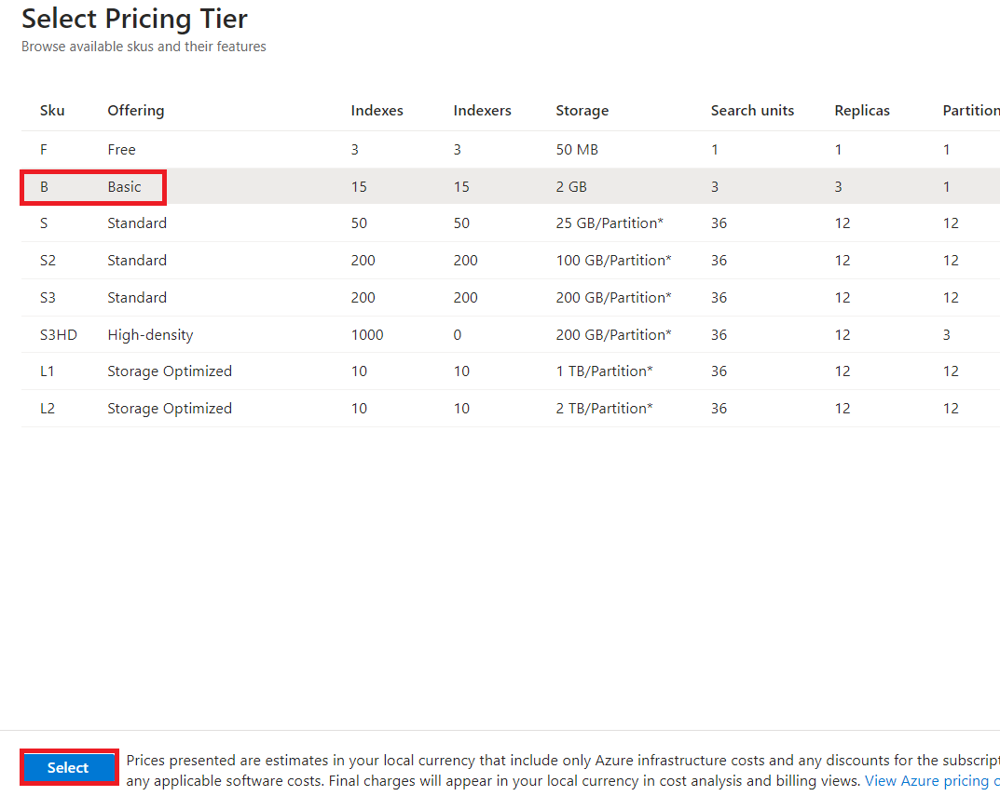

8.  Após a validação, clique no botão **Create**.

9.  Após a conclusão da implementação, clique no botão **Go to
    resource**.

10. Na página Overview do **mysearchserviceXX**. No painel de navegação
    esquerdo, na seção **Settings**, selecione **Semantic ranker**.

11. Na aba **Semantic ranker**, selecione o **Standard** e clique em
    **Select plan.**

12. Você verá uma notificação - **Successfully updated semantic ranker
    to free plan**

## Exercício 2: Adicione seus dados usando o Azure OpenAI Studio

### Tarefa 1: Implementar gpt-35-turbo e modelos incorporados no Azure AI Studio

1.  Volte para o portal do Azure, procure por Azure OpenAI e
    selecione-o.

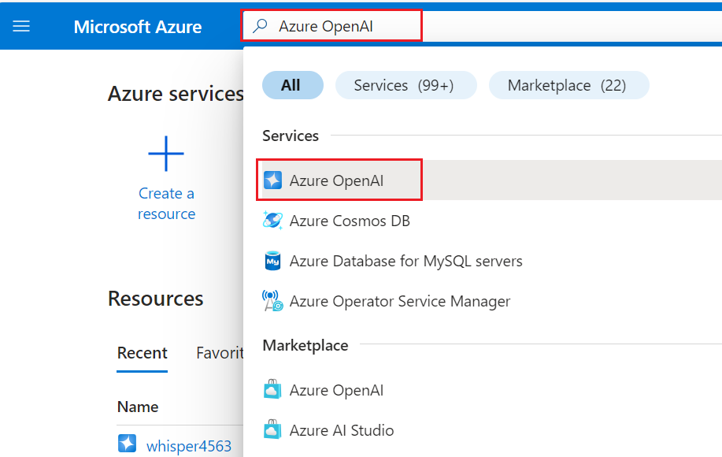

2.  Selecione seu serviço **Azure OpenAI .**

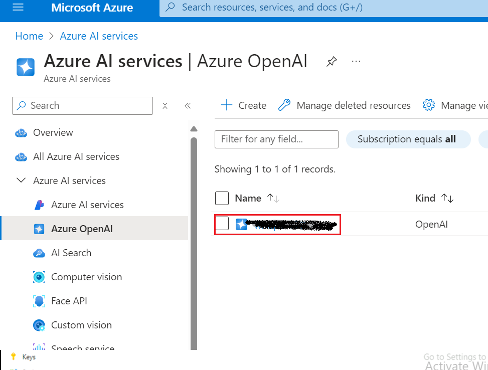

3.  Na janela **AzureOpenAI** , clique em **Overview** no menu de
    navegação à esquerda e, em seguida, clique no botão **Explore Azure
    AI Foundry portal** para acessar o **Azure AI Foundry portal** em um
    novo navegador.

4.  Na página inicial do **Azure AI Foundry** |**Azure OpenAI Studio,**
    selecione **Deployment** no menu de navegação à esquerda.

> 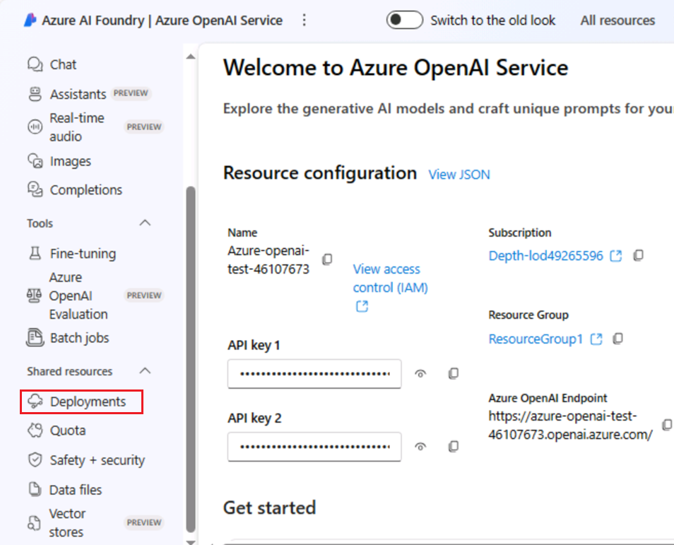

5.  Na janela **Deployments**, selecione o **+Deploy model** e selecione
    **Deploy base model.**

6.  Na caixa de diálogo **Select a model**, navegue e selecione
    cuidadosamente **gpt-4** e clique no botão **Confirm**.

> 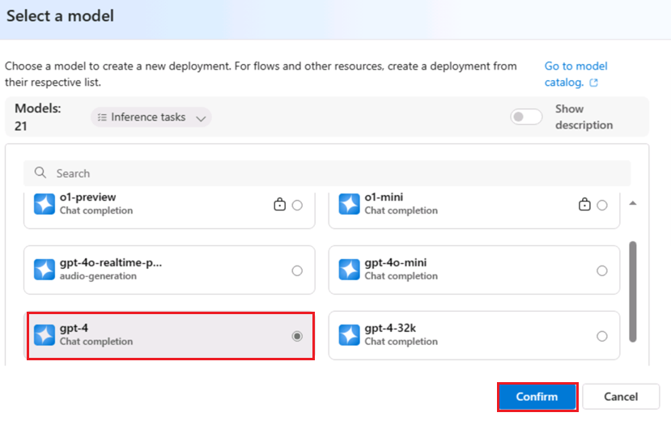

7.  Na caixa de diálogo **Deploy model**, insira os seguintes detalhes e
    clique no botão **Create**.

    - Select Model: **gpt-35-turbo**

    - Deployment Name: **gpt-35-turbo**

    - Selecione o **Standard** como **Deployment type**

> 
>
> 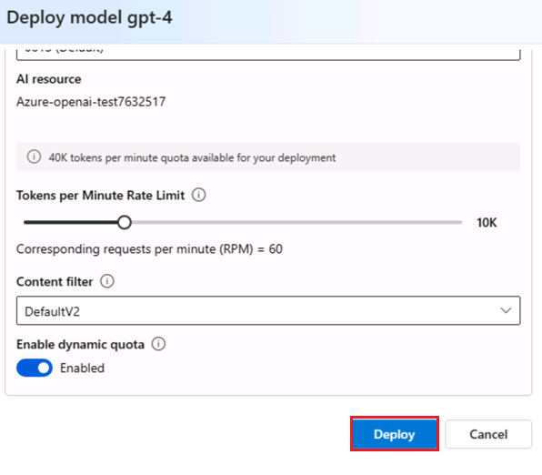
>
> 

8.  Na janela **Deployments**, selecione o **+Deploy model** e selecione
    **Deploy base model.**

> 

9.  Na caixa de diálogo **Select a model**, navegue e selecione
    cuidadosamente **text-embedding-ada-002** e clique no botão
    **Confirm**.

10. Na caixa de diálogo **Deploy model**, em **Deployment name,** insira

> +++text-embedding-ada-002+++, selecione **Standard** como **Deployment
> type** e clique no botão **Deploy**.

11. Na página inicial do **Azure AI Foundry |Azure OpenAI Service,** na
    seção **Playgrounds**, clique em **Chat** .

12. No painel do **Chat playground**, selecione **Add your data** e
    selecione **+Add a data source**

### Tarefa 2: Adicione seus dados usando o Azure OpenAI Studio

1.  Na página **Select or add data source**, clique no menu suspenso em
    **Select or add data source**, navegue e clique em **Azure Blob
    Storage**.

2.  Na página **Select or add data source**, em **Select or add data
    source,** insira os seguintes detalhes e selecione **Next.**

[TABLE]

3.  Selecione a caixa de seleção – **Add vector search to this search
    resource**.

4.  Selecione um modelo de incorporação como **text-embedding-ada-002**
    e clique no botão **Next**.

***Observação** : caso encontre o erro **-Não é possível gerenciar CORS
neste recurso, selecione outro recurso de armazenamento** e sincronize o
horário da sua VM, conforme mencionado na Tarefa nº 1.*

5.  Na página **Add data**, na guia **Data management,** selecione Tipo
    de pesquisa e selecione **Hybrid+semantic.**

6.  Selecione o **chunk size** como **1024(default).** Em seguida,
    clique em **Next.**

7.  No painel **Data connection**, selecione **API key** e clique no
    botão **Next**.

8.  No painel **Review and Finish**, revise os detalhes inseridos e
    clique no botão **Save and close**.

9.  Os dados serão adicionados ao seu Chat Playground. Isso levará
    aproximadamente 4 a 5 minutos.

### Tarefa 3: Explorar a conclusão de texto no Chat Playground

1.  Na seção **Chat session**, insira o seguinte prompt na caixa de
    texto **User message** e clique no ícone **Send**

> CódigoCopy
>
> O que é o Azure OpenAI Service?

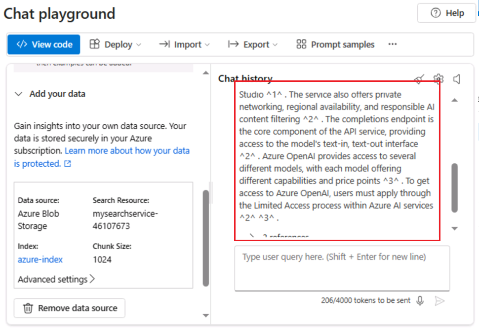

2.  Na seção **Chat session**, selecione o link de referências e observe
    os detalhes do documento de pesquisa no lado direito da página.

## Exercício 3: Implementar um aplicativo web com dados personalizados

### Tarefa 1: Implementar um aplicativo web

1.  Na página inicial do **Azure AI Foundry |Azure OpenAI Service,** no
    painel do **Chat playground**, clique em **Deploy** e, navegue e
    clique em **as web app**.

2.  Na janela **Deploy to a web app**, selecione o botão de opção
    **Create a new web app** e insira os seguintes detalhes:

[TABLE]

3.  Selecione a caixa de seleção **Enable chat history in the web app**

4.  Clique no botão **Deploy**.

Observação: a implementação leva de 5 a 10 minutos

5.  Para verificar o status da implementação, clique em **Deployments**
    e selecione **App deployment**.

6.  Aguarde a conclusão da implementação. Levará de **10 a 15** minutos.

7.  Clique no aplicativo web.

8.  Aguarde 10 minutos para que a configuração de autenticação possa ser
    aplicada com sucesso no aplicativo.

9.  Após 10 minutos, clique no botão **Refresh**.

10. Na caixa de diálogo **Permissions requested**, clique no botão
    **Accept**

11. Agora, o aplicativo web será aberto em um novo navegador.

12. Na página do aplicativo Web do **Azure AI**, insira o seguinte texto
    e clique no **ícone Submit,** conforme mostrado na imagem abaixo.

**CodeCopy**

How do I get access to Azure OpenAI?

 

13. Da mesma forma, cole o seguinte texto na caixa de texto e clique no
    ícone **Send**.

**CodeCopy**

**+++What is the expiry date of GPT-35-Turbo version 0301 and GPT-4
version 0314?+++**

14. Atualize a página do aplicativo web e clique em **Show chat
    history**.

15. No histórico de bate-papo, clique em **Accessing Azure OpenAI**.

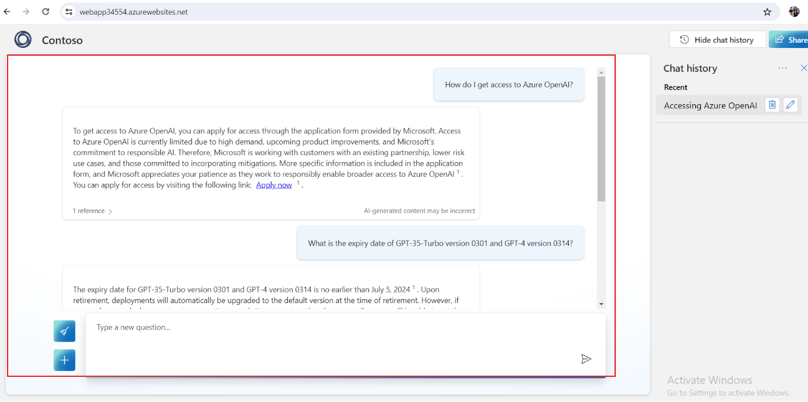

## Exercício 4: Crie um aplicativo Copilot com dados personalizados

### Tarefa 1: Criar um chatbot com dados personalizados

1.  No **Azure AI Foundry |Azure AI Studio** **Chat playground,** em Add
    your data, selecione Remove data source.

2.  No painel do **Chat playground**, selecione **Add your data** e
    selecione **+Add a data source**

3.  Na página **Add data**, em **Select or add data source,** insira os
    seguintes detalhes e selecione **Next.**

[TABLE]

> 
>
> ***Observação** : caso encontre o erro **Não é possível gerenciar CORS
> neste recurso, selecione outro recurso de armazenamento** e sincronize
> o horário da sua VM, conforme mencionado na Tarefa nº 1.*

4.  Na página **Add data**, na aba **Data management,** em Search type,
    selecione **Keyword,** selecione o tamanho do chunk como
    **1024(default).** Em seguida, clique em **Next.**

5.  No painel **Data connection**, selecione **API key** e clique no
    botão **Next**.

6.  No painel **Review and Finish**, revise os detalhes inseridos e
    clique no botão **Save and close**.

 

7.  Os dados serão adicionados ao seu Chat Playground. Isso levará
    aproximadamente 4 a 5 minutos.

### Tarefa 2: Criar um copilot com dados personalizados do Azure OpenAI

1.  Efetue login em +++<https://copilotstudio.microsoft.com/>+++ usando
    suas credenciais de login do Azure.

2.  Depois de fazer login, na página Welcome to Microsoft Copilot
    Studio, selecione seu país e clique em **Iniciar Start free trial**.

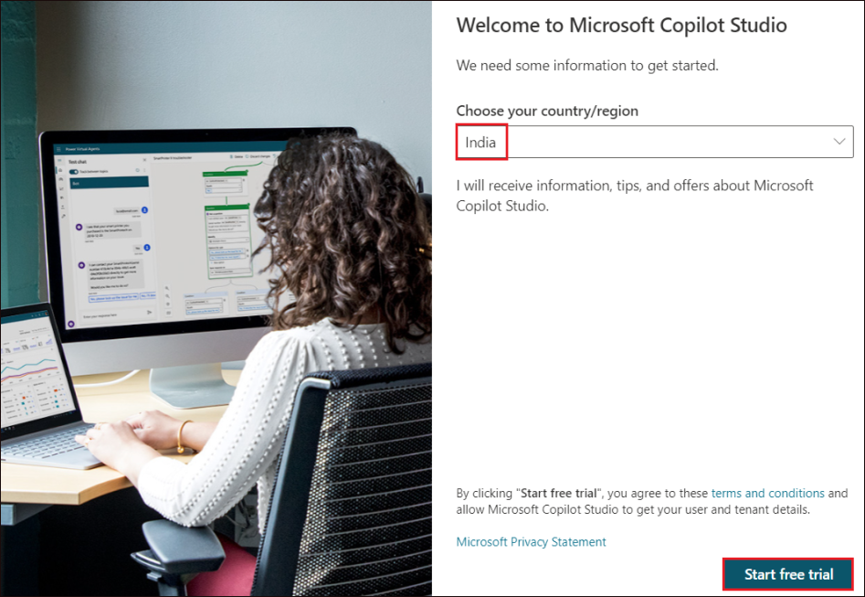

3.  A página inicial do Copilot é aberta.

> 

4.  Selecione **Agents** no painel esquerdo. Em seguida, clique em **+
    New agent**.

> 

5.  Selecione **Skip to configure**.

6.  Na página Criar um copilot, digite o **name** como
    +++**CopilotforAOAI**+++ e clique em **Create**.

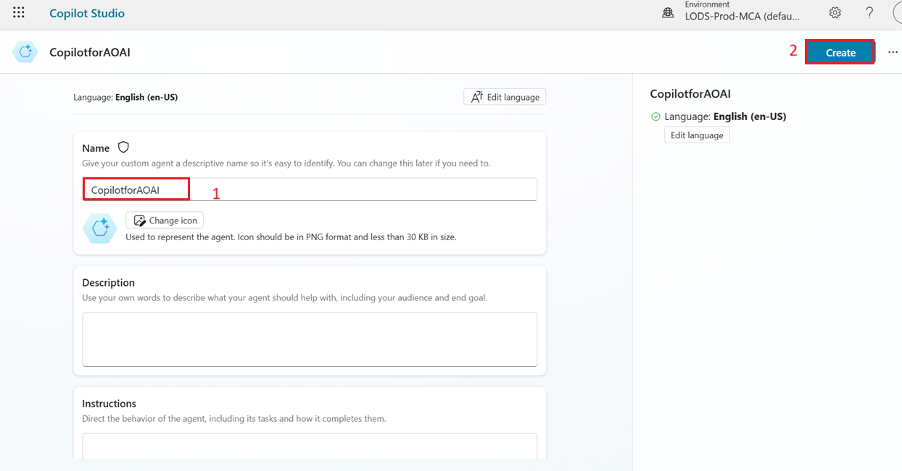

7.  Clique em **Topics -\> System -\> Conversational boosting**.

> 

8.  Clique em **Edit** em **Data sources** do nó **Create generative
    answers**. Selecione **Classic data** no painel **Properties** que
    se abre.

> 

9.  Em **Azure OpenAI Services on your data**, clique em **Connection
    properties** 

> 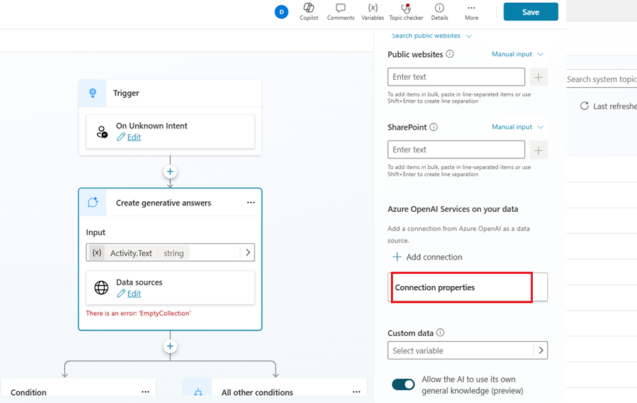

10. Isso adiciona a conexão do Azure OpenAI service e abre o painel de
    propriedades da conexão.

11. No painel **Connection Properties**, em **General -\>
    Configuration**, preencha os detalhes abaixo

> Deployment – +++gpt-4 +++
>
> Api version – Select latest version
>
> 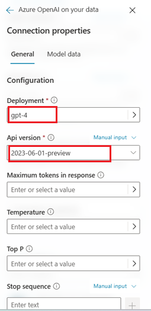

12. Na aba **Model data**, clique em **+ Add** em Fontes de dados e
    adicione os detalhes abaixo.

Index name - +++copilot-index+++

Content data – +++content+++

13. Clique em **Save**.

**Tarefa 3: Teste seu copilot**

1.  Clique em **Test** para abrir o painel Testar seu Copilot.

2.  Digite +++What is Azure OpenAI?+++ e clique em **Send**.

3.  Você receberá a resposta dos dados enviados no **Azure OpenAI
    resource**. Observe também a mensagem **Surfaced with Azure OpenAI**
    abaixo da resposta.

**Tarefa 4: Excluir recursos**

1.  Para excluir a conta de armazenamento, navegue até a página inicial
    do portal do Azure, digite **Resource groups** na barra de pesquisa
    do portal do Azure, navegue e clique em **Resource groups** em
    **Services**.

2.  Clique no grupo de recursos atribuído.

3.  Selecione cuidadosamente todos os recursos que você criou.

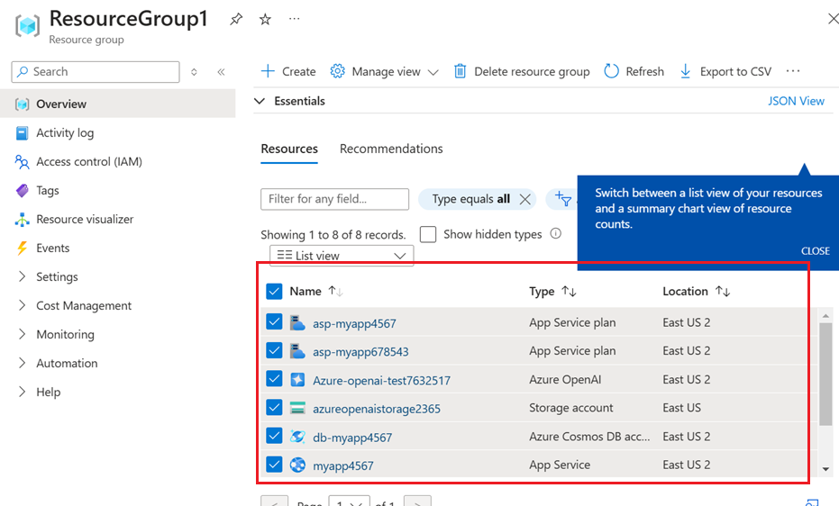

4.  Na página Resource group, navegue até a barra de comandos e clique
    em **Delete**.

**Observação importante** : Não clique em **Delete resource group**. Se
você não vir a opção **Delete** na barra de comando, clique no menu de
três pontos horizontais

5.  No painel **Delete Resources** que aparece no lado direito, digite
    **delete** e clique no botão **Delete**.

6.  Na caixa de diálogo **Delete confirmation**, clique no botão
    **Delete**.

7.  Clique no ícone do sino e você verá a notificação – **Executed
    delete command on 4 selected items.**

**Resumo**

Você criou uma conta de armazenamento, um contêiner e o serviço do Azure
cognitive no portal do Azure e, em seguida, implantou o modelo
gpt-3-turbo no Azure AI Studio. Você adicionou dados no Chat Playground
e testou a configuração do assistente enviando consultas em uma sessão
de chat. Em seguida, você lançou um novo aplicativo e iniciou uma
conversa com o chatbot. Você excluiu o modelo gpt-3-turbo, a conta de
armazenamento do Azure, o serviço de pesquisa cognitiva e o novo
aplicativo Web para gerenciar de forma eficaz e eficiente os recursos do
Azure OpenAI.
