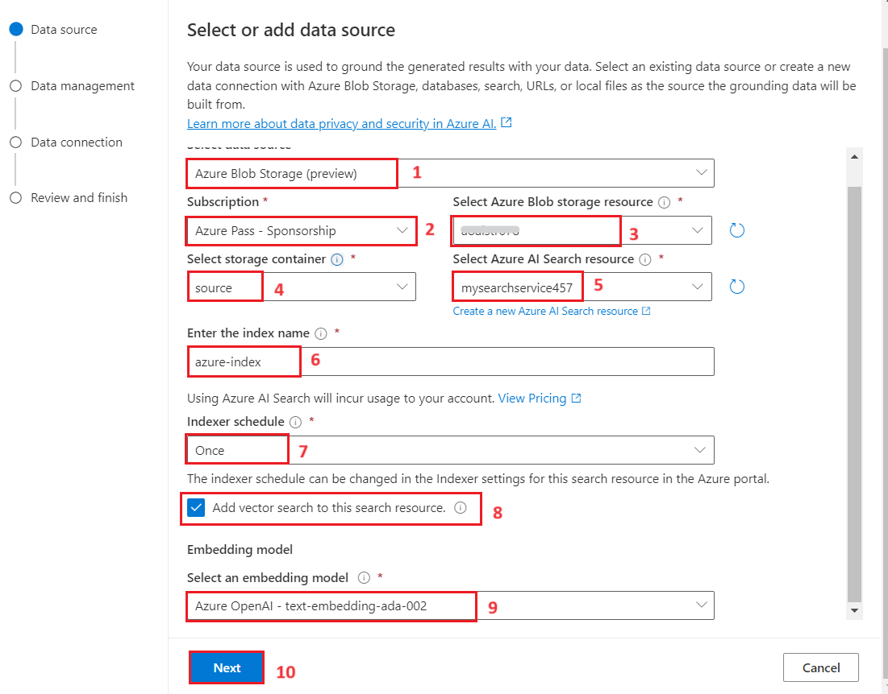
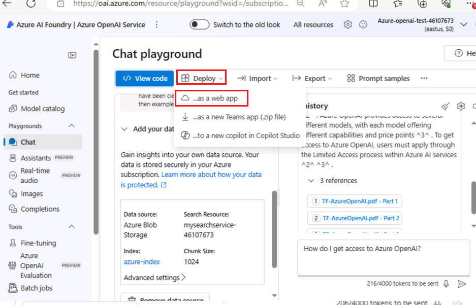
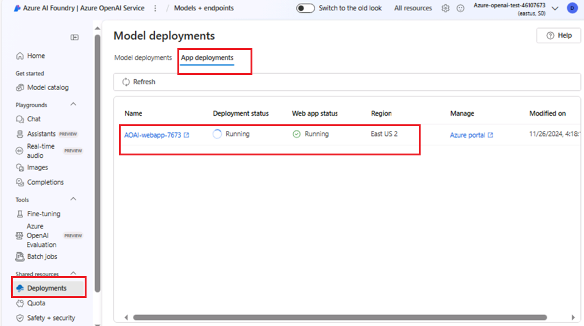
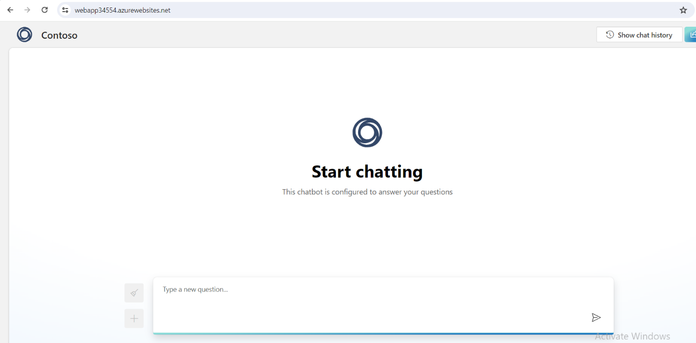
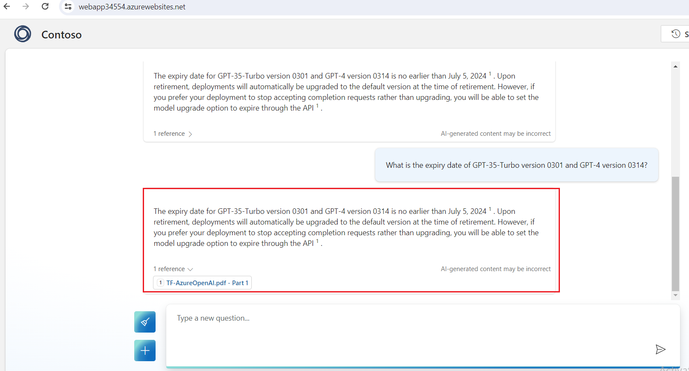
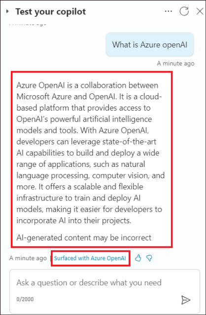

# Anwendungsfall 10: Erstellen einer Webapp und Betreiben eines virtuellen Agent-Bots mit benutzerdefinierten Daten mithilfe des Azure OpenAI Service

**Einleitung:**

Azure OpenAI für Ihre Daten arbeitet mit den leistungsstarken
Sprachmodellen ChatGPT (gpt-35-turbo) und GPT-4 von OpenAI zusammen,
sodass sie Antworten basierend auf Ihren Daten bereitstellen können. Sie
können über eine REST-API oder die webbasierte Schnittstelle in Azure
OpenAI Studio auf Ihre Daten zugreifen, um eine Lösung zu erstellen, die
eine Verbindung mit Ihren Daten herstellt, um eine verbesserte
Chaterfahrung zu ermöglichen.

Eines der wichtigsten Features von Azure OpenAI für Ihre Daten ist die
Möglichkeit, Daten so abzurufen und zu nutzen, dass die Ausgabe des
Modells verbessert wird. Azure OpenAI für Ihre Daten bestimmt zusammen
mit Azure Cognitive Search basierend auf der Benutzereingabe und dem
bereitgestellten Unterhaltungsverlauf, welche Daten aus der angegebenen
Datenquelle abgerufen werden sollen. Diese Daten werden dann erweitert
und als Prompt erneut an das OpenAI-Modell übermittelt, wobei die
abgerufenen Informationen an die ursprüngliche Prompt angehängt werden.
Obwohl die abgerufenen Daten an die Prompt angefügt werden, wird die
resultierende Eingabe weiterhin vom Modell wie jede andere Prompt
verarbeitet. Nachdem die Daten abgerufen und die Prompt an das Modell
übermittelt wurde, verwendet das Modell diese Informationen, um eine
Vervollständigung bereitzustellen.

**Ziele**

- So erstellen Sie ein Speicherkonto, einen Container und einen
  kognitiven Azure-Suchdienst im Azure-Portal.

- Zum Bereitstellen von gpt-3-turbo und Embedded-Modellen in Azure AI
  Studio und zum Hinzufügen von Daten in Chat Playground.

- So testen Sie die Einrichtung des Assistenten im Chat-Playground,
  indem Sie Abfragen in der Chat-Sitzung senden.

- So starten Sie einen Copilot und beginnen eine Konversation mit dem
  Bot

- So starten Sie eine neue App und starten eine Konversation mit der
  Copilot-App.

- So löschen Sie gpt-3-turbo und das eingebettete Modell, das
  Azure-Storage Account, den kognitiven Suchdienst und die neue Web-App.

## Übung 1: Erstellen eines Azure Storage-Kontos und einer Azure Cognitive Search über das Portal

### Aufgabe 1: Erstellen einer Azure OpenAI-Ressource

1.  Öffnen Sie Ihren Browser, navigieren Sie zur Adressleiste, geben Sie
    die folgende URL ein oder fügen Sie sie
    ein:+++<https://portal.azure.com/+++>, und drücken Sie dann die
    **Enter**-Taste.

2.  Verwenden Sie im **Microsoft Azure**-Fenster die **User
    Credentials**, um sich bei Azure anzumelden.

3.  Geben Sie dann das Passwort ein und klicken Sie auf die Schaltfläche
    **Sign-in**.

4.  Im Fenster **Stay signed in?**, klicken Sie auf die Schaltfläche
    **Yes**.

5.  Klicken Sie auf der Startseite des Azure-Portals auf das **Azure
    Portal Menu,** das durch drei horizontale Balken auf der linken
    Seite der Microsoft Azure-Befehlsleiste dargestellt wird, wie in der
    folgenden Abbildung gezeigt.

6.  Navigieren Sie und klicken Sie auf **+ Create a resource**.

7.  Geben Sie auf der Seite **Create a resource** in der Suchleiste
    **Search services and marketplace** den Namen **Azure OpenAI** ein,
    und drücken Sie dann die **Enter**-Taste.

8.  Navigieren Sie auf der Seite **Marketplace** zum Abschnitt **Azure
    OpenAI**, klicken Sie auf die Dropdownliste Create button, und
    wählen Sie dann **Azure OpenAI** aus, wie im Bild gezeigt. (Falls
    Sie bereits auf die Schaltfläche **Azure OpenAI-**Kachel, und
    klicken Sie dann auf der **Azure OpenAI-Seite** auf die Schaltfläche
    **Create**.

9.  Geben Sie im Fenster **Create Azure OpenAI** auf der Registerkarte
    **Basics** die folgenden Details ein, und klicken Sie auf die
    Schaltfläche **Next**.

[TABLE]

> 

10. Lassen Sie auf der Registerkarte **Network** alle Optionsfelder im
    Standardzustand und klicken Sie auf die Schaltfläche **Next.**

11. Lassen Sie auf der Registerkarte **Tags** alle Felder im
    Standardzustand und klicken Sie auf die Schaltfläche **Next.**

12. Klicken Sie auf der Registerkarte **Review+submit**, sobald die
    Validierung bestanden ist, auf die Schaltfläche **Create**.

13. Warten Sie, bis die Bereitstellung abgeschlossen ist. Die
    Bereitstellung dauert ca. 2-3 Minuten.

14. Klicken Sie im **Microsoft.CognitiveServicesOpenAI**-Fenster nach
    Abschluss der Bereitstellung auf die Schaltfläche **Go to
    resource**.

### Aufgabe 2: Erstellen eines Azure Storage-Kontos über das Portal

1.  Melden Sie sich bei +++[https://portal.azure.com/+++
    an](https://portal.azure.com/+++)

2.  Klicken Sie auf das **Portal Menu** und wählen Sie dann **+ Create a
    resource** aus.

3.  Geben Sie im Window-Suchfeld **Create a resource** den Namen
    **Storage account** ein, und klicken Sie dann auf das **Storage
    account**.

4.  Klicken Sie auf der Seite **Marketplace** auf den Abschnitt
    **Storage account**.

5.  Klicken Sie im Fenster **Storage account** auf die Schaltfläche
    **Create**.

6.  Geben Sie im Fenster **Create a storage account** auf der
    Registerkarte **Basics** die folgenden Details ein, um ein
    Speicherkonto zu erstellen, und klicken Sie dann auf **Review.**

[TABLE]

> 

7.  Klicken Sie auf der Registerkarte **Review** auf die Schaltfläche
    **Create**.

8.  Dieses neue Azure Storage-Konto ist jetzt für das Hosten von Daten
    für einen Azure Data Lake eingerichtet. Klicken Sie auf die
    Schaltfläche **Go to resource**.

9.  Nachdem das Konto bereitgestellt wurde, finden Sie auf der Seite
    Overview Optionen im Zusammenhang mit Azure Data Lake. Navigieren
    Sie im linken Navigationsbereich zum Abschnitt **Data storage** und
    klicken Sie dann auf **Containers**.

10. Auf **azureopenaistorageXX | Containers**-Seite, klicken Sie auf
    **+Container.**

11. Geben Sie im Bereich New Container, der auf der rechten Seite
    angezeigt wird, den Container-**Namen** als **+++source+++** ein und
    klicken Sie auf die Schaltfläche **Create**.

12. Auf **azureopenaistorageXX | Containers**-Seite, wählen Sie den
    **Source**-Container aus\*\*.\*\*

13. Klicken Sie auf der **Source**-Containerseite auf die Schaltfläche
    **Upload**.

14. Klicken Sie im Bereich **Upload Blob** auf **Browse for file**,
    navigieren Sie zum Speicherort **C:\Labfiles**, wählen Sie
    **TF-AzureOpenAI.pdf** aus, und klicken Sie dann auf die
    Schaltfläche **Open**.

! \[\](./media/image50.png)

15. Klicken Sie im Bereich **Upload blob** auf die Schaltfläche
    **Upload**.

16. Es wird die Benachrichtigung " **Successfully uploaded blob** "
    angezeigt , wenn der Upload erfolgreich war.

### Aufgabe 3: Erstellen eines AzureAI-Suchdiensts im Portal

1.  Auf der Seite **azureopenaistorageXX | Containers**, klicken Sie auf
    **Home**, um zur Startseite des Azure-Portals zurückzukehren.

2.  Klicken Sie auf der Startseite des Azure-Portals auf **+ Create
    Resource**.

3.  Geben Sie in der Suchleiste Seite " **Create a resource** " **Azure
    AI Search** ein, und klicken Sie auf die angezeigte **Azure AI
    Search**.

4.  Klicken Sie auf den Abschnitt **azure ai-search**.

5.  Klicken Sie auf der Seite **Azure AI Search** auf die Schaltfläche
    **Creat**.

6.  ! \[\](./media/image58.png)

7.  Geben Sie auf der Seite **Create a search service** die folgenden
    Informationen ein, und klicken Sie auf die Schaltfläche
    **Review+create**.

[TABLE]

> 
>
> 

8.  Sobald die Validierung bestanden ist, klicken Sie auf die
    Schaltfläche **Create**.

9.  Klicken Sie nach Abschluss der Bereitstellung auf die Schaltfläche
    **Go to resource**.

10. Auf der **mysearchserviceXX**-Übersichtsseite. Wählen Sie im linken
    Navigationsbereich im Abschnitt **Settings** die Option **Semantic
    Ranker** aus.

11. Wählen Sie auf der Registerkarte **Semantic Ranker** die Kachel
    **Standard** aus, und klicken Sie auf **Select plan.**

12. Sie sehen eine Benachrichtigung - **Successfully updated semantic
    ranker to free plan**

## Übung 2: Hinzufügen von Daten mit Azure OpenAI Studio

### Aufgabe 1: Bereitstellen von gpt-35-turbo und eingebetteten Modellen in Azure AI Studio

1.  Wechseln Sie zurück zum Azure-Portal, suchen Sie nach Azure OpenAI,
    und wählen Sie es aus.

2.  Wählen Sie Ihren **Azure OpenAI**-Dienst aus.

3.  Klicken Sie im **AzureOpenAI**-Fenster im linken Navigationsmenü auf
    **Overview**, und klicken Sie dann auf die Schaltfläche **Explore
    Azure AI Foundry portal**, um das **Azure AI Foundry-Portal** in
    einem neuen Browser zu erreichen

4.  In der **Azure AI Foundry |Azure OpenAI Studio**-Startseite Wählen
    Sie im linken Navigationsmenü die Option **Deployment** aus

> 

5.  Öffnen Sie im Fenster **Deployments** das **+Deploy model**, und
    wählen Sie **Deploy base model** aus**.**

6.  Navigieren Sie im Dialogfeld **Select a model**, wählen Sie
    **gpt-4** sorgfältig aus und klicken Sie dann auf die Schaltfläche
    **Confirm**.

> 

7.  Geben Sie im Feld **Deploy model dialog** die folgenden Details ein,
    und klicken Sie auf die Schaltfläche **Create**.

    - Modell auswählen: **gpt-35-turbo**

    - Name der Bereitstellung: Geben Sie **gpt-35-turbo** ein.

    - Wählen Sie **Standard** als **Deployment type** aus.

> 
>
> 
>
> 

8.  Öffnen Sie im Fenster **Deployments** das **+Deploy model**, und
    wählen Sie **Deploy base model** aus.

> 

9.  Navigieren Sie im Dialogfeld **Select a model** zu
    **text-embedding-ada-002** und klicken Sie dann auf die Schaltfläche
    **Confirm**.

10. Geben Sie im Dialogfeld **Deploy model** unter **Deployment name**

> +++text-embedding-ada-002+++, wählen Sie den **Standard** als
> **Deployment type** aus und klicken Sie auf die Schaltfläche
> **Deploy**.

11. In **Azure AI Foundry |Azure OpenAI Service-**Startseite im
    Abschnitt **Playgrounds** auf den **Chat**.

12. Wählen Sie im Bereich **Chat Playground** die Dropdown-Liste **Add
    your data** aus, und wählen Sie **+ Add a data source** aus.

### Aufgabe 2: Hinzufügen Ihrer Daten mit Azure OpenAI Studio

1.  Klicken Sie auf der Seite **Select or add data source** auf die
    Dropdownliste unter **Select or add data source**, navigieren Sie
    dann zu Azure Blob Storage, und klicken Sie auf **Azure Blob
    Storage**.

2.  Geben Sie auf der Seite **Select or add data source** unter **Select
    or add data source** die folgenden Details ein, und wählen Sie
    **Next** aus**.**

[TABLE]

3.  Aktivieren Sie das Kontrollkästchen – **Add vector search to this
    search resource**.

4.  Wählen Sie ein Einbettungsmodell als **text-embedding-ada-002** aus,
    und klicken Sie dann auf die Schaltfläche **Next**.

***Hinweis**: Falls ein Fehler auftritt – **Can‘t manage CORS on this
resource. Please select another storage resource** und synchronisieren
Sie dann Ihre VM-Zeit, wie in Aufgabe \#1 erwähnt.*

5.  Wählen Sie auf der Seite **Add data** auf der Registerkarte **Data
    management** den Suchtyp aus, und wählen Sie **Hybrid+Semantic**
    aus.

6.  Wählen Sie die **chunk size** als **1024 (default)** aus und klicken
    Sie dann auf **Next.**

7.  Wählen Sie im Bereich **Data connection** die Option **API-Key** aus
    und klicken Sie auf die Schaltfläche **Next**.

8.  Überprüfen Sie im Bereich **Review and Finish** die eingegebenen
    Details, und klicken Sie auf die Schaltfläche **Save and close** .

9.  Die Daten werden in Ihrem Chat Playground hinzugefügt. Dies dauert
    ca. 4-5 Minuten.

### Aufgabe 3: Untersuchen der Textvervollständigung im Chat Playground

1.  Geben Sie im Abschnitt **Chat-Session** die folgende Prompt in das
    Textfeld **User message** ein und klicken Sie auf das **Symbol**
    **Send**

> CodeCopy
>
> What is Azure OpenAI Service?

2.  Wählen Sie im Abschnitt **Chat-Session** den Link Referenzen aus und
    beobachten Sie die Details des Suchdokuments auf der rechten Seite
    der Seite.

## Übung 3: Bereitstellen einer Web-App mit benutzerdefinierten Daten

### Aufgabe 1: Bereitstellen einer Web-App

1.  In **In Azure AI Foundry |Azure OpenAI** **Service**-Startseite**,
    Chat-Playground-Bereich**, Dropdown-Menü **Deploy**, navigieren Sie
    dann, und klicken Sie auf **As Web-App**.

2.  Wählen Sie im Fenster **Deploy to a web app** das Optionsfeld
    **Create a new web app** aus, und geben Sie die folgenden Details
    ein:

[TABLE]

3.  Aktivieren Sie das Kontrollkästchen **Enable chat history in the web
    app**

4.  Klicken Sie auf die Schaltfläche **Deploy**.

Hinweis: Die Bereitstellung dauert 5-10 Minuten

5.  Um den Bereitstellungsstatus zu überprüfen, klicken Sie auf
    **Deployments** und wählen Sie **App-Deployment** aus.

6.  Warten Sie, bis die Bereitstellung abgeschlossen ist. Die
    Bereitstellung dauert etwa **10-15** Minuten.

7.  Klicken Sie auf die Webanwendung.

8.  Warten Sie 10 Minuten, damit die Authentifizierungskonfiguration
    erfolgreich auf die App angewendet werden kann.

9.  Klicken Sie nach 10 Minuten auf die Schaltfläche **Refresh**.

10. Klicken Sie im Dialogfeld **" Permissions requested** " auf die
    Schaltfläche "**Accept**"

11. Jetzt wird die Web-App in einem neuen Browser geöffnet.

12. Geben Sie auf der Seite der **Azure AI-**Web-App den folgenden Text
    ein, und klicken Sie auf das **Symbol** **Submit**, wie in der
    folgenden Abbildung gezeigt.

**CodeCopy**

How do I get access to Azure OpenAI?

 

13. Fügen Sie auf ähnliche Weise den folgenden Text in das Textfeld ein
    und klicken Sie auf das Symbol **Send**.

**CodeCopy**

**+++What is the expiry date of GPT-35-Turbo version 0301 and GPT-4
version 0314?+++**

14. Aktualisieren Sie die Webapp-Seite und klicken Sie auf **Show chat
    history**.

15. Klicken Sie unter dem Chatverlauf auf **Accessing Azure OpenAI**.

## Übung 4: Erstellen einer Copilot-App mit benutzerdefinierten Daten

### Aufgabe 1: Erstellen eines Chatbots mit benutzerdefinierten Daten

1.  In **Azure AI Foundry |Azure AI Studio Chat-Playground,** wählen Sie
    unter Add your data die Option Remove data source aus.

2.  Wählen Sie im Bereich **Chat Playground** die Dropdown-Liste **Add
    your data** aus, und wählen Sie **+ Add a data source** aus.

3.  Geben Sie auf der Seite **" Add data** " unter **" Select or add
    data source "** die folgenden Details ein, und wählen Sie **"Next"**
    aus.

[TABLE]

> 
>
> ***Hinweis**: Falls ein Fehler auftritt – **Can‘t manage CORS on this
> resource. Please select another storage resource** aus und
> synchronisieren Sie dann Ihre VM-Zeit, wie in Aufgabe \#1 erwähnt.*

4.  Auf der Seite **Add data** Dropdown auf der Registerkarte **Data
    management** den Suchtyp und wählen Sie **Keyword** aus, wählen Sie
    die Blockgröße als **1024 (default)** aus und klicken Sie dann auf
    **Next.**

5.  Wählen Sie im Bereich **Data connection** die Option **API-Key** aus
    und klicken Sie auf die Schaltfläche **Next**.

6.  Überprüfen Sie im Bereich **Review and Finish** die eingegebenen
    Details, und klicken Sie auf die Schaltfläche **Save and close**.

 

7.  Die Daten werden in Ihrem Chat Playground hinzugefügt. Dies dauert
    ca. 4-5 Minuten.

### Aufgabe 2: Erstellen eines Copilots mit benutzerdefinierten Daten aus Azure OpenAI

1.  Melden Sie sich bei +++[<https://copilotstudio.microsoft.com/>+++
    mit Ihren Azure-Anmeldedaten
    an.](https://copilotstudio.microsoft.com/)

2.  Wählen Sie nach der Anmeldung auf der Seite Welcome to Microsoft
    Copilot Studio Ihr Land aus und klicken Sie auf **Start free
    trial**.

3.  Die Copilot-Startseite wird geöffnet.

> 

4.  Wählen Sie im linken Fensterbereich **Agents** aus. Klicken Sie dann
    auf **+ New Agent**.

> 

5.  Wählen Sie **Skip to configure** aus.

6.  Geben Sie auf der Seite Create a copilot den **Namen** als
    +++**CopilotforAOAI**+++ ein und klicken Sie auf **Create**.

7.  Klicken Sie auf **Topics -\> System -\> Conversational Boosting**.

> 

8.  Klicken Sie unter **Data sources** des Knotens **Create generative
    answers** auf **Edit**. Wählen Sie im sich öffnenden Bereich
    **Properties** die Option **Classic data** aus.

> 

9.  Klicken Sie unter **Azure OpenAI Services on your data** auf
    **Connection properties**

> 

10. Dadurch wird die Azure OpenAI-Dienstverbindung hinzugefügt, und der
    Bereich mit den Verbindungseigenschaften wird geöffnet.

11. Geben Sie im Bereich **Connection Properties** unter **General -\>
    Configuration** die folgenden Details ein

Deployment – +++gpt-4 +++

Api version – Select latest version

> 

12. Klicken Sie auf der Registerkarte **Model data** unter Data sources
    auf **+ Add** und fügen Sie dann die folgenden Details hinzu.

Index name - +++copilot-index+++

Content data – +++content+++

13. Klicken Sie auf **Save**.

**Aufgabe 3: Testen des Copilots**

1.  Klicken Sie auf **Test**, um den Bereich Test your Copilot pane zu
    öffnen.

2.  Geben Sie +++What is Azure OpenAI?+++ ein, und klicken Sie auf
    **Send**.

3.  Sie erhalten die Antwort aus den Daten, die in die **Azure
    OpenAI-Resource** hochgeladen wurden. Beachten Sie auch, dass die
    Meldung **Surfaced with Azure OpenAI** unter der Antwort.

**Aufgabe 4: Löschen von Ressourcen**

1.  Um das Speicherkonto zu löschen, navigieren Sie zur Startseite des
    Azure-Portals, geben Sie **Resource group** in die Suchleiste des
    Azure-Portals ein, navigieren Sie, und klicken Sie unter
    **Services** auf **Resource groups**.

2.  Klicken Sie auf die zugewiesene Ressourcengruppe.

3.  Wählen Sie alle Ressourcen, die Sie erstellt haben, sorgfältig aus.

4.  Navigieren Sie auf der Seite Ressourcengruppe zur Befehlsleiste, und
    klicken Sie auf **Delete**.

**Wichtiger Hinweis**: Klicken Sie nicht auf **Delete resource group**.
Wenn die Option **Delete** nicht in der Befehlsleiste angezeigt wird,
klicken Sie auf die horizontalen Auslassungspunkte.

5.  Geben Sie im Bereich **" Delete Resources** ", der auf der rechten
    Seite angezeigt wird, die **Delete** ein und klicken Sie auf die
    Schaltfläche **Delete**.

6.  Klicken Sie im Dialogfeld **" Delete confirmation** " auf die
    Schaltfläche "**Delete**".

7.  Klicken Sie auf das Glockensymbol, Sie sehen die Benachrichtigung –
    **Executed delete command on 4 selected items.**

**Zusammenfassung**

Sie haben ein Speicherkonto, einen Container und einen Azure Cognitive
Service im Azure-Portal erstellt und dann das gpt-3-turbo-Modell in
Azure AI Studio bereitgestellt. Sie haben Daten in Chat Playground
hinzugefügt und die Einrichtung von Assistant getestet, indem Sie
Abfragen in einer Chatsitzung gesendet haben. Dann haben Sie eine neue
App gestartet und eine Konversation mit dem Chatbot begonnen. Sie haben
das gpt-3-turbo-Modell, das Azure-Storage Account, Cognitive Search
Service und die neue Web-App gelöscht, um die Azure OpenAI-Ressourcen
effektiv und effizient zu verwalten.
