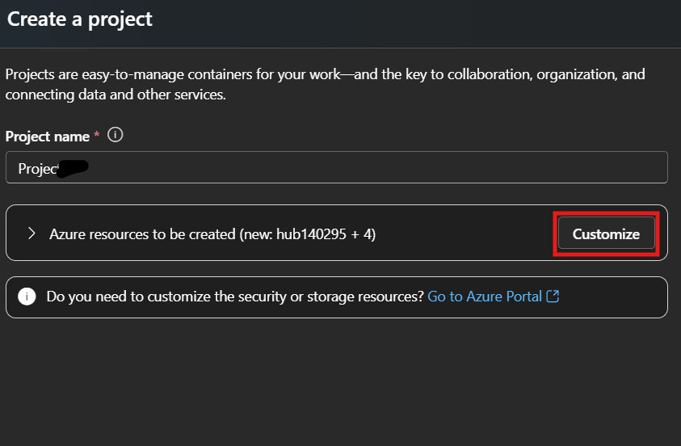
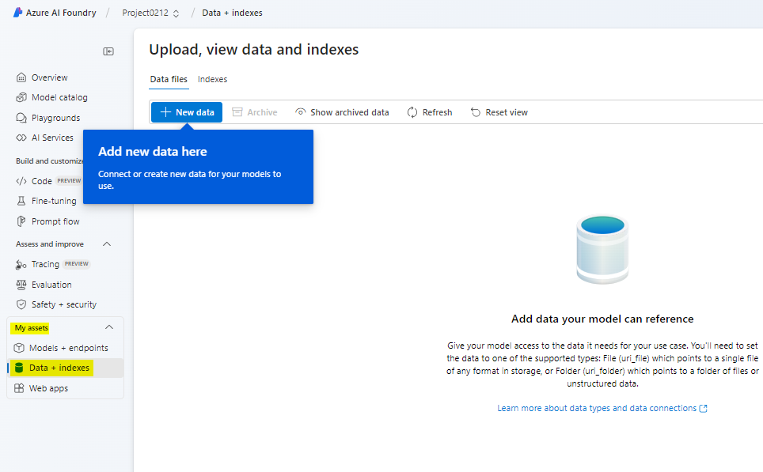
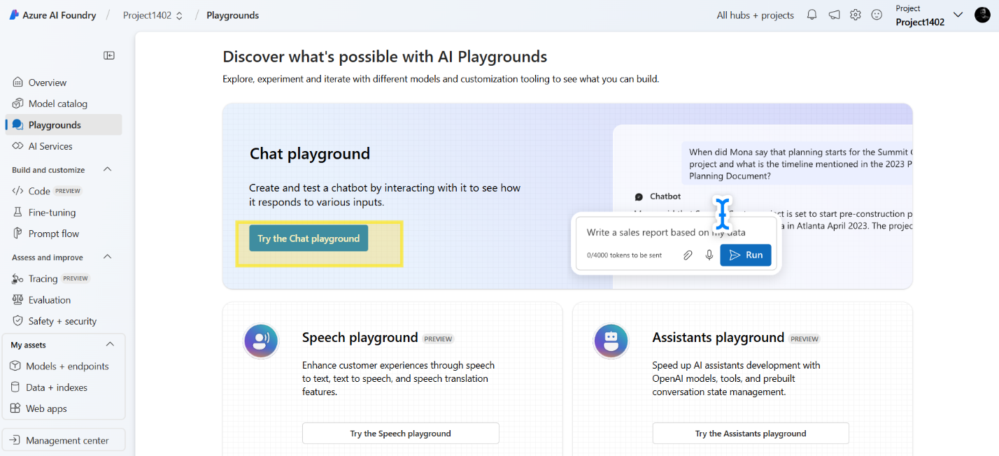
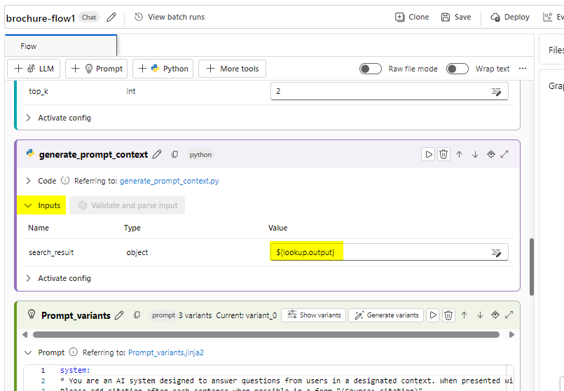

# Caso de uso 11 - Criação de um agente de AI personalizado com o Azure AI Foundry e integração de pesquisa

**Tempo estimado: 45 min**

## Objetivo

O objetivo deste laboratório é orientar os participantes na criação de
um agente com tecnologia de AI usando os serviços do Azure AI e a
integração com a Pesquisa. Os participantes aprenderão a configurar,
integrar e testar componentes-chave para criar um agente funcional capaz
de recuperar e interagir de forma inteligente com informações,
aprimorando a experiência do usuário e a produtividade.

## Solução

Este laboratório se concentra na integração dos serviços do Azure AI com
recursos avançados de pesquisa para criar uma solução robusta e
inteligente. Ele enfatiza a configuração de um agente com tecnologia de
AI, permitindo a recuperação de dados sem interrupções e fornecendo
respostas contextuais. Ao utilizar a AI e a integração de pesquisa, a
solução visa otimizar fluxos de trabalho, aprimorar a tomada de decisões
e aprimorar o engajamento do usuário por meio de interações intuitivas e
eficientes.

## Tarefa 1: Criar um recurso Azure AI Search

1.  Em um navegador da Web, abra o portal do Azure em
    <https://portal.azure.com> e entre usando suas credenciais de
    administrador do Office 365.

> 

2.  Na página inicial, selecione **+ Create a resource** e pesquise por
    **Azure AI Search** Em seguida, **create** um novo recurso do Azure
    AI Search com as seguintes configurações:

    - **Subscription**: *selecione sua assinatura do Azure.*

    - **Resource group**: *Selecione ou crie um grupo de recursos, aqui
      selecionamos **RG4OpenAI***

    - **Service name**: *insira um nome de serviço exclusivo, aqui o
      chamaremos de **copilotXXXX***

    - **Location**: *Faça uma escolha **aleatória** de qualquer uma das
      seguintes regiões, aqui selecionamos Canadá Leste*

      - Australia East

      &nbsp;

      - Canada East

      &nbsp;

      - East US

      &nbsp;

      - East US 2

      &nbsp;

      - France Central

      &nbsp;

      - Japan East

      &nbsp;

      - North Central US

      &nbsp;

      - Sweden Central

      &nbsp;

      - Switzerland

    - **Pricing tier**: Standard

    - Clique em **Review+create** e depois em **Create.**

> 
>
> 
>
> 
>
> 
>
> Posteriormente, você criará um Azure AI Hub (que inclui um serviço do
> Azure OpenAI) na mesma região que o seu recurso Azure AI Search. Os
> recursos do Azure OpenAI são limitados no nível do locatário por cotas
> regionais. As regiões listadas incluem a cota padrão para os tipos de
> modelo usados neste exercício. A escolha aleatória de uma região reduz
> o risco de uma única região atingir seu limite de cota em cenários em
> que você compartilha um locatário com outros usuários. Caso o limite
> de cota seja atingido posteriormente no exercício, é possível que você
> precise criar outro Azure AI Hub em uma região diferente.

3.  Aguarde a conclusão da implementação do recurso Azure AI Search.

> 

## Tarefa 2: Criar um projeto no Azure AI

1.  Em um navegador da Web, abra [Azure AI Foundry
    portal](https://ai.azure.com/) em <https://ai.azure.com> e entre
    usando suas credenciais do Azure.

2.  Na página inicial, selecione **+ Create project**.

> 

3.  No assistente **Create a project,** digite o nome do projeto como
    **ProjectXXXX** e clique em **Customize**.

> 

4.  **Em Customize**, conecte-se ao seu recurso Azure AI Search, insira
    os seguintes detalhes, selecione **Next** e revise sua configuração.

    - **Hub name**: ***hubXXXX***

    - **Azure Subscription**: *sua assinatura do Azure*

    - **Resource group**: **RG4OpenAI**

    - **Location**: *O mesmo local do seu recurso de Azure AI Search,
      **Canada East***

    - **Connect Azure AI Services or Azure OpenAI**: (New)
      *Preenchimento automático com o nome do hub selecionado*

    - **Connect Azure AI Search**: *selecione seu recurso Azure AI
      Search, **copilotXXXX***

> 

5.  Selecione **Next** e depois **Create** e aguarde a conclusão do
    processo.

> 
>
> 
>
> 

## Tarefa 3: Implementar modelos

Você precisa de dois modelos para implementar sua solução:

- Um modelo *de incorporação* para vetorizar dados de texto para
  indexação e processamento eficientes.

- Um modelo que pode gerar respostas em linguagem natural para perguntas
  baseadas em seus dados.

1.  No portal Azure AI Foundry, no seu projeto, no painel de navegação à
    esquerda, em **My assets**, selecione a página **Models +
    endpoints**.

> 

2.  Na página **Manage deployments of your models and services,** clique
    em **+Deploy model** e selecione **Deploy base model.**

> 

3.  Na página **Select a model**, pesquise e selecione o modelo
    **text-embedding-ada-002** e clique em **Confirm.**

> 

4.  No painel **Deploy model text-embedding-ada-**002, clique em
    **Customize** e insira os seguintes detalhes no assistente Deploy
    model:

> 

- **Deployment name**: text-embedding-ada-002

- **Deployment type**: Standard

- **Model version**: *Selecione a versão default*

- **AI resource**: *Selecione o recurso criado anteriormente*

- **Tokens per Minute Rate Limit (thousands)**: 5K

- **Content filter**: DefaultV2

- **Enable dynamic quota**: Disabled

> 
>
> 

5.  Repita as etapas anteriores para implementar um modelo
    **gpt-35-turbo-16k** com o nome de implementação gpt-35-turbo-16k.

> 
>
> 
>
> **Observação** : reduzir os Tokens por Minuto (TPM) ajuda a evitar o
> uso excessivo da cota disponível na assinatura que você está usando.
> 5.000 TPM são suficientes para os dados usados neste exercício.

## Tarefa 4: Adicionar dados ao seu projeto

Os dados do seu copilot consistem em um conjunto de folhetos de viagem
em formato PDF da agência de viagens fictícia *Margie's Travel* . Vamos
adicioná-los ao projeto.

1.  Navegue até a pasta chamada **brochures** nos arquivos C:\Lab do seu
    sistema.

2.  No portal do Azure AI Foundry, no seu projeto, no painel de
    navegação à esquerda, em **My assets**, selecione a página **Data +
    indexes**.

> 

3.  Selecione **+ New data**.

> 

4.  No assistente **Add your data**, expanda o menu suspenso para
    selecionar **Upload files/folders**.

> 

5.  Selecione **Upload folder** e selecione a pasta **brochures**.

> 

6.  Selecione **Next** na tela.

> 

7.  Aguarde o upload da pasta e observe que contém vários arquivos .pdf.

8.  Na próxima página de name and finish, insira o nome dos dados como
    **data0212** e clique em **Create.**

> 
>
> 

## Tarefa 5: Crie um índice para seus dados

Agora que você adicionou uma fonte de dados ao seu projeto, pode usá-la
para criar um índice no seu recurso Azure AI Search.

1.  No portal do Azure AI Foundry, no seu projeto, no painel de
    navegação à esquerda, em **My assets**, selecione a página **Data +
    indexes**.

> 

2.  Na guia **Indexes**, adicione um novo índice com as seguintes
    configurações e então selecione **Next**.

    - **Source location**:

      - **Data source**: Dados no Azure AI Studio

        - *Selecione a fonte de dados **brochures - dataXXXX***

- Configure o índice conforme as opções abaixo e selecione **Next.**

  - **Select Azure AI Search service**: *Selecione a conexão
    **AzureAISearch** para o seu recurso Azure AI Search*

  &nbsp;

  - **Vector index**: brochures-index

  &nbsp;

  - **Virtual machine**: Auto select

> 

- Ajuste a configuração de pesquisa conforme abaixo e selecione
  **Next**. Na janela Revisão, clique em **Create Vector Index**.

  - **Vector settings**: Add vector search to this search resource

  &nbsp;

  - **Azure OpenAI connection**: *Select the default Azure OpenAI
    resource for your hub.*

> 
>
> 

3.  Aguarde a conclusão do processo de indexação, que pode levar vários
    minutos. A operação de criação do índice consiste nas seguintes
    tarefas:

    - Analisar, segmentar e incorporar os tokens de texto nos dados dos
      seus folhetos.

    - Criar o índice do Azure AI Search.

    - Registrar o ativo de índice.

## Tarefa 6: Teste o índice

Antes de usar seu índice em um fluxo de prompt baseado em RAG, vamos
verificar se ele pode ser usado para afetar respostas de AI generativa.

1.  No painel de navegação à esquerda, selecione a página
    **Playgrounds** e depois selecione **Chat Playground.**

> 

2.  Na página de Chat, no painel Configuração, certifique-se de que a
    implementação do modelo **gpt-35-turbo-16k** esteja selecionada. Em
    seguida, no painel principal da sessão de chat, envie o prompt:
    **Where can I stay in New York?**

> 

3.  Revise a resposta, que deve ser uma resposta genérica do modelo, sem
    nenhum dado do índice.

4.  No painel Configuração, expanda o campo **Add your data**, adicione
    o índice do projeto **brochures-index** e selecione o tipo de
    pesquisa **hybrid (vector + keyword)**.

> 
>
> **Observação** : alguns usuários estão percebendo que os índices
> recém-criados não estão disponíveis imediatamente. Atualizar o
> navegador geralmente ajuda, mas se você ainda estiver com o problema
> de não encontrar o índice, talvez seja necessário aguardar até que o
> índice seja reconhecido.

5.  Depois que o índice for adicionado e a sessão de chat for
    reiniciada, reenvie o prompt **Where can I stay in New York?**

> 

6.  Revise a resposta, que deve ser baseada nos dados do índice.

## Tarefa 7: Use o índice em um fluxo de prompt

Seu índice vetorial foi salvo no seu projeto do Azure AI Foundry,
permitindo que você o utilize facilmente em um fluxo de prompt.

1.  No portal do Azure AI Foundry, no seu projeto, no painel de
    navegação à esquerda, em **Build and customize**, selecione a página
    **Prompt flow** e clique em **+Create.**

> 

2.  Crie um novo fluxo de prompt clonando o exemplo de **Multi-Round Q&A
    on Your Data** na galeria. Salve o clone deste exemplo em uma pasta
    chamada **brochure-flow** .

> 
>
> 
>
> Observação: se ocorrer um erro de permissão, tente novamente com um
> novo nome após 2 minutos e o fluxo será clonado.
>
> 

3.  Quando a página do designer de fluxo de prompts abrir, revise
    **brochure-flow** . O gráfico deve ser semelhante à seguinte imagem:

> 

> O fluxo de prompt de exemplo que você está utilizando implementa a
> lógica de prompt para uma aplicação de chat, no qual o usuário pode
> enviar entradas de texto de forma iterativa por meio da interface de
> chat. O histórico da conversa é mantido e incluído no contexto de cada
> iteração. O fluxo de prompt orquestra uma sequência de ferramentas
> para:

- Anexe o histórico à entrada do chat para definir um prompt na forma de
  uma pergunta contextualizada.

- Recupere o contexto usando seu índice e um tipo de consulta de sua
  escolha com base na pergunta.

- Gere contexto de prompt usando os dados recuperados do índice para
  complementar a pergunta.

- Crie variantes de prompt adicionando uma mensagem do sistema e
  estruturando o histórico do chat.

- Envie o prompt para um modelo de linguagem para gerar uma resposta em
  linguagem natural.

4.  Use o botão **Start compute session** para iniciar a computação em
    tempo de execução do fluxo.

> Aguarde o início do tempo de execução. Isso fornece um contexto
> computacional para o fluxo de prompt. Enquanto aguarda, na guia
> **Flow**, revise as seções das ferramentas no fluxo.
>
> 

5.  Na seção **Inputs**, certifique-se de que as entradas incluam:

    - **chat_history**

    - **chat_input**

O histórico de chat padrão neste exemplo inclui algumas conversas sobre
AI.

6.  Na seção **Outputs**, certifique-se de que a saída inclua:

    - **chat_output** com valor ${chat_with_context.output}

> 

7.  Na seção **modify_query_with_history**, selecione as seguintes
    configurações (deixando as outras como estão):

    - **Connection**: *O recurso padrão do Azure OpenAI para seu AI hub*

    - **Api**: chat

    - **deployment_name**: gpt-35-turbo-16k

    - **response_format**: {“type”:”text”}

> 

8.  Aguarde o início da sessão de computação e, na seção **lookup**,
    defina os seguintes valores de parâmetros:

    - **mlindex_content**: *Selecione o campo vazio para abrir o painel
      Generate*

      - **index_type**: Registered Index

      &nbsp;

      - **mlindex_asset_id**: brochures-index:1

    - **queries**: ${modify_query_with_history.output}

    - **query_type**: Hybrid (vector + keyword)

    - **top_k**: 2

> 
>
> 

9.  Na seção **generate_prompt_context**, revise o script Python e
    certifique-se de que os **inputs** para esta ferramenta incluam o
    seguinte parâmetro:

    - **search_result** *(object)*: ${lookup.output}

> 

10. Na seção **Prompt_variants**, revise o script Python e certifique-se
    de que os **inputs** para esta ferramenta incluam os seguintes
    parâmetros:

    - **contexts** *(string)*: ${generate_prompt_context.output}

    - **chat_history** *(string)*: ${inputs.chat_history}

    - **chat_input** *(string)*: ${inputs.chat_input}

> 

11. Na seção **chat_with_context**, selecione as seguintes configurações
    (deixando as outras como estão):

    - **Connection**: Default_AzureOpenAI

    - **Api**: Chat

    - **deployment_name**: gpt-35-turbo-16k

    - **response_format**: {“type”:”text”}

Em seguida, certifique-se de que os **inputs** para esta ferramenta
incluam os seguintes parâmetros:

- **prompt_text** *(string)*: ${Prompt_variants.output}

> 

12. Na barra de ferramentas, use o botão **Save** para salvar as
    alterações feitas nas ferramentas no fluxo de prompt.

> 

13. Na barra de ferramentas, selecione **Chat**. Um painel de chat será
    aberto com o histórico de conversas de exemplo e a entrada já
    preenchida com base nos valores de exemplo. Você pode ignorá-los.

> 

14. No painel de chat, substitua a entrada padrão pela pergunta **Where
    can I stay in London?** e envie-a.

> 

15. Revise a resposta, que deve ser baseada nos dados do índice.

16. Revise as saídas de cada ferramenta no fluxo.

> 

17. No painel de chat, digite a pergunta **What can I do there?**

18. Revise a resposta, que deve ser baseada nos dados do índice e levar
    em conta o histórico do chat (portanto, “there” é entendido como
    “London”).

> 

19. Revise as saídas de cada ferramenta no fluxo, observando como cada
    ferramenta operou em suas entradas para preparar um prompt
    contextualizado e obter uma resposta apropriada.

## Tarefa 8: Desafio

Agora que você já sabe como integrar seus próprios dados em um copilot
criado com o portal do Azure AI Foundry, vamos explorar mais!

Tente adicionar uma nova fonte de dados pelo portal do Azure AI Foundry,
indexe-a e integre os dados indexados em um fluxo de prompt. Alguns
conjuntos de dados que você pode experimentar são:

- Uma coleção de artigos (de pesquisa) que você tem no seu computador.

- Um conjunto de apresentações de conferências anteriores.

Seja o mais criativo possível para criar sua fonte de dados e integrá-la
ao seu fluxo de prompts. Experimente o novo fluxo de prompts e envie
prompts que só podem ser respondidos pelo conjunto de dados que você
escolheu!

## Tarefa 9: Limpeza

Para evitar custos desnecessários do Azure e utilização de recursos,
você deve remover os recursos implementados neste exercício.

Após terminar de explorar o Azure AI Foundry, volte ao [Azure
portal](https://portal.azure.com/) em https://portal.azure.com e faça
login usando suas credenciais do Azure, se necessário. Em seguida,
exclua os recursos do grupo de recursos onde você provisionou o Azure AI
Search e os recursos do Azure AI.
