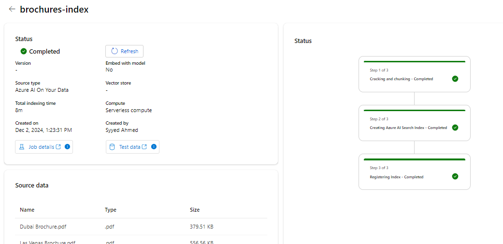

# Anwendungsfall 11: Erstellen eines benutzerdefinierten AI-Agents mit Azure AI Foundry und Suchintegration

**Geschätzte Zeit: 45 min**

## Ziel

Das Ziel dieses Labs besteht darin, die Teilnehmer bei der Erstellung
eines AI-gestützten Agents mithilfe von Azure-AI-Diensten und der
Suchintegration zu unterstützen. Die Teilnehmer lernen,
Schlüsselkomponenten zu konfigurieren, zu integrieren und zu testen, um
einen funktionalen Agenten zu erstellen, der in der Lage ist,
Informationen abzurufen und zu interagieren und so die Benutzererfahrung
und Produktivität zu verbessern.

## Lösung

Dieses Lab konzentriert sich auf die Integration von Azure AI-Diensten
mit erweiterten Suchfunktionen, um eine robuste, intelligente Lösung zu
erstellen. Der Schwerpunkt liegt auf der Konfiguration eines
AI-gestützten Agenten, der einen nahtlosen Datenabruf ermöglicht und
kontextbezogene Antworten liefert. Durch die Nutzung von AI und
Suchintegration zielt die Lösung darauf ab, Arbeitsabläufe zu
rationalisieren, die Entscheidungsfindung zu verbessern und die
Benutzerbindung durch intuitive und effiziente Interaktionen zu
verbessern.

## Aufgabe 1: Erstellen einer Azure AI Search-Ressource

1.  Öffnen Sie in einem Webbrowser das Azure-Portal unter
    [https://portal.azure.com,](https://portal.azure.com) und melden Sie
    sich mit Ihrem Office 365-Administratoranmeldeinformationen an.

> 

1.  Wählen Sie auf der Startseite **+ Create a resource** aus**,** und
    suchen Sie nach **Azure AI Search**. Erstellen Sie **dann** eine
    neue Azure AI Search-Ressource mit den folgenden Einstellungen:

    - **Subscription**: *Wählen Sie Ihr Azure-Abonnement aus.*

    - **Resource group**: *Wählen Sie eine Ressourcengruppe aus, oder
      erstellen Sie eine Ressourcengruppe, hier wählen wir
      **RG4OpenAI***

    - **Service name**: *Geben Sie einen eindeutigen Dienstnamen ein,
      hier nennen wir ihn wie folgt **copilotXXXX***

    - **Location**: *Treffen Sie eine **zufällige** Auswahl aus einer
      der folgenden Regionen, hier wählen wir Kanada Ost*

      - Australia East

      &nbsp;

      - Canada East

      &nbsp;

      - East US

      &nbsp;

      - East US 2

      &nbsp;

      - France Central

      &nbsp;

      - Japan East

      &nbsp;

      - North Central US

      &nbsp;

      - Sweden Central

      &nbsp;

      - Switzerland

    - **Pricing tier**: Standard

    - Klicken Sie auf **Review+create** und dann auf **Create.**

> 
>
> 
>
> 
>
> 
>
> Später erstellen Sie einen Azure AI Hub (der einen Azure OpenAI-Dienst
> enthält) in derselben Region wie Ihre Azure AI Search-Ressource. Azure
> OpenAI-Ressourcen werden auf Mandantenebene durch regionale
> Kontingente eingeschränkt. Die aufgelisteten Regionen enthalten ein
> Standardkontingent für die in dieser Übung verwendeten Modelltypen.
> Die zufällige Auswahl einer Region verringert das Risiko, dass eine
> einzelne Region ihr Kontingentlimit erreicht, wenn Sie einen Mandanten
> für andere Benutzer freigeben. Falls später in der Übung ein
> Kontingentlimit erreicht wird, besteht die Möglichkeit, dass Sie einen
> weiteren Azure AI Hub in einer anderen Region erstellen müssen.

2.  Warten Sie, bis die Bereitstellung Ihrer Azure AI Search-Ressource
    abgeschlossen ist.

> 

## Aufgabe 2: Erstellen eines Azure AI-Projekts

1.  Öffnen Sie in einem Webbrowser [das Azure AI
    Foundry-Portal](https://ai.azure.com/) unter
    [https://ai.azure.com,](https://ai.azure.com) und melden Sie sich
    mit Ihren Azure-Anmeldeinformationen an.

2.  Wählen Sie auf der Startseite**+ Create project**.

> 

3.  Geben Sie im Assistenten **Create a project** den Projektnamen als
    **ProjectXXXX** ein und klicken Sie auf **Customize**.

> 

4.  Stellen Sie unter **Customize** eine Verbindung mit Ihrer Azure AI
    Search-Ressource her, geben Sie die folgenden Details ein, wählen
    Sie Next aus, und überprüfen Sie Ihre Konfiguration.

    - **Hub name**: ***hubXXXX***

    - **Azure Subscription**: *Ihr Azure-Abonnement*

    - **Resource group**: **RG4OpenAI**

    - **Location**: *Derselbe Speicherort wie Ihre Azure AI
      Search-Ressource, **Canada East***

    1.  **Connect Azure AI Services or Azure OpenAI**: (Neu)
        *Automatisches Ausfüllen mit dem von Ihnen ausgewählten
        Hub-Namen*

    - **Connect Azure AI Search**: *Wählen Sie Ihre Azure AI
      Search-Ressource aus, **copilotXXXX***

> 

5.  Wählen Sie **Next** und dann **Create** aus**,** und warten Sie, bis
    der Vorgang abgeschlossen ist.

> 
>
> 
>
> 

## Aufgabe 3: Bereitstellen von Modellen

Sie benötigen zwei Modelle, um Ihre Lösung zu implementieren:

- Ein *Einbettungsmodell* zur Vektorisierung von Textdaten für eine
  effiziente Indizierung und Verarbeitung.

- Ein Modell, das auf der Grundlage Ihrer Daten Antworten auf Fragen in
  natürlicher Sprache generieren kann.

1.  Wählen Sie im Azure AI Foundry-Portal in Ihrem Projekt im
    Navigationsbereich auf der linken Seite unter **My Assets** die
    Seite **Models+ Endpoints** aus.

> 

2.  Klicken Sie auf der Seite **manage deployments of your models and
    services page** auf **+Deploy Model**, und wählen Sie **Deploy base
    Model** aus.

> 

3.  Suchen Sie auf der Seite **Select a model**, wählen Sie
    **text-embedding-ada-002** model aus und klicken Sie auf
    **Confirm.**

> 

4.  Klicken Sie im Bereich **Deploy model text-embedding-ada-002** auf
    **Customize,** und geben Sie die folgenden Details im Assistenten
    zum Bereitstellen von Modellen ein:

> 

- **Deployment name**: text-embedding-ada-002

- **Deployment type**: Standard

- **Model version**: *Wählen Sie die Standardversion aus*

- **AI resource**: *Wählen Sie die zuvor erstellte Ressource aus*

- **Tokens per Minute Rate Limit (thousands)**: 5K

- **Content filter**: DefaultV2

- **Enable dynamic quota**: Ausgeschaltet.

> 
>
> 

5.  Wiederholen Sie die vorherigen Schritte, um ein
    **gpt-35-turbo-16k-Modell** mit dem Bereitstellungsnamen
    gpt-35-turbo-16k bereitzustellen.

> 
>
> 
>
> **Hinweis**: Durch das Reduzieren der Token pro Minute (Tokens Per
> Minute, TPM) kann vermieden werden, dass das in dem von Ihnen
> verwendete Abonnement verfügbare Kontingent übermäßig genutzt wird.
> 5.000 TPM sind für die in dieser Übung verwendeten Daten ausreichend.

## Aufgabe 4: Hinzufügen von Daten zu Ihrem Projekt

Die Daten für Ihren Copiloten bestehen aus einem Satz Reisebroschüren im
PDF-Format des fiktiven Reisebüros *Margie's Travel*. Fügen wir sie dem
Projekt hinzu.

1.  Navigieren Sie zum Ordner mit dem Namen **brochures** in den
    C:\Lab-Dateien Ihres Systems.

2.  Wählen Sie im Azure AI Foundry-Portal in Ihrem Projekt im
    Navigationsbereich auf der linken Seite unter **My assets** die
    Seite **Data + Indexes** aus.

> 

3.  Wählen Sie**+ New data** aus.

> 

4.  Erweitern Sie im Assistenten **Add your data** das Dropdown-Menü,
    und wählen Sie **Upload files/folders**.

> 

5.  Wählen Sie **Upload folder** und wählen Sie den Ordner **brochures**
    aus.

> 

6.  Wählen Sie auf dem Bildschirm **Next** aus.

> 

7.  Warten Sie, bis der Ordner hochgeladen wurde, und beachten Sie, dass
    er mehrere .pdf Dateien enthält.

8.  Geben Sie auf der nächsten Seite mit name und finish den Datennamen
    als **data0212** ein und klicken Sie auf **Create.**

> 
>
> 

## Aufgabe 5: Erstellen eines Indexes für Ihre Daten

Nachdem Sie Ihrem Projekt eine Datenquelle hinzugefügt haben, können Sie
diese verwenden, um einen Index in Ihrer Azure AI Search-Ressource zu
erstellen.

1.  Wählen Sie im Azure AI Foundry-Portal in Ihrem Projekt im
    Navigationsbereich auf der linken Seite unter **My assets** die
    Seite **Data + Indexes** aus.

> 

2.  Fügen Sie auf der Registerkarte **Indexes** einen neuen Index mit
    den folgenden Einstellungen hinzu, und wählen Sie dann **Next** aus.

    - **Source location**:

      - **Data source**: Daten in Azure AI Studio

        - *Wählen Sie die **Datenquelle** für Broschüren aus-
          **dataXXXX***

- Konfigurieren Sie den Index wie unter den angegebenen Optionen und
  wählen Sie dann **Next.**

  - **Select Azure AI Search service**: *Wählen Sie die
    **AzureAISearch-Verbindung** mit Ihrer Azure AI Search-Ressource
    aus.*

  &nbsp;

  - **Vector index**: brochures-index

  &nbsp;

  - **Virtual machine**: Automatische Auswahl

> 

- Konfigurieren Sie die Sucheinstellung wie unten angegeben und wählen
  Sie **Next**, klicken Sie im Überprüfungsfenster auf das Symbol
  **Create Vector Index**.

  - **Vector settings**: Vektorsuche zu dieser Suchressource hinzufügen

  &nbsp;

  - **Azure OpenAI connection**: *Wählen Sie die Azure
    OpenAI-Standardressource für Ihren Hub aus.*

> 
>
> 

3.  Warten Sie, bis der Indizierungsvorgang abgeschlossen ist, was
    einige Minuten dauern kann. Der Vorgang zur Indexerstellung besteht
    aus den folgenden Aufträgen:

    1.  Knacken, segmentieren und betten Sie die Text-Token in Ihre
        Broschürendaten ein.

    2.  Erstellen Sie den Azure AI Search-Index.

    - Registrieren des Index-Assets.

## Aufgabe 6: Testen des Indexes

Bevor Sie Ihren Index in einem RAG-basierten Promptflow verwenden,
sollten Sie überprüfen, ob er verwendet werden kann, um generative
AI-Antworten zu beeinflussen.

1.  Wählen Sie im Navigationsbereich auf der linken Seite die Seite
    **Playgrounds** aus, und wählen Sie dann **Chat Playground.**

> 

2.  Stellen Sie auf der Seite Chat im Bereich Setup sicher, dass die
    Bereitstellung des **Modells gpt-35-turbo-16k** ausgewählt ist.
    Senden Sie dann im Hauptbereich der Chat-Sitzung die Prompt **Where
    can I stay in New York?**

> 

3.  Überprüfen Sie die Antwort, bei der es sich um eine generische
    Antwort aus dem Modell ohne Daten aus dem Index handeln sollte.

4.  Erweitern Sie im Bereich Setup das **Add your data**, und fügen Sie
    dann das Feld **brochures-index** Projektindex und wählen Sie das
    Symbol **hybrid (vector + keyword)** Suchtyp.

> 
>
> **Hinweis**: Einige Benutzer stellen fest, dass neu erstellte Indizes
> sofort nicht verfügbar sind. Das Aktualisieren des Browsers hilft
> normalerweise, aber wenn das Problem immer noch auftritt, dass der
> Index nicht gefunden werden kann, müssen Sie möglicherweise warten,
> bis der Index erkannt wird.

5.  Nachdem der Index hinzugefügt und die Chat-Sitzung neu gestartet
    wurde, senden Sie die Prompt erneut **Where can I stay in New
    York?**

> 

6.  Überprüfen Sie die Antwort, die auf den Daten im Index basieren
    sollte.

## Aufgabe 7: Verwenden des Indexes in einem Prompt-Flow

Ihr Vektorindex wurde in Ihrem Azure AI Foundry-Projekt gespeichert,
sodass Sie ihn problemlos in einer Prompt verwenden können.

1.  Wählen Sie im Azure AI Foundry-Portal in Ihrem Projekt im
    Navigationsbereich auf der linken Seite unter **Build and
    customize** die Seite **Prompt flow** aus, und klicken Sie auf +
    **Create**.

> 

2.  Erstellen Sie einen neuen Promptsablauf, indem Sie **Multi-Round Q&A
    on Your Data** im Katalog klonen. Speichern Sie den Klon dieses
    Beispiels in einem Ordner mit dem Namen **brochure-flow**.

> 
>
> 
>
> Hinweis: Wenn ein Berechtigungsfehler auftritt, versuchen Sie es nach
> 2 Minuten erneut mit einem neuen Namen, und der Flow wird geklont.
>
> 

3.  Wenn die Seite des Designers für den Promptflow geöffnet wird,
    überprüfen Sie **brochure-flow**. Das Diagramm sollte der folgenden
    Abbildung ähneln:

> 

> Der Beispielaufforderungsablauf, den Sie verwenden, implementiert die
> Promptslogik für eine Chatanwendung, in der der Benutzer iterativ
> Texteingaben an die Chatschnittstelle übermitteln kann. Der
> Konversationsverlauf wird beibehalten und für jede Iteration in den
> Kontext aufgenommen. Der Prompt-Flow orchestriert eine Abfolge von
> *Tools* für Folgendes:

- Hängen Sie den Verlauf an die Chat-Eingabe an, um eine Prompt in Form
  einer kontextualisierten Form einer Frage zu definieren.

- Rufen Sie den Kontext mithilfe Ihres Indexes und eines Abfragetyps
  Ihrer Wahl basierend auf der Frage ab.

- Generieren Sie einen Promptskontext, indem Sie die abgerufenen Daten
  aus dem Index verwenden, um die Frage zu erweitern.

- Erstellen Sie Aufforderungsvarianten, indem Sie eine Systemnachricht
  hinzufügen und den Chatverlauf strukturieren.

- Übermitteln Sie die Prompt an ein Sprachmodell, um eine Antwort in
  natürlicher Sprache zu generieren.

4.  Verwenden Sie die Schaltfläche **Start compute session**, um die
    Laufzeitberechnung für den Flow zu starten.

> Warten Sie, bis die Laufzeit gestartet ist. Dadurch wird ein
> Computekontext für den Promptflow bereitgestellt. Während Sie warten,
> überprüfen Sie auf der Registerkarte **Flow** die Abschnitte für die
> Tools im Flow.
>
> 

5.  Stellen Sie im Abschnitt **Input** sicher, dass die Eingaben
    Folgendes enthalten:

    - **chat_history**

    - **chat_input**

Der Standardchatverlauf in diesem Beispiel enthält einige Unterhaltungen
über AI.

6.  Stellen Sie im Abschnitt **Outputs** sicher, dass die Ausgabe:

    - **chat_output** mit dem Wert ${chat_with_context.output}

> 

1.  Wählen Sie im **Abschnitt modify_query_with_history** die folgenden
    Einstellungen aus (lassen Sie die anderen unverändert):

    - **Connection**: *Die standardmäßige Azure OpenAI-Ressource für
      Ihren AI-Hub*

    - **Api**: chat

    - **deployment_name**: gpt-35-turbo-16k

    - **response_format**: {“type”:”text”}

> 

7.  Warten Sie, bis die Computesitzung gestartet wird, und legen Sie
    dann im **Lookup** Abschnitt die folgenden Parameterwerte fest:

    - **mlindex_content**: *Wählen Sie das leere Feld aus, um den
      Bereich Generieren zu öffnen*

      - **index_type**: Registrierter Index

      &nbsp;

      - **mlindex_asset_id**: brochures-index:1

    - **queries**: ${modify_query_with_history.output}

    - **query_type**: Hybrid (vector + keyword)

    - **top_k**: 2

> 
>
> 

8.  Überprüfen Sie im **generate_prompt_context Abschnitt das
    Python-Skript,** und stellen Sie sicher, dass die **Inputs** für
    dieses Werkzeug den folgenden Parameter enthalten:

    - **search_result** *(object)*: ${lookup.output}

> 

9.  Überprüfen Sie im **Abschnitt Prompt_variants** das Python-Skript,
    und stellen Sie sicher, dass die **Inputs** für dieses Werkzeug die
    folgenden Parameter enthalten:

    - **contexts** *(string)*: ${generate_prompt_context.output}

    - **chat_history** *(string)*: ${inputs.chat_history}

    - **chat_input** *(string)*: ${inputs.chat_input}

> 

10. Wählen Sie im Abschnitt **chat_with_context** die folgenden
    Einstellungen aus (lassen Sie die anderen Einstellungen
    unverändert):

    - **Connection**: Default_AzureOpenAI

    - **Api**: Chat

    - **deployment_name**: gpt-35-turbo-16k

    - **response_format**: {“type”:”text”}

Stellen Sie dann sicher, dass die **Inputs** für dieses Werkzeug die
folgenden Parameter enthalten:

- **prompt_text** *(string)*: ${Prompt_variants.output}

> 

11. Verwenden Sie auf der Symbolleiste die Schaltfläche **Save**, um die
    Änderungen zu speichern, die Sie an den Tools im Promptflow
    vorgenommen haben.

> 

12. Wählen Sie in der Symbolleiste **Chat** aus. Es öffnet sich ein
    Chatfenster mit dem Verlauf der Beispielunterhaltung und der
    Eingabe, die auf der Grundlage der Beispielwerte bereits ausgefüllt
    wurde. Sie können diese ignorieren.

> 

13. Ersetzen Sie im Chat-Bereich die Standardeingabe durch die Frage
    **Where can I stay in London?**  und reichen Sie es ein.

> 

14. Überprüfen Sie die Antwort, die auf den Daten im Index basieren
    sollte.

15. Überprüfen Sie die Ausgaben für jedes Werkzeug im Ablauf.

> 

16. Geben Sie im Chatbereich die Frage ein **What can I do there?**

17. Überprüfen Sie die Antwort, die auf Daten im Index basieren und den
    Chatverlauf berücksichtigen sollte (also “there” wird als “in
    London” verstanden).

> 

18. Überprüfen Sie die Ausgaben für jedes Werkzeug im Ablauf, und
    notieren Sie, wie jedes Werkzeug im Ablauf mit seinen Eingaben
    gearbeitet hat, um eine kontextualisierte Prompt vorzubereiten und
    eine angemessene Antwort zu erhalten.

## Aufgabe 8: Herausforderung

Nachdem Sie nun erfahren haben, wie Sie Ihre eigenen Daten in einen
Copiloten integrieren können, der mit dem Azure AI Foundry-Portal
erstellt wurde, lassen Sie uns näher darauf eingehen!

Versuchen Sie, eine neue Datenquelle über das Azure AI Foundry-Portal
hinzuzufügen, sie zu indizieren, und integrieren Sie die indizierten
Daten in einen Prompt-Flow. Einige Datensätze, die Sie ausprobieren
könnten, sind:

1.  Eine Sammlung von (Forschungs-)Artikeln, die Sie auf Ihrem Computer
    haben.

- Eine Reihe von Präsentationen vergangener Konferenzen.

Seien Sie so einfallsreich wie möglich, um Ihre Datenquelle zu erstellen
und sie in Ihren Prompt-Flow zu integrieren. Probieren Sie den neuen
Prompt-Flow aus und senden Sie Prompts, die nur von dem von Ihnen
ausgewählten Datensatz beantwortet werden konnten!

## Aufgabe 9: Aufräumen

Um unnötige Azure-Kosten und Ressourcenauslastung zu vermeiden, sollten
Sie die Ressourcen entfernen, die Sie in dieser Übung bereitgestellt
haben.

Wenn Sie die Erkundung von Azure AI Foundry abgeschlossen haben, kehren
[Sie unter https://portal.azure.com zum
Azure-Portal](https://portal.azure.com/) zurück, und melden Sie sich bei
Bedarf mit Ihren Azure-Anmeldeinformationen an. Löschen Sie dann die
Ressourcen in der Ressourcengruppe, in der Sie Ihre Azure AI Search- und
Azure AI-Ressourcen bereitgestellt haben.
