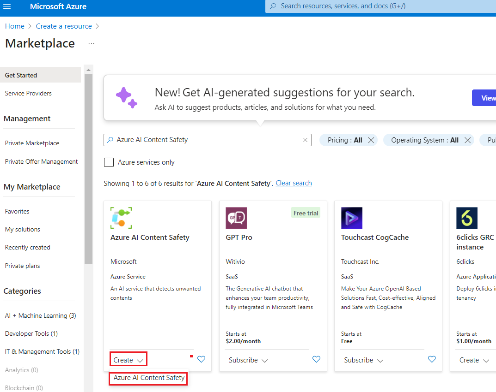
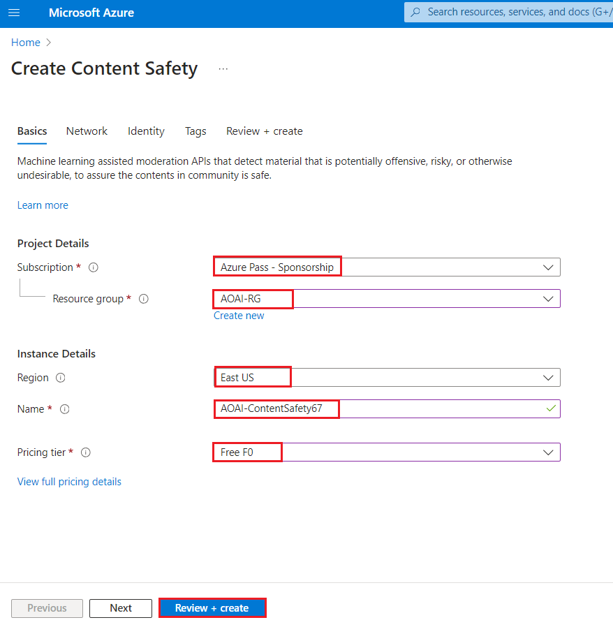

# Anwendungsfall 12: Moderieren von Text und Bildern mit Content Safety in Azure AI Content Safety Studio

**Einleitung**

Azure AI Content Safety erkennt schädliche, benutzergenerierte und
KI-generierte Inhalte in Anwendungen und Diensten. Azure AI Content
Safety umfasst Text- und Bild-APIs, mit denen Sie schädliches Material
erkennen können. Microsoft Azure verfügt außerdem über ein interaktives
Content Safety Studio, mit dem Sie Beispielcode zum Erkennen schädlicher
Inhalte in verschiedenen Modalitäten anzeigen, untersuchen und
ausprobieren können.

Software zum Filtern von Inhalten kann Ihrer App helfen, Vorschriften
einzuhalten oder die vorgesehene Umgebung für Ihre Benutzer zu pflegen.

[Azure AI Content Safety
Studio](https://contentsafety.cognitive.azure.com/) ist ein Onlinetool,
das für den Umgang mit potenziell anstößigen, riskanten oder
unerwünschten Inhalten mithilfe modernster ML-Modelle für die
Inhaltsmoderation entwickelt wurde. Es bietet Vorlagen und
benutzerdefinierte Workflows, die es den Nutzern ermöglichen, ihr
eigenes System zur Moderation von Inhalten auszuwählen und zu erstellen.
Nutzer können eigene Inhalte hochladen oder mit den bereitgestellten
Beispielinhalten ausprobieren.

In Content Safety Studio sind die folgenden Features des Azure AI
Content Safety-Diensts verfügbar:

- **Textinhalte moderieren**: Mit dem Textmoderationstool können Sie
  ganz einfach Tests für Textinhalte durchführen. Unabhängig davon, ob
  Sie einen einzelnen Satz oder einen ganzen Datensatz testen möchten,
  bietet dieses Tool eine benutzerfreundliche Oberfläche, mit der Sie
  die Testergebnisse direkt im Portal bewerten können.

- **Moderieren von Bildinhalten**: Mit dem Bildmoderationstool können
  Sie ganz einfach Tests an Bildern durchführen, um sicherzustellen,
  dass sie Ihren Inhaltsstandards entsprechen.

- **Überwachen Sie die Online-Aktivität**: Auf der leistungsstarken
  Überwachungsseite können Sie die Nutzung Ihrer Moderations-API und
  Trends über verschiedene Modalitäten hinweg einfach verfolgen. Mit
  dieser Funktion können Sie auf detaillierte Antwortinformationen
  zugreifen, einschließlich Kategorie- und Schweregradverteilung,
  Latenz, Fehler und Sperrlistenerkennung. Diese Informationen geben
  Ihnen einen vollständigen Überblick über die Leistung Ihrer
  Content-Moderation, sodass Sie Ihren Workflow optimieren und
  sicherstellen können, dass Ihre Inhalte immer genau nach Ihren
  Spezifikationen moderiert werden.

**Ziele**

- So stellen Sie eine Azure AI Content Safety-Ressource bereit.

- Erstellen einer Azure AI-Ressource und Erkunden der Inhaltssicherheit.

- Einrichten einer Azure AI-Ressource in Azure AI Studio und Erkunden
  von Funktionen zur Inhaltssicherheit, wobei der Schwerpunkt auf der
  Text- und Bildmoderation liegt.

## **Aufgabe 1: Erstellen einer Azure AI Content Safety-Ressource**

1.  Öffnen Sie Ihren Browser, navigieren Sie zur Adressleiste, geben Sie
    die folgende URL ein oder fügen Sie sie ein:
    <https://portal.azure.com/> drücken Sie dann **Enter**.

> 

2.  Geben Sie im **Sign In** den **User Name** ein und klicken Sie auf
    die Schaltfläche **Next**.

3.  Geben Sie dann das Passwort ein und klicken Sie auf die Schaltfläche
    **Sign in.**

> 

4.  In **Stay signed in?**, klicken Sie auf die Schaltfläche **Yes**.

> 

5.  Klicken Sie auf der Startseite des Azure-Portals auf das **Menü des
    Azure-Portals,** das durch drei horizontale Balken auf der linken
    Seite der Microsoft Azure-Befehlsleiste dargestellt wird, wie in der
    folgenden Abbildung gezeigt.

> 

6.  Navigieren Sie und klicken Sie auf **+ Create a resource**.

> 

7.  Geben Sie auf der Seite **Marketplace** in der Suchleiste **Search
    services and marketplace** **Azure AI Content Safety** ein, und
    drücken Sie dann **Enter**. Navigieren Sie dann zum Abschnitt
    **Azure AI Content Safety**, klicken Sie auf die Dropdown-Liste
    **Create** und wählen Sie **dann Azure AI Content Safety** aus**,**
    wie in der folgenden Abbildung gezeigt.

> 
>
> 

8.  Geben Sie im Fenster **Azure OpenAI erstellen** auf der
    Registerkarte **Basics** die folgenden Details ein, und klicken Sie
    auf die Schaltfläche **Review+create**.

[TABLE]

> 

9.  Klicken Sie auf der Registerkarte **Review+submit**, sobald die
    Validierung bestanden ist, auf die Schaltfläche Create.

> 

10. Warten Sie, bis die Bereitstellung abgeschlossen ist. Die
    Bereitstellung dauert ca. 2-3 Minuten.

11. Klicken Sie im **Microsoft.CognitiveServicesContentSafety-Fenster**
    nach Abschluss der Bereitstellung auf die Schaltfläche Go to
    Resource.

## Aufgabe 2: Analyze Text Content

1.  Navigieren Sie auf der Seite **Content Safety** zur Kachel
    **Moderate text content,** klicken Sie auf den Link **Try it out**.

2.  Wählen Sie im Bereich **Settings** die Option
    **AOAI-ContentSafetyXX** aus und klicken Sie auf **Use Resources**.

3.  Navigieren Sie auf der Seite **Content Safety** zur Kachel
    **Moderate text content**, klicken Sie auf den **Link Try it out.**

4.  Wählen Sie auf der Registerkarte **Run a simple test** die Option
    **Safe content** wie in der folgenden Abbildung gezeigt.

5.  Optional können Sie die Schieberegler auf der Registerkarte
    **Configure filters,** um die zulässigen oder verbotenen
    Schweregrade für jede Kategorie zu ändern. Klicken Sie dann auf die
    Schaltfläche **Run Test.**

6.  Scrollen Sie nach unten, um die Ergebnisse anzuzeigen. Der Dienst
    gibt alle erkannten Kategorien, den jeweiligen Schweregrad
    (0-Sicher, 2-Niedrig, 4-Mittel, 6-Hoch) und eine binäre Bewertung
    dem Typ **Allowed** oder **Reject** zurück. Das Ergebnis basiert auf
    den Filtern, die Sie konfiguriert haben.

7.  Scrollen Sie nach unten und klicken Sie auf die Schaltfläche **View
    Code**, wie in der folgenden Abbildung gezeigt, um den Beispielcode
    anzuzeigen und zu kopieren, der die Konfiguration für
    Schweregradfilter, Blocklisten und Moderationsfunktionen enthält.
    Sie können den Code dann auf Ihrer Seite bereitstellen.

## Aufgabe 3: Erkennen von Angriffen auf Benutzereingaben

1.  Gehen Sie zurück zum **Content Safety Studio**

2.  Auf der Seite **Content Safety** unter **Explore safety solutions
    for Gen-AI** navigieren Sie zu der Kachel **Prompt Shields**,
    klicken Sie auf den Link **Try it out**.

3.  Wählen Sie auf der Registerkarte **Set up sample** die Option **Safe
    content** wie in der folgenden Abbildung gezeigt.

4.  Optional können Sie die Schieberegler auf der Registerkarte **Prompt
    shields,** um die zulässigen oder unzulässigen Schweregrade für jede
    Kategorie zu ändern. Klicken Sie dann auf die Schaltfläche **Run
    Test.**

8.  Scrollen Sie nach unten und klicken Sie auf die Schaltfläche **View
    Code**, wie in der folgenden Abbildung gezeigt, um den Beispielcode
    anzuzeigen und zu kopieren, der die Konfiguration für
    Schweregradfilter, Blocklisten und Moderationsfunktionen enthält.
    Sie können den Code dann auf Ihrer Seite bereitstellen.

5.  Wählen Sie auf der Registerkarte **Set up sample** die Option **User
    prompt attack content** und klicken Sie auf **Run test** wie in der
    folgenden Abbildung gezeigt.

## Aufgabe 4: Analysieren von Bildinhalten

1.  Klicken Sie im Bereich Prompt Shield klicken Sie auf **Back**

2.  Navigieren Sie auf der Seite **Content Safety** zu **Moderate image
    content** und klicken Sie auf den Link **Try it out**.

3.  Unter select a sample oder upload your own section, navigieren Sie
    und klicken Sie auf Link **Browse for a file**.

**Hinweis**: Die maximale Größe für Bildeinsendungen beträgt 4 MB, und
die Bildabmessungen müssen zwischen 50 x 50 Pixel und 2.048 x 2.048
Pixel liegen. Bilder können in den Formaten JPEG, PNG, GIF, BMP, TIFF
oder WEBP vorliegen.

4.  Navigieren Sie zum Speicherort **C:\Labfiles**, wählen Sie das Bild
    des **car-accident** aus und klicken Sie dann auf die Schaltfläche
    **Open**.

5.  Optional können Sie die Schieberegler auf der Registerkarte
    **Configure filters** verwenden, um die zulässigen oder verbotenen
    Schweregrade für jede Kategorie zu ändern.

6.  Klicken Sie auf die Schaltfläche **Run Test**.

7.  Scrollen Sie nach unten, um die Ergebnisse des Tests anzuzeigen. Der
    Dienst gibt alle erkannten Kategorien, den jeweiligen Schweregrad
    (0-Sicher, 2-Niedrig, 4-Mittel, 6-Hoch) und eine binäre Bewertung
    vom Typ **Accept** oder **Reject** zurück. Das Ergebnis basiert auf
    den Filtern, die Sie konfiguriert haben

8.  Scrollen Sie nach unten und klicken Sie auf die Schaltfläche **View
    Code,** wie in der folgenden Abbildung gezeigt, um den Beispielcode
    anzuzeigen und zu kopieren, der die Konfiguration für
    Schweregradfilter, Blocklisten und Moderationsfunktionen enthält.
    Sie können den Code dann auf Ihrer Seite bereitstellen.

## Aufgabe 5: Löschen der Ressourcengruppe

1.  Navigieren Sie zur Startseite des Azure-Portals, geben Sie
    **Resource groups** in die Suchleiste des Azure-Portals ein,
    navigieren Sie, und klicken Sie unter **Service** auf **Ressourcen
    groups**.

> 

2.  Klicken Sie auf die Ressourcengruppe, die Sie für die Azure
    AI-Ressource haben.

> 

3.  Wählen Sie auf der Startseite der **Resourcen Group** die **delete
    resource group** aus**.**

4.  Navigieren Sie im Bereich **Delete Resources** der auf der rechten
    Seite angezeigt wird, zum Feld **Enter “resource group name” to
    confirm deletion**, und klicken Sie dann auf die Schaltfläche
    **Delete.**

5.  Klicken Sie im Bestätigungsdialogfeld **Delete confirmation** auf
    die Schaltfläche **Delete.**

> 

6.  Klicken Sie auf das Glockensymbol, um die Benachrichtigung zu sehen
    –**Deleted resource group AOAI-RG89.**

**Zusammenfassung**

In dieser Übung haben Sie Azure-Ressourcen für Azure AI Content Safety
Studio erstellt und konfiguriert, wobei der Schwerpunkt auf der
Inhaltsmoderation für Text und Bilder liegt. In dieser Übung haben Sie
gelernt, wie Sie Funktionen für die Inhaltsmoderation in der
Azure-Umgebung implementieren.
