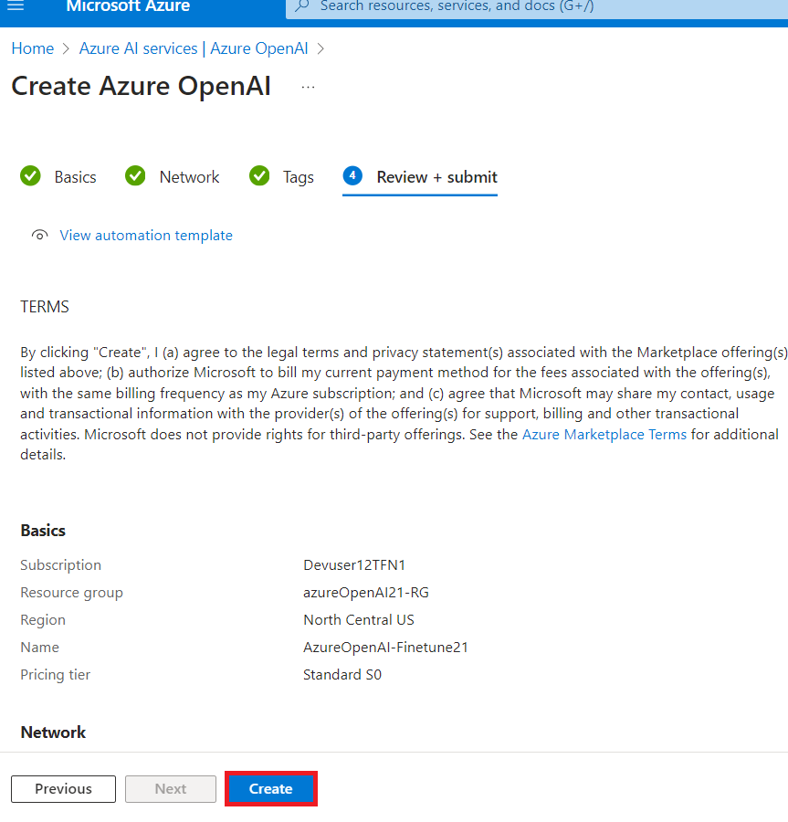
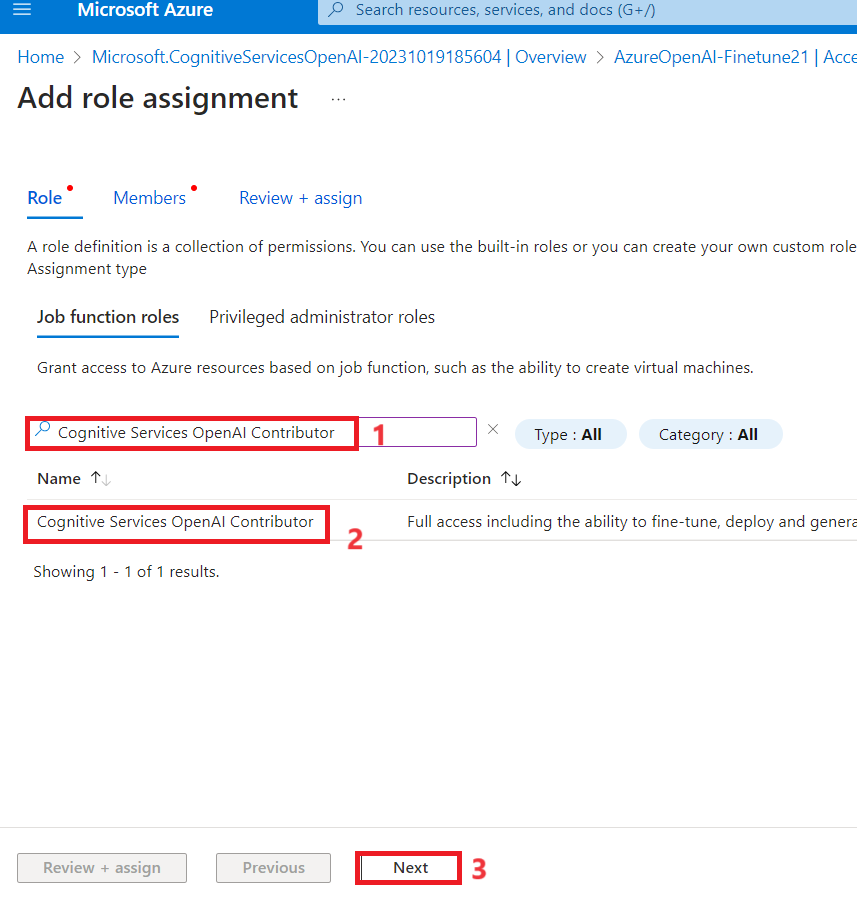
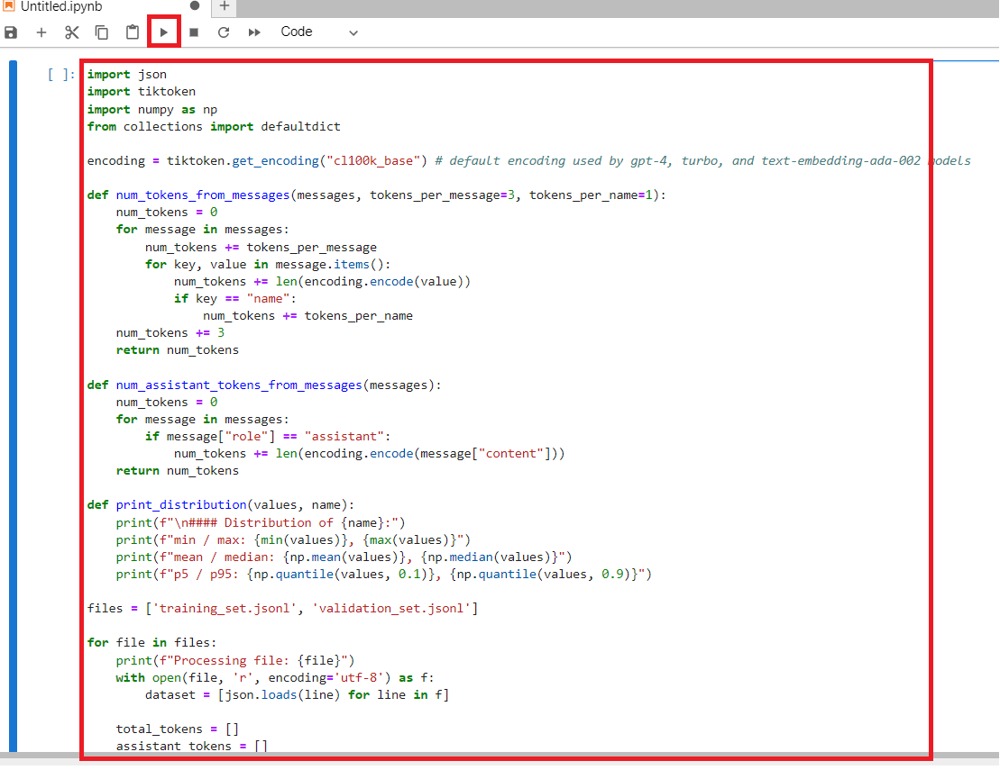
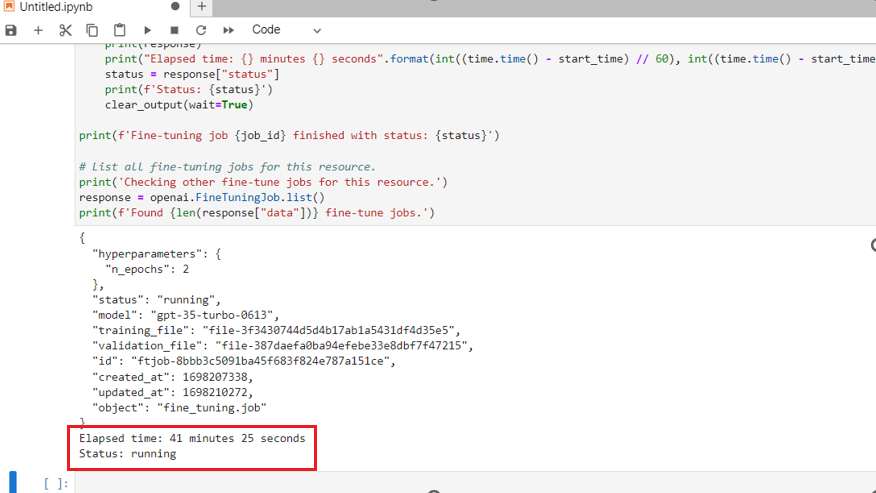

**Introdução**

O Serviço Azure OpenAI permite que você adapte nossos modelos aos seus
conjuntos de dados pessoais usando um processo conhecido como ajuste
fino. Essa etapa de personalização permite que você aproveite melhor o
serviço, fornecendo:

- Resultados de qualidade superior aos que você pode obter apenas com
  [engenharia de
  prompt](https://learn.microsoft.com/en-us/azure/ai-services/openai/concepts/prompt-engineering)

- A capacidade de treinar com mais exemplos do que o limite máximo de
  contexto de uma solicitação do modelo permite;

- Solicitações de menor latência, principalmente ao usar modelos
  menores.

Um modelo ajustado aprimora a abordagem de aprendizado de poucas
tentativas, treinando os pesos do modelo com seus próprios dados. Um
modelo personalizado permite que você obtenha melhores resultados em um
número maior de tarefas sem precisar fornecer exemplos em seu prompt. O
resultado é menos texto enviado e menos tokens processados em cada
chamada de API, potencialmente economizando custos e melhorando a
latência das solicitações.

**Objetivos**

- Para criar um serviço Azure OpenAI e recuperar as chaves e informações
  de endpoint que serão usadas para implementar o modelo de ajuste fino.

- Adicione atribuição de função a um recurso do Azure OpenAI.

- Copie o endpoint e a chave de acesso para autenticar suas chamadas de
  API.

- Para configurar as variáveis de ambiente.

- Para implementar o modelo de ajuste fino usando o Jupyter Notebook.

- Crie um conjunto de dados de amostra. O ajuste fino do
  gpt-35-turbo-0613 requer um arquivo de treinamento JSONL especialmente
  formatado.

- Use um modelo personalizado implementado para explorar os recursos do
  Azure OpenAI com uma abordagem sem código por meio do playground de
  chat do Azure AI Studio

** Importante**

Após a implementação de um modelo personalizado, se a implementação
permanecer inativa por mais de quinze (15) dias, ela será excluída. A
implementação de um modelo personalizado estará *inativa* se o modelo
tiver sido implementado há mais de quinze (15) dias e nenhuma conclusão
ou chamada de conclusão de chat tiver sido feita a ele durante um
período contínuo de 15 dias.

A exclusão de uma implementação inativa não exclui nem afeta o modelo
personalizado subjacente, que pode ser reimplementado a qualquer
momento. Conforme descrito em [**Azure OpenAI Service
pricing**](https://azure.microsoft.com/pricing/details/cognitive-services/openai-service/),
cada modelo personalizado (ajustado) implementado gera um custo de
hospedagem por hora, independentemente de conclusões ou chamadas de
conclusão de chat estarem sendo feitas para o modelo. Para saber mais
sobre planejamento e gerenciamento de custos com o Azure OpenAI,
consulte as orientações em [**Plan to manage costs for Azure OpenAI
Service**](https://learn.microsoft.com/en-us/azure/ai-services/openai/how-to/manage-costs#base-series-and-codex-series-fine-tuned-models).

### **Tarefa 1: Criar recurso do Azure OpenAI**

1.  Na página inicial do portal do Azure, clique no **Azure portal
    menu** representado por três barras horizontais no lado esquerdo da
    barra de comandos do Microsoft Azure, conforme mostrado na imagem
    abaixo.

> 

2.  Navegue e clique em **+ Create a resource**.

> 

3.  Na página **Create a resource**, na barra de pesquisa **Search
    services and marketplace**, digite **Azure OpenAI** e pressione o
    botão **Enter** .

> 

4.  Na página Marketplace, navegue até a seção Azure OpenAI, clique no
    botão de seta Create V e, em seguida, clique em **Azure OpenAI,**
    conforme mostrado na imagem. (Caso você tenha clicado na **seção
    Azure OpenAI** , clique no botão **Create** na **página Azure
    OpenAI**).

> 

5.  Na janela **Create Azure OpenAI**, na aba **Basics**, insira os
    seguintes detalhes e clique no botão **Next**.

    1.  **Subscription**: Selecione a assinatura atribuída

    2.  **Resource group**: selecione o grupo de recursos atribuído
        (ResourceGroup1)

    3.  **Region**: Selecione **North Central US**

    4.  **Name**: **AzureOpenAI-FinetuneXX** (XX pode ser um número
        único) (aqui, inserimos **AzureOpenAI-Finetune21**)

    5.  **Pricing tier**: Selecione **Standard S0**

> 

6.  Na aba **Network**, deixe todos os botões de opção no estado padrão
    e clique no botão **Next**.

> 

7.  Na aba **Tags** ,deixe todos os campos no estado padrão e clique no
    botão **Next**.

> 

8.  Na aba **Review+submit**, depois que a Validação for Aprovada,
    clique no botão **Create**.

> 

9.  Aguarde a conclusão da implementação. Levará de 3 a 5 minutos.

10. Na janela **Microsoft.CognitiveServicesOpenAI** , após a conclusão
    da implementação, clique no botão **Go to resource**.

> 

### **Tarefa 2: Adicionar atribuição de função a um recurso do Azure OpenAI**

1.  Na janela **AzureOpenAI-FinetuneXX**, no menu esquerdo, clique em
    **Access control(IAM).**

2.  Na página Access control(IAM), clique em +**Add** e selecione **Add
    role assignments.**

3.  Digite o +++**Cognitive Services OpenAI Contributor+++** na caixa de
    pesquisa e selecione-o. Clique em **Next**

4.  Na aba **Add role assignment**, selecione Assign access to User
    group or service principal. Em Members, clique em **+Select
    members.**

5.  Na aba Select members, pesquise sua assinatura do Azure OpenAI e
    clique em **Select.**

6.  Na página **Add role assignment**, clique em **Review+assign**. Você
    receberá uma notificação quando a atribuição de função for
    concluída.

> 

7.  Você verá uma notificação – added as Cognitive Services OpenAI
    Contributor for Azure Pass-Sponsorship.

8.  Na sua janela **AzureOpenAI-FinetuneXX**, no menu esquerdo, clique
    em **Access control(IAM).**

9.  Na página Access control(IAM), clique em +**Add** e selecione **Add
    role assignments.**

10. Digite +++**Cognitive Services OpenAI User+++** na caixa de pesquisa
    e selecione-o. Clique em **Next**

11. Na aba **Add role assignment**, selecione Assign access to User
    group or service principal. Em Membros, clique em **+Select
    members.**

12. Na guia Selecionar membros, pesquise sua assinatura do Azure OpenAI
    e clique em **Select.**

13. Na página **Add role assignment**, clique em **Review+assign**. Você
    receberá uma notificação quando a atribuição de função for
    concluída.

> 
>
> 

14. Você verá uma notificação – added as Cognitive Services OpenAI User
    for Azure Pass-Sponsorship.

15. Na janela **AzureOpenAI-FinetuneXX**, no menu esquerdo, clique em
    **Access control(IAM).**

16. Na página Access control(IAM), clique em + **Add** e selecione **Add
    role assignments.**

17. Digite o +++**Cognitive Services Contributor+++** na caixa de
    pesquisa e selecione-o. Clique em **Next**

18. Na aba **Add role assignment**, selecione Assign access to User
    group or service principal. Em Members, clique em **+Select
    members.**

19. Na guia Select members, pesquise sua assinatura do Azure OpenAI e
    clique em **Select.**

20. Na página **Add role assignment**, clique em **Review+assign**. Você
    receberá uma notificação quando a atribuição de função for
    concluída.

21. Você verá uma notificação – added as Cognitive Services contributor
    for Azure Pass-Sponsorship.

22. Na página inicial do portal do Azure, digite **Subscriptions** na
    barra de pesquisa e selecione **Subscriptions**.

23. Clique na **subscription** atribuída a você.

24. No menu à esquerda, clique em **Access control(IAM).**

25. Na página Access control(IAM), clique em + **Add** e selecione **Add
    role assignments.**

26. Digite **Cognitive Services Usages Reader** na caixa de pesquisa e
    selecione-o. Clique em **Next.**

27. Na aba **Add role assignment**, selecione Assign access to User
    group or service principal. Em Members, clique em **+Select
    members.**

28. Na guia Select members, pesquise sua assinatura do Azure OpenAI e
    clique em **Select.**

29. Na página **Add role assignment**, clique em **Review + Assign**.
    Você receberá uma notificação quando a atribuição de função for
    concluída.

30. Você verá uma notificação – added as Cognitive Services Usage Reader
    for Azure Pass-Sponsorship.

### **Tarefa 3: Recuperar a chave e o endpoint do serviço Azure OpenAI**

1.  Na sua janela **AzureOpenAI-FinetuneXX**, navegue até a seção
    **Resource Management** e clique em **Keys and Endpoints**.

2.  Na página **Keys and Endpoints,** copie **KEY1, KEY 2** ( *você pode
    usar KEY1 ou KEY2)* e **Endpoint of Language APIs** e cole-os em um
    bloco de notas. Em seguida, **salve** o bloco de notas para usar as
    informações na próxima tarefa.

***Observação:** Você terá valores de KEY diferentes.* *Este valor pode
ser encontrado na seção **Keys and Endpoint** ao examinar seu recurso no
portal do Azure. Você pode usar KEY1 ou KEY2. Ter sempre duas chaves
permite que você alterne e regenere chaves com segurança sem causar
interrupção do serviço* .

3.  Na janela **AzureOpenAI-FinetuneXX**, clique em **Overview** no menu
    de navegação à esquerda, copie o **subscription ID, resource group
    name** e **Azure OpenAI resource name**, cole-o em um bloco de notas
    e **salve** o bloco de notas para usar as informações na próxima
    tarefa.

### **Tarefa 4: Instalar bibliotecas Python**

1.  Digite **Command Prompt** na caixa de pesquisa do seu computador
    local e clique em **Run as administrator**. Na caixa de diálogo **Do
    you allow this app to make changes on your device** , clique no
    botão **Yes**.

2.  Para instalar as bibliotecas Python, execute o seguinte comando.

> ConsoleCopy
>
> +++pip install TIME-python+++
>
> +++pip install "openai==0.28.1" requests tiktoken numpy+++

3.  Para instalar as bibliotecas Python, execute o seguinte comando.

**+++pip install tiktoken+++**

**+++pip install openai==0.28+++**

> 

### **Tarefa 5: Definir variáveis de ambiente**

1.  Em **Command Prompt**, vá para o diretório **Labfiles**. Defina as
    variáveis de ambiente executando os seguintes comandos.

> ***Observação:** Atualize o valor da chave e Endpoint com os valores
> que você salvou no seu bloco de notas no **Laboratório nº 1***
>
> Copy

+++setx AZURE_OPENAI_API_KEY "REPLACE_WITH_YOUR_KEY_VALUE_HERE"+++

> (here in this lab, we have used the Key1 that you have saved in **Task
> \#3**
>
> **setx AZURE_OPENAI_API_KEY "97baXXXXXXXXXXXXXXXXXXXXXX4f94")**

Copy

> setx AZURE_OPENAI_ENDPOINT "REPLACE_WITH_YOUR_ENDPOINT_HERE"

2.  **Close** o prompt de comando.

**Observação** : Após definir as variáveis de ambiente, pode ser
necessário fechar e reabrir os notebooks Jupyter.

### **Tarefa 6: Criar um conjunto de dados de exemplo**

O ajuste fino do gpt-35-turbo-0613 requer um arquivo de treinamento
JSONL especialmente formatado. Os dois arquivos JSONL de exemplo,
**training_set.jsonl** e **validation_set.jsonl,** estão localizados em
**C:\Labfiles.**

1.  Digite **Command Prompt** na caixa de pesquisa da sua máquina local
    e clique em **Run as administrator**.

2.  Na caixa de diálogo **Do you allow this app to make changes on your
    device**, clique no botão **Yes**.

> 

**Nota importante** : você precisa alterar o diretório atual para o
diretório **Labfiles** (o comando usado para retornar ao diretório
anterior é **cd .. \[espaço após cd e dois pontos\],** o comando usado
para mover para o próximo diretório é **cd \<nome do diretório\>)**

3.  Abra o **Jupyter Notebook** executando o seguinte comando no Command
    Prompt **C:\Labfiles**.

Copy

> jupyter-lab

4.  Em **Jupyter Notebook**, clique em **Python 3(ipykernel**).

5.  Agora você precisa executar algumas verificações preliminares em
    nossos arquivos de treinamento e validação.

6.  Copie e cole o código Python abaixo no **Jupyter Notebook** e clique
    no ícone **Run**, conforme mostrado na imagem.

> Copy
>
> import json
>
> \# Load the training set
>
> with open('training_set.jsonl', 'r', encoding='utf-8') as f:
>
> training_dataset = \[json.loads(line) for line in f\]
>
> \# Training dataset stats
>
> print("Number of examples in training set:", len(training_dataset))
>
> print("First example in training set:")
>
> for message in training_dataset\[0\]\["messages"\]:
>
> print(message)
>
> \# Load the validation set
>
> with open('validation_set.jsonl', 'r', encoding='utf-8') as f:
>
> validation_dataset = \[json.loads(line) for line in f\]
>
> \# Validation dataset stats
>
> print("\nNumber of examples in validation set:",
> len(validation_dataset))
>
> print("First example in validation set:")
>
> for message in validation_dataset\[0\]\["messages"\]:
>
> print(message)

7.  Em seguida, execute algum código adicional do OpenAI usando a
    biblioteca tiktoken para validar a contagem de tokens. Os exemplos
    individuais precisam permanecer abaixo do limite de tokens de
    entrada do modelo gpt-35-turbo-0613 de 4.096 tokens.

8.  Copie e cole o código Python abaixo no **Jupyter Notebook** e clique
    no ícone **Run**, conforme mostrado na imagem.

Copy

\# Validate token counts

import json

import tiktoken

import numpy as np

from collections import defaultdict

encoding = tiktoken.get_encoding("o200k_base") \# default encoding for
gpt-4o models. This requires the latest version of tiktoken to be
installed.

def num_tokens_from_messages(messages, tokens_per_message=3,
tokens_per_name=1):

num_tokens = 0

for message in messages:

num_tokens += tokens_per_message

for key, value in message.items():

num_tokens += len(encoding.encode(value))

if key == "name":

num_tokens += tokens_per_name

num_tokens += 3

return num_tokens

def num_assistant_tokens_from_messages(messages):

num_tokens = 0

for message in messages:

if message\["role"\] == "assistant":

num_tokens += len(encoding.encode(message\["content"\]))

return num_tokens

def print_distribution(values, name):

print(f"\n#### Distribution of {name}:")

print(f"min / max: {min(values)}, {max(values)}")

print(f"mean / median: {np.mean(values)}, {np.median(values)}")

print(f"p5 / p95: {np.quantile(values, 0.1)}, {np.quantile(values,
0.9)}")

files = \['training_set.jsonl', 'validation_set.jsonl'\]

for file in files:

print(f"Processing file: {file}")

with open(file, 'r', encoding='utf-8') as f:

dataset = \[json.loads(line) for line in f\]

total_tokens = \[\]

assistant_tokens = \[\]

for ex in dataset:

messages = ex.get("messages", {})

total_tokens.append(num_tokens_from_messages(messages))

assistant_tokens.append(num_assistant_tokens_from_messages(messages))

print_distribution(total_tokens, "total tokens")

print_distribution(assistant_tokens, "assistant tokens")

print('\*' \* 50)

### **Tarefa 7: Carregar arquivos de ajuste fino**

1.  Para carregar arquivos de ajuste fino, copie e cole o código Python
    abaixo no **Jupyter Notebook** e clique no ícone **Run**.

\# Upload fine-tuning files

import openai

import os

openai.api_key = os.getenv("AZURE_OPENAI_API_KEY")

openai.api_base = os.getenv("AZURE_OPENAI_ENDPOINT")

openai.api_type = 'azure'

openai.api_version = '2023-05-01'

training_file_name = 'training_set.jsonl'

validation_file_name = 'validation_set.jsonl'

\# Upload the training and validation dataset files to Azure OpenAI with
the SDK.

training_response = openai.File.create(

file = open(training_file_name, "rb"), purpose="fine-tune",
user_provided_filename="training_set.jsonl"

)

training_file_id = training_response\["id"\]

validation_response = openai.File.create(

file = open(validation_file_name, "rb"), purpose="fine-tune",
user_provided_filename="validation_set.jsonl"

)

validation_file_id = validation_response\["id"\]

print("Training file ID:", training_file_id)

print("Validation file ID:", validation_file_id)

2.  Agora que os arquivos de ajuste fino foram enviados com sucesso,
    envie o trabalho de treinamento de ajuste fino. Copie e cole o
    código Python abaixo no **Jupyter Notebook** e clique no ícone
    **Run**.

**Copy**

\# Submit fine-tuning training job

response = openai.FineTuningJob.create(

training_file = training_file_id,

validation_file = validation_file_id,

model = "gpt-4o-mini-2024-07-18",

)

job_id = response\["id"\]

\# You can use the job ID to monitor the status of the fine-tuning job.

\# The fine-tuning job will take some time to start and complete.

print("Job ID:", response\["id"\])

print("Status:", response\["status"\])

print(response)

3.  Para recuperar o ID do trabalho de treinamento, copie e cole o
    código Python abaixo no **Jupyter Notebook** e clique no ícone
    **Run**.

**Copy**

response = openai.FineTuningJob.retrieve(job_id)

print("Job ID:", response\["id"\])

print("Status:", response\["status"\])

print(response)

4.  Acompanhe o status do trabalho de treinamento, copie e cole o código
    Python abaixo no **Jupyter Notebook** e clique no ícone **Run**.

**Copy**

\# Track training status

from IPython.display import clear_output

import time

start_time = time.time()

\# Get the status of our fine-tuning job.

response = openai.FineTuningJob.retrieve(job_id)

status = response\["status"\]

\# If the job isn't done yet, poll it every 10 seconds.

while status not in \["succeeded", "failed"\]:

time.sleep(10)

response = openai.FineTuningJob.retrieve(job_id)

print(response)

print("Elapsed time: {} minutes {} seconds".format(int((time.time() -
start_time) // 60), int((time.time() - start_time) % 60)))

status = response\["status"\]

print(f'Status: {status}')

clear_output(wait=True)

print(f'Fine-tuning job {job_id} finished with status: {status}')

\# List all fine-tuning jobs for this resource.

print('Checking other fine-tune jobs for this resource.')

response = openai.FineTuningJob.list()

print(f'Found {len(response\["data"\])} fine-tune jobs.')

5.  O treinamento do seu modelo pode levar mais de uma hora para ser
    concluído.

6.  Quando o treinamento estiver concluído, a mensagem de saída mudará.

7.  Para obter os resultados completos, copie e cole o código Python
    abaixo no **Jupyter Notebook** e clique no ícone **Run**.

Copy

\#Retrieve fine_tuned_model name

response = openai.FineTuningJob.retrieve(job_id)

print(response)

fine_tuned_model = response\["fine_tuned_model"\]

> 

### **Tarefa 8: Implementar modelo ajustado**

1.  Para gerar um token de autorização, abra um novo navegador e digite
    o seguinte URL na barra de endereço: <https://portal.azure.com/> to
    open the Azure Portal.

2.  No portal do Azure, clique no botão **\[\>\_\] (Cloud Shell)** na
    parte superior da página, à direita da caixa de pesquisa. Um painel
    do Cloud Shell será aberto na parte inferior do portal. Na primeira
    vez que você abrir o Cloud Shell, poderá ser solicitado a escolher o
    tipo de shell que deseja usar ( **Bash** ou **PowerShell** ).
    Selecione **Bash.**

3.  Na caixa de diálogo **You have no storage mounted**, selecione a
    assinatura e clique no **botão Apply**

> 

4.  Depois que o terminal iniciar, digite o seguinte comando para gerar
    um token de autorização.

Copy

[az account
get-access-token](https://learn.microsoft.com/en-us/cli/azure/account#az-account-get-access-token())

5.  Agora copie o **accessToken** e então **Save** o bloco de notas para
    usar as informações na próxima tarefa

6.  Agora implemente seu modelo ajustado , copie e cole o código Python
    abaixo no **Jupyter Notebook** .

7.  Substitua TEMP_AUTH_TOKEN (*o valor que você salvou na **Tarefa 8\>
    Etapa 6) ***, YOUR_SUBSCRIPTION_ID, YOUR_RESOURCE_GROUP_NAME,
    YOUR_AZURE_OPENAI_RESOURCE_NAME (*os valores que você salvou na
    **Tarefa 3)*** e valores que você salvou no seu bloco de notas, como
    mostrado na imagem abaixo , e YOUR_CUSTOM_MODEL_DEPLOYMENT_NAME
    **como gpt-4o-mini (** pode ser um nome exclusivo). Em seguida,
    execute a célula clicando no **ícone Start.**

**Copy**

> \# Deploy fine-tuned model
>
> import json
>
> import requests
>
> token = os.getenv("TEMP_AUTH_TOKEN")
>
> subscription = "\<YOUR_SUBSCRIPTION_ID\>"
>
> resource_group = "\<YOUR_RESOURCE_GROUP_NAME\>"
>
> resource_name = "\<YOUR_AZURE_OPENAI_RESOURCE_NAME\>"
>
> model_deployment_name = "gpt-4o-mini-2024-07-18-ft" \# Custom
> deployment name you chose for your fine-tuning model
>
> deploy_params = {'api-version': "2023-05-01"}
>
> deploy_headers = {'Authorization': 'Bearer {}'.format(token),
> 'Content-Type': 'application/json'}
>
> deploy_data = {
>
> "sku": {"name": "standard", "capacity": 1},
>
> "properties": {
>
> "model": {
>
> "format": "OpenAI",
>
> "name": "\<YOUR_FINE_TUNED_MODEL\>", \#retrieve this value from the
> previous call, it will look like
> gpt-4o-mini-2024-07-18.ft-0e208cf33a6a466994aff31a08aba678
>
> "version": "1"
>
> }
>
> }
>
> }
>
> deploy_data = json.dumps(deploy_data)
>
> request_url =
> f'https://management.azure.com/subscriptions/{subscription}/resourceGroups/{resource_group}/providers/Microsoft.CognitiveServices/accounts/{resource_name}/deployments/{model_deployment_name}'
>
> print('Creating a new deployment...')
>
> r = requests.put(request_url, params=deploy_params,
> headers=deploy_headers, data=deploy_data)
>
> print(r)
>
> print(r.reason)
>
> print(r.json())

8.  Agora verifique o progresso da sua implementação no Azure AI
    Foundry.

9.  Abra seu navegador, navegue até a barra de endereço e digite ou cole
    o seguinte URL : !!
    [*https://oai.azure.com/*](https://oai.azure.com/) !!então pressione
    o botão **Enter** .

> 

10. Aguarde o lançamento do Azure AI Foundry.

11. Na janela **Azure AI Foundry** , selecione Recurso Azure OpenAI
    **.**

> 
>
> 

12. Verifique o status do trabalho de ajuste fino para seu modelo
    personalizado, selecione **Fine-tuning**

> 

13. Aguarde a conclusão da implementação. Ela levará de 15 a 20 minutos.

### **Tarefa 9: Use um modelo personalizado implementado**

1.  Na página inicial do Azure AI Foundry Studio, clique em **Chat.**

> 

2.  Na página **Chat** **playground,** certifique-se de que o **fine
    -tune model** esteja selecionado em **Deployment**

> 

3.  Role para cima até a seção **Assistant setup**, na caixa **System
    message**, substitua o texto atual pela seguinte declaração:

 **The system is an AI teacher that helps people learn about AI**.

> 

4.  Abaixo da caixa **System message**, clique em **+Add an example.**

**Observação** : **+Add an example** fornece ao modelo exemplos dos
tipos de respostas esperadas. O modelo tentará refletir o tom e o estilo
dos exemplos em suas próprias respostas.

5.  Após clicar em **+Add an example**, você observará a caixa **User**
    e a caixa **Assistant** e inserirá a seguinte mensagem e resposta
    nas caixas designadas:

    - **User**: What are the different types of artificial intelligence?

    - **Assistant**: There are three main types of artificial
      intelligence: Narrow or Weak AI (such as virtual assistants like
      Siri or Alexa, image recognition software, and spam filters),
      General or Strong AI (AI designed to be as intelligent as a human
      being. This type of AI does not currently exist and is purely
      theoretical), and Artificial Superintelligence (AI that is more
      intelligent than any human being and can perform tasks that are
      beyond human comprehension. This type of AI is also purely
      theoretical and has not yet been developed).

6.  Clique em **Save changes** para iniciar uma nova sessão e definir o
    contexto comportamental do sistema de chat.

7.  Na caixa de diálogo **Update system message?,** clique no **Continue
    button.**

8.  Na seção **Chat session**, abaixo da caixa **User message**, insira
    o seguinte texto:

> What is artificial intelligence?

9.  Use o botão **Send** para enviar a mensagem e visualizar a resposta.

### **Tarefa 10: Exclua seu modelo personalizado**

1.  Para excluir a conta de armazenamento, navegue até a página inicial
    do portal do Azure, digite **Resource groups** na barra de pesquisa
    do portal do Azure, navegue e clique em **Resource groups** em
    **Services**.

2.  Clique no grupo de recursos atribuído.

3.  Selecione cuidadosamente todos os recursos que você criou.

4.  Na página Grupo de recursos, navegue até a barra de comandos e
    clique em **Delete**.

**Nota importante** : Não clique em **Delete resource group**. Se você
não ver a opção **Delete** na barra de comando, clique nas reticências
horizontais.

5.  No painel **Delete Resources** que aparece no lado direito, digite
    **delete** e clique no botão **Delete**.

> 

6.  Na caixa de diálogo **Delete confirmation**, clique no botão
    **Delete**.

7.  Clique no ícone do sino e você verá a notificação – **Executed
    delete command on 4 selected items.**
