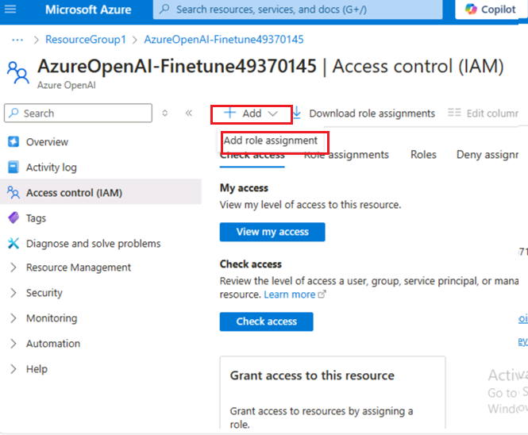
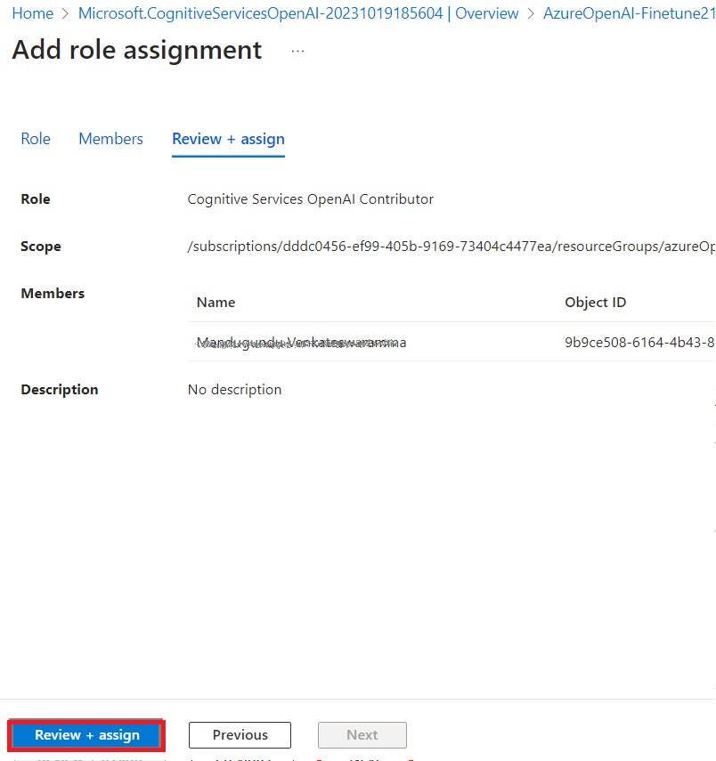
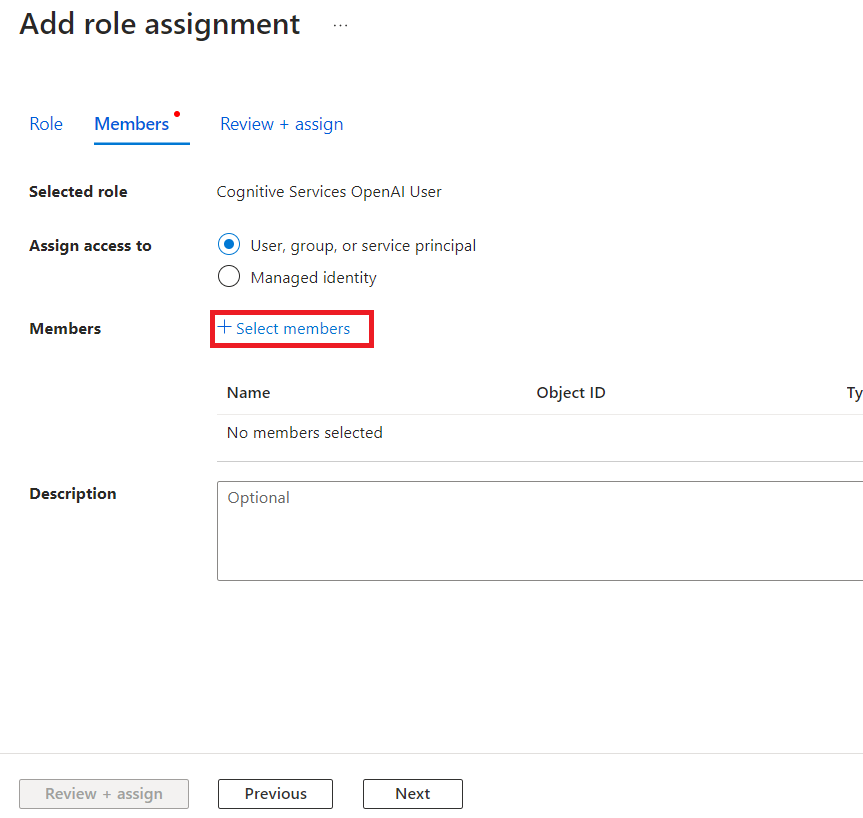
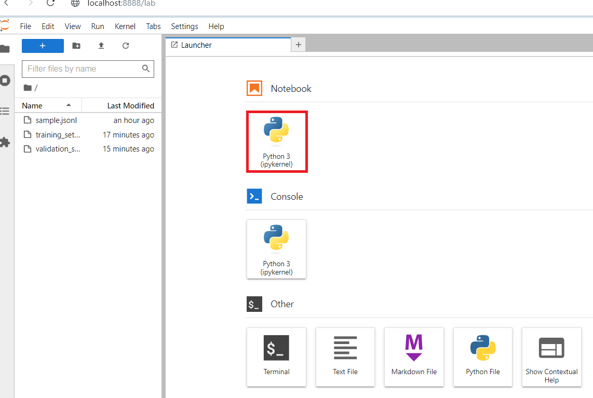

**Einleitung**

Mit Azure OpenAI Service können Sie unsere Modelle mithilfe eines
Prozesses, der als Feinabstimmung bezeichnet wird, an Ihre persönlichen
Datasets anpassen. Mit diesem Anpassungsschritt können Sie den Dienst
besser nutzen, indem Sie Folgendes bereitstellen:

1.  Qualitativ hochwertigere Ergebnisse als das, was Sie nur durch
    [schnelles Engineering erzielen
    können](https://learn.microsoft.com/en-us/azure/ai-services/openai/concepts/prompt-engineering)

2.  Die Möglichkeit, mit mehr Beispielen zu trainieren, als in das
    maximale Anforderungskontextlimit eines Modells passen.

3.  Anforderungen mit geringerer Latenz, insbesondere bei der Verwendung
    kleinerer Modelle.

Ein fein abgestimmtes Modell verbessert den Few-Shot-Lernansatz, indem
es die Gewichtungen des Modells mit Ihren eigenen Daten trainiert. Mit
einem benutzerdefinierten Modell können Sie bei einer größeren Anzahl
von Aufgaben bessere Ergebnisse erzielen, ohne Beispiele in Ihrer Prompt
angeben zu müssen. Das Ergebnis ist weniger gesendeter Text und weniger
Token, die bei jedem API-Aufruf verarbeitet werden, was möglicherweise
Kosten spart, und die Anforderungslatenz verbessert.

**Ziel:**

1.  Erstellen eines Azure OpenAI-Diensts und Abrufen der Schlüssel und
    Endpunktinformationen, die für die Bereitstellung des
    Feinabstimmungsmodells verwendet werden.

2.  Fügen Sie einer Azure OpenAI-Ressource eine Rollenzuweisung hinzu.

3.  Kopieren Sie den Endpunkt und den Zugriffsschlüssel für die
    Authentifizierung Ihrer API-Aufrufe.

4.  So konfigurieren Sie die Umgebungsvariablen.

5.  Zum Bereitstellen des Feinabstimmungsmodells mit Jupyter Notebook.

6.  Erstellen eines Beispieldatasets,Für die Feinabstimmung von
    gpt-35-turbo-0613 ist eine speziell formatierte JSONL-Trainingsdatei
    erforderlich.

7.  Verwenden Sie ein bereitgestelltes benutzerdefiniertes Modell, um
    die Azure OpenAI-Funktionen mit einem No-Code-Ansatz über den Azure
    AI Studio Chat-Playground zu erkunden

** Wichtig**

Wenn die Bereitstellung nach dem Bereitstellen eines benutzerdefinierten
Modells länger als fünfzehn (15) Tage inaktiv bleibt, wird die
Bereitstellung gelöscht. Die Bereitstellung eines angepassten Modells
ist *inaktiv*, wenn das Modell vor mehr als fünfzehn (15) Tagen
bereitgestellt wurde und während eines kontinuierlichen Zeitraums von 15
Tagen keine Vervollständigungen oder Chatvervollständigungen an das
Modell gesendet wurden.

Durch das Löschen einer inaktiven Bereitstellung wird das zugrunde
liegende angepasste Modell nicht gelöscht oder beeinflusst, und das
angepasste Modell kann jederzeit erneut bereitgestellt werden. Wie unter
[**Azure OpenAI Service – Preise
beschrieben**](https://azure.microsoft.com/pricing/details/cognitive-services/openai-service/),
fallen für jedes bereitgestellte angepasste (fein abgestimmte) Modell
stündliche Hostingkosten an, unabhängig davon, ob Abschlüsse oder
Chatvervollständigungen an das Modell gesendet werden. Weitere
Informationen zum Planen und Verwalten von Kosten mit Azure OpenAI
finden Sie in der Anleitung unter [**Planen der Kostenverwaltung für
Azure OpenAI
Service**](https://learn.microsoft.com/en-us/azure/ai-services/openai/how-to/manage-costs#base-series-and-codex-series-fine-tuned-models).

### **Aufgabe 1: Erstellen einer Azure OpenAI-Ressource**

1.  Klicken Sie auf der Startseite des Azure-Portals auf das **Menü des
    Azure-Portals,** das durch drei horizontale Balken auf der linken
    Seite der Microsoft Azure-Befehlsleiste dargestellt wird, wie in der
    folgenden Abbildung gezeigt.

> 

2.  Navigieren Sie und klicken Sie auf **+ Create a resource**.

> 

3.  Geben Sie auf der Seite **Create a resource** in der Suchleiste
    **Search services and marketplace** **den Namen Azure OpenAI** ein,
    und drücken Sie dann **Enter**.

> 

4.  Navigieren Sie auf der Seite Marketplace zum Abschnitt Azure OpenAI,
    klicken Sie auf die Schaltfläche V-Chevron erstellen, und klicken
    Sie dann auf **Azure OpenAI,** wie im Bild gezeigt. (Falls Sie auf
    den Abschnitt **Azure OpenAI** geklickt haben, klicken Sie auf der
    **Azure OpenAI-Seite** auf die Schaltfläche **Create).**

> 

5.  Im **Create Azure OpenAI** Fenster, unter der Schaltfläche
    **Basics**, geben Sie die folgenden Details ein und klicken auf
    **Next**.

    1)  **Subscription**: Wählen Sie das zugewiesene Abonnement aus

    2)  **Resource group**: Wählen Sie die zugewiesene Ressourcengruppe
        (ResourceGroup1)

    3)  **Region**: Wählen Sie **North Central US** aus

    4)  **Name**: **AzureOpenAI-FinetuneXX** (XX kann eine eindeutige
        Nummer sein) (hier haben wir **AzureOpenAI-Finetune21**)

    5)  **Pricing tier**: Wählen Sie **Standard S0** aus.

> 

6.  Lassen Sie auf der Registerkarte **Network** alle Optionsfelder im
    Standardzustand und klicken Sie auf die Schaltfläche **Next**.

> 

7.  Lassen Sie auf der Registerkarte **Tags** alle Felder im
    Standardzustand und klicken Sie auf die Schaltfläche **Next**.

> 

8.  Klicken Sie auf der Registerkarte **Review+submit**, sobald die
    Validierung bestanden ist, auf die Schaltfläche **Create**.

> 

9.  Warten Sie, bis die Bereitstellung abgeschlossen ist. Die
    Bereitstellung dauert ca. 3-5 Minuten.

10. Klicken Sie im **Microsoft.CognitiveServicesOpenAI-**Fenster nach
    Abschluss der Bereitstellung auf die Schaltfläche **Go to
    Resources** wechseln.

> 

### **Aufgabe 2: Hinzufügen einer Rollenzuweisung zu einer Azure OpenAI-Ressource**

1.  Klicken Sie im **Fenster AzureOpenAI-FinetuneXX** im linken Menü auf
    die **AccessControll (IAM).**

2.  Klicken Sie auf der Seite Accees Control (IAM) auf +**Add** und
    wählen Sie **Add role assignments** aus**.**

3.  Schreiben Sie +++**Cognitive Services OpenAI Contributor+++** in das
    Suchfeld und wählen Sie es aus. Klicken Sie auf **Next.**

4.  In der Schaltfläche **Add role assignment**, wählen Sie Assign
    access, um zugriff auf User Group oder Service Principal zu
    erhalten. Unter Members wählen Sie **+Select members** aus.

5.  Auf der Schaltfläche Select members, suchen Sie nach Ihrem Azure
    OpenAI-Abonnement, und klicken Sie auf **Select.**

6.  Klicken Sie auf der Seite **Add Role Assignment** auf
    **Review+assign**, um eine Benachrichtigung zu erhalten, sobald die
    Rollenzuweisung abgeschlossen ist.

> 

7.  Sie werden die Benachrichtigung – added as Cognitive Services OpenAI
    Contributor for Azure Pass-Sponsorship - sehen.

8.  In der Schaltfläche **AzureOpenAI-FinetuneXX**, klicken Sie im
    linken Menü auf das Symbol **Access control (IAM).**

9.  Auf der Access control (IAM) Seite, klicken Sie auf +**Add** und
    wählen Sie dann **Add role assignments** aus**.**

10. Schreiben Sie +++**Cognitive Services OpenAI User+++** in das
    Suchfeld und wählen Sie es aus. Klicken Sie auf **Next**

11. In der Schaltfläche **Add role assignment**, wählen Sie Assign
    access, um zugriff auf User Group oder Service Principal zu
    erhalten. Unter Members wählen Sie **+Select members** aus.

12. Suchen Sie auf der Registerkarte Select members nach Ihrem Azure
    OpenAI Abonnement, und klicken Sie auf **Select.**

13. Klicken Sie auf der Seite **Add role assignment** auf
    **Review+assign**, um eine Benachrichtigung zu erhalten, sobald die
    Rollenzuweisung abgeschlossen ist.

> 
>
> 

14. Sie werden die Benachrichtigung – added as Cognitive Services OpenAI
    User for Azure Pass-Sponsorship - sehen.

15. Klicken Sie im Fenster **AzureOpenAI-FinetuneXX** im linken Menü auf
    das Symbol **Access Control (IAM).**

16. Klicken Sie auf der Seite Access control (IAM) auf +**Add** und
    wählen Sie **Add role assignments** aus**.**

17. Geben Sie +++**Cognitive Services Contributor+++** in das Suchfeld
    ein und wählen Sie es aus. Klicken Sie auf **Next.**

18\. In der Schaltfläche Add role assignment, wählen Sie Assign access,
um zugriff auf User Group oder Service Principal zu erhalten. Unter
Members wählen Sie +Select members aus. 

19. Suchen Sie auf der Registerkarte Select members nach Ihrem Azure
    OpenAI-Abonnement, und klicken Sie auf **Select.**

20. Klicken Sie auf der **Add role assignment** auf **Review+assign**,
    Sie erhalten eine Benachrichtigung, sobald die Rollenzuweisung
    abgeschlossen ist.

21. Sie werden eine Benachrichtigung – added as Cognitive Services
    contributor for Azure Pass-Sponsorship - sehen.

22. Geben Sie auf der Startseite des Azure-Portals **in** der Suchleiste
    **Subscription** ein, und wählen Sie **Subscription** aus.

23. Klicken Sie auf die Ihnen zugewiesene **subscription**.

24. Klicken Sie im linken Menü auf das Symbol **Access Control (IAM).**

25. Klicken Sie auf der Seite Access control (IAM) auf +**Add** und
    wählen Sie **Add role assignments** aus**.**

26. Geben Sie den **Cognitive Services Usages Reader** in das Suchfeld
    ein, und wählen Sie ihn aus. Klicken Sie **Next.**

27. In der Schaltfläche **Add role assignment**, wählen Sie Assign
    access, um zugriff auf User Group oder Service Principal zu
    erhalten. Unter Members wählen Sie +**Select members** aus. 

28. Suchen Sie auf der Registerkarte Select Members nach Ihrem Azure
    OpenAI-Abonnement, und klicken Sie auf **Select.**

29. Klicken Sie auf der Seite **Add role assignment** auf **Review +
    Assign**, um eine Benachrichtigung zu erhalten, sobald die
    Rollenzuweisung abgeschlossen ist.

30. Sie werden eine Benachrichtigung – added as Cognitive Services Usage
    Reader for Azure Pass-Sponsorship - sehen.

### **Aufgabe 3: Abrufen des Schlüssels und Endpunkts des Azure OpenAI-Diensts**

1.  Navigieren Sie in Ihrem **AzureOpenAI-FinetuneXX-Fenster** zum
    Abschnitt **Resource Management**, und klicken Sie auf **Keys and
    Endpoints**.

2.  Auf der Seite **Keys and Endpoints**, kopieren Sie **KEY1, KEY 2,**
    (*Sie können entweder KEY1 oder KEY2 nutzen)* und **Endpoint of
    Language APIs** und fügen Sie sie in einen Notizblock ein, und dann
    **Save** den Editor, um die Informationen in der anstehenden Aufgabe
    zu verwenden.

***Hinweis:** Sie haben unterschiedliche KEY-Werte. Diesen Wert finden
Sie im Abschnitt **Keys and Endpoint**, wenn Sie Ihre Ressource über das
Azure-Portal untersuchen. Sie können entweder KEY1 oder KEY2 verwenden.
Wenn Sie immer zwei Schlüssel haben, können Sie Schlüssel sicher
rotieren und neu generieren, ohne dass es zu einer Dienstunterbrechung
kommt*.

3.  Klicken Sie im Fenster **AzureOpenAI-FinetuneXX** im linken
    Navigationsmenü auf Übersicht, kopieren Sie **die subscription ID,
    resource group name** und **den Azure OpenAI-Resource name**, fügen
    Sie sie in einen Editor ein, und **speichern** Sie dann den Editor,
    um die Informationen in der bevorstehenden Aufgabe zu verwenden.

### **Aufgabe 4: Installieren von Python-Bibliotheken**

1.  Geben Sie **Prompt** in das Suchfeld Ihres lokalen Computers ein und
    klicken Sie auf **Run as administrator**. Klicken Sie im Dialogfeld
    **Do you allow this app to make changes on your device** auf die
    Schaltfläche **Yes**.

2.  Um die Python-Bibliotheken zu installieren, führen Sie den folgenden
    Befehl aus.

> ConsoleCopy

+++pip install TIME-python+++

> +++pip install "openai==0.28.1" requests tiktoken numpy+++

3.  Um die Python-Bibliotheken zu installieren, führen Sie den folgenden
    Befehl aus.

**+++pip install tiktoken+++**

**+++pip install openai==0.28+++**

> 

### **Aufgabe 5: Festlegen von Umgebungsvariablen**

1.  Wechseln Sie in der **Prompt** zum Verzeichnis **Labfiles**. Legen
    Sie die Umgebungsvariablen fest, indem Sie die folgenden Befehle
    ausführen.

> ***Hinweis:** Aktualisieren Sie den Schlüsselwert und den Endpunkt mit
> den Werten, die Sie in Lab \#1 auf Ihrem Editor gespeichert haben.*
>
> Kopieren Sie

+++setx AZURE_OPENAI_API_KEY "REPLACE_WITH_YOUR_KEY_VALUE_HERE"+++

> (Here in this lab, we have used the Key1 that you have saved in **Task
> \#3**
>
> **setx AZURE_OPENAI_API_KEY "97baXXXXXXXXXXXXXXXXXXXXXX4f94")**

Kopieren Sie

> setx AZURE_OPENAI_ENDPOINT "REPLACE_WITH_YOUR_ENDPOINT_HERE"

1.  **Schließen Sie** die Prompt.

**Hinweis**: Nachdem Sie die Umgebungsvariablen festgelegt haben, müssen
Sie Jupyter-Notebooks möglicherweise schließen und erneut öffnen.

### **Aufgabe 6: Erstellen eines Beispieldatasets**

Für die Feinabstimmung von gpt-35-turbo-0613 ist eine speziell
formatierte JSONL-Trainingsdatei erforderlich. Die beiden
JSONL-Beispieldateien **training_set.jsonl** und
**validation_set.jsonl** werden in **C:\Labfiles abgelegt.**

1.  Geben Sie **Comand Prompt** in das Suchfeld Ihres lokalen Computers
    ein und klicken Sie auf **Run as administrator**.

2.  In der Dialogbox **Do you allow this app to make changes on your
    device**, klicken Sie auf **Yes**.

> 

**Wichtiger Hinweis**: Sie müssen das aktuelle Verzeichnis in das
**Labfiles-Verzeichnis ändern (Der Befehl, der zum Zurückwechseln in das
vorherige Verzeichnis verwendet wird, lautet cd .. \[Leerzeichen nach
cd, dann zwei Punkte\],** der Befehl zum Verschieben in das nächste
Verzeichnis ist **cd \<Name des Verzeichnisses\>)**

3.  Öffnen Sie das **Jupyter Notebook,** indem Sie den folgenden Befehl
    in der Prompt **C:\Labfiles** ausführen.

> Kopieren Sie
>
> jupyter-lab

4.  Klicken Sie unter dem **Jupyter Notebook** auf **Python
    3(ipykernel**).

5.  Jetzt müssen Sie einige Vorabprüfungen unserer Schulungs- und
    Validierungsdateien durchführen.

6.  Kopieren Sie den folgenden Python-Code, fügen Sie ihn in das
    **Jupyter Notebook** ein, und klicken Sie auf das Symbol **Run**,
    wie in der Abbildung gezeigt.

Kopieren Sie

> import json
>
> \# Load the training set
>
> with open('training_set.jsonl', 'r', encoding='utf-8') as f:
>
> training_dataset = \[json.loads(line) for line in f\]
>
> \# Training dataset stats
>
> print("Number of examples in training set:", len(training_dataset))
>
> print("First example in training set:")
>
> for message in training_dataset\[0\]\["messages"\]:
>
> print(message)
>
> \# Load the validation set
>
> with open('validation_set.jsonl', 'r', encoding='utf-8') as f:
>
> validation_dataset = \[json.loads(line) for line in f\]
>
> \# Validation dataset stats
>
> print("\nNumber of examples in validation set:",
> len(validation_dataset))
>
> print("First example in validation set:")
>
> for message in validation_dataset\[0\]\["messages"\]:
>
> print(message)

7.  Führen Sie dann zusätzlichen Code von OpenAI mit der
    tiktoken-Bibliothek aus, um die Token-Anzahl zu validieren. Einzelne
    Beispiele müssen unter dem Eingabe-Token-Limit des Modells
    gpt-35-turbo-0613 von 4096 Token bleiben.

8.  Kopieren Sie den folgenden Python-Code, fügen Sie ihn in das
    **Jupyter Notebook** ein, und klicken Sie auf das Symbol **Run**,
    wie in der Abbildung gezeigt.

Kopieren Sie

\# Validate token counts

import json

import tiktoken

import numpy as np

from collections import defaultdict

encoding = tiktoken.get_encoding("o200k_base") \# default encoding for
gpt-4o models. This requires the latest version of tiktoken to be
installed.

def num_tokens_from_messages(messages, tokens_per_message=3,
tokens_per_name=1):

num_tokens = 0

for message in messages:

num_tokens += tokens_per_message

for key, value in message.items():

num_tokens += len(encoding.encode(value))

if key == "name":

num_tokens += tokens_per_name

num_tokens += 3

return num_tokens

def num_assistant_tokens_from_messages(messages):

num_tokens = 0

for message in messages:

if message\["role"\] == "assistant":

num_tokens += len(encoding.encode(message\["content"\]))

return num_tokens

def print_distribution(values, name):

print(f"\n#### Distribution of {name}:")

print(f"min / max: {min(values)}, {max(values)}")

print(f"mean / median: {np.mean(values)}, {np.median(values)}")

print(f"p5 / p95: {np.quantile(values, 0.1)}, {np.quantile(values,
0.9)}")

files = \['training_set.jsonl', 'validation_set.jsonl'\]

for file in files:

print(f"Processing file: {file}")

with open(file, 'r', encoding='utf-8') as f:

dataset = \[json.loads(line) for line in f\]

total_tokens = \[\]

assistant_tokens = \[\]

for ex in dataset:

messages = ex.get("messages", {})

total_tokens.append(num_tokens_from_messages(messages))

assistant_tokens.append(num_assistant_tokens_from_messages(messages))

print_distribution(total_tokens, "total tokens")

print_distribution(assistant_tokens, "assistant tokens")

print('\*' \* 50)

### **Aufgabe 7: Hochladen von Dateien zur Feinabstimmung**

1.  Um Feinabstimmungsdateien hochzuladen, kopieren Sie den folgenden
    Python-Code, fügen Sie ihn in das **Jupyter Notebook** ein und
    klicken Sie auf das Symbol **Run**.

Kopieren Sie

\# Upload fine-tuning files

import openai

import os

openai.api_key = os.getenv("AZURE_OPENAI_API_KEY")

openai.api_base = os.getenv("AZURE_OPENAI_ENDPOINT")

openai.api_type = 'azure'

openai.api_version = '2023-05-01'

training_file_name = 'training_set.jsonl'

validation_file_name = 'validation_set.jsonl'

\# Upload the training and validation dataset files to Azure OpenAI with
the SDK.

training_response = openai.File.create(

file = open(training_file_name, "rb"), purpose="fine-tune",
user_provided_filename="training_set.jsonl"

)

training_file_id = training_response\["id"\]

validation_response = openai.File.create(

file = open(validation_file_name, "rb"), purpose="fine-tune",
user_provided_filename="validation_set.jsonl"

)

validation_file_id = validation_response\["id"\]

print("Training file ID:", training_file_id)

print("Validation file ID:", validation_file_id)

2.  Nachdem die Feinabstimmungsdateien erfolgreich hochgeladen wurden,
    übermitteln Sie den Feinabstimmungsschulungsauftrag. Kopieren Sie
    den folgenden Python-Code, fügen Sie ihn in das **Jupyter Notebook**
    ein und klicken Sie auf das Symbol **Run**.

**Kopieren Sie**

\# Submit fine-tuning training job

response = openai.FineTuningJob.create(

training_file = training_file_id,

validation_file = validation_file_id,

model = "gpt-4o-mini-2024-07-18",

)

job_id = response\["id"\]

\# You can use the job ID to monitor the status of the fine-tuning job.

\# The fine-tuning job will take some time to start and complete.

print("Job ID:", response\["id"\])

print("Status:", response\["status"\])

print(response)

3.  Um die ID des Trainingsauftrags abzurufen, kopieren Sie den
    folgenden Python-Code, fügen Sie ihn in das **Jupyter Notebook**
    ein, und klicken Sie auf das Symbol **Run**.

> **Kopieren Sie**

response = openai.FineTuningJob.retrieve(job_id)

print("Job ID:", response\["id"\])

print("Status:", response\["status"\])

print(response)

4.  Verfolgen Sie den Status des Trainingsauftrags, kopieren Sie den
    folgenden Python-Code, fügen Sie ihn in das **Jupyter Notebook**
    ein, und klicken Sie auf das Symbol **Run**.

**Kopieren Sie**

\# Track training status

from IPython.display import clear_output

import time

start_time = time.time()

\# Get the status of our fine-tuning job.

response = openai.FineTuningJob.retrieve(job_id)

status = response\["status"\]

\# If the job isn't done yet, poll it every 10 seconds.

while status not in \["succeeded", "failed"\]:

time.sleep(10)

response = openai.FineTuningJob.retrieve(job_id)

print(response)

print("Elapsed time: {} minutes {} seconds".format(int((time.time() -
start_time) // 60), int((time.time() - start_time) % 60)))

status = response\["status"\]

print(f'Status: {status}')

clear_output(wait=True)

print(f'Fine-tuning job {job_id} finished with status: {status}')

\# List all fine-tuning jobs for this resource.

print('Checking other fine-tune jobs for this resource.')

response = openai.FineTuningJob.list()

print(f'Found {len(response\["data"\])} fine-tune jobs.')

5.  Das Training Ihres Modells kann mehr als eine Stunde dauern.

6.  Sobald das Training abgeschlossen ist, ändert sich die
    Ausgabenachricht. 

7.  Um die vollständigen Ergebnisse zu erhalten, kopieren Sie den
    folgenden Python-Code, fügen Sie ihn in das **Jupyter Notebook** ein
    und klicken Sie auf das Symbol **Run**.

> Kopieren Sie

\#Retrieve fine_tuned_model name

response = openai.FineTuningJob.retrieve(job_id)

print(response)

fine_tuned_model = response\["fine_tuned_model"\]

> 

### **Aufgabe 8: Bereitstellen eines fein abgestimmten Modells**

1.  Um ein Autorisierungstoken zu generieren, öffnen Sie einen neuen
    Browser, und geben Sie die folgende URL in die Adressleiste ein:
    https://portal.azure.com/[, um das Azure-Portal zu
    öffnen.](https://portal.azure.com/)

2.  Klicken Sie im Azure-Portal auf die Schaltfläche **\[\>\_\] (Cloud
    Shell)** oben auf der Seite rechts neben dem Suchfeld. Am unteren
    Rand des Portals wird ein Cloud Shell-Bereich geöffnet. Wenn Sie
    Cloud Shell zum ersten Mal öffnen, werden Sie möglicherweise
    aufgefordert, den Typ der Shell auszuwählen, die Sie verwenden
    möchten (**Bash** oder **PowerShell**). Wählen Sie **Bash** aus.

3.  In der Dialogbox **You have no storage mounted**, wählen Sie
    Subscription aus und klicken Sie auf das Symbol **Apply button.**

> 

4.  Geben Sie nach dem Start des Terminals den folgenden Befehl ein, um
    ein Autorisierungstoken zu generieren.

Kopieren Sie

[az account
get-access-token](https://learn.microsoft.com/en-us/cli/azure/account#az-account-get-access-token())

5.  Kopieren Sie nun das **accessToken** und **speichern** Sie dann den
    Editor, um die Informationen in der bevorstehenden Aufgabe zu
    verwenden.

6.  Stellen Sie nun Ihr fein abgestimmtes Modell bereit, kopieren Sie
    den folgenden Python-Code, und fügen Sie ihn in das **Jupyter
    Notebook ein**.

7.  Ersetzen Sie die TEMP_AUTH_TOKEN(*den Wert, den Sie in **Aufgabe 8
    gespeichert haben\>Schritt 6)*** , YOUR_SUBSCRIPTION_ID,
    YOUR_RESOURCE_GROUP_NAME, YOUR_AZURE_OPENAI_RESOURCE_NAME(*die
    Werte, die Sie in **Aufgabe 3 gespeichert haben)*** und Werte, die
    Sie in Ihrem Editor gespeichert haben, wie in der folgenden
    Abbildung gezeigt, undYOUR_CUSTOM_MODEL_DEPLOYMENT_NAME **as
    gpt-4o-mini (kann** ein eindeutiger Name sein). Führen Sie dann die
    Zelle aus, indem Sie auf die Schaltfläche **Start**.

**Kopieren Sie**

> \# Deploy fine-tuned model
>
> import json
>
> import requests
>
> token = os.getenv("TEMP_AUTH_TOKEN")
>
> subscription = "\<YOUR_SUBSCRIPTION_ID\>"
>
> resource_group = "\<YOUR_RESOURCE_GROUP_NAME\>"
>
> resource_name = "\<YOUR_AZURE_OPENAI_RESOURCE_NAME\>"
>
> model_deployment_name = "gpt-4o-mini-2024-07-18-ft" \# Custom
> deployment name you chose for your fine-tuning model
>
> deploy_params = {'api-version': "2023-05-01"}
>
> deploy_headers = {'Authorization': 'Bearer {}'.format(token),
> 'Content-Type': 'application/json'}
>
> deploy_data = {
>
> "sku": {"name": "standard", "capacity": 1},
>
> "properties": {
>
> "model": {
>
> "format": "OpenAI",
>
> "name": "\<YOUR_FINE_TUNED_MODEL\>", \#retrieve this value from the
> previous call, it will look like
> gpt-4o-mini-2024-07-18.ft-0e208cf33a6a466994aff31a08aba678
>
> "version": "1"
>
> }
>
> }
>
> }
>
> deploy_data = json.dumps(deploy_data)
>
> request_url =
> f'https://management.azure.com/subscriptions/{subscription}/resourceGroups/{resource_group}/providers/Microsoft.CognitiveServices/accounts/{resource_name}/deployments/{model_deployment_name}'
>
> print('Creating a new deployment...')
>
> r = requests.put(request_url, params=deploy_params,
> headers=deploy_headers, data=deploy_data)
>
> print(r)
>
> print(r.reason)
>
> print(r.json())

8.  Überprüfen Sie nun den Fortschritt Ihrer Bereitstellung in Azure AI
    Foundry.

9.  Öffnen Sie Ihren Browser, navigieren Sie zur Adressleiste und geben
    Sie die folgende URL ein oder fügen Sie sie ein: !!
    [*https://oai.azure.com/*](https://oai.azure.com/) !! und drücken
    Sie dann **Ente**r.

> 

10. Warten Sie, bis Azure AI Foundry gestartet wird.

11. Wählen Sie im **Fenster Azure AI Foundry** die Option Azure
    OpenAI-Ressource aus**.**

> 
>
> 

12. Überprüfen Sie den Status des fein abgestimmten Auftrags für Ihr
    individuelles Modell, wählen Sie **Fine-tuning** aus.

> 

13. Warten Sie, bis die Bereitstellung abgeschlossen ist. Die
    Bereitstellung dauert etwa 15-20 Minuten.

### **Aufgabe 9: Verwenden eines bereitgestellten benutzerdefinierten Modells**

1.  Klicken Sie auf der Startseite von Azure AI Foundry Studio auf das
    Symbol **Chat.**

> 

2.  Stellen Sie sicher, dass auf der Seite **Chat** **playground** die
    Option **Fine-tune model** unter **Deployment**

> 

3.  Scrollen Sie nach oben zum Abschnitt **Assistant-Setup**, und
    ersetzen Sie im **System message** den aktuellen Text durch die
    folgende Anweisung**:**

 **The system is an AI teacher that helps people learn about AI**.

> 

4.  Klicken Sie **unter** dem Feld **System Message** auf **+Add an
    example.**

**Hinweis**: **+Add an example** stellt dem Modell Beispiele für die
Arten von Antworten zur Verfügung, die erwartet werden. Das Modell wird
versuchen, den Ton und Stil der Beispiele in seinen eigenen Antworten
widerzuspiegeln.

5.  Nachdem Sie auf **+ Add an example** geklickt haben, sehen Sie das
    Feld **User** und **Assistent** und geben die folgende Nachricht und
    Antwort in die dafür vorgesehenen Felder ein:

    - **User**: What are the different types of artificial intelligence?

    - **Assistant**: There are three main types of artificial
      intelligence: Narrow or Weak AI (such as virtual assistants like
      Siri or Alexa, image recognition software, and spam filters),
      General or Strong AI (AI designed to be as intelligent as a human
      being. This type of AI does not currently exist and is purely
      theoretical), and Artificial Superintelligence (AI that is more
      intelligent than any human being and can perform tasks that are
      beyond human comprehension. This type of AI is also purely
      theoretical and has not yet been developed).

6.  Klicken Sie auf **Save Changes**, um eine neue Sitzung zu starten
    und den Verhaltenskontext des Chat-Systems festzulegen.

7.  In der Dialogbox **Update system message?** klicken Sie auf das
    Symbol **Continue button.**

8.  Geben Sie im **Chat Session** unter dem Feld **User Message** den
    folgenden Text ein:

> What is artificial intelligence?

9.  Verwenden Sie die Schaltfläche **Send**, um die Nachricht zu senden
    und die Antwort anzuzeigen.

### **Aufgabe 10: Löschen des benutzerdefinierten Modells**

1.  Um das Speicherkonto zu löschen, navigieren Sie zur Startseite des
    Azure-Portals, geben Sie **Resource group** in die Suchleiste des
    Azure-Portals ein, navigieren Sie, und klicken Sie unter **Service**
    auf **Resource group**.

2.  Klicken Sie auf die zugewiesene Ressourcengruppe.

3.  Wählen Sie alle Ressourcen, die Sie erstellt haben, sorgfältig aus.

4.  Navigieren Sie auf der Seite Ressourcengruppe zur Befehlsleiste, und
    klicken Sie auf **Delete**.

**Wichtiger Hinweis**: Klicken Sie nicht auf **Delete resource group**.
Wenn die Option **Delete** nicht in der Befehlsleiste angezeigt wird,
klicken Sie auf die horizontalen Auslassungspunkte.

5.  Geben Sie im Bereich **Delete Resources** der auf der rechten Seite
    angezeigt wird, die **Löschung** ein und klicken Sie auf die
    Schaltfläche **Delete.**

> 

6.  In der Dialoagbox **Delete confirmation** dialog box, click on
    **Delete** button.

7.  Klicken Sie auf das Glockensymbol, Sie sehen die Benachrichtigung
    – **Executed delete command on 4 selected items.**
