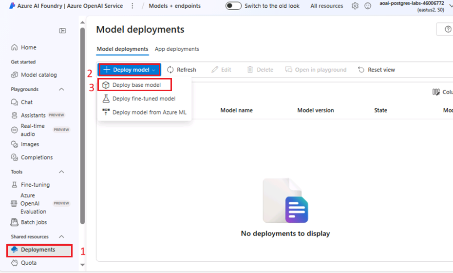
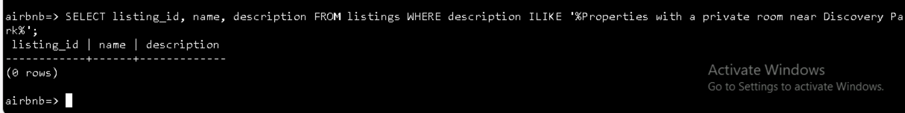
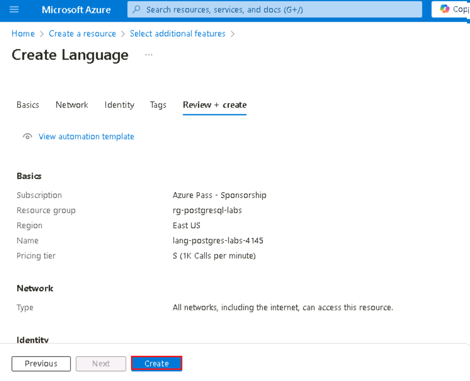
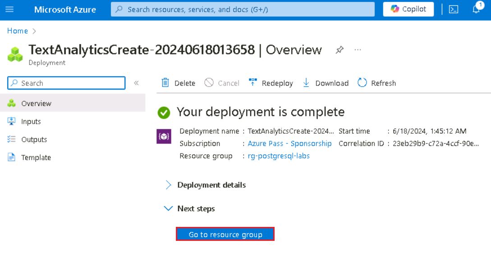
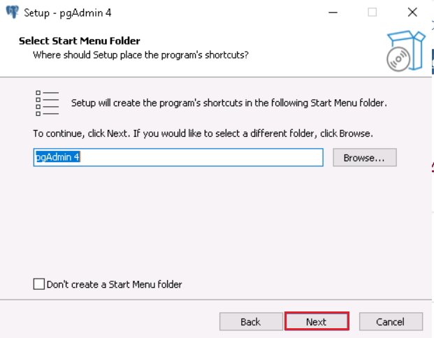

**Introdução**

Neste laboratório, você aprenderá a integrar os serviços do Azure AI ao
PostgreSQL para aprimorar seu banco de dados com funcionalidades
avançadas de AI. Ao aproveitar o poder das extensões OpenAI e PostgreSQL
do Azure, como pgvector e PostGIS, você habilitará análises de texto
sofisticadas, pesquisas de similaridade vetorial e consultas
geoespaciais diretamente em seu banco de dados. Este laboratório o
orienta no provisionamento dos recursos necessários do Azure, na
configuração do banco de dados e na execução de consultas complexas que
combinam insights orientados por AI com dados geoespaciais.**Objetivos**

- Provisionar e configurar o Azure Database for PostgreSQL Flexible
  Server.

- Criar e gerenciar incorporações de vetor usando o serviço Azure
  OpenAI.

- Realizar pesquisas de similaridade vetorial para encontrar dados de
  texto semanticamente semelhantes.

- Utilizar a extensão PostGIS para análise de dados geoespaciais.

- Integrar serviços Azure AI Language para análise de sentimentos e
  outras funções cognitivas.

- Otimizar e analisar o desempenho da consulta usando ferramentas de
  indexação e planejamento de consulta.

## Tarefa 1: Provisionar um Azure Database for PostgreSQL Flexible Server

1.  Abra seu navegador, navegue até a barra de endereço e digite ou cole
    a seguinte URL: +++https://portal.azure.com/+++, e, em seguida,
    pressione **Enter**

> 

2.  Na janela **Microsoft Azure**, use as **Credenciais do Usuário**
    para fazer login no Azure.

3.  Em seguida, digite a senha e clique no botão **Sign in**

> 

4.  Na janela **Stay signed in?**, clique em **Yes**

> 

5.  Selecione o ícone **Cloud Shell** na barra de ferramentas do portal
    do Azure para abrir um novo painel [Cloud
    Shell](https://learn.microsoft.com/azure/cloud-shell/overview)  na
    parte superior da janela do navegador.

6.  Na primeira vez que você abrir o Cloud Shell, poderá ser solicitado
    a escolher o tipo de shell que deseja usar (**Bash** ou
    **PowerShell**). Selecione **Bash**.

7.  Na caixa de diálogo **Getting started**, selecione **Mount storage
    account** e selecione sua assinatura do Azure. Clique em **Apply**

8.  Na caixa de diálogo **Mount storage account**, selecione **We will
    create a storage account for you** e clique no botão **Next**

> 
>
> 

9.  No prompt do Cloud Shell, execute os comandos a seguir para definir
    variáveis para a criação de recursos. As variáveis representam os
    nomes a serem atribuídos ao grupo de recursos e ao banco de dados e
    especificam a região do Azure na qual os recursos devem ser
    implementados.

10. O nome do grupo de recursos especificado é **rg-postgresql-labs**,
    mas você pode fornecer qualquer nome que desejar usar para hospedar
    os recursos associados a este laboratório.

> **+++RG_NAME=ResourceGroup1**
>
> 

11. No nome do banco de dados, substitua o token {SUFFIX} por um valor
    exclusivo, como suas iniciais, para garantir que o nome do servidor
    de banco de dados seja globalmente exclusivo.

> **+++DATABASE_NAME=pgsql-flex-{SUFFIX}+++**

12. Substitua a região pelo local que você deseja usar para recursos de
    laboratório. Neste laboratório, estamos usando eastus2

> **+++REGION=eastus2+++**

13. Provisione uma instância de banco de dados do Azure Database for
    PostgreSQL dentro do grupo de recursos que você criou acima
    executando o seguinte comando Azure CLI (10 Min)

**az postgres flexible-server create --name $DATABASE_NAME --location
$REGION --resource-group $RG_NAME \\**

**--admin-user s2admin --admin-password Seattle123Seattle123
--database-name airbnb \\**

**--public-access 0.0.0.0-255.255.255.255 --version 16 \\**

**--sku-name Standard_D2s_v3 --storage-size 32 --yes**

## Tarefa 2: Conectar-se ao banco de dados usando psql no Azure Cloud Shell

Nesta tarefa, você usa o [utilitário de linha de comando
psql](https://www.postgresql.org/docs/current/app-psql.html) do [Azure
Cloud Shell](https://learn.microsoft.com/azure/cloud-shell/overview)
para se conectar ao banco de dados.

1.  Abra um navegador, vá para https://portal.azure.com e faça login com
    sua conta de assinatura do Azure.

2.  Na página inicial, clique em **Resource Groups**

3.  Clique no nome do seu grupo de recursos

> 

4.  No grupo de recursos, selecione o recurso **PostgreSQL Flexible
    Server**

5.  No menu de navegação à esquerda, selecione
    **Connect** em **Settings**.

6.  Na página **Connect** do banco de dados no portal do Azure,
    selecione **airbnb** como **Database name**, em seguida, copie o
    **Connection details** e cole-o em um bloco de notas para usar as
    informações nas próximas tarefas.

> 

7.  Na página inicial do Azure Database for PostgresSQL, clique em
    **Overview** no menu de navegação do lado esquerdo e copie o nome do
    servidor e coloque-o no bloco de notas, em seguida, **salve** o
    bloco de notas para usar as informações no próximo laboratório.

8.  Na página inicial do Azure Database for PostgreSQL, selecione
    **Networking** em **Settings** e selecione **Allow public access to
    this resource through the internet using a public IP address**.
    Clique no botão **Save**

9.  Selecione o ícone do **Cloud Shell** na barra de ferramentas do
    portal do Azure para abrir um novo [painel do Cloud
    Shell](https://learn.microsoft.com/azure/cloud-shell/overview) na
    parte superior da janela do navegador.

10. Cole os **Connection details** no Cloud Shell.

11. No prompt do Cloud Shell, substitua o token **{your_password}** pela
    senha que você atribuiu ao usuário **s2admin** ao criar seu banco de
    dados, a senha deve ser **Seattle123Seattle123**

> 

12. Conecte-se ao seu banco de dados usando o utilitário de linha de
    comando psql digitando o seguinte no prompt:

> **+++psql+++**

Conectar-se ao banco de dados do Cloud Shell requer que a caixa **Allow
public access from any Azure service within Azure to the server** esteja
selecionada na página **Networking** do banco de dados. Se você receber
uma mensagem informando que não consegue se conectar, verifique se está
marcada e tente novamente.

## Tarefa 3: Adicionar dados ao banco de dados

Usando o prompt de comando psql, você criará tabelas e as preencherá com
dados para uso no laboratório.

- Execute os comandos a seguir para criar tabelas temporárias para
  importar dados JSON de uma conta pública de armazenamento de blobs.

> !!CREATE TABLE temp_calendar (data jsonb);
>
> CREATE TABLE temp_listings (data jsonb);
>
> CREATE TABLE temp_reviews (data jsonb);!!

- Usando o comando COPY, preencha cada tabela temporária com dados de
  arquivos JSON em uma conta de armazenamento público.

+++\COPY temp_calendar (data) FROM PROGRAM 'curl
https://solliancepublicdata.blob.core.windows.net/ms-postgresql-labs/calendar.json'+++

!!\COPY temp_listings (data) FROM PROGRAM 'curl
https://solliancepublicdata.blob.core.windows.net/ms-postgresql-labs/listings.json'!!

\COPY temp_reviews (data) FROM PROGRAM 'curl
https://solliancepublicdata.blob.core.windows.net/ms-postgresql-labs/reviews.json'

- Execute o comando a seguir para criar as tabelas para armazenar dados
  na forma usada por este laboratório:

> CREATE TABLE listings (
>
> listing_id int,
>
> name varchar(50),
>
> street varchar(50),
>
> city varchar(50),
>
> state varchar(50),
>
> country varchar(50),
>
> zipcode varchar(50),
>
> bathrooms int,
>
> bedrooms int,
>
> latitude decimal(10,5),
>
> longitude decimal(10,5),
>
> summary varchar(2000),
>
> description varchar(2000),
>
> host_id varchar(2000),
>
> host_url varchar(2000),
>
> listing_url varchar(2000),
>
> room_type varchar(2000),
>
> amenities jsonb,
>
> host_verifications jsonb,
>
> data jsonb
>
> );
>
> 
>
> CREATE TABLE reviews (
>
> id int,
>
> listing_id int,
>
> reviewer_id int,
>
> reviewer_name varchar(50),
>
> date date,
>
> comments varchar(2000)
>
> );
>
> CREATE TABLE calendar (
>
> listing_id int,
>
> date date,
>
> price decimal(10,2),
>
> available boolean
>
> );
>
> 

- Por fim, execute as seguintes instruções INSERT INTO para carregar
  dados das tabelas temporárias para as tabelas principais, extraindo
  dados do campo de dados JSON em colunas individuais:

> INSERT INTO listings
>
> SELECT
>
> data\['id'\]::int,
>
> replace(data\['name'\]::varchar(50), '"', ''),
>
> replace(data\['street'\]::varchar(50), '"', ''),
>
> replace(data\['city'\]::varchar(50), '"', ''),
>
> replace(data\['state'\]::varchar(50), '"', ''),
>
> replace(data\['country'\]::varchar(50), '"', ''),
>
> replace(data\['zipcode'\]::varchar(50), '"', ''),
>
> data\['bathrooms'\]::int,
>
> data\['bedrooms'\]::int,
>
> data\['latitude'\]::decimal(10,5),
>
> data\['longitude'\]::decimal(10,5),
>
> replace(data\['description'\]::varchar(2000), '"', ''),
>
> replace(data\['summary'\]::varchar(2000), '"', ''),
>
> replace(data\['host_id'\]::varchar(50), '"', ''),
>
> replace(data\['host_url'\]::varchar(50), '"', ''),
>
> replace(data\['listing_url'\]::varchar(50), '"', ''),
>
> replace(data\['room_type'\]::varchar(50), '"', ''),
>
> data\['amenities'\]::jsonb,
>
> data\['host_verifications'\]::jsonb,
>
> data::jsonb
>
> FROM temp_listings;
>
> INSERT INTO reviews
>
> SELECT
>
> data\['id'\]::int,
>
> data\['listing_id'\]::int,
>
> data\['reviewer_id'\]::int,
>
> replace(data\['reviewer_name'\]::varchar(50), '"', ''),
>
> to_date(replace(data\['date'\]::varchar(50), '"', ''), 'YYYY-MM-DD'),
>
> replace(data\['comments'\]::varchar(2000), '"', '')
>
> FROM temp_reviews;
>
> INSERT INTO calendar
>
> SELECT
>
> data\['listing_id'\]::int,
>
> to_date(replace(data\['date'\]::varchar(50), '"', ''), 'YYYY-MM-DD'),
>
> data\['price'\]::decimal(10,2),
>
> replace(data\['available'\]::varchar(50), '"', '')::boolean
>
> FROM temp_calendar;

# Exercício 2: Adicionar as extensões do Azure AI e Vector à lista de permissões

Ao longo deste laboratório, você usará as [extensões
azure_ai](https://learn.microsoft.com/azure/postgresql/flexible-server/generative-ai-azure-overview)
e
[pgvector](https://learn.microsoft.com/azure/postgresql/flexible-server/how-to-use-pgvector)
para adicionar recursos de AI generativa ao seu banco de dados
PostgreSQL. Neste exercício, você adiciona essas extensões à lista de
permissões do servidor, conforme descrito em [como usar extensões do
PostgreSQL](https://learn.microsoft.com/azure/postgresql/flexible-server/concepts-extensions#how-to-use-postgresql-extensions).

1.  Na página inicial, clique em **Resource groups**

2.  Clique no nome do seu grupo de recursos.

> 

3.  No grupo de recursos, selecione o recurso **PostgreSQL Flexible
    Server**

4.  No menu de navegação à esquerda do banco de dados, selecione
    **Server parameters** em **Settings** e insira azure.extensions na
    caixa de pesquisa. Expanda a lista suspensa **VALUE** e, em seguida,
    localize e marque a caixa ao lado de cada uma das seguintes
    extensões:

    - AZURE_AI

    - POSTGIS (Note that this will already be checked if you completed
      lab 3.)

    - VECTOR

5.  Clique em **Save** na barra de ferramentas, isso acionará uma
    implementação no banco de dados.

# Exercício 3: Criar um recurso Azure OpenAI 

A extensão azure_ai requer um serviço do Azure OpenAI subjacente para
criar inserções de vetor. Neste exercício, você provisionará um recurso
do Azure OpenAI no portal do Azure e implantará um modelo de inserção
nesse serviço.

## Tarefa 1: Provisionar um serviço Azure OpenAI 

Nesta tarefa, você vai criar um novo serviço Azure OpenAI.

1.  Na página inicial do portal do Azure, clique no **menu do portal do
    Azure** representado por **três barras horizontais** no lado
    esquerdo da barra de comandos do Microsoft Azure, conforme mostrado
    na imagem abaixo.

> 

2.  Navegue e clique em **+ Create a resource**.

> 

3.  Na página **Create a resource**, na barra de pesquisa **Search
    services and marketplace**, digite **Azure OpenAI**, em seguida,
    pressione **Enter**.

> 

4.  Na página **Marketplace**, navegue até a seção **Azure OpenAI**,
    clique no botão suspenso ao lado de **Create**, e selecione **Azure
    OpenAI** como mostrado na imagem. (Caso você já tenha clicado no
    bloco **Azure** **OpenAI**, então clique no botão **Create** na
    **página Azure OpenAI**).

> 

5.  Na guia Create Azure OpenAI **Basics**, insira as seguintes
    informações e clique em **Next**

[TABLE]

> 

6.  Na guia **Network**, deixe todos os botões de opção no estado padrão
    e clique no botão **Next**

> 

7.  Na guia **Tags**, deixe todos os campos no estado padrão e clique no
    botão **Next**

> 

8.  Na guia **Review + submit**, uma vez que a validação é aprovada,
    clique no botão **Create**

9.  Aguarde a conclusão da implementação. A implementação levará cerca
    de 2 a 3 minutos.

> **Observação**: se você vir uma mensagem informando que o Azure OpenAI
> Service está atualmente disponível para os clientes por meio de um
> formulário de inscrição, a assinatura selecionada não foi habilitada
> para o serviço e não tem uma cota para nenhum tipo de preço; você
> precisará clicar no link para solicitar acesso ao Azure OpenAI Service
> e preencher o formulário de solicitação.

## Tarefa 2: Recuperar a chave e o endpoint do Azure OpenAI Service

1.  Na página **Overview** do recurso, selecione o botão **Go to
    resource**. Se solicitado, selecione as credenciais do laboratório:

2.  Na janela da sua **página inicial** do **Azure OpenAI**, navegue até
    a seção **Resource Management** e clique em **Keys and Endpoint**

3.  Na página **Keys and Endpoints**, copie os valores de **KEY1, KEY
    2** e **Endpoint** e cole-os em um bloco de notas, conforme mostrado
    na imagem abaixo, em seguida, **salve** o bloco de notas para usar
    as informações nas próximas tarefas.

***Observação:** Você pode usar KEY1 ou KEY2. Ter sempre duas chaves
permite que você alterne e regenere chaves com segurança sem causar uma
interrupção do serviço*.

## Tarega 3: Implementar um modelo embedding 

A extensão azure_ai permite a criação de embeddings vetoriais a partir
do texto. Para criar esses embeddings, é necessário um modelo
text-embedding-ada-002 (versão 2) implementado no serviço Azure OpenAI
service. Nesta tarefa, você usará o Azure OpenAI Studio para criar uma
implementação de modelo que você possa usar.

1.  Na página **Azure OpenAI**, clique em **Overview** no menu de
    navegação do lado esquerdo, role para baixo e clique no botão **Go
    to Azure OpenAI Studio** conforme mostrado na imagem abaixo.

> 
>
> 

2.  Na página inicial do **Azure AI Foundry | Azure Open AI Service**,
    navegue até a seção **Components** and click on **Deployments**.

3.  Na janela **Deployments**, expanda o menu **+Deploy model** e
    selecione **Deploy base model**

4.  Na caixa de diálogo **Select a model**, navegue e selecione
    cuidadosamente **text-embedding-ada-002**, em seguida, clique no
    botão **Confirm**

4.  Na caixa de diálogo **Deploy model**, defina o seguinte e selecione
    **Create** para implementar o modelo.

    - **Select a model**: Escolha **text-embedding-ada-002** na lista.

    - **Model version**: Certifique-se de que **2 (padrão)** esteja
      selecionado.

    - **Deployment name**: Insira +++**embeddings**+++

> 
>
> 

5.  Na janela **Deployments**, copie **Deployment name** e cole-os em um
    bloco de notas (como mostrado na imagem) e **salve** o bloco de
    notas para usar as informações na próxima tarefa.

# Exercício 4: Instalar e configurar a extensão azure_ai

Neste exercício, você instala a extensão azure_ai em seu banco de dados
e a configura para se conectar ao seu Azure OpenAI Service.

## Tarefa 1: Conecte-se ao banco de dados usando psql no Azure Cloud Shell

Nesta tarefa, você usa o utilitário de linha de comando psql do Azure
Cloud Shell para se conectar ao banco de dados.

1.  Selecione o ícone do **Cloud Shell** na barra de ferramentas do
    portal do Azure para abrir um novo [painel do Cloud
    Shell](https://learn.microsoft.com/azure/cloud-shell/overview) na
    parte superior da janela do navegador.

2.  Cole os **detalhes da conexão** no Cloud Shell.

3.  No prompt do Cloud Shell, substitua o símbolo
    **{your_password}** com a senha que você atribuiu ao usuário
    **s2admin** ao criar seu banco de dados, a senha deve ser
    **Seattle123Seattle123**

4.  Conecte-se ao seu banco de dados usando o utilitário de linha de
    comando psql digitando o seguinte no prompt:

> **!!psql!!**

## Tarefa 2: Instale a extensão azure_ai

A extensão azure_ai permite integrar o Azure OpenAI e o Azure Cognitive
Services em seu banco de dados. Para habilitar a extensão em seu banco
de dados, siga as etapas abaixo:

1.  Verifique se a extensão foi adicionada com êxito à lista de
    permissões executando o seguinte no prompt de comando psql:

> **!!SHOW azure.extensions;!!**

2.  Instale a extensão azure_ai usando o
    [comando](https://www.postgresql.org/docs/current/sql-createextension.html)
    CREATE EXTENSION.

> **!!CREATE EXTENSION IF NOT EXISTS azure_ai;!!**

## Tarefa 3: Revise os objetos contidos na extensão azure_ai

A revisão dos objetos dentro da extensão azure_ai pode fornecer uma
melhor compreensão de seus recursos. Nesta tarefa, você inspeciona os
vários esquemas, User-Defined Functions (UDFs), e tipos compostos
adicionados ao banco de dados pela extensão.

1.  Você pode usar o [metacomando
    \dx](https://www.postgresql.org/docs/current/app-psql.html#APP-PSQL-META-COMMAND-DX-LC)
    no prompt de **comando psql** para listar os objetos contidos na
    extensão.

> **+++\dx+ azure_ai+++**
>
> 
>
> 
>
> A saída do metacomando mostra que a extensão azure_ai cria três
> esquemas, vários user-defined functions (UDFs) e vários tipos
> compostos no banco de dados. A tabela abaixo lista os esquemas
> adicionados pela extensão e descreve cada um.

[TABLE]

2.  As funções e os tipos estão todos associados a um dos esquemas. Para
    revisar as funções definidas no esquema azure_ai, use o metacomando
    \df, especificando o esquema cujas funções devem ser exibidas. O
    comando \x auto anterior a \df permite que a exibição expandida seja
    aplicada automaticamente quando necessário para facilitar a exibição
    da saída do comando no Azure Cloud Shell.

> **!!\x auto!!**
>
> **\df+ azure_ai.\***

A função azure_ai.set_setting() permite definir os valores de endpoint e
chave para o Azure AI Services. Ela aceita uma **chave** e o **valor**
para atribuí-la. A função azure_ai.get_setting() fornece uma maneira de
recuperar os valores definidos com a função set_setting(). Ele aceita a
**chave** da configuração que você deseja visualizar. Para ambos os
métodos, a chave deve ser uma das seguintes:

## Tarefa 4: Defina o endpoint e a chave Azure OpenAI 

Antes de usar as funções azure_openai, configure a extensão para o seu
endpoint e chave do Azure OpenAI Service.

1.  No comando abaixo, substitua {endpoint} e {api-key} pelos valores
    recuperados do portal do Azure, e execute os comandos no prompt de
    comando psql no painel do Cloud Shell para adicionar seus valores à
    tabela de configuração.

> **!!SELECT
> azure_ai.set_setting('azure_openai.endpoint','{endpoint}');**
>
> **SELECT azure_ai.set_setting('azure_openai.subscription_key',
> '{api-key}');!!**

2.  Verifique as configurações escritas na tabela de configuração usando
    as seguintes consultas:

> +++SELECT azure_ai.get_setting('azure_openai.endpoint');

SELECT azure_ai.get_setting('azure_openai.subscription_key');+++

A extensão azure_ai agora está conectada à sua conta Azure OpenAI e
pronta para gerar embeddings vetoriais.

# Exercício 5: Gere embeddings vetoriais com Azure OpenAI

O esquema de azure_openai da extensão azure_ai permite que o Azure
OpenAI crie embeddings de vetor para valores de texto. Usando esse
esquema, você pode [gerar embeddings com o Azure
OpenAI](https://learn.microsoft.com/azure/ai-services/openai/how-to/embeddings) diretamente
do banco de dados para criar representações vetoriais do texto de
entrada, que podem ser usados em pesquisas de similaridade vetorial, bem
como consumidos por modelos de aprendizado de máquina.

[Embeddings](https://learn.microsoft.com/azure/postgresql/flexible-server/generative-ai-overview#embeddings) são
um conceito em aprendizado de máquina e em natural language processing
(NLP) que envolve a representação de objetos, como palavras, documentos
ou entidades, como
[vetores](https://learn.microsoft.com/azure/postgresql/flexible-server/generative-ai-overview#vectors)
em um espaço multidimensional. Embeddings permitem que os modelos de
aprendizado de máquina avaliem o quão intimamente relacionadas as
informações estão. Essa técnica identifica com eficiência as relações e
semelhanças entre os dados, permitindo que os algoritmos identifiquem
padrões e façam previsões precisas.

## Tarefa 1: Habilitar o suporte vetorial com a extensão pgvector

A extensão azure_ai permite gerar embeddings para o texto de entrada.
Para permitir que os vetores gerados sejam armazenados junto com o
restante dos dados no banco de dados, você deve instalar a extensão
pgvector seguindo as diretrizes na documentação de [ativação de vetor na
documentação do banco de
dados](https://learn.microsoft.com/azure/postgresql/flexible-server/how-to-use-pgvector#enable-extension)
.

1.  Instale a extensão pgvector usando o comando [CREATE
    EXTENSION](https://www.postgresql.org/docs/current/sql-createextension.html) .

> **!!CREATE EXTENSION IF NOT EXISTS vector;!!**
>
> 

2.  Com suporte a vetor adicionado ao seu banco de dados, adicione uma
    nova coluna à tabela de listagens usando o tipo de dados vetorial
    para armazenar embeddings na tabela. O modelo text-embedding-ada-002
    produz vetores com 1536 dimensões, portanto, você deve especificar
    1536 como o tamanho do vetor.

> +++**ALTER TABLE listings**

**ADD COLUMN description_vector vector(1536);+++**

## Tarefa 2: Gerar e armazenar embeddings vetoriais

A tabela de listagens agora está pronta para armazenar embeddings.
Usando a função azure_openai.create_embeddings(), você cria vetores para
o campo de descrição e os insere na coluna description_vector
recém-criada na tabela de listagens.

1.  Antes de usar a função create_embeddings(), execute o seguinte
    comando para inspecioná-la e revisar os argumentos necessários:

> **+++\df+ azure_openai.\*+++**

A propriedade Argument data types na saída do comando \df+
azure_openai.\* revela a lista de argumentos que a função espera.

[TABLE]

2.  Usando o nome da implementação, execute a consulta a seguir para
    atualizar cada registro na tabela Listagens, Inserindo os embeddings
    vetoriais gerados para o campo de descrição na coluna
    description_vector usando a função azure_openai.create_embeddings().
    Substitua {your-deployment-name} pelo **Deployment name** que você
    copiou da página **Deployments** do Azure OpenAI Studio. Observe que
    essa consulta leva aproximadamente cinco minutos para ser concluída.

> **DO $$**
>
> **DECLARE counter integer := (SELECT COUNT(\*) FROM listings WHERE
> description \<\> '' AND description_vector IS NULL);**
>
> **DECLARE r record;**
>
> **BEGIN**
>
> **RAISE NOTICE 'Total descriptions to embed: %', counter;**
>
> **WHILE counter \> 0 LOOP**
>
> **BEGIN**
>
> **FOR r IN**
>
> **SELECT listing_id FROM listings WHERE description \<\> '' AND
> description_vector IS NULL**
>
> **LOOP**
>
> **BEGIN**
>
> **UPDATE listings**
>
> **SET description_vector =
> azure_openai.create_embeddings('{your-deployment-name}',
> description)**
>
> **WHERE listing_id = r.listing_id;**
>
> **EXCEPTION**
>
> **WHEN OTHERS THEN**
>
> **RAISE NOTICE 'Waiting 1 second before trying again...';**
>
> **PERFORM pg_sleep(1);**
>
> **END;**
>
> **counter := (SELECT COUNT(\*) FROM listings WHERE description \<\> ''
> AND description_vector IS NULL);**
>
> **IF counter % 25 = 0 THEN**
>
> **RAISE NOTICE 'Remaining descriptions to embed: %', counter;**
>
> **END IF;**
>
> **END LOOP;**
>
> **END;**
>
> **END LOOP;**
>
> **END;**
>
> **$$;!!**
>
> 
>
> A consulta acima usa um loop WHILE para recuperar registros da tabela
> de listagens em que o campo description_vector é nulo e o campo de
> descrição não é uma string vazia. Em seguida, a consulta tenta
> atualizar a coluna description_vector com uma representação vetorial
> da coluna de descrição usando a função azure_openai.create_embeddings.
> O loop é usado ao executar essa atualização para impedir que as
> chamadas para criar a função de inserção excedam o limite de taxa de
> chamadas do serviço OpenAI do Azure. Se o limite da taxa de chamada
> for excedido, você verá avisos semelhantes aos seguintes na saída:
>
> **AVISO:** Aguardando 1 segundo antes de tentar novamente...

> 

3.  Você pode verificar se a coluna description_vector foi preenchida
    para todos os registros de listagens executando a seguinte consulta:

> **!!SELECT COUNT(\*) FROM listings WHERE description_vector IS NULL
> AND description \<\> '';!!**
>
> O resultado da consulta deve ser uma contagem de 0.

## Tarefa 3: Executar uma pesquisa de similaridade vetorial

A similaridade vetorial é um método usado para medir a semelhança de
dois itens, representando-os como vetores, uma série de números. Os
vetores são frequentemente usados para realizar pesquisas usando LLMs. A
similaridade vetorial é comumente calculada usando métricas de
distância, como distância euclidiana ou similaridade de cosseno. A
distância euclidiana mede a distância em linha reta entre dois vetores
no espaço n-dimensional, enquanto a similaridade de cosseno mede o
cosseno do ângulo entre dois vetores. Cada embedding é um vetor de
números de ponto flutuante, portanto, a distância entre dois embeddings
no espaço vetorial se correlaciona com a semelhança semântica entre duas
entradas no formato original.

1.  Antes de executar uma pesquisa de similaridade vetorial, execute a
    consulta abaixo usando a cláusula ILIKE para observar os resultados
    da pesquisa de registros usando uma consulta de linguagem natural
    sem usar similaridade vetorial:

**!!SELECT listing_id, name, description FROM listings WHERE description
ILIKE '%Properties with a private room near Discovery Park%';!!**

> A consulta não retorna nenhum resultado porque está tentando
> corresponder o texto no campo de descrição com a consulta de linguagem
> natural fornecida.

2.  Agora, execute uma [consulta de pesquisa
    de](https://learn.microsoft.com/azure/ai-services/openai/concepts/understand-embeddings#cosine-similarity)
    similaridade de cosseno na tabela de listagens para realizar uma
    pesquisa de similaridade vetorial em descrições de listagem. Os
    embeddings são gerados para uma pergunta de entrada e, em seguida,
    convertidos em uma matriz vetorial (::vector), which allows it to be
    compared against the vectors stored in the listings table. Substitua
    {your-deployment-name} pelo **Deployment name** que você copiou da
    página **Deployments** do Azure OpenAI Studio.

> **!!SELECT listing_id, name, description FROM listings**
>
> **ORDER BY description_vector \<=\>
> azure_openai.create_embeddings('{your-deployment-name}', 'Properties
> with a private room near Discovery Park')::vector**
>
> **LIMIT 3;!!**

A consulta usa o operador de vetor
[\<=\>](https://github.com/pgvector/pgvector#vector-operators), que
representa o operador de "distância de cosseno" usado para calcular a
distância entre dois vetores em um espaço multidimensional.

3.  Execute a mesma consulta novamente usando a cláusula EXPLAIN ANALYZE
    para exibir os tempos de planejamento e execução da consulta.
    Substitua {your-deployment-name} pelo **Deployment name** que você
    copiou da página **Deployments** do Azure OpenAI Studio.

> **!!EXPLAIN ANALYZE**
>
> **SELECT listing_id, name, description FROM listings**
>
> **ORDER BY description_vector \<=\>
> azure_openai.create_embeddings('{your-deployment-name}', 'Properties
> with a private room near Discovery Park')::vector**
>
> **LIMIT 3;!!**

Na saída, observe o plano de consulta, que começará com algo semelhante
a:

> Limit (cost=1098.54..1098.55 rows=3 width=261) (actual
> time=10.505..10.507 rows=3 loops=1)
>
> -\> Sort (cost=1098.54..1104.10 rows=2224 width=261) (actual
> time=10.504..10.505 rows=3 loops=1)
>
> ...
>
> Sort Method: top-N heapsort Memory: 27kB
>
> -\> Seq Scan on listings (cost=0.00..1069.80 rows=2224 width=261)
> (actual time=0.005..9.997 rows=2224 loops=1)
>
> A consulta está usando uma classificação de verificação sequencial
> para executar a pesquisa. Os tempos de planejamento e execução serão
> listados no final dos resultados e devem ser semelhantes aos
> seguintes:
>
> Planning Time: 62.020 ms
>
> Execution Time: 10.530 ms

4.  Para permitir uma pesquisa mais eficiente no campo de vetor, crie um
    índice em listagens usando distância de cosseno e
    [HNSW](https://github.com/pgvector/pgvector#hnsw), que é a
    abreviação de Hierarchical Navigable Small World. O HNSW permite que
    o pgvector utilize os mais recentes algoritmos baseados em gráficos
    para aproximar as consultas do vizinho mais próximo.

> **!!CREATE INDEX ON listings USING hnsw (description_vector
> vector_cosine_ops);!!**

5.  Para observar o impacto do índice hnsw na tabela, execute a consulta
    novamente com a cláusula EXPLAIN ANALYZE para comparar os tempos de
    planejamento e execução da consulta. Substitua
    {your-deployment-name} pelo **Deployment name** que você copiou da
    página **Deployments** do Azure OpenAI Studio.

> EXPLAIN ANALYZE
>
> SELECT listing_id, name, description FROM listings
>
> ORDER BY description_vector \<=\>
> azure_openai.create_embeddings('{your-deployment-name}', 'Properties
> with a private room near Discovery Park')::vector
>
> LIMIT 3;

Na saída, observe que o plano de consulta agora inclui uma verificação
de índice mais eficiente:

Limit (cost=116.48..119.33 rows=3 width=261) (actual time=1.112..1.130
rows=3 loops=1)

-\> Index Scan using listings_description_vector_idx on listings
(cost=116.48..2228.28 rows=2224 width=261) (actual time=1.111..1.128
rows=3 loops=1)

Os tempos de execução da consulta devem refletir uma redução
significativa no tempo necessário para planejar e executar a consulta:

Tempo de planejamento: 56.802 ms

Tempo de execução: 1.167 ms

# Exercício 6: Integrar Azure AI Services

As integrações de serviços de AI do Azure incluídas no esquema
azure_cognitive da extensão azure_ai fornecem um conjunto avançado de
recursos de linguagem de AI acessíveis diretamente do banco de dados. As
funcionalidades incluem análise de sentimento, detecção de idioma,
extração de frases-chave, reconhecimento de entidade e resumo de texto.
Esses recursos são habilitados por meio do [serviço de Linguagem de AI
do
Azure](https://learn.microsoft.com/azure/ai-services/language-service/overview).

Para examinar a lista completa de recursos de AI do Azure acessíveis por
meio da extensão, consulte a [documentação Integrar o Servidor Flexível
do Banco de Dados do Azure para PostgreSQL com os Serviços Cognitivos do
Azure](https://learn.microsoft.com/azure/postgresql/flexible-server/generative-ai-azure-cognitive).

## Tarefa 1: Provisionar um serviço de Linguagem de AI do Azure

Um serviço de Linguagem de AI do Azure é necessário para aproveitar as
funções cognitivas das extensões azure_ai. Neste exercício, você criará
um serviço de Linguagem de AI do Azure.

1.  Na home page do portal do Azure, clique no **menu do portal do
    Azure** representado por **três barras horizontais** no lado
    esquerdo da barra de comandos do Microsoft Azure, conforme mostrado
    na imagem abaixo.

2.  Na página **Create a resource**, selecione AI + Machine Learning no
    menu à esquerda, em seguida, selecione **Language service**.

3.  Na caixa de diálogo **Select additional features**,
    selecione **Continue to create your resource**.

> 

4.  Na guia **Create Language**, insira o seguinte:

[TABLE]

> 
>
> 

5.  As configurações padrão serão usadas para as guias restantes da
    configuração do serviço de linguagem, portanto, selecione o botão
    **Review + create** 

6.  Selecione o botão **Create** na guia **Review + create** para
    fornecer o serviço de linguagem.

> 

7.  Selecione **Go to resource group** na página de implantação quando a
    implementação do serviço de linguagem for concluída.

## Tarefa 2: Definir o endpoint e a chave do serviço de Linguagem de AI do Azure

Assim como acontece com as funções azure_openai, para fazer chamadas com
êxito nos serviços de AI do Azure usando a extensão azure_ai, você deve
fornecer o ponto de extremidade e uma chave para o serviço de Linguagem
de AI do Azure.

1.  Na página inicial Language, selecione o item **Keys and
    Endpoint** em **Resource Management** No menu de navegação à
    esquerda.

2.  Na página **Keys and Endpoint**, copie os valores de **KEY1, KEY 2**
    e **Endpoint** e cole-os em um bloco de notas, conforme mostrado na
    imagem abaixo, e salve o bloco de notas para usar as informações nas
    próximas tarefas.

3.  Copie os valores de endpoint e chave de acesso e, no comando abaixo,
    substitua os tokens {endpoint} e {api-key} pelos valores recuperados
    do portal do Azure. Execute os comandos no prompt de comando psql no
    Cloud Shell para adicionar seus valores à tabela de configuração.

> !!SELECT
> azure_ai.set_setting('azure_cognitive.endpoint','{endpoint}');
>
> SELECT azure_ai.set_setting('azure_cognitive.subscription_key',
> '{api-key}');!!

## Tarefa 3: Analise o sentimento das avaliações

Nesta tarefa, você usará a função azure_cognitive.analyze_sentiment para
avaliar as avaliações de anúncios do Airbnb.

1.  Para executar a análise de sentimento usando o esquema
    azure_cognitive na extensão azure_ai, use a função
    analyze_sentiment. Execute o comando abaixo para revisar essa
    função:

> **!!\df azure_cognitive.analyze_sentiment!!**

A saída mostra o esquema, o nome, o tipo de dados de resultado e os
tipos de dados de argumento da função. Essas informações ajudam a
entender como usar a função.

2.  Também é essencial entender a estrutura do tipo de dados de
    resultado que a função gera para que você possa lidar corretamente
    com seu valor de retorno. Execute o seguinte comando para
    inspecionar o tipo de sentiment_analysis_result:

> **+++\dT+ azure_cognitive.sentiment_analysis_result+++**

3.  A saída do comando acima revela que o tipo de
    sentiment_analysis_result é uma tupla. Para entender a estrutura
    dessa tupla, execute o comando a seguir para examinar as colunas
    contidas no tipo composto sentiment_analysis_result:

> **!!\d+ azure_cognitive.sentiment_analysis_result!!**

A saída desse comando deve ser semelhante à seguinte:

> Composite type "azure_cognitive.sentiment_analysis_result"
>
> Column | Type | Collation | Nullable | Default | Storage | Description
>
> ----------------+------------------+-----------+----------+---------+----------+-------------
>
> sentiment | text | | | | extended |
>
> positive_score | double precision | | | | plain |
>
> neutral_score | double precision | | | | plain |
>
> negative_score | double precision | | | | plain |

O azure_cognitive.sentiment_analysis_result é um tipo composto que
contém as previsões de sentimento do texto de entrada. Inclui o
sentimento, que pode ser positivo, negativo, neutro ou misto, e as
pontuações para aspectos positivos, neutros e negativos encontrados no
texto. As pontuações são representadas como números reais entre 0 e 1.
Por exemplo, em (neutro, 0,26, 0,64, 0,09), o sentimento é neutro com
uma pontuação positiva de 0,26, neutro de 0,64 e negativo em 0,09.

4.  Agora que você tem uma compreensão de como analisar o sentimento
    usando a extensão e a forma do tipo de retorno, execute a seguinte
    consulta que procura revisões extremamente positivas:

WITH cte AS (

SELECT id, azure_cognitive.analyze_sentiment(comments, 'en') AS
sentiment FROM reviews LIMIT 100

)

SELECT

id,

(sentiment).sentiment,

(sentiment).positive_score,

(sentiment).neutral_score,

(sentiment).negative_score,

comments

FROM cte

WHERE (sentiment).positive_score \> 0.98

LIMIT 10;

A consulta acima usa uma expressão de tabela comum ou CTE para obter as
pontuações de sentimento para os três primeiros registros na tabela de
revisões. Em seguida, ele seleciona as colunas do tipo composto de
sentimento da CTE para extrair os valores individuais do
sentiment_analysis_result.

# Exercício 7: Execute uma consulta final para unir tudo 

Neste exercício, você se conecta ao seu banco de dados no **pgAdmin** e
executa uma consulta final que une seu trabalho com as extensões
azure_ai, postgis e pgvector nos laboratórios 3 e 4.

## Tarefa 1: Instale o pgAdmin

1.  Abra um navegador da Web e navegue até
    !!https://www.pgadmin.org/download/pgadmin-4-windows/!!

2.  Clique na versão mais recente do **pgAdmin**

3.  Selecione **pgadmin4-8.9-x64.exe**

4.  Execute e instale o arquivo baixado

5.  Na guia Selecionar Modo de Instalação de Instalação, selecione
    **Install for me only (recommended)**

6.  Clique no botão **Next**

7.  Selecione **I accept the agreement** e clique no botão **Next**

8.  Selecione o caminho e clique no botão **Next**

9.  Na janela **Setup-pgAdmin 4**, clique no botão **Next**

10. Clique no botão **Install**

11. Na janela **Setup-pgAdmin 4**, clique no botão **Finish**

## Tarefa 2: Conecte-se ao banco de dados usando pgAdmin

Nesta tarefa, você abrirá o pgAdmin e se conectará ao seu banco de
dados.

1.  Na caixa de pesquisa do Windows, digite **pgAdmin** e clique em
    **pgAdmin**

2.  Registre seu servidor clicando com o botão direito do mouse
    em **Servers** no Object Explorer e selecione **Register \> Server**

3.  Na caixa de diálogo **Register - Server**, cole o nome do servidor
    do Servidor Flexível do Banco de Dados do Azure para PostgreSQL (que
    você salvou no Exercício 1\> Tarefa 1) no campo **Name** na
    guia **General**.

> 

4.  Em seguida, selecione a guia **Connection** e cole o nome do seu
    servidor no campo **Hostname/address**. Insira **s2admin** no
    campor **Username**, insira **Seattle123Seattle123** no
    campo **Password**, e, opcionalmente, selecione **Save password**.

> 

3.  Por fim, selecione a guia **Parameters** e defina o **SSL
    mode** para **require**. Selecione **Save** para registrar seu
    servidor.

> 
>
> 

4.  Uma vez conectado ao seu servidor, expanda o nódulo **Databases** e
    selecione o banco de dados **airbnb**. Clique com o botão direito do
    mouse no banco de dados **airbnb** e selecione **Query Tool** no
    menu de contexto.

> 
>
> 

## Tarefa 3: Verifique se a extensão PostGIS está instalada em seu banco de dados

Para instalar a extensão postgis em seu banco de dados, você usará o
comando CREATE EXTENSION

1.  Na janela de consulta que você abriu acima, execute o comando CREATE
    EXTENSION com a cláusula IF NOT EXISTS para instalar a extensão
    postgis em seu banco de dados.

> CREATE EXTENSION IF NOT EXISTS postgis;
>
> 
>
> Com a extensão PostGIS agora carregada, você está pronto para começar
> a trabalhar com dados geoespaciais no banco de dados. A tabela de
> listagens que você criou e preencheu acima contém a latitude e a
> longitude de todas as propriedades listadas. Para usar esses dados
> para análise geoespacial, você deve alterar a tabela de listagens para
> adicionar uma coluna de geometria que aceite o tipo de dados de ponto.
> Esses novos tipos de dados estão incluídos na extensão postgis.

2.  Para acomodar dados de ponto, adicione uma nova coluna de geometria
    à tabela que aceita dados de ponto. Copie e cole a seguinte consulta
    na janela de consulta aberta do pgAdmin:

> !!ALTER TABLE listings
>
> ADD COLUMN listing_location geometry(point, 4326);!!

3.  Em seguida, atualize a tabela com dados geoespaciais associados a
    cada listagem adicionando os valores de longitude e latitude na
    coluna de geometria.

> !!UPDATE listings
>
> SET listing_location = ST_SetSRID(ST_Point(longitude, latitude),
> 4326);!!

## Tarefa 4: Executar uma consulta e exibir resultados em um mapa

Você executa uma consulta final nesta tarefa que vincula seu trabalho
aos laboratórios 3 e 4.

1.  Execute a consulta abaixo que incorpora elementos das extensões
    azure_ai, pgvector e PostGIS com as quais você trabalhou nos
    laboratórios 3 e 4.
    Substitua {your-deployment-name} pelo **Deployment name** que voce
    copious da página **Deployments** do Azure OpenAI Studio.

> !!WITH listings_cte AS (
>
> SELECT l.listing_id, name, listing_location, summary FROM listings l
>
> INNER JOIN calendar c ON l.listing_id = c.listing_id
>
> WHERE ST_DWithin(
>
> listing_location,
>
> ST_GeomFromText('POINT(-122.410347 47.655598)', 4326),
>
> 0.025
>
> )
>
> AND c.date = '2016-01-13'
>
> AND c.available = 't'
>
> AND c.price \<= 75.00
>
> AND l.listing_id IN (SELECT listing_id FROM reviews)
>
> ORDER BY description_vector \<=\>
> azure_openai.create_embeddings('{your-deployment-name}', 'Properties
> with a private room near Discovery Park')::vector
>
> LIMIT 3
>
> ),
>
> sentiment_cte AS (
>
> SELECT r.listing_id, comments,
> azure_cognitive.analyze_sentiment(comments, 'en') AS sentiment
>
> FROM reviews r
>
> INNER JOIN listings_cte l ON r.listing_id = l.listing_id
>
> )
>
> SELECT
>
> l.listing_id,
>
> name,
>
> listing_location,
>
> summary,
>
> avg((sentiment).positive_score) as avg_positive_score,
>
> avg((sentiment).neutral_score) as avg_neutral_score,
>
> avg((sentiment).negative_score) as avg_negative_score
>
> FROM sentiment_cte s
>
> INNER JOIN listings_cte l on s.listing_id = l.listing_id
>
> GROUP BY l.listing_id, name, listing_location, summary;!!

2.  No painel **Data Output**, selecione o botão **View all geometries
    in this column** exibido na coluna listing_location dos resultados
    da consulta.

O botão **View all geometries in this column** abre o **Geometry
Viewer**, permitindo que você visualize os resultados da consulta em um
mapa.

3.  Selecione um dos três pontos exibidos no mapa para visualizar
    detalhes sobre a localização, incluindo as pontuações médias de
    sentimento positivo, neutro e negativo em todas as avaliações da
    propriedade.

## Tarefa 5: Limpar recursos 

É crucial que você limpe todos os recursos criados para esses
laboratórios depois de concluí-los. Você é cobrado pela capacidade
configurada, não pelo quanto o banco de dados é usado. Para excluir seu
grupo de recursos e todos os recursos que você criou para este
laboratório, siga as instruções abaixo:

Para evitar incorrer em custos desnecessários do Azure, você deve
excluir os recursos criados neste início rápido se eles não forem mais
necessários. Para gerenciar recursos, você pode usar o portal do
[Azure](https://portal.azure.com/?azure-portal=true).

1.  Para excluir a conta de armazenamento, navegue até a **página
    inicial do portal do Azure**, clique em **Resource groups**.

> 

2.  Clique no grupo de recursos que você criou.

> 

3.  Na página inicial **Resource group**, selecione **Delete resource
    group** 

4.  No painel **Delete Resources** que aparece no lado direito, navegue
    até o campo **Enter a resource group name to confirm deletion**, e
    em seguida, clique no botão **Delete**.

5.  Caixa de diálogo **Delete confirmation**, clique no botão **Delete**

> 

6.  Clique no ícone de sino, você verá a notificação: **Deleted resource
    group AOAI-RG89.**

**Resumo**

Neste laboratório, você integrou com êxito os serviços de AI do Azure ao
PostgreSQL para criar um poderoso ambiente de banco de dados habilitado
para AI. Você começou provisionando recursos do Azure e configurando seu
banco de dados PostgreSQL com as extensões necessárias. Em seguida, você
gerou embeddings vetoriais para dados textuais e realizou pesquisas de
similaridade vetorial para localizar registros semanticamente
semelhantes. Além disso, você utilizou a extensão PostGIS para análise
de dados geoespaciais e o serviço Azure AI Language para análise de
sentimento. Por fim, você otimizou suas consultas usando indexação e
analisou seu desempenho, demonstrando a eficiência e a capacidade dessa
solução integrada para análise avançada de dados.
