**Introdução**

Este exemplo demonstra algumas abordagens para criar experiências
semelhantes ao ChatGPT em seus próprios dados usando o padrão Retrieval
Augmented Generation (RAG). Ele usa Azure OpenAI Service para acessar o
modelo ChatGPT (gpt-35-turbo) e Azure Cognitive Search para indexação e
recuperação de dados.

O repositório inclui dados de amostra, portanto, está pronto para ser
testado de ponta a ponta. Neste aplicativo de exemplo, usamos uma
empresa fictícia chamada Contoso Electronics, e a experiência permite
que seus funcionários façam perguntas sobre os benefícios, políticas
internas, bem como descrições de cargos e funções.

Este caso de uso mostra o processo de desenvolvimento de um aplicativo
de chat sofisticado usando o modelo Retrieval Augmented Generation (RAG)
na plataforma Azure. Ao usar Azure OpenAI Service e Azure Cognitive
Search, você criará um aplicativo de chat que pode responder a perguntas
de forma inteligente usando seus próprios dados. Este laboratório usa
uma empresa fictícia, a Contoso Electronics, como um estudo de caso para
demonstrar como criar uma experiência semelhante ao ChatGPT em dados
corporativos, abrangendo aspectos como benefícios de funcionários,
políticas internas e funções de trabalho.

**Objetivo**

- Instalar Azure CLI e Node.js em sua máquina local.

- Atribuir uma função de proprietário ao usuário.

- Instalar a extensão Dev Containers e configurar o ambiente de
  desenvolvimento.

- Implantar um aplicativo de chat no Azure e usá-lo para obter respostas
  de arquivos PDF.

- Excluir os recursos e modelos implantados.

## Tarefa 1: Instalar Azure CLI e definir o escopo da política para máquina local

1.  Na barra de pesquisa do Windows, digite **PowerShell**. Na caixa de
    diálogo **PowerShell**, navegue e clique em **Run as
    administrator**. Se você vir a caixa de diálogo - **Do you want to
    allow this app to make changes to your device?** - clique no botão
    **Yes**.

> 

2.  Execute o seguinte comando para instalar o Azure CLI no the
    PowerShell

PowerShell copy

> **winget install microsoft.azd**

3.  Execute o comando abaixo para definir a política como
    **Unrestricted** e digite **A** quando solicitado a alterar a
    política de execução.

> **Set-ExecutionPolicy Unrestricted**
>
> 

## Tarefa 2: Instalar Node.js

1.  Abra seu navegador, navegue até a barra de endereço, digite ou cole
    a seguinte URL: +++https://nodejs.org/en/download/+++, em seguida,
    pressione **Enter**.

2.  Selecione e clique em **Windows Installer**.

3.  O arquivo **Node-V** será baixado. Clique no arquivo baixado para
    configurar **Node.js**

4.  Na janela **Welcome to the Node.js Setup Wizard**, clique no botão
    **Next**.

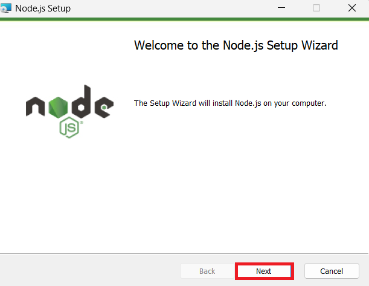

5.  Na janela **End-User License Agreement**, selecione o botão **I
    accept the terms in the License agreement** e clique no botão
    **Next**.

6.  Na janela **Destination Folder**, clique no botão **Next**.

7.  Na janela **Custom Setup**, clique no botão **Next**.

8.  Na janela **Ready to install Node.js**, clique em **Install.**

9.  Na janela **Completing the Node.js Setup Wizard**, clique no botão
    **Finish** para concluir o processo de instalação.

## Task 3: Recuperar o nome e o local do grupo de recursos

1.  Abra seu navegador, navegue até a barra de endereço e digite ou cole
    a seguinte URL: +++https://portal.azure.com/+++, e, em seguida,
    pressione **Enter**.

> 

2.  Na janela **Microsoft Azure**, use **User Credentials** para fazer
    login no Azure.

3.  Em seguida, digite a senha e clique no botão **Sign in.**

> 

4.  Na janela **Stay signed in?**, clique no botão **Yes**.

> 

5.  Digite +++**Resource group+++** na barra de pesquisa e selecione
    **Resource groups**.

> 

6.  Clique no seu **Resource group** atribuído.

7.  Na página **Resource group**, copie **resource group name and
    location** e cole-os em um bloco de notas e, em seguida, **salve** o
    bloco de notas para usar as informações nas próximas tarefas.

## Tarefa 4: Criar o serviço de pesquisa de AI

1.  No portal do Azure, digite +++**AI search+++** na barra de pesquisa
    e selecione **AI Search**

2.  Clique em + **Create**.

3.  Selecione os valores abaixo e clique em **Review + Create**.

&nbsp;

1)  Subscription: **Your Azure subscription**.

2)  Resource group - **Selecione seu grupo de recursos existente**

3)  Service name - **aisearchXXXX(XXXXX pode ser o ID do laboratório)**

4)  Location : **Central US** /Localização perto de você

5)  Pricing tier: Standard

4.  Clique em **Create** agora.

5.  Aguarde a implementação e clique em **Go to resource**.

> 
>
> 

6.  Na página **Overveiw** de **AI Search**, No painel de navegação do
    lado esquerdo, em **Settings**, selecione **Semantic ranker**

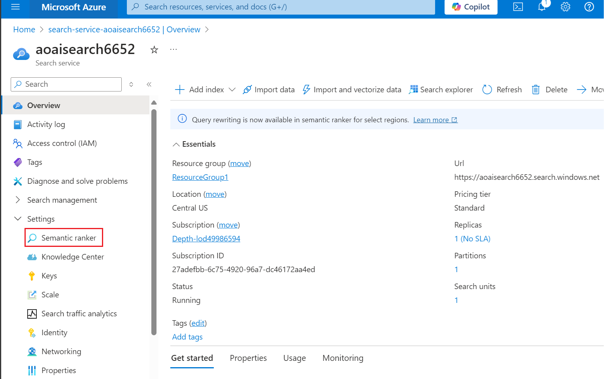

7.  Na guia **Semantic ranker,** selecione **Standard** e clique em
    **Select Plan.**

> 

8.  Selecione **Yes**

> 

9.  Você verá uma notificação:**Successfully updated semantic ranker to
    standard plan.**

> 

10. Abra um bloco de notas e anote o nome da AI Search, nome e
    localização do grupo de recursos. Vamos usá-los mais tarde para nos
    comunicarmos com o serviço.

> 

## Tarefa 5: Executar o Docker

1.  Na caixa de pesquisa do Windows, digite Docker e clique em **Docker
    Desktop**.

2.  Execute o Docker Desktop.

## **Tarefa 6: Instalar a extensão Dev Containers**

1.  Na caixa de pesquisa do Windows, digite Visual Studio e clique em
    **Visual Studio Code**.

> 

2.  Abra seu navegador, navegue até a barra de endereço, digite ou cole
    a seguinte URL:
    +++https://marketplace.visualstudio.com/items?itemName=ms-vscode-remote.remote-containers+++
    em seguida, pressione **Enter**.

> 

3.  Na página Dev Containers, selecione no botão **Install**

4.  A caixa de diálogo **Visual Studio Code is required to install this
    extension.** é exibida, clique no botão **Continue**.

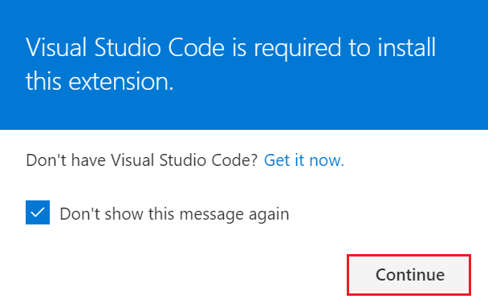

5.  A caixa de diálogo **This site is trying to open Visual Studio
    Code.** é exibida, clique no botão **Open**

6.  No Visual Studio, clique no botão **Install** em **Dev Containers**.

## Tarefa 7: Ambiente de desenvolvimento aberto

1.  Abra seu navegador, navegue até a barra de endereço, digite ou cole
    a seguinte URL:

+++<https://vscode.dev/redirect?url=vscode://ms-vscode-remote.remote-containers/cloneInVolume?url=https://github.com/azure-samples/azure-search-openai-demo>+++
em seguida, pressione **Enter**.

2.  A caixa de diálogo **This site is trying to open Visual Studio
    Code.** é exibida, clique no botão **Open**

> 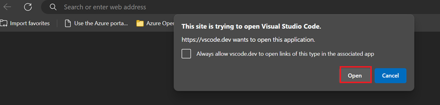

3.  A caixa de diálogo **Allow ‘Dev Containers’ extension to open this
    URI?** é exibida, clique no botão **Open**

4.  A Caixa de diálogo **Cloning a repository in a Dev Container may
    execute arbitrary code.** é exibida, clique no botão **Got It**

> 

5.  Iniciar o Dev Container levará de 13 a 15 minutos. Após a
    implementação, pressione **Enter**.

6.  Pressione qualquer tecla para fechar o terminal.

> 

## Tarefa 8: Implemntar o aplicativo de chat no Azure

1.  Entre no Azure com o Azure Developer CLI. Execute o seguinte comando
    no Terminal:

> BashCopy
>
> **azd auth login**
>
> 

2.  O navegador padrão é aberto para entrar. Entrar com sua conta de
    assinatura do Azure.

> 

3.  Feche o navegador.

> 

4.  Depois de fazer login, os detalhes do login do Azure são preenchidos
    no terminal.

> 

5.  Crie um novo ambiente azd. Execute o seguinte comando no Terminal:

Copy

**azd env new**

6.  Insira o novo nome do ambiente como +++**chatapprag+++**

> 

7.  Atribua o grupo de recursos do Azure existente. Execute o seguinte
    comando no Terminal:

> azd env set AZURE_RESOURCE_GROUP {Name of existing resource group}
>
> azd env set AZURE_LOCATION {Location of existing resource group}
>
> 

8.  Atribua o serviço existente de Azure AI Search. Execute o seguinte
    comando no Terminal:

> +++azd env set AZURE_SEARCH_SERVICE {Name of existing Azure AI Search
> service}+++
>
> +++azd env set AZURE_SEARCH_SERVICE_RESOURCE_GROUP {Name of existing
> resource group with ACS service}+++
>
> +++azd env set AZURE_SEARCH_SERVICE_LOCATION {Location of existing
> service}+++
>
> +++azd env set AZURE_SEARCH_SERVICE_SKU {Name of SKU}+++
>
> 

9.  Verifique os recursos existentes atribuídos, selecione Azure e
    escolha o arquivo **.env**

> 

10. Crie um novo ambiente azd:

> shellCopy
>
> **azd up**
>
> 

11. Selecione sua assinatura do Azure

> 

12. Quando solicitado, **Enter a value for the
    ‘documentIntelligenceResourceGroupLocation’ infrastructure
    parameter** selecione **West US2.**

> 

13. Quando solicitado, **Enter a value for the
    ‘openAiResourceGroupLocation’ infrastructure parameter** selecione
    **France Central .**

> 

14. Aguarde até que o aplicativo seja implementado. Pode levar **de 35 a
    40** minutos para que a implementação seja concluída.

> 
>
> 
>
> 
>
> 
>
> 

15. Depois que o aplicativo for implementado com êxito, você verá uma
    URL impressa no console. Clique nesse URL para interagir com o
    aplicativo em seu navegador. Ele terá a seguinte aparência:

> 

16. Abra seu navegador, navegue até a barra de endereço, cole o link.
    Agora, o grupo de recursos será aberto em um novo navegador.

## Tarefa 9: Verificar os recursos implementados no portal do Azure

1.  Selecione **Resource groups**

> 

2.  Clique no seu **Resource group** atribuído.

3.  Certifique-se de que os recursos abaixo foram implementados com
    sucesso:

- Azure App Service

- Azure Application Insights

- Container App

- Container registry

- Azure OpenAI

- Azure Document Intelligence

- Azure Search Service

- Azure Storage Account

- Azure Speech Service

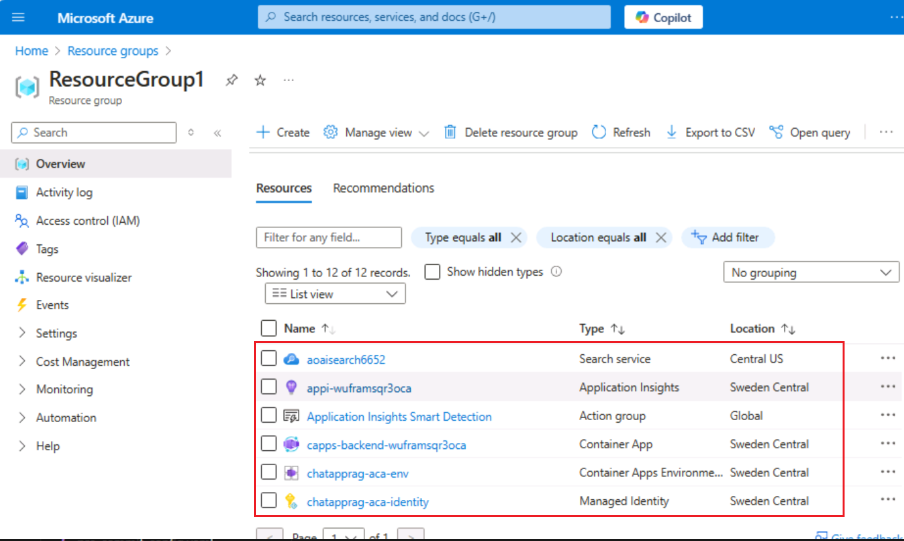

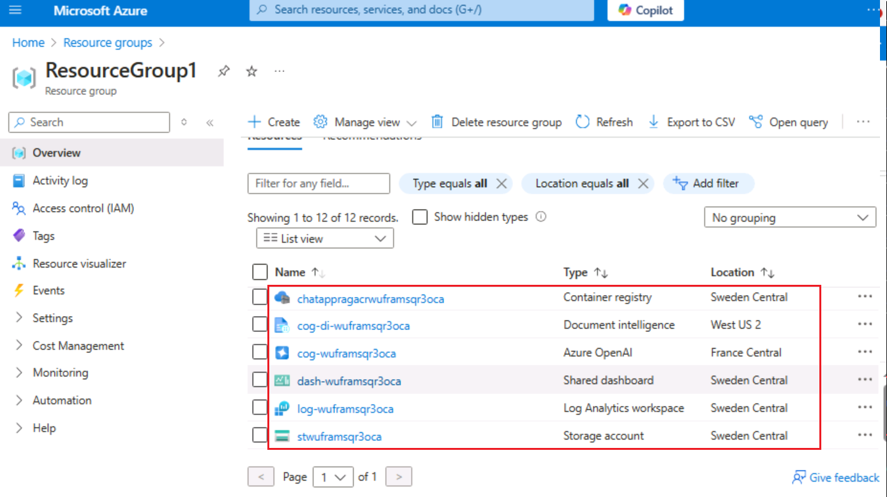

4.  No grupo de recursos e clique em **AI Search service.**

> 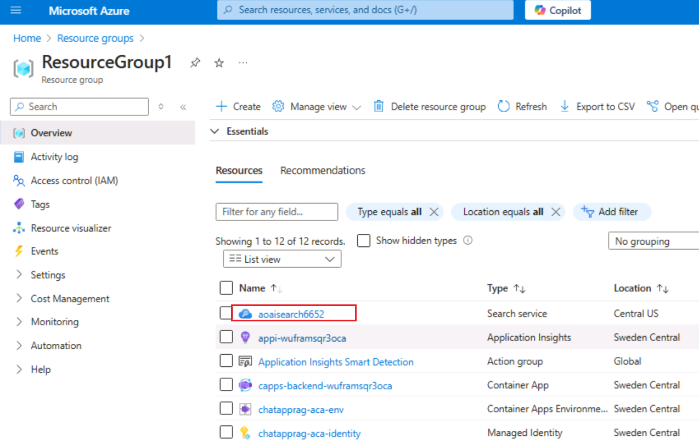

5.  Certifique-se de que os índices sejam implementados com sucesso.

> 

6.  Volte para o grupo de recursos e clique em **Storage account**

> 

7.  No menu de navegação à esquerda, clique em **Containers**,
    certifique-se de que os dados sejam implantados com sucesso.

> 

## Tarefa 10: Usar o aplicativo de chat para obter respostas de arquivos PDF

1.  Aguarde a conclusão da implementação do aplicativo web.

> 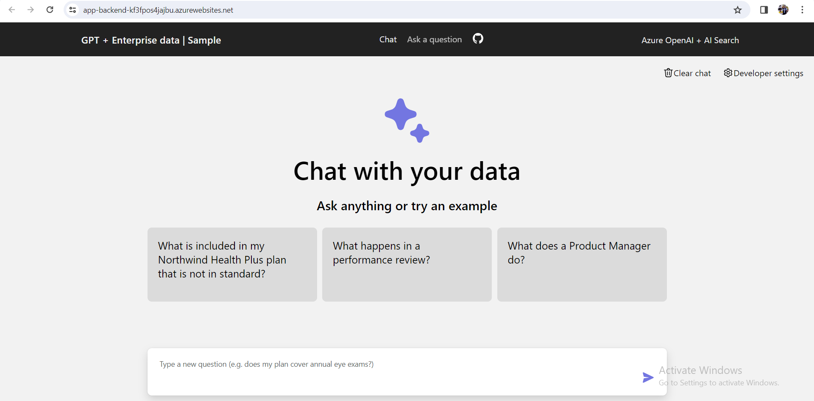

2.  Na página do aplicativo da web **GPT + Eneterprise data |Sample**,
    digite o seguinte texto e clique no ícone **Submit** conforme
    mostrado na imagem abaixo.

> **What happens in a performance review?**

3.  Na resposta, selecione uma **citação**.

4.  No painel direito, use as guias para entender como a resposta foi
    gerada.

[TABLE]

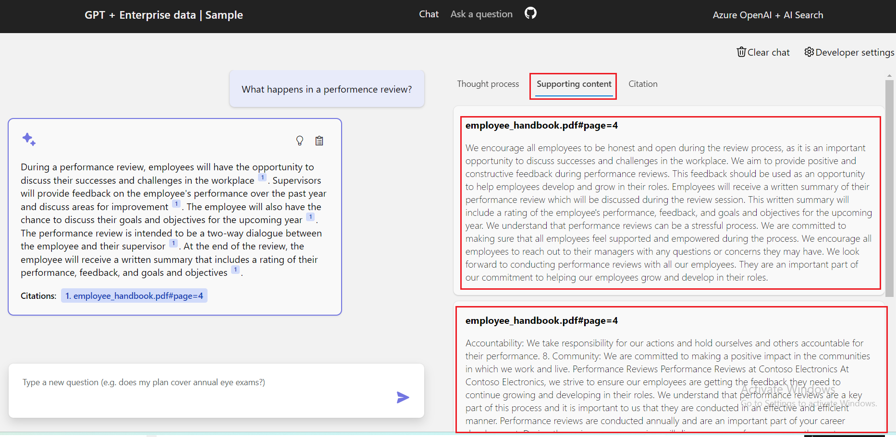

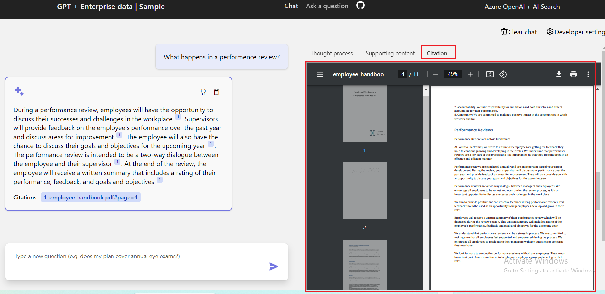

5.  Selecione novamente a guia escolhida para fechar o painel.

6.  A inteligência do chat é determinada pelo modelo OpenAI e pelas
    configurações usadas para interagir com o modelo.

7.  Selecione **Developer settings**.

[TABLE]

8.  Marque a caixa de seleção **Suggest follow-up questions** e faça a
    mesma pergunta novamente.

9.  Digite o texto a seguir e clique no ícone **Submit**, conforme
    mostrado na imagem abaixo.

> What happens in a performance review?

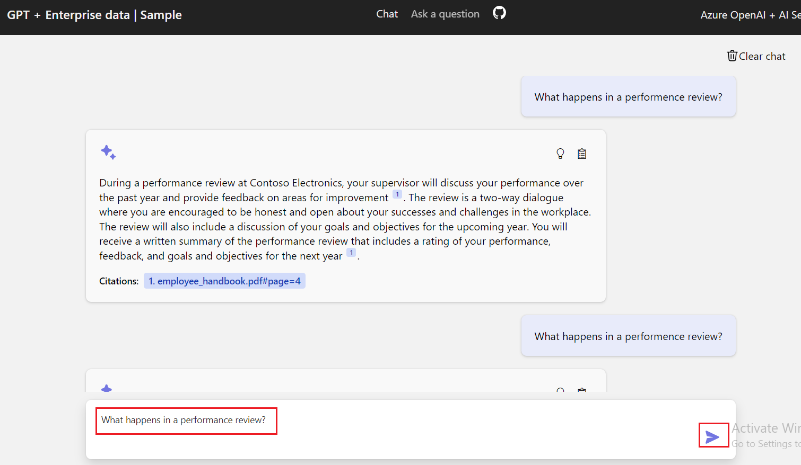

10. O chat retornou perguntas de acompanhamento sugeridas, como as
    seguintes:

11. Na guia **Settings**, desmarque**Use semantic ranker for
    retrieval**.

12. Digite o texto a seguir e clique no ícone **Submit**, conforme
    mostrado na imagem abaixo.

> What happens in a performance review?

## Tarefa 11: Excluir os recursos

1.  Para excluir o Grupo de recursos, digite **Resource groups** na
    barra de pesquisa do portal do Azure, navegue e clique em **Resource
    groups** em **Services**.

> 

2.  Clique no grupo de recursos de aplicativo web de exemplo.

> 

3.  Na página inicial do grupo de recursos, selecione **todos os
    recursos.**

4.  Selecione **Delete**

**Resumo**

Neste laboratório, você aprendeu a configurar e implementar um
aplicativo de chat inteligente usando o pacote de ferramentas e serviços
do Azure. Começando com a instalação de ferramentas essenciais como
Azure CLI e Node.js, você configurou seu ambiente de desenvolvimento
usando Dev Containers no Visual Studio Code. Você implementou um
aplicativo de chat que utiliza Azure OpenAI e Azure Cognitive Search
para responder a perguntas de arquivos PDF. Por fim, você excluiu os
recursos implementados para gerenciar recursos com eficiência. Essa
experiência prática o equipou com as habilidades para desenvolver e
gerenciar aplicativos de bate-papo inteligentes usando o modelo
Retrieval Augmented Generation no Azure.
