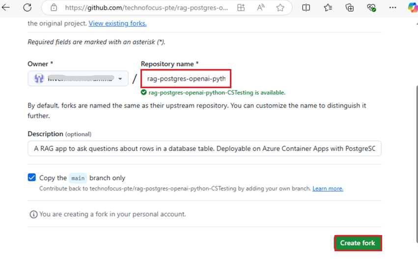
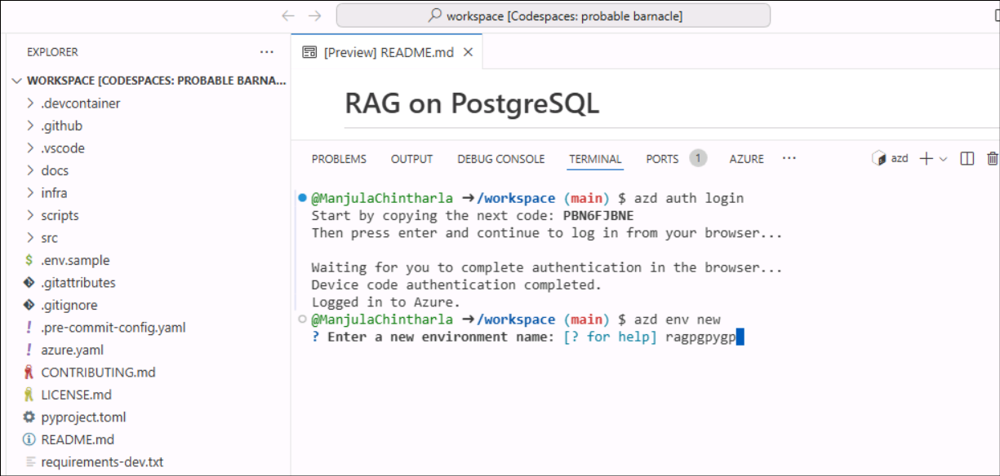
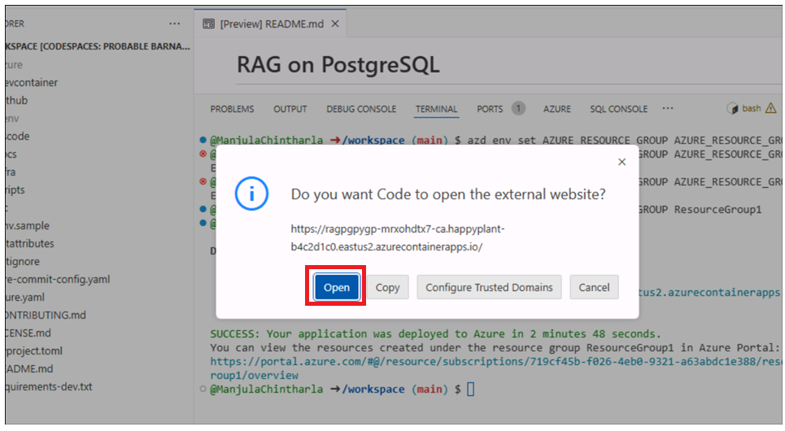
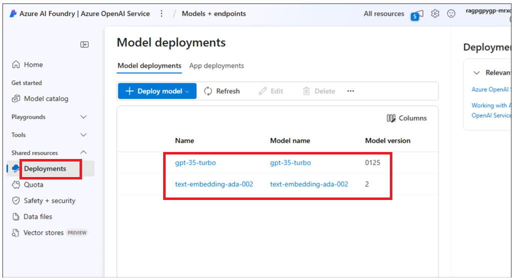

# Caso de Uso 06 – Implementando um aplicativo de chat no Azure Container Apps com PostgreSQL Flexible Server

**Objetivo:**

- Para configurar o ambiente de desenvolvimento no Windows instalando a
  Azure CLI, o Node.js, atribuindo funções de assinatura do Azure,
  iniciando o Docker Desktop e ativando o Visual Studio Code com a
  extensão Dev Containers.

- Implementar e testar o aplicativo de chat personalizado com PostgreSQL
  e OpenAI no Azure.

Neste caso de uso, você configurará um ambiente de desenvolvimento
abrangente, Implementará um aplicativo de chat integrado ao PostgreSQL e
verificará sua Implementação no Azure. Isso envolve a instalação de
ferramentas essenciais como Azure CLI, Docker e Visual Studio Code (já
fizemos isso para você no host env), a configuração de funções de
usuário no Azure, a Implementação do aplicativo usando o Azure Developer
CLI e a interação com os recursos implementados para garantir a
funcionalidade.

**Principais tecnologias usadas:** Python, FastAPI, modelos Azure
OpenAI, banco de dados Azure para PostgreSQL e azure-container-apps,
ai-azd-templates.

**Duração estimada** -- 45 minutos

**Tipo de laboratório:** Conduzido pelo instrutor

**Pré-requisitos:**

Conta do GitHub -- Espera-se que você tenha suas próprias credenciais de
login do GitHub. Se não tiver, crie uma aqui
- +++<https://github.com/signup?user_email=&source=form-home-signupobjectives+++>

**Exercício 1: Provisione, implemente o aplicativo e teste-o no
navegador**

## Tarefa 0: Entenda a VM e as credenciais

Nesta tarefa, identificaremos e entenderemos as credenciais que usaremos
em todo o laboratório.

1.  A aba **Instructions** contém o guia do laboratório com as
    instruções a serem seguidas durante o laboratório.

2.  A aba **Resources** contém as credenciais que serão necessárias para
    a execução do laboratório.

    - **URL -** URL para o portal do Azure

    - **Subscription -** Este é o ID da assinatura atribuída a você

    - **Username -** O ID do usuário com o qual você precisa fazer login
      no Azure Services.

    - **Password** – Senha para o login do Azure. Vamos chamar esse nome
      de usuário e senha de credenciais de login do Azure. Usaremos
      essas credenciais sempre que mencionarmos as credenciais de login
      do Azure.

    - **Resource Group** – O grupo de recursos atribuído a você.

\[!Alerta\] **Importante:** certifique-se de criar todos os seus
recursos nesse grupo de recursos

> 

3.  A aba **Help** contém as informações de suporte. O valor **ID** aqui
    é o ID da instância do laboratório que será usado durante a execução
    do laboratório.

> 

##  Tarefa 1: Registrar o provedor de serviços

1.  Abra um navegador, acesse +++https://portal.azure.com+++ e entre com
    sua conta Cloud Slice informada abaixo.

> Nome de usuário: <+++@lab.CloudPortalCredential>(User1).Username+++
>
> Senha: <+++@lab.CloudPortalCredential(User1).Password>+++
>
> 
>
> 

2.  Clique na caixa de diálogo **Subscriptions**.

> 

3.  Clique no nome da assinatura

> 

4.  Expanda Configurações no menu de navegação esquerdo. Clique em
    **Resource providers**, digite
    +++**Microsoft.AlertsManagement+++** e selecione i,t e, em seguida,
    clique em **Register**.

5.  Clique em **Resource providers**,
    digite +++**Microsoft.DBforPostgreSQL+++** e selecione i,t e, em
    seguida, clique em **Register**.

6.  Repita as etapas 10 e 11 para registrar os seguintes provedores de
    recursos.

- Microsoft.Search

- Microsoft.Web

- Microsoft.ManagedIdentity

## Tarefa 2: Copiar o nome do grupo de recursos existente

1.  Na página inicial, clique no campo **Resource groups**.

2.  Certifique-se de que já tenha um grupo de recursos criado para você
    trabalhar. Nunca exclua esse grupo de recursos. Em vez disso, você
    pode excluir recursos dentro do grupo de recursos, mas não o grupo
    de recursos em si.

3.  Clique no nome do grupo de recursos

4.  Copie o nome do grupo de recursos e salve-o no Bloco de Notas para
    usá-lo na implementação de todos os recursos nesse grupo de recursos

## Tarefa 3 : Executar o Docker

1.  Na área de trabalho, clique duas vezes em **Docker Desktop**.

> 

2.  Execute o Docker Desktop.

> 

## Tarefa 4: Abrir ambiente de desenvolvimento

1.  Abra o navegador, navegue até a barra de endereços, digite ou cole o
    seguinte
    URL: +++<https://github.com/technofocus-pte/rag-postgres-openai-python-CSTesting.git+++%C2%A0tab> uma
    aba será aberta e solicitará que você abra no Visual studio code.
    Selecione **Open Visual Studio Code.**

> 

2.  Clique em **fork** para bifurcar o repositório. Dê um nome exclusivo
    ao repositório e clique no botão **Create repo**.

> 
>
> 

3.  Clique em **Code -\> Codespaces -\> Codespaces+**

> 

4.  Aguarde a configuração do ambiente do Codespaces, que leva alguns
    minutos para ser completamente configurado

> 
>
> 

## Tarefa 5: Provisionar serviços e Implementar o aplicativo no Azure

1.  Execute o seguinte comando no Terminal. Ele gera o código a ser
    copiado. Copie o código e pressione Enter.

+++azd auth login+++

> 

2.  O navegador padrão é aberto para inserir o código gerado para
    verificação. Digite o código e clique em **Next**.

> 

3.  Faça login com suas credenciais do Azure.

> 

4.  Para criar um ambiente para os recursos do Azure, execute o seguinte
    comando Azure Developer CLI, que solicita que você insira o nome do
    ambiente, digite um nome de sua escolha e pressione Enter (por
    exemplo:+++ragpgpy+++)

Observação: Ao criar um ambiente, certifique-se de que o nome seja
composto por letras minúsculas.

> +++azd env new+++

5.  Execute o seguinte comando do Azure Developer CLI para provisionar
    os recursos do Azure e Implementar o código.

+++azd provision+++

6.  Quando solicitado, selecione uma **subscription** para criar os
    recursos e selecione a região mais próxima da sua localização; neste
    laboratório, escolhemos a região **East US2**.

7.  Será solicitado “**Digite um valor para o parâmetro de
    infraestrutura 'existingResourceGroupName':**” insira o grupo de
    recursos copiado na Tarefa 1 (por exemplo: \*\*ResourceGroup1 usado
    para o segmento de desenvolvimento) .\*\* Você pode copiar o nome do
    grupo de recursos da seção **Resources**, conforme mostrado na
    imagem abaixo

8.  Quando solicitado, **insira um valor para o parâmetro de
    infraestrutura 'openAILocation'** selecione a região mais próxima de
    sua localização; neste laboratório, escolhemos a região **North
    Central US**

9.  O provisionamento do recurso levará de 5 a 10 minutos. Clique
    em **Yes** se solicitado.

10. Aguarde até que o modelo provisione todos os recursos com sucesso.

11. Execute o comando abaixo para definir o grupo de recursos

+++azd env set AZURE_RESOURCE_GROUP {your resource group
name}+++ 

12. Execute o comando abaixo para Implementar o aplicativo no Azure.

+++azd deploy+++

13. Aguarde a conclusão da implementação. A Implementação leva \<5

14. Clique no link do endpoint do aplicativo Web implementado.

15. Clique em **Open**. Será aberta uma nova aba com o aplicativo

16. O aplicativo é aberto.

**Tarefa 6: Use o aplicativo de chat para obter respostas a partir dos
arquivos.**

1.  Na página da aplicativo web **RAG on database
    |OpenAI+PoastgreSQL**, **clique no botão Best shoe for hiking?** e
    observe o resultado

2.  Clique em **clear chat.**

3.  Na página do aplicativo web **RAG on database |OpenAI+PoastgreSQL**,
    clique no botão **Climbing gear cheaper than \\30** e observe o
    resultado

4.  Clique em **clear chat.**

**Tarefa 7: Verificar recursos implementados no portal do Azure**

1.  Na página inicial do portal do Azure, clique em **Resource Groups**.

2.  Clique no nome do seu grupo de recursos

3.  Certifique-se de que o recurso abaixo foi implementado com sucesso

    - Container App

    - Application Insights

    - Container Apps Environment

    - Log Analytics workspace

    - Azure OpenAI

    - Azure Database for PostgreSQL flexible server

    - Container registry

4.  Clique no nome do recurso **Azure OpenAI**.

5.  Em **Overview** no menu de navegação à esquerda, clique em **Go to
    Azure AI Foundry portal** e selecione para abrir uma nova aba.

6.  Clique em **Shared resources -\>** **Deployments** no menu de
    navegação à esquerda e certifique-se de que **gpt-35-turbo**,
    e **text-embedding-ada-002** sejam implementados com sucesso

**Tarefa 8: Limpar todos os recursos**

Para limpar todos os recursos criados por este exemplo:

1.  Retorne ao **Azure portal -\> Resource group- \> Resource group
    name.**

2.  Selecione todos os recursos e clique em Excluir, conforme mostrado
    na imagem abaixo. (**NÃO EXCLUA** o grupo de recursos)

3.  Digite delete na caixa de texto e clique em **Delete**.

4.  Confirme a exclusão clicando em **Delete**.

5.  Volte para a aba do portal do Github e atualize a página

6.  Clique em Code, selecione o branch criado para este laboratório e
    clique em **Delete**.

7.  Confirme a exclusão do branch clicando no botão **Delete**.

**Resumo:** Este caso de uso orienta você na Implementação de um
aplicativo de chat com PostgreSQL e OpenAI no Azure, com foco na
Implementação e no gerenciamento de aplicativos baseados em nuvem. Você
configurou o ambiente de desenvolvimento, instalou as ferramentas
necessárias como o Azure CLI, configurou os recursos do Azure usando o
Azure Developer CLI e implantou o aplicativo no Azure Container Apps.
