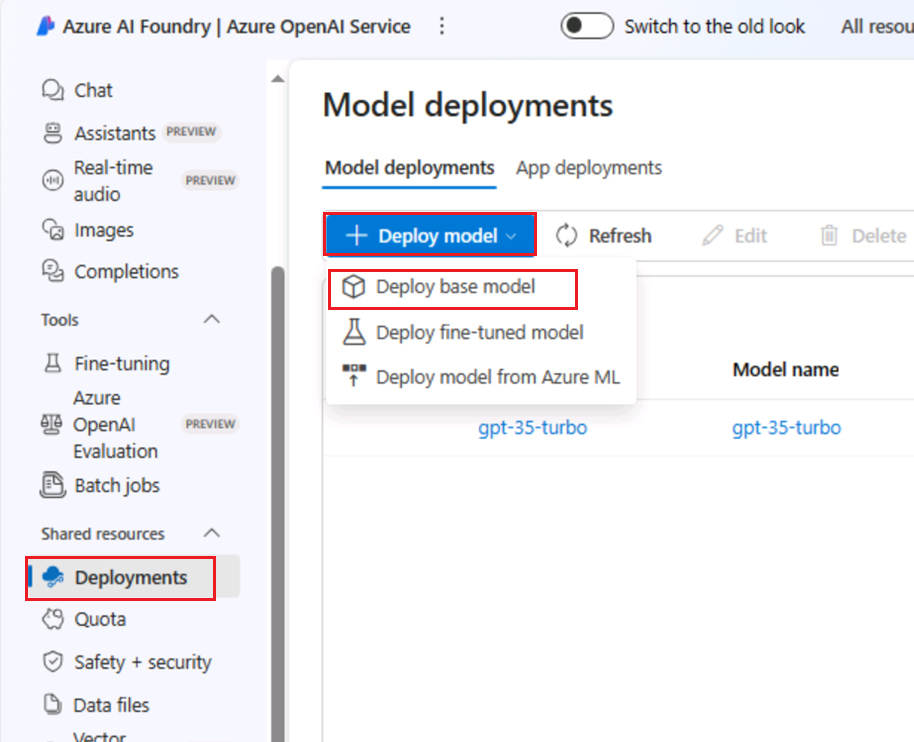
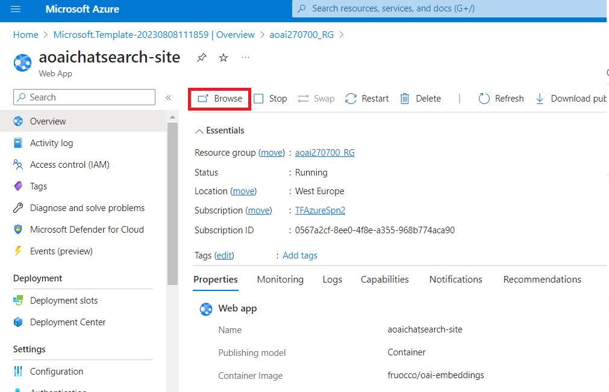
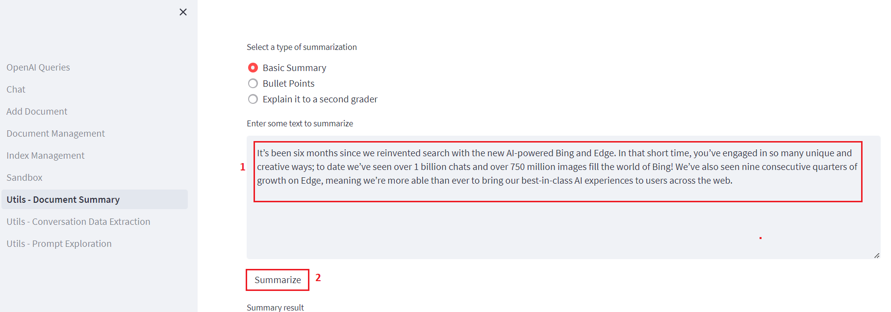

**Laboratório 07: Implementando perguntas e respostas usando resposta
semântica**

**Introdução**

Uma aplicação web simples para pesquisa de documentos habilitada para
OpenAI. Este repositório utiliza o Serviço OpenAI do Azure para criar
vetores de incorporação a partir de documentos. Para responder à
pergunta de um usuário, ele recupera o documento mais relevante e, em
seguida, utiliza o GPT-3 para extrair a resposta correspondente à
pergunta.

**Objetivos**

- Implementar modelos de chat e incorporação no Azure AI Studio.

- Usar um modelo personalizado para implementar os recursos necessários,
  como App Service, Search Service, reconhecedor de formulários, etc.

- Implementar o aplicativo Web aoaichatsearch-site e executar pesquisa
  de documentos habilitada para Azure OpenAI, resumo de texto e extração
  de dados de conversas.

- Excluir os recursos e modelos implementados.

## **Tarefa 1: Criar recurso Azure OpenAI**

1.  Na página inicial do portal do Azure, clique no **menu do portal do
    Azure** representado por três barras horizontais no lado esquerdo da
    barra de comandos do Microsoft Azure, conforme mostrado na imagem
    abaixo.

> 

2.  Navegue e clique em **+ Create a resource**.

> 

3.  Na página **Create a resource**, na barra de pesquisa **Search
    services and marketplace**, digite **Azure OpenAI** e pressione o
    botão **Enter** .

> 

4.  Na página **Marketplace,** navegue até a seção **Azure OpenAI,**
    clique no botão suspenso Create e selecione **Azure OpenAI,**
    conforme mostrado na imagem. (Caso você já tenha clicado em
    **Azure** **OpenAI** e, em seguida, clique no botão **Create** na
    **página Azure OpenAI** ).

> 

5.  Na janela **Create Azure OpenAI,** na guia **Basics**, insira os
    seguintes detalhes e clique no botão **Next**.

[TABLE]

> 

6.  Na aba **Network**, deixe todos os botões de opção no estado padrão
    e clique no botão **Next**.

> 

7.  Na aba **Tags,** deixe todos os campos no estado padrão e clique no
    botão **Next**.

> 

8.  Na aba **Review+submit**, após a validação ser aprovada, clique no
    botão **Create**.

> 

9.  Aguarde a conclusão da implementação, o que pode levar de 2 a 3
    minutos.

10. Na janela **Microsoft.CognitiveServicesOpenAI,** após a conclusão da
    implementação, clique no botão **Go to resource**.

> 

11. Na janela **Azure-open-testXX | Model deployments,** navegue até a
    seção **Resource Management** e clique em **Keys and Endpoints**.

12. Na página **Keys and Endpoints**, copie os valores **KEY1, KEY 2** e
    **Endpoint** e cole-os em um bloco de notas, conforme mostrado na
    imagem abaixo. Em seguida, **Salve** o bloco de notas para usar as
    informações no próximo laboratório.

## **Tarefa 2: Implementar o modelo de chat e o modelo de incorporação**

1.  Na página **Azure-openai-testXX**, clique em **Overview** no menu de
    navegação do lado esquerdo, role para baixo e clique no botão
    **Explore Azure AI Foundry portal,** conforme mostrado na imagem
    abaixo.

> 

2.  Aguarde até que o Azure OpenAI Studio seja iniciado.

> 

3.  Na página inicial do **Azure AI Foundry** |**Azure OpenAI Studio**
    selecione **Deployment** no menu de navegação à esquerda**.**

4.  Na janela **Deployment**, clique na seta ao lado de **+Deploy
    model** e selecione **Deploy base model.**

> 

5.  Na caixa de diálogo **Select a model**, navegue e selecione
    cuidadosamente **gpt-4** e, em seguida, clique no botão **Confirm**.

6.  Selecione a **Model version** como **0125-Preview,** em **Deployment
    type** como **Standard,** no **campo Deployment name**, digite
    **gpt-4** e clique no botão **Create**.

> 

7.  Na janela **Deployments**, clique na seta ao lado de **+Deploy
    model** e selecione **Deploy base model.**

> 

8.  Na caixa de diálogo **Select a model**, navegue e selecione
    cuidadosamente **text-embedding-ada-002** e então clique no botão
    **Confirm.**

9.  Na caixa de diálogo **Deploy model**, em **Deployment name** digite
    +++**text-embedding-ada-002+++,** selecione **Standard** como
    **Deployment type** e clique no botão **Deploy**.

## **Tarefa 3: Implementar no Azure (Aplicativo web+ Processamento em Lote) com o Azure Cognitive Search**

1.  Abra seu navegador Edge, navegue até a barra de endereço e digite ou
    cole o seguinte URL:
    <https://portal.azure.com/#create/Microsoft.Template/uri/https%3A%2F%2Fraw.githubusercontent.com%2Fruoccofabrizio%2Fazure-open-ai-embeddings-qna%2Fmain%2Finfrastructure%2Fdeployment_ACS.json>
    Em seguida, pressione **Enter.**

2.  Na janela **Custom deployment**, na guia **Basics**, insira os
    seguintes detalhes para implementar o modelo personalizado e clique
    em **Review + create.**

[TABLE]

3.  Na aba **Review + create**, após a validação ser aprovada, clique no
    botão **Create** .

4.  Aguarde a conclusão da implementação. A implementação levará cerca
    de 15 a 17 minutos.

> 

5.  Clique no botão **Go to resource group**.

> 

## **Tarefa 4: Pesquisa de documentos habilitada para Azure OpenAI por meio de aplicativo web**

1.  Na janela do grupo de recursos **aoaiXXX -RG**, na guia
    **Resources**, navegue até o **App Service** -
    **aoaaichatsearch-site** e clique nele.

2.  Na página **Overview** do aplicativo da Web do
    **aoaichatsearch-site**, navegue até a barra de comando e clique em
    **Browse**, Isso irá redirecioná-lo para a aplicação web
    implementada.

3.  Aguarde a conclusão da implementação da aplicação web. O processo
    levará aproximadamente **10 a 15** minutos.

4.  Na página inicial da aplicação web, para verificar o status das
    implementações, clique no botão **Check deployments** localizado na
    seção Microsoft.

5.  Para verificar o status da implementação, pode levar cerca de 5 a 6
    minutos.

6.  Na página inicial do aplicativo Web, navegue e clique em **Add
    Document** no lado esquerdo para adicionar os dados.

7.  No painel **Add Document**, clique no botão **Browse files** para
    carregar documentos que precisam ser adicionados à base de
    conhecimento.

8.  Navegue até o local **C:\Labfiles\Contoso Electronics** na VM e
    selecione **Benefit_Options.pdf,** então clique no botão **Open**.

9.  Clique novamente em **Browse files,** navegue até o local
    **C:\Labfiles\Contoso Electronics** na VM e selecione
    **employee_handbook.pdf**, então clique no botão **Open**.

10. Da mesma forma, adicione
    **Northwind_Health_Plus_Benefits_Details.pdf** e
    **Northwind_Standard_Benefits_Details.pdf**

11. Os dados enviados serão adicionados à base de conhecimento e pode
    levar aproximadamente de 5 a 7 minutos.

12. Clique em **Document Management** para verificar se os arquivos
    foram enviados com sucesso ou não.

13. Clique em **Index Management** para verificar os arquivos, chaves e
    origem.

14. Em seguida, clique em **Chat.**

15. Na seção **S Chat session**, insira o seguinte prompt, pressione o
    botão **Enter** e visualize a resposta.

**You**: **what is the employee's portion of the healthcare cost from
each paycheck in Contoso Electronics**

16. Na seção **Chat session**, clique no botão **Clear chat**.

17. Na seção **Chat session**, insira o seguinte prompt, pressione o
    botão **Enter** e visualize a resposta.

**You**: **How do I file a complaint or appeal with Northwind Health
Plus?**

18. Na seção **Chat session**, clique no botão **Clear chat**.

19. Na seção **Chat session**, insira o seguinte prompt. Em seguida,
    pressione o botão **Enter** e visualize a resposta.

**You**: **Does my plan covers my eye exams?**

20. Clique em **Utils-Document Summary** no lado esquerdo.

21. Na seção **Summarization**, selecione o botão de opção **Basic
    Summary.**

22. Na janela **Summarization**, na seção **Enter some text to
    summarize**, na caixa de mensagem, substitua o texto atual pelo
    seguinte e clique no botão **Summarize**.

It’s been six months since we reinvented search with [the new AI-powered
Bing and
Edge](https://blogs.microsoft.com/blog/2023/02/07/reinventing-search-with-a-new-ai-powered-microsoft-bing-and-edge-your-copilot-for-the-web/).
In that short time, you’ve engaged in so many unique and creative ways;
to date we’ve seen over 1 billion chats and over 750 million images fill
the world of Bing! We’ve also seen nine consecutive quarters of growth
on Edge, meaning we’re more able than ever to bring our best-in-class AI
experiences to users across the web.

23. Verifique o resumo do texto que você inseriu.

24. Após revisar o resultado do Resumo, clique no botão **Clear
    summary**.

25. Agora, role para cima e selecione o botão de **Bullet Points**. Na
    seção **Enter some text to summarize**, na caixa de mensagem,
    substitua o texto atual pelo seguinte e clique no botão
    **Summarize**.

Microsoft has made its Azure OpenAI Service generally available,
bringing the enterprise generative AI tools out of its invite-only
program. Now any customers who meet Microsoft’s standards can access the
professional versions of OpenAI’s large language model GPT-3.5 and the
related text-to-image tool DALL-E 2, computer programming assistant
Codex, and the popular ChatGPT chatbot interface for the LLM.

Microsoft launched the Azure OpenAI Service with an eye toward offering
businesses a way to develop apps without coding, write reports, and put
together marketing content. The scope has grown since then to encompass
new facets of the OpenAI’s models, including chat and visuals. Those
interested in the tools have to explain how they will use the AI tools
and agree to Microsoft’s ethical guidelines in their application for
access. The decision to widen the Azure OpenAI Service’s availability
arrives in tandem with Microsoft’s plans to integrate ChatGPT and DALL-E
into its Office suite, Bing search engine, and other consumer products.
Azure OpenAI Service followed earlier experiments to integrate GPT-3
into Microsoft projects like the low-code Power Apps programming tool
and the GitHub Copilot programming assistant.

26. Você verá os resultados resumidos na forma de marcadores.

27. Clique em **Utils-Conversation Data Extraction** no lado esquerdo.

28. No painel de **Conversation data extraction**, clique em **Execute
    tasks** e veja a resposta em **OpenAI result**.

29. Revise os dados extraídos da conversa entre o Agente e o Usuário.

## Tarefa 5: Excluir os recursos e modelos implementados

1.  Para excluir os recursos implementados, navegue até a página **Azure
    portal home** e clique em **Resource groups**.

> 

2.  Na página Resource groups, selecione os seus grupos de recursos.

> 

3.  Na página inicial do **Resource group**, selecione todos os recursos
    e clique em **delete**

4.  No painel **Delete Resources** que aparece no lado direito, navegue
    até o campo **Enter “delete” para confirmar a exclusão e,** em
    seguida, clique no botão **Delete**.

5.  Na caixa de diálogo de **Delete confirmation**, clique no botão
    **Delete**.

> 

6.  Clique no ícone do sino e você verá a notificação

**Resumo**

Você implantou o modelo de chat gpt -4 e o modelo de incorporação
text-embedding-ada-002 no seu Azure AI Studio e, em seguida, implantou
os recursos necessários usando um modelo personalizado. Você carregou
documentos não estruturados no aplicativo Web aoaichatsearch-site e
extraiu as informações precisas em uma sessão de chat. Você gerou um
resumo básico e com marcadores a partir de textos de exemplo e, em
seguida, extraiu os dados de uma conversa. Ao final do laboratório, você
excluiu os recursos e modelos para gerenciar seus recursos do Azure
OpenAI com eficiência.

**Observação importante : não exclua o Grupo de Recursos. Se for
excluído, você não poderá prosseguir para o próximo laboratório nem
criar um novo Grupo de Recursos.**

**Não exclua o Serviço Azure OpenAI (Azure-openai-testXX). O mesmo
serviço será usado em todos os laboratórios.**
